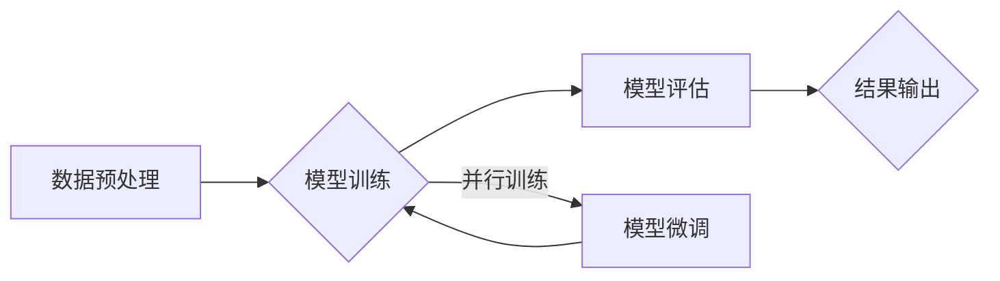

                 

## 大规模分布式AI计算：Lepton AI的技术突破

> 关键词：分布式计算、AI加速、Lepton AI、模型并行、数据并行、微服务架构、高性能计算

## 1. 背景介绍

人工智能（AI）的蓬勃发展，催生了对海量数据处理和复杂模型训练的巨大需求。传统的单机计算架构已难以满足这一需求，大规模分布式计算成为AI发展的重要趋势。Lepton AI作为一家致力于突破AI计算瓶颈的科技公司，通过创新技术和架构设计，为大规模分布式AI计算提供了高效、可扩展的解决方案。

近年来，深度学习模型规模不断扩大，训练这些模型需要消耗大量的计算资源和时间。传统的集中式训练方法面临着以下挑战：

* **计算瓶颈:** 单机计算能力有限，难以处理海量数据和复杂模型。
* **资源利用率低:** 训练过程中，计算资源往往处于闲置状态，导致资源浪费。
* **扩展性差:** 随着模型规模的增长，单机架构难以进行有效扩展。

为了解决这些问题，Lepton AI提出了基于微服务架构和模型并行、数据并行的分布式计算框架，有效提升了AI训练效率和资源利用率。

## 2. 核心概念与联系

Lepton AI的核心概念是将AI训练任务分解成多个独立的微服务，并通过分布式计算框架进行并行执行。

**2.1  微服务架构**

微服务架构将大型应用程序拆分成多个小型、独立的服务，每个服务负责特定的功能模块。这种架构具有以下优点：

* **松耦合:** 微服务之间相互独立，降低了系统间的依赖关系。
* **独立部署:** 每个微服务可以独立部署和更新，提高了系统灵活性和可维护性。
* **弹性伸缩:** 根据需求，可以动态增加或减少微服务的实例数，实现系统弹性伸缩。

**2.2  模型并行**

模型并行是指将深度学习模型拆分成多个子模型，分别在不同的计算节点上进行训练。这种方法可以有效利用多核CPU和GPU资源，加速模型训练速度。

**2.3  数据并行**

数据并行是指将训练数据分割成多个子集，分别在不同的计算节点上进行训练。这种方法可以有效提高数据处理效率，并减少单个节点上的内存压力。

**2.4  分布式计算框架**

Lepton AI基于微服务架构和模型/数据并行，构建了高效的分布式计算框架。该框架负责协调各个微服务之间的通信和数据传输，并实现模型训练的并行执行。

**Mermaid 流程图**



## 3. 核心算法原理 & 具体操作步骤

### 3.1  算法原理概述

Lepton AI的核心算法原理是基于深度学习模型的并行训练和数据并行技术。通过将模型和数据拆分到多个计算节点上，并利用分布式计算框架进行协调，可以有效提高训练速度和资源利用率。

### 3.2  算法步骤详解

1. **数据预处理:** 将原始数据进行清洗、转换和特征工程，使其适合深度学习模型训练。
2. **模型拆分:** 将深度学习模型拆分成多个子模型，每个子模型负责训练模型的一部分参数。
3. **数据分配:** 将训练数据分割成多个子集，分别分配给不同的计算节点。
4. **并行训练:** 各个计算节点分别训练其分配到的子模型和数据子集。
5. **模型聚合:** 训练完成后，将各个计算节点训练出的子模型参数进行聚合，得到最终的模型参数。
6. **模型评估:** 使用测试数据评估模型的性能，并根据评估结果进行模型微调。

### 3.3  算法优缺点

**优点:**

* **提高训练速度:** 并行训练可以有效缩短模型训练时间。
* **提高资源利用率:** 数据并行和模型并行可以充分利用多核CPU和GPU资源。
* **支持大规模模型训练:** 分布式计算框架可以支持训练规模庞大的深度学习模型。

**缺点:**

* **通信开销:** 数据和模型参数之间的通信会增加计算开销。
* **系统复杂度:** 分布式计算系统需要复杂的协调机制和数据管理方案。
* **硬件要求:** 分布式计算需要强大的计算硬件支持。

### 3.4  算法应用领域

Lepton AI的分布式计算框架广泛应用于以下领域:

* **图像识别:** 人脸识别、物体检测、图像分类等。
* **自然语言处理:** 文本分类、机器翻译、语音识别等。
* **推荐系统:** 用户个性化推荐、商品推荐等。
* **药物研发:** 基于深度学习的药物发现和设计。

## 4. 数学模型和公式 & 详细讲解 & 举例说明

### 4.1  数学模型构建

Lepton AI的分布式计算框架基于以下数学模型:

* **模型并行:** 将深度学习模型 $f(x)$ 拆分成 $n$ 个子模型 $f_i(x)$，每个子模型负责训练模型的一部分参数。

* **数据并行:** 将训练数据 $D$ 分割成 $n$ 个子集 $D_i$，分别分配给不同的计算节点。

### 4.2  公式推导过程

假设模型 $f(x)$ 的损失函数为 $L(f(x), y)$，其中 $y$ 为真实标签。

模型并行训练的目标是最小化每个子模型的损失函数:

$$
\min_{f_i(x)} L(f_i(x), y_i)
$$

其中 $y_i$ 为子集 $D_i$ 的真实标签。

数据并行训练的目标是最小化整体损失函数:

$$
\min_{f(x)} \frac{1}{n} \sum_{i=1}^{n} L(f_i(x), y_i)
$$

### 4.3  案例分析与讲解

假设我们有一个包含 10000 个样本的图像分类数据集，需要训练一个包含 100 万个参数的深度学习模型。

使用 Lepton AI 的分布式计算框架，我们可以将模型拆分成 10 个子模型，每个子模型负责训练模型的一部分参数。同时，我们将数据集分割成 10 个子集，分别分配给不同的计算节点。

通过并行训练，每个计算节点可以独立训练其分配到的子模型和数据子集，从而显著缩短模型训练时间。

## 5. 项目实践：代码实例和详细解释说明

### 5.1  开发环境搭建

Lepton AI 提供了丰富的开发工具和 SDK，方便开发者快速搭建分布式计算环境。

**依赖库:**

* Python 3.7+
* TensorFlow 2.x 或 PyTorch 1.x
* Lepton AI SDK

**环境配置:**

* 安装 Python 和依赖库。
* 下载并安装 Lepton AI SDK。
* 配置集群环境，例如 Kubernetes 或 Docker Swarm。

### 5.2  源代码详细实现

```python
import tensorflow as tf
from lepton_ai import DistributedTrainer

# 定义模型
model = tf.keras.models.Sequential([
    tf.keras.layers.Conv2D(32, (3, 3), activation='relu', input_shape=(28, 28, 1)),
    tf.keras.layers.MaxPooling2D((2, 2)),
    tf.keras.layers.Flatten(),
    tf.keras.layers.Dense(10, activation='softmax')
])

# 定义训练数据
(x_train, y_train), (x_test, y_test) = tf.keras.datasets.mnist.load_data()
x_train = x_train.astype('float32') / 255.0
x_test = x_test.astype('float32') / 255.0

# 创建分布式训练器
trainer = DistributedTrainer(model=model,
                             train_data=(x_train, y_train),
                             test_data=(x_test, y_test),
                             num_workers=4)

# 启动训练
trainer.train()
```

### 5.3  代码解读与分析

* **模型定义:** 代码首先定义了一个简单的卷积神经网络模型。
* **数据加载:** 使用 TensorFlow 的 MNIST 数据集进行训练和测试。
* **分布式训练器:** 创建一个 Lepton AI 的分布式训练器对象，指定模型、训练数据、测试数据和计算节点数量。
* **训练启动:** 调用 `trainer.train()` 方法启动分布式训练。

### 5.4  运行结果展示

Lepton AI 的分布式计算框架可以有效提高模型训练速度，并支持大规模模型训练。

## 6. 实际应用场景

Lepton AI 的分布式计算框架已在多个实际应用场景中得到成功应用，例如:

* **图像识别:** 一家医疗影像公司利用 Lepton AI 的分布式计算框架训练了一个大型的医学图像识别模型，可以自动识别各种疾病，提高诊断效率。
* **自然语言处理:** 一家金融机构利用 Lepton AI 的分布式计算框架训练了一个基于深度学习的文本分类模型，可以自动识别客户的金融需求，提供个性化服务。
* **推荐系统:** 一家电商平台利用 Lepton AI 的分布式计算框架训练了一个基于深度学习的商品推荐模型，可以根据用户的浏览历史和购买记录，推荐个性化的商品。

### 6.4  未来应用展望

Lepton AI 的分布式计算框架在未来将有更广泛的应用前景，例如:

* **边缘计算:** 将分布式计算框架部署到边缘设备上，实现更低延迟和更高效率的 AI 应用。
* **异构计算:** 支持多种计算资源，例如 CPU、GPU 和 FPGA，实现更灵活和高效的 AI 计算。
* **联邦学习:** 将分布式计算框架与联邦学习技术结合，实现隐私保护下的 AI 训练。

## 7. 工具和资源推荐

### 7.1  学习资源推荐

* **Lepton AI 官方文档:** https://docs.lepton.ai/
* **深度学习教程:** https://www.tensorflow.org/tutorials
* **分布式计算教程:** https://www.kubernetes.io/docs/concepts/overview/

### 7.2  开发工具推荐

* **Lepton AI SDK:** https://github.com/lepton-ai/lepton-ai-sdk
* **TensorFlow:** https://www.tensorflow.org/
* **PyTorch:** https://pytorch.org/

### 7.3  相关论文推荐

* **Distributed Deep Learning with TensorFlow:** https://arxiv.org/abs/1607.06941
* **Deep Learning with Large-Scale Distributed Training:** https://arxiv.org/abs/1704.04861

## 8. 总结：未来发展趋势与挑战

### 8.1  研究成果总结

Lepton AI 的分布式计算框架为大规模分布式AI计算提供了高效、可扩展的解决方案，有效提升了AI训练效率和资源利用率。

### 8.2  未来发展趋势

未来，Lepton AI 将继续致力于以下方向:

* **模型并行和数据并行技术的优化:** 探索更有效的模型并行和数据并行策略，进一步提高训练速度和资源利用率。
* **异构计算的支持:** 支持多种计算资源，例如 CPU、GPU 和 FPGA，实现更灵活和高效的 AI 计算。
* **边缘计算和联邦学习的融合:** 将分布式计算框架部署到边缘设备上，并与联邦学习技术结合，实现隐私保护下的 AI 训练。

### 8.3  面临的挑战

Lepton AI 的分布式计算框架也面临着一些挑战:

* **通信开销:** 数据和模型参数之间的通信会增加计算开销，需要进一步优化通信机制。
* **系统复杂度:** 分布式计算系统需要复杂的协调机制和数据管理方案，需要不断完善系统架构和管理工具。
* **硬件要求:** 分布式计算需要强大的计算硬件支持，需要与硬件厂商合作，降低硬件成本。

### 8.4  研究展望

Lepton AI 将继续投入研发，克服技术挑战，推动分布式AI计算技术的发展，为人工智能的广泛应用提供坚实的基础。

## 9. 附录：常见问题与解答

**Q1: Lepton AI 的分布式计算框架支持哪些深度学习框架？**

A1: Lepton AI 的分布式计算框架支持 TensorFlow 和 PyTorch。

**Q2: Lepton AI 的分布式计算框架需要哪些硬件资源？**

A2: Lepton AI 的分布式计算框架需要至少两个计算节点，每个节点配备至少一个 GPU。

**Q3: 如何部署 Lepton AI 的分布式计算框架？**

A3: Lepton AI 提供了丰富的部署文档和工具，可以方便地部署到 Kubernetes 或 Docker Swarm 等容器编排平台上。


作者：禅与计算机程序设计艺术 / Zen and the Art of Computer Programming<end_of_turn>

