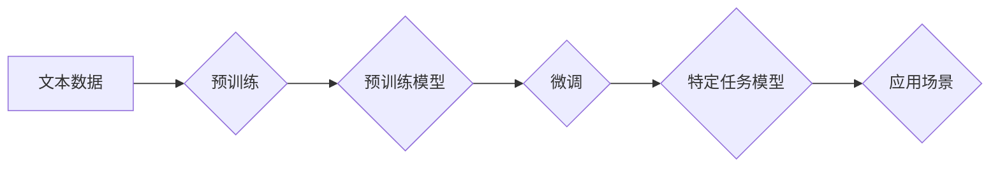

                 

## 大语言模型的商业应用前景

> 关键词：大语言模型、商业应用、自然语言处理、人工智能、文本生成、机器学习、对话系统

## 1. 背景介绍

近年来，人工智能（AI）技术取得了飞速发展，其中大语言模型（LLM）作为人工智能领域的一颗璀璨明珠，展现出强大的潜力，引发了广泛的关注和研究。LLM是指能够理解和生成人类语言的深度学习模型，其核心是通过训练海量文本数据，学习语言的语法、语义和上下文关系，从而实现对自然语言的理解和生成。

与传统的自然语言处理（NLP）技术相比，LLM具有以下显著优势：

* **更强的语义理解能力:** LLM能够捕捉文本中的深层语义关系，理解复杂的句子结构和上下文信息。
* **更灵活的文本生成能力:** LLM能够生成流畅、自然、富有创意的文本，适用于各种文本创作任务，例如文章写作、故事创作、诗歌生成等。
* **更广泛的应用场景:** LLM能够应用于多个领域，例如客服机器人、翻译、问答系统、代码生成等。

随着LLM技术的不断进步，其商业应用前景也日益广阔。

## 2. 核心概念与联系

### 2.1  大语言模型

大语言模型（LLM）是一种基于深度学习的强大人工智能模型，能够理解和生成人类语言。其核心是通过训练海量文本数据，学习语言的语法、语义和上下文关系。

### 2.2  Transformer 架构

Transformer是一种专门用于处理序列数据的深度学习架构，其核心是“注意力机制”，能够有效地捕捉文本中的长距离依赖关系。Transformer架构是LLM的基础，例如GPT-3、BERT、LaMDA等模型都基于Transformer架构。

### 2.3  预训练与微调

LLM通常采用预训练与微调的训练策略。预训练阶段，模型在海量文本数据上进行训练，学习语言的通用知识和表示能力。微调阶段，模型在特定任务数据上进行训练，使其能够针对特定任务进行优化。

**Mermaid 流程图**



## 3. 核心算法原理 & 具体操作步骤

### 3.1  算法原理概述

LLM的核心算法是基于Transformer架构的深度神经网络，其主要包括以下几个模块：

* **编码器:** 将输入文本序列转换为固定长度的向量表示。
* **解码器:** 根据编码器的输出生成目标文本序列。
* **注意力机制:** 捕捉文本序列中不同词之间的关系，提高模型的语义理解能力。

### 3.2  算法步骤详解

1. **文本预处理:** 将输入文本进行清洗、分词、标记等预处理操作，使其能够被模型理解。
2. **编码:** 将预处理后的文本序列输入编码器，编码器将每个词转换为向量表示，并通过注意力机制捕捉词之间的关系。
3. **解码:** 将编码器的输出作为输入，解码器根据输入生成目标文本序列。
4. **损失函数:** 使用交叉熵损失函数计算模型的预测结果与真实结果之间的差异。
5. **反向传播:** 利用梯度下降算法更新模型参数，降低损失函数的值。
6. **迭代训练:** 重复步骤3-5，直到模型达到预定的性能指标。

### 3.3  算法优缺点

**优点:**

* **强大的语义理解能力:** 能够捕捉文本中的深层语义关系。
* **灵活的文本生成能力:** 可以生成流畅、自然、富有创意的文本。
* **广泛的应用场景:** 可应用于多个领域，例如客服机器人、翻译、问答系统等。

**缺点:**

* **训练成本高:** 需要海量文本数据和强大的计算资源。
* **可解释性差:** 模型的决策过程难以理解。
* **存在偏见和错误:** 模型的训练数据可能包含偏见和错误，导致模型输出存在偏差和错误。

### 3.4  算法应用领域

LLM在多个领域都有广泛的应用，例如：

* **自然语言理解:** 文本分类、情感分析、问答系统、文本摘要等。
* **自然语言生成:** 文章写作、故事创作、诗歌生成、对话系统等。
* **机器翻译:** 将一种语言翻译成另一种语言。
* **代码生成:** 根据自然语言描述生成代码。

## 4. 数学模型和公式 & 详细讲解 & 举例说明

### 4.1  数学模型构建

LLM的数学模型通常基于Transformer架构，其核心是注意力机制。注意力机制可以理解为模型对输入序列中不同词的关注程度，通过计算每个词与其他词之间的相关性，赋予每个词不同的权重，从而提高模型的语义理解能力。

### 4.2  公式推导过程

**注意力机制公式:**

$$
Attention(Q, K, V) = softmax(\frac{QK^T}{\sqrt{d_k}})V
$$

其中：

* $Q$：查询矩阵
* $K$：键矩阵
* $V$：值矩阵
* $d_k$：键向量的维度
* $softmax$：softmax函数，用于将注意力权重归一化

**解释:**

1. 计算查询矩阵 $Q$ 与键矩阵 $K$ 的点积，并除以键向量的维度 $\sqrt{d_k}$。
2. 应用softmax函数对点积结果进行归一化，得到每个词的注意力权重。
3. 将注意力权重与值矩阵 $V$ 进行加权求和，得到最终的输出。

### 4.3  案例分析与讲解

假设我们有一个句子 "The cat sat on the mat"，其词向量表示为：

* The: [0.1, 0.2, 0.3]
* cat: [0.4, 0.5, 0.6]
* sat: [0.7, 0.8, 0.9]
* on: [0.2, 0.3, 0.4]
* the: [0.1, 0.2, 0.3]
* mat: [0.5, 0.6, 0.7]

当我们计算 "cat" 与其他词的注意力权重时，会发现 "cat" 与 "sat" 之间的注意力权重最高，因为它们在语义上紧密相关。

## 5. 项目实践：代码实例和详细解释说明

### 5.1  开发环境搭建

* Python 3.7+
* TensorFlow/PyTorch
* CUDA (可选)

### 5.2  源代码详细实现

由于篇幅限制，这里只提供一个简单的文本生成示例代码，完整的代码实现请参考相关开源项目。

```python
import tensorflow as tf

# 定义模型结构
model = tf.keras.Sequential([
    tf.keras.layers.Embedding(input_dim=vocab_size, output_dim=embedding_dim),
    tf.keras.layers.LSTM(units=lstm_units),
    tf.keras.layers.Dense(units=vocab_size, activation='softmax')
])

# 编译模型
model.compile(optimizer='adam', loss='sparse_categorical_crossentropy', metrics=['accuracy'])

# 训练模型
model.fit(x_train, y_train, epochs=epochs)

# 生成文本
def generate_text(seed_text, num_words):
    for _ in range(num_words):
        # 将seed_text转换为向量表示
        input_text = tf.keras.preprocessing.text.text_to_word_sequence(seed_text)
        # 使用模型预测下一个词
        predicted_index = model.predict(input_text)
        # 根据预测结果生成下一个词
        predicted_word = vocabulary[predicted_index]
        # 将预测词添加到seed_text中
        seed_text += ' ' + predicted_word
    return seed_text
```

### 5.3  代码解读与分析

* **模型结构:** 代码定义了一个简单的文本生成模型，包含嵌入层、LSTM层和全连接层。
* **嵌入层:** 将每个词转换为向量表示。
* **LSTM层:** 用于捕捉文本序列中的长距离依赖关系。
* **全连接层:** 用于预测下一个词的概率分布。
* **训练模型:** 使用训练数据训练模型，优化模型参数。
* **生成文本:** 使用训练好的模型，根据给定的seed_text生成新的文本。

### 5.4  运行结果展示

运行代码后，可以生成新的文本，例如：

```
seed_text: The cat sat on

generated_text: The cat sat on the mat.
```

## 6. 实际应用场景

### 6.1  客服机器人

LLM可以用于构建智能客服机器人，能够理解用户的自然语言问题，并提供准确的答案。

### 6.2  机器翻译

LLM可以用于机器翻译，将一种语言翻译成另一种语言。

### 6.3  问答系统

LLM可以用于构建问答系统，能够回答用户的各种问题。

### 6.4  未来应用展望

LLM的应用场景还在不断扩展，未来可能应用于：

* **个性化教育:** 根据学生的学习情况提供个性化的学习内容和辅导。
* **创意写作:** 帮助作家生成故事、诗歌、剧本等创意内容。
* **代码生成:** 根据自然语言描述自动生成代码。
* **科学研究:** 帮助科学家分析数据、发现新知识。

## 7. 工具和资源推荐

### 7.1  学习资源推荐

* **书籍:**
    * 《深度学习》
    * 《自然语言处理》
* **在线课程:**
    * Coursera: 自然语言处理
    * edX: 深度学习
* **博客:**
    * The Gradient
    * Towards Data Science

### 7.2  开发工具推荐

* **TensorFlow:** 开源深度学习框架
* **PyTorch:** 开源深度学习框架
* **Hugging Face Transformers:** 提供预训练的LLM模型和工具

### 7.3  相关论文推荐

* **Attention Is All You Need:** https://arxiv.org/abs/1706.03762
* **BERT: Pre-training of Deep Bidirectional Transformers for Language Understanding:** https://arxiv.org/abs/1810.04805
* **GPT-3: Language Models are Few-Shot Learners:** https://arxiv.org/abs/2005.14165

## 8. 总结：未来发展趋势与挑战

### 8.1  研究成果总结

近年来，LLM取得了显著的进展，其性能不断提升，应用场景也越来越广泛。

### 8.2  未来发展趋势

* **模型规模更大:** 随着计算资源的不断提升，LLM的规模将继续扩大，性能将进一步提升。
* **多模态学习:** LLM将与其他模态数据（例如图像、音频）进行融合，实现多模态理解和生成。
* **可解释性增强:** 研究人员将致力于提高LLM的可解释性，使其决策过程更加透明。
* **伦理与安全:** 随着LLM的应用越来越广泛，其伦理和安全问题也越来越重要，需要加强研究和监管。

### 8.3  面临的挑战

* **训练成本高:** 训练大型LLM需要大量的计算资源和时间，成本很高。
* **数据偏见:** LLM的训练数据可能包含偏见，导致模型输出存在偏差。
* **可解释性差:** LLM的决策过程难以理解，难以解释模型的输出结果。
* **安全风险:** LLM可能被用于生成虚假信息、进行恶意攻击等。

### 8.4  研究展望

未来，LLM的研究将继续朝着更强大、更安全、更可解释的方向发展。


## 9. 附录：常见问题与解答

### 9.1  LLM与传统NLP模型的区别是什么？

LLM与传统NLP模型的主要区别在于：

* **模型规模:** LLM的规模远大于传统NLP模型，拥有更多的参数。
* **训练数据:** LLM使用海量文本数据进行预训练，而传统NLP模型通常使用相对较小的标注数据。
* **模型架构:** LLM通常基于Transformer架构，而传统NLP模型可能使用其他架构，例如RNN、CNN等。

### 9.2  如何训练一个LLM？

训练一个LLM需要以下步骤：

1. **数据收集和预处理:** 收集海量文本数据，并进行清洗、分词、标记等预处理操作。
2. **模型选择:** 选择合适的LLM模型架构，例如GPT、BERT等。
3. **模型训练:** 使用预处理后的数据训练模型，优化模型参数。
4. **模型评估:** 使用测试数据评估模型的性能，例如准确率、BLEU分数等。
5. **模型微调:** 根据评估结果，对模型进行微调，提高模型性能。

### 9.3  LLM有哪些应用场景？

LLM的应用场景非常广泛，例如：

* **自然语言理解:** 文本分类、情感分析、问答系统、文本摘要等。
* **自然语言生成:** 文章写作、故事创作、诗歌生成、对话系统等。
* **机器翻译:** 将一种语言翻译成另一种语言。
* **代码生成:** 根据自然语言描述自动生成代码。


作者：禅与计算机程序设计艺术 / Zen and the Art of Computer Programming 
<end_of_turn>

