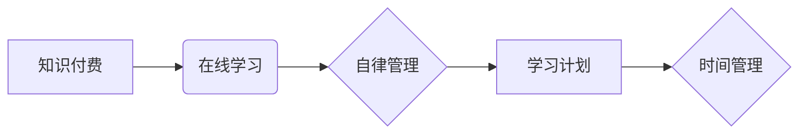

                 

## 如何利用知识付费实现在线学习计划与自律管理？

> 关键词：知识付费、在线学习、自律管理、学习计划、时间管理、效率提升

### 1. 背景介绍

在信息爆炸的时代，获取知识变得前所未有便捷。知识付费平台的兴起，为人们提供了更多选择和可能性。通过付费订阅课程、书籍、视频等，人们可以学习到各种专业技能、兴趣爱好和生活技巧。然而，面对海量知识资源，如何有效利用知识付费，制定合理的学习计划，并保持自律管理，成为了许多人面临的挑战。

### 2. 核心概念与联系

**2.1 知识付费**

知识付费是指通过付费的方式获取知识、技能和服务的商业模式。它打破了传统教育模式的限制，让知识更加易于获取和分享。

**2.2 在线学习**

在线学习是指利用互联网平台进行学习的模式。它不受时间和地域限制，提供了更加灵活和便捷的学习方式。

**2.3 自律管理**

自律管理是指个体能够自我约束，按照计划执行目标，并不断提升自我效能的能力。它对于高效学习至关重要。

**2.4 学习计划**

学习计划是指制定明确的学习目标、学习内容、学习时间和学习方法的计划。它能够帮助人们更好地组织学习，提高学习效率。

**2.5 时间管理**

时间管理是指合理安排和利用时间，提高时间利用率的技能。它对于高效学习和自律管理至关重要。

**核心概念关系图**



### 3. 核心算法原理 & 具体操作步骤

**3.1 算法原理概述**

高效学习的本质是通过合理的学习计划和自律管理，将知识付费平台提供的资源最大化利用。这需要结合时间管理、学习策略和个人特点，制定个性化的学习方案。

**3.2 算法步骤详解**

1. **明确学习目标:** 首先要明确自己想要学习什么，学习的目的是什么。
2. **选择合适的学习资源:** 根据学习目标，选择合适的知识付费平台和课程。
3. **制定学习计划:** 制定详细的学习计划，包括学习内容、学习时间、学习方法等。
4. **保持自律管理:** 严格按照学习计划执行，克服拖延和干扰，保持学习的专注力和持续性。
5. **定期评估和调整:** 定期评估学习效果，根据实际情况调整学习计划和方法。

**3.3 算法优缺点**

* **优点:** 
    * 灵活便捷: 可以根据个人时间和节奏进行学习。
    * 资源丰富: 可以选择到各种专业领域和兴趣爱好的课程。
    * 成本相对较低: 相比传统教育模式，知识付费平台的课程价格相对较低。
* **缺点:** 
    * 自律性要求高: 需要具备良好的自律管理能力，才能有效利用知识付费资源。
    * 信息过载: 面对海量知识资源，容易感到信息过载，难以选择合适的学习内容。
    * 学习效果难以评估: 缺乏专业的学习评估机制，难以准确评估学习效果。

**3.4 算法应用领域**

* **职业技能提升:** 学习新的编程语言、设计软件、管理技巧等。
* **兴趣爱好发展:** 学习绘画、音乐、写作、摄影等。
* **个人成长:** 学习心理学、哲学、历史、文化等。

### 4. 数学模型和公式 & 详细讲解 & 举例说明

**4.1 数学模型构建**

我们可以用一个简单的数学模型来描述知识付费学习的效率：

$$
Efficiency = \frac{Knowledge Gained}{Time Spent}
$$

其中：

* **Efficiency** 代表学习效率。
* **Knowledge Gained** 代表学习到的知识量。
* **Time Spent** 代表投入学习的时间。

**4.2 公式推导过程**

这个公式的推导过程很简单，就是将学习到的知识量与投入的时间进行比值。

**4.3 案例分析与讲解**

假设一个人花 10 小时学习了一门新的编程语言，并能够熟练运用该语言进行简单的程序开发，那么他的学习效率可以计算为：

$$
Efficiency = \frac{Knowledge Gained}{Time Spent} = \frac{熟练运用编程语言}{10小时}
$$

这个效率值可以用来评估学习效果，并帮助我们调整学习方法和时间分配。

### 5. 项目实践：代码实例和详细解释说明

**5.1 开发环境搭建**

为了更好地理解知识付费学习的实践，我们可以使用 Python 语言编写一个简单的学习计划管理工具。

**5.2 源代码详细实现**

```python
class LearningPlan:
    def __init__(self, name, tasks):
        self.name = name
        self.tasks = tasks
        self.completed_tasks = []

    def add_task(self, task):
        self.tasks.append(task)

    def complete_task(self, task_name):
        if task_name in self.tasks:
            self.completed_tasks.append(task_name)
            self.tasks.remove(task_name)
        else:
            print(f"任务 '{task_name}' 不存在")

    def display_plan(self):
        print(f"学习计划: {self.name}")
        print("待完成任务:")
        for task in self.tasks:
            print(f"- {task}")
        print("已完成任务:")
        for task in self.completed_tasks:
            print(f"- {task}")

# 创建学习计划
plan = LearningPlan("Python 学习计划", ["学习 Python 基础语法", "练习 Python 编程", "阅读 Python 文档"])

# 添加任务
plan.add_task("完成 Python 项目")

# 完成任务
plan.complete_task("学习 Python 基础语法")

# 显示学习计划
plan.display_plan()
```

**5.3 代码解读与分析**

这个代码实现了一个简单的学习计划管理工具。它包含了一个 `LearningPlan` 类，用于管理学习计划和任务。

* `__init__` 方法用于初始化学习计划，包括名称和任务列表。
* `add_task` 方法用于添加新的任务到学习计划中。
* `complete_task` 方法用于标记任务已完成。
* `display_plan` 方法用于显示学习计划的当前状态。

**5.4 运行结果展示**

运行这个代码，将会输出以下结果：

```
学习计划: Python 学习计划
待完成任务:
- 练习 Python 编程
- 阅读 Python 文档
- 完成 Python 项目
已完成任务:
- 学习 Python 基础语法
```

### 6. 实际应用场景

**6.1 在线课程学习**

知识付费平台提供了各种在线课程，涵盖各个领域。我们可以利用学习计划管理工具，将课程内容分解成一个个任务，并制定合理的学习时间，提高学习效率。

**6.2 书籍阅读**

我们可以将书籍阅读计划分解成一个个章节或主题，并利用学习计划管理工具，记录阅读进度和学习心得，提高阅读效率和理解深度。

**6.3 项目开发**

对于软件开发项目，我们可以利用学习计划管理工具，将项目分解成一个个模块或任务，并制定合理的开发时间和进度，提高项目开发效率。

**6.4 个人成长**

我们可以利用学习计划管理工具，制定个人成长计划，学习新的技能、培养新的兴趣爱好，提升自我价值。

**6.5 未来应用展望**

随着人工智能技术的不断发展，知识付费学习的效率将会得到进一步提升。未来，我们可以期待看到更加智能化的学习计划管理工具，能够根据个人的学习习惯和目标，自动生成个性化的学习计划，并提供更加精准的学习建议。

### 7. 工具和资源推荐

**7.1 学习资源推荐**

* **Coursera:** https://www.coursera.org/
* **edX:** https://www.edx.org/
* **Udemy:** https://www.udemy.com/
* **Skillshare:** https://www.skillshare.com/

**7.2 开发工具推荐**

* **Python:** https://www.python.org/
* **Visual Studio Code:** https://code.visualstudio.com/

**7.3 相关论文推荐**

* **Personalized Learning: A Survey**
* **Adaptive Learning Systems: A Review**

### 8. 总结：未来发展趋势与挑战

**8.1 研究成果总结**

知识付费学习模式的兴起，为人们提供了更加便捷和灵活的学习方式。通过合理的学习计划和自律管理，我们可以有效利用知识付费资源，提升学习效率和效果。

**8.2 未来发展趋势**

未来，知识付费学习将会更加个性化、智能化和交互化。人工智能技术将会在学习计划生成、学习内容推荐、学习效果评估等方面发挥更加重要的作用。

**8.3 面临的挑战**

知识付费学习模式也面临着一些挑战，例如信息过载、学习效果评估、知识更新速度等。我们需要不断探索新的解决方案，以更好地服务于学习者。

**8.4 研究展望**

未来，我们需要继续深入研究知识付费学习的机制和规律，探索更加有效的学习方法和工具，推动知识付费学习模式的健康发展。

### 9. 附录：常见问题与解答

**9.1 如何制定有效的学习计划？**

制定有效的学习计划需要考虑以下几个方面：

* **明确学习目标:** 首先要明确自己想要学习什么，学习的目的是什么。
* **选择合适的学习资源:** 根据学习目标，选择合适的知识付费平台和课程。
* **合理分配学习时间:** 根据自己的时间安排，合理分配学习时间。
* **设定可实现的目标:** 不要设定过于ambitious的目标，要根据自己的实际情况设定可实现的目标。
* **定期评估和调整:** 定期评估学习效果，根据实际情况调整学习计划和方法。

**9.2 如何保持自律管理？**

保持自律管理需要克服拖延和干扰，并养成良好的学习习惯。

* **设定明确的学习目标:** 明确的学习目标能够帮助我们保持动力和方向。
* **制定详细的学习计划:** 详细的学习计划能够帮助我们更好地组织学习。
* **营造良好的学习环境:** 远离干扰，创造一个安静舒适的学习环境。
* **利用番茄工作法:** 将学习时间分成一个个间隔，并在每个间隔结束后进行短暂休息。
* **奖励自己:** 当完成学习目标时，给自己一些奖励，以增强学习的积极性。


作者：禅与计算机程序设计艺术 / Zen and the Art of Computer Programming 
<end_of_turn>

