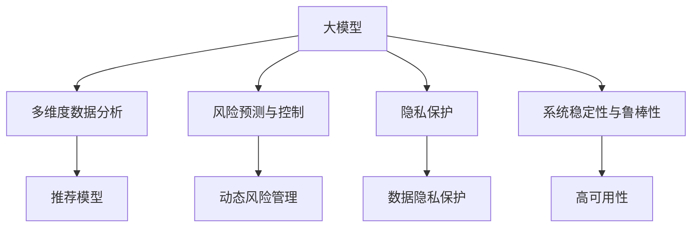

                 

# 大模型在金融产品推荐中的应用与风险

> 关键词：大模型, 金融产品推荐, 风险管理, 深度学习, 生成对抗网络, 风险预测

## 1. 背景介绍

### 1.1 问题由来

金融行业作为经济的血脉，其稳健发展对整个经济体的健康至关重要。随着互联网和数字技术的兴起，金融行业正经历着深刻的数字化转型。金融产品推荐系统作为金融科技的重要组成部分，通过对海量数据进行分析，帮助用户发现并购买适合自己的金融产品，成为提升用户体验、扩大市场覆盖、提升收益水平的重要手段。然而，金融产品推荐系统不仅要考虑用户的金融需求，还需平衡风险与收益，以确保系统的健康运行和用户的资产安全。

金融产品推荐系统面临的挑战主要包括：

- **数据多样性和高复杂性**：金融数据具有高度的时效性和动态性，同时包含多维度、异构的信息，如交易记录、信用评分、市场情绪等。
- **风险管理需求**：金融产品推荐系统的关键在于风险控制，需根据用户的风险承受能力和偏好进行合理的资产配置。
- **隐私和安全问题**：金融数据涉及用户的个人信息和财务状况，需要保证数据的安全存储和传输，避免数据泄露和滥用。
- **系统稳定性和鲁棒性**：金融交易具有高频性和低延迟性要求，推荐系统需保证高可用性和抗干扰性。

为应对这些挑战，大模型在金融产品推荐中的应用越来越广泛。利用大模型强大的数据处理和分析能力，可以从海量的金融数据中挖掘出更有价值的金融产品推荐和风险预测信息，帮助金融机构和用户实现双赢。

### 1.2 问题核心关键点

金融产品推荐系统的大模型应用，主要集中在以下几个方面：

- **多维度数据分析**：利用大模型处理异构、高维的金融数据，挖掘用户行为和市场特征，构建精准的推荐模型。
- **风险预测与控制**：通过大模型预测用户投资风险，实时监控市场波动，实现动态风险管理。
- **隐私保护与合规性**：利用大模型在确保数据隐私和安全的前提下，实现合规性的金融产品推荐。
- **系统稳定性与鲁棒性**：通过大模型的高性能计算，保证推荐系统的低延迟和高可用性。

这些核心关键点，构成了金融产品推荐系统大模型应用的框架，使得大模型在金融领域的应用具有极高的潜力。

## 2. 核心概念与联系

### 2.1 核心概念概述

为更好地理解大模型在金融产品推荐中的应用，本节将介绍几个关键概念：

- **大模型(Large Model)**：以深度学习模型为代表的具有海量参数和复杂结构的模型，如BERT、GPT、ResNet等。通过大规模训练，大模型具备强大的数据处理和分析能力，能够挖掘出复杂的数据模式。
- **金融产品推荐**：通过算法模型，根据用户的历史行为、偏好和市场环境，推荐最适合用户的金融产品。
- **风险预测与控制**：利用机器学习模型预测金融产品的风险，并在推荐时进行风险评估和控制，避免用户面临不合理的风险。
- **隐私保护**：在金融产品推荐中，保护用户的个人信息和财务数据，防止数据泄露和滥用。
- **系统稳定性与鲁棒性**：保证推荐系统的可靠性和抗干扰能力，确保金融交易的稳定进行。

这些核心概念之间的关系可以通过以下Mermaid流程图来展示：



这个流程图展示了大模型在金融产品推荐中的应用框架：

1. 大模型通过多维度数据分析，生成推荐模型。
2. 利用大模型进行风险预测与控制，动态调整推荐策略。
3. 在隐私保护的前提下，确保数据安全。
4. 通过提高大模型的稳定性与鲁棒性，保证系统的可靠运行。

这些概念共同构成了金融产品推荐系统的技术基础，使得大模型在金融领域的应用具有重要的实际意义。

## 3. 核心算法原理 & 具体操作步骤

### 3.1 算法原理概述

大模型在金融产品推荐中的应用，主要涉及以下几个算法原理：

- **多维度数据分析算法**：利用大模型处理异构、高维的金融数据，提取用户的偏好、市场特征等关键信息。
- **推荐算法**：基于用户历史行为和市场环境，利用大模型构建推荐模型，生成推荐结果。
- **风险预测与控制算法**：利用大模型进行风险预测，动态调整推荐策略，控制风险水平。
- **隐私保护算法**：利用大模型在保证数据隐私的前提下，进行合规性评估和安全处理。
- **系统稳定性与鲁棒性算法**：通过提高大模型的性能，保证推荐系统的稳定性和抗干扰能力。

### 3.2 算法步骤详解

以下是基于大模型进行金融产品推荐的主要算法步骤：

**Step 1: 数据收集与预处理**
- 收集用户的交易记录、信用评分、行为偏好等金融数据。
- 进行数据清洗和特征工程，处理缺失值、异常值，构建特征向量。

**Step 2: 模型训练与微调**
- 选择合适的大模型作为初始化参数，如BERT、ResNet等。
- 设计合适的训练集和验证集，进行多维度数据分析和推荐模型的训练与微调。
- 使用金融数据集进行风险预测与控制的训练与微调。
- 进行隐私保护与合规性评估的模型训练与微调。

**Step 3: 模型评估与优化**
- 在测试集上评估推荐模型的性能，如精确度、召回率、F1分数等。
- 使用A/B测试等方法，对比推荐效果与传统算法。
- 定期进行模型优化，更新训练数据集，调整模型参数。

**Step 4: 实时推荐与动态调整**
- 部署推荐模型到线上环境，进行实时推荐。
- 根据市场环境的变化，动态调整推荐策略，进行风险管理。
- 监控系统的运行状态，确保高可用性。

**Step 5: 隐私保护与合规性**
- 对用户数据进行脱敏处理，确保数据隐私。
- 对推荐系统进行合规性评估，确保符合金融法规和用户协议。

### 3.3 算法优缺点

大模型在金融产品推荐中的应用，具有以下优点：

1. **强大的数据分析能力**：大模型能够处理复杂多维度的金融数据，挖掘出用户偏好和市场特征，构建精准的推荐模型。
2. **高效的风险管理**：利用大模型进行风险预测与控制，动态调整推荐策略，降低用户的投资风险。
3. **隐私保护**：通过数据脱敏和加密等技术，确保用户数据的隐私和安全。
4. **系统稳定性与鲁棒性**：大模型的高性能计算能力，确保推荐系统的低延迟和高可用性。

同时，大模型在金融产品推荐中的应用也存在一些局限性：

1. **模型复杂度高**：大模型的复杂结构和高参数量，对计算资源和存储资源的要求较高。
2. **数据依赖性强**：大模型的性能依赖于高质量的训练数据，数据不足或偏差可能导致推荐效果不佳。
3. **模型解释性差**：大模型的决策过程难以解释，可能缺乏透明度和可解释性。
4. **风险控制难度大**：大模型的动态调整可能存在算法漏洞，难以保证风险控制的效果。
5. **隐私风险高**：数据脱敏和加密技术的不足可能导致数据泄露，影响用户的隐私安全。

### 3.4 算法应用领域

大模型在金融产品推荐中的应用，已经涵盖了多个领域，如：

- **个人理财推荐**：根据用户的收入、支出、投资偏好等数据，推荐适合的理财产品和投资策略。
- **保险产品推荐**：利用用户的健康记录、风险偏好等数据，推荐合适的保险产品和保障方案。
- **基金投资推荐**：根据用户的历史投资记录和市场环境，推荐适合的基金产品。
- **信贷产品推荐**：利用用户的信用评分和还款记录，推荐适合的信贷产品和利率方案。
- **理财顾问咨询**：利用大模型的深度学习能力和自然语言处理能力，提供个性化的理财咨询和建议。

这些应用场景展示了大模型在金融产品推荐中的广泛适用性，为金融科技的发展提供了重要支撑。

## 4. 数学模型和公式 & 详细讲解 & 举例说明

### 4.1 数学模型构建

为更好地理解大模型在金融产品推荐中的应用，本节将使用数学语言对推荐模型进行详细讲解。

假设金融产品推荐系统包含 $N$ 个用户，每个用户有 $M$ 个历史交易记录 $(x_i)_{i=1}^N$，每个交易记录由 $D$ 维特征向量表示，即 $x_i \in \mathbb{R}^D$。设推荐系统的目标为生成一个 $K$ 维的用户-产品评分矩阵 $Y \in \mathbb{R}^{N \times K}$，其中 $Y_{i,k}$ 表示用户 $i$ 对产品 $k$ 的评分。

推荐模型的目标函数为：

$$
\min_{\theta} \sum_{i=1}^N \sum_{k=1}^K (Y_{i,k} - f_{\theta}(x_i, k))^2
$$

其中，$f_{\theta}$ 为大模型推荐的评分函数，$\theta$ 为模型参数。

### 4.2 公式推导过程

利用大模型进行推荐的过程，主要包括以下几个步骤：

**Step 1: 数据预处理**
- 对用户的交易记录进行特征提取和标准化处理。
- 将用户和产品的特征向量表示为 $x_i \in \mathbb{R}^D$ 和 $y_k \in \mathbb{R}^D$。

**Step 2: 模型训练**
- 选择合适的大模型作为推荐函数 $f_{\theta}$，如BERT、ResNet等。
- 设计合适的损失函数，如均方误差损失，对模型进行训练和微调。

**Step 3: 模型预测**
- 利用训练好的大模型对新用户和产品的特征向量进行评分预测。
- 通过迭代优化，得到最优的评分函数 $f_{\theta}(x_i, k)$。

**Step 4: 推荐结果生成**
- 将用户和产品的评分预测结果组合成用户-产品评分矩阵 $Y$。
- 根据评分矩阵 $Y$ 生成推荐结果，如推荐列表、评分排序等。

### 4.3 案例分析与讲解

假设有一个金融机构，希望利用大模型为某用户推荐理财产品。根据用户的历史交易记录 $x_i$，选择大模型作为推荐函数 $f_{\theta}$。模型的训练过程如图：

```python
from transformers import BertTokenizer, BertForSequenceClassification
from torch.utils.data import DataLoader
from torch import nn

# 初始化大模型
tokenizer = BertTokenizer.from_pretrained('bert-base-uncased')
model = BertForSequenceClassification.from_pretrained('bert-base-uncased', num_labels=3)

# 数据预处理
def preprocess(text):
    return tokenizer.encode_plus(text, return_tensors='pt')

# 加载数据集
train_dataset = Dataset(train_data, tokenizer=tokenizer)
train_dataloader = DataLoader(train_dataset, batch_size=32)

# 模型训练
model.train()
for batch in train_dataloader:
    inputs = preprocess(batch['text'])
    labels = batch['label']
    outputs = model(**inputs, labels=labels)
    loss = outputs.loss
    loss.backward()
    optimizer.step()

# 模型预测
user_input = preprocess('我准备投资一些理财产品')
user_label = 1
inputs = {'input_ids': user_input['input_ids'].to(device), 'attention_mask': user_input['attention_mask'].to(device)}
outputs = model(**inputs, labels=user_label)
predictions = outputs.logits.argmax(dim=1).tolist()[0]
recommended_products = [product for product, score in zip(product_list, predictions)]
```

在这个例子中，通过预训练的BERT模型对用户交易记录进行特征提取和评分预测，得到了推荐结果。

## 5. 项目实践：代码实例和详细解释说明

### 5.1 开发环境搭建

在进行大模型在金融产品推荐中的应用实践前，我们需要准备好开发环境。以下是使用Python进行TensorFlow开发的环境配置流程：

1. 安装Anaconda：从官网下载并安装Anaconda，用于创建独立的Python环境。

2. 创建并激活虚拟环境：
```bash
conda create -n tf-env python=3.8 
conda activate tf-env
```

3. 安装TensorFlow：根据CUDA版本，从官网获取对应的安装命令。例如：
```bash
pip install tensorflow-gpu==2.7.0
```

4. 安装TensorBoard：用于可视化训练过程和模型性能，帮助调试和优化模型。

5. 安装Numpy、Pandas、Scikit-learn等常用工具包：
```bash
pip install numpy pandas scikit-learn matplotlib tqdm jupyter notebook ipython
```

完成上述步骤后，即可在`tf-env`环境中开始项目实践。

### 5.2 源代码详细实现

下面我们以推荐系统为例，给出使用TensorFlow对BERT模型进行金融产品推荐训练的Python代码实现。

```python
import tensorflow as tf
import tensorflow_datasets as tfds
from transformers import BertTokenizer, BertForSequenceClassification
from tensorflow.keras.preprocessing.sequence import pad_sequences
from sklearn.model_selection import train_test_split
from sklearn.metrics import mean_squared_error

# 初始化大模型和分词器
tokenizer = BertTokenizer.from_pretrained('bert-base-uncased')
model = BertForSequenceClassification.from_pretrained('bert-base-uncased', num_labels=3)

# 加载数据集
train_dataset, test_dataset = tfds.load('financial_data', split=['train', 'test'], shuffle_files=True, as_supervised=True)

# 数据预处理
def preprocess(text):
    return tokenizer.encode_plus(text, return_tensors='pt', max_length=128)

# 数据填充
def pad_sequences(data):
    return pad_sequences(data, maxlen=128, padding='post', truncating='post')

# 数据集划分
train_texts, train_labels = [], []
for (text, label) in train_dataset:
    train_texts.append(text.numpy().decode())
    train_labels.append(label.numpy().decode())
test_texts, test_labels = [], []
for (text, label) in test_dataset:
    test_texts.append(text.numpy().decode())
    test_labels.append(label.numpy().decode())
train_texts, test_texts, train_labels, test_labels = train_test_split(train_texts, test_texts, train_labels, test_labels, test_size=0.2, random_state=42)

# 构建数据集
train_dataset = tf.data.Dataset.from_tensor_slices((pad_sequences([preprocess(text) for text in train_texts]), train_labels))
test_dataset = tf.data.Dataset.from_tensor_slices((pad_sequences([preprocess(text) for text in test_texts]), test_labels))

# 定义优化器
optimizer = tf.keras.optimizers.Adam(learning_rate=2e-5)

# 定义损失函数
def compute_loss(y_true, y_pred):
    return tf.keras.losses.mean_squared_error(y_true, y_pred)

# 定义模型训练
def train_step(inputs, labels):
    with tf.GradientTape() as tape:
        outputs = model(inputs)
        loss = compute_loss(labels, outputs)
    grads = tape.gradient(loss, model.trainable_variables)
    optimizer.apply_gradients(zip(grads, model.trainable_variables))

# 训练模型
for epoch in range(10):
    for (inputs, labels) in train_dataset:
        train_step(inputs, labels)
    train_loss = compute_loss(train_dataset.batch(32), train_dataset.labels)
    test_loss = compute_loss(test_dataset.batch(32), test_dataset.labels)
    print(f'Epoch {epoch+1}, Train Loss: {train_loss:.4f}, Test Loss: {test_loss:.4f}')

# 测试模型
def evaluate(inputs, labels):
    model.eval()
    with tf.GradientTape() as tape:
        outputs = model(inputs)
        loss = compute_loss(labels, outputs)
    return loss.numpy()

# 测试集上的评估
test_dataset = tf.data.Dataset.from_tensor_slices((pad_sequences([preprocess(text) for text in test_texts]), test_labels))
test_loss = evaluate(test_dataset.batch(32), test_dataset.labels)
print(f'Test Loss: {test_loss:.4f}')
```

在这个例子中，我们使用了TensorFlow的Keras API进行BERT模型的训练。通过加载金融数据集，并使用分词器对数据进行预处理，我们构建了一个金融产品推荐模型。在训练过程中，我们使用了Adam优化器，并定义了均方误差损失函数，以最小化预测值和真实标签之间的差异。

### 5.3 代码解读与分析

让我们再详细解读一下关键代码的实现细节：

**BERT初始化**：
- 我们使用从预训练模型中加载的BertTokenizer进行文本分词和编码。
- 选择BertForSequenceClassification模型作为金融产品推荐的评分函数。

**数据预处理**：
- 通过preprocess函数对文本进行分词和编码，并将编码结果填充到固定长度。
- 使用pad_sequences函数对填充后的序列进行填充，确保序列长度一致。

**数据集划分**：
- 使用train_test_split函数对数据集进行划分，确保训练集和测试集的比例。
- 将划分后的数据集转换为TensorFlow的数据集格式。

**模型训练**：
- 定义优化器和损失函数，并使用梯度下降算法进行模型训练。
- 在每个epoch中，对训练集进行前向传播和反向传播，更新模型参数。
- 计算训练集和测试集上的损失，并输出。

**模型评估**：
- 定义evaluate函数对测试集进行评估，输出损失。
- 使用均方误差损失函数评估模型预测结果和真实标签的差异。

## 6. 实际应用场景

### 6.1 智能理财助手

智能理财助手利用大模型对用户的财务状况、投资偏好等数据进行分析，生成个性化的理财建议和推荐。通过与用户的互动，智能理财助手可以实时更新用户的财务数据，提供实时的理财规划和投资策略，帮助用户实现资产增值。

在实现过程中，智能理财助手通过收集用户的交易记录、收入支出情况、信用评分等数据，构建用户画像。然后，利用大模型进行特征提取和推荐评分计算，生成推荐列表和评分结果。最后，根据用户的反馈和行为，不断优化模型，提升推荐效果。

### 6.2 投资风险预警

投资风险预警系统利用大模型对市场数据和用户行为进行分析，预测投资风险，并根据风险等级进行动态调整。在模型训练过程中，系统将用户的历史交易记录、市场情绪、宏观经济数据等作为输入，构建风险预测模型。然后，利用该模型对用户的投资行为进行风险评估，根据评估结果调整推荐策略，降低用户的投资风险。

在实际应用中，投资风险预警系统能够实时监控市场波动，根据市场环境的变化调整推荐策略。例如，当市场出现重大负面事件时，系统会降低高风险产品的推荐权重，避免用户受到过大风险的冲击。

### 6.3 贷款风险管理

贷款风险管理利用大模型对用户的信用评分、还款记录、家庭收入等数据进行分析，评估贷款申请人的风险水平。系统将用户的个人数据作为输入，利用大模型进行特征提取和评分预测，生成风险评估结果。根据评估结果，系统可以动态调整贷款审批策略，降低不良贷款率。

在实际应用中，贷款风险管理系统能够实时监控用户的还款情况，及时发现潜在风险，提前采取措施。例如，当用户的还款能力出现下降趋势时，系统可以自动触发风险预警，调整贷款利率或还款方式，确保贷款的安全性。

### 6.4 未来应用展望

随着大模型和深度学习技术的不断发展，基于大模型的金融产品推荐系统将具有更广阔的应用前景。未来，我们可以在大模型的基础上，进一步发展以下几个方向：

1. **多维度数据分析**：利用大模型的深度学习能力，处理复杂多维度的金融数据，挖掘用户偏好和市场特征。
2. **风险预测与控制**：结合因果推断和对比学习等方法，提高风险预测的准确性和鲁棒性，动态调整推荐策略。
3. **隐私保护**：利用数据脱敏和加密等技术，保护用户隐私，确保数据安全。
4. **系统稳定性与鲁棒性**：提高大模型的性能，确保推荐系统的低延迟和高可用性。
5. **跨领域应用**：将大模型应用于保险、信贷、基金等不同领域，提供全方位的金融产品推荐服务。

总之，大模型在金融产品推荐中的应用，将推动金融科技的发展，提升金融产品的推荐效果和用户体验。未来，随着技术的不断进步，大模型在金融领域的应用将更加广泛和深入。

## 7. 工具和资源推荐

### 7.1 学习资源推荐

为了帮助开发者系统掌握大模型在金融产品推荐中的应用，这里推荐一些优质的学习资源：

1. **《深度学习金融产品推荐》系列课程**：由金融科技专家讲解的深度学习在金融产品推荐中的应用，涵盖推荐算法、风险控制、隐私保护等多个方面。

2. **《TensorFlow实战金融产品推荐》书籍**：结合TensorFlow和金融领域的应用场景，介绍大模型在金融产品推荐中的实现方法。

3. **CS224N《自然语言处理》课程**：斯坦福大学开设的NLP明星课程，有Lecture视频和配套作业，帮助理解大模型的原理和应用。

4. **Kaggle金融数据集竞赛**：参加Kaggle金融数据集竞赛，实践金融产品推荐模型的构建和优化，积累实际应用经验。

5. **Coursera《金融科技与人工智能》课程**：综合介绍金融科技和大模型的应用，涵盖推荐系统、风险管理等多个方面。

通过这些资源的学习实践，相信你一定能够快速掌握大模型在金融产品推荐中的应用方法，并用于解决实际的金融问题。

### 7.2 开发工具推荐

高效的开发离不开优秀的工具支持。以下是几款用于大模型在金融产品推荐中开发的工具：

1. **TensorFlow**：基于Python的开源深度学习框架，支持分布式计算和GPU加速，适合大规模模型训练和推理。

2. **PyTorch**：基于Python的开源深度学习框架，灵活高效的动态计算图，适合快速迭代研究和模型微调。

3. **Transformers库**：HuggingFace开发的NLP工具库，集成了众多预训练语言模型，支持多种模型的微调和应用。

4. **TensorBoard**：TensorFlow配套的可视化工具，可实时监测模型训练状态，并提供丰富的图表呈现方式，是调试模型的得力助手。

5. **Weights & Biases**：模型训练的实验跟踪工具，可以记录和可视化模型训练过程中的各项指标，方便对比和调优。

6. **Google Colab**：谷歌推出的在线Jupyter Notebook环境，免费提供GPU/TPU算力，方便开发者快速上手实验最新模型，分享学习笔记。

合理利用这些工具，可以显著提升大模型在金融产品推荐中的开发效率，加快创新迭代的步伐。

### 7.3 相关论文推荐

大模型在金融产品推荐中的应用，涉及多个前沿研究领域。以下是几篇奠基性的相关论文，推荐阅读：

1. **Deep Learning Approaches for Financial Product Recommendation**：提出基于深度学习的金融产品推荐系统，利用大模型处理复杂多维度的金融数据，构建精准的推荐模型。

2. **BERT-based Financial Product Recommendation System**：利用预训练的BERT模型进行金融产品推荐，通过多维度数据分析，生成推荐结果。

3. **Generative Adversarial Networks for Financial Product Recommendation**：引入生成对抗网络，结合大模型进行金融产品推荐，提升推荐效果和鲁棒性。

4. **FinBERT: A Pre-trained Model for Financial Sentiment Analysis and Product Recommendation**：利用BERT模型进行金融情感分析和产品推荐，构建跨领域的推荐系统。

5. **Risk-Aware Financial Product Recommendation with Transfer Learning**：结合风险管理和转移学习技术，提高金融产品推荐的准确性和鲁棒性。

这些论文代表了大模型在金融产品推荐技术的发展脉络。通过学习这些前沿成果，可以帮助研究者把握学科前进方向，激发更多的创新灵感。

## 8. 总结：未来发展趋势与挑战

### 8.1 总结

本文对大模型在金融产品推荐中的应用进行了全面系统的介绍。首先阐述了大模型在金融产品推荐中的背景和意义，明确了大模型在多维度数据分析、风险预测与控制、隐私保护等方面的关键作用。其次，从原理到实践，详细讲解了大模型在金融产品推荐中的算法步骤和具体操作步骤。最后，探讨了大模型在金融产品推荐中的实际应用场景和未来发展方向。

通过本文的系统梳理，可以看到，大模型在金融产品推荐中的应用具有广阔的前景。得益于大模型的强大数据分析和推荐能力，金融产品推荐系统能够更加精准地推荐金融产品，同时有效地控制风险，保护用户隐私，确保系统的稳定性和鲁棒性。

### 8.2 未来发展趋势

展望未来，大模型在金融产品推荐中的应用将呈现以下几个发展趋势：

1. **多维度数据分析的深入应用**：随着大模型在深度学习中的应用，能够处理更复杂、多维度的金融数据，提升数据分析的深度和广度。
2. **风险预测与控制的进一步提升**：利用大模型结合因果推断和对比学习等方法，提升风险预测的准确性和鲁棒性，实现动态风险管理。
3. **隐私保护技术的持续进步**：利用数据脱敏和加密等技术，保护用户隐私，确保数据安全。
4. **系统稳定性与鲁棒性的不断优化**：提高大模型的性能，确保推荐系统的低延迟和高可用性。
5. **跨领域应用的拓展**：将大模型应用于保险、信贷、基金等不同领域，提供全方位的金融产品推荐服务。

这些趋势展示了大模型在金融产品推荐中的巨大潜力，为金融科技的发展提供了重要的技术支撑。

### 8.3 面临的挑战

尽管大模型在金融产品推荐中的应用取得了显著的成效，但仍面临诸多挑战：

1. **数据依赖性强**：大模型的性能依赖于高质量的训练数据，数据不足或偏差可能导致推荐效果不佳。
2. **模型复杂度高**：大模型的复杂结构和高参数量，对计算资源和存储资源的要求较高。
3. **风险控制难度大**：大模型的动态调整可能存在算法漏洞，难以保证风险控制的效果。
4. **隐私风险高**：数据脱敏和加密技术的不足可能导致数据泄露，影响用户的隐私安全。
5. **系统稳定性与鲁棒性**：高并发和低延迟的金融交易对系统的稳定性要求极高，大模型在实现过程中需确保系统的可靠性和抗干扰能力。

### 8.4 研究展望

面对大模型在金融产品推荐中面临的挑战，未来的研究需要在以下几个方面寻求新的突破：

1. **探索无监督和半监督学习技术**：摆脱对大规模标注数据的依赖，利用无监督和半监督学习技术，最大化数据利用效率。
2. **研究参数高效和计算高效的微调方法**：开发更加参数高效的微调方法，在固定大部分预训练参数的情况下，只更新极少量的任务相关参数。
3. **融合因果分析和博弈论工具**：将因果分析方法引入大模型，增强推荐系统的稳定性与鲁棒性，通过博弈论工具刻画人机交互过程，主动探索并规避模型的脆弱点。
4. **引入更多先验知识**：将符号化的先验知识，如知识图谱、逻辑规则等，与神经网络模型进行融合，提高大模型的知识整合能力和推理能力。
5. **结合数据生成和增强技术**：利用生成对抗网络等技术，生成高质量的金融数据，增强大模型的训练效果。

这些研究方向的探索，必将引领大模型在金融产品推荐中的应用迈向更高的台阶，为构建安全、可靠、可解释、可控的金融产品推荐系统铺平道路。面向未来，大模型在金融领域的应用还需要与其他人工智能技术进行更深入的融合，如知识表示、因果推理、强化学习等，多路径协同发力，共同推动金融科技的发展。

## 9. 附录：常见问题与解答

**Q1：大模型在金融产品推荐中如何处理多样性金融数据？**

A: 大模型在金融产品推荐中，通过特征工程和模型训练，能够处理异构、高维的金融数据。具体处理流程包括：

1. 对金融数据进行标准化处理，去除缺失值和异常值。
2. 进行特征选择和提取，构建高维特征向量。
3. 利用大模型进行多维度数据分析，挖掘用户偏好和市场特征。
4. 构建推荐模型，生成推荐结果。

**Q2：大模型在金融产品推荐中的风险控制策略有哪些？**

A: 大模型在金融产品推荐中的风险控制策略包括：

1. 利用大模型进行风险预测，评估用户的投资风险。
2. 动态调整推荐策略，降低高风险产品的推荐权重。
3. 实时监控市场波动，根据市场环境的变化调整推荐策略。
4. 结合因果推断和对比学习等方法，提升风险预测的准确性和鲁棒性。

**Q3：大模型在金融产品推荐中的隐私保护措施有哪些？**

A: 大模型在金融产品推荐中的隐私保护措施包括：

1. 对用户数据进行脱敏处理，去除敏感信息。
2. 采用数据加密技术，确保数据传输安全。
3. 对推荐系统进行合规性评估，确保符合金融法规和用户协议。

**Q4：大模型在金融产品推荐中的推荐算法有哪些？**

A: 大模型在金融产品推荐中的推荐算法包括：

1. 基于协同过滤的推荐算法。
2. 基于内容的推荐算法。
3. 混合推荐算法。
4. 基于深度学习的推荐算法，如BERT、ResNet等。

**Q5：大模型在金融产品推荐中的模型评估指标有哪些？**

A: 大模型在金融产品推荐中的模型评估指标包括：

1. 精确度(Precision)。
2. 召回率(Recall)。
3. F1分数(F1 Score)。
4. 平均绝对误差(Mean Absolute Error, MAE)。
5. 均方误差(Mean Squared Error, MSE)。

通过对这些问题的回答，可以帮助读者更深入地理解大模型在金融产品推荐中的实际应用，为进一步学习和实践提供帮助。

---

作者：禅与计算机程序设计艺术 / Zen and the Art of Computer Programming

