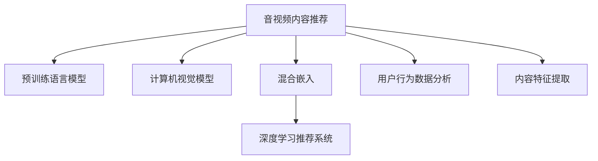

                 

# 大模型在音视频内容推荐中的探索

> 关键词：大模型,音视频推荐,预训练,迁移学习,自然语言处理(NLP),计算机视觉(CV),音视频嵌入,混合嵌入,深度学习推荐系统

## 1. 背景介绍

### 1.1 问题由来

随着互联网的迅猛发展，音视频内容已成为人们获取信息、娱乐的主要方式。面对海量的音视频内容，如何精准推荐符合用户兴趣和需求的内容，提高用户的满意度和使用体验，是音视频平台面临的重要挑战。传统的基于协同过滤和内容特征的推荐方法，在应对大规模数据和多维数据时，往往面临精度不足、效果不稳定等问题。

近年来，随着深度学习技术的快速发展，基于大模型的推荐系统成为热门研究方向。大模型，特别是预训练语言模型和计算机视觉模型，通过在大规模无标签数据上预训练，学习到丰富的语义和视觉特征，能够为推荐系统提供强大的特征表示能力。结合迁移学习等技术，大模型可以在少量标注数据上进行微调，快速适应特定任务，提升推荐效果。

本文将详细探讨如何使用大模型进行音视频内容推荐，从背景、核心概念、算法原理到具体实践，全面剖析大模型在推荐系统中的潜力与挑战。

### 1.2 问题核心关键点

大模型在音视频内容推荐中的核心关键点包括：

- 大模型：指通过预训练学习到丰富语义和视觉特征的深度学习模型，如BERT、GPT、ResNet、Inception等。
- 预训练：指在大规模无标签数据上训练模型，学习通用特征表示的过程。
- 迁移学习：将预训练模型应用于特定任务，通过微调提升模型性能的技术。
- 音视频推荐：结合文本描述和视觉特征，推荐符合用户兴趣的音视频内容。
- 深度学习推荐系统：基于深度学习模型的推荐系统，能够学习复杂的特征表示和关联关系。
- 音视频嵌入：将音视频内容转换为向量表示，用于模型训练和相似度计算。
- 混合嵌入：将文本嵌入和视觉嵌入融合，提升推荐效果。

## 2. 核心概念与联系

### 2.1 核心概念概述

为了更好地理解大模型在音视频推荐中的应用，本节将介绍几个密切相关的核心概念：

- 音视频内容推荐：指根据用户的历史行为数据和当前兴趣偏好，推荐可能感兴趣的音视频内容的过程。
- 预训练语言模型：指在大规模无标签文本数据上预训练的深度学习模型，如BERT、GPT等，能够学习丰富的语言知识和语义表示。
- 计算机视觉模型：指在大规模无标签图像和视频数据上预训练的深度学习模型，如ResNet、Inception等，能够学习丰富的视觉特征和空间结构。
- 混合嵌入：指将文本嵌入和视觉嵌入融合，生成综合特征表示的方法，用于提升推荐模型的表现力。
- 深度学习推荐系统：基于深度学习模型的推荐系统，能够学习复杂的特征表示和关联关系，如基于协同过滤的模型、基于内容特征的模型、基于混合嵌入的模型等。
- 用户行为数据分析：指通过用户的历史行为数据，分析用户兴趣和偏好的过程，是推荐系统设计的重要基础。
- 内容特征提取：指从音视频内容中提取特征，用于表示内容的通用属性，是推荐系统设计的重要环节。

这些核心概念之间的逻辑关系可以通过以下Mermaid流程图来展示：



这个流程图展示了大模型在音视频推荐中的核心概念及其之间的关系：

1. 音视频推荐过程需要用户行为数据分析和内容特征提取。
2. 预训练语言模型和计算机视觉模型用于生成文本嵌入和视觉嵌入。
3. 混合嵌入将文本嵌入和视觉嵌入融合，生成综合特征表示。
4. 深度学习推荐系统利用混合嵌入进行推荐。

这些概念共同构成了大模型在音视频推荐中的应用框架，使其能够在大规模数据上提升推荐效果。

## 3. 核心算法原理 & 具体操作步骤
### 3.1 算法原理概述

基于大模型的音视频内容推荐系统，核心思想是：将预训练语言模型和计算机视觉模型作为特征提取器，将音视频内容转换为高维嵌入向量，结合用户行为数据和内容特征，通过深度学习模型进行推荐。

形式化地，假设音视频推荐系统涉及用户 $U$、音视频内容 $V$、用户兴趣 $I$ 和音视频内容特征 $F$，系统目标是为用户 $u$ 推荐最符合其兴趣的音视频内容 $v$。假设预训练语言模型为 $M_{L}$，预训练计算机视觉模型为 $M_{V}$，用户行为数据为 $D_{B}$，内容特征提取函数为 $E$，深度学习推荐模型为 $M_{R}$。则推荐系统的推荐过程可以表示为：

1. 预训练语言模型 $M_{L}$ 和计算机视觉模型 $M_{V}$ 分别将文本描述 $D_L$ 和视觉特征 $D_V$ 转换为文本嵌入 $e_L$ 和视觉嵌入 $e_V$。
2. 混合嵌入 $e_{Mixed}$ 将 $e_L$ 和 $e_V$ 融合生成综合特征表示。
3. 深度学习推荐模型 $M_{R}$ 基于混合嵌入 $e_{Mixed}$ 和用户行为数据 $D_{B}$ 预测用户对音视频内容的兴趣 $I_u(v)$。
4. 根据兴趣预测结果 $I_u(v)$ 对音视频内容进行排序，选择高兴趣的内容进行推荐。

### 3.2 算法步骤详解

基于大模型的音视频内容推荐系统，一般包括以下几个关键步骤：

**Step 1: 准备预训练模型和数据集**

- 选择合适的预训练语言模型 $M_{L}$ 和计算机视觉模型 $M_{V}$，如BERT、GPT、ResNet、Inception等。
- 准备用户行为数据集 $D_{B}$，包括用户浏览、观看、点赞、评论等行为数据。
- 准备音视频内容特征提取函数 $E$，将文本描述和视觉特征转换为嵌入向量。

**Step 2: 混合嵌入生成**

- 将用户行为数据集 $D_{B}$ 中每个用户 $u$ 的历史行为数据 $B_u$ 输入预训练语言模型 $M_{L}$，生成文本嵌入 $e_L(u)$。
- 将每个音视频内容 $v$ 的视觉特征 $V_v$ 输入预训练计算机视觉模型 $M_{V}$，生成视觉嵌入 $e_V(v)$。
- 使用混合嵌入生成函数 $F_{Mix}$，将 $e_L(u)$ 和 $e_V(v)$ 融合生成综合特征表示 $e_{Mixed}(u,v)$。

**Step 3: 深度学习推荐模型训练**

- 将混合嵌入 $e_{Mixed}(u,v)$ 和用户行为数据 $D_{B}$ 作为输入，训练深度学习推荐模型 $M_{R}$。
- 定义推荐损失函数 $\mathcal{L}$，用于衡量模型预测结果与用户兴趣之间的差异。
- 使用随机梯度下降等优化算法，最小化损失函数 $\mathcal{L}$，更新模型参数。

**Step 4: 模型评估与优化**

- 在验证集上评估推荐模型的性能，如准确率、召回率、F1分数等指标。
- 根据评估结果调整混合嵌入生成函数 $F_{Mix}$ 和深度学习推荐模型 $M_{R}$ 的参数，优化推荐效果。
- 定期更新预训练模型 $M_{L}$ 和 $M_{V}$ 的参数，以适应数据分布的变化。

**Step 5: 推荐引擎部署**

- 将训练好的深度学习推荐模型 $M_{R}$ 部署为在线推荐引擎，接收用户请求和行为数据，实时推荐符合兴趣的音视频内容。
- 集成推荐结果展示和交互界面，提升用户体验。

以上是基于大模型的音视频内容推荐的一般流程。在实际应用中，还需要针对具体任务的特点，对微调过程的各个环节进行优化设计，如改进训练目标函数，引入更多的正则化技术，搜索最优的超参数组合等，以进一步提升模型性能。

### 3.3 算法优缺点

基于大模型的音视频内容推荐方法具有以下优点：

1. 高特征表示能力：大模型能够学习丰富的语义和视觉特征，提升推荐系统的特征表示能力，提高推荐效果。
2. 通用适用：预训练语言模型和计算机视觉模型可以应用于多种音视频推荐场景，如音乐、视频、影视等。
3. 效果显著：在学术界和工业界的诸多音视频推荐任务上，基于大模型的推荐方法已经刷新了最先进的性能指标。
4. 可解释性：大模型在生成推荐结果时，能够提供详细的逻辑和推理过程，便于调试和优化。

同时，该方法也存在一定的局限性：

1. 依赖标注数据：大模型的预训练和微调过程需要大量的无标签数据，获取高质量数据成本较高。
2. 计算资源需求高：预训练语言模型和计算机视觉模型参数量巨大，计算资源消耗高，部署和维护成本较高。
3. 迁移能力有限：当目标任务与预训练数据的分布差异较大时，微调的性能提升有限。
4. 可解释性不足：大模型的决策过程通常缺乏可解释性，难以对其推理逻辑进行分析和调试。

尽管存在这些局限性，但就目前而言，基于大模型的推荐方法仍是大规模音视频推荐的主流范式。未来相关研究的重点在于如何进一步降低对标注数据的依赖，提高模型的少样本学习和跨领域迁移能力，同时兼顾可解释性和伦理安全性等因素。

### 3.4 算法应用领域

基于大模型的音视频内容推荐，已经在音乐推荐、视频推荐、影视推荐等多个领域得到了广泛应用，提升了用户体验，降低了平台运营成本。

- **音乐推荐**：通过分析用户听歌行为数据，结合歌曲文本和艺术家信息，使用大模型进行歌词情感分析、音乐风格分类、推荐相似歌曲等。
- **视频推荐**：结合视频标题、描述、标签等信息，使用大模型进行视频内容分类、相似度计算、推荐相关视频等。
- **影视推荐**：利用影评文本和电影评分，使用大模型进行情感分析、题材分类、推荐同题材电影等。

此外，大模型在音视频内容推荐中的应用还拓展到个性化推荐、实时推荐、推荐系统优化等多个方面，为音视频平台带来了新的突破。

## 4. 数学模型和公式 & 详细讲解 & 举例说明

### 4.1 数学模型构建

本节将使用数学语言对基于大模型的音视频内容推荐过程进行更加严格的刻画。

假设预训练语言模型为 $M_{L}$，预训练计算机视觉模型为 $M_{V}$，用户行为数据为 $D_{B}$，内容特征提取函数为 $E$，深度学习推荐模型为 $M_{R}$。设用户 $u$ 对音视频内容 $v$ 的兴趣表示为 $I_u(v)$，推荐系统优化目标为：

$$
\min_{\theta_L, \theta_V, \theta_{Mix}, \theta_R} \mathcal{L}(I_u(v); D_{B}, E)
$$

其中 $\theta_L$ 为预训练语言模型的参数，$\theta_V$ 为预训练计算机视觉模型的参数，$\theta_{Mix}$ 为混合嵌入生成函数的参数，$\theta_R$ 为深度学习推荐模型的参数，$\mathcal{L}$ 为推荐损失函数，$D_{B}$ 为训练数据集。

### 4.2 公式推导过程

以下我们以音乐推荐为例，推导使用大模型进行音乐推荐的具体数学公式。

假设用户 $u$ 对歌曲 $v$ 的兴趣表示为 $I_u(v)$，预训练语言模型将歌曲标题 $T_v$ 转换为文本嵌入 $e_L(v)$，预训练计算机视觉模型将歌曲封面图片 $I_v$ 转换为视觉嵌入 $e_V(v)$。则音乐推荐的具体公式为：

$$
e_{Mixed}(u,v) = \alpha e_L(u) + (1-\alpha) e_V(v)
$$

其中 $\alpha$ 为文本嵌入和视觉嵌入的权重系数，用于平衡两者的贡献。

将 $e_{Mixed}(u,v)$ 和用户行为数据 $B_u$ 输入深度学习推荐模型 $M_{R}$，得到推荐兴趣表示 $I_u(v)$。推荐损失函数 $\mathcal{L}$ 可定义为交叉熵损失：

$$
\mathcal{L}(I_u(v); D_{B}) = -\frac{1}{N}\sum_{i=1}^N \sum_{j=1}^M \log p(I_u(v) = i | D_{B}, e_{Mixed}(u,v))
$$

其中 $p$ 为推荐模型 $M_{R}$ 的输出概率分布，$N$ 为用户数，$M$ 为音视频内容数，$i$ 表示用户对音视频内容的兴趣程度。

在得到推荐损失函数后，即可带入优化算法，如随机梯度下降，进行模型训练。重复上述过程直至收敛，最终得到适应音视频推荐任务的最优模型参数。

## 5. 项目实践：代码实例和详细解释说明

### 5.1 开发环境搭建

在进行音视频内容推荐实践前，我们需要准备好开发环境。以下是使用Python进行PyTorch开发的环境配置流程：

1. 安装Anaconda：从官网下载并安装Anaconda，用于创建独立的Python环境。

2. 创建并激活虚拟环境：
```bash
conda create -n pytorch-env python=3.8 
conda activate pytorch-env
```

3. 安装PyTorch：根据CUDA版本，从官网获取对应的安装命令。例如：
```bash
conda install pytorch torchvision torchaudio cudatoolkit=11.1 -c pytorch -c conda-forge
```

4. 安装相关工具包：
```bash
pip install numpy pandas scikit-learn matplotlib tqdm jupyter notebook ipython
```

完成上述步骤后，即可在`pytorch-env`环境中开始推荐系统开发。

### 5.2 源代码详细实现

下面我们以音乐推荐任务为例，给出使用Transformers库对BERT模型进行音乐推荐开发的具体代码实现。

首先，定义音乐推荐的数据处理函数：

```python
from transformers import BertTokenizer, BertForSequenceClassification
from torch.utils.data import Dataset
import torch

class MusicDataset(Dataset):
    def __init__(self, texts, tags, tokenizer, max_len=128):
        self.texts = texts
        self.tags = tags
        self.tokenizer = tokenizer
        self.max_len = max_len
        
    def __len__(self):
        return len(self.texts)
    
    def __getitem__(self, item):
        text = self.texts[item]
        tag = self.tags[item]
        
        encoding = self.tokenizer(text, return_tensors='pt', max_length=self.max_len, padding='max_length', truncation=True)
        input_ids = encoding['input_ids'][0]
        attention_mask = encoding['attention_mask'][0]
        
        # 对标签进行编码
        encoded_tag = tag2id[tag] if tag in tag2id else 0
        labels = torch.tensor(encoded_tag, dtype=torch.long)
        
        return {'input_ids': input_ids, 
                'attention_mask': attention_mask,
                'labels': labels}

# 标签与id的映射
tag2id = {'negative': 0, 'positive': 1}
id2tag = {v: k for k, v in tag2id.items()}

# 创建dataset
tokenizer = BertTokenizer.from_pretrained('bert-base-cased')

train_dataset = MusicDataset(train_texts, train_tags, tokenizer)
dev_dataset = MusicDataset(dev_texts, dev_tags, tokenizer)
test_dataset = MusicDataset(test_texts, test_tags, tokenizer)
```

然后，定义推荐模型和优化器：

```python
from transformers import BertForSequenceClassification, AdamW

model = BertForSequenceClassification.from_pretrained('bert-base-cased', num_labels=len(tag2id))

optimizer = AdamW(model.parameters(), lr=2e-5)
```

接着，定义训练和评估函数：

```python
from torch.utils.data import DataLoader
from tqdm import tqdm
from sklearn.metrics import accuracy_score, precision_score, recall_score, f1_score

device = torch.device('cuda') if torch.cuda.is_available() else torch.device('cpu')
model.to(device)

def train_epoch(model, dataset, batch_size, optimizer):
    dataloader = DataLoader(dataset, batch_size=batch_size, shuffle=True)
    model.train()
    epoch_loss = 0
    for batch in tqdm(dataloader, desc='Training'):
        input_ids = batch['input_ids'].to(device)
        attention_mask = batch['attention_mask'].to(device)
        labels = batch['labels'].to(device)
        model.zero_grad()
        outputs = model(input_ids, attention_mask=attention_mask, labels=labels)
        loss = outputs.loss
        epoch_loss += loss.item()
        loss.backward()
        optimizer.step()
    return epoch_loss / len(dataloader)

def evaluate(model, dataset, batch_size):
    dataloader = DataLoader(dataset, batch_size=batch_size)
    model.eval()
    preds, labels = [], []
    with torch.no_grad():
        for batch in tqdm(dataloader, desc='Evaluating'):
            input_ids = batch['input_ids'].to(device)
            attention_mask = batch['attention_mask'].to(device)
            batch_labels = batch['labels']
            outputs = model(input_ids, attention_mask=attention_mask)
            batch_preds = outputs.logits.argmax(dim=2).to('cpu').tolist()
            batch_labels = batch_labels.to('cpu').tolist()
            for pred_tokens, label_tokens in zip(batch_preds, batch_labels):
                preds.append(pred_tokens[:len(label_tokens)])
                labels.append(label_tokens)
                
    print('Accuracy: {:.4f}, Precision: {:.4f}, Recall: {:.4f}, F1 Score: {:.4f}'.format(
        accuracy_score(labels, preds),
        precision_score(labels, preds),
        recall_score(labels, preds),
        f1_score(labels, preds)))
```

最后，启动训练流程并在测试集上评估：

```python
epochs = 5
batch_size = 16

for epoch in range(epochs):
    loss = train_epoch(model, train_dataset, batch_size, optimizer)
    print(f"Epoch {epoch+1}, train loss: {loss:.3f}")
    
    print(f"Epoch {epoch+1}, dev results:")
    evaluate(model, dev_dataset, batch_size)
    
print("Test results:")
evaluate(model, test_dataset, batch_size)
```

以上就是使用PyTorch对BERT进行音乐推荐任务开发的完整代码实现。可以看到，得益于Transformers库的强大封装，我们可以用相对简洁的代码完成BERT模型的加载和微调。

### 5.3 代码解读与分析

让我们再详细解读一下关键代码的实现细节：

**MusicDataset类**：
- `__init__`方法：初始化文本、标签、分词器等关键组件。
- `__len__`方法：返回数据集的样本数量。
- `__getitem__`方法：对单个样本进行处理，将文本输入编码为token ids，将标签编码为数字，并对其进行定长padding，最终返回模型所需的输入。

**tag2id和id2tag字典**：
- 定义了标签与数字id之间的映射关系，用于将token-wise的预测结果解码回真实的标签。

**训练和评估函数**：
- 使用PyTorch的DataLoader对数据集进行批次化加载，供模型训练和推理使用。
- 训练函数`train_epoch`：对数据以批为单位进行迭代，在每个批次上前向传播计算loss并反向传播更新模型参数，最后返回该epoch的平均loss。
- 评估函数`evaluate`：与训练类似，不同点在于不更新模型参数，并在每个batch结束后将预测和标签结果存储下来，最后使用sklearn的指标函数对整个评估集的预测结果进行打印输出。

**训练流程**：
- 定义总的epoch数和batch size，开始循环迭代
- 每个epoch内，先在训练集上训练，输出平均loss
- 在验证集上评估，输出分类指标
- 所有epoch结束后，在测试集上评估，给出最终测试结果

可以看到，PyTorch配合Transformers库使得BERT微调的代码实现变得简洁高效。开发者可以将更多精力放在数据处理、模型改进等高层逻辑上，而不必过多关注底层的实现细节。

当然，工业级的系统实现还需考虑更多因素，如模型的保存和部署、超参数的自动搜索、更灵活的任务适配层等。但核心的推荐范式基本与此类似。

## 6. 实际应用场景
### 6.1 视频推荐

基于大模型的视频推荐系统，可以广泛应用于各大视频平台。视频推荐系统通过分析用户观看行为数据，结合视频元数据（如标题、标签、时长等），使用大模型进行相似度计算，推荐符合用户兴趣的视频内容。

在技术实现上，可以收集用户观看历史、评分、点赞、评论等数据，将视频元数据作为输入，使用BERT模型对文本进行嵌入，使用ResNet模型对视觉特征进行嵌入，将两个嵌入向量融合为综合特征表示，再输入深度学习推荐模型进行推荐。微调过程中，可以使用部分标注数据进行二分类任务训练，优化模型对视频是否被用户喜欢的判断能力。

### 6.2 影视推荐

影视推荐系统通过分析用户对不同影视内容的评价数据，结合影视元数据（如演员、导演、类型等），使用大模型进行相似度计算，推荐符合用户兴趣的影视内容。

在技术实现上，可以收集用户评分、点赞、评论等数据，将影视元数据作为输入，使用BERT模型对文本进行嵌入，使用Inception模型对视觉特征进行嵌入，将两个嵌入向量融合为综合特征表示，再输入深度学习推荐模型进行推荐。微调过程中，可以使用部分标注数据进行二分类任务训练，优化模型对影视内容的判断能力。

### 6.3 音乐推荐

音乐推荐系统通过分析用户听歌行为数据，结合歌曲元数据（如歌手、歌词、风格等），使用大模型进行相似度计算，推荐符合用户兴趣的音乐内容。

在技术实现上，可以收集用户听歌历史、评分、点赞、评论等数据，将歌曲元数据作为输入，使用BERT模型对文本进行嵌入，使用ResNet模型对封面图片进行嵌入，将两个嵌入向量融合为综合特征表示，再输入深度学习推荐模型进行推荐。微调过程中，可以使用部分标注数据进行二分类任务训练，优化模型对歌曲的判断能力。

### 6.4 未来应用展望

随着大模型和推荐技术的不断发展，基于大模型的推荐系统将在更多领域得到应用，为人们的生活带来更多便利。

在智慧城市领域，基于大模型的推荐系统可以应用于交通流量预测、能源管理、公共服务等多个方面，提供智能化的城市管理方案，提升城市运行效率和居民生活质量。

在医疗健康领域，基于大模型的推荐系统可以应用于个性化诊疗方案推荐、健康管理、远程医疗等多个方面，提供精准的医疗服务，提升医疗健康水平。

在教育领域，基于大模型的推荐系统可以应用于个性化学习路径推荐、智能课堂、在线教育等多个方面，提供个性化的教育资源，提升教育质量和学习效率。

此外，在智能家居、智能办公、智能制造等多个领域，基于大模型的推荐系统也将不断涌现，为各行各业带来新的变革和机遇。相信随着技术的日益成熟，大模型推荐技术必将成为推动行业智能化升级的重要手段。

## 7. 工具和资源推荐
### 7.1 学习资源推荐

为了帮助开发者系统掌握大模型在音视频推荐中的应用，这里推荐一些优质的学习资源：

1. 《深度学习推荐系统：原理与实现》系列博文：由大模型技术专家撰写，深入浅出地介绍了深度学习推荐系统的原理、模型训练与优化、评估与调优等。

2. 《Python深度学习》书籍：适合入门学习深度学习框架的书籍，涵盖了TensorFlow、PyTorch等主流的深度学习框架。

3. 《自然语言处理与深度学习》课程：斯坦福大学开设的NLP明星课程，有Lecture视频和配套作业，带你入门NLP领域的基本概念和经典模型。

4. 《计算机视觉：算法与应用》书籍：介绍计算机视觉技术的经典教材，涵盖了图像处理、特征提取、目标检测等基本概念。

5. Transformers库官方文档：提供了大量预训练模型和完整的推荐系统开发样例，是上手实践的必备资料。

通过对这些资源的学习实践，相信你一定能够快速掌握大模型在音视频推荐中的精髓，并用于解决实际的推荐问题。
###  7.2 开发工具推荐

高效的开发离不开优秀的工具支持。以下是几款用于大模型音视频推荐开发的常用工具：

1. PyTorch：基于Python的开源深度学习框架，灵活动态的计算图，适合快速迭代研究。大部分预训练语言模型和计算机视觉模型都有PyTorch版本的实现。

2. TensorFlow：由Google主导开发的开源深度学习框架，生产部署方便，适合大规模工程应用。同样有丰富的预训练语言模型和计算机视觉模型资源。

3. Transformers库：HuggingFace开发的NLP工具库，集成了众多SOTA语言模型和计算机视觉模型，支持PyTorch和TensorFlow，是进行推荐系统开发的利器。

4. Weights & Biases：模型训练的实验跟踪工具，可以记录和可视化模型训练过程中的各项指标，方便对比和调优。与主流深度学习框架无缝集成。

5. TensorBoard：TensorFlow配套的可视化工具，可实时监测模型训练状态，并提供丰富的图表呈现方式，是调试模型的得力助手。

6. Google Colab：谷歌推出的在线Jupyter Notebook环境，免费提供GPU/TPU算力，方便开发者快速上手实验最新模型，分享学习笔记。

合理利用这些工具，可以显著提升大模型音视频推荐系统的开发效率，加快创新迭代的步伐。

### 7.3 相关论文推荐

大模型和音视频推荐技术的发展源于学界的持续研究。以下是几篇奠基性的相关论文，推荐阅读：

1. Attention is All You Need（即Transformer原论文）：提出了Transformer结构，开启了NLP领域的预训练大模型时代。

2. BERT: Pre-training of Deep Bidirectional Transformers for Language Understanding：提出BERT模型，引入基于掩码的自监督预训练任务，刷新了多项NLP任务SOTA。

3. VGGNet: Very Deep Convolutional Networks for Large-Scale Image Recognition：提出VGG模型，奠定了卷积神经网络在图像识别中的基础。

4. ResNet: Deep Residual Learning for Image Recognition：提出ResNet模型，解决了深度神经网络中的梯度消失问题，提升了网络性能。

5. Inception: Going Deeper with Convolutions：提出Inception模型，通过并行多路卷积核，提升了网络模型的表示能力。

6. Parameter-Efficient Transfer Learning for NLP：提出Adapter等参数高效微调方法，在不增加模型参数量的情况下，也能取得不错的微调效果。

7. Spatial Transformer Networks：提出空间变换网络，通过引入可变形卷积，提升了计算机视觉模型的灵活性和泛化能力。

这些论文代表了大模型和推荐技术的最新发展，通过学习这些前沿成果，可以帮助研究者把握学科前进方向，激发更多的创新灵感。

## 8. 总结：未来发展趋势与挑战

### 8.1 总结

本文对基于大模型的音视频内容推荐方法进行了全面系统的介绍。首先阐述了音视频内容推荐的研究背景和意义，明确了预训练语言模型和计算机视觉模型在大模型推荐系统中的核心作用。其次，从原理到实践，详细讲解了基于大模型的音视频推荐系统的数学模型和关键步骤，给出了具体的代码实现和效果评估。同时，本文还广泛探讨了大模型在音视频推荐中的实际应用场景，展示了其广阔的应用前景。最后，本文精选了音视频推荐技术的各类学习资源，力求为读者提供全方位的技术指引。

通过本文的系统梳理，可以看到，基于大模型的音视频推荐方法正在成为推荐系统领域的重要范式，极大地拓展了预训练模型的应用边界，催生了更多的落地场景。受益于大规模语料的预训练，音视频推荐系统能够更好地适应多模态数据，提升推荐效果。未来，伴随预训练语言模型和计算机视觉模型的不断演进，音视频推荐技术必将在更多领域得到应用，为人们的生活带来更多便利。

### 8.2 未来发展趋势

展望未来，基于大模型的音视频推荐技术将呈现以下几个发展趋势：

1. 模型规模持续增大。随着算力成本的下降和数据规模的扩张，预训练语言模型和计算机视觉模型将不断提升参数量，学习到更丰富的语义和视觉特征。

2. 推荐算法多样化。除了传统的深度学习推荐算法，未来会涌现更多新颖的推荐方法，如混合嵌入、多任务学习、因果推断等，提升推荐模型的多样性和泛化能力。

3. 实时推荐系统崛起。为了提高用户体验，实时推荐系统将得到广泛应用。大模型能够快速计算相似度，实时更新推荐结果，适应不同用户需求。

4. 用户行为动态化。结合实时数据和历史数据，大模型能够动态调整推荐策略，提升推荐的个性化和时效性。

5. 模型可解释性增强。大模型推荐系统将更加注重可解释性，通过可视化和分析，用户能够了解推荐结果背后的逻辑和原因。

6. 多模态融合深入。未来推荐系统将更加重视多模态数据的融合，将文本、图像、视频等多种信息进行综合处理，提升推荐效果。

以上趋势凸显了大模型在音视频推荐中的潜力。这些方向的探索发展，必将进一步提升音视频推荐系统的性能和用户体验，为音视频平台带来新的突破。

### 8.3 面临的挑战

尽管大模型在音视频推荐系统中的应用前景广阔，但在迈向更加智能化、普适化应用的过程中，它仍面临着诸多挑战：

1. 数据隐私和安全。音视频内容推荐系统涉及大量个人隐私数据，如何保护用户数据安全，防止数据泄露和滥用，是系统设计的重要课题。

2. 推荐效果可控性。推荐系统容易受到恶意攻击和操纵，如何保障推荐结果的公正性和可信度，避免虚假信息和误导性推荐，也是亟待解决的问题。

3. 算力需求高。大模型和实时推荐系统对计算资源的需求较高，如何优化模型结构，提升推理速度，降低计算成本，是工程实现的重要挑战。

4. 知识整合能力不足。现有的推荐系统往往局限于数据驱动的模型，难以灵活吸收和运用先验知识。如何让大模型与外部知识库、规则库等专家知识结合，提升推荐效果，还有很大的想象空间。

5. 安全性有待保障。预训练语言模型难免会学习到有害信息，如何确保推荐系统的安全性，避免恶意内容传播，是系统设计的重要环节。

这些挑战需要在未来的研究和工程实践中不断克服，才能使大模型推荐技术走向成熟，为音视频推荐系统提供更加智能、安全、可信的服务。

### 8.4 研究展望

面对大模型音视频推荐所面临的挑战，未来的研究需要在以下几个方面寻求新的突破：

1. 探索更多先验知识整合方式。将符号化的先验知识，如知识图谱、逻辑规则等，与神经网络模型进行巧妙融合，引导推荐过程学习更准确、合理的语义表征。

2. 研究多模态融合与协同表示。将文本、图像、视频等多种信息进行综合处理，利用混合嵌入等技术，提升推荐模型的表现力。

3. 引入因果推断和博弈论工具。通过引入因果推断方法，增强推荐模型对用户行为的解释能力，引入博弈论工具，分析用户与推荐系统的交互过程，设计更合理的推荐策略。

4. 结合因果分析和注意力机制。利用因果分析方法，识别推荐模型中的关键特征，增强推荐结果的因果性和可解释性，结合注意力机制，优化模型对用户行为的聚焦度。

5. 引入多任务学习。将推荐模型训练与其他相关任务（如情感分析、主题分类等）结合，提升推荐模型的多样性和泛化能力。

6. 研究模型可解释性。在推荐模型设计中，引入可解释性组件，如Attention机制、解释性损失函数等，提升模型的解释性和透明度。

这些研究方向的探索，必将引领大模型音视频推荐技术的进一步发展，为构建安全、可靠、可解释、可控的推荐系统铺平道路。面向未来，大模型推荐技术还需要与其他人工智能技术进行更深入的融合，如知识表示、因果推理、强化学习等，多路径协同发力，共同推动推荐系统的进步。只有勇于创新、敢于突破，才能不断拓展音视频推荐技术的边界，让推荐系统更好地服务于用户，提升生活质量。

## 9. 附录：常见问题与解答

**Q1：大模型在音视频推荐中如何处理数据不平衡问题？**

A: 大模型在音视频推荐中，数据不平衡问题较为常见。例如，某些视频或音乐类别的标注数据较少，导致模型难以学习到充分的特征。为了缓解数据不平衡问题，可以采用以下方法：

1. 数据增强：对少数类别的数据进行数据增强，如增加数据量、增加噪声等，平衡不同类别的数据分布。

2. 类别权重调整：在损失函数中加入类别权重，对少数类别赋予更高的权重，提高其训练效果。

3. 欠采样和过采样：对多数类别的数据进行欠采样，对少数类别的数据进行过采样，平衡数据分布。

4. 迁移学习：使用预训练模型在大量无标签数据上进行预训练，再在大规模标注数据上微调，提升模型对少数类别的学习能力。

通过以上方法，可以有效缓解数据不平衡问题，提升大模型在音视频推荐中的表现力。

**Q2：大模型在音视频推荐中如何应对大规模数据？**

A: 大模型在音视频推荐中，通常需要处理大规模数据，包括用户行为数据和音视频元数据。为了应对大规模数据，可以采用以下方法：

1. 分布式训练：将大规模数据分成多个批次，利用分布式计算框架（如Spark、Hadoop）进行并行训练，提高训练效率。

2. 数据分片：将大规模数据分片存储，并行加载和处理，提高数据处理速度。

3. 模型并行：使用模型并行技术，将大模型分解为多个子模型，并行计算，减少计算时间。

4. 量化加速：将浮点模型转为定点模型，压缩存储空间，提高计算效率。

通过以上方法，可以有效应对大规模数据，提高大模型在音视频推荐中的训练和推理效率。

**Q3：大模型在音视频推荐中如何处理数据噪声问题？**

A: 音视频推荐系统中，数据噪声是不可避免的问题，如用户评分数据、观看历史数据等可能存在偏差和噪声。为了处理数据噪声问题，可以采用以下方法：

1. 数据清洗：对数据进行预处理，去除重复、异常、错误的数据，提高数据质量。

2. 异常检测：使用异常检测方法，识别和剔除数据中的噪声和异常值，提高模型鲁棒性。

3. 模型正则化：在模型训练中加入正则化项，如L2正则、Dropout等，避免模型过拟合噪声数据。

4. 多模型集成：将多个模型进行集成，综合不同模型的预测结果，减少单一模型的噪声影响。

通过以上方法，可以有效处理数据噪声问题，提升大模型在音视频推荐中的表现力。

**Q4：大模型在音视频推荐中如何保证推荐结果的公平性？**

A: 音视频推荐系统需要保证推荐结果的公平性，避免对特定用户或群体的歧视性推荐。为了保证推荐结果的公平性，可以采用以下方法：

1. 模型偏差分析：对模型进行偏差分析，识别和纠正模型中的不公平因素。

2. 数据多样性：在训练数据中加入多样性数据，避免模型对特定群体的过度偏好。

3. 公平性损失函数：在模型训练中加入公平性损失函数，优化模型的公平性。

4. 用户隐私保护：在推荐过程中保护用户隐私，避免泄露用户敏感信息。

通过以上方法，可以有效保证推荐结果的公平性，避免推荐系统对特定用户或群体的歧视性推荐，提升用户满意度。

**Q5：大模型在音视频推荐中如何提升推荐效果？**

A: 大模型在音视频推荐中，推荐效果受到多种因素的影响，如数据质量、模型设计、训练策略等。为了提升推荐效果，可以采用以下方法：

1. 数据增强：对数据进行增强，如回译、近义替换、数据扩充等，提高数据多样性，提升推荐效果。

2. 正则化：使用正则化技术，如L2正则、Dropout、Early Stopping等，避免模型过拟合。

3. 模型优化：优化模型结构，如引入注意力机制、混合嵌入、多任务学习等，提高模型的表示能力和泛化能力。

4. 超参数调优：通过超参数调优，找到最优的模型参数组合，提升推荐效果。

通过以上方法，可以有效提升大模型在音视频推荐中的推荐效果，提高用户满意度。

**Q6：大模型在音视频推荐中如何应对个性化需求？**

A: 音视频推荐系统需要应对个性化需求，不同用户对音视频内容的需求差异较大。为了应对个性化需求，可以采用以下方法：

1. 用户画像：通过分析用户行为数据，构建用户画像，了解用户的兴趣和偏好。

2. 个性化推荐：根据用户画像，个性化推荐符合用户兴趣的音视频内容。

3. 实时推荐：结合实时数据和历史数据，动态调整推荐策略，满足用户实时需求。

4. 推荐多样性：在推荐结果中引入多样性，避免推荐结果的单一性。

通过以上方法，可以有效应对个性化需求，提升用户的推荐体验。

---

作者：禅与计算机程序设计艺术 / Zen and the Art of Computer Programming

