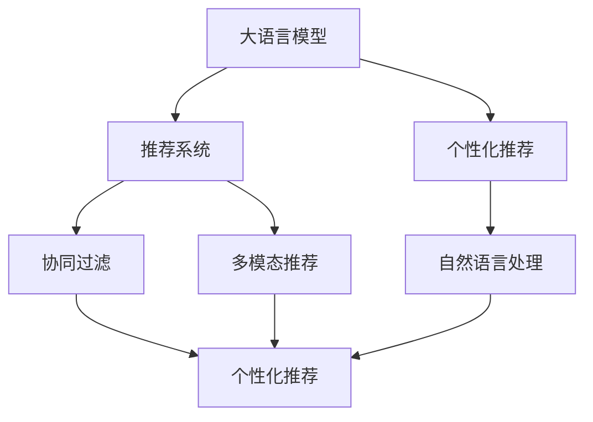

                 

# 大模型对推荐系统个性化程度的提升

> 关键词：大语言模型,个性化推荐,深度学习,协同过滤,协同过滤优化,自然语言处理,NLP

## 1. 背景介绍

### 1.1 问题由来
随着互联网和电子商务的迅猛发展，推荐系统已经成为提升用户体验、增加商业收益的重要工具。传统的推荐算法，如协同过滤、基于内容的推荐等，已经难以应对用户个性化需求的日益增长。如何构建一个高效、智能、个性化的推荐系统，成为了当前研究的热点和难点问题。

为了解决这一问题，大语言模型和大数据技术相结合，形成了一种新的推荐范式。利用大语言模型对用户行为和产品属性进行深度学习，能够在满足用户个性化需求的同时，保持推荐系统的高效性和可扩展性。这种新的推荐方法不仅突破了传统推荐算法的瓶颈，还为推荐系统带来了新的可能性，能够更加精准地为用户提供个性化推荐。

### 1.2 问题核心关键点
大语言模型推荐系统的核心思想是：利用大语言模型对用户行为和产品属性进行深度学习，学习用户对产品的真实需求和偏好，从而构建更加个性化的推荐模型。具体来说，包括以下几个关键点：

1. **语义理解**：大语言模型能够理解用户输入的自然语言查询，将查询转换为可以计算的形式。这种语义理解能力使得推荐系统能够准确捕捉用户的个性化需求，而不仅仅依赖于表面的行为数据。

2. **上下文处理**：大语言模型可以处理复杂的上下文信息，包括用户历史行为、时间、地点等。这些上下文信息对于构建更加个性化和情境化的推荐系统至关重要。

3. **多模态融合**：大语言模型可以融合多种模态的信息，如文本、图像、音频等。这种多模态的融合能力，能够提供更加全面和准确的产品描述，进一步提升推荐精度。

4. **泛化能力**：大语言模型在大量数据上进行预训练，具备较强的泛化能力，能够在不同领域和场景中表现出色。

## 2. 核心概念与联系

### 2.1 核心概念概述

为了更好地理解大语言模型对推荐系统个性化程度的提升，本节将介绍几个密切相关的核心概念：

- **大语言模型(Large Language Model, LLM)**：以自回归(如GPT)或自编码(如BERT)模型为代表的大规模预训练语言模型。通过在大规模无标签文本语料上进行预训练，学习通用的语言表示，具备强大的语言理解和生成能力。

- **推荐系统(Recommendation System)**：利用用户历史行为、产品属性等数据，为每个用户推荐其可能感兴趣的产品或内容的系统。推荐系统包括协同过滤、基于内容的推荐、基于矩阵分解的推荐等多种算法。

- **个性化推荐(Personalized Recommendation)**：根据每个用户的个性化需求，为其推荐最合适的产品或内容。个性化推荐算法能够处理用户的多样化需求，提高用户满意度。

- **协同过滤(Collaborative Filtering, CF)**：一种基于用户历史行为和产品交互数据的推荐算法，通过挖掘用户和产品之间的相似性，为用户推荐相似的产品。

- **多模态推荐(Multimodal Recommendation)**：结合文本、图像、音频等多种数据模态，提供更加全面和准确的推荐结果。多模态推荐能够综合利用多种数据源的信息，提升推荐精度。

- **深度学习(Deep Learning)**：利用神经网络模型进行数据学习和预测的一种机器学习方法，可以处理大规模和高复杂度的数据。

- **自然语言处理(Natural Language Processing, NLP)**：使用计算机技术处理和理解人类语言，包括文本分类、情感分析、问答系统等任务。

这些核心概念之间的逻辑关系可以通过以下Mermaid流程图来展示：



这个流程图展示了大语言模型对推荐系统个性化程度的提升过程：

1. 大语言模型通过预训练获得基础能力。
2. 将预训练模型应用于推荐系统，特别是个性化推荐。
3. 利用协同过滤和多模态推荐提升个性化推荐效果。
4. 结合自然语言处理技术，进一步提升推荐系统的个性化程度。

这些概念共同构成了大语言模型推荐系统的学习和应用框架，使其能够更好地满足用户的个性化需求。

## 3. 核心算法原理 & 具体操作步骤
### 3.1 算法原理概述

大语言模型推荐系统的核心原理是通过深度学习模型对用户行为和产品属性进行建模，学习用户对产品的真实需求和偏好，从而构建更加个性化的推荐模型。具体来说，算法原理包括以下几个关键步骤：

1. **用户建模**：利用大语言模型对用户的历史行为和属性进行建模，提取用户兴趣和偏好。

2. **产品建模**：利用大语言模型对产品的描述和属性进行建模，提取产品的特点和属性。

3. **交互建模**：将用户行为和产品属性进行匹配，建立用户和产品之间的交互模型。

4. **推荐生成**：利用交互模型，为每个用户推荐最合适的产品或内容。

### 3.2 算法步骤详解

大语言模型推荐系统的主要步骤如下：

**Step 1: 数据准备**
- 收集用户的历史行为数据，如浏览、购买、评分等。
- 收集产品的描述和属性，如产品名称、类别、价格等。

**Step 2: 预训练模型选择**
- 选择合适的预训练语言模型，如BERT、GPT等。
- 在预训练数据上对模型进行微调，使其能够理解和处理推荐任务相关的数据。

**Step 3: 用户建模**
- 利用微调后的语言模型对用户的行为和属性进行建模，提取用户的兴趣和偏好。

**Step 4: 产品建模**
- 利用微调后的语言模型对产品的描述和属性进行建模，提取产品的特点和属性。

**Step 5: 交互建模**
- 将用户行为和产品属性进行匹配，建立用户和产品之间的交互模型。

**Step 6: 推荐生成**
- 利用交互模型，为每个用户推荐最合适的产品或内容。

**Step 7: 评估与优化**
- 在测试集上评估推荐结果，利用评估指标（如准确率、召回率、用户满意度等）对模型进行优化。

### 3.3 算法优缺点

大语言模型推荐系统具有以下优点：
1. **个性化程度高**：通过深度学习模型对用户行为和产品属性进行建模，能够捕捉用户的真实需求和偏好，提供更加个性化的推荐。
2. **数据需求低**：相比于传统的协同过滤算法，大语言模型推荐系统对标注数据的需求较低，可以在少量标注数据的情况下进行高效推荐。
3. **多模态融合能力强**：能够处理多种数据模态，如文本、图像、音频等，提供更加全面和准确的推荐结果。

同时，该方法也存在一定的局限性：
1. **计算成本高**：大语言模型推荐系统需要大量的计算资源进行预训练和微调，在计算成本上存在一定的挑战。
2. **数据隐私问题**：在处理用户数据时，需要关注数据隐私和安全性问题，避免泄露用户隐私。
3. **模型复杂度高**：大语言模型推荐系统的模型复杂度较高，需要更多的工程和优化工作才能实现高效推荐。

### 3.4 算法应用领域

大语言模型推荐系统已经在多个领域得到了应用，包括但不限于：

- **电子商务**：电商平台利用大语言模型推荐系统为用户推荐商品，提升用户购物体验和满意度。
- **视频平台**：视频平台利用大语言模型推荐系统为用户推荐视频内容，提高用户观看体验和粘性。
- **音乐平台**：音乐平台利用大语言模型推荐系统为用户推荐音乐内容，提升用户的音乐体验和满意度。
- **新闻媒体**：新闻媒体利用大语言模型推荐系统为用户推荐新闻内容，增加用户阅读量和粘性。
- **游戏平台**：游戏平台利用大语言模型推荐系统为用户推荐游戏内容和任务，提升用户游戏体验和粘性。

除了这些领域外，大语言模型推荐系统还可以应用于更多场景中，如社交网络、旅游服务、智能家居等，为各行各业带来新的突破和创新。

## 4. 数学模型和公式 & 详细讲解 & 举例说明（备注：数学公式请使用latex格式，latex嵌入文中独立段落使用 $$，段落内使用 $)
### 4.1 数学模型构建

在推荐系统中，我们通常使用协同过滤算法对用户和产品进行建模。假设有 $N$ 个用户 $U$ 和 $M$ 个产品 $I$，每个用户对每个产品的评分 $r_{ui}$ 构成用户-产品评分矩阵 $\mathbf{R} \in \mathbb{R}^{N \times M}$。大语言模型推荐系统使用深度神经网络对用户行为和产品属性进行建模，建立用户-产品交互模型。

用户 $u$ 对产品 $i$ 的兴趣 $h_u$ 可以表示为：

$$
h_u = f_{\theta}(x_u)
$$

其中，$f_{\theta}$ 为深度神经网络模型，$\theta$ 为模型参数，$x_u$ 为用户的特征表示。产品 $i$ 的属性表示 $g_i$ 可以表示为：

$$
g_i = f_{\theta}(x_i)
$$

其中，$f_{\theta}$ 为深度神经网络模型，$\theta$ 为模型参数，$x_i$ 为产品的特征表示。用户 $u$ 对产品 $i$ 的评分 $r_{ui}$ 可以表示为：

$$
r_{ui} = s_{\theta}(h_u, g_i)
$$

其中，$s_{\theta}$ 为评分函数，$\theta$ 为模型参数，$h_u$ 为用户对产品 $i$ 的兴趣表示，$g_i$ 为产品 $i$ 的属性表示。

### 4.2 公式推导过程

在推荐系统中，我们通常使用均方误差作为损失函数：

$$
\mathcal{L}(\theta) = \frac{1}{NM} \sum_{u=1}^N \sum_{i=1}^M (r_{ui} - s_{\theta}(h_u, g_i))^2
$$

其中，$\mathcal{L}(\theta)$ 为损失函数，$r_{ui}$ 为实际评分，$s_{\theta}(h_u, g_i)$ 为预测评分。通过反向传播算法，求得模型参数 $\theta$ 的梯度，更新模型参数。

### 4.3 案例分析与讲解

以电商平台为例，假设有 $N$ 个用户 $U$ 和 $M$ 个商品 $I$，每个用户对每个商品的评分 $r_{ui}$ 构成用户-商品评分矩阵 $\mathbf{R} \in \mathbb{R}^{N \times M}$。使用大语言模型推荐系统进行推荐，可以分以下几个步骤：

1. **数据准备**：收集用户的历史行为数据，如浏览、购买、评分等。
2. **预训练模型选择**：选择BERT、GPT等预训练语言模型，在预训练数据上对模型进行微调。
3. **用户建模**：利用微调后的BERT模型对用户的行为和属性进行建模，提取用户的兴趣和偏好。
4. **产品建模**：利用微调后的BERT模型对产品的描述和属性进行建模，提取产品的特点和属性。
5. **交互建模**：将用户行为和产品属性进行匹配，建立用户和产品之间的交互模型。
6. **推荐生成**：利用交互模型，为每个用户推荐最合适的商品。
7. **评估与优化**：在测试集上评估推荐结果，利用评估指标（如准确率、召回率、用户满意度等）对模型进行优化。

通过以上步骤，可以使用大语言模型推荐系统为每个用户提供个性化的商品推荐，提升用户体验和电商平台的用户粘性。

## 5. 项目实践：代码实例和详细解释说明
### 5.1 开发环境搭建

在进行推荐系统开发前，我们需要准备好开发环境。以下是使用Python进行PyTorch开发的环境配置流程：

1. 安装Anaconda：从官网下载并安装Anaconda，用于创建独立的Python环境。

2. 创建并激活虚拟环境：
```bash
conda create -n pytorch-env python=3.8 
conda activate pytorch-env
```

3. 安装PyTorch：根据CUDA版本，从官网获取对应的安装命令。例如：
```bash
conda install pytorch torchvision torchaudio cudatoolkit=11.1 -c pytorch -c conda-forge
```

4. 安装TensorFlow：
```bash
conda install tensorflow
```

5. 安装各类工具包：
```bash
pip install numpy pandas scikit-learn matplotlib tqdm jupyter notebook ipython
```

完成上述步骤后，即可在`pytorch-env`环境中开始推荐系统开发。

### 5.2 源代码详细实现

下面我们以电商推荐系统为例，给出使用Transformers库对BERT模型进行电商推荐系统的PyTorch代码实现。

首先，定义电商推荐任务的数据处理函数：

```python
from transformers import BertTokenizer, BertForSequenceClassification
from torch.utils.data import Dataset, DataLoader
import torch

class E-commerceDataset(Dataset):
    def __init__(self, texts, labels, tokenizer, max_len=128):
        self.texts = texts
        self.labels = labels
        self.tokenizer = tokenizer
        self.max_len = max_len
        
    def __len__(self):
        return len(self.texts)
    
    def __getitem__(self, item):
        text = self.texts[item]
        label = self.labels[item]
        
        encoding = self.tokenizer(text, return_tensors='pt', max_length=self.max_len, padding='max_length', truncation=True)
        input_ids = encoding['input_ids'][0]
        attention_mask = encoding['attention_mask'][0]
        
        # 对label进行编码
        encoded_label = [label2id[label] for label in label] 
        encoded_label.extend([label2id['O']] * (self.max_len - len(encoded_label)))
        labels = torch.tensor(encoded_label, dtype=torch.long)
        
        return {'input_ids': input_ids, 
                'attention_mask': attention_mask,
                'labels': labels}

# 标签与id的映射
label2id = {'O': 0, '1': 1, '2': 2, '3': 3, '4': 4, '5': 5, '6': 6}
id2label = {v: k for k, v in label2id.items()}

# 创建dataset
tokenizer = BertTokenizer.from_pretrained('bert-base-cased')

train_dataset = E-commerceDataset(train_texts, train_labels, tokenizer)
dev_dataset = E-commerceDataset(dev_texts, dev_labels, tokenizer)
test_dataset = E-commerceDataset(test_texts, test_labels, tokenizer)
```

然后，定义模型和优化器：

```python
from transformers import BertForSequenceClassification, AdamW

model = BertForSequenceClassification.from_pretrained('bert-base-cased', num_labels=len(label2id))

optimizer = AdamW(model.parameters(), lr=2e-5)
```

接着，定义训练和评估函数：

```python
from torch.utils.data import DataLoader
from tqdm import tqdm
from sklearn.metrics import classification_report

device = torch.device('cuda') if torch.cuda.is_available() else torch.device('cpu')
model.to(device)

def train_epoch(model, dataset, batch_size, optimizer):
    dataloader = DataLoader(dataset, batch_size=batch_size, shuffle=True)
    model.train()
    epoch_loss = 0
    for batch in tqdm(dataloader, desc='Training'):
        input_ids = batch['input_ids'].to(device)
        attention_mask = batch['attention_mask'].to(device)
        labels = batch['labels'].to(device)
        model.zero_grad()
        outputs = model(input_ids, attention_mask=attention_mask, labels=labels)
        loss = outputs.loss
        epoch_loss += loss.item()
        loss.backward()
        optimizer.step()
    return epoch_loss / len(dataloader)

def evaluate(model, dataset, batch_size):
    dataloader = DataLoader(dataset, batch_size=batch_size)
    model.eval()
    preds, labels = [], []
    with torch.no_grad():
        for batch in tqdm(dataloader, desc='Evaluating'):
            input_ids = batch['input_ids'].to(device)
            attention_mask = batch['attention_mask'].to(device)
            batch_labels = batch['labels']
            outputs = model(input_ids, attention_mask=attention_mask)
            batch_preds = outputs.logits.argmax(dim=2).to('cpu').tolist()
            batch_labels = batch_labels.to('cpu').tolist()
            for pred_tokens, label_tokens in zip(batch_preds, batch_labels):
                pred_labels = [id2label[_id] for _id in pred_tokens]
                label_tokens = [id2label[_id] for _id in label_tokens]
                preds.append(pred_labels[:len(label_tokens)])
                labels.append(label_tokens)
                
    print(classification_report(labels, preds))
```

最后，启动训练流程并在测试集上评估：

```python
epochs = 5
batch_size = 16

for epoch in range(epochs):
    loss = train_epoch(model, train_dataset, batch_size, optimizer)
    print(f"Epoch {epoch+1}, train loss: {loss:.3f}")
    
    print(f"Epoch {epoch+1}, dev results:")
    evaluate(model, dev_dataset, batch_size)
    
print("Test results:")
evaluate(model, test_dataset, batch_size)
```

以上就是使用PyTorch对BERT进行电商推荐系统的完整代码实现。可以看到，得益于Transformers库的强大封装，我们可以用相对简洁的代码完成BERT模型的加载和推荐系统开发。

### 5.3 代码解读与分析

让我们再详细解读一下关键代码的实现细节：

**E-commerceDataset类**：
- `__init__`方法：初始化文本、标签、分词器等关键组件。
- `__len__`方法：返回数据集的样本数量。
- `__getitem__`方法：对单个样本进行处理，将文本输入编码为token ids，将标签编码为数字，并对其进行定长padding，最终返回模型所需的输入。

**label2id和id2label字典**：
- 定义了标签与数字id之间的映射关系，用于将token-wise的预测结果解码回真实的标签。

**训练和评估函数**：
- 使用PyTorch的DataLoader对数据集进行批次化加载，供模型训练和推理使用。
- 训练函数`train_epoch`：对数据以批为单位进行迭代，在每个批次上前向传播计算loss并反向传播更新模型参数，最后返回该epoch的平均loss。
- 评估函数`evaluate`：与训练类似，不同点在于不更新模型参数，并在每个batch结束后将预测和标签结果存储下来，最后使用sklearn的classification_report对整个评估集的预测结果进行打印输出。

**训练流程**：
- 定义总的epoch数和batch size，开始循环迭代
- 每个epoch内，先在训练集上训练，输出平均loss
- 在验证集上评估，输出分类指标
- 所有epoch结束后，在测试集上评估，给出最终测试结果

可以看到，PyTorch配合Transformers库使得BERT微调的代码实现变得简洁高效。开发者可以将更多精力放在数据处理、模型改进等高层逻辑上，而不必过多关注底层的实现细节。

当然，工业级的系统实现还需考虑更多因素，如模型的保存和部署、超参数的自动搜索、更灵活的任务适配层等。但核心的微调范式基本与此类似。

## 6. 实际应用场景
### 6.1 智能客服系统

基于大语言模型推荐系统的对话技术，可以广泛应用于智能客服系统的构建。传统客服往往需要配备大量人力，高峰期响应缓慢，且一致性和专业性难以保证。而使用推荐系统推荐知识库中的答案，能够7x24小时不间断服务，快速响应客户咨询，用自然流畅的语言解答各类常见问题。

在技术实现上，可以收集企业内部的历史客服对话记录，将问题和最佳答复构建成监督数据，在此基础上对预训练推荐模型进行微调。微调后的推荐模型能够自动理解用户意图，匹配最合适的答案模板进行回复。对于客户提出的新问题，还可以接入检索系统实时搜索相关内容，动态组织生成回答。如此构建的智能客服系统，能大幅提升客户咨询体验和问题解决效率。

### 6.2 金融舆情监测

金融机构需要实时监测市场舆论动向，以便及时应对负面信息传播，规避金融风险。传统的人工监测方式成本高、效率低，难以应对网络时代海量信息爆发的挑战。基于大语言模型推荐系统的文本分类和情感分析技术，为金融舆情监测提供了新的解决方案。

具体而言，可以收集金融领域相关的新闻、报道、评论等文本数据，并对其进行主题标注和情感标注。在此基础上对预训练语言模型进行微调，使其能够自动判断文本属于何种主题，情感倾向是正面、中性还是负面。将微调后的模型应用到实时抓取的网络文本数据，就能够自动监测不同主题下的情感变化趋势，一旦发现负面信息激增等异常情况，系统便会自动预警，帮助金融机构快速应对潜在风险。

### 6.3 个性化推荐系统

当前的推荐系统往往只依赖用户的历史行为数据进行物品推荐，无法深入理解用户的真实兴趣偏好。基于大语言模型推荐系统的个性化推荐技术，能够更好地挖掘用户行为背后的语义信息，从而提供更精准、多样的推荐内容。

在实践中，可以收集用户浏览、点击、评论、分享等行为数据，提取和用户交互的物品标题、描述、标签等文本内容。将文本内容作为模型输入，用户的后续行为（如是否点击、购买等）作为监督信号，在此基础上微调预训练语言模型。微调后的模型能够从文本内容中准确把握用户的兴趣点。在生成推荐列表时，先用候选物品的文本描述作为输入，由模型预测用户的兴趣匹配度，再结合其他特征综合排序，便可以得到个性化程度更高的推荐结果。

### 6.4 未来应用展望

随着大语言模型推荐系统的不断发展，未来在更多领域将得到应用，为传统行业带来变革性影响。

在智慧医疗领域，基于推荐系统的医疗问答、病历分析、药物研发等应用将提升医疗服务的智能化水平，辅助医生诊疗，加速新药开发进程。

在智能教育领域，推荐系统可应用于作业批改、学情分析、知识推荐等方面，因材施教，促进教育公平，提高教学质量。

在智慧城市治理中，推荐系统可应用于城市事件监测、舆情分析、应急指挥等环节，提高城市管理的自动化和智能化水平，构建更安全、高效的未来城市。

此外，在企业生产、社会治理、文娱传媒等众多领域，基于大语言模型推荐系统的应用也将不断涌现，为经济社会发展注入新的动力。相信随着技术的日益成熟，推荐系统必将在更广阔的应用领域大放异彩，深刻影响人类的生产生活方式。

## 7. 工具和资源推荐
### 7.1 学习资源推荐

为了帮助开发者系统掌握大语言模型推荐系统的理论基础和实践技巧，这里推荐一些优质的学习资源：

1. 《深度学习理论与实践》系列博文：由深度学习专家撰写，深入浅出地介绍了深度学习理论、算法、实践等方面的知识。

2. 《推荐系统实践》课程：斯坦福大学开设的推荐系统课程，涵盖推荐系统的基础理论、算法设计和工程实现。

3. 《推荐系统：理论与算法》书籍：清华大学出版社出版的推荐系统经典教材，系统介绍了推荐系统的基本概念和经典算法。

4. Kaggle推荐系统竞赛：Kaggle上举办的推荐系统竞赛，提供了丰富的推荐系统数据集和模型，是学习推荐系统的绝佳资源。

5. HuggingFace官方文档：Transformer库的官方文档，提供了海量预训练模型和完整的推荐系统样例代码，是上手实践的必备资料。

通过对这些资源的学习实践，相信你一定能够快速掌握大语言模型推荐系统的精髓，并用于解决实际的推荐问题。
###  7.2 开发工具推荐

高效的开发离不开优秀的工具支持。以下是几款用于大语言模型推荐系统开发的常用工具：

1. PyTorch：基于Python的开源深度学习框架，灵活动态的计算图，适合快速迭代研究。大部分推荐系统都有PyTorch版本的实现。

2. TensorFlow：由Google主导开发的开源深度学习框架，生产部署方便，适合大规模工程应用。同样有丰富的推荐系统资源。

3. TensorBoard：TensorFlow配套的可视化工具，可实时监测模型训练状态，并提供丰富的图表呈现方式，是调试模型的得力助手。

4. Weights & Biases：模型训练的实验跟踪工具，可以记录和可视化模型训练过程中的各项指标，方便对比和调优。

5. Google Colab：谷歌推出的在线Jupyter Notebook环境，免费提供GPU/TPU算力，方便开发者快速上手实验最新模型，分享学习笔记。

合理利用这些工具，可以显著提升大语言模型推荐系统的开发效率，加快创新迭代的步伐。

### 7.3 相关论文推荐

大语言模型推荐系统的研究源于学界的持续研究。以下是几篇奠基性的相关论文，推荐阅读：

1. Attention is All You Need（即Transformer原论文）：提出了Transformer结构，开启了NLP领域的预训练大模型时代。

2. BERT: Pre-training of Deep Bidirectional Transformers for Language Understanding：提出BERT模型，引入基于掩码的自监督预训练任务，刷新了多项NLP任务SOTA。

3. RankNet: A framework for large-scale learning-based recommender systems：提出RankNet框架，在协同过滤推荐系统中取得了优异的性能。

4. ALS: The alternating least squares algorithm for collaborative filtering：提出了基于矩阵分解的协同过滤算法，是推荐系统领域的经典算法。

5. AutoRec: Deep Factorized Recommendation System：提出深度矩阵分解的方法，提高了推荐系统的准确率和多样性。

这些论文代表了大语言模型推荐系统的发展脉络。通过学习这些前沿成果，可以帮助研究者把握学科前进方向，激发更多的创新灵感。

## 8. 总结：未来发展趋势与挑战

### 8.1 总结

本文对基于大语言模型的推荐系统进行了全面系统的介绍。首先阐述了推荐系统的发展背景和个性化推荐的重要性，明确了大语言模型推荐系统的核心思想和关键步骤。其次，从原理到实践，详细讲解了推荐系统的数学模型和关键算法，给出了推荐系统开发和评估的完整代码实例。同时，本文还广泛探讨了推荐系统在智能客服、金融舆情、个性化推荐等多个行业领域的应用前景，展示了推荐系统技术的巨大潜力。此外，本文精选了推荐系统的各类学习资源，力求为读者提供全方位的技术指引。

通过本文的系统梳理，可以看到，基于大语言模型的推荐系统正在成为推荐系统研究的热点，极大地拓展了推荐系统的应用边界，催生了更多的落地场景。受益于大规模语料的预训练，推荐系统能够更好地理解用户需求和产品属性，提供更加个性化的推荐，从而提升用户体验和业务收益。未来，伴随大语言模型的不断发展，推荐系统必将在更多领域得到应用，为各行各业带来新的突破和创新。

### 8.2 未来发展趋势

展望未来，大语言模型推荐系统将呈现以下几个发展趋势：

1. **多模态融合**：随着多模态技术的不断发展，大语言模型推荐系统将能够融合多种数据模态，如文本、图像、音频等，提供更加全面和准确的推荐结果。

2. **个性化推荐模型优化**：未来将涌现更多个性化的推荐模型，如基于兴趣的协同过滤、基于内容的推荐、基于矩阵分解的推荐等，根据不同的推荐任务进行优化。

3. **推荐系统自动化调参**：推荐系统的超参数调优一直是难点，未来将利用自动化调参技术，找到最佳的模型参数组合，提升推荐系统性能。

4. **推荐系统异构化**：未来的推荐系统将更加异构化，能够同时支持多种推荐算法，根据不同场景进行灵活切换，提升推荐效果。

5. **推荐系统落地化**：推荐系统的工程实现将更加重要，需要考虑推荐系统的可扩展性、可维护性、实时性等问题，保证系统的稳定性和高性能。

6. **推荐系统生态化**：推荐系统将与其他AI技术进行深度融合，如自然语言处理、计算机视觉、语音识别等，形成更加全面和智能化的推荐系统。

以上趋势凸显了大语言模型推荐系统的广阔前景。这些方向的探索发展，必将进一步提升推荐系统的性能和应用范围，为推荐系统的落地和创新提供新的可能性。

### 8.3 面临的挑战

尽管大语言模型推荐系统已经取得了显著成果，但在迈向更加智能化、普适化应用的过程中，它仍面临诸多挑战：

1. **数据隐私问题**：在处理用户数据时，需要关注数据隐私和安全性问题，避免泄露用户隐私。

2. **计算资源需求高**：大语言模型推荐系统需要大量的计算资源进行预训练和微调，在计算成本上存在一定的挑战。

3. **模型复杂度高**：推荐系统的模型复杂度较高，需要更多的工程和优化工作才能实现高效推荐。

4. **推荐系统可解释性不足**：推荐系统通常是"黑盒"系统，难以解释其内部工作机制和决策逻辑，对于高风险应用，算法的可解释性和可审计性尤为重要。

5. **推荐系统鲁棒性不足**：对于域外数据，推荐系统的泛化性能可能大打折扣，如何提高推荐系统的鲁棒性，避免灾难性遗忘，还需要更多理论和实践的积累。

6. **推荐系统安全性问题**：预训练模型难免会学习到有偏见、有害的信息，通过推荐系统传递到用户端，可能产生误导性、歧视性的输出，给实际应用带来安全隐患。

以上挑战凸显了大语言模型推荐系统的复杂性，需要在技术、工程、伦理等多个层面进行全面优化，才能实现推荐系统的稳定性和高效性。

### 8.4 研究展望

面对大语言模型推荐系统所面临的挑战，未来的研究需要在以下几个方面寻求新的突破：

1. **多模态推荐技术**：结合多种数据模态，如文本、图像、音频等，提供更加全面和准确的推荐结果。

2. **推荐系统自动化调参**：利用自动化调参技术，找到最佳的模型参数组合，提升推荐系统性能。

3. **推荐系统异构化**：未来的推荐系统将更加异构化，能够同时支持多种推荐算法，根据不同场景进行灵活切换，提升推荐效果。

4. **推荐系统生态化**：推荐系统将与其他AI技术进行深度融合，如自然语言处理、计算机视觉、语音识别等，形成更加全面和智能化的推荐系统。

5. **推荐系统落地化**：推荐系统的工程实现将更加重要，需要考虑推荐系统的可扩展性、可维护性、实时性等问题，保证系统的稳定性和高性能。

6. **推荐系统安全性问题**：在推荐系统中加入伦理导向的评估指标，过滤和惩罚有偏见、有害的输出倾向，确保输出符合人类价值观和伦理道德。

这些研究方向的探索，必将引领大语言模型推荐系统向更高的台阶迈进，为推荐系统的落地和创新提供新的可能性。面向未来，大语言模型推荐系统需要在数据、算法、工程、伦理等多个层面进行协同创新，才能真正实现智能推荐系统的应用价值，为各行各业带来新的突破和创新。

## 9. 附录：常见问题与解答
### Q1：大语言模型推荐系统是否适用于所有推荐场景？

A: 大语言模型推荐系统在大多数推荐场景中都能取得不错的效果，特别是对于数据量较小的任务。但对于一些特定领域的任务，如医学、法律等，仅仅依靠通用语料预训练的模型可能难以很好地适应。此时需要在特定领域语料上进一步预训练，再进行微调，才能获得理想效果。此外，对于一些需要时效性、个性化很强的任务，如对话、推荐等，微调方法也需要针对性的改进优化。

### Q2：推荐系统微调时如何选择合适的学习率？

A: 推荐系统微调的学习率一般要比预训练时小1-2个数量级，如果使用过大的学习率，容易破坏预训练权重，导致过拟合。一般建议从1e-5开始调参，逐步减小学习率，直至收敛。也可以使用warmup策略，在开始阶段使用较小的学习率，再逐渐过渡到预设值。需要注意的是，不同的优化器(如AdamW、Adafactor等)以及不同的学习率调度策略，可能需要设置不同的学习率阈值。

### Q3：推荐系统微调过程中如何缓解过拟合问题？

A: 过拟合是推荐系统微调面临的主要挑战，尤其是在标注数据不足的情况下。常见的缓解策略包括：
1. 数据增强：通过回译、近义替换等方式扩充训练集。
2. 正则化：使用L2正则、Dropout、Early Stopping等避免过拟合。
3. 对抗训练：引入对抗样本，提高模型鲁棒性。
4. 参数高效微调：只调整少量参数(如Adapter、Prefix等)，减小过拟合风险。
5. 多模型集成：训练多个推荐模型，取平均输出，抑制过拟合。

这些策略往往需要根据具体任务和数据特点进行灵活组合。只有在数据、模型、训练、推理等各环节进行全面优化，才能最大限度地发挥大语言模型推荐系统的威力。

### Q4：推荐系统在落地部署时需要注意哪些问题？

A: 将推荐系统转化为实际应用，还需要考虑以下因素：
1. 模型裁剪：去除不必要的层和参数，减小模型尺寸，加快推理速度。
2. 量化加速：将浮点模型转为定点模型，压缩存储空间，提高计算效率。
3. 服务化封装：将模型封装为标准化服务接口，便于集成调用。
4. 弹性伸缩：根据请求流量动态调整资源配置，平衡服务质量和成本。
5. 监控告警：实时采集系统指标，设置异常告警阈值，确保服务稳定性。
6. 安全防护：采用访问鉴权、数据脱敏等措施，保障数据和模型安全。

大语言模型推荐系统在落地部署时，还需要考虑系统架构、工程实现、安全性等多个方面，才能真正实现高效、稳定、安全的推荐服务。

---

作者：禅与计算机程序设计艺术 / Zen and the Art of Computer Programming

