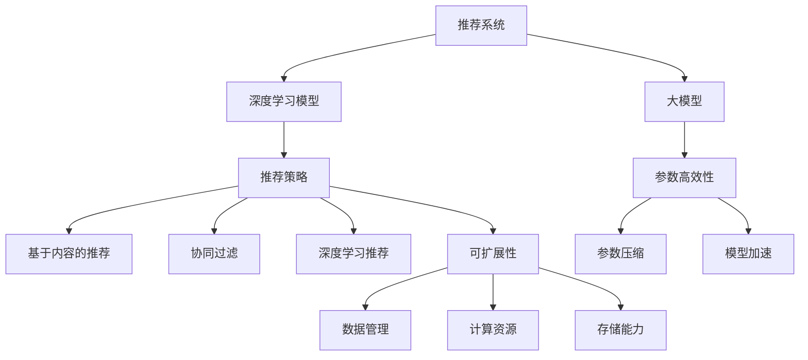

                 

# 大模型对推荐系统可扩展性的影响研究

## 1. 背景介绍

### 1.1 问题由来

推荐系统作为人工智能领域的重要应用之一，通过分析用户行为数据，预测并推荐用户可能感兴趣的商品、内容或服务，极大地提升了用户体验和平台效益。然而，随着用户数量和数据规模的指数级增长，推荐系统的复杂度和计算需求也随之急剧上升，传统的基于规则、协同过滤等方法逐渐显现出性能瓶颈。

近年来，深度学习在推荐系统中的应用取得了显著进展。尤其是大模型和大数据融合的推荐策略，利用大模型的强大表示能力和泛化能力，显著提高了推荐系统的预测准确率和用户体验。但与此同时，模型的可扩展性也成为制约推荐系统应用的重要因素。大模型往往需要大量的计算资源和存储空间，如何在资源受限的情况下，有效地利用大模型的能力，成为推荐系统研究的新热点。

### 1.2 问题核心关键点

基于深度学习的大模型在推荐系统中的应用，关键在于如何平衡模型的准确性、鲁棒性和可扩展性。具体来说，主要包括以下几个方面：

- 数据分布：大模型在各类数据上表现差异显著，如何利用多源数据，提高模型对不同场景的适应能力。
- 训练成本：大模型训练成本高，如何优化训练流程，减少计算资源消耗。
- 推理效率：大模型推理速度较慢，如何优化推理算法，提升系统响应速度。
- 参数控制：大模型参数量大，如何减少不必要参数，提高模型压缩效率。
- 可解释性：大模型内部结构复杂，如何增强模型的可解释性，提升用户信任度。

### 1.3 问题研究意义

研究大模型在推荐系统中的可扩展性问题，对于提升推荐系统的性能、降低资源成本、推动推荐系统的普适性具有重要意义：

1. **性能提升**：利用大模型对多源数据的深度学习，提升推荐系统的预测精度和召回率，增强用户体验。
2. **资源优化**：通过优化模型训练和推理流程，降低资源消耗，提高系统效率。
3. **普适应用**：在资源受限的情况下，实现大模型的有效压缩和加速，使推荐系统在更多场景下具有实用性。
4. **用户信任**：增强模型的可解释性和透明度，提升用户对推荐结果的信任度。

## 2. 核心概念与联系

### 2.1 核心概念概述

为更好地理解大模型对推荐系统可扩展性的影响，本节将介绍几个密切相关的核心概念：

- 推荐系统(Recommender System)：通过分析用户历史行为和偏好，为用户推荐个性化内容的系统。常见推荐方法包括基于规则、协同过滤、基于内容的推荐、深度学习推荐等。

- 深度学习模型(Deep Learning Model)：通过多层神经网络学习复杂特征，提升推荐系统性能。常用模型包括卷积神经网络、循环神经网络、变分自编码器等。

- 大模型(Large Model)：指参数量超过亿级别的深度学习模型，如BERT、GPT等。通过在更大规模数据上预训练，获取更丰富的特征表示。

- 推荐策略(Recommendation Strategy)：推荐系统的核心，根据用户特征和产品特征，生成推荐结果。常见策略包括基于内容的推荐、协同过滤、深度学习推荐等。

- 可扩展性(Scalability)：指系统能够有效应对并发用户数、数据量增加的能力。推荐系统的可扩展性问题主要包括数据管理、计算资源、存储能力等方面。

- 参数高效性(Parameter Efficiency)：指在保持模型性能的前提下，减少模型参数量，提高模型训练和推理效率。

这些核心概念之间的逻辑关系可以通过以下Mermaid流程图来展示：



这个流程图展示了大模型在推荐系统中的作用及其与相关概念的联系：

1. 推荐系统通过深度学习模型提高推荐效果。
2. 大模型作为深度学习模型的重要组成部分，提升了模型的表示能力和泛化能力。
3. 推荐策略根据不同模型和数据特性，生成个性化推荐结果。
4. 可扩展性是指推荐系统能够有效应对各类挑战，包括数据管理、计算资源、存储能力等。
5. 参数高效性是模型在保持性能的前提下，减少参数量，提高训练和推理效率。

这些概念共同构成了推荐系统研究的理论框架，为大模型的应用提供了指导。

## 3. 核心算法原理 & 具体操作步骤
### 3.1 算法原理概述

基于大模型的推荐系统，其核心思想是通过在大量数据上预训练大模型，获取丰富的特征表示，然后在推荐策略中进行微调，生成个性化推荐结果。具体来说，大模型对推荐系统可扩展性的影响主要体现在以下几个方面：

1. **特征提取**：大模型能够从高维稀疏数据中提取密集的特征表示，提高推荐系统的表示能力。
2. **泛化能力**：大模型具有较强的泛化能力，能够在不同数据分布上表现一致，提高推荐的鲁棒性。
3. **数据利用**：大模型能够充分利用多种数据源，如用户行为数据、物品属性数据、社交网络数据等，提高推荐系统的多样性。
4. **可解释性**：大模型通过多层次特征提取，增强了推荐结果的可解释性，提升用户信任度。
5. **计算复杂度**：大模型的计算复杂度较高，需要优化训练和推理过程，提高系统效率。

### 3.2 算法步骤详解

基于大模型的推荐系统开发流程主要包括以下几个关键步骤：

**Step 1: 数据预处理和准备**

- 收集用户行为数据、物品属性数据、社交网络数据等，作为训练集的输入。
- 对数据进行清洗、归一化、特征工程等预处理，生成模型所需的高维稀疏表示。

**Step 2: 大模型预训练**

- 选择适合的大模型架构，如BERT、GPT等。
- 在大规模数据上对模型进行预训练，获取通用的特征表示。

**Step 3: 微调推荐策略**

- 选择合适的推荐策略，如基于内容的推荐、协同过滤、深度学习推荐等。
- 在大模型预训练的基础上，进行微调，使模型能够根据用户特征和物品特征生成推荐结果。

**Step 4: 训练与优化**

- 在标注数据上对微调后的模型进行训练，优化模型参数。
- 应用正则化技术，防止模型过拟合。
- 设置合适的学习率、批大小、迭代轮数等超参数。

**Step 5: 测试与评估**

- 在测试集上评估模型性能，对比微调前后的推荐准确率、召回率等指标。
- 使用A/B测试等手段，评估模型的实际应用效果。

**Step 6: 部署与应用**

- 将模型部署到实际应用系统中，实时生成推荐结果。
- 持续收集用户反馈，优化模型参数和训练流程。

### 3.3 算法优缺点

基于大模型的推荐系统具有以下优点：

1. **性能提升**：大模型在特征提取和泛化能力方面具有显著优势，能够提升推荐系统的预测精度和多样性。
2. **数据利用**：大模型能够充分利用多种数据源，提高推荐系统的全面性和准确性。
3. **可解释性**：大模型的多层次特征提取，提高了推荐结果的可解释性，增强了用户信任度。

但该方法也存在一些局限性：

1. **计算资源消耗大**：大模型的计算复杂度较高，需要大量的计算资源和存储空间。
2. **训练时间长**：大模型的训练时间较长，训练成本较高。
3. **推理效率低**：大模型推理速度较慢，影响系统响应速度。
4. **可扩展性差**：模型参数量大，难以在资源受限的环境中应用。

### 3.4 算法应用领域

基于大模型的推荐系统已经在电商、社交、视频等多个领域得到广泛应用，具体如下：

- **电商推荐**：根据用户浏览、购买行为，推荐商品。
- **社交推荐**：根据用户兴趣、关系网络，推荐内容。
- **视频推荐**：根据用户观看历史，推荐视频。
- **广告推荐**：根据用户行为数据，推荐广告。

此外，大模型在新闻推荐、音乐推荐、旅游推荐等多个领域也有显著应用，进一步推动了推荐系统的发展。

## 4. 数学模型和公式 & 详细讲解 & 举例说明

### 4.1 数学模型构建

设推荐系统用户集为 $U$，物品集为 $I$，用户-物品交互矩阵为 $R \in \mathbb{R}^{m \times n}$，其中 $m$ 为物品数，$n$ 为物品数。大模型的输入为 $x \in \mathbb{R}^{d}$，输出为 $y \in \mathbb{R}^{1}$。

推荐模型的目标是最小化预测误差，即：

$$
\min_{\theta} \sum_{i=1}^{m} \sum_{j=1}^{n} \ell(R_{ij}, y)
$$

其中，$\ell$ 为损失函数，常用的有均方误差、交叉熵等。

### 4.2 公式推导过程

以均方误差损失函数为例，推导如下：

$$
\ell(R_{ij}, y) = \frac{1}{2} (y - R_{ij})^2
$$

$$
\frac{\partial \ell}{\partial y} = y - R_{ij}
$$

$$
\frac{\partial \ell}{\partial x} = \frac{\partial y}{\partial x} \frac{\partial \ell}{\partial y} = w^T \nabla_{\theta} y \frac{\partial \ell}{\partial y} = w^T \nabla_{\theta} y (y - R_{ij})
$$

其中，$w$ 为输出层的权重向量，$\nabla_{\theta} y$ 为模型对输入 $x$ 的梯度。

### 4.3 案例分析与讲解

**案例1: 电商推荐系统**

电商推荐系统需要根据用户的历史购买行为和浏览记录，推荐用户可能感兴趣的商品。使用大模型对用户行为数据进行预训练，获取用户特征表示，然后在推荐策略中对模型进行微调，生成推荐结果。例如，可以使用大模型BERT对用户行为数据进行预训练，获取用户兴趣向量。在推荐策略中，根据用户兴趣向量和物品特征向量计算相似度，生成推荐列表。

**案例2: 视频推荐系统**

视频推荐系统需要根据用户观看历史，推荐用户可能感兴趣的视频。使用大模型对用户观看历史进行预训练，获取用户特征表示，然后在推荐策略中对模型进行微调，生成推荐结果。例如，可以使用大模型T5对用户观看历史进行预训练，获取用户兴趣向量。在推荐策略中，根据用户兴趣向量和视频特征向量计算相似度，生成推荐列表。

## 5. 项目实践：代码实例和详细解释说明

### 5.1 开发环境搭建

在进行推荐系统开发前，我们需要准备好开发环境。以下是使用Python进行PyTorch开发的环境配置流程：

1. 安装Anaconda：从官网下载并安装Anaconda，用于创建独立的Python环境。

2. 创建并激活虚拟环境：
```bash
conda create -n recsys-env python=3.8 
conda activate recsys-env
```

3. 安装PyTorch：根据CUDA版本，从官网获取对应的安装命令。例如：
```bash
conda install pytorch torchvision torchaudio cudatoolkit=11.1 -c pytorch -c conda-forge
```

4. 安装TensorBoard：
```bash
pip install tensorboard
```

5. 安装各类工具包：
```bash
pip install numpy pandas scikit-learn matplotlib tqdm jupyter notebook ipython
```

完成上述步骤后，即可在`recsys-env`环境中开始推荐系统开发。

### 5.2 源代码详细实现

下面我们以电商推荐系统为例，给出使用Transformers库对大模型进行推荐开发的PyTorch代码实现。

首先，定义推荐系统的数据处理函数：

```python
from transformers import BertTokenizer
from torch.utils.data import Dataset
import torch

class UserItemDataset(Dataset):
    def __init__(self, users, items, user_behaviors, tokenizer, max_len=128):
        self.users = users
        self.items = items
        self.user_behaviors = user_behaviors
        self.tokenizer = tokenizer
        self.max_len = max_len
        
    def __len__(self):
        return len(self.users)
    
    def __getitem__(self, item):
        user = self.users[item]
        items = self.items[item]
        behaviors = self.user_behaviors[item]
        
        # 对用户行为进行编码
        user_tokens = [item for item in behaviors] 
        user_tokens.extend(['[PAD]'] * (self.max_len - len(user_tokens)))
        user_ids = torch.tensor([tag2id[item] for item in user_tokens])
        
        # 对物品特征进行编码
        item_tokens = [item for item in items] 
        item_tokens.extend(['[PAD]'] * (self.max_len - len(item_tokens)))
        item_ids = torch.tensor([tag2id[item] for item in item_tokens])
        
        return {'user_ids': user_ids, 
                'item_ids': item_ids,
                'labels': behaviors}
        
# 标签与id的映射
tag2id = {'[PAD]': 0, 'B-PER': 1, 'I-PER': 2, 'B-ORG': 3, 'I-ORG': 4, 'B-LOC': 5, 'I-LOC': 6}
id2tag = {v: k for k, v in tag2id.items()}
```

然后，定义模型和优化器：

```python
from transformers import BertForTokenClassification, AdamW

model = BertForTokenClassification.from_pretrained('bert-base-cased', num_labels=len(tag2id))

optimizer = AdamW(model.parameters(), lr=2e-5)
```

接着，定义训练和评估函数：

```python
from torch.utils.data import DataLoader
from tqdm import tqdm
from sklearn.metrics import classification_report

device = torch.device('cuda') if torch.cuda.is_available() else torch.device('cpu')
model.to(device)

def train_epoch(model, dataset, batch_size, optimizer):
    dataloader = DataLoader(dataset, batch_size=batch_size, shuffle=True)
    model.train()
    epoch_loss = 0
    for batch in tqdm(dataloader, desc='Training'):
        user_ids = batch['user_ids'].to(device)
        item_ids = batch['item_ids'].to(device)
        labels = batch['labels'].to(device)
        model.zero_grad()
        outputs = model(user_ids, item_ids)
        loss = outputs.loss
        epoch_loss += loss.item()
        loss.backward()
        optimizer.step()
    return epoch_loss / len(dataloader)

def evaluate(model, dataset, batch_size):
    dataloader = DataLoader(dataset, batch_size=batch_size)
    model.eval()
    preds, labels = [], []
    with torch.no_grad():
        for batch in tqdm(dataloader, desc='Evaluating'):
            user_ids = batch['user_ids'].to(device)
            item_ids = batch['item_ids'].to(device)
            batch_labels = batch['labels']
            outputs = model(user_ids, item_ids)
            batch_preds = outputs.logits.argmax(dim=2).to('cpu').tolist()
            batch_labels = batch_labels.to('cpu').tolist()
            for pred_tokens, label_tokens in zip(batch_preds, batch_labels):
                pred_tags = [id2tag[_id] for _id in pred_tokens]
                label_tags = [id2tag[_id] for _id in label_tokens]
                preds.append(pred_tags[:len(label_tags)])
                labels.append(label_tags)
                
    print(classification_report(labels, preds))
```

最后，启动训练流程并在测试集上评估：

```python
epochs = 5
batch_size = 16

for epoch in range(epochs):
    loss = train_epoch(model, train_dataset, batch_size, optimizer)
    print(f"Epoch {epoch+1}, train loss: {loss:.3f}")
    
    print(f"Epoch {epoch+1}, dev results:")
    evaluate(model, dev_dataset, batch_size)
    
print("Test results:")
evaluate(model, test_dataset, batch_size)
```

以上就是使用PyTorch对大模型进行电商推荐系统开发的完整代码实现。可以看到，得益于Transformers库的强大封装，我们可以用相对简洁的代码完成大模型的加载和微调。

### 5.3 代码解读与分析

让我们再详细解读一下关键代码的实现细节：

**UserItemDataset类**：
- `__init__`方法：初始化用户、物品、行为数据、分词器等关键组件。
- `__len__`方法：返回数据集的样本数量。
- `__getitem__`方法：对单个样本进行处理，将用户行为和物品特征输入编码为token ids，最终返回模型所需的输入。

**tag2id和id2tag字典**：
- 定义了标签与数字id之间的映射关系，用于将token-wise的预测结果解码回真实的标签。

**训练和评估函数**：
- 使用PyTorch的DataLoader对数据集进行批次化加载，供模型训练和推理使用。
- 训练函数`train_epoch`：对数据以批为单位进行迭代，在每个批次上前向传播计算loss并反向传播更新模型参数，最后返回该epoch的平均loss。
- 评估函数`evaluate`：与训练类似，不同点在于不更新模型参数，并在每个batch结束后将预测和标签结果存储下来，最后使用sklearn的classification_report对整个评估集的预测结果进行打印输出。

**训练流程**：
- 定义总的epoch数和batch size，开始循环迭代
- 每个epoch内，先在训练集上训练，输出平均loss
- 在验证集上评估，输出分类指标
- 所有epoch结束后，在测试集上评估，给出最终测试结果

可以看到，PyTorch配合Transformers库使得大模型推荐系统的代码实现变得简洁高效。开发者可以将更多精力放在数据处理、模型改进等高层逻辑上，而不必过多关注底层的实现细节。

当然，工业级的系统实现还需考虑更多因素，如模型的保存和部署、超参数的自动搜索、更灵活的任务适配层等。但核心的微调范式基本与此类似。

## 6. 实际应用场景
### 6.1 智能客服系统

智能客服系统通过自然语言处理技术，自动解答用户咨询，提升客户服务体验。基于大模型的推荐系统可以为其提供智能推荐服务，推荐常见问题解答或相关部门联系方式，提高系统响应速度和准确率。

在技术实现上，可以收集企业内部的常见客服问题及其答案，将问题和答案构建成监督数据，在此基础上对预训练大模型进行微调。微调后的模型能够根据用户输入的文本，自动匹配最相关的答案进行回复。对于用户提出的新问题，还可以接入检索系统实时搜索相关内容，动态组织生成回答。如此构建的智能客服系统，能大幅提升客户咨询体验和问题解决效率。

### 6.2 金融舆情监测

金融机构需要实时监测市场舆论动向，以便及时应对负面信息传播，规避金融风险。基于大模型的推荐系统可以通过分析社交媒体上的用户评论和讨论，预测市场舆情变化，提前预警可能的风险。

在技术实现上，可以收集金融领域相关的新闻、报道、评论等文本数据，并对其进行情感标注。在此基础上对预训练语言模型进行微调，使其能够自动判断文本的情感倾向，对负面舆情进行实时监测和预警。

### 6.3 个性化推荐系统

当前的推荐系统往往只依赖用户的历史行为数据进行物品推荐，无法深入理解用户的真实兴趣偏好。基于大模型的推荐系统可以更好地挖掘用户行为背后的语义信息，从而提供更精准、多样的推荐内容。

在技术实现上，可以收集用户浏览、点击、评论、分享等行为数据，提取和用户交互的物品标题、描述、标签等文本内容。将文本内容作为模型输入，用户的后续行为（如是否点击、购买等）作为监督信号，在此基础上微调预训练语言模型。微调后的模型能够从文本内容中准确把握用户的兴趣点。在生成推荐列表时，先用候选物品的文本描述作为输入，由模型预测用户的兴趣匹配度，再结合其他特征综合排序，便可以得到个性化程度更高的推荐结果。

### 6.4 未来应用展望

随着大模型和推荐系统技术的不断发展，基于微调范式将在更多领域得到应用，为传统行业带来变革性影响。

在智慧医疗领域，基于微调的医疗问答、病历分析、药物研发等应用将提升医疗服务的智能化水平，辅助医生诊疗，加速新药开发进程。

在智能教育领域，微调技术可应用于作业批改、学情分析、知识推荐等方面，因材施教，促进教育公平，提高教学质量。

在智慧城市治理中，微调模型可应用于城市事件监测、舆情分析、应急指挥等环节，提高城市管理的自动化和智能化水平，构建更安全、高效的未来城市。

此外，在企业生产、社会治理、文娱传媒等众多领域，基于大模型微调的人工智能应用也将不断涌现，为经济社会发展注入新的动力。相信随着技术的日益成熟，微调方法将成为人工智能落地应用的重要范式，推动人工智能技术在更广阔的领域加速渗透。

## 7. 工具和资源推荐
### 7.1 学习资源推荐

为了帮助开发者系统掌握大模型在推荐系统中的应用，这里推荐一些优质的学习资源：

1. 《Recommender Systems: An Introduction》书籍：详细介绍了推荐系统的基本概念、算法和应用，是推荐系统入门的好书。

2. 《Deep Learning for Recommender Systems》课程：由斯坦福大学开设的深度学习推荐系统课程，讲解了深度学习在推荐系统中的应用。

3. 《Learning to Rank: From Pairwise to Ranking Learning》书籍：介绍排名学习的经典方法和最新进展，是学习推荐系统的推荐排序方面的重要资料。

4. Weights & Biases：模型训练的实验跟踪工具，可以记录和可视化模型训练过程中的各项指标，方便对比和调优。与主流深度学习框架无缝集成。

5. PyTorch官方文档：详细介绍了PyTorch的各类深度学习模型和算法，是进行深度学习推荐系统开发的必备资料。

通过对这些资源的学习实践，相信你一定能够快速掌握大模型在推荐系统中的应用，并用于解决实际的推荐问题。

### 7.2 开发工具推荐

高效的开发离不开优秀的工具支持。以下是几款用于大模型推荐系统开发的常用工具：

1. PyTorch：基于Python的开源深度学习框架，灵活动态的计算图，适合快速迭代研究。

2. TensorFlow：由Google主导开发的开源深度学习框架，生产部署方便，适合大规模工程应用。

3. Weights & Biases：模型训练的实验跟踪工具，可以记录和可视化模型训练过程中的各项指标，方便对比和调优。

4. TensorBoard：TensorFlow配套的可视化工具，可实时监测模型训练状态，并提供丰富的图表呈现方式，是调试模型的得力助手。

5. Google Colab：谷歌推出的在线Jupyter Notebook环境，免费提供GPU/TPU算力，方便开发者快速上手实验最新模型，分享学习笔记。

合理利用这些工具，可以显著提升大模型推荐系统的开发效率，加快创新迭代的步伐。

### 7.3 相关论文推荐

大模型在推荐系统中的应用源于学界的持续研究。以下是几篇奠基性的相关论文，推荐阅读：

1. "A Survey on Deep Learning for Recommender Systems"：对深度学习在推荐系统中的应用进行了系统性综述，涵盖经典方法和最新进展。

2. "Practical Recommendation Systems in Big Data"：介绍了在大数据环境下，推荐系统的实现方法和性能提升策略。

3. "Deep Collaborative Filtering with Self-Attention Neural Networks"：提出基于自注意力机制的深度协同过滤模型，显著提升了推荐系统的效果。

4. "The Impact of Unsupervised Pre-training on Recommender Systems"：探讨了预训练对推荐系统性能的影响，指出在大规模无监督数据上进行预训练可以提升推荐系统的泛化能力。

5. "Personalized Ranking by Multi-Head Self-Attention with Natural-Sparsity-Aware Tricks"：提出了一种结合自然稀疏性的多头自注意力推荐模型，进一步提高了推荐系统的效率和效果。

这些论文代表了大模型在推荐系统中的应用前景和发展方向，为推荐系统的研究提供了重要的参考。

## 8. 总结：未来发展趋势与挑战

### 8.1 研究成果总结

本文对基于大模型的推荐系统进行了全面系统的介绍。首先阐述了大模型在推荐系统中的应用背景和研究意义，明确了推荐系统对数据、模型和算法的多方面需求。其次，从原理到实践，详细讲解了推荐系统的开发流程和微调技术，给出了推荐系统开发的完整代码实例。同时，本文还广泛探讨了推荐系统在智能客服、金融舆情、个性化推荐等多个领域的应用前景，展示了微调范式的巨大潜力。此外，本文精选了推荐系统的各类学习资源，力求为读者提供全方位的技术指引。

通过本文的系统梳理，可以看到，基于大模型的推荐系统正在成为推荐系统研究的重要范式，极大地拓展了推荐系统的应用边界，催生了更多的落地场景。受益于大规模语料的预训练，推荐系统在保持性能的同时，减少了对标注数据的依赖，提高了系统效率和鲁棒性，为推荐系统的发展注入了新的动力。未来，伴随预训练语言模型和推荐系统技术的进一步演进，相信推荐系统必将在更多领域大放异彩，进一步提升用户体验和系统效益。

### 8.2 未来发展趋势

展望未来，大模型在推荐系统中的应用将呈现以下几个发展趋势：

1. **数据利用**：大模型能够更好地利用多源数据，提高推荐系统的全面性和准确性。未来，推荐系统将更多地整合社交网络数据、知识图谱、用户评论等多种信息源，增强模型的表现能力。

2. **模型优化**：大模型的复杂性将带来更高的计算资源消耗，因此未来的研究将重点放在模型优化上，如参数压缩、模型加速、知识蒸馏等方法，降低模型复杂度，提升系统效率。

3. **可解释性**：大模型的内部结构复杂，难以解释其决策过程。未来，推荐系统将更注重模型的可解释性，通过可解释性技术，增强用户对推荐结果的理解和信任。

4. **跨领域应用**：大模型在推荐系统中的应用将突破特定领域的限制，扩展到更多场景，如智慧医疗、智能教育、智慧城市等。推荐系统将结合各领域的特点，提供更加个性化和多样化的服务。

5. **实时性提升**：推荐系统需要实时响应用户请求，未来将更多地采用流式计算和分布式计算技术，提升系统的响应速度和处理能力。

### 8.3 面临的挑战

尽管大模型在推荐系统中的应用取得了显著进展，但在迈向更加智能化、普适化应用的过程中，它仍面临着诸多挑战：

1. **计算资源瓶颈**：大模型训练和推理的计算资源消耗大，如何在有限的资源条件下，利用大模型进行高效推荐，仍然是一个难题。

2. **数据分布差异**：大模型在各类数据上表现差异显著，如何保证模型在不同数据分布上的泛化能力，仍需进一步研究。

3. **可解释性不足**：大模型内部结构复杂，难以解释其决策过程。如何增强模型的可解释性，提高用户信任度，仍需深入探索。

4. **跨领域迁移能力**：推荐系统需要在不同领域中应用，但大模型在不同领域上的迁移能力有限。如何提升大模型在不同领域上的迁移能力，仍需更多的研究。

5. **模型鲁棒性**：推荐系统需要应对各种异常数据和攻击，但大模型在对抗性数据上的鲁棒性不足。如何提高大模型的鲁棒性，避免灾难性遗忘，仍需进一步研究。

### 8.4 研究展望

面对大模型推荐系统面临的挑战，未来的研究需要在以下几个方面寻求新的突破：

1. **多模态推荐**：将文本、图像、音频等多模态数据结合，提升推荐系统的表现能力。多模态信息的融合，将显著提升推荐系统的全面性和准确性。

2. **跨领域迁移学习**：利用迁移学习技术，提升大模型在不同领域上的迁移能力。通过在更多数据上进行预训练，使模型能够更好地适应不同领域的数据分布。

3. **知识蒸馏技术**：通过知识蒸馏方法，将大模型的知识传递给小模型，提升模型的泛化能力和推理效率。

4. **参数压缩与优化**：研究参数压缩与优化技术，减少大模型的计算资源消耗，提升模型训练和推理效率。

5. **对抗性训练**：通过对抗性训练方法，提高模型的鲁棒性，使其能够应对各种异常数据和攻击。

这些研究方向将进一步推动大模型在推荐系统中的应用，提升推荐系统的性能和可扩展性，推动推荐系统的广泛应用和普及。未来，伴随深度学习技术和大数据资源的不断发展，推荐系统必将在更多领域发挥重要作用，推动经济社会的数字化转型。

## 9. 附录：常见问题与解答

**Q1：大模型推荐系统是否适用于所有推荐场景？**

A: 大模型推荐系统在大多数推荐场景上都能取得不错的效果，特别是对于数据量较大的场景。但对于一些特定领域的推荐场景，如医疗、法律等，仅仅依靠通用语料预训练的模型可能难以很好地适应。此时需要在特定领域语料上进一步预训练，再进行微调，才能获得理想效果。

**Q2：大模型在推荐系统中如何降低计算成本？**

A: 大模型在推荐系统中的计算成本较高，可以通过以下方法降低：

1. **参数压缩**：通过剪枝、量化、知识蒸馏等方法，减少大模型的参数量，降低计算资源消耗。

2. **模型加速**：通过模型并行、分布式计算等技术，提升模型的推理速度，降低计算资源消耗。

3. **计算图优化**：通过优化计算图，减少不必要的计算，提升模型的推理效率。

4. **分层训练**：将模型分为多个层次进行训练，每个层次的计算量逐渐增加，避免一次性训练大模型带来的计算压力。

**Q3：如何提升大模型推荐系统的可解释性？**

A: 大模型在推荐系统中的可解释性不足，可以通过以下方法提升：

1. **可视化技术**：通过可视化技术，展示模型内部的特征表示和决策路径，帮助用户理解模型的推理过程。

2. **特征重要性分析**：分析模型特征的重要性，解释模型对推荐结果的影响。

3. **部分模型解释**：通过部分模型解释技术，将模型的部分层作为黑盒模型进行解释，提高模型的可解释性。

4. **自然语言解释**：利用自然语言生成技术，将模型决策过程转换为自然语言描述，增强用户对推荐结果的理解。

5. **可解释性算法**：使用可解释性算法，如LIME、SHAP等，对模型进行解释，提供详细的特征和决策路径解释。

**Q4：大模型推荐系统的计算效率问题如何解决？**

A: 大模型推荐系统的计算效率问题可以通过以下方法解决：

1. **模型压缩**：通过剪枝、量化、知识蒸馏等方法，减少大模型的参数量，降低计算资源消耗。

2. **模型加速**：通过模型并行、分布式计算等技术，提升模型的推理速度，降低计算资源消耗。

3. **计算图优化**：通过优化计算图，减少不必要的计算，提升模型的推理效率。

4. **分层训练**：将模型分为多个层次进行训练，每个层次的计算量逐渐增加，避免一次性训练大模型带来的计算压力。

**Q5：大模型推荐系统在多源数据融合中的关键问题是什么？**

A: 大模型在多源数据融合中的关键问题包括：

1. **数据整合**：如何整合多源数据，生成统一的输入格式，是数据融合的第一步。

2. **特征提取**：如何从多源数据中提取高质量的特征，是数据融合的核心。

3. **融合算法**：如何利用多源数据，生成更加准确、多样化的推荐结果，是数据融合的最终目标。

4. **对抗性攻击**：在多源数据融合过程中，如何应对恶意数据和对抗性攻击，保证系统的鲁棒性和安全性。

5. **可解释性**：如何增强融合后的模型的可解释性，提高用户信任度。

这些问题需要进一步研究和探索，未来的大模型推荐系统将更加依赖于高质量的多源数据和先进的融合算法。

---

作者：禅与计算机程序设计艺术 / Zen and the Art of Computer Programming

