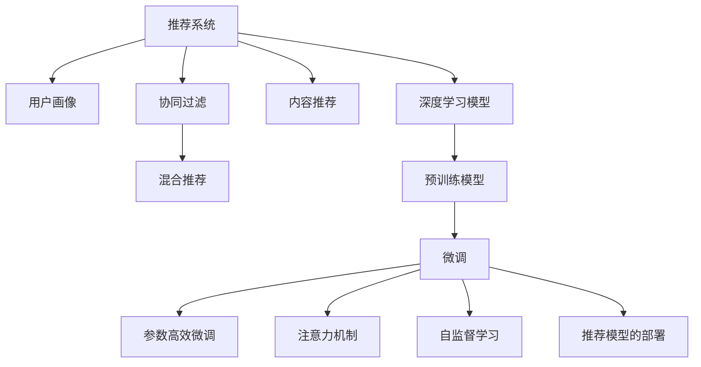

                 

## 1. 背景介绍

在数字时代，个性化推荐系统(Personalized Recommendation Systems, PReS)作为一项关键技术，在电商、视频、音乐、社交媒体等诸多领域中发挥着重要作用。通过精准地为用户推荐感兴趣的物品，PReS能够显著提升用户体验，增加用户粘性，驱动业务增长。然而，如何实现更加个性化、高效、实时的推荐，一直是推荐系统研究的热点。

大模型技术的兴起为PReS带来了新的发展契机。以Transformer为代表的深度学习模型，通过对海量文本数据的自监督预训练，获取了丰富的语言表示能力，能够在更抽象的语义层面理解用户的意图和偏好。结合PReS任务，通过微调、Fine-Tuning等方法，大模型可以更灵活地适应特定用户群体和实时场景，提供更高质量的个性化推荐。

本节将系统介绍大模型在PReS中的应用，包括微调原理、具体操作步骤，以及其在实际场景中的应用效果。

## 2. 核心概念与联系

### 2.1 核心概念概述

为了更好地理解大模型在推荐系统中的应用，本节将介绍几个关键概念：

- 推荐系统(Recommendation Systems, RS)：通过用户的历史行为、兴趣偏好等数据，为用户推荐感兴趣的物品的系统。

- 用户画像(User Profile)：表示用户兴趣偏好和行为特征的向量表示，用于指导推荐决策。

- 个性化推荐(Personalized Recommendation)：根据用户画像，推荐最符合用户兴趣的物品。

- 协同过滤(Collaborative Filtering, CF)：基于用户行为数据的推荐方法，分为基于用户的CF和基于物品的CF。

- 内容推荐(Content-Based Recommendation)：基于物品特征的推荐方法，如基于文本的推荐。

- 混合推荐(Hybrid Recommendation)：结合CF和CB的优点，构建多模态、多因素的推荐系统。

- 深度学习模型(Deep Learning Models)：如自回归模型、卷积神经网络、循环神经网络等，用于提取复杂特征和捕捉非线性关系。

- 预训练模型(Pre-trained Models)：如BERT、GPT、LSTM等，通过大规模无标签数据预训练，学习通用的语言表示。

- 微调(Fine-tuning)：在大模型上进行有监督学习，针对特定任务进行参数优化，提升模型性能。

- 参数高效微调(Parameter-Efficient Fine-Tuning, PEFT)：在不更新大部分预训练参数的情况下，微调少量任务相关参数。

- 注意力机制(Attention Mechanism)：用于捕捉输入序列间关系，提高模型性能。

- 自监督学习(Self-Supervised Learning)：利用数据自身的信息，无需标注数据进行训练。

- 推荐模型的部署(Recommendation Model Deployment)：将训练好的模型部署到线上系统，实现实时推荐。

这些概念之间的联系通过以下Mermaid流程图来展示：



## 3. 核心算法原理 & 具体操作步骤

### 3.1 算法原理概述

大模型在推荐系统中的应用主要基于微调技术。具体而言，假设预训练语言模型为 $M_{\theta}$，其中 $\theta$ 为模型参数。假设训练集为 $D=\{(x_i, y_i)\}_{i=1}^N$，$x_i$ 表示用户特征向量，$y_i$ 表示推荐结果。微调的目标是找到最优参数 $\hat{\theta}$，使得模型输出尽可能接近真实标签。

微调的具体过程如下：

1. 构建推荐模型的损失函数 $\mathcal{L}(\theta)$，通常使用交叉熵损失、均方误差损失等。
2. 使用优化算法（如AdamW、SGD等）最小化损失函数，更新模型参数 $\theta$。
3. 在验证集上评估模型性能，判断是否提前停止。
4. 在测试集上验证微调效果，提供实时推荐。

### 3.2 算法步骤详解

基于大模型的推荐系统微调一般包括以下几个关键步骤：

**Step 1: 准备预训练模型和数据集**
- 选择合适的预训练语言模型 $M_{\theta}$ 作为初始化参数，如BERT、GPT等。
- 准备推荐系统的训练集 $D=\{(x_i, y_i)\}_{i=1}^N$，其中 $x_i$ 表示用户特征向量，$y_i$ 表示推荐结果。
- 将训练集划分为训练集、验证集和测试集，比例为7:1:2。

**Step 2: 设计任务适配层**
- 根据推荐系统任务类型，在预训练模型顶层设计合适的输出层和损失函数。
- 对于分类推荐任务，通常使用交叉熵损失；对于生成推荐任务，通常使用语言模型的负对数似然损失。
- 设计推荐目标函数，如点击率预测、转化率预测等。

**Step 3: 设置微调超参数**
- 选择合适的优化算法及其参数，如AdamW、SGD等，设置学习率、批大小、迭代轮数等。
- 设置正则化技术及强度，包括权重衰减、Dropout、Early Stopping等。
- 确定冻结预训练参数的策略，如仅微调顶层，或全部参数都参与微调。

**Step 4: 执行梯度训练**
- 将训练集数据分批次输入模型，前向传播计算损失函数。
- 反向传播计算参数梯度，根据设定的优化算法和学习率更新模型参数。
- 周期性在验证集上评估模型性能，根据性能指标决定是否触发 Early Stopping。
- 重复上述步骤直至满足预设的迭代轮数或 Early Stopping 条件。

**Step 5: 测试和部署**
- 在测试集上评估微调后模型 $M_{\hat{\theta}}$ 的性能，对比微调前后的精度提升。
- 使用微调后的模型对新样本进行推理预测，集成到实际的应用系统中。
- 持续收集新的数据，定期重新微调模型，以适应数据分布的变化。

以上是基于大模型的推荐系统微调的一般流程。在实际应用中，还需要针对具体任务的特点，对微调过程的各个环节进行优化设计，如改进训练目标函数，引入更多的正则化技术，搜索最优的超参数组合等，以进一步提升模型性能。

### 3.3 算法优缺点

大模型在推荐系统中的应用，具有以下优点：

1. 强大的语义理解能力：大模型通过预训练获取了丰富的语言表示，能够捕捉用户复杂的兴趣和偏好。

2. 高效的处理能力：利用大规模的并行计算能力，大模型可以快速处理用户特征和推荐结果，提高推荐效率。

3. 泛化能力强：大模型可以在多个推荐场景中泛化应用，适应不同领域和数据分布的推荐需求。

4. 可解释性强：大模型的语言表示直观易懂，便于开发者理解和调试推荐逻辑。

5. 适应性强：通过微调，大模型可以实时动态地适应用户需求，提供个性化的推荐服务。

同时，该方法也存在一定的局限性：

1. 数据量要求高：推荐系统需要大量用户行为数据进行训练，大模型对数据量的要求较高。

2. 计算资源消耗大：大模型参数量庞大，需要强大的计算资源支持。

3. 可解释性不足：大模型的内部机制复杂，难以解释推荐过程和决策依据。

4. 冷启动问题：对于新用户，缺乏足够的历史行为数据，难以进行精准推荐。

5. 鲁棒性差：大模型对输入数据的扰动敏感，容易受到噪声和异常数据的影响。

尽管存在这些局限性，但就目前而言，基于大模型的微调方法仍是在推荐系统研究中极具前景的技术。未来相关研究的重点在于如何进一步降低大模型对标注数据的依赖，提高模型的可解释性和鲁棒性，同时兼顾用户隐私和安全性等因素。

### 3.4 算法应用领域

大模型在推荐系统中的应用领域极为广泛，涵盖了电商、视频、音乐、社交媒体等多个行业。以下是一些典型的应用场景：

- **电商推荐**：利用用户浏览、购买、评价等数据，为用户推荐商品。通过微调大模型，提升推荐精度和个性化程度。
- **视频推荐**：根据用户观看记录和评分数据，为用户推荐视频内容。通过微调大模型，提升用户满意度，增加观看时长。
- **音乐推荐**：根据用户听歌历史和评论数据，为用户推荐音乐曲目。通过微调大模型，提供更符合用户口味的推荐。
- **社交媒体推荐**：根据用户互动行为和内容偏好，为用户推荐社交媒体内容。通过微调大模型，提升互动质量和用户体验。

除了上述这些经典任务外，大模型还被创新性地应用到更多场景中，如跨模态推荐、智能客服推荐、事件推荐等，为推荐系统带来了全新的突破。随着预训练模型和微调方法的不断进步，相信推荐系统必将在更广阔的应用领域大放异彩。

## 4. 数学模型和公式 & 详细讲解 & 举例说明

### 4.1 数学模型构建

假设推荐系统用户特征向量为 $x \in \mathbb{R}^d$，推荐结果为 $y \in \{0,1\}$，表示是否推荐。微调模型的目标是最小化损失函数 $\mathcal{L}(\theta)$：

$$
\mathcal{L}(\theta) = -\frac{1}{N}\sum_{i=1}^N [y_i\log M_{\theta}(x_i)+(1-y_i)\log(1-M_{\theta}(x_i))]
$$

其中 $M_{\theta}(x)$ 表示微调后模型对用户特征的预测输出，可以是交叉熵损失函数的形式。

### 4.2 公式推导过程

假设微调后模型为 $M_{\hat{\theta}}$，其对用户特征 $x$ 的预测输出为 $\hat{y}=M_{\hat{\theta}}(x) \in [0,1]$。则损失函数对参数 $\hat{\theta}_k$ 的梯度为：

$$
\frac{\partial \mathcal{L}(\hat{\theta})}{\partial \hat{\theta}_k} = -\frac{1}{N}\sum_{i=1}^N (\frac{y_i}{\hat{y}_i}-\frac{1-y_i}{1-\hat{y}_i}) \frac{\partial M_{\hat{\theta}}(x_i)}{\partial \hat{\theta}_k}
$$

其中 $\frac{\partial M_{\hat{\theta}}(x_i)}{\partial \hat{\theta}_k}$ 可进一步递归展开，利用自动微分技术完成计算。

### 4.3 案例分析与讲解

假设我们有一个电商推荐系统，希望通过微调BERT模型实现个性化推荐。首先，收集用户的历史行为数据和物品特征数据，将用户特征和推荐结果构建成监督数据。其次，使用BERT模型作为预训练模型，通过交叉熵损失函数进行微调。最后，利用微调后的模型对新样本进行推理预测，生成个性化推荐结果。

## 5. 项目实践：代码实例和详细解释说明

### 5.1 开发环境搭建

在进行推荐系统微调实践前，我们需要准备好开发环境。以下是使用Python进行PyTorch开发的环境配置流程：

1. 安装Anaconda：从官网下载并安装Anaconda，用于创建独立的Python环境。

2. 创建并激活虚拟环境：
```bash
conda create -n pytorch-env python=3.8 
conda activate pytorch-env
```

3. 安装PyTorch：根据CUDA版本，从官网获取对应的安装命令。例如：
```bash
conda install pytorch torchvision torchaudio cudatoolkit=11.1 -c pytorch -c conda-forge
```

4. 安装Transformers库：
```bash
pip install transformers
```

5. 安装各类工具包：
```bash
pip install numpy pandas scikit-learn matplotlib tqdm jupyter notebook ipython
```

完成上述步骤后，即可在`pytorch-env`环境中开始推荐系统微调实践。

### 5.2 源代码详细实现

这里我们以电商推荐系统为例，给出使用Transformers库对BERT模型进行微调的PyTorch代码实现。

首先，定义推荐系统的数据处理函数：

```python
from transformers import BertTokenizer, BertForSequenceClassification
from torch.utils.data import Dataset
import torch

class RecommendationDataset(Dataset):
    def __init__(self, features, labels, tokenizer, max_len=128):
        self.features = features
        self.labels = labels
        self.tokenizer = tokenizer
        self.max_len = max_len
        
    def __len__(self):
        return len(self.features)
    
    def __getitem__(self, item):
        feature = self.features[item]
        label = self.labels[item]
        
        encoding = self.tokenizer(feature, return_tensors='pt', max_length=self.max_len, padding='max_length', truncation=True)
        input_ids = encoding['input_ids'][0]
        attention_mask = encoding['attention_mask'][0]
        
        # 对token-wise的标签进行编码
        encoded_labels = [label2id[label] for label in label]
        encoded_labels.extend([label2id['O']] * (self.max_len - len(encoded_labels)))
        labels = torch.tensor(encoded_labels, dtype=torch.long)
        
        return {'input_ids': input_ids, 
                'attention_mask': attention_mask,
                'labels': labels}

# 标签与id的映射
label2id = {'O': 0, '1': 1, '0': 2}
id2label = {v: k for k, v in label2id.items()}

# 创建dataset
tokenizer = BertTokenizer.from_pretrained('bert-base-cased')

train_dataset = RecommendationDataset(train_features, train_labels, tokenizer)
dev_dataset = RecommendationDataset(dev_features, dev_labels, tokenizer)
test_dataset = RecommendationDataset(test_features, test_labels, tokenizer)
```

然后，定义模型和优化器：

```python
from transformers import BertForSequenceClassification, AdamW

model = BertForSequenceClassification.from_pretrained('bert-base-cased', num_labels=len(label2id))

optimizer = AdamW(model.parameters(), lr=2e-5)
```

接着，定义训练和评估函数：

```python
from torch.utils.data import DataLoader
from tqdm import tqdm
from sklearn.metrics import accuracy_score

device = torch.device('cuda') if torch.cuda.is_available() else torch.device('cpu')
model.to(device)

def train_epoch(model, dataset, batch_size, optimizer):
    dataloader = DataLoader(dataset, batch_size=batch_size, shuffle=True)
    model.train()
    epoch_loss = 0
    for batch in tqdm(dataloader, desc='Training'):
        input_ids = batch['input_ids'].to(device)
        attention_mask = batch['attention_mask'].to(device)
        labels = batch['labels'].to(device)
        model.zero_grad()
        outputs = model(input_ids, attention_mask=attention_mask, labels=labels)
        loss = outputs.loss
        epoch_loss += loss.item()
        loss.backward()
        optimizer.step()
    return epoch_loss / len(dataloader)

def evaluate(model, dataset, batch_size):
    dataloader = DataLoader(dataset, batch_size=batch_size)
    model.eval()
    preds, labels = [], []
    with torch.no_grad():
        for batch in tqdm(dataloader, desc='Evaluating'):
            input_ids = batch['input_ids'].to(device)
            attention_mask = batch['attention_mask'].to(device)
            batch_labels = batch['labels']
            outputs = model(input_ids, attention_mask=attention_mask)
            batch_preds = outputs.logits.argmax(dim=2).to('cpu').tolist()
            batch_labels = batch_labels.to('cpu').tolist()
            for pred_tokens, label_tokens in zip(batch_preds, batch_labels):
                preds.append(pred_tokens[:len(label_tokens)])
                labels.append(label_tokens)
                
    print(accuracy_score(labels, preds))
```

最后，启动训练流程并在测试集上评估：

```python
epochs = 5
batch_size = 16

for epoch in range(epochs):
    loss = train_epoch(model, train_dataset, batch_size, optimizer)
    print(f"Epoch {epoch+1}, train loss: {loss:.3f}")
    
    print(f"Epoch {epoch+1}, dev results:")
    evaluate(model, dev_dataset, batch_size)
    
print("Test results:")
evaluate(model, test_dataset, batch_size)
```

以上就是使用PyTorch对BERT进行电商推荐系统微调的完整代码实现。可以看到，得益于Transformers库的强大封装，我们可以用相对简洁的代码完成BERT模型的加载和微调。

### 5.3 代码解读与分析

让我们再详细解读一下关键代码的实现细节：

**RecommendationDataset类**：
- `__init__`方法：初始化特征、标签、分词器等关键组件。
- `__len__`方法：返回数据集的样本数量。
- `__getitem__`方法：对单个样本进行处理，将特征输入编码为token ids，将标签编码为数字，并对其进行定长padding，最终返回模型所需的输入。

**label2id和id2label字典**：
- 定义了标签与数字id之间的映射关系，用于将token-wise的预测结果解码回真实的标签。

**训练和评估函数**：
- 使用PyTorch的DataLoader对数据集进行批次化加载，供模型训练和推理使用。
- 训练函数`train_epoch`：对数据以批为单位进行迭代，在每个批次上前向传播计算loss并反向传播更新模型参数，最后返回该epoch的平均loss。
- 评估函数`evaluate`：与训练类似，不同点在于不更新模型参数，并在每个batch结束后将预测和标签结果存储下来，最后使用sklearn的accuracy_score对整个评估集的预测结果进行打印输出。

**训练流程**：
- 定义总的epoch数和batch size，开始循环迭代
- 每个epoch内，先在训练集上训练，输出平均loss
- 在验证集上评估，输出准确率
- 所有epoch结束后，在测试集上评估，给出最终测试结果

可以看到，PyTorch配合Transformers库使得BERT微调的代码实现变得简洁高效。开发者可以将更多精力放在数据处理、模型改进等高层逻辑上，而不必过多关注底层的实现细节。

当然，工业级的系统实现还需考虑更多因素，如模型的保存和部署、超参数的自动搜索、更灵活的任务适配层等。但核心的微调范式基本与此类似。

## 6. 实际应用场景

### 6.1 电商推荐

在电商推荐场景中，通过微调BERT模型，可以显著提升推荐精度和个性化程度。电商平台收集用户的历史行为数据，如浏览、点击、购买等，将这些数据转化为用户特征向量和物品特征向量。通过微调BERT模型，可以学习到用户和物品间的语义关系，从而生成更加符合用户兴趣的推荐结果。

具体而言，可以将用户历史行为数据和物品特征数据构建为监督数据集，在此基础上对BERT模型进行微调。微调后的模型可以更加精准地捕捉用户兴趣和物品特征之间的关系，从而提高推荐效果。在实际应用中，可以根据用户行为数据的变化，周期性地重新微调模型，以确保推荐结果的时效性和个性化。

### 6.2 视频推荐

视频推荐系统通过微调BERT模型，可以实现更高效、更个性化的推荐。视频平台收集用户观看记录和评分数据，将用户行为和视频特征转化为监督数据集。通过微调BERT模型，可以学习到用户的观看偏好和视频内容之间的关系，从而生成符合用户兴趣的视频推荐结果。

此外，视频推荐系统还可以利用BERT模型的多模态特性，结合图像、音频等多模态数据，提升推荐模型的准确性和鲁棒性。例如，对于视频推荐系统，可以同时考虑用户观看的视频帧图像和视频片段的文本信息，通过微调BERT模型，生成多模态的推荐结果。

### 6.3 音乐推荐

音乐推荐系统通过微调BERT模型，可以实现更精准的推荐。音乐平台收集用户听歌历史和评分数据，将用户行为和音乐特征转化为监督数据集。通过微调BERT模型，可以学习到用户的音乐品味和音乐特征之间的关系，从而生成符合用户兴趣的音乐推荐结果。

此外，音乐推荐系统还可以利用BERT模型的多模态特性，结合音乐封面、歌词等信息，提升推荐模型的准确性和鲁棒性。例如，对于音乐推荐系统，可以同时考虑用户听歌的历史记录和音乐封面的视觉特征，通过微调BERT模型，生成多模态的推荐结果。

### 6.4 未来应用展望

随着大模型和微调方法的不断进步，推荐系统必将在更多领域得到应用，为各行各业带来变革性影响。

在智慧医疗领域，通过微调BERT模型，可以实现个性化的医疗推荐，辅助医生诊疗，提升医疗服务的智能化水平。

在智能教育领域，通过微调BERT模型，可以实现个性化的教育推荐，因材施教，促进教育公平，提高教学质量。

在智慧城市治理中，通过微调BERT模型，可以实现个性化的城市事件推荐，提高城市管理的自动化和智能化水平，构建更安全、高效的未来城市。

此外，在企业生产、社会治理、文娱传媒等众多领域，基于大模型微调的推荐系统也将不断涌现，为经济社会发展注入新的动力。相信随着技术的日益成熟，推荐系统必将在更广阔的应用领域大放异彩，深刻影响人类的生产生活方式。

## 7. 工具和资源推荐

### 7.1 学习资源推荐

为了帮助开发者系统掌握大模型在推荐系统中的应用，这里推荐一些优质的学习资源：

1. 《深度学习推荐系统》书籍：全面介绍深度学习在推荐系统中的应用，涵盖从数据处理到模型优化等多个方面。

2. 《Transformer from Zero》系列博文：由大模型技术专家撰写，深入浅出地介绍了Transformer原理、BERT模型、微调技术等前沿话题。

3. 《Recommender Systems in Practice》课程：由深度学习社区Kaggle提供，系统讲解推荐系统开发实践，适合初学者入门。

4. 《Personalized Recommendation with Attention Models》论文：详细介绍了注意力机制在推荐系统中的应用，值得深入学习。

5. 《Generative Adversarial Networks》论文：深入了解生成对抗网络在推荐系统中的应用，开拓思路。

通过对这些资源的学习实践，相信你一定能够快速掌握大模型在推荐系统中的应用精髓，并用于解决实际的推荐问题。

### 7.2 开发工具推荐

高效的开发离不开优秀的工具支持。以下是几款用于推荐系统微调开发的常用工具：

1. PyTorch：基于Python的开源深度学习框架，灵活动态的计算图，适合快速迭代研究。大部分预训练语言模型都有PyTorch版本的实现。

2. TensorFlow：由Google主导开发的开源深度学习框架，生产部署方便，适合大规模工程应用。同样有丰富的预训练语言模型资源。

3. Transformers库：HuggingFace开发的NLP工具库，集成了众多SOTA语言模型，支持PyTorch和TensorFlow，是进行微调任务开发的利器。

4. Weights & Biases：模型训练的实验跟踪工具，可以记录和可视化模型训练过程中的各项指标，方便对比和调优。与主流深度学习框架无缝集成。

5. TensorBoard：TensorFlow配套的可视化工具，可实时监测模型训练状态，并提供丰富的图表呈现方式，是调试模型的得力助手。

6. Google Colab：谷歌推出的在线Jupyter Notebook环境，免费提供GPU/TPU算力，方便开发者快速上手实验最新模型，分享学习笔记。

合理利用这些工具，可以显著提升推荐系统微调的开发效率，加快创新迭代的步伐。

### 7.3 相关论文推荐

大模型在推荐系统中的应用源于学界的持续研究。以下是几篇奠基性的相关论文，推荐阅读：

1. Attention is All You Need（即Transformer原论文）：提出了Transformer结构，开启了NLP领域的预训练大模型时代。

2. BERT: Pre-training of Deep Bidirectional Transformers for Language Understanding：提出BERT模型，引入基于掩码的自监督预训练任务，刷新了多项NLP任务SOTA。

3. Generative Adversarial Networks（GAN）：提出生成对抗网络，用于生成高质量的推荐样本，提升推荐系统的表现。

4. Matrix Factorization for Recommender Systems：介绍矩阵分解方法，用于推荐系统中的特征表示学习。

5. Neural Collaborative Filtering：介绍神经网络在协同过滤推荐中的应用，提升了推荐系统的精度。

6. Attention-Based Recommender Systems：介绍注意力机制在推荐系统中的应用，提高了推荐模型的泛化能力。

这些论文代表了大模型在推荐系统中的应用发展脉络。通过学习这些前沿成果，可以帮助研究者把握学科前进方向，激发更多的创新灵感。

## 8. 总结：未来发展趋势与挑战

### 8.1 总结

本文对大模型在推荐系统中的应用进行了全面系统的介绍。首先阐述了大模型在推荐系统中的应用背景和意义，明确了微调在提升推荐系统个性化和实效性方面的独特价值。其次，从原理到实践，详细讲解了微调的具体操作流程，给出了推荐系统微调的完整代码实现。同时，本文还广泛探讨了微调方法在电商、视频、音乐等多个推荐场景中的应用效果，展示了微调范式的巨大潜力。

通过本文的系统梳理，可以看到，基于大模型的微调方法正在成为推荐系统研究的重要范式，极大地拓展了推荐系统的应用边界，催生了更多的落地场景。受益于大规模语料的预训练，微调模型以更低的时间和标注成本，在小样本条件下也能取得不错的效果，有力推动了推荐系统的产业化进程。未来，伴随预训练语言模型和微调方法的不断进步，相信推荐系统必将在更广阔的应用领域大放异彩，深刻影响人类的生产生活方式。

### 8.2 未来发展趋势

展望未来，大模型在推荐系统中的应用将呈现以下几个发展趋势：

1. 推荐模型的规模持续增大。随着算力成本的下降和数据规模的扩张，大模型在推荐系统中的应用将越来越广泛，涵盖更多的推荐场景。

2. 微调方法的日趋多样。除了传统的全参数微调外，未来会涌现更多参数高效的微调方法，如Adapter等，在节省计算资源的同时也能保证微调精度。

3. 模型的实时性增强。通过优化微调模型的计算图，提升模型推理速度，实现实时推荐。

4. 跨模态推荐技术的发展。结合视觉、语音、文本等多模态信息，构建更加全面、准确的推荐模型。

5. 推荐系统的透明度提升。通过可解释性技术，提高推荐过程的可解释性，增强用户信任。

6. 推荐系统的社会价值挖掘。利用推荐系统，挖掘社会热点、时事动态等，为公共决策提供参考。

以上趋势凸显了大模型在推荐系统中的广阔前景。这些方向的探索发展，必将进一步提升推荐系统的性能和应用范围，为各行各业带来变革性影响。

### 8.3 面临的挑战

尽管大模型在推荐系统中的应用已经取得了显著进展，但在迈向更加智能化、普适化应用的过程中，它仍面临着诸多挑战：

1. 数据量瓶颈。推荐系统需要大量用户行为数据进行训练，大模型对数据量的要求较高。如何高效地收集和处理大规模用户行为数据，仍是一个难题。

2. 计算资源消耗。大模型参数量庞大，需要强大的计算资源支持。如何在有限的硬件资源下，实现高效推荐，仍是一个挑战。

3. 模型复杂性。大模型内部机制复杂，难以解释推荐过程和决策依据。如何提升推荐模型的可解释性，增强用户信任，仍是一个难题。

4. 鲁棒性不足。大模型对输入数据的扰动敏感，容易受到噪声和异常数据的影响。如何提高推荐模型的鲁棒性，避免推荐结果的波动，仍是一个挑战。

5. 隐私保护。推荐系统涉及用户隐私，如何保护用户隐私，避免数据泄露，仍是一个挑战。

尽管存在这些挑战，但大模型在推荐系统中的应用潜力巨大。未来，通过算法和技术的不断创新，有望逐步解决这些问题，推动推荐系统向更加智能化、普适化方向发展。

### 8.4 研究展望

面对大模型在推荐系统中的挑战，未来的研究需要在以下几个方面寻求新的突破：

1. 探索无监督和半监督微调方法。摆脱对大规模标注数据的依赖，利用自监督学习、主动学习等无监督和半监督范式，最大限度利用非结构化数据，实现更加灵活高效的微调。

2. 研究参数高效和计算高效的微调范式。开发更加参数高效的微调方法，在固定大部分预训练参数的情况下，只更新极少量的任务相关参数。同时优化微调模型的计算图，减少前向传播和反向传播的资源消耗，实现更加轻量级、实时性的部署。

3. 融合因果和对比学习范式。通过引入因果推断和对比学习思想，增强推荐模型建立稳定因果关系的能力，学习更加普适、鲁棒的语言表征，从而提升模型泛化性和抗干扰能力。

4. 引入更多先验知识。将符号化的先验知识，如知识图谱、逻辑规则等，与神经网络模型进行巧妙融合，引导微调过程学习更准确、合理的语言模型。同时加强不同模态数据的整合，实现视觉、语音等多模态信息与文本信息的协同建模。

5. 结合因果分析和博弈论工具。将因果分析方法引入推荐模型，识别出模型决策的关键特征，增强推荐过程的因果性和逻辑性。借助博弈论工具刻画人机交互过程，主动探索并规避模型的脆弱点，提高系统稳定性。

6. 纳入伦理道德约束。在模型训练目标中引入伦理导向的评估指标，过滤和惩罚有偏见、有害的输出倾向。同时加强人工干预和审核，建立模型行为的监管机制，确保输出符合人类价值观和伦理道德。

这些研究方向的探索，必将引领大模型在推荐系统中的应用走向更高的台阶，为构建安全、可靠、可解释、可控的推荐系统铺平道路。面向未来，大模型在推荐系统中的应用还需要与其他人工智能技术进行更深入的融合，如知识表示、因果推理、强化学习等，多路径协同发力，共同推动推荐系统向更智能化、普适化方向发展。只有勇于创新、敢于突破，才能不断拓展推荐系统的边界，让智能技术更好地造福人类社会。

## 9. 附录：常见问题与解答

**Q1：大模型在推荐系统中的应用原理是什么？**

A: 大模型在推荐系统中的应用基于微调技术。具体而言，假设预训练语言模型为 $M_{\theta}$，其中 $\theta$ 为模型参数。假设训练集为 $D=\{(x_i, y_i)\}_{i=1}^N$，$x_i$ 表示用户特征向量，$y_i$ 表示推荐结果。微调的目标是最小化损失函数 $\mathcal{L}(\theta)$：

$$
\mathcal{L}(\theta) = -\frac{1}{N}\sum_{i=1}^N [y_i\log M_{\theta}(x_i)+(1-y_i)\log(1-M_{\theta}(x_i))]
$$

其中 $M_{\theta}(x)$ 表示微调后模型对用户特征的预测输出，可以是交叉熵损失函数的形式。

**Q2：大模型在推荐系统中的应用步骤有哪些？**

A: 大模型在推荐系统中的应用主要基于微调技术。具体步骤包括：

1. 构建推荐系统的损失函数 $\mathcal{L}(\theta)$，通常使用交叉熵损失、均方误差损失等。

2. 使用优化算法（如AdamW、SGD等）最小化损失函数，更新模型参数 $\theta$。

3. 在验证集上评估模型性能，判断是否提前停止。

4. 在测试集上验证微调效果，提供实时推荐。

**Q3：大模型在推荐系统中的训练流程是什么？**

A: 大模型在推荐系统中的训练流程如下：

1. 收集用户历史行为数据和物品特征数据，构建监督数据集。

2. 选择合适的预训练语言模型 $M_{\theta}$ 作为初始化参数。

3. 设计推荐目标函数，如交叉熵损失函数。

4. 设置微调超参数，包括优化算法、学习率、批大小等。

5. 执行梯度训练，包括前向传播、反向传播和参数更新。

6. 周期性在验证集上评估模型性能，根据性能指标决定是否触发 Early Stopping。

7. 在测试集上验证微调效果，提供实时推荐。

8. 持续收集新的数据，定期重新微调模型，以适应数据分布的变化。

**Q4：大模型在推荐系统中的推荐效果如何？**

A: 大模型在推荐系统中的推荐效果主要通过微调技术实现。具体而言，大模型通过预训练获取了丰富的语言表示，能够捕捉用户复杂的兴趣和偏好。通过微调，可以学习到用户和物品间的语义关系，从而生成更加符合用户兴趣的推荐结果。在实际应用中，可以根据用户行为数据的变化，周期性地重新微调模型，以确保推荐结果的时效性和个性化。

**Q5：大模型在推荐系统中的计算资源消耗大吗？**

A: 大模型在推荐系统中的参数量庞大，需要强大的计算资源支持。特别是在大规模数据集和复杂模型的训练过程中，计算资源消耗较大。因此，需要在有限的硬件资源下，优化计算图，提升模型推理速度，实现实时推荐。

作者：禅与计算机程序设计艺术 / Zen and the Art of Computer Programming

