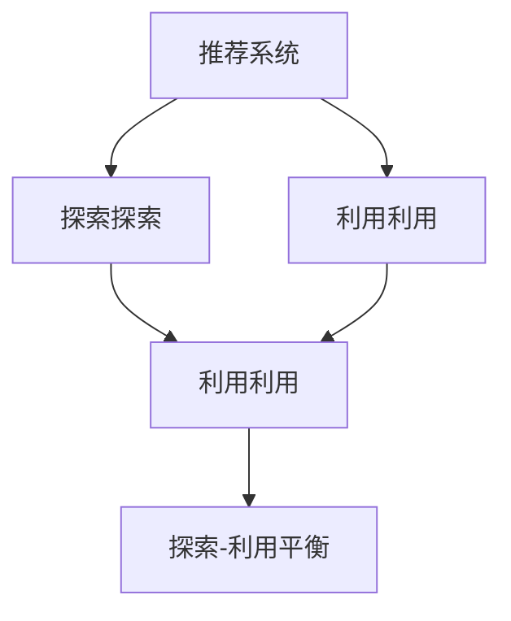

                 

# 大模型对推荐系统探索与利用平衡的影响

> 关键词：推荐系统,探索探索,利用利用,大模型,推荐平衡

## 1. 背景介绍

### 1.1 问题由来
推荐系统作为互联网时代信息检索的重要工具，其核心目标是通过对用户历史行为数据的分析，预测用户未来的偏好，从而为其推荐个性化内容。传统推荐系统主要基于用户-物品评分矩阵进行协同过滤推荐，但该方法依赖于高昂的标签标注成本，且只能针对已知类别进行推荐，难以捕捉用户的隐式偏好。

近年来，大语言模型在推荐系统中的应用逐渐增多。利用大规模预训练语言模型，可以捕捉用户文本数据中的语义信息，挖掘用户的隐式偏好，从而实现更精准的推荐。然而，在实际应用中，大语言模型与推荐系统的结合，也需要考虑如何平衡探索与利用，才能真正提升推荐效果，避免过度拟合，增强模型的泛化能力。

### 1.2 问题核心关键点
大语言模型对推荐系统的探索与利用平衡，主要包括以下几个方面：

1. **探索**：利用大模型捕捉用户隐式偏好，发掘潜在的新物品类别，推荐用户可能感兴趣但未曾接触过的内容。
2. **利用**：基于用户已有的评分和反馈，调整模型参数，推荐用户已知的、评分较高的物品。
3. **平衡**：在探索和利用之间寻找一个最优比例，既要发掘新物品，又要利用已知物品，避免推荐系统过度拟合历史数据。

### 1.3 问题研究意义
研究大语言模型对推荐系统的探索与利用平衡，对于提升推荐系统的个性化推荐能力，增强用户的满意度，减少用户流失，具有重要意义。

1. **提升个性化推荐效果**：通过平衡探索和利用，推荐系统可以推荐更加多样、丰富的内容，满足用户的多样化需求。
2. **减少用户流失**：通过探索新物品，推荐系统可以避免用户长期面对重复内容，提升用户的长期留存率。
3. **增强模型泛化能力**：平衡探索和利用，可以避免模型对历史数据的过度拟合，增强模型的泛化能力，提升在不同用户、不同场景下的推荐效果。

## 2. 核心概念与联系

### 2.1 核心概念概述

为更好地理解大语言模型对推荐系统的探索与利用平衡问题，本节将介绍几个关键概念：

- **推荐系统**：利用用户行为数据，预测用户未来偏好，为用户推荐个性化内容的信息检索系统。常见的推荐方法包括基于协同过滤、基于内容的推荐、基于矩阵分解等。
- **大语言模型**：通过大规模无标签文本数据进行预训练的语言模型，具有强大的语言表示能力。常见的预训练语言模型包括BERT、GPT等。
- **探索探索**：利用用户文本数据，捕捉用户的隐式偏好，发掘潜在的新物品类别，进行个性化推荐。
- **利用利用**：基于用户已有的评分和反馈，调整模型参数，推荐用户已知的、评分较高的物品。
- **探索-利用平衡**：在推荐过程中，合理平衡探索和利用，既要发掘新物品，又要利用已知物品，避免推荐系统过度拟合历史数据。

这些概念之间的关系可以通过以下Mermaid流程图来展示：



这个流程图展示了推荐系统、探索和利用之间的关系：

1. 推荐系统利用探索和利用两种方式推荐内容。
2. 探索探索利用大语言模型捕捉用户隐式偏好，发掘新物品。
3. 利用利用利用用户已有的评分和反馈，调整模型参数。
4. 探索-利用平衡是推荐系统的核心，通过合理平衡探索和利用，实现个性化推荐。

## 3. 核心算法原理 & 具体操作步骤
### 3.1 算法原理概述

大语言模型对推荐系统的探索与利用平衡，本质上是一个多目标优化问题。其核心思想是：在推荐系统中，将探索和利用作为两个目标，通过优化目标函数，实现两个目标的平衡。

形式化地，假设用户的历史行为数据为 $D=\{(x_i,y_i)\}_{i=1}^N$，其中 $x_i$ 为物品向量，$y_i$ 为用户对物品 $x_i$ 的评分。定义探索目标函数 $F_{exp}(\theta)$ 和利用目标函数 $F_{util}(\theta)$，其中 $\theta$ 为模型参数。推荐系统的目标函数为：

$$
\mathcal{L}(\theta) = \alpha F_{exp}(\theta) + (1-\alpha) F_{util}(\theta)
$$

其中 $\alpha \in [0,1]$ 为探索-利用平衡系数。通过优化 $\mathcal{L}(\theta)$，可以平衡探索和利用，最大化推荐效果。

### 3.2 算法步骤详解

大语言模型对推荐系统的探索与利用平衡，一般包括以下几个关键步骤：

**Step 1: 准备数据集和预训练模型**
- 收集用户历史行为数据 $D=\{(x_i,y_i)\}_{i=1}^N$，其中 $x_i$ 为物品向量，$y_i$ 为用户评分。
- 选择合适的预训练语言模型 $M_{\theta}$，作为初始化参数。

**Step 2: 设计目标函数**
- 根据推荐系统类型，设计探索和利用目标函数 $F_{exp}$ 和 $F_{util}$。探索目标函数通常包括最大熵、最大平均排名等指标。利用目标函数包括平均准确率、平均召回率等指标。

**Step 3: 设置优化参数**
- 选择合适的优化算法及其参数，如Adam、SGD等，设置学习率、批大小、迭代轮数等。
- 设置探索-利用平衡系数 $\alpha$，选择适当的平衡点。

**Step 4: 执行梯度训练**
- 将数据集 $D$ 分批次输入模型，前向传播计算目标函数。
- 反向传播计算参数梯度，根据设定的优化算法和学习率更新模型参数。
- 周期性在验证集上评估模型性能，根据性能指标决定是否触发 Early Stopping。
- 重复上述步骤直至满足预设的迭代轮数或 Early Stopping 条件。

**Step 5: 测试和部署**
- 在测试集上评估微调后模型 $M_{\hat{\theta}}$ 的性能，对比微调前后的推荐效果。
- 使用微调后的模型对新用户进行推荐，集成到实际的应用系统中。
- 持续收集新的用户行为数据，定期重新微调模型，以适应数据分布的变化。

以上是基于探索与利用平衡的大语言模型推荐系统的一般流程。在实际应用中，还需要针对具体任务的特点，对探索-利用平衡的算法进行优化设计，如改进目标函数，引入更多的正则化技术，搜索最优的超参数组合等，以进一步提升推荐系统性能。

### 3.3 算法优缺点

大语言模型对推荐系统的探索与利用平衡方法具有以下优点：
1. 能够充分利用用户隐式偏好，发掘潜在的新物品类别，提升推荐多样性。
2. 基于用户已有的评分和反馈，调整模型参数，提高推荐精度。
3. 通过探索-利用平衡，避免过度拟合历史数据，增强模型泛化能力。
4. 在推荐系统中平衡探索和利用，能够满足用户的多样化需求。

同时，该方法也存在一定的局限性：
1. 对标注数据依赖较大。推荐系统效果很大程度上取决于用户评分数据的质量和数量，数据获取成本较高。
2. 模型训练过程较为复杂，需要平衡探索和利用两个目标。
3. 推荐效果受用户行为数据影响较大，数据分布变化时可能影响模型效果。
4. 难以处理数据稀疏问题，用户评分不足时可能影响推荐效果。

尽管存在这些局限性，但就目前而言，基于探索与利用平衡的大语言模型推荐方法仍是一种主流且高效的方式，适用于多种推荐场景。

### 3.4 算法应用领域

大语言模型对推荐系统的探索与利用平衡方法，已经在多个推荐系统应用中得到广泛应用，例如：

- 电商平台推荐：利用用户浏览、点击、购买行为，推荐个性化商品。
- 视频平台推荐：基于用户观看历史，推荐个性化视频内容。
- 音乐平台推荐：根据用户听歌历史，推荐个性化歌曲和播放列表。
- 新闻平台推荐：根据用户阅读习惯，推荐个性化新闻文章。
- 社交平台推荐：根据用户互动行为，推荐个性化朋友、群组等内容。

除了上述这些经典任务外，大语言模型对推荐系统的探索与利用平衡方法也被创新性地应用到更多场景中，如内容生成、广告投放、用户画像构建等，为推荐系统带来了全新的突破。随着预训练模型和探索与利用平衡方法的不断进步，相信推荐系统将在更广阔的应用领域大放异彩。

## 4. 数学模型和公式 & 详细讲解  
### 4.1 数学模型构建

本节将使用数学语言对基于探索与利用平衡的大语言模型推荐过程进行更加严格的刻画。

记用户历史行为数据集为 $D=\{(x_i,y_i)\}_{i=1}^N$，其中 $x_i$ 为物品向量，$y_i$ 为用户对物品 $x_i$ 的评分。定义模型 $M_{\theta}$，其中 $\theta$ 为模型参数。探索目标函数 $F_{exp}$ 和利用目标函数 $F_{util}$ 分别为：

$$
F_{exp}(\theta) = \sum_{i=1}^N \log P(y_i|x_i, \theta)
$$

$$
F_{util}(\theta) = \frac{1}{N} \sum_{i=1}^N (y_i - P(y_i|x_i, \theta))^2
$$

推荐系统的目标函数为：

$$
\mathcal{L}(\theta) = \alpha F_{exp}(\theta) + (1-\alpha) F_{util}(\theta)
$$

其中 $\alpha \in [0,1]$ 为探索-利用平衡系数。

### 4.2 公式推导过程

以下我们以协同过滤推荐系统为例，推导目标函数的梯度计算公式。

设协同过滤推荐系统中的用户-物品评分矩阵为 $C_{N \times M}$，其中 $N$ 为用户数，$M$ 为物品数。假设用户 $i$ 对物品 $j$ 的评分矩阵为 $C_{ij}$，定义为：

$$
C_{ij} = \begin{cases}
y_i, & \text{if item } j \text{ is recommended to user } i \\
0, & \text{otherwise}
\end{cases}
$$

协同过滤推荐系统的目标函数为：

$$
\mathcal{L}(C) = -\frac{1}{2} \sum_{i=1}^N \sum_{j=1}^M (y_i - P(y_i|x_j, \theta))^2
$$

其中 $P(y_i|x_j, \theta)$ 为模型对物品 $j$ 的评分预测。根据梯度下降算法，目标函数对 $\theta$ 的梯度为：

$$
\frac{\partial \mathcal{L}(C)}{\partial \theta} = -\frac{1}{N} \sum_{i=1}^N \sum_{j=1}^M (y_i - P(y_i|x_j, \theta)) \frac{\partial P(y_i|x_j, \theta)}{\partial \theta}
$$

在得到目标函数的梯度后，即可带入模型参数更新公式，完成模型的迭代优化。重复上述过程直至收敛，最终得到适应推荐任务的最优模型参数 $\theta^*$。

## 5. 项目实践：代码实例和详细解释说明
### 5.1 开发环境搭建

在进行推荐系统开发前，我们需要准备好开发环境。以下是使用Python进行PyTorch开发的环境配置流程：

1. 安装Anaconda：从官网下载并安装Anaconda，用于创建独立的Python环境。

2. 创建并激活虚拟环境：
```bash
conda create -n pytorch-env python=3.8 
conda activate pytorch-env
```

3. 安装PyTorch：根据CUDA版本，从官网获取对应的安装命令。例如：
```bash
conda install pytorch torchvision torchaudio cudatoolkit=11.1 -c pytorch -c conda-forge
```

4. 安装PyTorch-lightning：
```bash
pip install torch-lightning
```

5. 安装各类工具包：
```bash
pip install numpy pandas scikit-learn matplotlib tqdm jupyter notebook ipython
```

完成上述步骤后，即可在`pytorch-env`环境中开始推荐系统实践。

### 5.2 源代码详细实现

下面我们以协同过滤推荐系统为例，给出使用PyTorch进行推荐系统微调的PyTorch-lightning代码实现。

首先，定义推荐系统的数据处理函数：

```python
import torch
import torch.nn as nn
from torch.utils.data import DataLoader
import numpy as np

class RecommendationDataset(Dataset):
    def __init__(self, user_item_matrix, user_count, item_count, device):
        self.user_item_matrix = user_item_matrix
        self.user_count = user_count
        self.item_count = item_count
        self.device = device
        
    def __len__(self):
        return self.user_count
        
    def __getitem__(self, user_id):
        user_row = self.user_item_matrix[user_id]
        positive_items = np.where(user_row > 0)[0]
        negative_items = np.random.choice(np.where(user_row == 0)[0], size=2, replace=False)
        item_ids = np.concatenate([positive_items, negative_items])
        labels = np.concatenate([np.ones(len(positive_items)), np.zeros(len(negative_items))])
        item_ids = torch.tensor(item_ids, device=self.device).long()
        labels = torch.tensor(labels, device=self.device).float()
        return {'user_id': user_id, 'item_ids': item_ids, 'labels': labels}

# 定义模型结构
class RecommendationModel(nn.Module):
    def __init__(self, item_count, hidden_size):
        super(RecommendationModel, self).__init__()
        self.embedding = nn.Embedding(item_count, hidden_size)
        self.fc = nn.Linear(hidden_size, 1)
    
    def forward(self, x):
        x = self.embedding(x)
        x = self.fc(x)
        return x

# 定义优化器
optimizer = torch.optim.Adam(model.parameters(), lr=0.001)
```

然后，定义训练和评估函数：

```python
import torch.nn.functional as F

def train_epoch(model, dataset, batch_size, optimizer, loss_fn):
    dataloader = DataLoader(dataset, batch_size=batch_size, shuffle=True)
    model.train()
    epoch_loss = 0
    for user_id, data in dataloader:
        user_id = data['user_id'].to(device)
        item_ids = data['item_ids'].to(device)
        labels = data['labels'].to(device)
        model.zero_grad()
        output = model(item_ids)
        loss = loss_fn(output, labels)
        epoch_loss += loss.item()
        loss.backward()
        optimizer.step()
    return epoch_loss / len(dataloader)

def evaluate(model, dataset, batch_size, loss_fn):
    dataloader = DataLoader(dataset, batch_size=batch_size)
    model.eval()
    eval_loss = 0
    for user_id, data in dataloader:
        user_id = data['user_id'].to(device)
        item_ids = data['item_ids'].to(device)
        labels = data['labels'].to(device)
        with torch.no_grad():
            output = model(item_ids)
            loss = loss_fn(output, labels)
            eval_loss += loss.item()
    return eval_loss / len(dataloader)
```

最后，启动训练流程并在测试集上评估：

```python
epochs = 10
batch_size = 32

for epoch in range(epochs):
    train_loss = train_epoch(model, train_dataset, batch_size, optimizer, loss_fn)
    print(f"Epoch {epoch+1}, train loss: {train_loss:.3f}")
    
    print(f"Epoch {epoch+1}, dev results:")
    eval_loss = evaluate(model, dev_dataset, batch_size, loss_fn)
    print(f"Epoch {epoch+1}, dev loss: {eval_loss:.3f}")
    
print("Test results:")
eval_loss = evaluate(model, test_dataset, batch_size, loss_fn)
print(f"Test loss: {eval_loss:.3f}")
```

以上就是使用PyTorch和PyTorch-lightning对协同过滤推荐系统进行微调的完整代码实现。可以看到，得益于PyTorch-lightning的强大封装，我们可以用相对简洁的代码完成推荐系统的训练和评估。

### 5.3 代码解读与分析

让我们再详细解读一下关键代码的实现细节：

**RecommendationDataset类**：
- `__init__`方法：初始化用户-物品评分矩阵、用户数、物品数、设备信息等关键组件。
- `__len__`方法：返回数据集的样本数量。
- `__getitem__`方法：对单个样本进行处理，将用户ID、物品ID和标签编码，并返回模型所需的输入。

**RecommendationModel类**：
- `__init__`方法：定义模型结构，包括嵌入层和全连接层。
- `forward`方法：将输入物品ID编码为嵌入向量，经过全连接层输出评分预测。

**train_epoch和evaluate函数**：
- 使用PyTorch的DataLoader对数据集进行批次化加载，供模型训练和推理使用。
- 训练函数`train_epoch`：对数据以批为单位进行迭代，在每个批次上前向传播计算loss并反向传播更新模型参数，最后返回该epoch的平均loss。
- 评估函数`evaluate`：与训练类似，不同点在于不更新模型参数，并在每个batch结束后将预测和标签结果存储下来，最后使用自定义损失函数计算评估结果。

**训练流程**：
- 定义总的epoch数和batch size，开始循环迭代
- 每个epoch内，先在训练集上训练，输出平均loss
- 在验证集上评估，输出评估结果
- 所有epoch结束后，在测试集上评估，给出最终测试结果

可以看到，PyTorch和PyTorch-lightning使得推荐系统的开发变得简洁高效。开发者可以将更多精力放在数据处理、模型改进等高层逻辑上，而不必过多关注底层的实现细节。

当然，工业级的系统实现还需考虑更多因素，如模型的保存和部署、超参数的自动搜索、更灵活的任务适配层等。但核心的探索与利用平衡方法基本与此类似。

## 6. 实际应用场景
### 6.1 电商推荐

电商平台的推荐系统利用用户浏览、点击、购买行为，推荐个性化商品。大语言模型可以通过探索用户文本数据，捕捉隐式偏好，发掘潜在的新商品类别，从而实现更加多样、个性化的推荐。

在技术实现上，可以收集用户的行为数据，将文本数据与评分数据结合，使用大语言模型对文本进行编码，输出评分预测。利用评分预测与真实评分的差异，优化模型参数，平衡探索和利用，提升推荐效果。

### 6.2 视频推荐

视频平台推荐系统利用用户观看历史，推荐个性化视频内容。大语言模型可以探索用户观看视频时的评论、弹幕文本，捕捉用户的兴趣偏好，发掘潜在的新视频类别，从而实现更加精准的推荐。

在技术实现上，可以收集用户的视频观看历史和评论数据，使用大语言模型对评论文本进行编码，输出兴趣预测。利用兴趣预测与真实观看行为的差异，优化模型参数，平衡探索和利用，提升推荐效果。

### 6.3 音乐推荐

音乐平台推荐系统根据用户听歌历史，推荐个性化歌曲和播放列表。大语言模型可以探索用户听歌时的评论、歌词文本，捕捉用户的音乐品味，发掘潜在的新歌曲类别，从而实现更加多样、个性化的推荐。

在技术实现上，可以收集用户的听歌历史和评论数据，使用大语言模型对歌词文本进行编码，输出音乐品味预测。利用音乐品味预测与真实听歌行为的差异，优化模型参数，平衡探索和利用，提升推荐效果。

### 6.4 未来应用展望

随着大语言模型和探索与利用平衡方法的不断进步，推荐系统将在更广阔的应用领域大放异彩。

在智慧医疗领域，推荐系统可以推荐个性化的医疗方案和治疗药物，提升医疗服务的智能化水平。

在智能教育领域，推荐系统可以推荐个性化的学习资源和教学策略，因材施教，促进教育公平，提高教学质量。

在智慧城市治理中，推荐系统可以推荐个性化的城市服务，提高城市管理的自动化和智能化水平，构建更安全、高效的未来城市。

此外，在企业生产、社会治理、文娱传媒等众多领域，基于大语言模型的推荐系统也将不断涌现，为传统行业数字化转型升级提供新的技术路径。相信随着技术的日益成熟，探索与利用平衡方法将成为推荐系统的重要范式，推动推荐系统走向更高的台阶，为人类认知智能的进化带来深远影响。

## 7. 工具和资源推荐
### 7.1 学习资源推荐

为了帮助开发者系统掌握大语言模型对推荐系统的探索与利用平衡的理论基础和实践技巧，这里推荐一些优质的学习资源：

1. 《推荐系统基础》系列博文：由推荐系统专家撰写，详细介绍推荐系统的基本概念和经典方法。

2. 《深度学习与推荐系统》课程：斯坦福大学开设的推荐系统明星课程，有Lecture视频和配套作业，带你入门推荐系统的基本概念和经典模型。

3. 《推荐系统实战》书籍：推荐系统领域的实战指南，从理论到实践，提供丰富的案例和代码实现。

4. 《Deep Learning for Recommendation Systems》书籍：推荐系统领域的经典著作，涵盖推荐系统的基本理论和方法。

5. 《Neural Collaborative Filtering》论文：介绍基于神经网络的协同过滤推荐方法，具有较高的理论深度和实际应用价值。

通过对这些资源的学习实践，相信你一定能够快速掌握大语言模型对推荐系统的探索与利用平衡的精髓，并用于解决实际的推荐问题。
###  7.2 开发工具推荐

高效的开发离不开优秀的工具支持。以下是几款用于推荐系统开发常用的工具：

1. PyTorch：基于Python的开源深度学习框架，灵活动态的计算图，适合快速迭代研究。大部分推荐系统算法都有PyTorch版本的实现。

2. TensorFlow：由Google主导开发的开源深度学习框架，生产部署方便，适合大规模工程应用。同样有丰富的推荐系统资源。

3. TensorFlow-recommenders：TensorFlow配套的推荐系统工具库，集成了多种推荐算法，支持PyTorch和TensorFlow，是进行推荐任务开发的利器。

4. Weights & Biases：模型训练的实验跟踪工具，可以记录和可视化模型训练过程中的各项指标，方便对比和调优。与主流深度学习框架无缝集成。

5. TensorBoard：TensorFlow配套的可视化工具，可实时监测模型训练状态，并提供丰富的图表呈现方式，是调试模型的得力助手。

6. Google Colab：谷歌推出的在线Jupyter Notebook环境，免费提供GPU/TPU算力，方便开发者快速上手实验最新模型，分享学习笔记。

合理利用这些工具，可以显著提升推荐系统的开发效率，加快创新迭代的步伐。

### 7.3 相关论文推荐

大语言模型对推荐系统的探索与利用平衡技术的发展源于学界的持续研究。以下是几篇奠基性的相关论文，推荐阅读：

1. Matrix Factorization Techniques for Recommender Systems（推荐系统矩阵分解）：提出基于矩阵分解的协同过滤推荐方法，是推荐系统领域的经典算法。

2. Neural Collaborative Filtering（神经协同过滤）：提出基于神经网络的协同过滤推荐方法，具有较高的理论深度和实际应用价值。

3. Beyond Matrix Factorization: A Canonical Tensor Factorization Framework for Recommender Systems（超越矩阵分解：推荐系统的张量分解框架）：提出张量分解的协同过滤推荐方法，具有更高的表达能力和鲁棒性。

4. Deep Recommendation Systems: A Survey on Techniques and Approaches（深度推荐系统：技术和方法综述）：介绍推荐系统领域的最新研究进展，涵盖各种推荐算法和应用。

5. Learning to Recommend（学习推荐）：提出基于学习推荐的推荐方法，具有较高的理论深度和实际应用价值。

这些论文代表了大语言模型对推荐系统的探索与利用平衡技术的发展脉络。通过学习这些前沿成果，可以帮助研究者把握学科前进方向，激发更多的创新灵感。

## 8. 总结：未来发展趋势与挑战

### 8.1 总结

本文对基于探索与利用平衡的大语言模型推荐系统进行了全面系统的介绍。首先阐述了推荐系统和大语言模型的工作原理，明确了探索与利用平衡的实际意义。其次，从原理到实践，详细讲解了探索与利用平衡的数学原理和关键步骤，给出了推荐系统微调的完整代码实现。同时，本文还广泛探讨了探索与利用平衡方法在多个推荐场景中的应用前景，展示了探索与利用平衡范式的巨大潜力。最后，本文精选了推荐系统的各类学习资源，力求为读者提供全方位的技术指引。

通过本文的系统梳理，可以看到，基于探索与利用平衡的大语言模型推荐系统正在成为推荐系统的重要范式，极大地提升了推荐系统的个性化推荐能力，增强了用户的满意度。未来，伴随推荐系统和大语言模型的不断进步，基于探索与利用平衡的方法也将迎来新的突破，带来更加高效、灵活、个性化的推荐体验。

### 8.2 未来发展趋势

展望未来，大语言模型对推荐系统的探索与利用平衡技术将呈现以下几个发展趋势：

1. 推荐模型融合多样性。未来的推荐模型将融合多种算法和数据源，从用户行为、文本数据、社交关系等多角度进行综合推荐，提升推荐效果。

2. 推荐模型自动化。推荐模型的训练、调优过程将更加自动化，利用强化学习、元学习等技术，自动寻找最优的探索与利用平衡点。

3. 推荐模型自适应。推荐模型将具备自适应能力，根据用户的动态变化，自动调整探索与利用策略，提升推荐效果。

4. 推荐模型泛化性增强。通过引入更多的先验知识、因果推理等技术，推荐模型将具备更强的泛化能力，提升在不同用户、不同场景下的推荐效果。

5. 推荐模型可解释性增强。推荐模型将更加注重可解释性，提供更多的推理路径和决策依据，帮助用户理解推荐过程，增强用户的信任感。

6. 推荐模型跨模态融合。推荐模型将融合多模态信息，结合文本、图像、视频等多模态数据，提升推荐的丰富度和多样性。

这些趋势凸显了大语言模型对推荐系统的探索与利用平衡技术的广阔前景。这些方向的探索发展，必将进一步提升推荐系统的性能和应用范围，为人类认知智能的进化带来深远影响。

### 8.3 面临的挑战

尽管大语言模型对推荐系统的探索与利用平衡技术已经取得了瞩目成就，但在迈向更加智能化、普适化应用的过程中，它仍面临着诸多挑战：

1. 数据稀疏问题。用户行为数据通常存在稀疏性，如何处理数据稀疏问题，提高模型的泛化能力，是一个重要的研究方向。

2. 冷启动问题。新用户缺乏足够的行为数据，如何利用用户文本数据进行冷启动推荐，是一个亟待解决的问题。

3. 多样性与个性化平衡。探索新物品可以提升推荐多样性，但过度探索可能导致个性化不足，如何平衡多样性和个性化，是一个重要的研究方向。

4. 模型鲁棒性问题。推荐模型面对异常数据或攻击时，容易出现鲁棒性不足的问题，如何提高推荐模型的鲁棒性，是一个亟待解决的问题。

5. 用户隐私问题。推荐系统需要处理大量用户行为数据，如何保护用户隐私，防止数据泄露，是一个重要的研究方向。

尽管存在这些挑战，但通过多学科交叉合作，积极应对并寻求突破，将是大语言模型对推荐系统探索与利用平衡技术迈向成熟的必由之路。

### 8.4 研究展望

面对大语言模型对推荐系统探索与利用平衡所面临的挑战，未来的研究需要在以下几个方面寻求新的突破：

1. 探索与利用平衡的多任务优化。在推荐系统中同时优化多个目标，如多样性、个性化、新颖性等，通过多任务优化方法，平衡多个目标。

2. 自适应探索与利用策略。引入强化学习等技术，自动调整探索与利用策略，适应用户的动态变化。

3. 跨模态推荐技术。融合多模态数据，提升推荐系统的多样性和丰富度。

4. 推荐模型的可解释性。通过因果推理等方法，提升推荐模型的可解释性，帮助用户理解推荐过程，增强用户的信任感。

5. 推荐模型的跨领域迁移。将推荐模型应用于不同的推荐场景，通过跨领域迁移技术，提升模型泛化能力。

6. 推荐模型的鲁棒性。通过引入对抗训练等技术，提高推荐模型的鲁棒性，提升模型对抗异常数据和攻击的能力。

这些研究方向和技术的突破，将进一步推动大语言模型对推荐系统的探索与利用平衡技术的发展，为推荐系统带来新的突破和应用前景。

## 9. 附录：常见问题与解答

**Q1：大语言模型对推荐系统推荐效果的影响主要体现在哪些方面？**

A: 大语言模型对推荐系统推荐效果的影响主要体现在以下几个方面：

1. 提升推荐系统的个性化推荐效果：通过探索用户隐式偏好，推荐系统可以推荐更加多样、丰富的内容，满足用户的多样化需求。

2. 提高推荐系统的推荐效率：大语言模型通过捕捉用户隐式偏好，可以避免推荐系统过度拟合历史数据，提升模型的泛化能力，从而提高推荐效率。

3. 增强推荐系统的用户满意度：通过探索与利用平衡，推荐系统可以推荐更加个性化、多样化的内容，提升用户的满意度。

4. 提升推荐系统的鲁棒性：大语言模型通过捕捉用户隐式偏好，可以增强推荐系统的鲁棒性，避免推荐系统过度拟合历史数据，提高模型的泛化能力。

**Q2：如何选择合适的探索-利用平衡系数 $\alpha$？**

A: 探索-利用平衡系数 $\alpha$ 的选择需要根据具体任务和数据特点进行灵活调整。一般来说，如果推荐系统对探索新物品的需求较高，可以适当增大 $\alpha$，即更注重探索；如果推荐系统对利用已知物品的需求较高，可以适当减小 $\alpha$，即更注重利用。

在实际应用中，可以通过交叉验证等方法，在不同 $\alpha$ 值下评估推荐效果，选择最优的平衡点。此外，也可以采用自适应方法，根据推荐效果自动调整 $\alpha$，如利用强化学习等技术。

**Q3：如何缓解推荐系统中的冷启动问题？**

A: 推荐系统中的冷启动问题是指新用户缺乏足够的行为数据，无法进行精准推荐。为了缓解冷启动问题，可以采用以下方法：

1. 用户兴趣模型：通过大语言模型对用户文本数据进行编码，提取用户的兴趣特征，用于推荐系统的新用户推荐。

2. 多模态融合：结合用户的多种数据源，如文本、行为、社交关系等，构建多模态用户模型，提升推荐效果。

3. 个性化推荐模板：根据用户画像，构建个性化推荐模板，推荐系统可以使用模板进行推荐。

4. 集成推荐算法：结合多种推荐算法，如基于内容的推荐、协同过滤推荐等，提升推荐效果。

5. 人工干预：利用人工干预，手动进行冷启动推荐，提高推荐效果。

这些方法可以结合使用，根据具体任务和数据特点，选择合适的方法进行冷启动推荐。

**Q4：如何处理推荐系统中的数据稀疏问题？**

A: 推荐系统中的数据稀疏问题是指用户行为数据通常存在稀疏性，无法完整捕捉用户的兴趣偏好。为了处理数据稀疏问题，可以采用以下方法：

1. 矩阵补全：通过矩阵补全方法，填补缺失的用户-物品评分数据，提高数据的完整性。

2. 协同过滤：通过协同过滤方法，利用用户之间的相似性进行推荐，弥补用户行为数据的不足。

3. 深度协同过滤：利用深度学习模型，如矩阵分解、张量分解等方法，提升推荐效果。

4. 多模态融合：结合用户的多种数据源，如文本、行为、社交关系等，构建多模态用户模型，提升推荐效果。

5. 生成模型：利用生成模型，如VAE等方法，生成缺失的用户-物品评分数据，提高数据的完整性。

这些方法可以结合使用，根据具体任务和数据特点，选择合适的方法处理数据稀疏问题。

**Q5：如何在推荐系统中引入更多的先验知识？**

A: 在推荐系统中引入更多的先验知识，可以提升推荐系统的表现，增强推荐系统的泛化能力。可以采用以下方法：

1. 知识图谱：结合知识图谱，利用知识图谱中的实体和关系，进行推荐系统推荐。

2. 规则库：结合规则库，利用规则库中的规则，进行推荐系统推荐。

3. 专家系统：结合专家系统，利用专家系统的知识，进行推荐系统推荐。

4. 混合推荐：结合多种推荐方法，如基于内容的推荐、协同过滤推荐等，进行推荐系统推荐。

5. 可解释性模型：结合可解释性模型，提升推荐系统的可解释性，增强用户信任感。

这些方法可以结合使用，根据具体任务和数据特点，选择合适的方法引入更多的先验知识。

**Q6：推荐系统的推荐效果如何评估？**

A: 推荐系统的推荐效果可以通过多种指标进行评估，常见的推荐系统评估指标包括：

1. 准确率（Accuracy）：推荐系统推荐正确次数与总推荐次数的比率。

2. 召回率（Recall）：推荐系统推荐出正确次数与总正确次数的比率。

3. 精确率（Precision）：推荐系统推荐正确次数与总推荐次数的比率。

4. F1值（F1 Score）：精确率和召回率的调和平均数，综合评估推荐系统的效果。

5. 平均准确率（Average Accuracy）：推荐系统推荐正确次数与总推荐次数的比率。

6. 平均召回率（Average Recall）：推荐系统推荐出正确次数与总正确次数的比率。

7. 平均精确率（Average Precision）：推荐系统推荐正确次数与总推荐次数的比率。

8. NDCG（Normalized Discounted Cumulative Gain）：推荐系统推荐排序的平均累积增益，用于评估排序推荐效果。

9. HR（Hit Rate）：推荐系统推荐出正确次数与总正确次数的比率。

以上是常用的推荐系统评估指标，具体选择哪些指标进行评估，需要根据具体任务和应用场景进行灵活选择。

---

作者：禅与计算机程序设计艺术 / Zen and the Art of Computer Programming

