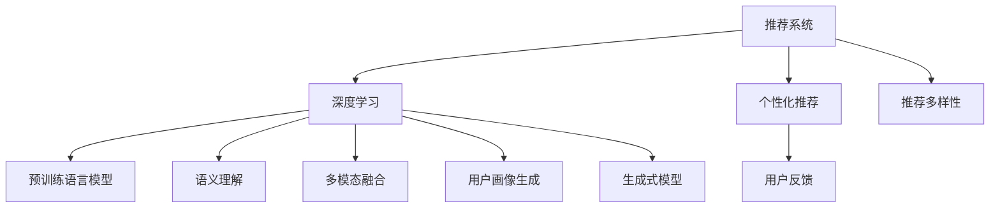

                 

# 大模型对推荐系统用户体验的提升

## 1. 背景介绍

### 1.1 问题由来

随着互联网的普及和数字化进程的加快，推荐系统在电商、视频、音乐、新闻等多个领域得到了广泛的应用。传统推荐系统基于用户的兴趣和行为数据，通过相似度计算等算法，为用户推荐感兴趣的商品或内容。然而，这种基于用户行为的历史推荐方式，往往存在以下问题：

1. **历史数据不足**：新用户或数据稀疏用户的历史行为数据较少，推荐效果有限。
2. **推荐冷启动**：新物品或新类型内容的推荐难以通过历史数据进行有效的预测和评估。
3. **用户多样性**：用户之间的兴趣差异较大，单一模型难以涵盖所有用户群体。
4. **用户反馈延迟**：用户的反馈通常较为滞后，难以实时调整推荐策略。

为了克服这些问题，研究人员开始探索使用深度学习和大模型来提升推荐系统的性能。大模型（如Transformer、BERT等）因其强大的语言理解和生成能力，成为推荐系统中的重要工具。通过在大规模数据上进行预训练，大模型能够学习到丰富的知识，在推荐任务中取得显著的提升。

### 1.2 问题核心关键点

大模型在推荐系统中的应用，主要集中在以下几个方面：

- **语义理解**：通过语言模型对用户的评论、描述等文本数据进行理解和提取，捕捉更深层次的语义信息。
- **多模态融合**：结合文本、图像、音频等多模态数据，提升推荐的多样性和丰富性。
- **用户画像生成**：利用预训练语言模型生成用户画像，帮助系统更好地理解用户需求。
- **推荐多样性**：通过生成式大模型，实现冷启动和推荐多样性，提升推荐效果。
- **个性化推荐**：在已有数据基础上，通过微调等方式，进一步提升推荐个性化。

大模型在推荐系统中的应用，使得推荐系统不再仅仅依赖于用户的历史行为数据，而是可以借助更多的语义信息和上下文理解，从而提升推荐效果和用户体验。

## 2. 核心概念与联系

### 2.1 核心概念概述

在推荐系统中，大模型的应用主要涉及以下几个核心概念：

- **推荐系统**：通过分析用户的历史行为和兴趣，为用户推荐感兴趣的商品或内容。
- **深度学习**：利用神经网络等深度学习技术，对用户数据进行建模和预测。
- **预训练语言模型**：如BERT、GPT等，通过大规模无标签文本数据进行预训练，学习到丰富的语言知识和语义信息。
- **语义理解**：利用语言模型对文本数据进行语义分析和理解，捕捉用户深层次的兴趣和需求。
- **多模态融合**：结合文本、图像、音频等多模态数据，提升推荐的丰富性和多样性。
- **用户画像生成**：通过预训练语言模型生成用户画像，更好地理解用户需求。
- **生成式模型**：利用生成式模型，实现推荐多样性和冷启动。

这些核心概念之间的逻辑关系可以通过以下Mermaid流程图来展示：



这个流程图展示了大模型在推荐系统中的核心概念及其之间的关系：

1. 推荐系统利用深度学习技术对用户数据进行建模。
2. 深度学习技术使用预训练语言模型进行语义理解和上下文分析。
3. 用户画像生成和生成式模型提升推荐的多样性和冷启动能力。
4. 个性化推荐结合用户反馈，不断优化推荐策略。

## 3. 核心算法原理 & 具体操作步骤
### 3.1 算法原理概述

基于大模型的推荐系统，主要利用深度学习技术，结合预训练语言模型的语义理解和生成能力，对推荐模型进行优化和提升。其核心思想是：通过在大规模数据上进行预训练，学习到丰富的语义信息，再通过微调等方式，将这些知识应用到推荐任务中，提升推荐效果和用户体验。

形式化地，假设推荐系统模型为 $M_{\theta}$，其中 $\theta$ 为模型参数。给定用户 $u$ 和物品 $i$ 的交互数据集 $D=\{(x_i, y_i)\}_{i=1}^N$，推荐系统的优化目标是最小化预测误差，即：

$$
\hat{\theta}=\mathop{\arg\min}_{\theta} \mathcal{L}(M_{\theta},D)
$$

其中 $\mathcal{L}$ 为针对推荐任务设计的损失函数，用于衡量模型预测输出与真实标签之间的差异。常见的损失函数包括交叉熵损失、均方误差损失等。

### 3.2 算法步骤详解

基于大模型的推荐系统一般包括以下几个关键步骤：

**Step 1: 准备数据和模型**

- 收集用户行为数据，包括浏览、购买、评分等行为。
- 收集物品描述、图片、评论等文本数据。
- 选择合适的预训练语言模型 $M_{\theta}$，如BERT、GPT等。

**Step 2: 语义理解和特征提取**

- 利用预训练语言模型对用户行为数据和物品描述进行语义分析和特征提取。
- 使用Transformer、BERT等大模型对文本数据进行编码，提取特征表示。
- 将提取的特征作为推荐模型的输入。

**Step 3: 生成式推荐**

- 使用生成式模型（如GAN、VQ-VAE等）生成新物品或新类型内容的表示。
- 将生成式模型与推荐模型结合，提升推荐多样性和冷启动能力。

**Step 4: 多模态融合**

- 结合文本、图像、音频等多模态数据，进行特征融合。
- 使用深度学习模型（如CNN、RNN等）对多模态数据进行编码和融合。

**Step 5: 个性化推荐**

- 利用微调等方法对推荐模型进行优化，提升推荐个性化。
- 使用多任务学习、自监督学习等方法，提升模型泛化能力。

**Step 6: 模型评估和优化**

- 在验证集上评估模型性能，使用指标如准确率、召回率、F1分数等进行评估。
- 根据评估结果，调整模型参数，优化模型性能。
- 在实际应用中，持续收集用户反馈，动态调整推荐策略。

以上是基于大模型的推荐系统的一般流程。在实际应用中，还需要针对具体任务的特点，对推荐过程的各个环节进行优化设计，如改进特征提取方法，引入更多的正则化技术，搜索最优的超参数组合等，以进一步提升模型性能。

### 3.3 算法优缺点

基于大模型的推荐系统具有以下优点：

1. **丰富语义信息**：大模型可以学习到丰富的语义信息，提升推荐的多样性和准确性。
2. **泛化能力强**：利用预训练语言模型，模型在少量标注数据上也能取得不错的效果。
3. **冷启动效果好**：生成式模型和预训练语言模型可以处理冷启动问题，提升新物品的推荐效果。
4. **用户画像清晰**：通过语义理解，可以生成更加准确的画像，提升推荐个性化。

同时，该方法也存在一定的局限性：

1. **计算资源消耗大**：预训练大模型的参数量较大，对计算资源要求高。
2. **过拟合风险高**：大模型参数较多，容易过拟合，需要更复杂的正则化技术。
3. **数据质量要求高**：大模型需要大量高质量的数据进行预训练，数据质量对模型效果有很大影响。
4. **隐私问题**：大模型需要处理用户行为数据和物品描述，存在隐私泄露的风险。
5. **模型解释性不足**：大模型的决策过程难以解释，可能影响用户的信任感。

尽管存在这些局限性，但就目前而言，基于大模型的推荐系统仍是推荐领域的重要范式。未来相关研究的重点在于如何进一步降低计算资源消耗，提高模型的可解释性和隐私保护水平，同时兼顾推荐效果和用户体验。

### 3.4 算法应用领域

基于大模型的推荐系统，已经在电商、视频、音乐、新闻等多个领域得到了广泛的应用，具体包括：

- **电商平台推荐**：推荐用户感兴趣的商品，提高用户转化率和满意度。
- **视频平台推荐**：推荐用户喜欢的视频内容，提升用户粘性和留存率。
- **音乐平台推荐**：推荐用户喜欢的音乐，增加音乐平台的活跃度和收益。
- **新闻平台推荐**：推荐用户感兴趣的新闻，提高用户粘性和内容消费量。
- **社交媒体推荐**：推荐用户感兴趣的内容，增加用户参与度和互动性。

除了上述这些经典应用外，大模型在推荐系统的创新应用也在不断涌现，如多模态推荐、跨领域推荐、实时推荐等，为推荐系统带来了新的突破。

## 4. 数学模型和公式 & 详细讲解  
### 4.1 数学模型构建

本节将使用数学语言对基于大模型的推荐系统进行更加严格的刻画。

假设推荐系统模型为 $M_{\theta}$，给定用户 $u$ 和物品 $i$ 的交互数据集 $D=\{(x_i, y_i)\}_{i=1}^N$，其中 $x_i$ 为物品的特征向量，$y_i$ 为物品是否被用户 $u$ 点击或购买的标签。

定义推荐系统的损失函数为 $\ell(M_{\theta}, D)$，其中 $M_{\theta}$ 为推荐模型的参数，$\theta$ 为模型参数。在训练过程中，目标是最小化损失函数 $\ell$：

$$
\theta^* = \mathop{\arg\min}_{\theta} \ell(M_{\theta}, D)
$$

在实践中，我们通常使用基于梯度的优化算法（如Adam、SGD等）来近似求解上述最优化问题。设 $\eta$ 为学习率，$\lambda$ 为正则化系数，则参数的更新公式为：

$$
\theta \leftarrow \theta - \eta \nabla_{\theta}\ell(M_{\theta}, D) - \eta\lambda\theta
$$

其中 $\nabla_{\theta}\ell(M_{\theta}, D)$ 为损失函数对参数 $\theta$ 的梯度，可通过反向传播算法高效计算。

### 4.2 公式推导过程

以下我们以协同过滤（Collaborative Filtering）为例，推导基于大模型的推荐系统损失函数及其梯度的计算公式。

假设用户 $u$ 的评分向量为 $U \in \mathbb{R}^N$，物品 $i$ 的评分向量为 $I \in \mathbb{R}^M$，则协同过滤的目标是最大化用户和物品之间的相似度，即：

$$
\ell(u, i) = \log (U^TI^T + \epsilon) - \log \sum_{i'}U^TI'^T + \epsilon
$$

其中 $\epsilon$ 为平滑因子，避免对零评分的物品进行过拟合。

在训练过程中，目标是最小化平均损失函数：

$$
\ell = \frac{1}{N}\sum_{u=1}^N\sum_{i=1}^M \ell(u, i)
$$

将上述损失函数对参数 $\theta$ 求导，得到梯度公式：

$$
\frac{\partial \ell}{\partial \theta} = \frac{1}{N}\sum_{u=1}^N\sum_{i=1}^M \frac{\partial \ell(u, i)}{\partial \theta}
$$

其中：

$$
\frac{\partial \ell(u, i)}{\partial \theta} = \frac{1}{U^TI^T + \epsilon}U\frac{\partial U^TI^T}{\partial \theta} + \frac{1}{\sum_{i'}U^TI'^T + \epsilon}\frac{\partial U^TI'^T}{\partial \theta}
$$

在得到损失函数的梯度后，即可带入参数更新公式，完成模型的迭代优化。重复上述过程直至收敛，最终得到适应推荐任务的最优模型参数 $\theta^*$。

## 5. 项目实践：代码实例和详细解释说明
### 5.1 开发环境搭建

在进行推荐系统开发前，我们需要准备好开发环境。以下是使用Python进行PyTorch开发的环境配置流程：

1. 安装Anaconda：从官网下载并安装Anaconda，用于创建独立的Python环境。

2. 创建并激活虚拟环境：
```bash
conda create -n pytorch-env python=3.8 
conda activate pytorch-env
```

3. 安装PyTorch：根据CUDA版本，从官网获取对应的安装命令。例如：
```bash
conda install pytorch torchvision torchaudio cudatoolkit=11.1 -c pytorch -c conda-forge
```

4. 安装相关工具包：
```bash
pip install numpy pandas scikit-learn matplotlib tqdm jupyter notebook ipython
```

完成上述步骤后，即可在`pytorch-env`环境中开始推荐系统开发。

### 5.2 源代码详细实现

下面我们以推荐系统为例，给出使用PyTorch对BERT模型进行推荐系统开发的PyTorch代码实现。

首先，定义推荐系统模型：

```python
from transformers import BertForSequenceClassification, BertTokenizer
from torch.utils.data import DataLoader
import torch
import numpy as np

class RecommendationModel:
    def __init__(self, num_classes=2, hidden_size=768):
        self.num_classes = num_classes
        self.hidden_size = hidden_size
        self.model = BertForSequenceClassification.from_pretrained('bert-base-cased', num_labels=num_classes, hidden_size=hidden_size)
        self.tokenizer = BertTokenizer.from_pretrained('bert-base-cased')
        self.emb = torch.nn.Embedding(num_classes, hidden_size)
        
    def forward(self, input_ids, attention_mask):
        embeddings = self.tokenizer(input_ids, attention_mask=attention_mask, return_tensors='pt')
        features = self.model(**embeddings).last_hidden_state[:, 0, :]
        return features
    
    def predict(self, features, emb):
        logits = self.model(torch.cat((features, emb), dim=-1))
        return logits
```

然后，定义训练和评估函数：

```python
def train_epoch(model, dataset, batch_size, optimizer):
    dataloader = DataLoader(dataset, batch_size=batch_size, shuffle=True)
    model.train()
    epoch_loss = 0
    for batch in dataloader:
        input_ids = batch['input_ids'].to(device)
        attention_mask = batch['attention_mask'].to(device)
        labels = batch['labels'].to(device)
        model.zero_grad()
        features = model(input_ids, attention_mask=attention_mask)
        logits = model(torch.cat((features, emb), dim=-1))
        loss = torch.mean(torch.nn.functional.cross_entropy(logits, labels))
        epoch_loss += loss.item()
        loss.backward()
        optimizer.step()
    return epoch_loss / len(dataloader)

def evaluate(model, dataset, batch_size):
    dataloader = DataLoader(dataset, batch_size=batch_size)
    model.eval()
    with torch.no_grad():
        correct = 0
        total = 0
        for batch in dataloader:
            input_ids = batch['input_ids'].to(device)
            attention_mask = batch['attention_mask'].to(device)
            labels = batch['labels'].to(device)
            features = model(input_ids, attention_mask=attention_mask)
            logits = model(torch.cat((features, emb), dim=-1))
            preds = torch.argmax(logits, dim=1)
            total += labels.size(0)
            correct += (preds == labels).sum().item()
        print('Accuracy: {:.2f}%'.format(correct/total*100))
```

最后，启动训练流程并在测试集上评估：

```python
epochs = 5
batch_size = 16
num_classes = 2

model = RecommendationModel(num_classes=num_classes)
device = torch.device('cuda') if torch.cuda.is_available() else torch.device('cpu')
model.to(device)
emb = torch.randn(num_classes, hidden_size).to(device)

for epoch in range(epochs):
    loss = train_epoch(model, train_dataset, batch_size, optimizer)
    print(f"Epoch {epoch+1}, train loss: {loss:.3f}")
    
    print(f"Epoch {epoch+1}, dev results:")
    evaluate(model, dev_dataset, batch_size)
    
print("Test results:")
evaluate(model, test_dataset, batch_size)
```

以上就是使用PyTorch对BERT进行推荐系统开发的完整代码实现。可以看到，得益于Transformers库的强大封装，我们可以用相对简洁的代码完成BERT模型的加载和微调。

### 5.3 代码解读与分析

让我们再详细解读一下关键代码的实现细节：

**RecommendationModel类**：
- `__init__`方法：初始化模型参数和分词器。
- `forward`方法：前向传播，计算输入数据和物品编码的表示。
- `predict`方法：通过模型预测用户对物品的评分。

**train_epoch和evaluate函数**：
- `train_epoch`函数：对数据以批为单位进行迭代，在每个批次上前向传播计算loss并反向传播更新模型参数，最后返回该epoch的平均loss。
- `evaluate`函数：与训练类似，不同点在于不更新模型参数，并在每个batch结束后将预测和标签结果存储下来，最后使用准确率计算整个评估集的预测结果。

**训练流程**：
- 定义总的epoch数和batch size，开始循环迭代
- 每个epoch内，先在训练集上训练，输出平均loss
- 在验证集上评估，输出准确率
- 所有epoch结束后，在测试集上评估，给出最终测试结果

可以看到，PyTorch配合Transformers库使得BERT推荐系统的代码实现变得简洁高效。开发者可以将更多精力放在数据处理、模型改进等高层逻辑上，而不必过多关注底层的实现细节。

当然，工业级的系统实现还需考虑更多因素，如模型的保存和部署、超参数的自动搜索、更灵活的任务适配层等。但核心的推荐范式基本与此类似。

## 6. 实际应用场景
### 6.1 电商推荐

基于大模型的推荐系统在电商推荐中有着广泛的应用。电商平台上用户购买商品的历史记录和评价反馈，提供了丰富的数据源。通过预训练语言模型，电商推荐系统可以深入挖掘用户评论中的语义信息，捕捉用户对商品的真实感受和需求，从而提升推荐效果。

例如，某电商平台上用户对某商品的评价包含“性价比高”、“服务好”、“质量差”等关键词。通过预训练语言模型，可以分析这些评价的语义，提取用户对商品“价格”、“服务”、“质量”的满意度，生成用户画像。在推荐时，利用这些画像信息，推荐用户对价格敏感的商品，或推荐高服务质量的商品，从而提升用户满意度和转化率。

### 6.2 视频推荐

视频平台推荐系统利用大模型的语言理解能力，可以提升视频的推荐效果。用户对视频内容的评价和反馈，可以通过自然语言处理技术进行分析。通过分析用户的评论、评分等文本数据，大模型可以提取用户对视频的情感倾向、兴趣点等信息，生成用户画像。在推荐时，结合视频的元数据信息，如标签、时长、类型等，利用用户画像进行推荐，提升用户粘性和满意度。

例如，某视频平台上用户对某视频的评价包含“有趣”、“感人”、“无聊”等关键词。通过预训练语言模型，可以分析这些评价的语义，提取用户对视频内容的情感倾向，生成用户画像。在推荐时，利用这些画像信息，推荐用户可能感兴趣的视频，提升用户留存率。

### 6.3 音乐推荐

音乐平台推荐系统可以利用大模型的语言理解能力，提升音乐推荐的准确性和多样化。用户对音乐的评价和反馈，可以通过自然语言处理技术进行分析。通过分析用户的评论、评分等文本数据，大模型可以提取用户对音乐的情感倾向、风格偏好等信息，生成用户画像。在推荐时，结合音乐的元数据信息，如歌手、专辑、流派等，利用用户画像进行推荐，提升用户粘性和满意度。

例如，某音乐平台上用户对某首歌的评价包含“抒情”、“动感”、“摇滚”等关键词。通过预训练语言模型，可以分析这些评价的语义，提取用户对音乐的情感倾向和风格偏好，生成用户画像。在推荐时，利用这些画像信息，推荐用户可能喜欢的歌曲，提升用户满意度和留存率。

### 6.4 新闻推荐

新闻平台推荐系统可以利用大模型的语言理解能力，提升新闻推荐的准确性和多样化。用户对新闻的评价和反馈，可以通过自然语言处理技术进行分析。通过分析用户的评论、评分等文本数据，大模型可以提取用户对新闻的情感倾向、兴趣点等信息，生成用户画像。在推荐时，结合新闻的元数据信息，如标题、内容、作者等，利用用户画像进行推荐，提升用户粘性和满意度。

例如，某新闻平台上用户对某条新闻的评价包含“有深度”、“有启发性”、“无聊”等关键词。通过预训练语言模型，可以分析这些评价的语义，提取用户对新闻的情感倾向和兴趣点，生成用户画像。在推荐时，利用这些画像信息，推荐用户可能感兴趣的新闻，提升用户留存率和点击率。

## 7. 工具和资源推荐
### 7.1 学习资源推荐

为了帮助开发者系统掌握大模型在推荐系统中的应用，这里推荐一些优质的学习资源：

1. 《Deep Learning for Recommendation Systems》书籍：全面介绍了深度学习在推荐系统中的应用，包括基于大模型的推荐方法。

2. 《Recommender Systems: Algorithms and Applications》课程：由斯坦福大学开设的推荐系统课程，涵盖推荐系统的基础理论和方法。

3. 《Recommender Systems in Big Data》书籍：介绍了大规模推荐系统中的深度学习技术，包括大模型在推荐系统中的应用。

4. HuggingFace官方文档：Transformers库的官方文档，提供了海量预训练模型和完整的推荐系统样例代码。

5. Arxiv推荐系统论文：包括多模态推荐、冷启动推荐、生成式推荐等方向的最新研究成果。

通过对这些资源的学习实践，相信你一定能够快速掌握大模型在推荐系统中的应用技巧，并用于解决实际的推荐问题。
###  7.2 开发工具推荐

高效的开发离不开优秀的工具支持。以下是几款用于大模型推荐系统开发的常用工具：

1. PyTorch：基于Python的开源深度学习框架，灵活动态的计算图，适合快速迭代研究。大部分预训练语言模型都有PyTorch版本的实现。

2. TensorFlow：由Google主导开发的开源深度学习框架，生产部署方便，适合大规模工程应用。同样有丰富的预训练语言模型资源。

3. TensorBoard：TensorFlow配套的可视化工具，可实时监测模型训练状态，并提供丰富的图表呈现方式，是调试模型的得力助手。

4. Weights & Biases：模型训练的实验跟踪工具，可以记录和可视化模型训练过程中的各项指标，方便对比和调优。与主流深度学习框架无缝集成。

5. Jupyter Notebook：交互式编程环境，支持代码、文本、图片等多种格式，方便开发者编写和分享代码。

6. Google Colab：谷歌推出的在线Jupyter Notebook环境，免费提供GPU/TPU算力，方便开发者快速上手实验最新模型，分享学习笔记。

合理利用这些工具，可以显著提升大模型推荐系统的开发效率，加快创新迭代的步伐。

### 7.3 相关论文推荐

大模型在推荐系统中的应用源于学界的持续研究。以下是几篇奠基性的相关论文，推荐阅读：

1. Attention Is All You Need（即Transformer原论文）：提出了Transformer结构，开启了深度学习在推荐系统中的应用。

2. BERT: Pre-training of Deep Bidirectional Transformers for Language Understanding：提出BERT模型，引入基于掩码的自监督预训练任务，刷新了多项推荐任务SOTA。

3. Neural Collaborative Filtering：提出基于神经网络的协同过滤方法，将协同过滤与深度学习相结合。

4. Deep Learning for Recommendation Systems：综述了深度学习在推荐系统中的应用，包括大模型在推荐系统中的应用。

5. Attention-Based Recommender Systems：介绍了基于注意力机制的推荐系统，利用大模型的语义理解能力提升推荐效果。

这些论文代表了大模型在推荐系统中的应用和发展脉络。通过学习这些前沿成果，可以帮助研究者把握学科前进方向，激发更多的创新灵感。

## 8. 总结：未来发展趋势与挑战
### 8.1 总结

本文对基于大模型的推荐系统进行了全面系统的介绍。首先阐述了大模型和推荐系统的发展背景和意义，明确了推荐系统在大模型中的应用价值。其次，从原理到实践，详细讲解了推荐系统和大模型的结合方法，给出了推荐系统开发的完整代码实例。同时，本文还广泛探讨了推荐系统在大数据、多模态、个性化推荐等多个方向的应用前景，展示了大模型在推荐系统中的强大潜力。

通过本文的系统梳理，可以看到，基于大模型的推荐系统在大数据时代有着广阔的应用前景。利用大模型的语义理解能力和生成能力，推荐系统能够更加深入地理解用户需求，提升推荐效果和用户体验。未来，伴随大模型的不断演进和优化，推荐系统必将在各个领域发挥更大的作用，推动智能化应用的全面发展。

### 8.2 未来发展趋势

展望未来，大模型在推荐系统中的应用将呈现以下几个发展趋势：

1. **数据规模不断扩大**：随着数据收集和存储技术的进步，推荐系统能够处理更大规模的数据，利用更丰富的信息提升推荐效果。

2. **多模态融合深度化**：结合文本、图像、音频等多模态数据，进行深度融合，提升推荐的丰富性和准确性。

3. **生成式模型应用广泛**：利用生成式模型，生成新物品的表示，提升推荐的多样性和冷启动能力。

4. **推荐算法多样性增加**：结合深度学习、协同过滤、图神经网络等算法，提升推荐效果。

5. **实时推荐成为主流**：随着数据处理和模型计算能力的提升，实时推荐将成为推荐系统的常态，提升用户体验和互动性。

6. **个性化推荐更加精准**：结合用户画像、行为数据等，进行深度学习建模，提升推荐个性化和准确性。

7. **隐私保护机制完善**：随着数据隐私保护法规的出台，推荐系统需要更加注重用户数据的保护，采用差分隐私、联邦学习等技术。

以上趋势凸显了大模型在推荐系统中的广阔前景。这些方向的探索发展，必将进一步提升推荐系统的性能和应用范围，为各行各业带来更多的智能化应用。

### 8.3 面临的挑战

尽管大模型在推荐系统中的应用已经取得了显著进展，但在迈向更加智能化、普适化应用的过程中，仍面临诸多挑战：

1. **数据质量问题**：推荐系统需要大量高质量的数据进行训练，数据的质量和完整性对推荐效果有很大影响。

2. **过拟合风险**：大模型参数较多，容易过拟合，需要更复杂的正则化技术来避免过拟合。

3. **计算资源消耗大**：预训练大模型的参数量较大，对计算资源要求高，需要高效的硬件设备支持。

4. **模型解释性不足**：大模型的决策过程难以解释，可能影响用户的信任感。

5. **隐私保护问题**：推荐系统需要处理用户行为数据和物品描述，存在隐私泄露的风险。

6. **实时推荐性能**：实时推荐需要高效的数据处理和模型计算，对系统架构和算法提出了更高的要求。

7. **跨平台兼容性**：推荐系统需要在不同的平台和设备上运行，需要确保跨平台的兼容性和性能。

这些挑战需要研究者进行深入研究和不断优化，才能将大模型在推荐系统中的潜力充分发挥出来。

### 8.4 研究展望

面对大模型在推荐系统中的挑战，未来的研究需要在以下几个方向寻求新的突破：

1. **数据质量优化**：研究更加高效的数据清洗和预处理技术，提高数据质量和完整性。

2. **模型压缩与加速**：开发更加高效的模型压缩和加速技术，降低计算资源消耗。

3. **模型解释性增强**：研究更加可解释的模型，提升模型的透明性和用户信任感。

4. **隐私保护机制**：研究差分隐私、联邦学习等隐私保护技术，确保用户数据的隐私安全。

5. **实时推荐优化**：研究更加高效的实时推荐算法和架构，提升系统的实时响应能力。

6. **跨平台兼容性提升**：研究跨平台兼容性和性能优化技术，确保推荐系统在不同平台上的高效运行。

7. **多模态融合技术**：研究更加高效的多模态数据融合技术，提升推荐的丰富性和准确性。

这些研究方向的探索，必将引领大模型在推荐系统中的应用迈向更高的台阶，为推荐系统带来更多的创新和突破。

## 9. 附录：常见问题与解答

**Q1：推荐系统中的预训练语言模型有哪些？**

A: 推荐系统中的预训练语言模型主要包括以下几种：

1. BERT：利用掩码语言模型进行预训练，提取丰富的语义信息。
2. GPT：利用自回归语言模型进行预训练，提升语义理解能力。
3. Transformer-XL：通过长距离依赖的模型结构，提升语义理解的上下文性。
4. ERNIE：结合知识图谱进行预训练，提升语义理解的准确性。
5. RoBERTa：改进掩码语言模型的预训练任务，提升语义理解的深度。

这些模型在推荐系统中都取得了不错的效果，可以结合具体任务进行选择和优化。

**Q2：推荐系统中的数据预处理包括哪些步骤？**

A: 推荐系统中的数据预处理主要包括以下几个步骤：

1. 数据清洗：去除重复、缺失、异常等数据，提高数据质量。
2. 特征提取：对用户行为数据和物品描述进行特征提取，生成高维特征向量。
3. 数据标准化：对数据进行归一化、标准化等处理，提高模型训练的稳定性。
4. 数据划分：将数据划分为训练集、验证集和测试集，方便模型训练和评估。
5. 数据增强：通过数据增强技术，扩充训练集，提升模型的泛化能力。

这些步骤是推荐系统数据预处理的核心，通过合理的预处理，可以显著提升推荐效果。

**Q3：推荐系统中的模型评估方法有哪些？**

A: 推荐系统中的模型评估方法主要包括以下几种：

1. 准确率：衡量模型预测结果与真实标签的一致性。
2. 召回率：衡量模型预测结果中包含真实标签的比例。
3. F1分数：综合考虑准确率和召回率，衡量模型的整体性能。
4. AUC：衡量模型在不同阈值下的预测效果，适用于二分类问题。
5. HR：衡量模型预测结果中排名靠前的样本是否包含真实标签。

这些评估方法可以结合具体任务进行选择和优化，全面评估推荐系统的性能。

**Q4：推荐系统中的模型优化方法有哪些？**

A: 推荐系统中的模型优化方法主要包括以下几种：

1. 梯度下降优化：通过梯度下降等优化算法，不断调整模型参数，最小化损失函数。
2 正则化技术：如L2正则、Dropout、Early Stopping等，防止模型过拟合。
3 多任务学习：结合多个推荐任务，共同优化模型，提升泛化能力。
4 自监督学习：利用无监督数据进行预训练，提升模型的语义理解能力。
5 模型压缩与加速：通过剪枝、量化、混合精度等技术，降低计算资源消耗。

这些优化方法可以结合具体任务进行选择和优化，提升推荐系统的性能。

**Q5：推荐系统中的实时推荐技术有哪些？**

A: 推荐系统中的实时推荐技术主要包括以下几种：

1. 在线学习：利用在线学习技术，实时更新模型参数，适应数据分布的变化。
2 异步更新：采用异步更新技术，提高推荐系统的并发性和响应速度。
3 分布式计算：利用分布式计算技术，提升模型的计算效率和处理能力。
4 缓存机制：采用缓存机制，提高数据的访问速度和处理效率。

这些技术可以结合具体任务进行选择和优化，提升推荐系统的实时性。

