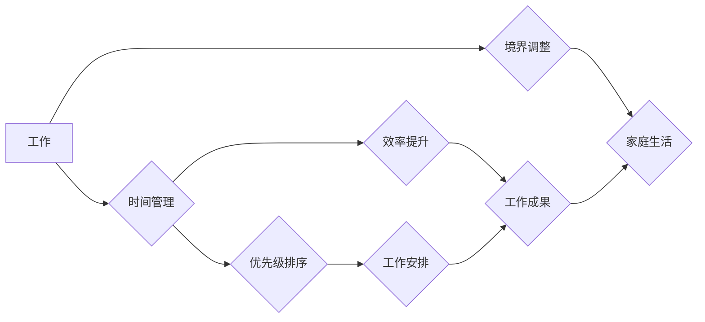

                 

## 如何平衡工作与家庭生活

> 关键词：工作-生活平衡, 时间管理, 效率提升, 优先级排序, 境界调整, 家庭, 工作, 压力管理

## 1. 背景介绍

在当今快速发展的社会，科技日新月异，工作节奏日益加快。对于IT从业者来说，工作量大、压力大、加班频繁是常态。如何平衡工作与家庭生活，成为许多IT从业者面临的共同难题。

长时间处于工作状态，容易导致身心疲惫，影响家庭生活质量，甚至引发家庭矛盾。反之，如果过度关注家庭，而忽略工作，则可能导致职业发展受阻，经济压力增加。

因此，如何找到工作与家庭生活的平衡点，是IT从业者需要认真思考和解决的问题。

## 2. 核心概念与联系

**2.1 工作-生活平衡 (Work-Life Balance)**

工作-生活平衡是指个人在工作和生活之间合理分配时间和精力，使两者和谐共处，达到身心健康、工作高效、生活充实的状态。

**2.2 时间管理 (Time Management)**

时间管理是有效利用时间，提高工作效率，并留出充足的时间进行个人生活活动的关键。

**2.3 效率提升 (Efficiency Improvement)**

效率提升是指通过优化工作流程、提高技能水平、利用工具辅助等方式，在相同时间内完成更多工作，从而释放更多时间用于其他方面。

**2.4 优先级排序 (Priority Setting)**

优先级排序是指根据任务重要性和紧急程度，合理安排工作顺序，确保重要任务优先完成。

**2.5 境界调整 (Mindset Shift)**

境界调整是指改变对工作和生活的认知，从“工作至上”转变为“工作与生活和谐”，以更积极、更健康的心态面对工作和生活。

**2.6 流程图**



## 3. 核心算法原理 & 具体操作步骤

**3.1 算法原理概述**

平衡工作与家庭生活并非一个简单的算法，而是一个需要不断调整和优化的人文管理问题。

然而，我们可以借鉴一些时间管理和效率提升的算法原理，帮助我们更好地平衡工作和生活。

**3.2 算法步骤详解**

1. **明确目标:** 首先要明确自己对工作和家庭生活的期望，并设定合理的目标。

2. **时间规划:** 利用日历、待办事项清单等工具，规划每天的工作时间和家庭时间，并尽量避免时间冲突。

3. **效率提升:** 寻找提高工作效率的方法，例如番茄工作法、时间阻塞法等，减少工作时间，释放更多时间用于家庭生活。

4. **优先级排序:** 根据任务重要性和紧急程度，合理安排工作顺序，确保重要任务优先完成。

5. **边界设定:** 在工作时间和家庭时间之间设定明确的边界，避免工作过度影响家庭生活，反之亦然。

6. **定期回顾:** 定期回顾自己的工作和生活安排，根据实际情况进行调整，不断优化平衡方案。

**3.3 算法优缺点**

* **优点:** 可以帮助我们更好地规划时间，提高工作效率，并留出更多时间用于家庭生活。
* **缺点:** 需要不断调整和优化，并需要一定的自律性和执行力。

**3.4 算法应用领域**

* **个人时间管理:** 帮助个人更好地安排工作和生活时间。
* **团队协作:** 帮助团队成员更好地协调工作时间，提高团队效率。
* **企业管理:** 帮助企业制定合理的员工工作时间制度，提高员工工作效率和生活质量。

## 4. 数学模型和公式 & 详细讲解 & 举例说明

**4.1 数学模型构建**

我们可以用一个简单的数学模型来表示工作和生活的时间分配：

$$
T_{total} = T_{work} + T_{life}
$$

其中：

* $T_{total}$ 代表总时间，即24小时。
* $T_{work}$ 代表工作时间。
* $T_{life}$ 代表生活时间。

**4.2 公式推导过程**

根据以上模型，我们可以推导出以下公式：

$$
T_{life} = T_{total} - T_{work}
$$

这个公式告诉我们，生活时间等于总时间减去工作时间。

**4.3 案例分析与讲解**

假设一个人每天工作8小时，那么他的生活时间为：

$$
T_{life} = 24 - 8 = 16 \text{小时}
$$

## 5. 项目实践：代码实例和详细解释说明

**5.1 开发环境搭建**

为了更好地管理工作和生活时间，我们可以使用一些工具和软件，例如：

* **日历应用:** Google Calendar, Outlook Calendar 等
* **待办事项清单应用:** Todoist, Asana 等
* **时间管理应用:** Toggl Track, RescueTime 等

**5.2 源代码详细实现**

以下是一个简单的Python代码示例，用于计算工作和生活的时间分配：

```python
total_hours = 24
work_hours = 8

life_hours = total_hours - work_hours

print(f"工作时间: {work_hours} 小时")
print(f"生活时间: {life_hours} 小时")
```

**5.3 代码解读与分析**

这段代码首先定义了总时间和工作时间，然后计算了生活时间，并打印出来。

**5.4 运行结果展示**

```
工作时间: 8 小时
生活时间: 16 小时
```

## 6. 实际应用场景

**6.1 工作场景**

* 利用时间管理工具，合理安排工作时间，提高工作效率。
* 设定工作边界，避免工作过度影响家庭生活。
* 利用效率提升技巧，例如番茄工作法，集中精力完成工作任务。

**6.2 家庭场景**

* 与家人沟通，合理分配家庭时间，确保家庭成员都能得到足够的陪伴。
* 利用周末或假期时间，进行家庭活动，增进家人感情。
* 培养良好的生活习惯，例如规律作息，健康饮食，保证充足睡眠。

**6.3 未来应用展望**

随着科技的发展，未来将出现更多能够帮助人们平衡工作与家庭生活的工具和技术，例如：

* 人工智能辅助时间管理
* 智能家居设备，解放双手，节省时间
* 远程办公技术，提高工作效率，并节省通勤时间

## 7. 工具和资源推荐

**7.1 学习资源推荐**

* 书籍：《高效能人士的七个习惯》、《时间管理艺术》
* 网站：Zen Habits, Lifehacker
* 课程：Coursera, Udemy

**7.2 开发工具推荐**

* 日历应用：Google Calendar, Outlook Calendar
* 待办事项清单应用：Todoist, Asana
* 时间管理应用：Toggl Track, RescueTime

**7.3 相关论文推荐**

* Work-Life Balance: A Review of the Literature
* The Impact of Technology on Work-Life Balance

## 8. 总结：未来发展趋势与挑战

**8.1 研究成果总结**

通过以上分析，我们可以看到，平衡工作与家庭生活是一个复杂而重要的议题。

需要不断探索和实践，找到适合自己的平衡方案。

**8.2 未来发展趋势**

未来，随着科技的发展，将出现更多能够帮助人们平衡工作与家庭生活的工具和技术。

同时，人们对工作与生活平衡的重视程度也将不断提高，这将推动企业和社会更加重视员工的工作与生活平衡。

**8.3 面临的挑战**

* **工作压力:** 随着工作节奏的加快，工作压力越来越大，难以平衡工作与生活。
* **科技发展:** 科技发展带来的便利也带来了新的挑战，例如信息过载、网络成瘾等，容易影响工作与生活平衡。
* **社会观念:** 一些传统的社会观念，例如“工作至上”，仍然存在，阻碍了人们对工作与生活平衡的追求。

**8.4 研究展望**

未来研究可以关注以下几个方面：

* 开发更智能、更人性化的工作与生活平衡工具。
* 探索不同行业、不同人群的工作与生活平衡模式。
* 研究如何通过政策和制度，促进工作与生活平衡。


## 9. 附录：常见问题与解答

**9.1 如何克服工作压力？**

* 设定合理的期望，避免过度工作。
* 学习放松技巧，例如冥想、瑜伽等。
* 保证充足的睡眠和休息时间。
* 与家人朋友沟通，寻求支持。

**9.2 如何提高工作效率？**

* 利用时间管理工具，合理安排工作时间。
* 设定优先级，集中精力完成重要任务。
* 学习效率提升技巧，例如番茄工作法。
* 避免分心，创造良好的工作环境。

**9.3 如何平衡工作与家庭生活？**

* 明确工作和家庭的时间分配。
* 与家人沟通，合理安排家庭时间。
* 设定工作边界，避免工作过度影响家庭生活。
* 培养良好的生活习惯，保证充足的休息时间。


作者：禅与计算机程序设计艺术 / Zen and the Art of Computer Programming 
<end_of_turn>

