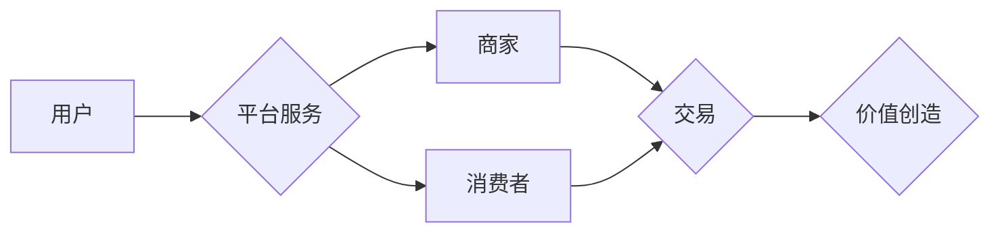

                 

## 平台战略：打造和管理多边平台业务

> 关键词：多边平台、平台生态、网络效应、平台治理、价值创造、商业模式创新

### 1. 背景介绍

在当今数字经济时代，平台经济蓬勃发展，多边平台作为一种新型的商业模式，逐渐成为经济发展的重要引擎。多边平台是指连接三方或以上参与者，通过提供平台服务，促进交易和价值创造的商业模式。例如，电商平台连接商家和消费者，社交平台连接用户和内容创作者，共享经济平台连接提供者和需求者。

多边平台的成功离不开其独特的价值主张和商业模式。通过构建网络效应，平台能够吸引更多参与者，从而形成良性循环，不断提升平台价值。同时，平台通过提供平台服务，降低参与者交易成本，提高交易效率，创造新的价值。

然而，打造和管理多边平台业务也面临着诸多挑战。平台需要解决参与者之间的信任问题，维护平台生态的稳定性，以及如何实现可持续发展等问题。

### 2. 核心概念与联系

**2.1 多边平台的核心概念**

多边平台的核心概念包括：

* **参与者：** 多边平台连接三方或以上参与者，例如商家、消费者、内容创作者、服务提供者等。
* **平台服务：** 平台提供各种服务，例如交易撮合、信息匹配、支付结算、物流配送、信用评估等。
* **网络效应：** 多边平台的价值随着参与者数量的增加而不断提升，形成正反馈循环。
* **平台治理：** 平台需要制定规则和机制，维护平台生态的稳定性和公平性。

**2.2 多边平台架构**

多边平台的架构通常包括以下几个关键模块：

* **用户模块：** 用户注册、登录、个人信息管理等功能。
* **交易模块：** 商品发布、订单处理、支付结算等功能。
* **内容模块：** 内容发布、内容推荐、内容评论等功能。
* **服务模块：** 服务提供、服务预约、服务评价等功能。
* **平台管理模块：** 平台运营、数据分析、规则制定等功能。

**2.3 多边平台价值链**

多边平台的价值链包括：

* **参与者价值：** 平台为参与者提供便利、降低交易成本、提升交易效率等价值。
* **平台价值：** 平台通过收取服务费、广告收入、数据交易等方式获取利润。
* **社会价值：** 平台促进资源配置优化、促进经济发展、提升社会效率等价值。

**Mermaid 流程图**



### 3. 核心算法原理 & 具体操作步骤

**3.1 算法原理概述**

多边平台的成功离不开一系列核心算法，这些算法负责平台的匹配、推荐、排序、安全等关键环节。常见的算法包括：

* **协同过滤算法：** 基于用户行为数据，推荐用户可能感兴趣的内容或商品。
* **内容过滤算法：** 基于商品或内容的特征，推荐用户可能感兴趣的内容或商品。
* **搜索算法：** 帮助用户快速找到所需的内容或商品。
* **安全算法：** 保护用户数据安全，防止欺诈行为。

**3.2 算法步骤详解**

以协同过滤算法为例，其具体步骤如下：

1. **数据收集：** 收集用户行为数据，例如用户浏览历史、购买记录、评分等。
2. **数据预处理：** 对数据进行清洗、转换、特征提取等处理。
3. **模型训练：** 使用协同过滤算法模型，训练出用户-商品的评分预测模型。
4. **推荐生成：** 根据用户历史行为和模型预测，生成个性化商品推荐列表。

**3.3 算法优缺点**

* **优点：** 能够提供个性化推荐，提升用户体验。
* **缺点：** 容易陷入冷启动问题，新用户或新商品难以获得推荐。

**3.4 算法应用领域**

协同过滤算法广泛应用于电商平台、视频平台、音乐平台等多边平台，用于商品推荐、内容推荐、用户匹配等场景。

### 4. 数学模型和公式 & 详细讲解 & 举例说明

**4.1 数学模型构建**

协同过滤算法的核心是构建用户-商品评分矩阵，其中每个元素代表用户对商品的评分。

假设有N个用户和M个商品，用户-商品评分矩阵可以表示为一个N x M的矩阵R，其中R(i,j)表示用户i对商品j的评分。

**4.2 公式推导过程**

协同过滤算法的目标是预测用户对未评分商品的评分。常用的预测公式包括：

* **基于用户的协同过滤：**

$$
\hat{R}(i,j) = \bar{R}_i + \frac{\sum_{k \in N(i)} (R(i,k) - \bar{R}_i) (R(k,j) - \bar{R}_j)}{\sum_{k \in N(i)} (R(i,k) - \bar{R}_i)^2}
$$

其中：

* $\hat{R}(i,j)$ 是预测用户i对商品j的评分。
* $\bar{R}_i$ 是用户i的平均评分。
* $\bar{R}_j$ 是商品j的平均评分。
* $N(i)$ 是与用户i评分相似的用户集合。

* **基于物品的协同过滤：**

$$
\hat{R}(i,j) = \bar{R}_j + \frac{\sum_{k \in N(j)} (R(i,k) - \bar{R}_i) (R(k,j) - \bar{R}_j)}{\sum_{k \in N(j)} (R(k,j) - \bar{R}_j)^2}
$$

其中：

* $N(j)$ 是与商品j评分相似的商品集合。

**4.3 案例分析与讲解**

假设有一个电商平台，用户A对商品1和商品2都评分了5分，用户B对商品2和商品3都评分了4分。根据协同过滤算法，可以预测用户A对商品3的评分。

### 5. 项目实践：代码实例和详细解释说明

**5.1 开发环境搭建**

* Python 3.x
* Pandas
* Scikit-learn

**5.2 源代码详细实现**

```python
import pandas as pd
from sklearn.metrics.pairwise import cosine_similarity

# 加载用户-商品评分数据
ratings_data = pd.read_csv('ratings.csv')

# 计算用户之间的相似度
user_similarity = cosine_similarity(ratings_data)

# 预测用户对商品的评分
def predict_rating(user_id, item_id):
    # 获取用户相似用户
    similar_users = user_similarity[user_id].argsort()[:-10:-1]
    # 计算预测评分
    predicted_rating = 0
    for similar_user in similar_users:
        if ratings_data.loc[similar_user, item_id] is not None:
            predicted_rating += ratings_data.loc[similar_user, item_id]
    return predicted_rating / len(similar_users)

# 预测用户1对商品3的评分
predicted_rating = predict_rating(1, 3)
print(f'预测用户1对商品3的评分: {predicted_rating}')
```

**5.3 代码解读与分析**

* 代码首先加载用户-商品评分数据。
* 然后使用cosine_similarity计算用户之间的相似度。
* predict_rating函数根据用户相似度，预测用户对商品的评分。

**5.4 运行结果展示**

运行代码后，会输出用户1对商品3的预测评分。

### 6. 实际应用场景

多边平台的应用场景非常广泛，例如：

* **电商平台：** 连接商家和消费者，提供商品交易、支付结算、物流配送等服务。
* **社交平台：** 连接用户和内容创作者，提供内容分享、互动交流、社区建设等服务。
* **共享经济平台：** 连接提供者和需求者，提供资源共享、服务交易等服务。
* **金融平台：** 连接金融机构和用户，提供金融服务、投资理财等服务。

**6.4 未来应用展望**

随着人工智能、大数据、云计算等技术的不断发展，多边平台将朝着更加智能化、个性化、平台化方向发展。未来，多边平台将更加深入地融入人们的生活，为人们提供更加便捷、高效、个性化的服务。

### 7. 工具和资源推荐

**7.1 学习资源推荐**

* **书籍：**

* 《平台战略：打造和管理多边平台业务》
* 《网络效应：如何打造成功的平台》

* **在线课程：**

* Coursera: Platform Strategy
* edX: The Business of Platforms

**7.2 开发工具推荐**

* **云平台：** AWS, Azure, Google Cloud
* **数据库：** MySQL, PostgreSQL, MongoDB
* **开发框架：** Django, Flask, Spring Boot

**7.3 相关论文推荐**

* The Platform Economy: A New Paradigm for Business and Society
* Network Effects and Platform Competition

### 8. 总结：未来发展趋势与挑战

**8.1 研究成果总结**

本文介绍了多边平台的核心概念、架构、算法原理、应用场景等，并探讨了多边平台的未来发展趋势和面临的挑战。

**8.2 未来发展趋势**

* **智能化：** 利用人工智能技术，实现平台智能化运营、个性化推荐、自动化的服务。
* **平台化：** 多边平台将更加开放、可扩展，支持第三方应用和服务集成。
* **生态化：** 多边平台将更加注重生态建设，形成良性循环，共同创造价值。

**8.3 面临的挑战**

* **平台治理：** 如何维护平台生态的稳定性和公平性，防止恶意行为和信息不对称。
* **数据安全：** 如何保护用户数据安全，防止数据泄露和滥用。
* **可持续发展：** 如何实现平台的长期可持续发展，创造更大的社会价值。

**8.4 研究展望**

未来，多边平台的研究将更加深入，关注平台治理、数据安全、可持续发展等关键问题，为构建更加公平、透明、可持续的平台经济贡献力量。

### 9. 附录：常见问题与解答

**9.1 如何解决冷启动问题？**

* 利用用户画像、商品特征等信息进行推荐。
* 引入人工推荐、专家推荐等方式。
* 鼓励用户进行互动，增加平台数据。

**9.2 如何防止恶意行为？**

* 建立完善的平台规则和机制。
* 利用机器学习算法，识别和过滤恶意行为。
* 加强用户身份验证和安全保护。


作者：禅与计算机程序设计艺术 / Zen and the Art of Computer Programming 
<end_of_turn>

