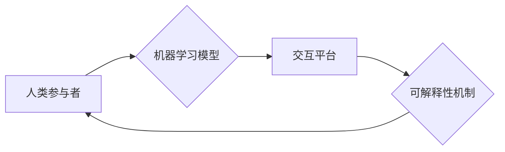

                 

## 应对人类共同挑战：人类计算的使命担当

> 关键词：人类计算、人工智能、大数据、机器学习、深度学习、可解释性、伦理、未来趋势

### 1. 背景介绍

人类正处于一个前所未有的时代，科技进步日新月异，人工智能（AI）技术蓬勃发展，大数据分析日益深入。这些技术正在深刻地改变着我们的生活，为解决人类面临的共同挑战提供了前所未有的机遇。然而，同时也带来了新的伦理、社会和安全问题，需要我们认真思考和应对。

人类计算作为一种新兴的计算范式，旨在将人类的智慧和机器的计算能力有机结合，充分发挥两者优势，共同应对人类面临的挑战。它强调人类在计算过程中的主导作用，注重算法的可解释性、透明性和安全性，旨在构建更加安全、可靠、可持续的未来。

### 2. 核心概念与联系

**2.1 人类计算的概念**

人类计算是指将人类的智慧和机器的计算能力有机结合，共同完成复杂任务的计算范式。它强调人类在计算过程中的主导作用，通过人类的参与和引导，提高算法的准确性、可靠性和可解释性。

**2.2 人类计算与人工智能的关系**

人工智能是人类计算的重要组成部分，但并非全部。人工智能侧重于构建能够模拟人类智能的机器，而人类计算则更强调人类与机器的协同合作。

**2.3 人类计算的架构**

人类计算的架构通常包括以下几个关键要素：

* **人类参与者:** 包括专家、决策者、用户等，他们提供人类的智慧、经验和判断。
* **机器学习模型:** 用于处理数据、发现模式和生成预测，提供机器的计算能力。
* **交互平台:** 用于连接人类和机器，实现信息交换和任务协同。
* **可解释性机制:** 用于解释机器学习模型的决策过程，提高算法的可信度和透明度。

**Mermaid 流程图**



### 3. 核心算法原理 & 具体操作步骤

**3.1 算法原理概述**

人类计算的核心算法原理是将人类的智慧和机器的计算能力有机结合，通过迭代优化和反馈机制，不断提高算法的准确性和可靠性。

**3.2 算法步骤详解**

1. **数据收集和预处理:** 收集相关数据，并进行清洗、转换和特征工程等预处理操作。
2. **模型训练:** 利用机器学习算法对数据进行训练，构建预测模型。
3. **人类反馈:** 人类专家对模型的预测结果进行评估和反馈，指出模型的错误和不足。
4. **模型迭代优化:** 根据人类反馈，对模型进行调整和优化，提高模型的准确性和可靠性。
5. **重复步骤3-4:** 持续进行迭代优化，直到模型达到预期的性能指标。

**3.3 算法优缺点**

**优点:**

* 能够解决复杂、多变的场景问题，提高算法的准确性和可靠性。
* 能够增强算法的可解释性和透明度，提高人类对算法的信任度。
* 能够促进人类与机器的协同合作，发挥两者优势。

**缺点:**

* 需要大量的专家参与和反馈，成本较高。
* 迭代优化过程可能比较耗时。
* 需要建立有效的交互平台和可解释性机制。

**3.4 算法应用领域**

* **医疗诊断:** 利用人类专家知识和机器学习算法，提高疾病诊断的准确性和效率。
* **金融风险管理:** 利用人类经验和机器学习模型，识别和评估金融风险。
* **法律判决:** 利用人类法律知识和机器学习算法，辅助法律判决。
* **自动驾驶:** 利用人类驾驶经验和机器学习模型，提高自动驾驶系统的安全性。

### 4. 数学模型和公式 & 详细讲解 & 举例说明

**4.1 数学模型构建**

人类计算的数学模型通常基于概率论、统计学和机器学习理论。

**4.2 公式推导过程**

例如，在医疗诊断领域，可以使用贝叶斯定理来构建人类计算模型。贝叶斯定理描述了在已知条件下，事件发生的概率如何更新。

$$P(A|B) = \frac{P(B|A)P(A)}{P(B)}$$

其中：

* $P(A|B)$ 是事件 A 在事件 B 发生条件下的概率。
* $P(B|A)$ 是事件 B 在事件 A 发生条件下的概率。
* $P(A)$ 是事件 A 的概率。
* $P(B)$ 是事件 B 的概率。

**4.3 案例分析与讲解**

假设我们有一个医疗诊断模型，用于判断患者是否患有某种疾病。

* $A$ 表示患者患有疾病。
* $B$ 表示患者的症状符合某种疾病的特征。

根据贝叶斯定理，我们可以计算出患者在症状符合疾病特征的情况下患病的概率。

* $P(A)$ 是患病的概率。
* $P(B|A)$ 是症状符合疾病特征的概率，假设为 0.9。
* $P(B)$ 是症状符合疾病特征的概率，假设为 0.1。

如果我们知道 $P(A) = 0.01$，则可以计算出 $P(A|B)$。

$$P(A|B) = \frac{0.9 \times 0.01}{0.1} = 0.09$$

这意味着，如果患者的症状符合疾病特征，那么患病的概率为 9%。

### 5. 项目实践：代码实例和详细解释说明

**5.1 开发环境搭建**

* 操作系统: Ubuntu 20.04
* Python 版本: 3.8
* 必要的库: TensorFlow, PyTorch, scikit-learn

**5.2 源代码详细实现**

```python
# 导入必要的库
import tensorflow as tf

# 定义模型结构
model = tf.keras.models.Sequential([
    tf.keras.layers.Dense(128, activation='relu', input_shape=(input_dim,)),
    tf.keras.layers.Dense(64, activation='relu'),
    tf.keras.layers.Dense(1, activation='sigmoid')
])

# 编译模型
model.compile(optimizer='adam',
              loss='binary_crossentropy',
              metrics=['accuracy'])

# 训练模型
model.fit(X_train, y_train, epochs=10, batch_size=32)

# 评估模型
loss, accuracy = model.evaluate(X_test, y_test)
print('Loss:', loss)
print('Accuracy:', accuracy)
```

**5.3 代码解读与分析**

* 该代码示例展示了如何使用 TensorFlow 库构建一个简单的深度学习模型。
* 模型结构包括三个全连接层，第一层输入维度为 `input_dim`。
* 激活函数使用 ReLU 函数，输出层使用 sigmoid 函数进行二分类。
* 模型使用 Adam 优化器，损失函数为二分类交叉熵，评估指标为准确率。
* 模型训练使用训练数据 `X_train` 和标签 `y_train`，训练 epochs 次，每次训练 batch_size 个样本。
* 训练完成后，使用测试数据 `X_test` 和标签 `y_test` 评估模型性能。

**5.4 运行结果展示**

运行结果将显示模型的损失值和准确率。

### 6. 实际应用场景

**6.1 医疗诊断**

人类计算可以帮助医生更准确地诊断疾病，例如癌症、心血管疾病等。

**6.2 金融风险管理**

人类计算可以帮助金融机构识别和评估金融风险，例如欺诈、洗钱等。

**6.3 自动驾驶**

人类计算可以帮助自动驾驶系统更好地理解道路环境，提高安全性。

**6.4 未来应用展望**

人类计算在未来将有更广泛的应用场景，例如：

* **个性化教育:** 根据学生的学习情况，提供个性化的学习方案。
* **智能客服:** 利用人类知识和机器学习算法，提供更智能的客服服务。
* **科学研究:** 加速科学研究的进程，解决复杂科学问题。

### 7. 工具和资源推荐

**7.1 学习资源推荐**

* **书籍:**

    * 人工智能：一种现代方法
    * 深度学习
    * 人类计算：未来计算范式

* **在线课程:**

    * Coursera: 人工智能
    * edX: 深度学习
    * Udacity: 人工智能工程师

**7.2 开发工具推荐**

* **TensorFlow:** 开源深度学习框架
* **PyTorch:** 开源深度学习框架
* **scikit-learn:** 开源机器学习库

**7.3 相关论文推荐**

* 人类计算：一种新兴的计算范式
* 人类与机器的协同计算
* 可解释性机器学习

### 8. 总结：未来发展趋势与挑战

**8.1 研究成果总结**

人类计算作为一种新兴的计算范式，取得了显著的进展。

* 算法模型不断完善，准确性和可靠性提高。
* 可解释性机制得到发展，提高了算法的可信度和透明度。
* 应用场景不断拓展，覆盖医疗、金融、自动驾驶等多个领域。

**8.2 未来发展趋势**

* **更加智能的算法:** 利用更先进的机器学习算法，构建更加智能的模型。
* **更强的可解释性:** 开发更有效的可解释性机制，提高算法的可理解性和信任度。
* **更广泛的应用:** 将人类计算应用于更多领域，解决更多人类面临的挑战。

**8.3 面临的挑战**

* **数据安全和隐私保护:** 人类计算需要处理大量数据，如何保证数据安全和隐私保护是一个重要挑战。
* **算法偏见:** 机器学习算法可能存在偏见，需要开发方法来识别和解决算法偏见。
* **伦理问题:** 人类计算的应用可能带来新的伦理问题，需要进行深入的伦理思考和规范。

**8.4 研究展望**

未来，人类计算研究将继续深入，探索更智能、更安全、更可持续的计算范式，为人类社会创造更加美好的未来。

### 9. 附录：常见问题与解答

**9.1 如何保证人类计算的准确性？**

人类计算的准确性取决于多个因素，包括数据质量、算法模型、人类专家知识和反馈机制等。

**9.2 如何解决人类计算中的算法偏见问题？**

可以通过以下方法来解决算法偏见问题：

* 使用更加公平的数据集进行训练。
* 开发算法去偏见的方法。
* 提高人类对算法偏见的认识，并进行监督和纠正。

**9.3 人类计算会取代人类工作吗？**

人类计算不会取代人类工作，而是会与人类协同工作，提高工作效率和质量。

**9.4 人类计算的伦理问题有哪些？**

人类计算的应用可能带来以下伦理问题：

* 算法透明度和可解释性
* 数据隐私和安全
* 算法决策的责任和问责

**9.5 人类计算的未来发展趋势是什么？**

未来，人类计算将更加智能、更加安全、更加可持续，并将应用于更多领域，为人类社会创造更加美好的未来。


作者：禅与计算机程序设计艺术 / Zen and the Art of Computer Programming 
<end_of_turn>

