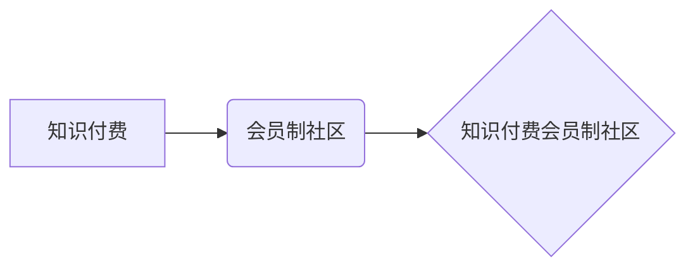

                 

## 打造知识付费会员制社区的策略

> 关键词：知识付费、会员制社区、社区运营、内容策略、技术架构、用户增长、商业模式

## 1. 背景介绍

知识经济时代，知识成为最宝贵的资源。知识付费作为一种新型的商业模式，迅速崛起，为创作者和学习者提供了一个全新的价值交换平台。会员制社区作为知识付费的重要载体，以其独特的价值体系和社群互动模式，吸引了越来越多的用户和创作者。

然而，打造成功的知识付费会员制社区并非易事。需要对用户需求、内容策略、社区运营、技术架构等多个方面进行深入思考和规划。本文将从多个角度探讨打造知识付费会员制社区的策略，为想要进入这一领域的创作者和企业提供一些参考和启示。

## 2. 核心概念与联系

### 2.1  知识付费

知识付费是指以知识、技能、经验等为核心内容，通过付费的方式获取知识和服务。它涵盖了多种形式，例如在线课程、付费文章、直播讲座、咨询服务等。

### 2.2  会员制社区

会员制社区是指通过付费会员制的方式，为用户提供专属内容、服务和社群互动体验的在线平台。会员制社区通常拥有以下特点：

* **付费门槛:** 用户需要支付一定的费用才能成为社区会员，享受社区提供的特权。
* **专属内容:** 会员可以访问社区独家提供的优质内容，例如付费课程、专栏文章、直播回放等。
* **社群互动:** 会员可以与创作者和同好进行互动交流，分享学习心得，共同进步。
* **增值服务:** 会员可以享受社区提供的增值服务，例如一对一咨询、线下活动邀请等。

### 2.3  知识付费会员制社区

知识付费会员制社区将知识付费和会员制社区相结合，为用户提供更丰富的学习体验和社群互动机会。

**核心概念关系图:**



## 3. 核心算法原理 & 具体操作步骤

### 3.1  算法原理概述

知识付费会员制社区的运营需要依靠一系列算法来实现内容推荐、用户匹配、社区活跃度提升等功能。这些算法通常基于机器学习和数据挖掘技术，通过分析用户行为数据、内容特征数据等，为用户提供个性化推荐和服务。

### 3.2  算法步骤详解

1. **数据采集:** 收集用户行为数据、内容特征数据等。
2. **数据预处理:** 对收集到的数据进行清洗、转换、特征提取等处理。
3. **模型训练:** 利用机器学习算法对预处理后的数据进行训练，构建推荐模型、用户匹配模型等。
4. **模型评估:** 对训练好的模型进行评估，调整模型参数，提高模型性能。
5. **模型部署:** 将训练好的模型部署到线上环境，为用户提供个性化推荐和服务。

### 3.3  算法优缺点

**优点:**

* **个性化推荐:** 能够根据用户的兴趣爱好、学习目标等进行个性化推荐，提高用户体验。
* **精准匹配:** 能够根据用户的专业技能、学习需求等进行精准匹配，帮助用户找到合适的学习资源和学习伙伴。
* **社区活跃度提升:** 通过算法推荐和匹配，能够促进用户之间的互动交流，提升社区活跃度。

**缺点:**

* **数据依赖:** 算法的性能依赖于数据的质量和数量，数据不足或数据质量低会影响算法效果。
* **算法黑盒:** 一些复杂的算法难以解释，难以理解算法的决策逻辑，这可能会导致用户对算法结果产生 distrust。
* **算法偏差:** 算法可能会存在偏差，导致推荐结果不公平或不准确。

### 3.4  算法应用领域

* **内容推荐:** 推荐用户感兴趣的内容，例如课程、文章、视频等。
* **用户匹配:** 将用户与合适的学习资源、学习伙伴进行匹配。
* **社区运营:** 促进用户之间的互动交流，提升社区活跃度。
* **个性化学习:** 根据用户的学习进度和学习风格，提供个性化的学习方案。

## 4. 数学模型和公式 & 详细讲解 & 举例说明

### 4.1  数学模型构建

知识付费会员制社区的运营可以构建以下数学模型：

* **用户价值模型:**  $UV = f(C, I, E)$

其中:

* $UV$ 代表用户价值
* $C$ 代表用户参与社区的成本
* $I$ 代表用户从社区获得的收益
* $E$ 代表用户对社区的期望

* **内容价值模型:** $CV = g(T, R, Q)$

其中:

* $CV$ 代表内容价值
* $T$ 代表内容的主题深度
* $R$ 代表内容的实用性
* $Q$ 代表内容的质量

### 4.2  公式推导过程

用户价值模型和内容价值模型可以用来评估用户和内容的价值，从而指导社区运营策略。例如，可以通过提高内容的主题深度、实用性和质量，来提升内容价值，从而吸引更多用户加入社区。

### 4.3  案例分析与讲解

假设一个知识付费会员制社区，提供编程课程、技术文章、在线论坛等服务。

* **用户价值分析:** 

用户参与社区的成本包括时间成本、金钱成本等。用户从社区获得的收益包括知识获取、技能提升、职业发展等。用户对社区的期望包括学习效果、社群互动、职业资源等。

* **内容价值分析:** 

编程课程的主题深度、实用性和质量取决于课程内容的丰富程度、案例的实用性、老师的教学水平等。技术文章的主题深度、实用性和质量取决于文章的原创性、深度分析、实用性等。在线论坛的质量取决于用户活跃度、讨论质量、社区氛围等。

通过分析用户价值和内容价值，社区运营者可以制定相应的策略，例如：

* **提升课程质量:** 邀请知名专家授课，增加课程案例，提高课程实用性。
* **丰富内容形式:** 提供多种形式的内容，例如视频课程、直播讲座、在线文档等。
* **加强社群互动:** 组织线上线下活动，鼓励用户交流互动，构建良好的社区氛围。

## 5. 项目实践：代码实例和详细解释说明

### 5.1  开发环境搭建

* **操作系统:** Linux/macOS/Windows
* **编程语言:** Python
* **框架:** Django/Flask
* **数据库:** PostgreSQL/MySQL
* **云服务:** AWS/Azure/GCP

### 5.2  源代码详细实现

以下是一个简单的 Python 代码示例，用于实现用户注册功能：

```python
from flask import Flask, render_template, request, redirect, url_for

app = Flask(__name__)

# 数据库连接

@app.route('/register', methods=['GET', 'POST'])
def register():
    if request.method == 'POST':
        username = request.form['username']
        password = request.form['password']
        # 数据验证和存储
        return redirect(url_for('index'))
    else:
        return render_template('register.html')

if __name__ == '__main__':
    app.run(debug=True)
```

### 5.3  代码解读与分析

* **Flask框架:** 使用 Flask 框架构建 Web 应用。
* **路由:** 定义 `/register` 路由，用于处理用户注册请求。
* **表单处理:** 使用 `request.form` 获取用户提交的表单数据。
* **数据验证:** 对用户输入进行验证，确保数据合法性。
* **数据存储:** 将用户数据存储到数据库中。
* **重定向:** 注册成功后，重定向到首页。

### 5.4  运行结果展示

运行代码后，访问 `/register` 路由，即可看到用户注册页面。用户填写用户名和密码，提交表单后，系统会验证数据并存储到数据库中，然后重定向到首页。

## 6. 实际应用场景

知识付费会员制社区的应用场景非常广泛，例如：

* **教育培训:** 提供在线课程、直播讲座、学习资料等，满足用户学习需求。
* **专业技能提升:** 提供专业技能培训、行业资讯、职业发展指导等，帮助用户提升职业竞争力。
* **兴趣爱好发展:** 提供兴趣爱好课程、社群互动、线下活动等，满足用户兴趣爱好发展需求。
* **企业内部培训:** 企业可以利用知识付费会员制社区，为员工提供内部培训、知识共享、技能提升等服务。

### 6.4  未来应用展望

随着人工智能、大数据等技术的不断发展，知识付费会员制社区将更加智能化、个性化、互动化。未来，知识付费会员制社区可能会发展出以下趋势:

* **更精准的个性化推荐:** 利用人工智能算法，更加精准地推荐用户感兴趣的内容和服务。
* **更丰富的互动体验:** 利用虚拟现实、增强现实等技术，提供更丰富的互动体验。
* **更完善的社区生态:** 建立更加完善的社区生态，包括内容创作者、用户、平台运营商等多方参与。

## 7. 工具和资源推荐

### 7.1  学习资源推荐

* **书籍:**
    * 《The Lean Startup》 by Eric Ries
    * 《Zero to One》 by Peter Thiel
    * 《Hooked》 by Nir Eyal
* **在线课程:**
    * Coursera
    * Udemy
    * edX

### 7.2  开发工具推荐

* **编程语言:** Python, JavaScript, Ruby
* **框架:** Django, Flask, React, Vue.js
* **数据库:** PostgreSQL, MySQL, MongoDB
* **云服务:** AWS, Azure, GCP

### 7.3  相关论文推荐

* **The Economics of Online Learning Platforms** by Michael A. Luca
* **The Impact of Online Learning on Educational Outcomes** by Susan A. Dynarski
* **The Future of Work: How Technology Will Transform the Workplace** by World Economic Forum

## 8. 总结：未来发展趋势与挑战

### 8.1  研究成果总结

知识付费会员制社区是一个充满机遇和挑战的领域。通过对用户需求、内容策略、社区运营、技术架构等方面的深入研究，可以打造成功的知识付费会员制社区，为创作者和学习者提供更优质的价值交换平台。

### 8.2  未来发展趋势

未来，知识付费会员制社区将朝着更加智能化、个性化、互动化方向发展，并与其他新兴技术融合，例如人工智能、大数据、区块链等，创造更加丰富的学习体验和社区生态。

### 8.3  面临的挑战

知识付费会员制社区也面临着一些挑战，例如:

* **内容质量控制:** 确保社区内容的质量和原创性。
* **用户粘性提升:** 提高用户参与度和留存率。
* **商业模式创新:** 探索新的商业模式，实现可持续发展。

### 8.4  研究展望

未来，需要进一步研究知识付费会员制社区的运营机制、用户行为模式、内容推荐算法等，为打造更加成功的知识付费会员制社区提供理论支持和实践指导。

## 9. 附录：常见问题与解答

* **如何吸引用户加入社区？**

可以通过内容营销、社群运营、用户推广等方式吸引用户加入社区。

* **如何提高用户留存率？**

可以通过提供优质内容、加强社群互动、提供增值服务等方式提高用户留存率。

* **如何实现社区盈利？**

可以通过会员订阅、付费课程、广告收入等方式实现社区盈利。


作者：禅与计算机程序设计艺术 / Zen and the Art of Computer Programming 
<end_of_turn>

