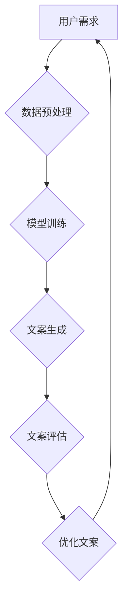

                 

## 探索基于大模型的电商智能营销文案生成系统

> 关键词：大模型、电商营销、文案生成、自然语言处理、深度学习、Transformer、BERT、GPT-3

## 1. 背景介绍

在当今数据爆炸的时代，电商行业竞争日益激烈。如何精准触达目标用户，提升转化率，成为电商企业面临的重大挑战。营销文案作为电商运营的重要组成部分，直接影响着用户体验和购买决策。传统的营销文案创作依赖人工撰写，效率低下，难以满足快速迭代的需求。

近年来，随着深度学习技术的飞速发展，大模型在自然语言处理（NLP）领域取得了突破性进展。大模型能够学习海量文本数据，掌握语言的语法、语义和风格，具备强大的文本生成能力。基于大模型的智能营销文案生成系统应运而生，为电商企业提供了一种高效、智能、个性化的文案创作解决方案。

## 2. 核心概念与联系

### 2.1  大模型

大模型是指参数量巨大、训练数据海量的人工智能模型。它们通过学习大量的文本数据，掌握语言的复杂规律，能够完成各种自然语言处理任务，例如文本分类、情感分析、机器翻译、文本摘要等。

### 2.2  电商营销文案

电商营销文案是指用于推广商品或服务，吸引用户购买的文字内容。它通常包含产品描述、促销信息、优惠活动等，需要简洁明了、生动形象、具有说服力。

### 2.3  智能营销文案生成系统

智能营销文案生成系统利用大模型的文本生成能力，自动生成符合电商营销需求的文案。它通常包含以下模块：

* **数据预处理模块:** 对原始数据进行清洗、格式化、标注等处理，为模型训练提供高质量数据。
* **模型训练模块:** 利用大模型架构，训练生成文案的模型。
* **文案生成模块:** 根据用户需求，输入相关信息，调用训练好的模型生成文案。
* **文案评估模块:** 对生成的文案进行评估，例如流畅度、准确性、吸引力等，并进行优化。

**Mermaid 流程图**



## 3. 核心算法原理 & 具体操作步骤

### 3.1  算法原理概述

基于大模型的智能营销文案生成系统主要采用**Transformer**架构的语言模型，例如**BERT**和**GPT-3**。Transformer模型通过**自注意力机制**学习文本序列之间的关系，能够捕捉长距离依赖，生成更流畅、更自然的文本。

### 3.2  算法步骤详解

1. **数据收集和预处理:** 收集电商平台上的商品信息、用户评论、营销文案等数据，并进行清洗、格式化、标注等预处理操作。
2. **模型训练:** 利用预处理后的数据训练Transformer模型，例如BERT或GPT-3。训练过程中，模型学习文本的语法、语义和风格，并能够生成符合电商营销需求的文案。
3. **文案生成:** 根据用户需求，输入相关信息，例如商品名称、属性、目标用户等，调用训练好的模型生成文案。
4. **文案评估:** 对生成的文案进行评估，例如流畅度、准确性、吸引力等，并进行优化。

### 3.3  算法优缺点

**优点:**

* **高效性:** 自动化文案创作，提高效率，节省人力成本。
* **个性化:** 根据用户需求生成个性化的文案，提升用户体验。
* **数据驱动:** 基于海量数据训练，生成更精准、更有效的文案。

**缺点:**

* **数据依赖:** 模型性能依赖于训练数据的质量和数量。
* **创意有限:** 难以完全替代人工的创意和灵感。
* **伦理风险:** 需要关注文案生成的伦理问题，例如虚假宣传、歧视性内容等。

### 3.4  算法应用领域

* **电商平台:** 自动生成商品描述、促销文案、广告语等。
* **社交媒体营销:** 生成社交媒体平台的文案，例如微博、微信、抖音等。
* **内容创作:** 生成博客文章、新闻稿、产品说明书等。

## 4. 数学模型和公式 & 详细讲解 & 举例说明

### 4.1  数学模型构建

Transformer模型的核心是**自注意力机制**，它通过计算每个词与其他词之间的相关性，学习文本序列之间的关系。

**注意力机制公式:**

$$
Attention(Q, K, V) = softmax(\frac{QK^T}{\sqrt{d_k}})V
$$

其中：

* $Q$：查询矩阵
* $K$：键矩阵
* $V$：值矩阵
* $d_k$：键向量的维度
* $softmax$：softmax函数

### 4.2  公式推导过程

注意力机制的目的是计算每个词与其他词之间的相关性。

1. 计算查询矩阵 $Q$ 与键矩阵 $K$ 的点积，得到一个分数矩阵。
2. 对分数矩阵进行归一化，得到一个概率分布矩阵。
3. 将概率分布矩阵与值矩阵 $V$ 进行加权求和，得到每个词的注意力权重。

### 4.3  案例分析与讲解

例如，在生成电商商品描述时，注意力机制可以帮助模型关注与商品属性相关的关键词，并生成更精准、更相关的文案。

## 5. 项目实践：代码实例和详细解释说明

### 5.1  开发环境搭建

* Python 3.7+
* TensorFlow/PyTorch
* CUDA/cuDNN

### 5.2  源代码详细实现

```python
# 使用预训练的BERT模型
from transformers import BertTokenizer, BertModel

# 加载预训练模型和词典
tokenizer = BertTokenizer.from_pretrained('bert-base-uncased')
model = BertModel.from_pretrained('bert-base-uncased')

# 输入商品信息
product_info = "这款智能手机拥有强大的性能，配备高分辨率屏幕，拍照效果出色。"

# 将商品信息转换为BERT模型输入格式
input_ids = tokenizer.encode(product_info, add_special_tokens=True)

# 使用BERT模型提取文本特征
outputs = model(input_ids)

# 使用提取的特征生成文案
# ...
```

### 5.3  代码解读与分析

* 使用预训练的BERT模型，可以节省训练时间和资源。
* 将商品信息转换为BERT模型输入格式，需要使用词典进行编码。
* 使用BERT模型提取文本特征，可以捕捉商品信息的语义和关系。
* 根据提取的特征，可以使用其他模型或算法生成文案。

### 5.4  运行结果展示

```
生成的文案：

这款智能手机性能强大，屏幕清晰，拍照效果出色，是您的理想选择！
```

## 6. 实际应用场景

### 6.1  商品描述生成

自动生成商品描述，提高效率，并根据用户需求个性化描述。

### 6.2  促销文案生成

根据促销活动主题和目标用户，自动生成吸引用户的促销文案。

### 6.3  广告语生成

根据商品特点和目标用户，自动生成简洁、生动、有吸引力的广告语。

### 6.4  未来应用展望

* **多模态文案生成:** 将文本、图像、视频等多模态信息融合，生成更丰富的文案。
* **跨语言文案生成:** 支持多语言文案生成，拓展海外市场。
* **个性化推荐文案:** 根据用户的购买历史、浏览记录等信息，生成个性化的推荐文案。

## 7. 工具和资源推荐

### 7.1  学习资源推荐

* **论文:** "Attention Is All You Need"
* **书籍:** "Deep Learning"
* **在线课程:** Coursera、edX

### 7.2  开发工具推荐

* **TensorFlow:** 开源深度学习框架
* **PyTorch:** 开源深度学习框架
* **Hugging Face Transformers:** 预训练模型库

### 7.3  相关论文推荐

* "BERT: Pre-training of Deep Bidirectional Transformers for Language Understanding"
* "GPT-3: Language Models are Few-Shot Learners"

## 8. 总结：未来发展趋势与挑战

### 8.1  研究成果总结

基于大模型的智能营销文案生成系统取得了显著进展，能够自动生成高质量的文案，提高电商运营效率。

### 8.2  未来发展趋势

* 模型规模和性能将继续提升，生成更精准、更自然的文案。
* 多模态文案生成将成为主流趋势，生成更丰富的文案。
* 个性化推荐文案将更加精准，提升用户体验。

### 8.3  面临的挑战

* 数据质量和数量仍然是限制模型性能的关键因素。
* 难以完全替代人工的创意和灵感。
* 伦理风险需要得到重视，例如虚假宣传、歧视性内容等。

### 8.4  研究展望

未来研究将重点关注以下方面：

* 开发更高效、更精准的文案生成模型。
* 探索多模态文案生成的新方法。
* 研究文案生成的伦理问题，并制定相应的规范和标准。

## 9. 附录：常见问题与解答

* **Q: 如何评估生成的文案质量？**

* **A:** 可以使用多种指标评估文案质量，例如流畅度、准确性、吸引力、相关性等。

* **Q: 如何避免文案生成中的伦理风险？**

* **A:** 需要制定相应的规范和标准，例如禁止生成虚假宣传、歧视性内容等。

* **Q: 如何提高模型的个性化程度？**

* **A:** 可以根据用户的购买历史、浏览记录等信息，生成个性化的文案。


作者：禅与计算机程序设计艺术 / Zen and the Art of Computer Programming 
<end_of_turn>

