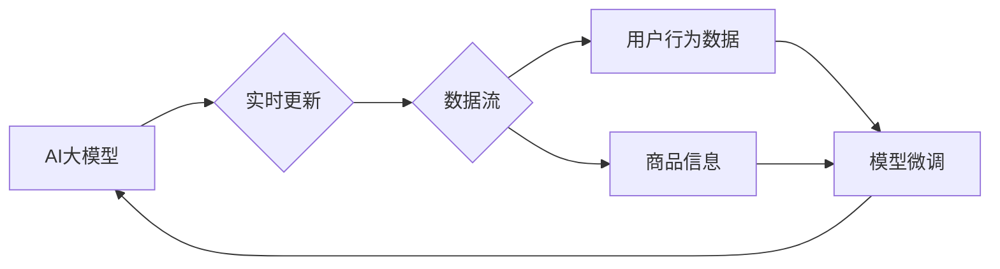

                 

## 推荐系统中AI大模型的实时更新机制

> 关键词：推荐系统、AI大模型、实时更新、模型训练、在线学习、数据流、微调、冷启动

## 1. 背景介绍

推荐系统作为互联网时代的重要组成部分，在电商、社交媒体、视频平台等领域发挥着至关重要的作用。传统的推荐系统主要依赖于基于内容的过滤、协同过滤等方法，但随着用户行为数据的爆炸式增长和个性化需求的不断提升，传统的推荐算法逐渐难以满足用户的需求。

近年来，深度学习技术的快速发展为推荐系统带来了新的机遇。基于深度学习的推荐系统能够更好地学习用户兴趣和商品特征，从而提供更精准、更个性化的推荐结果。然而，深度学习模型的训练需要大量的 labeled 数据，并且模型的性能会随着时间推移而下降，因为用户行为数据和商品信息都在不断变化。

因此，如何实现推荐系统中AI大模型的实时更新机制，是当前研究的热点问题。实时更新机制能够使推荐系统能够及时适应用户行为和商品信息的动态变化，从而保持推荐效果的持续提升。

## 2. 核心概念与联系

### 2.1  AI大模型

AI大模型是指在海量数据上训练的深度学习模型，其参数量通常在数十亿甚至千亿级别。AI大模型具备强大的泛化能力和学习能力，能够在各种任务中取得优异的性能，例如自然语言处理、图像识别、语音合成等。

### 2.2  实时更新

实时更新是指在模型训练完成后，持续接收新的数据并对模型进行在线更新的过程。实时更新机制能够使模型能够及时适应数据分布的变化，从而保持模型的准确性和有效性。

### 2.3  推荐系统

推荐系统是指通过分析用户行为数据和商品信息，预测用户对特定商品的兴趣，并推荐相关商品给用户的系统。推荐系统广泛应用于电商、社交媒体、视频平台等领域，能够帮助用户发现感兴趣的内容，提高用户体验。

**核心概念与架构流程图**



## 3. 核心算法原理 & 具体操作步骤

### 3.1  算法原理概述

推荐系统中AI大模型的实时更新机制主要基于在线学习算法，例如在线梯度下降、随机梯度下降等。这些算法能够根据接收到的新数据，不断更新模型参数，从而使模型能够适应数据分布的变化。

### 3.2  算法步骤详解

1. **数据收集:** 收集用户行为数据和商品信息，例如用户点击、购买、浏览等行为，以及商品的类别、价格、描述等信息。
2. **数据预处理:** 对收集到的数据进行清洗、转换和特征工程，使其能够被模型所理解。
3. **模型初始化:** 使用预训练的AI大模型作为初始模型，或者从头训练一个新的模型。
4. **在线学习:** 接收新的数据，并使用在线学习算法对模型参数进行更新。
5. **模型评估:** 定期评估模型的性能，例如准确率、召回率等指标。
6. **模型部署:** 将更新后的模型部署到生产环境中，用于提供推荐服务。

### 3.3  算法优缺点

**优点:**

* **实时性:** 可以及时适应数据分布的变化，保持模型的准确性和有效性。
* **效率:** 不需要重新训练整个模型，只需要更新部分参数，因此效率更高。
* **可扩展性:** 可以根据需要增加数据流和更新频率，从而提高模型的性能。

**缺点:**

* **数据质量:** 在线学习算法对数据质量要求较高，如果数据质量差，可能会导致模型性能下降。
* **模型稳定性:** 模型参数的更新可能会导致模型的稳定性下降，需要采取措施保证模型的稳定性。
* **计算资源:** 在线学习算法需要一定的计算资源，需要根据实际情况选择合适的硬件配置。

### 3.4  算法应用领域

实时更新机制广泛应用于各种推荐系统，例如：

* **电商推荐:** 推荐商品、优惠券、促销活动等。
* **社交媒体推荐:** 推荐好友、文章、视频等。
* **视频平台推荐:** 推荐视频、电视剧、电影等。
* **新闻推荐:** 推荐新闻、资讯、博客等。

## 4. 数学模型和公式 & 详细讲解 & 举例说明

### 4.1  数学模型构建

假设我们有一个推荐系统，其目标是预测用户对商品的评分。我们可以使用以下数学模型来表示用户对商品的评分预测：

$$
\hat{r}_{u,i} = f(v_u, v_i, \theta)
$$

其中：

* $\hat{r}_{u,i}$ 是模型预测的用户 $u$ 对商品 $i$ 的评分。
* $v_u$ 是用户 $u$ 的特征向量。
* $v_i$ 是商品 $i$ 的特征向量。
* $\theta$ 是模型参数。
* $f$ 是一个非线性函数，例如神经网络。

### 4.2  公式推导过程

在线学习算法的目标是通过不断更新模型参数 $\theta$，使模型预测的评分与实际评分之间的误差最小化。常用的在线学习算法是随机梯度下降 (SGD)，其更新规则如下：

$$
\theta = \theta - \eta \nabla L(\theta)
$$

其中：

* $\eta$ 是学习率，控制着参数更新的步长。
* $\nabla L(\theta)$ 是损失函数 $L(\theta)$ 对参数 $\theta$ 的梯度。

损失函数通常是平方误差函数：

$$
L(\theta) = \frac{1}{2} \sum_{u,i} (r_{u,i} - \hat{r}_{u,i})^2
$$

其中：

* $r_{u,i}$ 是用户 $u$ 对商品 $i$ 的实际评分。

### 4.3  案例分析与讲解

假设我们有一个电商平台，其推荐系统需要预测用户对商品的评分。我们可以使用一个基于神经网络的模型来实现推荐，并使用随机梯度下降算法进行在线学习。

当用户对商品进行评分时，系统会收集用户和商品的特征信息，并使用模型预测用户对商品的评分。然后，系统会计算预测评分与实际评分之间的误差，并根据误差更新模型参数。

通过不断接收新的数据并更新模型参数，推荐系统能够不断提高其预测准确率，从而提供更精准的商品推荐。

## 5. 项目实践：代码实例和详细解释说明

### 5.1  开发环境搭建

推荐系统中AI大模型的实时更新机制通常需要使用分布式计算框架，例如 TensorFlow Serving、PyTorch Serving 等。

以下是一个使用 TensorFlow Serving 搭建开发环境的示例：

1. 安装 TensorFlow Serving：

```bash
pip install tensorflow-serving
```

2. 下载预训练模型：

```bash
wget https://example.com/model.pb
```

3. 启动 TensorFlow Serving：

```bash
tensorflow_model_server --model_name=my_model --model_base_path=/path/to/model
```

### 5.2  源代码详细实现

以下是一个使用 TensorFlow Serving 和 Python 代码实现实时更新机制的示例：

```python
import tensorflow as tf
import requests

# 加载预训练模型
model = tf.saved_model.load("my_model")

# 定义预测函数
def predict(user_id, item_id):
    inputs = {"user_id": user_id, "item_id": item_id}
    predictions = model(inputs)
    return predictions

# 接收新数据并更新模型
def update_model(user_id, item_id, rating):
    # ... (实现模型更新逻辑)

# 主程序
if __name__ == "__main__":
    while True:
        # 接收新数据
        data = requests.get("http://data_stream.com/new_data")

        # 预测评分
        for user_id, item_id in data.json():
            prediction = predict(user_id, item_id)

        # 更新模型
        for user_id, item_id, rating in data.json():
            update_model(user_id, item_id, rating)
```

### 5.3  代码解读与分析

* 代码首先加载预训练模型，并定义一个预测函数，用于根据用户和商品的ID预测评分。
* 然后，代码定义了一个更新模型函数，用于接收新数据并更新模型参数。
* 主程序循环接收新数据，预测评分，并更新模型。

### 5.4  运行结果展示

运行结果将展示实时更新后的模型预测评分，以及模型性能指标的变化趋势。

## 6. 实际应用场景

### 6.1  电商推荐

实时更新机制可以帮助电商平台根据用户的实时行为，动态调整商品推荐策略，提高推荐精准度和转化率。例如，当用户浏览某个商品类别时，系统可以根据用户的浏览历史和购买记录，推荐与该类别相关的热门商品。

### 6.2  社交媒体推荐

实时更新机制可以帮助社交媒体平台根据用户的实时互动，推荐更相关的用户、内容和活动。例如，当用户点赞或评论某个帖子时，系统可以根据用户的兴趣爱好和社交关系，推荐其他用户可能感兴趣的帖子。

### 6.3  视频平台推荐

实时更新机制可以帮助视频平台根据用户的实时观看记录，推荐更符合用户口味的视频内容。例如，当用户观看某个类型的视频时，系统可以根据用户的观看历史和偏好，推荐其他同类型或相关类型的视频。

### 6.4  未来应用展望

随着人工智能技术的不断发展，实时更新机制将在更多领域得到应用，例如：

* **个性化教育:** 根据学生的学习进度和兴趣爱好，实时调整学习内容和教学方式。
* **医疗诊断:** 根据患者的实时症状和病史，实时更新诊断模型，提高诊断准确率。
* **金融风险控制:** 根据用户的实时交易行为，实时更新风险模型，降低金融风险。

## 7. 工具和资源推荐

### 7.1  学习资源推荐

* **深度学习书籍:**

    * 《深度学习》 by Ian Goodfellow, Yoshua Bengio, and Aaron Courville
    * 《动手学深度学习》 by Aurélien Géron

* **在线课程:**

    * Coursera: Deep Learning Specialization
    * Udacity: Deep Learning Nanodegree

### 7.2  开发工具推荐

* **TensorFlow:** https://www.tensorflow.org/
* **PyTorch:** https://pytorch.org/
* **TensorFlow Serving:** https://www.tensorflow.org/tfx/serving
* **PyTorch Serving:** https://pytorch.org/serve/

### 7.3  相关论文推荐

* **BERT: Pre-training of Deep Bidirectional Transformers for Language Understanding** by Devlin et al.
* **GPT-3: Language Models are Few-Shot Learners** by Brown et al.
* **DALL-E: Creating Images from Text** by Radford et al.

## 8. 总结：未来发展趋势与挑战

### 8.1  研究成果总结

近年来，AI大模型在推荐系统领域取得了显著的成果，实时更新机制为模型的持续优化提供了新的思路。

### 8.2  未来发展趋势

* **模型规模和能力的提升:** 未来，AI大模型的规模和能力将会进一步提升，能够处理更复杂的数据和任务。
* **个性化推荐的增强:** 实时更新机制将进一步增强个性化推荐的能力，能够根据用户的实时行为和偏好，提供更精准的推荐结果。
* **跨模态推荐的融合:** 未来，推荐系统将融合多模态数据，例如文本、图像、视频等，提供更丰富的推荐体验。

### 8.3  面临的挑战

* **数据质量和隐私保护:** 实时更新机制对数据质量要求较高，同时需要考虑用户隐私保护问题。
* **模型训练和部署成本:** 大型AI模型的训练和部署成本较高，需要寻找更有效的训练和部署方法。
* **模型解释性和可控性:** AI大模型的决策过程往往难以解释，需要提高模型的解释性和可控性。

### 8.4  研究展望

未来，研究者将继续探索更有效的实时更新机制，提高模型的性能和效率，同时解决数据质量、隐私保护、模型解释性和可控性等挑战。


## 9. 附录：常见问题与解答

**Q1: 实时更新机制的更新频率如何确定？**

**A1:** 更新频率取决于数据的更新速度和模型的复杂度。一般来说，数据更新频率越高，模型更新频率也应该越高。

**Q2: 实时更新机制如何保证模型的稳定性？**

**A2:** 可以使用一些技术来保证模型的稳定性，例如：

* **滑动平均:** 对模型参数进行滑动平均，降低参数更新的幅度。
* **正则化:** 使用正则化技术来防止模型过拟合。
* **模型验证:** 定期使用验证集评估模型性能，并根据性能调整更新频率和学习率。

**Q3: 实时更新机制如何处理冷启动问题？**

**A3:** 冷启动问题是指模型在初始阶段缺乏数据训练，导致性能较差。可以采用以下方法解决冷启动问题：

* **预训练模型:** 使用预训练模型作为初始模型，并根据新数据进行微调。
* **知识蒸馏:** 将大型模型的知识迁移到小型模型中，提高小型模型的性能。
* **数据增强:** 使用数据增强技术增加训练数据量。


作者：禅与计算机程序设计艺术 / Zen and the Art of Computer Programming 
<end_of_turn>

