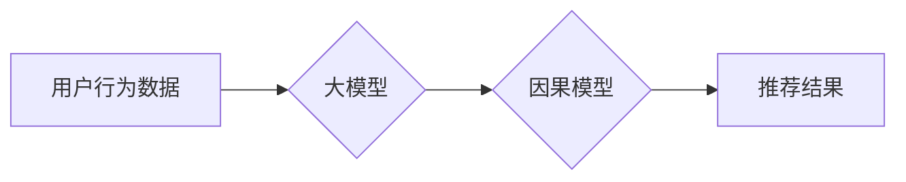

                 

## 推荐系统中的大模型因果推断应用

> 关键词：推荐系统、大模型、因果推断、机器学习、可解释性、用户行为预测

## 1. 背景介绍

推荐系统作为互联网时代的重要组成部分，在电商、社交媒体、内容平台等领域发挥着至关重要的作用。传统的推荐系统主要依赖于协同过滤和内容过滤等方法，这些方法虽然有效，但存在一些局限性：

* **数据稀疏性:** 协同过滤依赖于用户-物品交互数据，而这些数据往往是稀疏的，难以准确地捕捉用户偏好。
* **冷启动问题:** 新用户和新物品难以获得推荐，因为缺乏历史交互数据。
* **缺乏可解释性:**  传统的推荐算法难以解释推荐结果背后的原因，用户难以理解推荐系统的决策逻辑。

近年来，大模型的兴起为推荐系统带来了新的机遇。大模型拥有强大的学习能力，能够从海量数据中学习到更复杂的模式，并生成更精准的推荐结果。然而，大模型的训练和应用也面临着一些挑战：

* **数据规模和计算资源:**  大模型的训练需要海量数据和强大的计算资源，这对于许多中小企业来说是一个难题。
* **可解释性问题:**  大模型的决策过程往往是复杂的，难以解释推荐结果背后的原因，这可能会导致用户对推荐结果的信任度降低。

因果推断作为一种强大的工具，能够帮助我们理解变量之间的因果关系，并预测变量之间的影响。将因果推断应用于推荐系统，可以帮助我们解决一些传统推荐系统面临的挑战，例如：

* **缓解数据稀疏性:**  通过因果推断，我们可以从用户特征、物品属性等方面挖掘潜在的因果关系，从而弥补数据稀疏性的不足。
* **解决冷启动问题:**  通过因果推断，我们可以预测新用户和新物品的潜在偏好，从而解决冷启动问题。
* **提高推荐系统的可解释性:**  通过因果推断，我们可以解释推荐结果背后的原因，提高用户对推荐系统的信任度。

## 2. 核心概念与联系

**2.1  推荐系统概述**

推荐系统旨在根据用户的历史行为、偏好和上下文信息，预测用户对特定物品的兴趣，并推荐用户可能感兴趣的物品。

**2.2  因果推断概述**

因果推断是指通过观察数据，推断出变量之间的因果关系。

**2.3  大模型与因果推断的结合**

大模型能够从海量数据中学习到复杂的模式，而因果推断能够帮助我们理解这些模式背后的因果关系。将大模型与因果推断结合，可以构建更智能、更可解释的推荐系统。

**2.4  核心架构**



## 3. 核心算法原理 & 具体操作步骤

### 3.1  算法原理概述

因果推断在推荐系统中的应用主要基于以下几个算法：

* **潜在变量模型:**  假设存在一些不可观测的潜在变量，这些变量影响着用户对物品的兴趣。通过学习这些潜在变量，我们可以推断出用户和物品之间的因果关系。
* **逆推断:**  通过反向推断用户行为，我们可以了解哪些因素导致了用户的行为，从而预测用户对特定物品的兴趣。
* **因果图模型:**  使用因果图来表示用户行为和物品属性之间的因果关系，并通过图模型学习算法来预测用户对物品的兴趣。

### 3.2  算法步骤详解

1. **数据收集和预处理:** 收集用户行为数据，例如点击、购买、评分等，并进行预处理，例如数据清洗、特征提取等。
2. **因果模型构建:** 根据具体的应用场景，选择合适的因果模型，并根据收集到的数据进行模型训练。
3. **因果关系分析:** 利用训练好的因果模型，分析用户行为和物品属性之间的因果关系。
4. **推荐结果生成:** 根据因果关系分析结果，预测用户对特定物品的兴趣，并生成推荐结果。

### 3.3  算法优缺点

**优点:**

* 能够缓解数据稀疏性问题。
* 可以解决冷启动问题。
* 提高推荐系统的可解释性。

**缺点:**

* 需要大量的因果知识和专业技能。
* 计算复杂度较高，需要强大的计算资源。
* 难以处理复杂的多因素因果关系。

### 3.4  算法应用领域

* **电商推荐:**  预测用户对商品的购买兴趣，提高商品销量。
* **内容推荐:**  推荐用户可能感兴趣的文章、视频、音乐等内容。
* **广告推荐:**  推荐用户可能感兴趣的广告，提高广告点击率和转化率。

## 4. 数学模型和公式 & 详细讲解 & 举例说明

### 4.1  数学模型构建

假设我们有一个推荐系统，需要预测用户 $u$ 对物品 $i$ 的评分 $r_{ui}$。我们可以使用以下因果模型来表示用户评分的生成过程:

$$r_{ui} = f(X_u, X_i, C)$$

其中:

* $r_{ui}$ 是用户 $u$ 对物品 $i$ 的评分。
* $X_u$ 是用户 $u$ 的特征向量。
* $X_i$ 是物品 $i$ 的特征向量。
* $C$ 是一个包含用户和物品属性的因果变量向量。
* $f$ 是一个函数，表示用户评分的生成过程。

### 4.2  公式推导过程

为了推导 $f$ 函数，我们可以使用因果推断算法，例如潜在变量模型或逆推断。

**潜在变量模型:**

假设存在一个潜在变量 $Z_{ui}$，表示用户 $u$ 对物品 $i$ 的潜在兴趣。我们可以假设:

$$r_{ui} = g(Z_{ui}, X_u, X_i)$$

$$Z_{ui} = h(X_u, X_i, C)$$

其中:

* $g$ 是一个函数，表示评分与潜在兴趣的关系。
* $h$ 是一个函数，表示潜在兴趣与用户和物品特征的关系。

通过学习 $g$ 和 $h$ 函数，我们可以推断出用户评分背后的潜在兴趣。

**逆推断:**

我们可以通过反向推断用户行为，例如点击、购买等，来了解哪些因素导致了用户的行为，从而预测用户对特定物品的兴趣。

### 4.3  案例分析与讲解

例如，我们可以使用因果推断来分析用户对电影的评分。我们可以收集用户评分、电影属性、用户特征等数据，并构建一个因果模型来预测用户对电影的评分。通过分析模型的结果，我们可以了解哪些因素影响着用户的评分，例如电影类型、演员、评分等。

## 5. 项目实践：代码实例和详细解释说明

### 5.1  开发环境搭建

* Python 3.7+
* TensorFlow 2.0+
* PyTorch 1.0+
* Jupyter Notebook

### 5.2  源代码详细实现

```python
import tensorflow as tf

# 定义用户特征和物品特征
user_features = tf.keras.Input(shape=(10,))
item_features = tf.keras.Input(shape=(5,))

# 定义因果模型
hidden_layer = tf.keras.layers.Dense(64, activation='relu')(user_features)
hidden_layer = tf.keras.layers.Dense(32, activation='relu')(hidden_layer)
output_layer = tf.keras.layers.Dense(1, activation='linear')(hidden_layer)

# 构建模型
model = tf.keras.Model(inputs=[user_features, item_features], outputs=output_layer)

# 编译模型
model.compile(optimizer='adam', loss='mse')

# 训练模型
model.fit(
    x=[user_data, item_data],
    y=rating_data,
    epochs=10,
    batch_size=32
)

# 生成推荐结果
user_features_test = tf.constant([[...]])
item_features_test = tf.constant([[...]])
predictions = model.predict([user_features_test, item_features_test])
```

### 5.3  代码解读与分析

* 代码首先定义了用户特征和物品特征的输入层。
* 然后定义了一个包含多个隐藏层的深度神经网络模型，用于学习用户评分的生成过程。
* 模型使用 Adam 优化器和均方误差损失函数进行训练。
* 训练完成后，可以使用模型预测用户对特定物品的评分。

### 5.4  运行结果展示

运行代码后，可以得到用户对特定物品的评分预测结果。

## 6. 实际应用场景

### 6.1  电商推荐

* 预测用户对商品的购买兴趣，提高商品销量。
* 个性化推荐商品，提高用户购物体验。

### 6.2  内容推荐

* 推荐用户可能感兴趣的文章、视频、音乐等内容。
* 个性化推荐内容，提高用户阅读、观看和听取体验。

### 6.3  广告推荐

* 推荐用户可能感兴趣的广告，提高广告点击率和转化率。
* 个性化推荐广告，提高广告效果。

### 6.4  未来应用展望

* 结合多模态数据，例如文本、图像、音频等，构建更全面的用户画像。
* 利用强化学习算法，优化推荐策略，提高推荐效果。
* 将因果推断应用于其他领域，例如医疗、金融等。

## 7. 工具和资源推荐

### 7.1  学习资源推荐

* **书籍:**
    * "因果推断" by Judea Pearl
    * "The Elements of Statistical Learning" by Trevor Hastie, Robert Tibshirani, and Jerome Friedman
* **课程:**
    * Coursera: Causal Inference
    * edX: Introduction to Causal Inference

### 7.2  开发工具推荐

* **TensorFlow:** https://www.tensorflow.org/
* **PyTorch:** https://pytorch.org/
* **CausalML:** https://causalml.ai/

### 7.3  相关论文推荐

* "Causal Inference for Recommender Systems" by  A.  Koren, R.  Bell, and C.  Volinsky
* "Deep Learning for Recommender Systems" by  S.  Rendle, C.  G.  G.  Schlichtkrull, and B.  Koren

## 8. 总结：未来发展趋势与挑战

### 8.1  研究成果总结

将因果推断应用于推荐系统是一个新兴的研究领域，取得了一些重要的成果。例如，一些研究表明，因果推断可以有效地缓解数据稀疏性问题，提高推荐系统的可解释性。

### 8.2  未来发展趋势

* **更强大的因果模型:**  开发更强大的因果模型，能够处理更复杂的多因素因果关系。
* **更有效的因果推断算法:**  开发更有效的因果推断算法，提高算法的效率和准确性。
* **结合其他技术:**  将因果推断与其他技术，例如深度学习、强化学习等结合，构建更智能、更可解释的推荐系统。

### 8.3  面临的挑战

* **数据质量:**  因果推断需要高质量的数据，而现实世界的数据往往存在噪声和偏差。
* **因果知识:**  构建因果模型需要大量的因果知识，而这些知识往往难以获取。
* **计算复杂度:**  一些因果推断算法的计算复杂度很高，需要强大的计算资源。

### 8.4  研究展望

未来，我们将继续致力于将因果推断应用于推荐系统，开发更强大的因果模型和算法，并探索因果推断与其他技术的结合，构建更智能、更可解释的推荐系统。

## 9. 附录：常见问题与解答

**Q1:  因果推断与传统的推荐算法有什么区别？**

**A1:**  传统的推荐算法主要依赖于用户-物品交互数据，而因果推断能够从用户特征、物品属性等方面挖掘潜在的因果关系，从而弥补数据稀疏性的不足。

**Q2:  如何评估因果推断模型的性能？**

**A2:**  可以使用各种评估指标，例如平均绝对误差 (MAE)、均方根误差 (RMSE) 等，来评估因果推断模型的性能。

**Q3:  因果推断模型的训练需要哪些数据？**

**A3:**  因果推断模型的训练需要用户行为数据、用户特征数据、物品属性数据以及因果关系数据。

**Q4:  因果推断模型的应用场景有哪些？**

**A4:**  因果推断模型可以应用于电商推荐、内容推荐、广告推荐等多个领域。


作者：禅与计算机程序设计艺术 / Zen and the Art of Computer Programming 
<end_of_turn>

