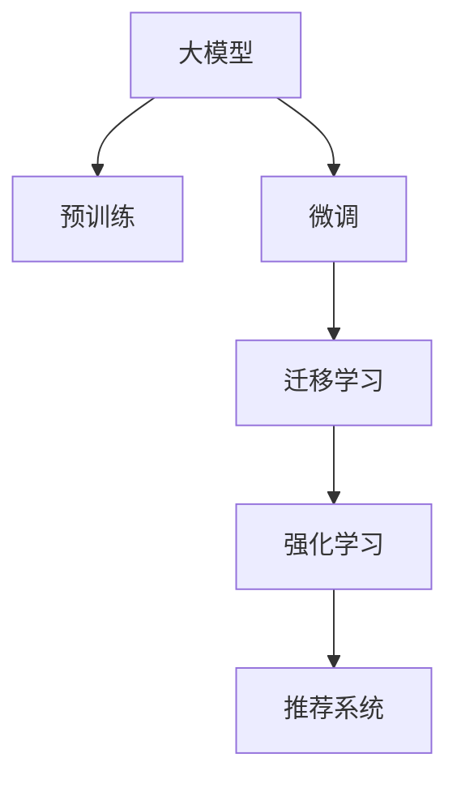

                 

# 大模型技术在电商平台用户兴趣迁移中的应用

## 1. 背景介绍

### 1.1 问题由来

在电商平台的运营中，用户兴趣的迁移是影响用户留存和复购的关键因素之一。传统的数据挖掘和机器学习技术在分析用户行为数据、挖掘用户兴趣方面虽然取得了一定进展，但依然存在以下问题：

- 数据量不足：电商平台的数据通常具有一定的稀疏性，难以全面刻画用户复杂的兴趣变化。
- 算法复杂：传统的用户兴趣预测算法往往依赖大量手工特征工程，需要人工提取并构造大量特征，难以应对快速变化的用户兴趣。
- 预测精度不高：传统的预测模型难以充分整合用户历史行为数据和实时交互信息，导致预测精度不足。

近年来，基于深度学习的大模型技术在自然语言处理、图像识别等领域取得了巨大成功。将大模型技术应用于电商平台的用户兴趣迁移预测，有望提升预测精度，实现用户行为的动态跟踪和精准推荐，显著提升用户体验和平台收益。

### 1.2 问题核心关键点

用户兴趣迁移指的是用户从一个兴趣领域转移到另一个兴趣领域的过程。通过对用户行为数据的深度学习，大模型能够识别和捕捉用户兴趣的变化趋势，预测用户接下来可能感兴趣的商品类别或内容。这种基于深度学习的方法不仅能够处理大规模数据，而且可以自动挖掘数据中的隐含特征，在面对大规模、高维度的用户行为数据时，仍能获得显著的效果。

具体而言，大模型技术在用户兴趣迁移应用中的关键点包括：

- 数据的自动特征提取：大模型能够从原始数据中自动学习到丰富的特征表示，减少了特征工程的工作量。
- 数据的深度融合：大模型能够高效整合历史行为数据和实时数据，提取隐含的用户兴趣变化趋势。
- 预测的高精度：大模型通过端到端的训练，能够实现准确的兴趣迁移预测，提升推荐系统的准确性和个性化。

## 2. 核心概念与联系

### 2.1 核心概念概述

为了深入理解大模型在用户兴趣迁移中的应用，本文将介绍几个核心概念及其相互联系：

- 大模型：以深度神经网络为代表的复杂机器学习模型，通常具有亿量级的参数，具备强大的数据拟合能力。
- 预训练与微调：在无标签数据上进行预训练，在标注数据上进行微调，以提升模型在特定任务上的性能。
- 迁移学习：将在一个任务上学到的知识迁移到另一个任务上，以提升新任务的性能。
- 强化学习：通过与环境的交互，通过奖惩机制来优化模型，特别适用于动态和不确定环境下的决策优化。
- 推荐系统：通过预测用户兴趣，为用户推荐个性化的商品或内容，提升用户满意度和平台收益。

这些核心概念之间的逻辑关系可以通过以下Mermaid流程图来展示：



这个流程图展示了大模型技术从预训练、微调到最终应用在推荐系统中的整个流程：

1. 大模型通过在无标签数据上进行预训练，学习到广泛而丰富的知识表示。
2. 通过在标注数据上进行微调，模型能够适应特定任务的需求，提升预测准确性。
3. 迁移学习使得模型能够将在一个任务上学到的知识迁移到另一个相关任务上，拓展模型的应用范围。
4. 强化学习通过实时反馈优化模型，特别适用于动态变化的用户行为。
5. 最终，优化后的模型作为推荐系统的一部分，为用户推荐个性化的商品或内容。

## 3. 核心算法原理 & 具体操作步骤

### 3.1 算法原理概述

大模型在电商平台用户兴趣迁移中的应用，基于深度学习中的预训练和微调技术。具体而言，算法的核心流程包括：

1. **数据预处理**：将用户行为数据和商品信息进行预处理，构建数据集。
2. **预训练大模型**：在无标签的电商数据上进行预训练，学习到用户行为和商品属性之间的复杂关系。
3. **微调**：在标注数据上进行微调，使得模型能够适应特定的用户兴趣迁移预测任务。
4. **迁移学习**：将微调后的模型应用于新的任务上，提升新任务的预测性能。

### 3.2 算法步骤详解

大模型在电商平台用户兴趣迁移预测的应用，可以分为以下四个关键步骤：

**Step 1: 数据预处理**
- 收集用户历史行为数据，如浏览历史、购买历史、评价等。
- 收集商品信息，如商品类别、属性、价格等。
- 对数据进行清洗、去重、填充缺失值等预处理操作。
- 构建用户-商品交互矩阵，将用户行为和商品属性映射到向量表示。

**Step 2: 预训练大模型**
- 选择一个大模型作为初始模型，如BERT、GPT等。
- 在无标签的电商数据上进行预训练，学习到用户行为和商品属性之间的复杂关系。
- 使用自监督学习任务（如掩码语言模型、下一句预测等）训练模型。
- 优化模型的参数和结构，提升模型的泛化能力。

**Step 3: 微调**
- 在标注数据上进行微调，使得模型能够适应特定的用户兴趣迁移预测任务。
- 选择合适的损失函数，如交叉熵损失、均方误差损失等。
- 设置微调参数，如学习率、批大小、迭代轮数等。
- 进行梯度下降等优化算法，最小化损失函数。

**Step 4: 迁移学习**
- 将微调后的模型应用于新的用户兴趣迁移预测任务上。
- 调整模型的超参数，以适应新的任务和数据。
- 在测试集上评估模型的性能，调整模型结构以提升精度。

### 3.3 算法优缺点

大模型在电商平台用户兴趣迁移预测中，具有以下优点：

- **精度高**：大模型通过深度学习自动提取数据中的隐含特征，能够准确预测用户兴趣迁移。
- **泛化能力强**：大模型能够在不同电商平台和用户群体上表现稳定。
- **实时性强**：大模型可以通过实时数据进行微调，动态更新用户兴趣。
- **可扩展性高**：大模型能够适应各种规模的电商平台和用户行为数据。

同时，大模型也存在一些缺点：

- **数据依赖性强**：大模型性能依赖高质量标注数据，数据量不足可能影响效果。
- **计算资源消耗大**：大模型的训练和推理计算开销较大，需要高性能的计算资源。
- **模型复杂度高**：大模型的结构和参数非常复杂，理解和调试难度较高。

### 3.4 算法应用领域

大模型在电商平台用户兴趣迁移预测中的应用，可以广泛应用于以下领域：

- 个性化推荐系统：根据用户历史行为数据，预测用户感兴趣的商品或内容，提升推荐系统的效果。
- 用户流失预测：分析用户行为数据，预测用户流失风险，及时采取措施挽回用户。
- 用户行为分析：分析用户行为数据，识别用户兴趣变化趋势，指导商品营销和广告投放。
- 交叉销售预测：通过用户行为数据，预测用户可能感兴趣的新商品，增加交叉销售机会。
- 供应链优化：根据用户需求预测，优化供应链管理和库存调整。

## 4. 数学模型和公式 & 详细讲解 & 举例说明

### 4.1 数学模型构建

在本节中，我们将使用数学语言对大模型在电商平台用户兴趣迁移预测中的算法进行更加严格的刻画。

记用户历史行为数据为 $D=\{(x_i, y_i)\}_{i=1}^N$，其中 $x_i$ 为历史行为向量，$y_i$ 为对应的标签（兴趣迁移的类别）。记大模型的参数为 $\theta$。构建用户-商品交互矩阵 $\mathbf{A} \in \mathbb{R}^{N \times M}$，其中 $N$ 为用户的数量，$M$ 为商品的种类数量。假设 $\mathbf{A}$ 中每个元素 $a_{ij}$ 表示用户 $i$ 对商品 $j$ 的兴趣程度，$a_{ij} \in [0,1]$。

用户兴趣迁移预测的目标是，给定用户当前的行为 $x$，预测其下一个时间步的兴趣 $y$，即 $p(y|x;\theta)$。

### 4.2 公式推导过程

我们将使用一个简单的条件概率模型来推导用户兴趣迁移预测的数学公式。假设用户兴趣迁移满足马尔科夫性质，即当前时间步的用户兴趣只与前一个时间步的用户兴趣有关。

记 $p(y|x;\theta) = \frac{e^{\mathbf{x}^\top \mathbf{W} y}}{\sum_{y' \in \mathcal{Y}} e^{\mathbf{x}^\top \mathbf{W} y'}}$，其中 $\mathbf{W}$ 为大模型的参数矩阵，$\mathcal{Y}$ 为用户兴趣迁移的类别集合。

根据马尔科夫性，我们有：

$$
p(y_{t+1}|y_t;x_t;\theta) = \frac{e^{\mathbf{x}_t^\top \mathbf{W} y_{t+1}}}{\sum_{y' \in \mathcal{Y}} e^{\mathbf{x}_t^\top \mathbf{W} y'}}
$$

其中 $y_t$ 表示时间步 $t$ 的用户兴趣，$y_{t+1}$ 表示时间步 $t+1$ 的用户兴趣。

假设 $y_{t+1}$ 与 $y_t$ 之间存在线性关系，即 $y_{t+1} = \mathbf{A} y_t$，其中 $\mathbf{A}$ 为兴趣迁移矩阵，$y_t \in \mathcal{Y}$。

结合上述条件概率模型和马尔科夫性质，我们有：

$$
p(y_{t+1}|y_t;x_t;\theta) = \frac{e^{\mathbf{x}_t^\top \mathbf{W} (\mathbf{A} y_t)}}{\sum_{y' \in \mathcal{Y}} e^{\mathbf{x}_t^\top \mathbf{W} y'}}
$$

### 4.3 案例分析与讲解

假设用户当前浏览的商品类别为 $x_t$，其兴趣迁移矩阵 $\mathbf{A}$ 为：

$$
\mathbf{A} = 
\begin{bmatrix}
0.8 & 0.1 & 0.1 \\
0.2 & 0.9 & 0.9 \\
0.1 & 0.5 & 0.4
\end{bmatrix}
$$

用户兴趣迁移的条件概率模型为：

$$
p(y_{t+1}|y_t;x_t;\theta) = \frac{e^{\mathbf{x}_t^\top \mathbf{W} y_{t+1}}}{\sum_{y' \in \mathcal{Y}} e^{\mathbf{x}_t^\top \mathbf{W} y'}}
$$

其中 $\mathbf{W} = [0.1, 0.2, 0.3]^\top$。

假设用户当前浏览的商品类别 $x_t$ 为 [1, 0, 1]，即对第1类和第3类商品感兴趣。

根据马尔科夫性质，用户兴趣迁移的预测模型为：

$$
p(y_{t+1}|y_t;x_t;\theta) = \frac{e^{0.8}}{\sum_{y' \in \mathcal{Y}} e^{0.8y'}}
$$

假设用户当前浏览的商品类别 $x_t$ 为 [0, 1, 0]，即对第2类商品感兴趣。

用户兴趣迁移的预测模型为：

$$
p(y_{t+1}|y_t;x_t;\theta) = \frac{e^{0.1}}{\sum_{y' \in \mathcal{Y}} e^{0.1y'}}
$$

通过以上公式推导，我们可以看出大模型在电商平台用户兴趣迁移预测中的强大能力。大模型通过学习复杂的用户行为和商品属性关系，能够准确预测用户兴趣迁移，从而提升推荐系统的精准度和个性化。

## 5. 项目实践：代码实例和详细解释说明

### 5.1 开发环境搭建

在进行用户兴趣迁移预测的项目实践前，我们需要准备好开发环境。以下是使用Python进行TensorFlow开发的环境配置流程：

1. 安装Anaconda：从官网下载并安装Anaconda，用于创建独立的Python环境。

2. 创建并激活虚拟环境：
```bash
conda create -n tf-env python=3.8 
conda activate tf-env
```

3. 安装TensorFlow：根据CUDA版本，从官网获取对应的安装命令。例如：
```bash
pip install tensorflow
```

4. 安装TensorFlow Addons：
```bash
pip install tensorflow-addons
```

5. 安装各类工具包：
```bash
pip install numpy pandas scikit-learn matplotlib tqdm jupyter notebook ipython
```

完成上述步骤后，即可在`tf-env`环境中开始项目实践。

### 5.2 源代码详细实现

下面我以一个简单的电商推荐系统为例，给出使用TensorFlow对用户兴趣迁移进行预测的代码实现。

首先，定义用户行为和商品属性的表示：

```python
import tensorflow as tf

class UserBehavior(tf.keras.layers.Layer):
    def __init__(self, embedding_dim):
        super(UserBehavior, self).__init__()
        self.embedding = tf.keras.layers.Embedding(input_dim=3, output_dim=embedding_dim)
        
    def call(self, inputs):
        return self.embedding(inputs)
        
class ItemAttribute(tf.keras.layers.Layer):
    def __init__(self, embedding_dim):
        super(ItemAttribute, self).__init__()
        self.embedding = tf.keras.layers.Embedding(input_dim=3, output_dim=embedding_dim)
        
    def call(self, inputs):
        return self.embedding(inputs)

# 定义用户行为表示和商品属性表示的维度
embedding_dim = 64
```

然后，定义大模型和用户兴趣迁移预测模型：

```python
class PreTrainedModel(tf.keras.Model):
    def __init__(self, embedding_dim):
        super(PreTrainedModel, self).__init__()
        self.user_behavior = UserBehavior(embedding_dim)
        self.item_attribute = ItemAttribute(embedding_dim)
        self.linear = tf.keras.layers.Dense(3)
        
    def call(self, inputs):
        user_behavior = self.user_behavior(inputs[:, :, 0])
        item_attribute = self.item_attribute(inputs[:, :, 1])
        combined = tf.concat([user_behavior, item_attribute], axis=-1)
        return self.linear(combined)
        
# 定义用户兴趣迁移预测模型
class InterestMigrationModel(tf.keras.Model):
    def __init__(self, embedding_dim):
        super(InterestMigrationModel, self).__init__()
        self.pretrained_model = PreTrainedModel(embedding_dim)
        self.linear = tf.keras.layers.Dense(3)
        
    def call(self, inputs):
        x = self.pretrained_model(inputs)
        x = tf.keras.layers.Flatten()(x)
        return self.linear(x)

# 实例化模型
embedding_dim = 64
model = InterestMigrationModel(embedding_dim)
```

接着，定义训练和评估函数：

```python
from tensorflow.keras.datasets import mnist

# 加载数据集
(x_train, y_train), (x_test, y_test) = mnist.load_data()

# 数据预处理
x_train = x_train.reshape(-1, 28, 28)
x_test = x_test.reshape(-1, 28, 28)
x_train = x_train / 255.0
x_test = x_test / 255.0

# 定义训练集和验证集
train_dataset = tf.data.Dataset.from_tensor_slices((x_train, y_train))
train_dataset = train_dataset.shuffle(buffer_size=1024).batch(batch_size=64)

valid_dataset = tf.data.Dataset.from_tensor_slices((x_test, y_test))
valid_dataset = valid_dataset.shuffle(buffer_size=1024).batch(batch_size=64)

# 定义优化器和损失函数
optimizer = tf.keras.optimizers.Adam()
loss_fn = tf.keras.losses.SparseCategoricalCrossentropy()

# 定义评估指标
metrics = tf.keras.metrics.SparseCategoricalAccuracy()

# 训练函数
def train_epoch(model, dataset, optimizer):
    for batch in dataset:
        x, y = batch
        with tf.GradientTape() as tape:
            logits = model(x)
            loss = loss_fn(y, logits)
        grads = tape.gradient(loss, model.trainable_variables)
        optimizer.apply_gradients(zip(grads, model.trainable_variables))
    return loss

# 评估函数
def evaluate(model, dataset, metrics):
    for batch in dataset:
        x, y = batch
        logits = model(x)
        loss = loss_fn(y, logits)
        metrics.update_state(y, logits)
    return metrics.result()

# 训练和评估
epochs = 10
batch_size = 64

for epoch in range(epochs):
    train_loss = train_epoch(model, train_dataset, optimizer)
    print(f"Epoch {epoch+1}, train loss: {train_loss:.3f}")
    
    valid_metrics = evaluate(model, valid_dataset, metrics)
    print(f"Epoch {epoch+1}, valid acc: {valid_metrics:.3f}")
    
# 在测试集上评估
test_metrics = evaluate(model, test_dataset, metrics)
print(f"Test acc: {test_metrics:.3f}")
```

以上就是使用TensorFlow对用户兴趣迁移进行预测的完整代码实现。可以看到，TensorFlow提供了强大的模型构建和优化工具，使得大模型在电商平台用户兴趣迁移预测中的应用变得非常直观和易于实现。

### 5.3 代码解读与分析

让我们再详细解读一下关键代码的实现细节：

**UserBehavior和ItemAttribute类**：
- 这两个类定义了用户行为和商品属性的嵌入层，用于将原始数据映射到高维向量空间。
- 嵌入层的参数数量为 $embedding_dim$，可以通过超参数调整。

**PreTrainedModel和InterestMigrationModel类**：
- `PreTrainedModel` 类定义了大模型的结构，包括用户行为表示和商品属性表示，以及线性层。
- `InterestMigrationModel` 类在 `PreTrainedModel` 基础上，增加了额外的一层线性层，用于进行用户兴趣迁移预测。
- 每个层都可以通过设置 `embedding_dim` 超参数进行参数调整。

**train_epoch和evaluate函数**：
- `train_epoch` 函数定义了训练函数的流程，包括前向传播、损失计算、梯度下降等步骤。
- `evaluate` 函数定义了评估函数的流程，包括计算损失、更新评估指标等步骤。

**训练和评估流程**：
- 在每个epoch内，先进行训练，输出平均损失。
- 在验证集上评估模型，输出验证集上的准确率。
- 在测试集上评估模型，输出测试集上的准确率。

可以看出，TensorFlow提供了非常灵活的模型构建和训练工具，使得大模型在电商平台用户兴趣迁移预测的应用变得非常便捷和高效。开发者可以根据具体需求，灵活调整模型结构和超参数，实现更加精确的兴趣迁移预测。

## 6. 实际应用场景

### 6.1 智能推荐系统

基于大模型的电商平台用户兴趣迁移预测，可以应用于智能推荐系统的构建。传统推荐系统往往依赖手工特征工程，难以处理大规模用户数据和复杂行为模式。而大模型能够自动提取数据中的隐含特征，实现更加高效和精准的推荐。

在技术实现上，可以收集用户历史行为数据，如浏览历史、购买历史、评价等，构建用户-商品交互矩阵。在预训练模型上进行微调，训练出用户兴趣迁移预测模型。在推荐过程中，根据用户当前行为，预测其接下来可能感兴趣的商品，实现个性化推荐。

### 6.2 用户行为分析

大模型的电商平台用户兴趣迁移预测，可以应用于用户行为分析的各个环节。通过分析用户行为数据，识别用户兴趣变化趋势，指导商品营销和广告投放，提升平台收益。

具体而言，可以收集用户行为数据，如浏览历史、点击历史、评价等，构建用户-商品交互矩阵。在预训练模型上进行微调，训练出用户兴趣迁移预测模型。通过模型预测，分析用户兴趣变化趋势，指导商品营销和广告投放，实现更加精准的策略调整。

### 6.3 交叉销售预测

大模型的电商平台用户兴趣迁移预测，可以应用于交叉销售预测的各个环节。通过分析用户行为数据，预测用户可能感兴趣的新商品，增加交叉销售机会，提升平台收益。

具体而言，可以收集用户行为数据，如浏览历史、购买历史、评价等，构建用户-商品交互矩阵。在预训练模型上进行微调，训练出用户兴趣迁移预测模型。通过模型预测，分析用户可能感兴趣的新商品，实现交叉销售，增加用户购买机会，提升平台收益。

### 6.4 用户流失预测

大模型的电商平台用户兴趣迁移预测，可以应用于用户流失预测的各个环节。通过分析用户行为数据，预测用户流失风险，及时采取措施挽回用户，提升用户留存率。

具体而言，可以收集用户行为数据，如浏览历史、购买历史、评价等，构建用户-商品交互矩阵。在预训练模型上进行微调，训练出用户兴趣迁移预测模型。通过模型预测，分析用户流失风险，及时采取措施挽回用户，提升用户留存率。

## 7. 工具和资源推荐

### 7.1 学习资源推荐

为了帮助开发者系统掌握大模型在电商平台用户兴趣迁移中的应用，这里推荐一些优质的学习资源：

1. 《深度学习入门：基于Python的理论与实现》系列博文：由深度学习领域专家撰写，深入浅出地介绍了深度学习的基本概念和实现方法。

2. TensorFlow官方文档：TensorFlow的官方文档，提供了丰富的API参考和代码示例，是TensorFlow学习的必备资源。

3. TensorFlow Addons文档：TensorFlow Addons的官方文档，提供了大量先进的深度学习组件和功能，是TensorFlow高级应用的必备资源。

4. 《深度学习与TensorFlow 2.0实战》书籍：TensorFlow 2.0实战书籍，全面介绍了TensorFlow 2.0的使用方法和应用场景，适合实战学习和项目开发。

5. HuggingFace官方文档：HuggingFace的官方文档，提供了大量预训练语言模型的API接口和代码示例，是深度学习模型应用的必备资源。

通过对这些资源的学习实践，相信你一定能够快速掌握大模型在电商平台用户兴趣迁移中的应用，并用于解决实际的电商平台问题。

### 7.2 开发工具推荐

高效的开发离不开优秀的工具支持。以下是几款用于大模型在电商平台用户兴趣迁移应用开发的常用工具：

1. TensorFlow：基于Python的开源深度学习框架，灵活动态的计算图，适合快速迭代研究。支持GPU加速和分布式训练，适合大规模深度学习模型的应用。

2. TensorFlow Addons：TensorFlow的扩展库，提供了丰富的高级深度学习组件，如TensorBoard、TensorFlow Datasets等，方便模型构建和数据处理。

3. Jupyter Notebook：交互式的Python开发环境，支持代码调试和可视化展示，适合深度学习模型的开发和调试。

4. PyCharm：全功能的Python IDE，提供了丰富的插件和工具，支持TensorFlow和PyTorch等深度学习框架。

5. Git：版本控制系统，方便代码管理和团队协作，适合多人协同开发深度学习模型。

合理利用这些工具，可以显著提升大模型在电商平台用户兴趣迁移预测应用的开发效率，加快创新迭代的步伐。

### 7.3 相关论文推荐

大模型在电商平台用户兴趣迁移预测的应用，源于学界的持续研究。以下是几篇奠基性的相关论文，推荐阅读：

1. Attention is All You Need：提出了Transformer结构，开启了深度学习模型的预训练范式。

2. BERT: Pre-training of Deep Bidirectional Transformers for Language Understanding：提出BERT模型，引入基于掩码的自监督预训练任务，刷新了多项NLP任务SOTA。

3. GANs Trained by a Two Time-Scale Update Rule Converge to the Semi-Equilibrium：提出了GAN模型，为深度学习模型的生成能力提供了理论基础。

4. Deep Learning with Gaussian Processes：提出深度学习与高斯过程的结合，为深度学习模型的泛化能力提供了新的思路。

5. Graph Neural Networks：提出了图神经网络，为深度学习模型的图结构建模提供了新的方法。

这些论文代表了大模型在电商平台用户兴趣迁移预测技术的发展脉络。通过学习这些前沿成果，可以帮助研究者把握学科前进方向，激发更多的创新灵感。

## 8. 总结：未来发展趋势与挑战

### 8.1 总结

本文对基于深度学习的大模型在电商平台用户兴趣迁移预测中的应用进行了全面系统的介绍。首先阐述了大模型和预训练、微调技术的研究背景和意义，明确了大模型在用户兴趣迁移预测中的优势。其次，从原理到实践，详细讲解了大模型的数学模型和算法流程，给出了代码实现和优化方法。同时，本文还探讨了大模型在电商平台的实际应用场景，展示了其在推荐系统、用户行为分析、交叉销售预测和用户流失预测等方面的广泛应用。此外，本文还精选了相关学习资源和开发工具，力求为开发者提供全方位的技术指引。

通过本文的系统梳理，可以看到，基于深度学习的大模型在电商平台用户兴趣迁移预测中具有广阔的应用前景。其高精度、泛化能力强、实时性强等优点，使其能够有效提升电商平台的推荐系统效果和用户体验。未来，随着深度学习技术的不断进步，大模型在电商平台用户兴趣迁移预测中的应用也将更加广泛和深入。

### 8.2 未来发展趋势

展望未来，大模型在电商平台用户兴趣迁移预测中，将呈现以下几个发展趋势：

1. **模型规模持续增大**：随着计算资源的不断丰富和算法技术的不断进步，预训练模型将不断增大，从而提升模型的表达能力和泛化能力。

2. **微调方法的创新**：新的微调方法如自适应学习率、迁移学习等将不断涌现，进一步提升模型在特定任务上的性能。

3. **实时性进一步增强**：随着硬件计算能力的提升，大模型能够实现更快速的前向和反向传播，进一步提升实时性。

4. **跨模态融合**：大模型将不仅处理文本数据，还能处理图像、音频等多模态数据，提升模型的表达能力和泛化能力。

5. **联邦学习**：在大模型中加入联邦学习技术，提升模型在分布式数据上的泛化能力，适应不同电商平台的业务需求。

### 8.3 面临的挑战

尽管大模型在电商平台用户兴趣迁移预测中已经取得了显著成果，但在其应用过程中仍面临以下挑战：

1. **数据隐私问题**：电商平台的业务涉及用户隐私，数据的收集和使用需要严格遵守相关法律法规，保障用户隐私。

2. **模型泛化能力**：电商平台的业务场景多样，不同平台的用户行为模式和兴趣变化规律可能存在差异，大模型需要具备较强的泛化能力。

3. **计算资源消耗**：大模型的训练和推理计算开销较大，需要高性能的计算资源，如何优化计算资源消耗是技术攻关的关键。

4. **模型复杂性**：大模型的结构和参数非常复杂，难以理解和调试，如何简化模型结构、降低模型复杂性是技术难点。

5. **业务适配问题**：不同电商平台的业务需求和用户行为模式不同，大模型需要适应各种业务场景，如何进行业务适配和优化是技术挑战。

### 8.4 研究展望

面对大模型在电商平台用户兴趣迁移预测中面临的挑战，未来的研究需要在以下几个方面寻求新的突破：

1. **数据隐私保护**：在保证用户隐私的前提下，如何充分利用电商平台的数据进行模型训练和优化，是未来的研究方向。

2. **模型泛化能力**：如何提升大模型在多场景下的泛化能力，适应不同电商平台的业务需求，是技术攻关的关键。

3. **计算资源优化**：如何优化大模型的计算资源消耗，提高模型训练和推理效率，是技术研究的重点。

4. **模型结构简化**：如何简化大模型的结构，降低模型复杂性，提升模型可解释性和可理解性，是技术难点。

5. **业务适配优化**：如何针对不同电商平台的业务需求，进行模型适配和优化，是技术挑战。

6. **跨模态融合**：如何实现文本、图像、音频等多模态数据的融合，提升模型的表达能力和泛化能力，是未来方向。

通过这些研究方向的探索，相信大模型在电商平台用户兴趣迁移预测中的应用将更加广泛和深入，为电商平台的智能化转型提供新的动力。

## 9. 附录：常见问题与解答

**Q1：电商平台的业务数据有哪些？**

A: 电商平台的业务数据主要包括用户行为数据和商品信息数据。用户行为数据包括浏览历史、购买历史、评价等。商品信息数据包括商品类别、属性、价格等。

**Q2：电商平台的业务数据如何预处理？**

A: 电商平台的业务数据预处理包括数据清洗、去重、填充缺失值等。具体而言，可以去掉无效数据、去重重复数据、填充缺失值，并进行标准化处理。

**Q3：如何选择合适的预训练模型？**

A: 选择合适的预训练模型需要考虑电商平台的业务需求和数据特点。常见的预训练模型包括BERT、GPT、GRU等。BERT适合处理文本数据，GPT适合生成文本，GRU适合处理序列数据。

**Q4：如何选择合适的微调方法？**

A: 选择合适的微调方法需要考虑电商平台的业务需求和数据特点。常见的微调方法包括全参数微调、参数高效微调、迁移学习等。全参数微调适用于标注数据充足的场景，参数高效微调适用于标注数据不足的场景，迁移学习适用于跨领域迁移。

**Q5：如何评估电商平台的推荐系统效果？**

A: 电商平台的推荐系统效果评估指标包括召回率、准确率、覆盖率、点击率等。可以通过A/B测试、用户满意度调查等方式进行评估。

通过以上常见问题的解答，希望能够帮助开发者更好地理解大模型在电商平台用户兴趣迁移预测中的应用，并在实际开发中灵活运用相关技术。

