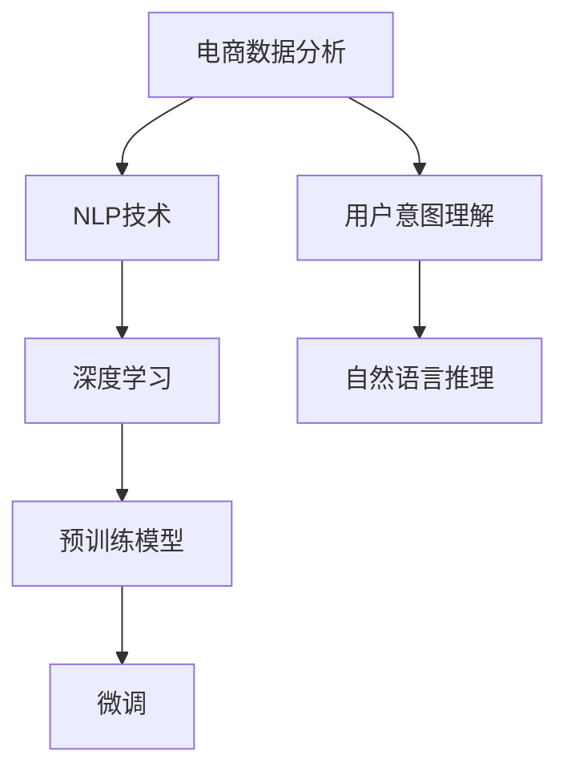
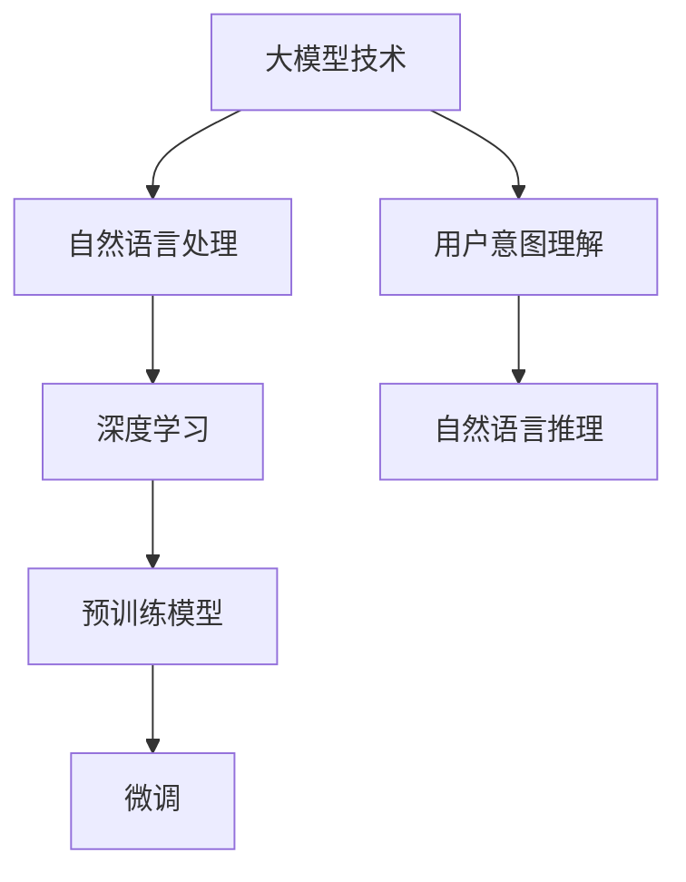

                 

# 大模型技术在电商平台用户意图理解中的应用

> 关键词：大模型技术, 用户意图理解, 自然语言处理(NLP), 深度学习, 预训练模型, 微调, 电商数据分析, 自然语言推理, 情感分析

## 1. 背景介绍

### 1.1 问题由来
电商平台作为现代消费模式的重要载体，其用户的购物行为、兴趣偏好、需求变化等信息对商家理解用户需求、优化用户体验、提升销售业绩具有重要的指导意义。如何从海量电商数据中提取出用户意图信息，成为电商平台数据分析的关键任务。

随着深度学习和大模型技术的不断进步，自然语言处理(NLP)领域取得了一系列突破性进展。大模型技术，特别是预训练语言模型，凭借其丰富的语言知识和表征能力，逐渐在电商领域的用户意图理解任务中得到了广泛应用。本文将从背景、原理、实践、应用等多个维度，深入探讨大模型技术在电商平台用户意图理解中的应用，帮助开发者更好地理解并利用大模型技术。

### 1.2 问题核心关键点
1. **用户意图理解**：指从用户输入的文字描述中解析出用户的具体需求和行为，从而指导电商平台的商品推荐、搜索排序、用户行为预测等任务。
2. **自然语言处理(NLP)**：涉及文本分类、序列标注、机器翻译、情感分析等任务，是电商数据分析的重要工具。
3. **深度学习**：利用多层神经网络结构对数据进行特征提取和模式学习，提升模型预测精度。
4. **预训练模型**：如BERT、GPT等，通过大规模语料进行预训练，获得通用语言表示。
5. **微调(Fine-tuning)**：在预训练模型的基础上，使用电商数据进行微调，优化模型在电商领域的表现。
6. **自然语言推理(NLI)**：指理解自然语言语句之间的关系，如因果、蕴含、矛盾等，是用户意图理解的重要环节。

这些核心概念之间的逻辑关系可以通过以下Mermaid流程图来展示：



这个流程图展示了大模型技术在电商平台用户意图理解中的应用流程：

1. 电商数据分析任务中，首先需要利用NLP技术对文本数据进行处理。
2. 利用深度学习模型进行特征提取和模式学习，如预训练模型。
3. 预训练模型通过大规模语料进行预训练，获得通用语言表示。
4. 在预训练模型的基础上，使用电商数据进行微调，优化模型在电商领域的表现。
5. 用户意图理解涉及自然语言推理，帮助理解用户的意图和需求。

## 2. 核心概念与联系

### 2.1 核心概念概述

为了更好地理解大模型技术在电商平台用户意图理解中的应用，本节将介绍几个密切相关的核心概念：

- **大模型技术**：指通过深度学习模型在大规模语料上进行预训练，获得通用语言表示的技术，如BERT、GPT等。
- **用户意图理解**：指从用户输入的文字描述中解析出用户的具体需求和行为，如购买意愿、兴趣偏好、评价反馈等。
- **自然语言处理(NLP)**：涉及文本分类、序列标注、机器翻译、情感分析等任务，是电商数据分析的重要工具。
- **深度学习**：利用多层神经网络结构对数据进行特征提取和模式学习，提升模型预测精度。
- **预训练模型**：如BERT、GPT等，通过大规模语料进行预训练，获得通用语言表示。
- **微调(Fine-tuning)**：在预训练模型的基础上，使用电商数据进行微调，优化模型在电商领域的表现。
- **自然语言推理(NLI)**：指理解自然语言语句之间的关系，如因果、蕴含、矛盾等，是用户意图理解的重要环节。

这些核心概念之间的逻辑关系可以通过以下Mermaid流程图来展示：



这个流程图展示了大模型技术在电商平台用户意图理解中的应用流程：

1. 大模型技术在电商平台用户意图理解中起到了基础性作用，提供了丰富的语言表示。
2. 自然语言处理任务通过深度学习模型进行特征提取和模式学习，帮助理解用户意图。
3. 预训练模型通过大规模语料进行预训练，获得通用语言表示。
4. 在预训练模型的基础上，使用电商数据进行微调，优化模型在电商领域的表现。
5. 用户意图理解涉及自然语言推理，帮助理解用户的意图和需求。

## 3. 核心算法原理 & 具体操作步骤
### 3.1 算法原理概述

大模型技术在电商平台用户意图理解中的核心原理是利用预训练模型，通过微调在电商领域进行特定任务的适配。其基本流程包括数据预处理、模型预训练、任务微调和模型评估等步骤。

### 3.2 算法步骤详解

#### 3.2.1 数据预处理
电商数据通常包含大量非结构化文本数据，如商品描述、用户评论、聊天记录等。在进行模型训练前，需要对这些文本数据进行预处理，包括文本清洗、分词、词向量化等。

- **文本清洗**：去除文本中的噪声信息，如HTML标签、特殊符号等。
- **分词**：将文本分割成单词或词组，方便后续处理。
- **词向量化**：将文本转换为向量表示，如使用词嵌入模型将单词映射为低维向量。

#### 3.2.2 模型预训练
在大模型技术中，预训练是获取通用语言表示的重要步骤。通过在大规模语料上进行预训练，模型能够学习到丰富的语言知识和表示能力，为后续任务微调奠定基础。

- **数据准备**：选择适合预训练的大规模语料，如Wikipedia、维基百科等。
- **模型选择**：选择适合的预训练模型，如BERT、GPT等。
- **预训练流程**：在预训练模型上进行自监督学习，如掩码语言模型、下一句预测等任务。

#### 3.2.3 任务微调
在预训练模型的基础上，使用电商数据进行微调，优化模型在电商领域的表现。

- **任务定义**：根据电商数据分析任务定义相应的下游任务，如文本分类、序列标注等。
- **模型适配**：在预训练模型顶部添加任务相关的全连接层或池化层，适配特定的任务输出。
- **损失函数**：选择合适的损失函数，如交叉熵、均方误差等。
- **优化器**：选择适合的优化器，如Adam、SGD等。
- **学习率**：设定合适的学习率，一般要比预训练时小1-2个数量级。
- **正则化**：应用正则化技术，如L2正则、Dropout等，避免过拟合。
- **微调流程**：在电商数据上使用微调流程，迭代更新模型参数。

#### 3.2.4 模型评估
微调完成后，需要对模型进行评估，验证其在电商领域的表现。

- **评估指标**：选择适合的评估指标，如精确率、召回率、F1值等。
- **评估流程**：在测试集上对模型进行评估，获取各项指标值。
- **模型优化**：根据评估结果，优化模型参数或训练策略，提升模型性能。

### 3.3 算法优缺点

大模型技术在电商平台用户意图理解中具有以下优点：

1. **通用性**：预训练模型在通用语料上学习到丰富的语言表示，适用于多种电商数据分析任务。
2. **泛化能力强**：大模型在预训练阶段已经学习到通用的语言知识，微调后能够很好地适应特定电商领域的语料。
3. **灵活性**：通过微调，大模型可以根据具体任务进行调整，适应不同的数据类型和任务需求。
4. **高效性**：大模型技术可以通过大规模预训练，提升模型的泛化能力和表现效果。

同时，大模型技术在电商平台用户意图理解中也存在一些缺点：

1. **资源消耗大**：预训练和微调模型需要大量的计算资源和存储空间。
2. **数据依赖高**：大模型的性能很大程度上依赖于预训练语料的质量和数量，获取高质量标注数据成本较高。
3. **模型复杂性**：大模型结构复杂，训练和推理过程需要较多的计算资源和时间。
4. **模型解释性不足**：大模型通常是黑盒系统，难以解释其内部工作机制和决策逻辑。

尽管存在这些局限性，但就目前而言，大模型技术仍然是电商平台用户意图理解的重要工具，具有广泛的应用前景。

### 3.4 算法应用领域

大模型技术在电商平台用户意图理解中的应用领域广泛，涵盖文本分类、情感分析、序列标注等多个任务。具体如下：

- **文本分类**：将电商商品描述、用户评论等文本进行分类，如商品类别、情感倾向等。
- **情感分析**：分析用户评论、反馈等文本，判断用户对商品的情感倾向。
- **序列标注**：对商品描述、用户评论中的实体进行标注，如品牌、价格、属性等。
- **用户行为预测**：预测用户的购买行为、兴趣偏好等，优化推荐系统。
- **意图识别**：识别用户的查询意图，如搜索意图、推荐意图等。

## 4. 数学模型和公式 & 详细讲解  
### 4.1 数学模型构建

在电商平台用户意图理解任务中，通常使用序列标注任务进行建模。以文本分类为例，我们可以构建如下的数学模型：

记电商文本为 $x = (x_1, x_2, ..., x_n)$，其中 $x_i$ 表示第 $i$ 个单词。目标任务为将文本分类为 $C$ 个类别，记标签为 $y$。则文本分类任务可以表示为：

$$
p(y|x; \theta) = \prod_{i=1}^n p(y_i|x_i; \theta)
$$

其中 $p(y_i|x_i; \theta)$ 表示给定单词 $x_i$，模型预测其属于第 $i$ 个类别的概率，$\theta$ 表示模型的参数。

在模型训练过程中，我们使用交叉熵损失函数进行优化：

$$
\mathcal{L} = -\frac{1}{N} \sum_{i=1}^N \sum_{j=1}^C y_{i,j} \log p_{i,j}(x_i; \theta)
$$

其中 $y_{i,j}$ 表示样本 $i$ 的类别标签，$p_{i,j}$ 表示模型预测样本 $i$ 属于第 $j$ 个类别的概率。

### 4.2 公式推导过程

以文本分类为例，我们推导模型的训练过程。假设模型的参数 $\theta$ 已经初始化，则模型对样本 $(x_i, y_i)$ 的预测概率为：

$$
p(y_i|x_i; \theta) = \frac{\exp(z_i)}{\sum_{j=1}^C \exp(z_{i,j})}
$$

其中 $z_i = W_h x_i + b_h$，$W_h$ 和 $b_h$ 表示全连接层的权重和偏置，$h$ 表示中间层的隐藏状态。

模型的预测概率可以进一步表示为：

$$
p(y_i|x_i; \theta) = \frac{\exp(W_y x_i + b_y + u_i)}{\sum_{j=1}^C \exp(W_y x_i + b_y + u_{i,j})}
$$

其中 $W_y$ 和 $b_y$ 表示分类层的权重和偏置，$u_i$ 表示中间层的输出。

模型的损失函数为交叉熵损失函数：

$$
\mathcal{L} = -\frac{1}{N} \sum_{i=1}^N \sum_{j=1}^C y_{i,j} \log p_{i,j}(x_i; \theta)
$$

通过梯度下降等优化算法，模型参数 $\theta$ 不断更新，最小化损失函数，从而提升模型的分类准确率。

### 4.3 案例分析与讲解

以下以一个简单的电商商品分类任务为例，展示大模型技术在电商平台用户意图理解中的应用。

假设我们有 $100$ 个电商商品，每个商品的描述为 $10$ 个单词。我们的目标是将其分类为 $3$ 个类别：衣服、鞋子、配饰。

首先，我们使用预训练的BERT模型作为基础模型。对商品描述进行预处理，去除停用词，进行词向量化，得到模型输入 $x$。

然后，我们在BERT模型的顶部添加全连接层和softmax层，适配文本分类任务。训练模型时，使用交叉熵损失函数，设定合适的学习率，进行迭代更新。

训练完成后，我们使用测试集对模型进行评估，获取分类准确率。模型输出每个商品的类别概率，通过阈值选取或argmax操作得到最终的分类结果。

## 5. 项目实践：代码实例和详细解释说明
### 5.1 开发环境搭建

在进行电商平台用户意图理解任务开发前，我们需要准备好开发环境。以下是使用Python进行PyTorch开发的环境配置流程：

1. 安装Anaconda：从官网下载并安装Anaconda，用于创建独立的Python环境。

2. 创建并激活虚拟环境：
```bash
conda create -n pytorch-env python=3.8 
conda activate pytorch-env
```

3. 安装PyTorch：根据CUDA版本，从官网获取对应的安装命令。例如：
```bash
conda install pytorch torchvision torchaudio cudatoolkit=11.1 -c pytorch -c conda-forge
```

4. 安装Transformers库：
```bash
pip install transformers
```

5. 安装各类工具包：
```bash
pip install numpy pandas scikit-learn matplotlib tqdm jupyter notebook ipython
```

完成上述步骤后，即可在`pytorch-env`环境中开始开发。

### 5.2 源代码详细实现

我们使用BERT模型作为基础模型，进行电商商品分类任务。具体实现步骤如下：

首先，定义数据预处理函数：

```python
from transformers import BertTokenizer
from torch.utils.data import Dataset
import torch

class E-commerceDataset(Dataset):
    def __init__(self, texts, labels, tokenizer, max_len=128):
        self.texts = texts
        self.labels = labels
        self.tokenizer = tokenizer
        self.max_len = max_len
        
    def __len__(self):
        return len(self.texts)
    
    def __getitem__(self, item):
        text = self.texts[item]
        label = self.labels[item]
        
        encoding = self.tokenizer(text, return_tensors='pt', max_length=self.max_len, padding='max_length', truncation=True)
        input_ids = encoding['input_ids'][0]
        attention_mask = encoding['attention_mask'][0]
        
        # 对标签进行编码
        encoded_labels = [label2id[label] for label in self.labels] 
        encoded_labels.extend([label2id['O']] * (self.max_len - len(encoded_labels)))
        labels = torch.tensor(encoded_labels, dtype=torch.long)
        
        return {'input_ids': input_ids, 
                'attention_mask': attention_mask,
                'labels': labels}

# 标签与id的映射
label2id = {'clothes': 0, 'shoes': 1, 'accessories': 2, 'O': 3}
id2label = {v: k for k, v in label2id.items()}

# 创建dataset
tokenizer = BertTokenizer.from_pretrained('bert-base-cased')

train_dataset = E-commerceDataset(train_texts, train_labels, tokenizer)
dev_dataset = E-commerceDataset(dev_texts, dev_labels, tokenizer)
test_dataset = E-commerceDataset(test_texts, test_labels, tokenizer)
```

然后，定义模型和优化器：

```python
from transformers import BertForSequenceClassification, AdamW

model = BertForSequenceClassification.from_pretrained('bert-base-cased', num_labels=len(label2id))

optimizer = AdamW(model.parameters(), lr=2e-5)
```

接着，定义训练和评估函数：

```python
from torch.utils.data import DataLoader
from tqdm import tqdm
from sklearn.metrics import classification_report

device = torch.device('cuda') if torch.cuda.is_available() else torch.device('cpu')
model.to(device)

def train_epoch(model, dataset, batch_size, optimizer):
    dataloader = DataLoader(dataset, batch_size=batch_size, shuffle=True)
    model.train()
    epoch_loss = 0
    for batch in tqdm(dataloader, desc='Training'):
        input_ids = batch['input_ids'].to(device)
        attention_mask = batch['attention_mask'].to(device)
        labels = batch['labels'].to(device)
        model.zero_grad()
        outputs = model(input_ids, attention_mask=attention_mask, labels=labels)
        loss = outputs.loss
        epoch_loss += loss.item()
        loss.backward()
        optimizer.step()
    return epoch_loss / len(dataloader)

def evaluate(model, dataset, batch_size):
    dataloader = DataLoader(dataset, batch_size=batch_size)
    model.eval()
    preds, labels = [], []
    with torch.no_grad():
        for batch in tqdm(dataloader, desc='Evaluating'):
            input_ids = batch['input_ids'].to(device)
            attention_mask = batch['attention_mask'].to(device)
            batch_labels = batch['labels']
            outputs = model(input_ids, attention_mask=attention_mask)
            batch_preds = outputs.logits.argmax(dim=2).to('cpu').tolist()
            batch_labels = batch_labels.to('cpu').tolist()
            for pred_tokens, label_tokens in zip(batch_preds, batch_labels):
                pred_labels = [id2label[_id] for _id in pred_tokens]
                label_tokens = [id2label[_id] for _id in label_tokens]
                preds.append(pred_labels[:len(label_tokens)])
                labels.append(label_tokens)
                
    print(classification_report(labels, preds))
```

最后，启动训练流程并在测试集上评估：

```python
epochs = 5
batch_size = 16

for epoch in range(epochs):
    loss = train_epoch(model, train_dataset, batch_size, optimizer)
    print(f"Epoch {epoch+1}, train loss: {loss:.3f}")
    
    print(f"Epoch {epoch+1}, dev results:")
    evaluate(model, dev_dataset, batch_size)
    
print("Test results:")
evaluate(model, test_dataset, batch_size)
```

以上就是使用PyTorch对BERT进行电商商品分类任务微调的完整代码实现。可以看到，得益于Transformers库的强大封装，我们可以用相对简洁的代码完成BERT模型的加载和微调。

### 5.3 代码解读与分析

让我们再详细解读一下关键代码的实现细节：

**E-commerceDataset类**：
- `__init__`方法：初始化文本、标签、分词器等关键组件。
- `__len__`方法：返回数据集的样本数量。
- `__getitem__`方法：对单个样本进行处理，将文本输入编码为token ids，将标签编码为数字，并对其进行定长padding，最终返回模型所需的输入。

**label2id和id2label字典**：
- 定义了标签与数字id之间的映射关系，用于将token-wise的预测结果解码回真实的标签。

**训练和评估函数**：
- 使用PyTorch的DataLoader对数据集进行批次化加载，供模型训练和推理使用。
- 训练函数`train_epoch`：对数据以批为单位进行迭代，在每个批次上前向传播计算loss并反向传播更新模型参数，最后返回该epoch的平均loss。
- 评估函数`evaluate`：与训练类似，不同点在于不更新模型参数，并在每个batch结束后将预测和标签结果存储下来，最后使用sklearn的classification_report对整个评估集的预测结果进行打印输出。

**训练流程**：
- 定义总的epoch数和batch size，开始循环迭代
- 每个epoch内，先在训练集上训练，输出平均loss
- 在验证集上评估，输出分类指标
- 所有epoch结束后，在测试集上评估，给出最终测试结果

可以看到，PyTorch配合Transformers库使得BERT微调的代码实现变得简洁高效。开发者可以将更多精力放在数据处理、模型改进等高层逻辑上，而不必过多关注底层的实现细节。

当然，工业级的系统实现还需考虑更多因素，如模型的保存和部署、超参数的自动搜索、更灵活的任务适配层等。但核心的微调范式基本与此类似。

## 6. 实际应用场景
### 6.1 智能推荐系统

基于大模型技术，电商平台可以构建智能推荐系统，提升用户的购物体验。智能推荐系统通过分析用户的行为数据、评价反馈、点击记录等，预测用户的兴趣偏好，推荐符合用户需求的商品。

在技术实现上，可以收集用户的浏览、点击、评价、购买等行为数据，使用预训练语言模型进行微调，学习用户行为背后的语言表示。将微调后的模型应用于实时抓取的网络文本数据，实时预测用户的推荐结果，并在用户查询时动态调整推荐列表。

### 6.2 用户行为分析

电商平台需要实时监测用户的行为变化，以便及时调整运营策略。基于大模型技术，可以对用户的行为进行实时分析和预测，发现用户兴趣和需求的变化趋势。

具体而言，可以收集用户的浏览记录、点击数据、评价反馈等，使用预训练语言模型进行微调，学习用户行为背后的语言表示。将微调后的模型应用于实时抓取的网络文本数据，实时监测用户的行为变化，一旦发现异常情况，系统便会自动预警，帮助商家及时调整运营策略。

### 6.3 个性化搜索排序

基于大模型技术，电商平台可以实现更加个性化的搜索排序功能。搜索排序任务旨在通过用户的查询输入，快速推荐符合用户需求的商品。

在技术实现上，可以使用预训练语言模型进行微调，学习用户查询背后的意图。将微调后的模型应用于实时抓取的网络文本数据，对用户的查询进行意图解析，快速推荐符合用户需求的商品，提升搜索体验。

### 6.4 未来应用展望

随着大模型技术的不断进步，电商数据分析将迎来更加智能、高效的应用。未来，大模型技术将在电商数据分析中扮演更加重要的角色，为电商商家带来更多价值。

在智慧电商领域，基于大模型技术的应用将更加广泛。通过深度学习和大模型技术，电商平台可以实现更加精准的商品推荐、个性化搜索排序、智能客服等功能，提升用户购物体验。

在大数据时代，电商数据分析将不仅仅局限于文本数据的处理和分析，更多多模态数据的融合也将成为可能。基于大模型技术，电商平台可以实现图像、语音、视频等多模态数据的整合和分析，进一步提升数据分析的深度和广度。

总之，大模型技术将在电商数据分析中发挥越来越重要的作用，为电商商家带来更多价值。随着技术的不断演进，大模型技术必将在电商领域展现更大的潜力。

## 7. 工具和资源推荐
### 7.1 学习资源推荐

为了帮助开发者系统掌握大模型技术在电商平台用户意图理解中的应用，这里推荐一些优质的学习资源：

1. 《Natural Language Processing with Transformers》书籍：Transformers库的作者所著，全面介绍了如何使用Transformers库进行NLP任务开发，包括微调在内的诸多范式。
2. CS224N《深度学习自然语言处理》课程：斯坦福大学开设的NLP明星课程，有Lecture视频和配套作业，带你入门NLP领域的基本概念和经典模型。
3. Weights & Biases：模型训练的实验跟踪工具，可以记录和可视化模型训练过程中的各项指标，方便对比和调优。
4. Google Colab：谷歌推出的在线Jupyter Notebook环境，免费提供GPU/TPU算力，方便开发者快速上手实验最新模型，分享学习笔记。

通过对这些资源的学习实践，相信你一定能够快速掌握大模型技术在电商平台用户意图理解中的应用，并用于解决实际的电商数据分析问题。

### 7.2 开发工具推荐

高效的开发离不开优秀的工具支持。以下是几款用于大模型技术在电商平台用户意图理解中的应用开发的常用工具：

1. PyTorch：基于Python的开源深度学习框架，灵活动态的计算图，适合快速迭代研究。
2. TensorFlow：由Google主导开发的开源深度学习框架，生产部署方便，适合大规模工程应用。
3. Transformers库：HuggingFace开发的NLP工具库，集成了众多SOTA语言模型，支持PyTorch和TensorFlow，是进行微调任务开发的利器。
4. Weights & Biases：模型训练的实验跟踪工具，可以记录和可视化模型训练过程中的各项指标，方便对比和调优。
5. Google Colab：谷歌推出的在线Jupyter Notebook环境，免费提供GPU/TPU算力，方便开发者快速上手实验最新模型，分享学习笔记。

合理利用这些工具，可以显著提升大模型技术在电商平台用户意图理解中的应用开发效率，加快创新迭代的步伐。

### 7.3 相关论文推荐

大模型技术在电商平台用户意图理解中的应用源于学界的持续研究。以下是几篇奠基性的相关论文，推荐阅读：

1. Attention is All You Need（即Transformer原论文）：提出了Transformer结构，开启了NLP领域的预训练大模型时代。
2. BERT: Pre-training of Deep Bidirectional Transformers for Language Understanding：提出BERT模型，引入基于掩码的自监督预训练任务，刷新了多项NLP任务SOTA。
3. Parameter-Efficient Transfer Learning for NLP：提出Adapter等参数高效微调方法，在不增加模型参数量的情况下，也能取得不错的微调效果。
4. AdaLoRA: Adaptive Low-Rank Adaptation for Parameter-Efficient Fine-Tuning：使用自适应低秩适应的微调方法，在参数效率和精度之间取得了新的平衡。
5. Premier-MT: A Multi-Task Transfer Learning Framework for Pre-training Language Models：提出Premier-MT框架，利用多任务学习的思想，提升预训练语言模型的表现。

这些论文代表了大模型技术在电商平台用户意图理解中的应用方向。通过学习这些前沿成果，可以帮助研究者把握学科前进方向，激发更多的创新灵感。

## 8. 总结：未来发展趋势与挑战

### 8.1 总结

本文对大模型技术在电商平台用户意图理解中的应用进行了全面系统的介绍。首先阐述了大模型技术在电商平台用户意图理解中的背景、原理和实践，明确了用户意图理解在电商平台数据分析中的重要意义。其次，从原理到实践，详细讲解了大模型技术在电商数据分析任务中的具体实现方法，并给出了完整的代码实现。同时，本文还广泛探讨了电商平台用户意图理解在推荐系统、行为分析、搜索排序等诸多场景中的应用，展示了大模型技术在电商领域的巨大潜力。最后，本文精选了相关学习资源、开发工具和经典论文，力求为读者提供全方位的技术指引。

通过本文的系统梳理，可以看到，大模型技术在电商平台用户意图理解中的应用，不仅能够提升电商数据分析的深度和广度，还能够为电商商家带来更多价值。大模型技术在电商平台用户意图理解中的广泛应用，必将引领电商数据分析的进步，加速电商行业数字化转型升级。

### 8.2 未来发展趋势

展望未来，大模型技术在电商平台用户意图理解中的应用将呈现以下几个发展趋势：

1. **模型规模持续增大**：随着算力成本的下降和数据规模的扩张，预训练语言模型的参数量还将持续增长。超大规模语言模型蕴含的丰富语言知识，有望支撑更加复杂多变的电商数据分析任务。
2. **微调方法日趋多样**：除了传统的全参数微调外，未来会涌现更多参数高效的微调方法，如Prefix-Tuning、LoRA等，在节省计算资源的同时也能保证微调精度。
3. **持续学习成为常态**：随着数据分布的不断变化，微调模型也需要持续学习新知识以保持性能。如何在不遗忘原有知识的同时，高效吸收新样本信息，将成为重要的研究课题。
4. **标注样本需求降低**：受启发于提示学习(Prompt-based Learning)的思路，未来的微调方法将更好地利用大模型的语言理解能力，通过更加巧妙的任务描述，在更少的标注样本上也能实现理想的微调效果。
5. **多模态微调崛起**：当前的微调主要聚焦于纯文本数据，未来会进一步拓展到图像、视频、语音等多模态数据微调。多模态信息的融合，将显著提升语言模型对现实世界的理解和建模能力。

以上趋势凸显了大模型技术在电商平台用户意图理解中的广阔前景。这些方向的探索发展，必将进一步提升电商数据分析的性能和应用范围，为电商行业带来更多价值。

### 8.3 面临的挑战

尽管大模型技术在电商平台用户意图理解中已经取得了显著成效，但在迈向更加智能化、普适化应用的过程中，它仍面临着诸多挑战：

1. **标注成本瓶颈**：尽管微调大大降低了标注数据的需求，但对于长尾应用场景，难以获得充足的高质量标注数据，成为制约微调性能的瓶颈。如何进一步降低微调对标注样本的依赖，将是一大难题。
2. **模型鲁棒性不足**：当前微调模型面对域外数据时，泛化性能往往大打折扣。对于测试样本的微小扰动，微调模型的预测也容易发生波动。如何提高微调模型的鲁棒性，避免灾难性遗忘，还需要更多理论和实践的积累。
3. **推理效率有待提高**：大规模语言模型虽然精度高，但在实际部署时往往面临推理速度慢、内存占用大等效率问题。如何在保证性能的同时，简化模型结构，提升推理速度，优化资源占用，将是重要的优化方向。
4. **可解释性亟需加强**：当前微调模型更像是"黑盒"系统，难以解释其内部工作机制和决策逻辑。对于医疗、金融等高风险应用，算法的可解释性和可审计性尤为重要。如何赋予微调模型更强的可解释性，将是亟待攻克的难题。
5. **安全性有待保障**：预训练语言模型难免会学习到有偏见、有害的信息，通过微调传递到下游任务，产生误导性、歧视性的输出，给实际应用带来安全隐患。如何从数据和算法层面消除模型偏见，避免恶意用途，确保输出的安全性，也将是重要的研究课题。

尽管存在这些局限性，但就目前而言，大模型技术仍然是电商平台用户意图理解的重要工具，具有广泛的应用前景。

### 8.4 研究展望

面对大模型技术在电商平台用户意图理解中面临的挑战，未来的研究需要在以下几个方面寻求新的突破：

1. **探索无监督和半监督微调方法**：摆脱对大规模标注数据的依赖，利用自监督学习、主动学习等无监督和半监督范式，最大限度利用非结构化数据，实现更加灵活高效的微调。
2. **研究参数高效和计算高效的微调范式**：开发更加参数高效的微调方法，在固定大部分预训练参数的同时，只更新极少量的任务相关参数。同时优化微调模型的计算图，减少前向传播和反向传播的资源消耗，实现更加轻量级、实时性的部署。
3. **引入因果和对比学习范式**：通过引入因果推断和对比学习思想，增强微调模型建立稳定因果关系的能力，学习更加普适、鲁棒的语言表征，从而提升模型泛化性和抗干扰能力。
4. **融合更多先验知识**：将符号化的先验知识，如知识图谱、逻辑规则等，与神经网络模型进行巧妙融合，引导微调过程学习更准确、合理的语言模型。同时加强不同模态数据的整合，实现视觉、语音等多模态信息与文本信息的协同建模。
5. **结合因果分析和博弈论工具**：将因果分析方法引入微调模型，识别出模型决策的关键特征，增强输出解释的因果性和逻辑性。借助博弈论工具刻画人机交互过程，主动探索并规避模型的脆弱点，提高系统稳定性。
6. **纳入伦理道德约束**：在模型训练目标中引入伦理导向的评估指标，过滤和惩罚有偏见、有害的输出倾向。同时加强人工干预和审核，建立模型行为的监管机制，确保输出符合人类价值观和伦理道德。

这些研究方向的探索，必将引领大模型技术在电商平台用户意图理解中的应用走向更高的台阶，为构建安全、可靠、可解释、可控的智能系统铺平道路。面向未来，大模型技术在电商平台用户意图理解中还需要与其他人工智能技术进行更深入的融合，如知识表示、因果推理、强化学习等，多路径协同发力，共同推动自然语言理解和智能交互系统的进步。只有勇于创新、敢于突破，才能不断拓展语言模型的边界，让智能技术更好地造福人类社会。

## 9. 附录：常见问题与解答

**Q1：大模型技术在电商平台用户意图理解中是否只适用于文本数据？**

A: 虽然文本数据是大模型技术的主要处理对象，但大模型技术也可以处理其他类型的多模态数据，如图像、语音、视频等。在电商平台用户意图理解中，除了文本数据，还可以引入图像、语音等多模态数据，实现更全面的用户行为分析。

**Q2：大模型技术在电商平台用户意图理解中是否需要大量的标注数据？**

A: 在电商数据分析中，标注数据的获取成本较高，难以获得充足的高质量标注数据。为此，可以采用数据增强、无监督学习、半监督学习等方法，进一步降低对标注数据的依赖，提升模型的泛化能力。

**Q3：大模型技术在电商平台用户意图理解中是否容易过拟合？**

A: 大模型技术在电商平台用户意图理解中，由于模型复杂度较高，容易发生过拟合。为避免过拟合，可以采用正则化技术、Dropout、Early Stopping等方法，提高模型的泛化能力。

**Q4：大模型技术在电商平台用户意图理解中是否需要高性能的硬件设备？**

A: 大模型技术在电商平台用户意图理解中，需要大量的计算资源和存储空间，因此需要高性能的硬件设备，如GPU、TPU等。选择合适的硬件设备，可以有效提升模型的训练和推理速度。

**Q5：大模型技术在电商平台用户意图理解中是否容易受到噪声影响？**

A: 大模型技术在电商平台用户意图理解中，可能会受到噪声数据的影响。为提高模型的鲁棒性，可以采用对抗训练、噪声注入等方法，增强模型对噪声数据的抗干扰能力。

总之，大模型技术在电商平台用户意图理解中的应用，能够显著提升电商数据分析的深度和广度，为电商商家带来更多价值。尽管面临一些挑战，但通过不断的技术创新和优化，大模型技术必将在电商领域展现出更大的潜力。未来，随着技术的不断演进，大模型技术必将在电商平台用户意图理解中发挥更加重要的作用，推动电商行业数字化转型升级。

---

作者：禅与计算机程序设计艺术 / Zen and the Art of Computer Programming

