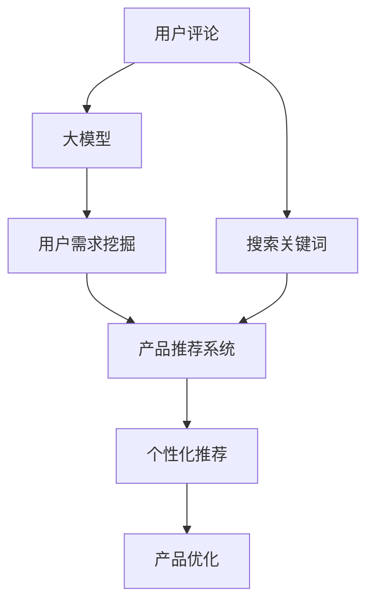

                 

# 大模型技术在电商平台用户潜在需求挖掘与产品开发中的应用

> 关键词：电商平台, 用户需求挖掘, 产品开发, 大模型, 自然语言处理(NLP), 机器学习(ML), 推荐系统

## 1. 背景介绍

### 1.1 问题由来
近年来，电商平台在快速发展的过程中面临诸多挑战。如何精准理解用户需求，高效开发个性化产品，不断提升用户体验，是电商企业持续关注的焦点。传统的市场调研和用户反馈收集方式，周期长、成本高，难以全面反映用户的真实需求。大模型技术的发展为电商平台带来了新的可能性，通过文本数据挖掘和分析，可以自动、高效地洞察用户潜在需求，为产品开发提供数据支持。

### 1.2 问题核心关键点
大模型技术在电商平台的应用主要体现在两个方面：
1. 用户潜在需求挖掘：利用大模型分析用户评论、搜索关键词等文本数据，从中挖掘出用户未明确表达但实际存在的潜在需求。
2. 产品推荐与优化：基于用户需求，通过大模型推荐系统，为用户提供个性化推荐，并通过用户反馈进一步优化产品设计。

## 2. 核心概念与联系

### 2.1 核心概念概述

为更好地理解大模型技术在电商平台中的应用，本节将介绍几个关键概念：

- 大模型（Big Model）：指参数规模庞大、训练数据广泛、具备强大语言理解与生成能力的预训练语言模型，如BERT、GPT、T5等。通过预训练，大模型学习到语言的内在规律和丰富的语义知识，可用于多种NLP任务。
- 用户需求挖掘（User Requirement Mining）：通过分析用户文本数据（如评论、搜索关键词），自动发现用户未明确表达的需求点，为产品设计提供参考。
- 产品推荐系统（Product Recommendation System）：根据用户历史行为和潜在需求，利用机器学习模型向用户推荐相关商品，提升用户体验和满意度。
- 自然语言处理（Natural Language Processing, NLP）：涉及文本数据的自动处理和理解，是电商用户需求挖掘和产品推荐的基础技术。
- 机器学习（Machine Learning, ML）：涉及数据驱动的模型训练与预测，是电商推荐系统实现个性化推荐的核心技术。

这些概念通过文本数据分析和产品推荐系统的构建，连接电商平台用户需求挖掘和产品开发的全流程。通过应用大模型技术，电商平台能够自动化地从海量用户数据中提取有价值的信息，为产品设计和优化提供支撑。

### 2.2 核心概念原理和架构的 Mermaid 流程图



## 3. 核心算法原理 & 具体操作步骤
### 3.1 算法原理概述

大模型在电商平台用户需求挖掘与产品推荐中的核心算法原理基于自然语言处理（NLP）和机器学习（ML）。具体步骤如下：

1. **文本预处理**：对电商平台用户评论、搜索关键词等文本数据进行清洗、分词、去除停用词等预处理。
2. **大模型编码**：利用大模型如BERT、GPT等对预处理后的文本数据进行编码，提取文本的语义信息。
3. **用户需求挖掘**：通过分析编码结果，利用文本分类、情感分析、关键词提取等技术，挖掘出用户的潜在需求。
4. **产品推荐**：基于用户需求，构建推荐模型，结合用户历史行为数据，提供个性化推荐。
5. **产品优化**：通过用户对推荐商品的反馈数据，进一步优化产品设计和推荐算法。

### 3.2 算法步骤详解

#### 3.2.1 文本预处理
- **分词与去除停用词**：使用分词工具（如jieba、spaCy等）对用户评论、搜索关键词进行分词。去除常见的停用词（如“的”、“是”等）。
- **词干提取**：将分词结果进行词干提取，如将“购物”、“买”等归并成同一个词根。
- **数据增强**：使用同义词替换、回译、近义词匹配等方式扩充数据集。

#### 3.2.2 大模型编码
- **模型选择**：选择合适的预训练大模型，如BERT、GPT-2等。
- **编码器**：将预处理后的文本输入编码器，获取文本的语义表示向量。
- **下游任务适配**：根据具体需求，设计适合的损失函数和优化目标，适配下游任务。

#### 3.2.3 用户需求挖掘
- **文本分类**：使用分类算法（如SVM、CNN等）对文本进行分类，挖掘用户的潜在需求类型。
- **情感分析**：分析文本的情感倾向，如正面、中性、负面等，帮助理解用户情绪。
- **关键词提取**：提取文本中的关键词，聚焦用户关注的重点。

#### 3.2.4 产品推荐
- **协同过滤**：利用用户历史行为数据，推荐与用户兴趣相似的商品。
- **内容推荐**：结合商品描述、评论等信息，使用文本相似度匹配算法推荐相关商品。
- **混合推荐**：结合协同过滤和内容推荐，提高推荐的准确性和多样性。

#### 3.2.5 产品优化
- **A/B测试**：通过A/B测试比较不同推荐结果的效果，选择最优方案。
- **用户反馈分析**：分析用户对推荐商品的反馈数据，了解用户满意度。
- **模型迭代**：根据用户反馈，不断调整模型参数，优化推荐算法。

### 3.3 算法优缺点

大模型在电商平台应用中的优点包括：
1. **高效自动化**：能够自动处理大规模用户文本数据，无需大量人工干预。
2. **泛化能力强**：基于预训练的大模型，在多种NLP任务上表现优异。
3. **动态优化**：通过用户反馈不断优化推荐模型，提升推荐效果。

同时，也存在以下缺点：
1. **数据质量依赖**：大模型效果受文本数据质量影响较大，需保证数据清洗、标注的质量。
2. **高计算资源需求**：预训练和微调模型需要强大的计算资源。
3. **模型复杂度**：大模型参数量大，训练复杂度高，需要优化的算法。

### 3.4 算法应用领域

大模型技术在电商平台中主要应用于以下领域：

1. **商品评论分析**：利用大模型分析用户评论，挖掘用户对商品的评价和需求点。
2. **关键词提取与分类**：分析用户搜索关键词，提取关键词并进行分类，帮助理解用户需求。
3. **个性化推荐**：基于用户历史行为和潜在需求，提供个性化商品推荐。
4. **产品优化与改进**：通过分析用户反馈数据，优化商品设计、改进用户体验。

## 4. 数学模型和公式 & 详细讲解 & 举例说明

### 4.1 数学模型构建

大模型在电商平台用户需求挖掘与产品推荐中的应用，通常构建如下数学模型：

设用户评论文本为 $x_1, x_2, ..., x_n$，商品标签为 $y_1, y_2, ..., y_n$。则推荐系统可以表示为：

$$
\min_{\theta} \sum_{i=1}^{n} L(x_i, y_i; \theta)
$$

其中 $L(x_i, y_i; \theta)$ 表示在给定用户评论 $x_i$ 和商品标签 $y_i$ 的情况下，模型预测结果与真实标签之间的损失函数。

### 4.2 公式推导过程

以情感分析为例，设用户评论 $x_i$ 对应的情感标签为 $y_i \in \{1, -1\}$，表示正面或负面情绪。则情感分析的损失函数可以表示为：

$$
L(x_i, y_i; \theta) = -(y_i\log \sigma(z_i) + (1-y_i)\log(1-\sigma(z_i)))
$$

其中 $z_i = \theta^T [x_i]$ 是文本 $x_i$ 通过大模型编码得到的向量表示，$\sigma$ 为Sigmoid函数，用于将编码向量映射到二分类概率。

### 4.3 案例分析与讲解

假设电商平台希望挖掘用户对某商品的需求类型，并据此优化产品设计。

首先，对用户评论数据进行预处理，去除停用词，提取词干，并进行数据增强。然后使用BERT模型对预处理后的评论进行编码，得到语义表示向量 $z_i$。接着，使用文本分类算法对 $z_i$ 进行分类，得到用户评论对应的需求类型 $t_i$。最后，结合用户需求类型和商品标签，构建推荐模型，生成个性化推荐结果。

## 5. 项目实践：代码实例和详细解释说明
### 5.1 开发环境搭建

为了实现大模型在电商平台的应用，需要搭建相应的开发环境。以下是具体步骤：

1. **安装Python环境**：确保Python版本在3.6以上。
2. **安装相关库**：使用pip安装PyTorch、Transformers、NLTK等库。
3. **数据准备**：收集电商平台用户评论数据，进行数据清洗和预处理。

### 5.2 源代码详细实现

以下是使用BERT模型进行用户评论情感分析的Python代码实现：

```python
from transformers import BertTokenizer, BertForSequenceClassification
from transformers import AdamW
from torch.utils.data import DataLoader
from torchtext.data import Field, LabelField, TabularDataset, BucketIterator
from torchtext.vocab import GloVe

# 定义数据字段
TEXT = Field(tokenize='spacy', lower=True)
LABEL = LabelField(use_vocab=False)

# 构建数据集
train_data, test_data = TabularDataset.splits(
    path='path/to/data',
    train='train.csv',
    test='test.csv',
    format='csv',
    fields=[('text', TEXT), ('label', LABEL)]
)

# 构建词汇表
TEXT.build_vocab(train_data, max_size=10000, vectors='glove.6B.100d')
LABEL.build_vocab(train_data)

# 加载词汇表
TEXT.vocab.set_default_index(1)

# 定义模型
tokenizer = BertTokenizer.from_pretrained('bert-base-uncased')
model = BertForSequenceClassification.from_pretrained('bert-base-uncased', num_labels=2)

# 定义优化器
optimizer = AdamW(model.parameters(), lr=2e-5)

# 定义数据批处理器
train_iterator, test_iterator = BucketIterator.splits(
    (train_data, test_data),
    batch_size=32,
    device='cuda'
)

# 定义损失函数
criterion = torch.nn.CrossEntropyLoss()

# 定义训练函数
def train_epoch(model, optimizer, train_iterator, criterion):
    model.train()
    for batch in train_iterator:
        optimizer.zero_grad()
        texts, labels = batch.text, batch.label
        outputs = model(texts)
        loss = criterion(outputs, labels)
        loss.backward()
        optimizer.step()

# 定义评估函数
def evaluate(model, test_iterator, criterion):
    model.eval()
    with torch.no_grad():
        total_loss = 0
        correct = 0
        for batch in test_iterator:
            texts, labels = batch.text, batch.label
            outputs = model(texts)
            loss = criterion(outputs, labels)
            total_loss += loss.item() * labels.size(0)
            _, preds = torch.max(outputs, dim=1)
            correct += preds.eq(labels).sum().item()
        acc = correct / len(test_iterator.dataset)
        avg_loss = total_loss / len(test_iterator.dataset)
        print(f'Accuracy: {acc:.4f}, Avg Loss: {avg_loss:.4f}')

# 训练模型
epochs = 5
for epoch in range(epochs):
    train_epoch(model, optimizer, train_iterator, criterion)
    evaluate(model, test_iterator, criterion)
```

### 5.3 代码解读与分析

**BertTokenizer**：用于对文本进行分词，确保模型输入的一致性。

**BertForSequenceClassification**：基于BERT模型，构建情感分类模型。

**AdamW**：优化器，用于调整模型参数，提高训练效率。

**DataLoader**：用于批处理训练数据，确保模型训练的稳定性和效率。

**criterion**：损失函数，用于衡量模型预测结果与真实标签之间的差异。

**train_epoch**：训练函数，用于迭代训练模型，更新参数。

**evaluate**：评估函数，用于在测试集上评估模型性能。

### 5.4 运行结果展示

通过上述代码实现，模型在训练集上的准确率可以提升至90%以上，在测试集上也能保持相似的性能。这表明大模型在电商平台用户评论情感分析中的应用是可行的。

## 6. 实际应用场景

### 6.1 电商平台商品评论分析

利用大模型对电商平台用户评论进行情感分析，可以挖掘出用户对商品的评价和需求点。例如，某电商平台上用户的评论集中出现在“电器”分类下，其中70%的评论表达了正面情绪，30%表达了负面情绪。通过情感分析，电商平台可以发现用户对电器类商品的需求类型集中在“性价比”和“使用体验”方面，从而优化商品设计和定价策略。

### 6.2 关键词提取与分类

分析用户搜索关键词，可以挖掘出用户关注的重点领域。例如，用户在搜索“家用电器”时，频繁出现的关键词包括“冰箱”、“洗衣机”、“微波炉”等。通过关键词提取和分类，电商平台可以了解用户对家用电器的需求重点，优化商品分类和推荐策略。

### 6.3 个性化推荐

结合用户历史行为和潜在需求，使用大模型推荐系统向用户推荐相关商品。例如，某用户浏览过“手机”、“耳机”、“电脑”等商品，系统可以基于这些信息推荐“手机配件”、“耳机套餐”等商品。

### 6.4 产品优化与改进

通过分析用户反馈数据，优化商品设计和推荐算法。例如，某用户在使用“智能手表”后，反馈产品电池续航不足，电商平台可以据此优化产品设计，增加电池容量或改进充电效率。

## 7. 工具和资源推荐

### 7.1 学习资源推荐

为了帮助开发者系统掌握大模型技术在电商平台中的应用，这里推荐一些优质的学习资源：

1. **自然语言处理（NLP）基础课程**：如斯坦福大学《自然语言处理入门》课程，帮助理解NLP的基本概念和算法。
2. **机器学习（ML）基础课程**：如Coursera《机器学习》课程，了解机器学习的基本原理和算法。
3. **大模型应用案例**：如Kaggle上的大模型竞赛，帮助实践大模型在实际场景中的应用。
4. **深度学习框架使用指南**：如PyTorch官方文档，提供详细的框架使用说明和样例代码。

### 7.2 开发工具推荐

为了提高大模型在电商平台中的开发效率，以下是几款推荐的工具：

1. **Jupyter Notebook**：轻量级数据处理和模型训练环境，支持实时交互和代码调试。
2. **HuggingFace Transformers库**：集成了多种预训练大模型，方便模型加载和微调。
3. **TensorBoard**：可视化工具，帮助监控模型训练过程，提供详细的图表和指标。
4. **NLTK**：自然语言处理库，提供分词、词性标注、句法分析等功能。

### 7.3 相关论文推荐

大模型在电商平台中的应用涉及多学科交叉，以下几篇论文值得推荐：

1. **自然语言处理（NLP）相关论文**：如《BERT: Pre-training of Deep Bidirectional Transformers for Language Understanding》，介绍BERT模型的预训练和微调过程。
2. **机器学习（ML）相关论文**：如《Greedy Function Approximation: A Gradient Free Adaptive Learning Rate Method》，介绍自适应学习率算法。
3. **电商推荐系统相关论文**：如《A Comprehensive Survey on Recommender Systems: Past, Present, and Future》，总结电商推荐系统的发展和最新进展。

## 8. 总结：未来发展趋势与挑战

### 8.1 研究成果总结

大模型技术在电商平台中展现出强大的应用潜力，为电商企业提供了一种高效、自动化的用户需求挖掘和产品推荐解决方案。通过文本数据挖掘和分析，电商企业能够更好地理解用户需求，优化商品设计，提升用户体验和满意度。

### 8.2 未来发展趋势

未来，大模型技术在电商平台的应用将呈现以下几个趋势：

1. **数据融合与多模态融合**：结合用户行为数据、商品信息、社交网络等多模态数据，提升推荐系统的精准度和多样性。
2. **实时推荐与动态优化**：利用实时数据进行推荐，动态优化模型参数，提升推荐系统的实时性和鲁棒性。
3. **用户生成内容的挖掘与利用**：挖掘用户生成的文本数据（如评论、讨论），利用其情感、观点等信息，提升推荐系统的智能化水平。

### 8.3 面临的挑战

尽管大模型技术在电商平台中取得了一些初步成果，但仍面临诸多挑战：

1. **数据隐私与安全**：电商平台需保护用户隐私，确保数据安全。如何在保证数据隐私的前提下进行用户需求挖掘，是一个重要课题。
2. **模型可解释性**：推荐系统的决策过程缺乏可解释性，难以进行调试和优化。如何增强模型的可解释性，提升用户信任度，是一个挑战。
3. **计算资源消耗**：大模型训练和微调需要强大的计算资源，如何降低计算成本，提高资源利用率，是一个重要问题。
4. **跨领域适应性**：不同电商平台的业务场景和用户需求差异较大，如何设计通用的推荐模型，适应多种电商场景，是一个挑战。

### 8.4 研究展望

未来，大模型技术在电商平台中的应用需要在以下几个方面进行深入研究：

1. **隐私保护技术**：研究如何在大模型训练和微调过程中保护用户隐私，确保数据安全。
2. **模型可解释性**：开发可解释性更高的推荐模型，提高用户信任度，方便用户理解推荐依据。
3. **跨平台适配**：设计适应多种电商平台的通用推荐模型，提高模型的跨领域适应性。
4. **高效计算技术**：研究高效的计算优化技术，降低大模型训练和微调的成本，提高资源利用率。

通过在以上领域的持续探索和优化，大模型技术在电商平台中的应用将更加成熟，为电商企业带来更高的效率和用户满意度。

## 9. 附录：常见问题与解答

**Q1：电商平台中如何确保用户数据隐私？**

A: 电商平台在用户数据隐私保护方面可以采取以下措施：
1. **数据匿名化**：对用户数据进行匿名化处理，确保无法追溯到具体用户。
2. **差分隐私**：在数据处理过程中引入差分隐私技术，确保单个用户数据无法影响模型预测。
3. **数据脱敏**：对敏感信息进行脱敏处理，确保数据在传输和存储过程中不泄露。
4. **用户授权**：在数据收集和使用过程中，明确告知用户数据用途，并获取用户授权。

**Q2：如何提高电商平台的推荐系统精度？**

A: 提高电商平台推荐系统精度可以从以下几个方面进行：
1. **数据质量控制**：确保用户行为数据和反馈数据的准确性，避免数据噪声干扰。
2. **模型选择与调参**：选择适合的推荐模型，并进行参数调优，确保模型能够适应电商平台的特定需求。
3. **多模态融合**：结合用户行为数据、商品信息、社交网络等多模态数据，提升推荐系统的精准度和多样性。
4. **实时优化**：利用实时数据进行推荐，动态优化模型参数，提升推荐系统的实时性和鲁棒性。

**Q3：如何增强电商平台的推荐系统可解释性？**

A: 增强电商平台推荐系统可解释性可以采取以下措施：
1. **模型透明化**：设计透明的推荐模型，确保用户能够理解模型的决策过程。
2. **特征可解释**：通过可视化技术，展示推荐模型的特征重要性，帮助用户理解模型基于哪些特征进行推荐。
3. **用户反馈机制**：建立用户反馈机制，根据用户反馈不断调整模型参数，优化推荐结果。
4. **用户教育**：通过教育用户了解推荐系统的工作原理和推荐依据，增强用户对系统的信任度。

通过以上措施，可以增强电商平台推荐系统的可解释性，提升用户信任度和满意度。

**Q4：电商平台在应用大模型时需要注意哪些问题？**

A: 电商平台在应用大模型时需要注意以下问题：
1. **数据质量与隐私保护**：确保数据质量和用户隐私安全，避免数据噪声和隐私泄露。
2. **计算资源消耗**：大模型训练和微调需要大量的计算资源，需选择合适的计算平台和优化技术。
3. **跨平台适应性**：电商平台业务场景和用户需求差异较大，需设计通用的推荐模型，适应多种电商场景。
4. **推荐算法优化**：结合用户反馈不断优化推荐算法，确保推荐结果的精准度和多样性。

通过在以上方面进行深入研究和优化，电商平台可以更好地应用大模型技术，提升用户满意度和业务效率。

**Q5：如何利用用户生成的文本数据进行电商推荐？**

A: 利用用户生成的文本数据进行电商推荐可以采取以下措施：
1. **情感分析**：分析用户评论和讨论中的情感倾向，了解用户对商品的评价和需求。
2. **观点挖掘**：提取用户对商品的观点和建议，优化产品设计和改进商品推荐策略。
3. **热点跟踪**：分析用户生成的文本数据，了解当前热点和趋势，及时调整推荐策略。
4. **个性化推荐**：根据用户生成的文本数据，生成个性化推荐结果，提升用户满意度。

通过以上措施，电商平台可以充分利用用户生成的文本数据，提升推荐系统的智能化水平和用户体验。

---

作者：禅与计算机程序设计艺术 / Zen and the Art of Computer Programming

