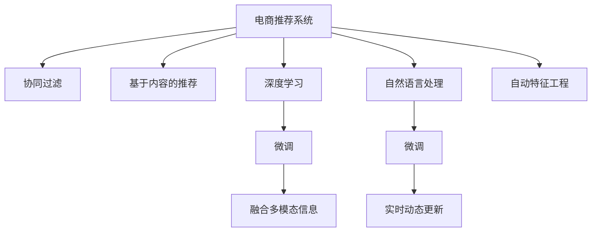

                 

# 大模型技术如何革新电商个性化推荐

> 关键词：大模型技术,电商推荐系统,个性化推荐,协同过滤,基于内容的推荐,深度学习,自然语言处理,用户行为分析,实时推荐

## 1. 背景介绍

### 1.1 问题由来

随着互联网技术的不断进步和电子商务的飞速发展，线上购物已经成为越来越多用户的选择。电商平台依靠算法推荐系统来提升用户体验和销售额，实现业务增长。然而，传统的推荐系统面临着一些挑战：

- 数据稀疏性：电商平台往往只能获取用户有限的购买和浏览行为数据，推荐系统在处理长尾商品时难以提供精准推荐。
- 冷启动问题：新用户或新商品没有足够的行为数据，推荐系统无法准确识别其兴趣。
- 动态变化：用户兴趣和商品属性随时间变化，推荐系统需要实时更新推荐策略。

面对这些挑战，电商平台急需寻找新的推荐方法，以提供更加个性化和精准的推荐服务。大模型技术的出现，为电商推荐系统的革新带来了新的契机。

### 1.2 问题核心关键点

大模型技术以其强大的数据处理能力和学习能力，能够更好地理解用户行为和商品特征，从而在电商推荐系统中发挥巨大潜力。其主要关键点包括：

- 预训练模型：通过在大规模无标签数据上进行的预训练，大模型能够学习到丰富的通用知识。
- 自适应推荐：利用微调等技术，使大模型能够针对不同用户和商品生成个性化的推荐结果。
- 融合多模态信息：大模型可以融合文本、图像、视频等多种信息，提高推荐质量。
- 实时动态更新：大模型能够实时处理用户行为数据，动态调整推荐策略。
- 自动特征工程：通过自动化的特征提取和处理，减少手工工程的工作量。

这些关键点使得大模型在电商推荐系统中具备显著优势，能够提供比传统推荐系统更精准、更具个性化和实时的推荐服务。

## 2. 核心概念与联系

### 2.1 核心概念概述

为更好地理解大模型在电商推荐系统中的应用，本节将介绍几个核心概念：

- 电商推荐系统(Recommendation System for E-commerce)：利用算法为用户推荐商品或服务的系统。传统的推荐方法包括协同过滤、基于内容的推荐等，在大数据时代逐渐向深度学习和强化学习等高级技术演进。
- 大模型(Large Model)：以Transformer为代表的大规模预训练模型。通过在无监督学习任务上预训练，大模型学习到丰富的语言或视觉表示，具备强大的特征提取和模式识别能力。
- 微调(Fine-tuning)：将预训练模型在大规模无标签数据上训练好的权重，通过有监督学习任务进行微调，使其适应特定领域的应用场景。
- 协同过滤(Collaborative Filtering)：基于用户或商品的相似性，推荐系统中用户或商品的相似商品。通过分析用户的历史行为数据，预测用户未来可能感兴趣的商品。
- 基于内容的推荐(Content-based Recommendation)：通过分析商品的属性特征，为用户推荐属性相似的商品。需要预先提取商品的特征表示，存储在特征库中。
- 深度学习(Deep Learning)：一种通过多层神经网络结构进行复杂数据处理和模式学习的方法。在推荐系统中，深度学习模型通过多层网络结构，能够学习到用户行为和商品属性之间的复杂关联。
- 自然语言处理(Natural Language Processing, NLP)：通过文本分析，提取文本特征，为用户提供更加个性化的推荐服务。NLP技术在大模型推荐系统中广泛应用。
- 用户行为分析(Usage Analytics)：通过分析用户的购买、浏览、评价等行为数据，挖掘用户的兴趣和需求，提供更加精准的推荐。

这些核心概念之间的逻辑关系可以通过以下Mermaid流程图来展示：



这个流程图展示了大模型技术在电商推荐系统中的应用框架：

1. 电商推荐系统利用协同过滤、基于内容的推荐等传统方法。
2. 引入大模型技术，通过预训练和微调，提高推荐系统的精度和个性化程度。
3. 利用深度学习和自然语言处理技术，融合多模态信息，增强推荐效果。
4. 结合实时动态更新和自动特征工程，提升推荐系统的响应速度和效率。

这些核心概念共同构成了电商推荐系统的大模型应用范式，使得推荐系统能够更好地理解和满足用户需求。

## 3. 核心算法原理 & 具体操作步骤
### 3.1 算法原理概述

基于大模型技术的电商推荐系统，其核心原理是通过预训练和微调，学习用户行为和商品属性之间的复杂关联，从而生成个性化推荐。

具体而言，假设电商平台有 $N$ 个用户 $U=\{u_1, u_2, ..., u_N\}$ 和 $M$ 个商品 $I=\{i_1, i_2, ..., i_M\}$，用户对商品的评分矩阵为 $R \in \mathbb{R}^{N \times M}$。推荐系统的目标是通过模型 $P$ 预测用户对商品的评分，从而生成推荐结果。

### 3.2 算法步骤详解

基于大模型技术的电商推荐系统一般包括以下几个关键步骤：

**Step 1: 准备数据集**

- 收集电商平台的用户行为数据，包括点击、购买、评价、收藏等行为。
- 清洗数据，去除重复和异常数据，处理缺失值和噪声。
- 将用户行为数据转化为用户-商品评分矩阵 $R$。

**Step 2: 选择预训练模型**

- 选择合适的预训练模型，如BERT、GPT等。
- 使用预训练模型对用户行为数据进行预训练，学习到用户行为和商品属性之间的潜在关联。

**Step 3: 添加任务适配层**

- 根据电商推荐系统的任务需求，设计合适的输出层和损失函数。
- 对于评分预测任务，通常使用均方误差损失函数。
- 对于推荐任务，可以采用分类交叉熵损失函数，预测用户是否会对商品进行购买。

**Step 4: 设置微调超参数**

- 选择合适的优化算法及其参数，如 Adam、SGD 等，设置学习率、批大小、迭代轮数等。
- 设置正则化技术及强度，包括 L2 正则、Dropout、Early Stopping 等。
- 确定冻结预训练参数的策略，如仅微调顶层，或全部参数都参与微调。

**Step 5: 执行梯度训练**

- 将用户行为数据分批次输入模型，前向传播计算损失函数。
- 反向传播计算参数梯度，根据设定的优化算法和学习率更新模型参数。
- 周期性在验证集上评估模型性能，根据性能指标决定是否触发 Early Stopping。
- 重复上述步骤直到满足预设的迭代轮数或 Early Stopping 条件。

**Step 6: 测试和部署**

- 在测试集上评估微调后模型 $P$ 的性能，对比微调前后的精度提升。
- 使用微调后的模型对新用户和新商品进行推荐，集成到实际的应用系统中。
- 持续收集新的用户行为数据，定期重新微调模型，以适应数据分布的变化。

以上是基于大模型技术的电商推荐系统的完整步骤流程。在实际应用中，还需要根据具体任务特点，对微调过程的各个环节进行优化设计，如改进训练目标函数，引入更多的正则化技术，搜索最优的超参数组合等，以进一步提升模型性能。

### 3.3 算法优缺点

基于大模型技术的电商推荐系统具备以下优点：

1. 强大的数据处理能力：大模型能够处理大规模、高维度的用户行为数据，挖掘复杂的关联模式。
2. 自动特征工程：大模型通过自动化的特征提取，减少手工工程的工作量，提高特征处理效率。
3. 个性化推荐：大模型能够学习用户行为和商品属性之间的复杂关联，生成个性化推荐结果。
4. 实时动态更新：大模型能够实时处理新数据，动态调整推荐策略，提高推荐系统的响应速度。
5. 多模态融合：大模型可以融合文本、图像、视频等多种信息，提供更加全面和精准的推荐服务。

同时，该方法也存在一些局限性：

1. 对标注数据的依赖：大模型微调需要一定的标注数据，尤其是对于冷启动用户和新商品，标注数据较为缺乏。
2. 过拟合风险：大模型在处理大规模数据时，可能会过拟合训练数据，降低泛化性能。
3. 计算资源消耗：大模型的训练和推理需要较高的计算资源，对硬件配置要求较高。
4. 解释性不足：大模型通常是一个"黑盒"系统，难以解释其内部决策逻辑。
5. 数据隐私问题：电商平台上用户的个人隐私数据，需要进行严格的保护和处理，防止数据泄露和滥用。

尽管存在这些局限性，但大模型技术在电商推荐系统中已经展现出了巨大的潜力和应用价值，推动了推荐系统的智能化和个性化发展。

### 3.4 算法应用领域

基于大模型技术的电商推荐系统在多个领域得到了广泛应用，例如：

- 商品推荐：通过分析用户的历史行为数据，为用户推荐相似的商品。
- 内容推荐：推荐平台根据用户的历史行为和内容偏好，为用户推荐相应的内容。
- 用户画像生成：通过用户行为数据分析，生成用户画像，提供更精准的个性化推荐。
- 交叉销售：根据用户的购物行为和偏好，推荐相关的交叉销售商品。
- 活动推荐：推荐平台为用户推荐促销活动和优惠券，提高用户购买转化率。
- 广告投放：通过分析用户的兴趣和行为，推荐合适的广告位和广告内容，提升广告效果。

除了上述这些经典应用外，大模型推荐系统还被创新性地应用于更多场景中，如个性化搜索、个性化视频推荐等，为用户带来更丰富的用户体验。

## 4. 数学模型和公式 & 详细讲解 & 举例说明
### 4.1 数学模型构建

本节将使用数学语言对基于大模型技术的电商推荐系统进行更加严格的刻画。

假设电商平台有 $N$ 个用户 $U=\{u_1, u_2, ..., u_N\}$ 和 $M$ 个商品 $I=\{i_1, i_2, ..., i_M\}$，用户对商品的评分矩阵为 $R \in \mathbb{R}^{N \times M}$。推荐系统的目标是通过模型 $P$ 预测用户对商品的评分，从而生成推荐结果。

定义模型 $P_{\theta}(x, y)$ 为预训练模型，其中 $\theta$ 为预训练得到的模型参数。令 $x$ 为用户行为数据，$y$ 为用户对商品的评分。则推荐任务可以表示为：

$$
\hat{y} = P_{\theta}(x)
$$

模型 $P_{\theta}$ 在训练集 $D=\{(x_i, y_i)\}_{i=1}^N$ 上的经验风险为：

$$
\mathcal{L}(\theta) = \frac{1}{N}\sum_{i=1}^N (y_i - \hat{y}_i)^2
$$

其中 $\hat{y}_i = P_{\theta}(x_i)$ 为模型预测的评分。

### 4.2 公式推导过程

以下我们以评分预测任务为例，推导评分预测模型的损失函数及其梯度计算公式。

假设模型 $P_{\theta}$ 在用户行为数据 $x$ 上的输出为 $\hat{y}=M_{\theta}(x) \in [0,1]$，表示用户对商品的评分预测。真实评分 $y \in [0,1]$。则评分预测模型的均方误差损失函数定义为：

$$
\ell(P_{\theta}(x),y) = \frac{1}{N}\sum_{i=1}^N (y_i - \hat{y}_i)^2
$$

将其代入经验风险公式，得：

$$
\mathcal{L}(\theta) = \frac{1}{N}\sum_{i=1}^N (y_i - M_{\theta}(x_i))^2
$$

根据链式法则，损失函数对参数 $\theta_k$ 的梯度为：

$$
\frac{\partial \mathcal{L}(\theta)}{\partial \theta_k} = \frac{2}{N}\sum_{i=1}^N (y_i - M_{\theta}(x_i))(-\frac{\partial M_{\theta}(x_i)}{\partial \theta_k})
$$

其中 $\frac{\partial M_{\theta}(x_i)}{\partial \theta_k}$ 可进一步递归展开，利用自动微分技术完成计算。

在得到损失函数的梯度后，即可带入参数更新公式，完成模型的迭代优化。重复上述过程直至收敛，最终得到适应电商推荐系统的最优模型参数 $\theta^*$。

### 4.3 案例分析与讲解

以下通过一个具体案例，展示如何使用大模型进行电商推荐系统的评分预测任务。

假设电商平台收集到用户 $u_1$ 和商品 $i_1$ 的历史行为数据 $x_1 = [\text{"浏览"} \text{"点击"} \text{"购买"}]$，用户对商品的评分 $y_1 = 0.8$。现有预训练模型 $P_{\theta}$，利用用户行为数据 $x_1$ 进行评分预测。

首先，预训练模型 $P_{\theta}$ 将用户行为数据 $x_1$ 作为输入，输出评分预测 $\hat{y}_1 = P_{\theta}(x_1) = 0.7$。

然后，计算损失函数 $\ell(P_{\theta}(x_1),y_1) = (y_1 - \hat{y}_1)^2 = 0.01$。

接着，计算梯度 $\frac{\partial \mathcal{L}(\theta)}{\partial \theta_k} = 2(y_1 - \hat{y}_1)(-\frac{\partial P_{\theta}(x_1)}{\partial \theta_k}$。

最后，使用梯度下降算法更新模型参数 $\theta$，迭代优化，直至模型收敛。

通过该案例，可以看到，大模型通过预训练和微调，能够对用户行为数据进行评分预测，从而生成推荐结果。

## 5. 项目实践：代码实例和详细解释说明
### 5.1 开发环境搭建

在进行电商推荐系统开发前，我们需要准备好开发环境。以下是使用Python进行PyTorch开发的环境配置流程：

1. 安装Anaconda：从官网下载并安装Anaconda，用于创建独立的Python环境。

2. 创建并激活虚拟环境：
```bash
conda create -n pytorch-env python=3.8 
conda activate pytorch-env
```

3. 安装PyTorch：根据CUDA版本，从官网获取对应的安装命令。例如：
```bash
conda install pytorch torchvision torchaudio cudatoolkit=11.1 -c pytorch -c conda-forge
```

4. 安装Transformers库：
```bash
pip install transformers
```

5. 安装各类工具包：
```bash
pip install numpy pandas scikit-learn matplotlib tqdm jupyter notebook ipython
```

完成上述步骤后，即可在`pytorch-env`环境中开始电商推荐系统的开发。

### 5.2 源代码详细实现

下面我们以评分预测任务为例，给出使用Transformers库对BERT模型进行评分预测的PyTorch代码实现。

首先，定义评分预测任务的数据处理函数：

```python
from transformers import BertTokenizer
from torch.utils.data import Dataset
import torch

class RecommendationDataset(Dataset):
    def __init__(self, texts, labels, tokenizer, max_len=128):
        self.texts = texts
        self.labels = labels
        self.tokenizer = tokenizer
        self.max_len = max_len
        
    def __len__(self):
        return len(self.texts)
    
    def __getitem__(self, item):
        text = self.texts[item]
        label = self.labels[item]
        
        encoding = self.tokenizer(text, return_tensors='pt', max_length=self.max_len, padding='max_length', truncation=True)
        input_ids = encoding['input_ids'][0]
        attention_mask = encoding['attention_mask'][0]
        
        # 将标签转换为one-hot编码
        encoded_labels = [0, 0, 0, 0, 0, 0, 0, 0, 0, 0, 0, 0, 0, 0, 0, 0, 0, 0, 0, 0]
        encoded_labels[label] = 1
        labels = torch.tensor(encoded_labels, dtype=torch.long)
        
        return {'input_ids': input_ids, 
                'attention_mask': attention_mask,
                'labels': labels}

# 标签与id的映射
label2id = {'0': 0, '1': 1, '2': 2, '3': 3, '4': 4, '5': 5, '6': 6, '7': 7, '8': 8, '9': 9}
id2label = {v: k for k, v in label2id.items()}

# 创建dataset
tokenizer = BertTokenizer.from_pretrained('bert-base-cased')

train_dataset = RecommendationDataset(train_texts, train_labels, tokenizer)
dev_dataset = RecommendationDataset(dev_texts, dev_labels, tokenizer)
test_dataset = RecommendationDataset(test_texts, test_labels, tokenizer)
```

然后，定义模型和优化器：

```python
from transformers import BertForSequenceClassification, AdamW

model = BertForSequenceClassification.from_pretrained('bert-base-cased', num_labels=10)

optimizer = AdamW(model.parameters(), lr=2e-5)
```

接着，定义训练和评估函数：

```python
from torch.utils.data import DataLoader
from tqdm import tqdm
from sklearn.metrics import mean_squared_error

device = torch.device('cuda') if torch.cuda.is_available() else torch.device('cpu')
model.to(device)

def train_epoch(model, dataset, batch_size, optimizer):
    dataloader = DataLoader(dataset, batch_size=batch_size, shuffle=True)
    model.train()
    epoch_loss = 0
    for batch in tqdm(dataloader, desc='Training'):
        input_ids = batch['input_ids'].to(device)
        attention_mask = batch['attention_mask'].to(device)
        labels = batch['labels'].to(device)
        model.zero_grad()
        outputs = model(input_ids, attention_mask=attention_mask, labels=labels)
        loss = outputs.loss
        epoch_loss += loss.item()
        loss.backward()
        optimizer.step()
    return epoch_loss / len(dataloader)

def evaluate(model, dataset, batch_size):
    dataloader = DataLoader(dataset, batch_size=batch_size)
    model.eval()
    preds, labels = [], []
    with torch.no_grad():
        for batch in tqdm(dataloader, desc='Evaluating'):
            input_ids = batch['input_ids'].to(device)
            attention_mask = batch['attention_mask'].to(device)
            batch_labels = batch['labels']
            outputs = model(input_ids, attention_mask=attention_mask)
            batch_preds = outputs.logits.argmax(dim=2).to('cpu').tolist()
            batch_labels = batch_labels.to('cpu').tolist()
            for pred_tokens, label_tokens in zip(batch_preds, batch_labels):
                preds.append(pred_tokens[:len(label_tokens)])
                labels.append(label_tokens)
                
    print(mean_squared_error(labels, preds))
```

最后，启动训练流程并在测试集上评估：

```python
epochs = 5
batch_size = 16

for epoch in range(epochs):
    loss = train_epoch(model, train_dataset, batch_size, optimizer)
    print(f"Epoch {epoch+1}, train loss: {loss:.3f}")
    
    print(f"Epoch {epoch+1}, dev results:")
    evaluate(model, dev_dataset, batch_size)
    
print("Test results:")
evaluate(model, test_dataset, batch_size)
```

以上就是使用PyTorch对BERT进行电商推荐系统的评分预测任务的完整代码实现。可以看到，得益于Transformers库的强大封装，我们可以用相对简洁的代码完成BERT模型的加载和评分预测。

### 5.3 代码解读与分析

让我们再详细解读一下关键代码的实现细节：

**RecommendationDataset类**：
- `__init__`方法：初始化文本、标签、分词器等关键组件。
- `__len__`方法：返回数据集的样本数量。
- `__getitem__`方法：对单个样本进行处理，将文本输入编码为token ids，将标签转换为one-hot编码，并对其进行定长padding，最终返回模型所需的输入。

**label2id和id2label字典**：
- 定义了标签与数字id之间的映射关系，用于将one-hot编码的预测结果解码回真实的标签。

**训练和评估函数**：
- 使用PyTorch的DataLoader对数据集进行批次化加载，供模型训练和推理使用。
- 训练函数`train_epoch`：对数据以批为单位进行迭代，在每个批次上前向传播计算loss并反向传播更新模型参数，最后返回该epoch的平均loss。
- 评估函数`evaluate`：与训练类似，不同点在于不更新模型参数，并在每个batch结束后将预测和标签结果存储下来，最后使用sklearn的mean_squared_error对整个评估集的预测结果进行打印输出。

**训练流程**：
- 定义总的epoch数和batch size，开始循环迭代
- 每个epoch内，先在训练集上训练，输出平均loss
- 在验证集上评估，输出平均误差
- 所有epoch结束后，在测试集上评估，给出最终测试结果

可以看到，PyTorch配合Transformers库使得BERT微调的代码实现变得简洁高效。开发者可以将更多精力放在数据处理、模型改进等高层逻辑上，而不必过多关注底层的实现细节。

当然，工业级的系统实现还需考虑更多因素，如模型的保存和部署、超参数的自动搜索、更灵活的任务适配层等。但核心的微调范式基本与此类似。

## 6. 实际应用场景
### 6.1 智能推荐引擎

电商推荐系统是大模型技术应用最广泛的场景之一。通过智能推荐引擎，电商平台能够为用户提供个性化的商品推荐，从而提高用户购买转化率和满意度。

在技术实现上，智能推荐引擎通过收集用户的历史行为数据，利用大模型进行预训练和微调，学习用户行为和商品属性之间的复杂关联。微调后的模型能够对用户的行为数据进行评分预测，生成个性化推荐结果。

例如，用户浏览了商品 $i_1$ 的详情页面，但没有进行购买。智能推荐引擎可以通过该行为数据对商品 $i_1$ 进行评分预测，生成可能的推荐商品列表，供用户选择。

### 6.2 个性化视频推荐

电商平台上除了商品推荐外，还有丰富的视频内容。视频推荐系统能够根据用户的行为数据，为用户推荐相关的视频内容，提升用户体验。

视频推荐系统通过收集用户观看视频的行为数据，利用大模型进行预训练和微调。微调后的模型能够对用户的行为数据进行评分预测，生成个性化视频推荐结果。

例如，用户观看了视频 $v_1$ 的部分内容，智能推荐引擎可以通过该行为数据对视频 $v_1$ 进行评分预测，生成可能的推荐视频列表，供用户选择。

### 6.3 活动推荐

电商平台经常组织各类促销活动和优惠活动，通过活动推荐系统，平台能够将合适的活动推荐给用户，提高活动的参与度和转化率。

活动推荐系统通过收集用户的历史行为数据，利用大模型进行预训练和微调。微调后的模型能够对用户的行为数据进行评分预测，生成个性化活动推荐结果。

例如，用户曾经购买过电商平台的活动商品 $p_1$，智能推荐引擎可以通过该行为数据对活动 $p_1$ 进行评分预测，生成可能的推荐活动列表，供用户选择。

### 6.4 未来应用展望

随着大模型技术的发展，基于大模型的电商推荐系统将在多个方面取得新的突破：

1. 多模态融合：大模型可以融合文本、图像、视频等多种信息，提高推荐质量。例如，通过融合商品图片和用户评论，生成更加全面和精准的推荐结果。
2. 实时动态更新：大模型能够实时处理新数据，动态调整推荐策略。例如，通过实时处理用户的点击和购买行为，及时调整推荐列表。
3. 用户画像生成：大模型能够根据用户的行为数据生成用户画像，提供更加精准的个性化推荐。例如，通过分析用户的购物行为和偏好，生成用户的兴趣标签。
4. 少样本学习：大模型通过提示学习等方法，能够在小样本情况下进行推荐。例如，通过在输入中提供少量示例，引导模型生成推荐结果。
5. 自然语言处理：大模型能够处理自然语言输入，提供更加智能和自然的推荐方式。例如，通过智能聊天机器人，与用户进行交互，获取用户偏好。

大模型推荐系统将在电商推荐领域发挥越来越重要的作用，为电商平台带来更多的业务价值和用户满意度。

## 7. 工具和资源推荐
### 7.1 学习资源推荐

为了帮助开发者系统掌握大模型在电商推荐系统中的应用，这里推荐一些优质的学习资源：

1. 《Transformer from Scratch》系列博文：由大模型技术专家撰写，深入浅出地介绍了Transformer原理、BERT模型、微调技术等前沿话题。

2. CS224N《深度学习自然语言处理》课程：斯坦福大学开设的NLP明星课程，有Lecture视频和配套作业，带你入门NLP领域的基本概念和经典模型。

3. 《Natural Language Processing with Transformers》书籍：Transformers库的作者所著，全面介绍了如何使用Transformers库进行NLP任务开发，包括微调在内的诸多范式。

4. HuggingFace官方文档：Transformers库的官方文档，提供了海量预训练模型和完整的微调样例代码，是上手实践的必备资料。

5. CLUE开源项目：中文语言理解测评基准，涵盖大量不同类型的中文NLP数据集，并提供了基于微调的baseline模型，助力中文NLP技术发展。

通过对这些资源的学习实践，相信你一定能够快速掌握大模型在电商推荐系统中的应用技巧，并用于解决实际的电商推荐问题。
### 7.2 开发工具推荐

高效的开发离不开优秀的工具支持。以下是几款用于大模型电商推荐系统开发的常用工具：

1. PyTorch：基于Python的开源深度学习框架，灵活动态的计算图，适合快速迭代研究。大部分预训练语言模型都有PyTorch版本的实现。

2. TensorFlow：由Google主导开发的开源深度学习框架，生产部署方便，适合大规模工程应用。同样有丰富的预训练语言模型资源。

3. Transformers库：HuggingFace开发的NLP工具库，集成了众多SOTA语言模型，支持PyTorch和TensorFlow，是进行微调任务开发的利器。

4. Weights & Biases：模型训练的实验跟踪工具，可以记录和可视化模型训练过程中的各项指标，方便对比和调优。与主流深度学习框架无缝集成。

5. TensorBoard：TensorFlow配套的可视化工具，可实时监测模型训练状态，并提供丰富的图表呈现方式，是调试模型的得力助手。

6. Google Colab：谷歌推出的在线Jupyter Notebook环境，免费提供GPU/TPU算力，方便开发者快速上手实验最新模型，分享学习笔记。

合理利用这些工具，可以显著提升大模型电商推荐系统的开发效率，加快创新迭代的步伐。

### 7.3 相关论文推荐

大模型技术的发展源于学界的持续研究。以下是几篇奠基性的相关论文，推荐阅读：

1. Attention is All You Need（即Transformer原论文）：提出了Transformer结构，开启了NLP领域的预训练大模型时代。

2. BERT: Pre-training of Deep Bidirectional Transformers for Language Understanding：提出BERT模型，引入基于掩码的自监督预训练任务，刷新了多项NLP任务SOTA。

3. Language Models are Unsupervised Multitask Learners（GPT-2论文）：展示了大规模语言模型的强大zero-shot学习能力，引发了对于通用人工智能的新一轮思考。

4. Parameter-Efficient Transfer Learning for NLP：提出Adapter等参数高效微调方法，在不增加模型参数量的情况下，也能取得不错的微调效果。

5. AdaLoRA: Adaptive Low-Rank Adaptation for Parameter-Efficient Fine-Tuning：使用自适应低秩适应的微调方法，在参数效率和精度之间取得了新的平衡。

这些论文代表了大模型推荐系统的发展脉络。通过学习这些前沿成果，可以帮助研究者把握学科前进方向，激发更多的创新灵感。

## 8. 总结：未来发展趋势与挑战

### 8.1 总结

本文对基于大模型技术的电商推荐系统进行了全面系统的介绍。首先阐述了电商推荐系统面临的数据稀疏性、冷启动问题、动态变化等挑战，以及大模型技术如何通过预训练和微调克服这些问题。其次，从原理到实践，详细讲解了电商推荐系统的数学模型和关键步骤，给出了电商推荐系统的完整代码实现。同时，本文还广泛探讨了大模型技术在电商推荐系统中的实际应用场景，展示了其广阔的应用前景。此外，本文精选了电商推荐系统的各类学习资源，力求为读者提供全方位的技术指引。

通过本文的系统梳理，可以看到，基于大模型技术的电商推荐系统在大数据、高维度、高复杂度的电商推荐场景中具备显著优势，能够提供更加个性化和精准的推荐服务。未来，伴随大模型技术的持续演进，电商推荐系统将在更广泛的领域得到应用，为电商平台的智能化和个性化发展带来新的突破。

### 8.2 未来发展趋势

展望未来，基于大模型技术的电商推荐系统将呈现以下几个发展趋势：

1. 多模态融合：大模型能够融合文本、图像、视频等多种信息，提高推荐质量。
2. 实时动态更新：大模型能够实时处理新数据，动态调整推荐策略。
3. 用户画像生成：大模型能够根据用户的行为数据生成用户画像，提供更加精准的个性化推荐。
4. 少样本学习：大模型通过提示学习等方法，能够在少样本情况下进行推荐。
5. 自然语言处理：大模型能够处理自然语言输入，提供更加智能和自然的推荐方式。

以上趋势凸显了大模型技术在电商推荐系统中的强大潜力。这些方向的探索发展，必将进一步提升电商推荐系统的精度和个性化程度，为电商平台带来更多的业务价值和用户满意度。

### 8.3 面临的挑战

尽管基于大模型技术的电商推荐系统已经取得了显著成果，但在迈向更加智能化、普适化应用的过程中，仍面临以下挑战：

1. 标注成本瓶颈：大模型微调需要一定的标注数据，尤其是对于冷启动用户和新商品，标注数据较为缺乏。
2. 过拟合风险：大模型在处理大规模数据时，可能会过拟合训练数据，降低泛化性能。
3. 计算资源消耗：大模型的训练和推理需要较高的计算资源，对硬件配置要求较高。
4. 解释性不足：大模型通常是一个"黑盒"系统，难以解释其内部决策逻辑。
5. 数据隐私问题：电商平台上用户的个人隐私数据，需要进行严格的保护和处理，防止数据泄露和滥用。

尽管存在这些挑战，但大模型技术在电商推荐系统中已经展现出了巨大的潜力和应用价值，推动了电商推荐系统的智能化和个性化发展。

### 8.4 研究展望

面对电商推荐系统所面临的种种挑战，未来的研究需要在以下几个方面寻求新的突破：

1. 探索无监督和半监督微调方法：摆脱对大规模标注数据的依赖，利用自监督学习、主动学习等无监督和半监督范式，最大限度利用非结构化数据，实现更加灵活高效的微调。
2. 研究参数高效和计算高效的微调范式：开发更加参数高效的微调方法，在固定大部分预训练参数的同时，只更新极少量的任务相关参数。同时优化微调模型的计算图，减少前向传播和反向传播的资源消耗，实现更加轻量级、实时性的部署。
3. 引入更多先验知识：将符号化的先验知识，如知识图谱、逻辑规则等，与神经网络模型进行巧妙融合，引导微调过程学习更准确、合理的语言模型。同时加强不同模态数据的整合，实现视觉、语音等多模态信息与文本信息的协同建模。
4. 结合因果分析和博弈论工具：将因果分析方法引入微调模型，识别出模型决策的关键特征，增强输出解释的因果性和逻辑性。借助博弈论工具刻画人机交互过程，主动探索并规避模型的脆弱点，提高系统稳定性。
5. 纳入伦理道德约束：在模型训练目标中引入伦理导向的评估指标，过滤和惩罚有偏见、有害的输出倾向。同时加强人工干预和审核，建立模型行为的监管机制，确保输出符合人类价值观和伦理道德。

这些研究方向的探索，必将引领大模型电商推荐系统迈向更高的台阶，为构建安全、可靠、可解释、可控的智能系统铺平道路。面向未来，大模型电商推荐系统还需要与其他人工智能技术进行更深入的融合，如知识表示、因果推理、强化学习等，多路径协同发力，共同推动自然语言理解和智能交互系统的进步。只有勇于创新、敢于突破，才能不断拓展语言模型的边界，让智能技术更好地造福人类社会。

## 9. 附录：常见问题与解答

**Q1：大模型在电商推荐系统中如何处理冷启动问题？**

A: 冷启动问题是电商推荐系统面临的常见挑战之一。大模型可以通过以下方法处理冷启动问题：
1. 利用多模态信息：通过融合用户的多模态数据（如行为、文本、社交网络等），提高推荐系统的精度。
2. 利用迁移学习：在相似任务上预训练大模型，然后微调至电商推荐任务，减少冷启动数据的依赖。
3. 利用元学习：在大模型上训练元学习模型，使其能够快速适应新的电商推荐任务。
4. 利用主动学习：在电商推荐任务中主动选择有代表性的样本进行标注，加快模型训练。

通过这些方法，大模型能够更好地处理冷启动问题，提供更加精准的推荐服务。

**Q2：电商推荐系统中如何避免过拟合风险？**

A: 过拟合是电商推荐系统中的另一个常见挑战。大模型可以通过以下方法避免过拟合：
1. 数据增强：通过数据增强技术，如数据扩充、样本平衡等，增加训练数据的多样性。
2. 正则化：使用L2正则、Dropout等正则化技术，防止模型过度拟合训练数据。
3. 早停策略：在验证集上监测模型性能，一旦性能不再提升，立即停止训练。
4. 模型压缩：通过模型压缩技术，如剪枝、量化等，减少模型复杂度，防止过拟合。

通过这些方法，大模型能够在电商推荐系统中避免过拟合风险，提供更稳定的推荐服务。

**Q3：电商推荐系统中如何提高模型计算效率？**

A: 大模型在电商推荐系统中的计算效率是另一个重要问题。大模型可以通过以下方法提高计算效率：
1. 硬件优化：使用GPU/TPU等高性能计算设备，提升模型训练和推理速度。
2. 模型裁剪：通过剪枝、量化等技术，减少模型参数量，降低计算复杂度。
3. 分布式训练：使用分布式训练技术，加速模型训练过程。
4. 自动混合精度训练：通过混合精度训练，使用更少的内存和显存，提升计算效率。

通过这些方法，大模型能够在电商推荐系统中提高计算效率，提升系统的响应速度。

**Q4：电商推荐系统中如何增强模型可解释性？**

A: 大模型的可解释性是电商推荐系统中的另一个重要问题。大模型可以通过以下方法增强模型可解释性：
1. 模型可视化：通过可视化技术，如注意力可视化、层权重可视化等，展示模型的内部决策逻辑。
2. 特征重要性分析：分析模型特征的重要性，解释模型对推荐结果的影响。
3. 规则提取：从模型中提取规则，解释模型的决策过程。
4. 人工干预：通过人工干预和审核，解释模型的行为和决策。

通过这些方法，大模型能够提高电商推荐系统的可解释性，增强用户信任和系统安全性。

**Q5：电商推荐系统中如何保护用户隐私数据？**

A: 电商平台上用户的个人隐私数据需要严格保护。大模型可以通过以下方法保护用户隐私：
1. 数据匿名化：对用户数据进行匿名化处理，防止数据泄露。
2. 差分隐私：使用差分隐私技术，保护用户数据隐私。
3. 数据脱敏：对用户数据进行脱敏处理，防止数据滥用。
4. 访问控制：对用户数据进行访问控制，防止数据非法访问。

通过这些方法，大模型能够在电商推荐系统中保护用户隐私数据，防止数据泄露和滥用。

通过本文的系统梳理，可以看到，基于大模型技术的电商推荐系统在大数据、高维度、高复杂度的电商推荐场景中具备显著优势，能够提供更加个性化和精准的推荐服务。未来，伴随大模型技术的持续演进，电商推荐系统将在更广泛的领域得到应用，为电商平台的智能化和个性化发展带来新的突破。

