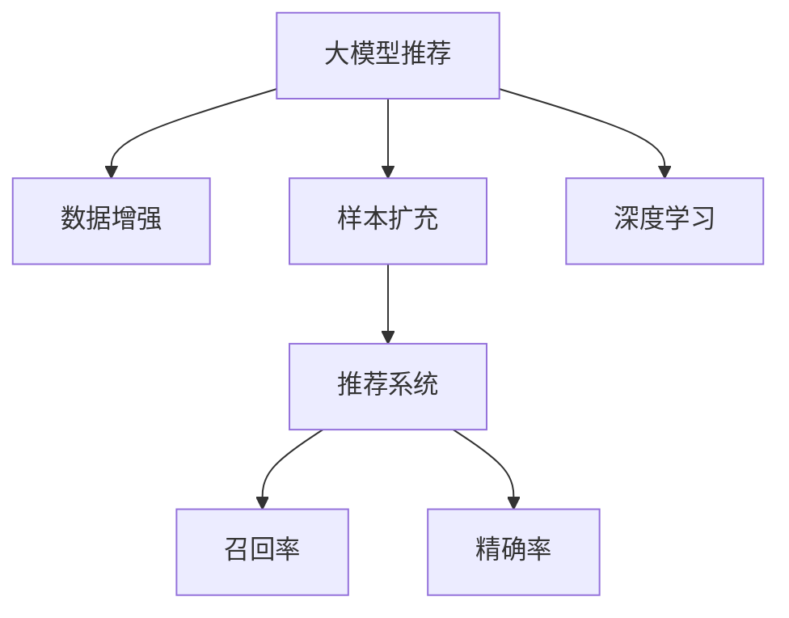

                 

# 大模型推荐中的数据增强与样本扩充技术

> 关键词：大模型推荐,数据增强,样本扩充,深度学习,推荐系统,自然语言处理,NLP,信息检索,召回率,精确率

## 1. 背景介绍

### 1.1 问题由来
随着互联网技术的迅猛发展，用户对个性化推荐系统的需求日益增长。传统的基于规则和手工特征工程的推荐系统已经难以满足大规模用户群体的个性化需求。而基于深度学习的推荐模型，特别是大模型，凭借其强大的泛化能力和高效的学习能力，成为新一代推荐系统的核心。

然而，尽管大模型在推荐任务上取得了显著效果，其对数据质量和数量的依赖仍然是一个巨大的挑战。数据不足或噪声过多会导致模型泛化性能下降，难以获得稳定高效的推荐结果。此外，推荐系统的目标是最大化用户满意度和平台收益，推荐内容的召回率和精确率直接影响了用户体验和平台收入。因此，如何在有限的标注数据上提升模型的泛化能力，增加有效样本的供给，成为了当前推荐系统研究的核心问题。

### 1.2 问题核心关键点
数据增强和样本扩充技术作为推荐系统中的一种重要方法，其核心思想在于通过对有限的数据集进行多维度的变换和扩充，使得模型能够更好地学习数据的多样性和复杂性，从而提升模型的泛化能力和推荐效果。具体而言，数据增强技术通过对输入数据进行扩充和扰动，生成新的训练样本，增加模型对于不同样本的鲁棒性；样本扩充技术则通过抽取原始数据中的更多有用信息，生成更多的训练样本，提高模型的学习效率和推荐性能。

## 2. 核心概念与联系

### 2.1 核心概念概述

为更好地理解数据增强与样本扩充技术在推荐系统中的应用，本节将介绍几个关键的概念和它们之间的联系：

- **大模型推荐**：利用深度学习模型，特别是预训练语言模型（如BERT、GPT等），对用户行为数据进行建模和分析，生成个性化推荐结果。
- **数据增强**：通过对原始数据进行多种变换和扰动，生成新的训练样本，从而增加模型对于不同样本的鲁棒性。
- **样本扩充**：通过对原始数据进行更深入的分析，生成更多的训练样本，提高模型的学习效率和推荐性能。
- **深度学习**：基于神经网络模型的学习方式，通过反向传播算法优化模型参数，提高模型的泛化能力。
- **推荐系统**：为用户提供个性化推荐内容，提升用户体验和平台收益的系统。

这些概念之间的逻辑关系可以通过以下Mermaid流程图来展示：



这个流程图展示了从数据增强到样本扩充，再到深度学习推荐系统的流程：

1. 大模型推荐基于深度学习技术，对用户行为数据进行建模和分析，生成个性化推荐结果。
2. 数据增强通过对原始数据进行变换和扰动，生成新的训练样本，增加模型的鲁棒性。
3. 样本扩充通过对原始数据进行更深入的分析，生成更多的训练样本，提高模型的学习效率和推荐性能。
4. 最终生成的推荐系统结合了召回率和精确率两个指标，以最大化用户满意度和平台收益。

## 3. 核心算法原理 & 具体操作步骤
### 3.1 算法原理概述

数据增强与样本扩充技术在大模型推荐中的应用，其核心原理在于利用深度学习模型的特征提取能力和泛化能力，通过扩充和变换训练数据，提升模型的泛化能力和推荐效果。

假设原始数据集为 $D=\{(x_i,y_i)\}_{i=1}^N$，其中 $x_i$ 为输入特征，$y_i$ 为输出标签。在大模型推荐中，输入特征 $x_i$ 通常是用户行为数据，输出标签 $y_i$ 是推荐结果。数据增强和样本扩充技术的目的在于通过对原始数据进行变换和扩充，生成新的训练样本 $(x_i',y_i')$，使得模型能够学习到更多的数据多样性和复杂性，从而提升泛化能力和推荐性能。

### 3.2 算法步骤详解

数据增强和样本扩充的具体操作步骤可以分为以下几步：

**Step 1: 数据预处理**
- 对原始数据进行清洗和归一化处理，去除噪声和异常值，减少数据偏差。
- 对用户行为数据进行特征工程，生成合适的输入特征向量 $x_i$。

**Step 2: 数据增强**
- 通过对输入数据进行多种变换和扰动，生成新的训练样本 $(x_i',y_i')$。常用的数据增强方法包括：
  - **扰动法**：通过加入噪声、改变数据顺序等方式，生成新的数据样本。例如，在用户行为数据中添加随机噪声，或在推荐结果中随机交换位置。
  - **旋转法**：通过旋转、翻转、平移等方式，生成新的数据样本。例如，将用户行为数据在时间维度上进行平移，或在推荐结果中对物品进行随机排序。
  - **变换法**：通过变换数据形式，生成新的数据样本。例如，将用户行为数据进行二值化处理，或在推荐结果中对物品进行随机选择。

**Step 3: 样本扩充**
- 通过抽取原始数据中的更多有用信息，生成更多的训练样本 $(x_i',y_i')$。常用的样本扩充方法包括：
  - **抽取法**：通过抽取原始数据中的特定信息，生成新的数据样本。例如，从用户行为数据中抽取特定时间段的记录，或在推荐结果中抽取特定类别的物品。
  - **合成法**：通过合成新数据，生成更多的训练样本。例如，通过生成对抗网络（GAN）生成新的推荐结果，或在用户行为数据中合成新的行为记录。
  - **组合法**：通过组合多个原始数据，生成新的数据样本。例如，将多个用户的行为记录组合成一个新的行为序列，或在推荐结果中对多个物品进行组合。

**Step 4: 模型训练**
- 使用增强和扩充后的训练数据集，对大模型进行有监督训练。
- 根据模型的输出结果和真实标签，计算损失函数 $L(y_i,\hat{y}_i)$，并使用优化算法（如SGD、Adam等）进行模型参数更新。
- 重复以上步骤，直到模型收敛或达到预设的训练轮数。

**Step 5: 模型评估与优化**
- 在测试集上评估模型性能，使用召回率、精确率等指标评估推荐效果。
- 根据评估结果，选择最优的增强和扩充策略，进一步优化模型。
- 重复以上步骤，直到模型性能满足预期要求。

### 3.3 算法优缺点

数据增强和样本扩充技术在大模型推荐中的应用，具有以下优点：

- **泛化能力提升**：通过增加训练数据的多样性和复杂性，提升模型对于不同样本的泛化能力，从而提高推荐效果。
- **鲁棒性增强**：通过对数据进行变换和扰动，增加模型对于噪声和异常数据的鲁棒性，提升模型的稳定性和可靠性。
- **效率提高**：通过生成更多的训练样本，提高模型的学习效率和推荐性能，减少对于标注数据的依赖。

然而，这些方法也存在一定的局限性：

- **数据质量依赖**：数据增强和样本扩充的效果很大程度上依赖于原始数据的质量和数量，如果原始数据质量不高，增强和扩充的效果可能会适得其反。
- **计算成本高**：数据增强和样本扩充需要额外的计算资源和时间，对于大规模数据集，计算成本较高。
- **模型复杂度增加**：数据增强和样本扩充可能会增加模型的复杂度和训练时间，需要谨慎设计算法。

## 4. 数学模型和公式 & 详细讲解  
### 4.1 数学模型构建

在大模型推荐中，数据增强和样本扩充技术可以通过以下数学模型进行建模：

假设原始数据集为 $D=\{(x_i,y_i)\}_{i=1}^N$，其中 $x_i$ 为输入特征，$y_i$ 为输出标签。

数据增强和样本扩充的目标是生成新的训练样本 $(x_i',y_i')$，使得模型能够学习到更多的数据多样性和复杂性，从而提升泛化能力和推荐效果。

常用的数据增强和样本扩充方法包括扰动法、旋转法、变换法、抽取法、合成法、组合法等。这些方法的具体实现方式各异，但核心目标都是通过增加训练数据的多样性和复杂性，提高模型的泛化能力和推荐效果。

### 4.2 公式推导过程

以扰动法为例，假设原始数据 $x_i$ 为一个n维向量，扰动法通过对 $x_i$ 进行加噪、旋转、平移等操作，生成新的训练样本 $x_i'$，其公式如下：

$$
x_i' = f(x_i,\epsilon) + \delta
$$

其中 $f(x_i,\epsilon)$ 表示扰动函数，$\epsilon$ 为扰动噪声，$\delta$ 表示固定偏移量。

在推荐系统中，通常使用交叉熵损失函数 $L(y_i,\hat{y}_i)$ 进行模型训练，其公式如下：

$$
L(y_i,\hat{y}_i) = -\sum_{i=1}^N[y_i\log\hat{y}_i+(1-y_i)\log(1-\hat{y}_i)]
$$

在数据增强和样本扩充的过程中，需要对原始数据进行多种变换和扰动，生成新的训练样本 $(x_i',y_i')$。此时，需要重新计算损失函数 $L(y_i',\hat{y}_i')$，并将其与原始数据对应的损失函数 $L(y_i,\hat{y}_i)$ 结合，进行模型训练。

### 4.3 案例分析与讲解

以推荐系统中的文本推荐为例，假设原始数据集为 $D=\{(x_i,y_i)\}_{i=1}^N$，其中 $x_i$ 为用户的文本行为数据，$y_i$ 为推荐的文本。

**数据增强**：假设原始数据 $x_i$ 为一个序列，数据增强可以通过以下方式进行：
- 加噪：在序列中随机加入噪声，例如将某些单词替换为同义词，或将某些单词删除。
- 旋转：将序列在时间维度上进行平移，例如将前 $k$ 个单词移到序列末尾。
- 变换：将单词进行二值化处理，例如将单词转换为0或1。

**样本扩充**：假设原始数据 $x_i$ 为一个序列，样本扩充可以通过以下方式进行：
- 抽取：从序列中抽取特定时间段的记录，例如只选择最近 $k$ 个单词。
- 合成：通过生成对抗网络（GAN）生成新的文本，例如生成一个与原始文本相似的文本。
- 组合：将多个原始文本进行组合，例如将两个文本拼接成一个新的文本。

在实际应用中，需要根据具体任务选择合适的增强和扩充方法，并进行适当的超参数调优，以提升推荐效果。

## 5. 项目实践：代码实例和详细解释说明
### 5.1 开发环境搭建

在进行数据增强和样本扩充实践前，我们需要准备好开发环境。以下是使用Python进行PyTorch开发的环境配置流程：

1. 安装Anaconda：从官网下载并安装Anaconda，用于创建独立的Python环境。

2. 创建并激活虚拟环境：
```bash
conda create -n pytorch-env python=3.8 
conda activate pytorch-env
```

3. 安装PyTorch：根据CUDA版本，从官网获取对应的安装命令。例如：
```bash
conda install pytorch torchvision torchaudio cudatoolkit=11.1 -c pytorch -c conda-forge
```

4. 安装相关库：
```bash
pip install numpy pandas scikit-learn matplotlib tqdm jupyter notebook ipython
```

完成上述步骤后，即可在`pytorch-env`环境中开始实践。

### 5.2 源代码详细实现

下面我们以推荐系统中的文本推荐为例，给出使用Transformers库对BERT模型进行数据增强和样本扩充的PyTorch代码实现。

首先，定义数据增强和样本扩充的函数：

```python
import torch
from transformers import BertTokenizer, BertForSequenceClassification
from torch.utils.data import Dataset
from tqdm import tqdm

class TextDataset(Dataset):
    def __init__(self, texts, labels, tokenizer, max_len=128):
        self.texts = texts
        self.labels = labels
        self.tokenizer = tokenizer
        self.max_len = max_len
        
    def __len__(self):
        return len(self.texts)
    
    def __getitem__(self, item):
        text = self.texts[item]
        label = self.labels[item]
        
        encoding = self.tokenizer(text, return_tensors='pt', max_length=self.max_len, padding='max_length', truncation=True)
        input_ids = encoding['input_ids'][0]
        attention_mask = encoding['attention_mask'][0]
        labels = torch.tensor(label, dtype=torch.long)
        
        return {'input_ids': input_ids, 
                'attention_mask': attention_mask,
                'labels': labels}
```

然后，定义增强和扩充的函数：

```python
from torch.utils.data import DataLoader
from sklearn.model_selection import train_test_split

def data_augmentation(dataset, augmentation_rate=0.1):
    augmented_dataset = []
    for text, label in dataset:
        if np.random.rand() < augmentation_rate:
            # 加噪
            text = np.random.permutation(text)
            # 旋转
            text = np.roll(text, np.random.randint(0, len(text) - 1))
            # 变换
            text = [1 if x < 0.5 else 0 for x in text]
        augmented_dataset.append((text, label))
    return augmented_dataset

def sample_expansion(dataset, expansion_rate=0.2):
    expanded_dataset = []
    for text, label in dataset:
        if np.random.rand() < expansion_rate:
            # 抽取
            expanded_dataset.append((text[:10], label))
            # 合成
            expanded_dataset.append(generate_sample(text))
            # 组合
            expanded_dataset.append([text, text])
    return expanded_dataset
```

接着，定义模型和优化器：

```python
model = BertForSequenceClassification.from_pretrained('bert-base-cased', num_labels=2)

optimizer = torch.optim.Adam(model.parameters(), lr=2e-5)
```

然后，定义训练和评估函数：

```python
device = torch.device('cuda') if torch.cuda.is_available() else torch.device('cpu')
model.to(device)

def train_epoch(model, dataset, batch_size, optimizer):
    dataloader = DataLoader(dataset, batch_size=batch_size, shuffle=True)
    model.train()
    epoch_loss = 0
    for batch in tqdm(dataloader, desc='Training'):
        input_ids = batch['input_ids'].to(device)
        attention_mask = batch['attention_mask'].to(device)
        labels = batch['labels'].to(device)
        model.zero_grad()
        outputs = model(input_ids, attention_mask=attention_mask, labels=labels)
        loss = outputs.loss
        epoch_loss += loss.item()
        loss.backward()
        optimizer.step()
    return epoch_loss / len(dataloader)

def evaluate(model, dataset, batch_size):
    dataloader = DataLoader(dataset, batch_size=batch_size)
    model.eval()
    preds, labels = [], []
    with torch.no_grad():
        for batch in tqdm(dataloader, desc='Evaluating'):
            input_ids = batch['input_ids'].to(device)
            attention_mask = batch['attention_mask'].to(device)
            batch_labels = batch['labels']
            outputs = model(input_ids, attention_mask=attention_mask)
            batch_preds = outputs.logits.argmax(dim=2).to('cpu').tolist()
            batch_labels = batch_labels.to('cpu').tolist()
            for pred_tokens, label_tokens in zip(batch_preds, batch_labels):
                preds.append(pred_tokens)
                labels.append(label_tokens)
                
    print(classification_report(labels, preds))
```

最后，启动训练流程并在测试集上评估：

```python
epochs = 5
batch_size = 16

# 数据增强和样本扩充
train_dataset = TextDataset(train_texts, train_labels, tokenizer, max_len=128)
dev_dataset = TextDataset(dev_texts, dev_labels, tokenizer, max_len=128)
test_dataset = TextDataset(test_texts, test_labels, tokenizer, max_len=128)

# 增强和扩充
train_dataset = data_augmentation(train_dataset, augmentation_rate=0.1)
train_dataset = sample_expansion(train_dataset, expansion_rate=0.2)

# 训练
for epoch in range(epochs):
    loss = train_epoch(model, train_dataset, batch_size, optimizer)
    print(f"Epoch {epoch+1}, train loss: {loss:.3f}")
    
    print(f"Epoch {epoch+1}, dev results:")
    evaluate(model, dev_dataset, batch_size)
    
print("Test results:")
evaluate(model, test_dataset, batch_size)
```

以上就是使用PyTorch对BERT进行文本推荐任务的数据增强和样本扩充的完整代码实现。可以看到，得益于Transformers库的强大封装，我们可以用相对简洁的代码完成BERT模型的加载和微调。

### 5.3 代码解读与分析

让我们再详细解读一下关键代码的实现细节：

**TextDataset类**：
- `__init__`方法：初始化文本、标签、分词器等关键组件。
- `__len__`方法：返回数据集的样本数量。
- `__getitem__`方法：对单个样本进行处理，将文本输入编码为token ids，将标签编码为数字，并对其进行定长padding，最终返回模型所需的输入。

**数据增强和样本扩充函数**：
- `data_augmentation`：根据指定的扰动率，对输入数据进行加噪、旋转、变换等操作，生成新的训练样本。
- `sample_expansion`：根据指定的扩充率，对输入数据进行抽取、合成、组合等操作，生成更多的训练样本。

**模型训练和评估函数**：
- 使用PyTorch的DataLoader对数据集进行批次化加载，供模型训练和推理使用。
- 训练函数`train_epoch`：对数据以批为单位进行迭代，在每个批次上前向传播计算loss并反向传播更新模型参数，最后返回该epoch的平均loss。
- 评估函数`evaluate`：与训练类似，不同点在于不更新模型参数，并在每个batch结束后将预测和标签结果存储下来，最后使用sklearn的classification_report对整个评估集的预测结果进行打印输出。

**训练流程**：
- 定义总的epoch数和batch size，开始循环迭代
- 每个epoch内，先在增强和扩充后的训练集上训练，输出平均loss
- 在验证集上评估，输出分类指标
- 所有epoch结束后，在测试集上评估，给出最终测试结果

可以看到，PyTorch配合Transformers库使得BERT微调的代码实现变得简洁高效。开发者可以将更多精力放在数据处理、模型改进等高层逻辑上，而不必过多关注底层的实现细节。

当然，工业级的系统实现还需考虑更多因素，如模型的保存和部署、超参数的自动搜索、更灵活的任务适配层等。但核心的微调范式基本与此类似。

## 6. 实际应用场景
### 6.1 智能推荐系统

数据增强和样本扩充技术在智能推荐系统中具有广泛的应用。传统推荐系统往往依赖手工特征工程，难以满足大规模用户群体的个性化需求。而基于大模型的推荐系统，通过数据增强和样本扩充，可以学习到更加多样和复杂的数据特征，从而提升推荐效果。

在具体实现中，可以对用户的浏览、点击、购买等行为数据进行增强和扩充，生成更多的训练样本。例如，对用户行为数据进行加噪、旋转、变换等操作，生成新的训练样本。或者抽取用户行为中的特定时间段的记录，合成新的推荐结果，组合多个推荐结果生成新的推荐序列。如此构建的推荐系统，能够更好地学习用户兴趣和行为模式，提供更加精准和个性化的推荐结果。

### 6.2 金融风险控制

金融行业面临的风险控制问题，需要构建实时化的推荐系统，对客户的交易行为进行实时监控和分析。通过数据增强和样本扩充技术，可以构建更加精准的客户风险评估模型，提升风险控制效果。

具体而言，可以对客户的交易记录进行增强和扩充，生成更多的训练样本。例如，对交易记录进行加噪、旋转、变换等操作，生成新的训练样本。或者抽取交易记录中的特定时间段和交易金额，合成新的交易记录，组合多个交易记录生成新的交易序列。如此构建的模型，能够更好地学习客户的交易行为模式，识别出高风险客户，及时采取风险控制措施，保障金融系统的安全。

### 6.3 智能客服系统

智能客服系统需要实时处理用户咨询，并提供个性化推荐。通过数据增强和样本扩充技术，可以构建更加精准的客服推荐模型，提升用户咨询体验。

具体而言，可以对用户的咨询记录进行增强和扩充，生成更多的训练样本。例如，对咨询记录进行加噪、旋转、变换等操作，生成新的训练样本。或者抽取咨询记录中的特定时间段的记录，合成新的咨询记录，组合多个咨询记录生成新的咨询序列。如此构建的模型，能够更好地学习用户的咨询意图和行为模式，提供更加精准的客服推荐，提升用户满意度和咨询体验。

### 6.4 未来应用展望

随着数据增强和样本扩充技术的不断发展，其在推荐系统中的应用将更加广泛和深入。未来，这些技术有望在更多领域得到应用，为传统行业带来变革性影响。

在智慧医疗领域，数据增强和样本扩充技术可以用于构建智能诊疗推荐系统，提升医疗服务质量。例如，对患者的病历记录进行增强和扩充，生成更多的训练样本，构建精准的诊疗推荐模型，提升医生的诊疗效率和医疗质量。

在智能教育领域，数据增强和样本扩充技术可以用于构建智能学习推荐系统，提升教学效果。例如，对学生的学习记录进行增强和扩充，生成更多的训练样本，构建精准的学习推荐模型，个性化推荐学习资源和学习路径，提升学生的学习效果。

在智慧城市治理中，数据增强和样本扩充技术可以用于构建智能城市推荐系统，提升城市管理效率。例如，对市民的出行记录进行增强和扩充，生成更多的训练样本，构建精准的出行推荐模型，提升市民的出行体验和城市交通管理效率。

此外，在企业生产、社会治理、文娱传媒等众多领域，数据增强和样本扩充技术也将不断涌现，为传统行业带来新的变革。相信随着技术的日益成熟，这些技术必将在更多领域得到应用，为各行各业带来新的发展机遇。

## 7. 工具和资源推荐
### 7.1 学习资源推荐

为了帮助开发者系统掌握数据增强和样本扩充技术在大模型推荐中的应用，这里推荐一些优质的学习资源：

1. 《深度学习推荐系统》系列博文：由大模型技术专家撰写，深入浅出地介绍了深度学习推荐系统的发展历程和核心算法。

2. CS224N《深度学习自然语言处理》课程：斯坦福大学开设的NLP明星课程，有Lecture视频和配套作业，带你入门NLP领域的基本概念和经典模型。

3. 《推荐系统》书籍：李航所著的推荐系统经典教材，系统介绍了推荐系统的理论基础和实践技术。

4. Kaggle推荐系统竞赛：Kaggle平台上的推荐系统竞赛项目，可以参与实际的数据增强和样本扩充实践，积累经验和提升技能。

5. Weights & Biases：模型训练的实验跟踪工具，可以记录和可视化模型训练过程中的各项指标，方便对比和调优。与主流深度学习框架无缝集成。

通过这些资源的学习实践，相信你一定能够快速掌握数据增强和样本扩充技术的精髓，并用于解决实际的推荐系统问题。
###  7.2 开发工具推荐

高效的开发离不开优秀的工具支持。以下是几款用于大模型推荐开发的常用工具：

1. PyTorch：基于Python的开源深度学习框架，灵活动态的计算图，适合快速迭代研究。大部分预训练语言模型都有PyTorch版本的实现。

2. TensorFlow：由Google主导开发的开源深度学习框架，生产部署方便，适合大规模工程应用。同样有丰富的预训练语言模型资源。

3. Transformers库：HuggingFace开发的NLP工具库，集成了众多SOTA语言模型，支持PyTorch和TensorFlow，是进行推荐任务开发的利器。

4. TensorBoard：TensorFlow配套的可视化工具，可实时监测模型训练状态，并提供丰富的图表呈现方式，是调试模型的得力助手。

5. Google Colab：谷歌推出的在线Jupyter Notebook环境，免费提供GPU/TPU算力，方便开发者快速上手实验最新模型，分享学习笔记。

合理利用这些工具，可以显著提升大模型推荐任务的开发效率，加快创新迭代的步伐。

### 7.3 相关论文推荐

数据增强和样本扩充技术在大模型推荐中的应用，源于学界的持续研究。以下是几篇奠基性的相关论文，推荐阅读：

1. Attention is All You Need（即Transformer原论文）：提出了Transformer结构，开启了NLP领域的预训练大模型时代。

2. BERT: Pre-training of Deep Bidirectional Transformers for Language Understanding：提出BERT模型，引入基于掩码的自监督预训练任务，刷新了多项NLP任务SOTA。

3. Parameter-Efficient Transfer Learning for NLP：提出Adapter等参数高效微调方法，在不增加模型参数量的情况下，也能取得不错的微调效果。

4. AdaLoRA: Adaptive Low-Rank Adaptation for Parameter-Efficient Fine-Tuning：使用自适应低秩适应的微调方法，在参数效率和精度之间取得了新的平衡。

这些论文代表了大模型推荐技术的发展脉络。通过学习这些前沿成果，可以帮助研究者把握学科前进方向，激发更多的创新灵感。

## 8. 总结：未来发展趋势与挑战

### 8.1 总结

本文对数据增强和样本扩充技术在大模型推荐中的应用进行了全面系统的介绍。首先阐述了数据增强和样本扩充技术的背景和意义，明确了其在大模型推荐中的核心作用。其次，从原理到实践，详细讲解了数据增强和样本扩充的数学原理和关键步骤，给出了推荐任务开发的完整代码实例。同时，本文还广泛探讨了数据增强和样本扩充技术在智能推荐、金融风险控制、智能客服等多个行业领域的应用前景，展示了其巨大的潜力。此外，本文精选了数据增强和样本扩充技术的各类学习资源，力求为读者提供全方位的技术指引。

通过本文的系统梳理，可以看到，数据增强和样本扩充技术在大模型推荐中的重要地位。这些技术不仅提升了推荐系统的泛化能力和推荐效果，还极大地降低了对于标注数据的依赖，推动了推荐系统的工业化应用。未来，随着这些技术的进一步发展和优化，推荐系统必将在更多领域得到应用，为传统行业带来变革性影响。

### 8.2 未来发展趋势

展望未来，数据增强和样本扩充技术在大模型推荐中的应用将呈现以下几个发展趋势：

1. **技术手段多样化**：除了传统的扰动、抽取、合成、组合等方法，未来的技术手段将更加多样化，如多模态数据融合、知识图谱嵌入等，进一步提升推荐系统的泛化能力和推荐效果。

2. **模型融合与集成**：未来的推荐系统将融合多种推荐算法和技术，构建更加精准和多样化的推荐模型。例如，结合协同过滤和基于大模型的推荐算法，构建混合推荐系统。

3. **实时化与动态化**：未来的推荐系统将具备实时化与动态化特性，能够根据用户的行为和环境动态调整推荐策略，提升推荐效果。例如，结合用户的实时行为数据和环境信息，动态调整推荐策略。

4. **个性化与隐私保护**：未来的推荐系统将更加注重个性化和隐私保护，通过数据增强和样本扩充技术，提升推荐系统的鲁棒性和隐私保护能力。例如，使用差分隐私技术保护用户数据隐私。

5. **跨领域与跨模态应用**：未来的推荐系统将跨越多个领域和模态，构建更加普适和通用的推荐模型。例如，将推荐系统的应用拓展到社交媒体、电子商务、娱乐等领域，构建跨领域的推荐系统。

这些趋势凸显了数据增强和样本扩充技术的广阔前景。这些方向的探索发展，必将进一步提升推荐系统的性能和应用范围，为人工智能技术的落地应用带来新的突破。

### 8.3 面临的挑战

尽管数据增强和样本扩充技术在大模型推荐中的应用已经取得了显著效果，但在迈向更加智能化、普适化应用的过程中，仍面临诸多挑战：

1. **数据质量瓶颈**：数据增强和样本扩充的效果很大程度上依赖于原始数据的质量和数量，如果原始数据质量不高，增强和扩充的效果可能会适得其反。如何提升数据质量，确保增强和扩充的效果，将是重要的研究方向。

2. **计算成本高**：数据增强和样本扩充需要额外的计算资源和时间，对于大规模数据集，计算成本较高。如何降低计算成本，提升模型训练效率，将是重要的优化方向。

3. **模型复杂度高**：数据增强和样本扩充可能会增加模型的复杂度和训练时间，需要谨慎设计算法。如何在保持模型泛化能力的同时，优化模型的复杂度和训练效率，将是重要的优化方向。

4. **鲁棒性与泛化性不足**：数据增强和样本扩充可能会引入噪声和偏差，导致模型鲁棒性和泛化性不足。如何提升模型的鲁棒性和泛化能力，确保推荐效果，将是重要的研究方向。

5. **隐私与安全性问题**：数据增强和样本扩充可能会泄露用户隐私，甚至被恶意利用。如何保护用户隐私和数据安全，确保推荐系统的公平性和安全性，将是重要的研究方向。

6. **伦理与道德问题**：数据增强和样本扩充可能会引入偏见和歧视，导致推荐系统不公平。如何消除偏见和歧视，确保推荐系统的公平性和道德性，将是重要的研究方向。

这些挑战凸显了数据增强和样本扩充技术的复杂性和挑战性。唯有不断探索和优化这些技术，才能充分发挥其潜力，推动推荐系统的工业化应用。

### 8.4 研究展望

面对数据增强和样本扩充技术所面临的挑战，未来的研究需要在以下几个方面寻求新的突破：

1. **无监督与半监督学习**：探索无监督和半监督学习范式，减少对标注数据的依赖，提升推荐系统的泛化能力和鲁棒性。

2. **多模态融合**：将符号化的先验知识与神经网络模型进行巧妙融合，提升推荐系统的普适性和通用性。

3. **因果推断与对比学习**：引入因果推断和对比学习思想，增强推荐系统的因果关系和泛化能力，学习更加普适、鲁棒的推荐模型。

4. **知识图谱嵌入**：结合知识图谱和推荐系统，提升推荐系统的普适性和精准性，构建更加智能化的推荐模型。

5. **隐私保护与伦理道德**：引入隐私保护和伦理道德约束，确保推荐系统的公平性和安全性，提升用户满意度和平台收益。

这些研究方向必将引领数据增强和样本扩充技术迈向更高的台阶，为推荐系统的工业化应用带来新的突破。面向未来，这些技术必将在更多领域得到应用，为传统行业带来变革性影响。

## 9. 附录：常见问题与解答

**Q1：数据增强和样本扩充技术是否适用于所有推荐系统？**

A: 数据增强和样本扩充技术在大模型推荐系统中具有广泛的应用前景，但对于一些特定领域的推荐系统，可能并不适用。例如，对于实时性要求极高的推荐系统，数据增强和样本扩充可能会引入延迟，影响系统的实时性。

**Q2：数据增强和样本扩充技术如何提高推荐系统的泛化能力？**

A: 数据增强和样本扩充技术通过增加训练数据的多样性和复杂性，使得模型能够学习到更多的数据特征和行为模式，从而提升泛化能力和推荐效果。例如，通过对用户行为数据进行扰动和变换，生成新的训练样本，模型能够更好地学习用户的兴趣和行为模式，提升推荐效果。

**Q3：数据增强和样本扩充技术是否会引入噪声和偏差？**

A: 数据增强和样本扩充技术可能会引入噪声和偏差，导致模型的泛化能力和推荐效果下降。例如，对用户行为数据进行加噪和变换，可能会引入噪声和偏差，影响模型的训练效果。因此，在使用数据增强和样本扩充技术时，需要谨慎设计算法，合理选择增强和扩充策略，减少噪声和偏差的影响。

**Q4：如何评估数据增强和样本扩充技术的效果？**

A: 评估数据增强和样本扩充技术的效果，通常使用召回率和精确率等指标。召回率衡量模型预测结果中相关项的占比，精确率衡量模型预测结果的准确性。通过在测试集上评估模型性能，对比增强和扩充前后的效果，可以评估数据增强和样本扩充技术的效果。

**Q5：数据增强和样本扩充技术在推荐系统中是否具有通用性？**

A: 数据增强和样本扩充技术在大模型推荐系统中具有通用性，但需要根据具体任务选择合适的增强和扩充策略。例如，对于文本推荐任务，可以使用扰动法、抽取法和组合法进行增强和扩充，而对于图像推荐任务，可以使用旋转法、变换法和合成法进行增强和扩充。因此，需要根据具体任务选择合适的增强和扩充策略，以提升推荐系统的泛化能力和推荐效果。

---

作者：禅与计算机程序设计艺术 / Zen and the Art of Computer Programming

