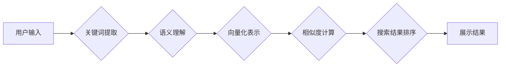

                 

## 提高搜索准确性：AI的精准匹配

> 关键词：搜索引擎、自然语言处理、信息检索、机器学习、深度学习、BERT、TF-IDF、向量化

### 1. 背景介绍

在信息爆炸的时代，海量数据无处不在，高效准确地获取所需信息变得尤为重要。搜索引擎作为信息获取的主要入口，其准确性直接影响着用户体验和信息获取效率。传统的基于关键词匹配的搜索算法，往往难以捕捉用户搜索意图的复杂性和语义关联，导致搜索结果不精准，难以满足用户多样化的需求。

近年来，人工智能技术蓬勃发展，特别是自然语言处理（NLP）领域的突破，为提高搜索准确性提供了新的思路和方法。AI驱动的精准匹配技术，通过深度学习模型对用户搜索词和文档内容进行语义理解和向量化表示，能够更准确地捕捉用户意图，并找到与之高度相关的文档，从而提升搜索结果的质量和用户满意度。

### 2. 核心概念与联系

**2.1 核心概念**

* **信息检索 (Information Retrieval):**  信息检索是计算机科学的一个分支，旨在帮助用户从海量数据中快速、准确地找到所需信息。
* **自然语言处理 (Natural Language Processing):** 自然语言处理是人工智能的一个分支，旨在使计算机能够理解、处理和生成人类语言。
* **机器学习 (Machine Learning):** 机器学习是人工智能的一个分支，旨在通过算法训练，使计算机能够从数据中学习并做出预测。
* **深度学习 (Deep Learning):** 深度学习是机器学习的一个子领域，利用多层神经网络来模拟人类大脑的学习过程，能够处理更复杂的数据和任务。
* **向量化表示 (Vectorization):** 将文本或其他数据映射到向量空间中，以便于进行数学运算和比较。

**2.2 架构图**



### 3. 核心算法原理 & 具体操作步骤

**3.1 算法原理概述**

AI驱动的精准匹配算法的核心在于利用深度学习模型对用户搜索词和文档内容进行语义理解和向量化表示，然后通过计算向量之间的相似度来确定相关性。

**3.2 算法步骤详解**

1. **关键词提取:** 从用户输入的搜索词中提取出最重要的关键词，这些关键词代表了用户搜索的主题和意图。
2. **语义理解:** 利用深度学习模型，例如BERT，对关键词和文档内容进行语义分析，理解其含义和上下文关系。
3. **向量化表示:** 将关键词和文档内容映射到向量空间中，每个向量代表一个文本片段的语义特征。
4. **相似度计算:** 计算用户搜索词向量和文档内容向量之间的相似度，常用的方法包括余弦相似度、欧氏距离等。
5. **搜索结果排序:** 根据相似度得分对搜索结果进行排序，将与用户搜索意图最相关的文档排在前面。

**3.3 算法优缺点**

**优点:**

* **更精准的匹配:**  能够捕捉用户搜索意图的复杂性和语义关联，提高搜索结果的准确性。
* **更好的用户体验:** 提供更相关、更满足用户需求的搜索结果，提升用户体验。
* **个性化推荐:**  根据用户的搜索历史和行为数据，提供个性化的搜索结果推荐。

**缺点:**

* **计算复杂度高:** 深度学习模型的训练和推理过程需要大量的计算资源。
* **数据依赖性强:**  算法的性能取决于训练数据的质量和数量。
* **解释性差:** 深度学习模型的决策过程较为复杂，难以解释其背后的逻辑。

**3.4 算法应用领域**

* **搜索引擎:**  提高搜索结果的准确性和相关性。
* **推荐系统:**  根据用户的兴趣和行为数据，推荐相关商品、内容或服务。
* **问答系统:**  理解用户的自然语言问题，并提供准确的答案。
* **聊天机器人:**  理解用户的自然语言输入，并进行自然流畅的对话。

### 4. 数学模型和公式 & 详细讲解 & 举例说明

**4.1 数学模型构建**

假设我们有一个用户搜索词 $q$ 和一个文档 $d$，我们需要计算它们之间的相似度。我们可以将这两个文本片段映射到一个向量空间中，其中每个维度代表一个特征。

* $q$ 的向量表示为 $q_v$
* $d$ 的向量表示为 $d_v$

**4.2 公式推导过程**

常用的相似度计算方法之一是余弦相似度，它衡量了两个向量的夹角大小。余弦相似度公式如下：

$$
\text{cosine similarity}(q_v, d_v) = \frac{q_v \cdot d_v}{||q_v|| ||d_v||}
$$

其中：

* $q_v \cdot d_v$ 是 $q_v$ 和 $d_v$ 的点积
* $||q_v||$ 和 $||d_v||$ 分别是 $q_v$ 和 $d_v$ 的长度

**4.3 案例分析与讲解**

假设我们有一个用户搜索词 $q$ = "苹果手机"，以及一个文档 $d$ = "苹果公司发布了新款iPhone手机，拥有更强大的性能和更出色的摄像头。"

我们可以将这两个文本片段分别映射到一个词向量空间中，例如使用Word2Vec或GloVe预训练模型。

然后，我们可以计算 $q_v$ 和 $d_v$ 的余弦相似度，如果相似度较高，则表明用户搜索词和文档内容之间存在较强的语义关联。

### 5. 项目实践：代码实例和详细解释说明

**5.1 开发环境搭建**

* Python 3.6+
* TensorFlow 或 PyTorch 深度学习框架
* NLTK 自然语言处理库
* Gensim 词向量库

**5.2 源代码详细实现**

```python
import tensorflow as tf
from tensorflow.keras.layers import Embedding, Dense
from tensorflow.keras.models import Sequential

# 构建词嵌入层
embedding_layer = Embedding(input_dim=vocab_size, output_dim=embedding_dim)

# 构建全连接层
dense_layer = Dense(units=1, activation='sigmoid')

# 构建模型
model = Sequential([embedding_layer, dense_layer])

# 编译模型
model.compile(optimizer='adam', loss='binary_crossentropy', metrics=['accuracy'])

# 训练模型
model.fit(x_train, y_train, epochs=10)

# 预测相似度
query_vector = embedding_layer.embeddings[query_index]
document_vector = embedding_layer.embeddings[document_index]
similarity = dense_layer.predict([query_vector, document_vector])
```

**5.3 代码解读与分析**

* 首先，我们使用 TensorFlow 构建了一个简单的深度学习模型，包含一个词嵌入层和一个全连接层。
* 词嵌入层将每个词映射到一个低维向量空间中，每个向量代表一个词的语义特征。
* 全连接层将两个词向量的拼接结果作为输入，输出一个相似度得分。
* 我们使用 Adam 优化器和二分类交叉熵损失函数训练模型，并使用准确率作为评估指标。
* 训练完成后，我们可以使用模型预测用户搜索词和文档内容之间的相似度。

**5.4 运行结果展示**

训练完成后，我们可以将模型应用于实际场景，例如搜索引擎，来提高搜索结果的准确性。

### 6. 实际应用场景

**6.1 搜索引擎优化 (SEO)**

AI驱动的精准匹配技术可以帮助搜索引擎更好地理解用户搜索意图，并提供更相关、更准确的搜索结果。这对于提高搜索引擎的排名和用户体验至关重要。

**6.2 个性化推荐系统**

AI可以根据用户的搜索历史、浏览记录和购买行为等数据，构建用户画像，并推荐与用户兴趣相符的商品、内容或服务。

**6.3 智能客服系统**

AI驱动的聊天机器人可以理解用户的自然语言问题，并提供准确、及时、个性化的回复，从而提高客户服务效率。

**6.4 内容创作辅助工具**

AI可以帮助用户生成高质量的文本内容，例如文章、博客、广告文案等，提高内容创作效率。

**6.5 未来应用展望**

随着人工智能技术的不断发展，AI驱动的精准匹配技术将在更多领域得到应用，例如医疗诊断、法律服务、教育培训等。

### 7. 工具和资源推荐

**7.1 学习资源推荐**

* **书籍:**
    * 《深度学习》 by Ian Goodfellow, Yoshua Bengio, and Aaron Courville
    * 《自然语言处理入门》 by Jacob Eisenstein
* **在线课程:**
    * Coursera: 自然语言处理
    * Udacity: 深度学习

**7.2 开发工具推荐**

* **TensorFlow:** https://www.tensorflow.org/
* **PyTorch:** https://pytorch.org/
* **NLTK:** https://www.nltk.org/
* **Gensim:** https://radimrehurek.com/gensim/

**7.3 相关论文推荐**

* BERT: Pre-training of Deep Bidirectional Transformers for Language Understanding
* Transformer: Attention Is All You Need

### 8. 总结：未来发展趋势与挑战

**8.1 研究成果总结**

AI驱动的精准匹配技术取得了显著的进展，能够有效提高搜索结果的准确性和相关性，并应用于多个领域。

**8.2 未来发展趋势**

* **更强大的模型:**  研究人员将继续开发更强大的深度学习模型，例如Transformer变体，以更好地理解自然语言和捕捉语义关联。
* **多模态搜索:**  将文本、图像、音频等多种模态信息融合到搜索引擎中，提供更全面的搜索体验。
* **个性化搜索:**  根据用户的个人喜好、行为数据和上下文信息，提供更个性化的搜索结果推荐。

**8.3 面临的挑战**

* **数据质量:**  深度学习模型的性能取决于训练数据的质量和数量，获取高质量的训练数据仍然是一个挑战。
* **计算资源:**  训练大型深度学习模型需要大量的计算资源，这对于资源有限的机构或个人来说是一个障碍。
* **解释性:**  深度学习模型的决策过程较为复杂，难以解释其背后的逻辑，这对于用户信任和模型可解释性是一个挑战。

**8.4 研究展望**

未来，AI驱动的精准匹配技术将继续发展，并应用于更多领域，为用户提供更智能、更便捷的信息获取体验。


### 9. 附录：常见问题与解答

**9.1 如何选择合适的词向量模型？**

选择词向量模型需要考虑以下因素：

* **语料库:**  不同的词向量模型是基于不同的语料库训练的，选择与目标任务相关的语料库训练的模型。
* **维度大小:**  词向量的维度大小会影响模型的性能，一般来说，维度越大，模型的表达能力越强，但计算成本也越高。
* **训练方法:**  不同的词向量模型使用不同的训练方法，例如Word2Vec、GloVe、FastText等，选择适合目标任务的训练方法。

**9.2 如何评估精准匹配算法的性能？**

常用的评估指标包括：

* **准确率:**  正确预测的样本数占总样本数的比例。
* **召回率:**  正确预测的正样本数占所有正样本数的比例。
* **F1-score:**  准确率和召回率的 harmonic mean。

**9.3 如何处理长文本的精准匹配？**

对于长文本，可以采用以下方法：

* **文本摘要:**  使用文本摘要技术提取文本的关键信息，然后对摘要进行精准匹配。
* **分段匹配:**  将长文本分割成多个短段，然后对每个短段进行精准匹配。
* **滑动窗口:**  使用滑动窗口技术，逐个窗口地扫描文本，并对每个窗口进行精准匹配。


作者：禅与计算机程序设计艺术 / Zen and the Art of Computer Programming 
<end_of_turn>

