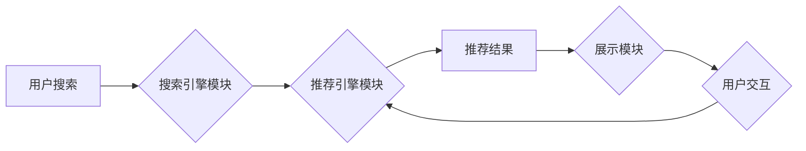

                 

## 1. 背景介绍

在当今数据爆炸的时代，电商平台面临着激烈的竞争。用户在海量商品中寻找所需产品，效率和精准度成为关键。搜索推荐系统作为电商平台的核心功能之一，直接影响着用户体验和商业转化。传统的基于规则和协同过滤的推荐算法已难以满足用户个性化需求和平台快速发展的要求。

近年来，人工智能（AI）技术蓬勃发展，特别是大模型的兴起，为搜索推荐系统的升级带来了新的机遇。大模型凭借其强大的学习能力和泛化能力，能够从海量数据中挖掘更深层的用户偏好和商品关联，从而提供更精准、更个性化的推荐结果。

## 2. 核心概念与联系

### 2.1 搜索推荐系统

搜索推荐系统旨在根据用户的搜索行为和历史数据，推荐与用户需求相匹配的商品。它通常由以下几个模块组成：

* **搜索引擎模块:** 处理用户搜索词，并返回相关商品列表。
* **推荐引擎模块:** 基于用户画像、商品信息和历史数据，对搜索结果进行排序和推荐。
* **展示模块:** 将推荐结果以用户友好的方式展示给用户。

### 2.2 大模型

大模型是指参数规模庞大、训练数据海量的人工智能模型。它通常基于Transformer架构，能够学习复杂的语言模式和语义关系。

* **预训练:** 大模型通常通过预训练的方式学习通用语言表示，例如BERT、GPT等。
* **微调:** 在特定任务上，例如搜索推荐，可以对预训练的大模型进行微调，使其更适应特定场景。

### 2.3 AI 大模型融合

AI 大模型融合是指将多个大模型组合在一起，发挥各自优势，构建更强大的搜索推荐系统。例如，可以将自然语言处理（NLP）大模型用于理解用户搜索意图，将图像识别大模型用于推荐视觉相似商品，将协同过滤大模型用于推荐用户可能感兴趣的商品。

**Mermaid 流程图**



## 3. 核心算法原理 & 具体操作步骤

### 3.1 算法原理概述

AI 大模型融合的搜索推荐系统通常基于深度学习算法，例如Transformer、BERT、Graph Neural Networks等。这些算法能够学习用户和商品之间的复杂关系，并根据用户的搜索历史、浏览记录、购买行为等信息，预测用户对特定商品的兴趣。

### 3.2 算法步骤详解

1. **数据预处理:** 收集用户行为数据、商品信息数据等，并进行清洗、转换、特征工程等操作，构建训练数据集。
2. **模型训练:** 使用深度学习框架，例如TensorFlow、PyTorch等，训练大模型，例如BERT、GPT等，并对模型进行微调，使其适应搜索推荐任务。
3. **模型评估:** 使用测试数据集评估模型的性能，例如准确率、召回率、NDCG等指标。
4. **模型部署:** 将训练好的模型部署到生产环境，并进行实时推荐。
5. **模型监控:** 持续监控模型的性能，并根据用户反馈和数据变化进行模型更新和优化。

### 3.3 算法优缺点

**优点:**

* **精准度高:** 大模型能够学习用户和商品之间的复杂关系，提供更精准的推荐结果。
* **个性化强:** 大模型能够根据用户的历史数据和行为特征，提供个性化的推荐。
* **可扩展性强:** 大模型能够处理海量数据，并适应平台快速发展。

**缺点:**

* **训练成本高:** 大模型的训练需要大量的计算资源和时间。
* **数据依赖性强:** 大模型的性能依赖于训练数据的质量和数量。
* **解释性差:** 深度学习模型的决策过程难以解释，这可能会导致用户对推荐结果的信任度降低。

### 3.4 算法应用领域

AI 大模型融合的搜索推荐系统广泛应用于电商平台、社交媒体、内容平台等领域，例如：

* **商品推荐:** 根据用户的搜索历史、浏览记录、购买行为等信息，推荐用户可能感兴趣的商品。
* **内容推荐:** 根据用户的阅读习惯、点赞记录、评论行为等信息，推荐用户可能感兴趣的内容。
* **广告推荐:** 根据用户的兴趣爱好、行为特征等信息，推荐用户可能感兴趣的广告。

## 4. 数学模型和公式 & 详细讲解 & 举例说明

### 4.1 数学模型构建

搜索推荐系统的数学模型通常基于用户-商品交互矩阵，该矩阵表示用户对商品的评分或偏好程度。

**用户-商品交互矩阵:**

$$
\mathbf{R} = \begin{bmatrix}
r_{11} & r_{12} & \dots & r_{1m} \\
r_{21} & r_{22} & \dots & r_{2m} \\
\vdots & \vdots & \ddots & \vdots \\
r_{n1} & r_{n2} & \dots & r_{nm}
\end{bmatrix}
$$

其中，$r_{ij}$ 表示用户 $i$ 对商品 $j$ 的评分或偏好程度。

### 4.2 公式推导过程

基于用户-商品交互矩阵，可以利用协同过滤算法，例如基于用户的协同过滤和基于物品的协同过滤，预测用户对商品的评分或偏好程度。

**基于用户的协同过滤:**

$$
\hat{r}_{ui} = \bar{r}_u + \frac{\sum_{v \in N(u)} (r_{uv} - \bar{r}_u) \cdot s_{uv}}{\sum_{v \in N(u)} s_{uv}}
$$

其中，$\hat{r}_{ui}$ 表示预测用户 $u$ 对商品 $i$ 的评分，$\bar{r}_u$ 表示用户 $u$ 的平均评分，$N(u)$ 表示与用户 $u$ 相似的用户集合，$s_{uv}$ 表示用户 $u$ 和 $v$ 的相似度。

**基于物品的协同过滤:**

$$
\hat{r}_{ui} = \bar{r}_i + \frac{\sum_{v \in N(i)} (r_{uv} - \bar{r}_i) \cdot s_{vi}}{\sum_{v \in N(i)} s_{vi}}
$$

其中，$\hat{r}_{ui}$ 表示预测用户 $u$ 对商品 $i$ 的评分，$\bar{r}_i$ 表示商品 $i$ 的平均评分，$N(i)$ 表示与商品 $i$ 相似的商品集合，$s_{vi}$ 表示商品 $v$ 和 $i$ 的相似度。

### 4.3 案例分析与讲解

假设有一个电商平台，用户 $u$ 对商品 $i$ 的评分未知，但平台有用户 $u$ 和商品 $i$ 的相似用户和商品的评分数据。

基于用户的协同过滤算法可以根据用户 $u$ 的评分历史和与用户 $u$ 相似的用户的评分历史，预测用户 $u$ 对商品 $i$ 的评分。

基于物品的协同过滤算法可以根据商品 $i$ 的评分历史和与商品 $i$ 相似的商品的评分历史，预测用户 $u$ 对商品 $i$ 的评分。

## 5. 项目实践：代码实例和详细解释说明

### 5.1 开发环境搭建

* **操作系统:** Linux
* **编程语言:** Python
* **深度学习框架:** TensorFlow 或 PyTorch
* **其他工具:** Git、Jupyter Notebook

### 5.2 源代码详细实现

```python
# 使用 TensorFlow 实现基于用户的协同过滤算法
import tensorflow as tf

# 定义用户-商品交互矩阵
ratings = tf.constant([[5, 4, 3],
                      [4, 5, 2],
                      [3, 2, 5]])

# 计算用户平均评分
user_means = tf.reduce_mean(ratings, axis=1)

# 计算用户相似度
user_similarity = tf.matmul(ratings - user_means, tf.transpose(ratings - user_means))

# 预测用户对商品的评分
predictions = user_means + tf.matmul((ratings - user_means), user_similarity)

# 打印预测结果
print(predictions)
```

### 5.3 代码解读与分析

* **数据加载:** 将用户-商品交互矩阵加载到 TensorFlow 中。
* **用户平均评分计算:** 计算每个用户的平均评分。
* **用户相似度计算:** 使用余弦相似度计算用户之间的相似度。
* **评分预测:** 使用用户相似度和用户平均评分预测用户对商品的评分。
* **结果输出:** 打印预测结果。

### 5.4 运行结果展示

运行上述代码，可以得到用户对商品的评分预测结果。

## 6. 实际应用场景

### 6.1 电商平台商品推荐

AI 大模型融合的搜索推荐系统可以帮助电商平台推荐更精准、更个性化的商品，提高用户购物体验和转化率。

### 6.2 内容平台内容推荐

AI 大模型融合的搜索推荐系统可以帮助内容平台推荐更相关的文章、视频、音频等内容，提高用户粘性和活跃度。

### 6.3 社交媒体内容推荐

AI 大模型融合的搜索推荐系统可以帮助社交媒体平台推荐更相关的用户、话题、事件等内容，提高用户互动和参与度。

### 6.4 未来应用展望

AI 大模型融合的搜索推荐系统在未来将有更广泛的应用场景，例如：

* **个性化教育:** 根据学生的学习情况和兴趣爱好，推荐个性化的学习内容。
* **医疗保健:** 根据患者的病史和症状，推荐相关的医疗信息和服务。
* **金融服务:** 根据用户的财务状况和风险偏好，推荐相关的金融产品和服务。

## 7. 工具和资源推荐

### 7.1 学习资源推荐

* **书籍:**
    * Deep Learning by Ian Goodfellow, Yoshua Bengio, and Aaron Courville
    * Natural Language Processing with Python by Steven Bird, Ewan Klein, and Edward Loper
* **在线课程:**
    * TensorFlow Tutorials: https://www.tensorflow.org/tutorials
    * PyTorch Tutorials: https://pytorch.org/tutorials/

### 7.2 开发工具推荐

* **深度学习框架:** TensorFlow, PyTorch
* **数据处理工具:** Pandas, NumPy
* **机器学习库:** Scikit-learn

### 7.3 相关论文推荐

* BERT: Pre-training of Deep Bidirectional Transformers for Language Understanding
* GPT-3: Language Models are Few-Shot Learners
* Graph Neural Networks for Recommendation Systems

## 8. 总结：未来发展趋势与挑战

### 8.1 研究成果总结

AI 大模型融合的搜索推荐系统取得了显著的成果，能够提供更精准、更个性化的推荐结果，提升用户体验和商业价值。

### 8.2 未来发展趋势

* **模型规模和能力提升:** 大模型的规模和能力将继续提升，能够学习更复杂的知识和关系。
* **多模态融合:** 将文本、图像、音频等多模态数据融合到搜索推荐系统中，提供更丰富的用户体验。
* **解释性增强:** 研究更可解释的 AI 模型，提高用户对推荐结果的信任度。
* **联邦学习:** 利用联邦学习技术，在保护用户隐私的前提下，训练更强大的搜索推荐模型。

### 8.3 面临的挑战

* **数据质量和隐私:** 大模型的训练需要海量数据，数据质量和隐私保护是关键挑战。
* **模型训练成本:** 大模型的训练成本高昂，需要强大的计算资源和技术支持。
* **模型解释性和可控性:** 深度学习模型的决策过程难以解释，需要研究更可解释和可控的模型。

### 8.4 研究展望

未来，AI 大模型融合的搜索推荐系统将继续朝着更智能、更个性化、更可解释的方向发展，为用户提供更优质的体验，并推动电商平台、内容平台、社交媒体等领域的创新发展。

## 9. 附录：常见问题与解答

**Q1: AI 大模型融合的搜索推荐系统与传统搜索推荐系统相比有什么优势？**

**A1:** AI 大模型融合的搜索推荐系统能够学习用户和商品之间的复杂关系，提供更精准、更个性化的推荐结果，而传统搜索推荐系统通常基于规则或协同过滤算法，难以捕捉用户需求的细微变化。

**Q2: 如何评估 AI 大模型融合的搜索推荐系统的性能？**

**A2:** 可以使用准确率、召回率、NDCG等指标来评估搜索推荐系统的性能。

**Q3: 如何解决 AI 大模型融合的搜索推荐系统中的数据隐私问题？**

**A3:** 可以使用联邦学习技术，在保护用户隐私的前提下，训练更强大的搜索推荐模型。


作者：禅与计算机程序设计艺术 / Zen and the Art of Computer Programming 
<end_of_turn>

