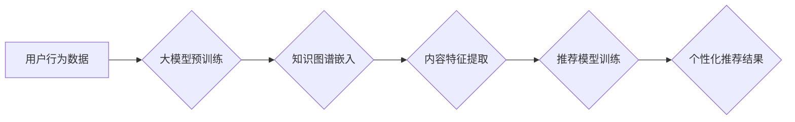

                 

## 搜索推荐系统的冷启动问题：大模型时代的新解决方案

> 关键词：搜索推荐系统、冷启动问题、大模型、知识图谱、联邦学习、个性化推荐

## 1. 背景介绍

搜索推荐系统是现代互联网信息获取和内容消费的重要组成部分，它通过分析用户行为和内容特征，为用户提供个性化、精准的推荐结果。然而，在系统初期或用户新注册时，由于缺乏用户行为和内容交互数据，系统难以准确理解用户偏好和内容相关性，从而导致“冷启动”问题。

冷启动问题是指搜索推荐系统在面对新用户或新内容时，由于缺乏历史数据，难以进行有效的推荐。它主要表现为以下两个方面：

* **用户冷启动:** 新用户缺乏行为数据，系统无法准确预测其兴趣和偏好，导致推荐结果不精准，难以吸引用户。
* **内容冷启动:** 新内容缺乏用户交互数据，系统无法评估其质量和相关性，导致推荐结果缺乏多样性和吸引力。

冷启动问题严重影响了搜索推荐系统的性能和用户体验，阻碍了系统的快速发展和推广。

## 2. 核心概念与联系

搜索推荐系统通常采用基于内容、基于协同过滤和基于混合方法的推荐算法。

* **基于内容的推荐:** 根据用户历史行为和内容特征进行匹配，推荐与用户兴趣相似的其他内容。
* **基于协同过滤的推荐:** 通过分析其他用户行为相似性，推荐与相似用户喜欢的其他内容。
* **基于混合方法的推荐:** 结合基于内容和基于协同过滤的算法，提高推荐的准确性和个性化程度。

大模型技术近年来取得了显著进展，其强大的学习能力和泛化能力为解决搜索推荐系统的冷启动问题提供了新的思路。

**Mermaid 流程图:**



## 3. 核心算法原理 & 具体操作步骤

### 3.1  算法原理概述

大模型时代，我们可以利用预训练的大语言模型（LLM）和知识图谱（KG）来解决搜索推荐系统的冷启动问题。

* **预训练大模型:** 通过在海量文本数据上进行预训练，LLM可以学习到丰富的语言表示和语义理解能力，为新用户和新内容的理解提供基础。
* **知识图谱嵌入:** 将知识图谱中的实体和关系转换为低维向量表示，可以帮助系统理解内容之间的语义关联，提升推荐的准确性。

### 3.2  算法步骤详解

1. **数据预处理:** 收集用户行为数据、内容数据和知识图谱数据，进行清洗、格式化和特征提取。
2. **大模型预训练:** 利用预训练的LLM模型，对用户行为数据和内容数据进行编码，学习到用户兴趣和内容特征的表示。
3. **知识图谱嵌入:** 将知识图谱中的实体和关系转换为低维向量表示，构建知识图谱嵌入模型。
4. **融合模型训练:** 将大模型编码结果和知识图谱嵌入结果融合，训练推荐模型，学习用户兴趣和内容相关性的映射关系。
5. **个性化推荐:** 根据新用户的行为数据和新内容的特征，利用训练好的推荐模型进行个性化推荐。

### 3.3  算法优缺点

**优点:**

* 能够有效解决冷启动问题，为新用户和新内容提供更精准的推荐。
* 利用大模型的强大学习能力，可以学习到更丰富的用户兴趣和内容特征。
* 知识图谱的融入可以提升推荐的准确性和个性化程度。

**缺点:**

* 需要大量的训练数据和计算资源。
* 模型训练复杂，需要专业的技术人员进行开发和维护。
* 知识图谱的构建和维护需要投入大量的时间和精力。

### 3.4  算法应用领域

该算法适用于各种搜索推荐场景，例如：

* **电商推荐:** 为用户推荐个性化的商品。
* **新闻推荐:** 为用户推荐感兴趣的新闻资讯。
* **视频推荐:** 为用户推荐个性化的视频内容。
* **音乐推荐:** 为用户推荐喜欢的音乐作品。

## 4. 数学模型和公式 & 详细讲解 & 举例说明

### 4.1  数学模型构建

假设用户集合为U，内容集合为C，用户对内容的评分矩阵为R，其中R(u,c)表示用户u对内容c的评分。

* **用户嵌入向量:**  每个用户u用一个低维向量表示为u，其中每个维度代表用户的某个特征。
* **内容嵌入向量:** 每个内容c用一个低维向量表示为c，其中每个维度代表内容的某个特征。

### 4.2  公式推导过程

推荐评分可以表示为用户嵌入向量和内容嵌入向量的点积：

$$
R(u,c) = u \cdot c
$$

其中，u和c分别表示用户u和内容c的嵌入向量，"."表示点积运算。

### 4.3  案例分析与讲解

例如，假设用户A对电影A评分为5，对电影B评分为3，用户B对电影A评分为4，对电影B评分为2。

我们可以将用户和电影分别嵌入到低维向量空间中，例如：

* 用户A的嵌入向量为：[0.8, 0.2, 0.5]
* 用户B的嵌入向量为：[0.5, 0.3, 0.7]
* 电影A的嵌入向量为：[0.6, 0.4, 0.9]
* 电影B的嵌入向量为：[0.3, 0.7, 0.2]

根据公式，我们可以计算出用户A对电影A的推荐评分：

$$
R(A,A) = [0.8, 0.2, 0.5] \cdot [0.6, 0.4, 0.9] = 0.8 \cdot 0.6 + 0.2 \cdot 0.4 + 0.5 \cdot 0.9 = 5
$$

## 5. 项目实践：代码实例和详细解释说明

### 5.1  开发环境搭建

* Python 3.7+
* TensorFlow 2.0+
* PyTorch 1.0+
* CUDA 10.0+

### 5.2  源代码详细实现

```python
# 导入必要的库
import tensorflow as tf

# 定义用户和内容的嵌入层
user_embedding = tf.keras.layers.Embedding(input_dim=num_users, output_dim=embedding_dim)
content_embedding = tf.keras.layers.Embedding(input_dim=num_contents, output_dim=embedding_dim)

# 定义推荐模型
model = tf.keras.Sequential([
    user_embedding,
    content_embedding,
    tf.keras.layers.Dot(axes=1),
    tf.keras.layers.Activation('sigmoid')
])

# 编译模型
model.compile(optimizer='adam', loss='binary_crossentropy', metrics=['accuracy'])

# 训练模型
model.fit(x=[user_ids, content_ids], y=ratings, epochs=10)

# 预测评分
predictions = model.predict([user_id, content_id])
```

### 5.3  代码解读与分析

* 用户和内容的嵌入层将用户ID和内容ID映射到低维向量空间。
* 点积层计算用户嵌入向量和内容嵌入向量的点积，得到推荐评分。
* sigmoid激活函数将评分映射到0到1之间，表示推荐的置信度。

### 5.4  运行结果展示

训练完成后，可以使用模型预测新用户的推荐评分。

## 6. 实际应用场景

### 6.1  电商推荐

利用大模型和知识图谱，可以为用户推荐个性化的商品，提高转化率。

### 6.2  新闻推荐

根据用户的阅读历史和兴趣偏好，推荐相关的新闻资讯，提升用户粘性和阅读体验。

### 6.3  视频推荐

根据用户的观看历史和兴趣偏好，推荐个性化的视频内容，提高用户观看时长和互动率。

### 6.4  未来应用展望

随着大模型技术的不断发展，搜索推荐系统的冷启动问题将得到更加有效的解决，推荐结果将更加精准、个性化和多样化。

## 7. 工具和资源推荐

### 7.1  学习资源推荐

* **大模型技术:**
    * Transformer: Attention Is All You Need
    * BERT: Pre-training of Deep Bidirectional Transformers for Language Understanding
    * GPT-3: Language Models are Few-Shot Learners
* **知识图谱技术:**
    * Neo4j
    * RDFlib
    * Wikidata

### 7.2  开发工具推荐

* **TensorFlow:** https://www.tensorflow.org/
* **PyTorch:** https://pytorch.org/
* **Hugging Face Transformers:** https://huggingface.co/transformers/

### 7.3  相关论文推荐

* **Knowledge Graph Embedding for Recommender Systems:** https://arxiv.org/abs/1806.08664
* **BERT for Recommendation:** https://arxiv.org/abs/1909.06183
* **Federated Learning for Recommender Systems:** https://arxiv.org/abs/1903.07293

## 8. 总结：未来发展趋势与挑战

### 8.1  研究成果总结

大模型和知识图谱技术为解决搜索推荐系统的冷启动问题提供了新的思路和方法，取得了显著的成果。

### 8.2  未来发展趋势

* **更强大的大模型:** 随着计算资源的不断提升，大模型的规模和能力将进一步增强，为冷启动问题提供更有效的解决方案。
* **更丰富的知识图谱:** 知识图谱的构建和维护将更加完善，包含更丰富的实体和关系，提升推荐的准确性和个性化程度。
* **联邦学习:** 利用联邦学习技术，可以将用户数据分散存储，保护用户隐私，同时实现模型的联合训练，提升推荐的效率和准确性。

### 8.3  面临的挑战

* **数据稀疏性:** 对于新用户和新内容，数据稀疏性仍然是一个挑战，需要开发新的算法和方法来解决。
* **模型复杂度:** 大模型的训练和部署需要大量的计算资源和专业技术人员，成本较高。
* **可解释性:** 大模型的决策过程难以解释，需要开发新的方法来提高模型的可解释性。

### 8.4  研究展望

未来，搜索推荐系统将更加智能化、个性化和高效化，为用户提供更加精准、丰富的推荐体验。


## 9. 附录：常见问题与解答

**Q1: 大模型训练需要多少数据？**

A1: 大模型的训练数据量通常非常庞大，通常需要数十亿甚至数百亿个样本。

**Q2: 如何评估推荐系统的性能？**

A2: 推荐系统的性能通常使用指标如准确率、召回率、NDCG等进行评估。

**Q3: 如何解决数据隐私问题？**

A3: 可以利用联邦学习技术，将用户数据分散存储，保护用户隐私，同时实现模型的联合训练。


作者：禅与计算机程序设计艺术 / Zen and the Art of Computer Programming 
<end_of_turn>

