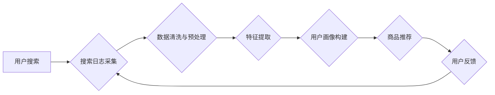

                 

## 搜索日志分析:AI电商的行为洞察

> 关键词：搜索日志分析、电商行为洞察、推荐系统、机器学习、自然语言处理、用户画像、数据挖掘

### 1. 背景介绍

在当今数据爆炸的时代，电商平台积累了海量的用户搜索日志数据。这些数据蕴含着丰富的用户行为信息，是理解用户需求、优化产品推荐和提升用户体验的关键资源。搜索日志分析作为一种数据挖掘技术，通过对搜索日志进行深入分析，可以挖掘出用户兴趣、偏好、购买意图等关键信息，为电商平台提供数据驱动的决策支持。

传统电商平台的搜索推荐系统主要依赖于商品属性和用户历史购买记录等静态数据，缺乏对用户动态行为的捕捉和分析。而搜索日志分析则可以弥补这一不足，通过分析用户搜索词、搜索频率、搜索时间等动态信息，构建更精准的用户画像，从而实现更个性化、更有效的商品推荐。

### 2. 核心概念与联系

搜索日志分析的核心概念包括：

* **搜索日志:** 用户在电商平台进行搜索时产生的记录，包含搜索词、搜索时间、用户ID、IP地址等信息。
* **用户画像:** 通过分析用户搜索行为，构建用户兴趣、偏好、购买习惯等特征的描述。
* **商品推荐:** 根据用户画像和商品信息，推荐用户可能感兴趣的商品。
* **机器学习:** 利用算法从数据中学习模式，提高搜索推荐的准确性和个性化程度。
* **自然语言处理:** 对搜索词进行分析和理解，提取关键词、语义信息等。

**搜索日志分析流程图:**



### 3. 核心算法原理 & 具体操作步骤

#### 3.1  算法原理概述

搜索日志分析常用的算法包括：

* **关键词提取:** 利用TF-IDF、LDA等算法，从搜索词中提取出重要的关键词。
* **聚类分析:** 将用户搜索行为进行聚类，识别用户兴趣相似群组。
* **协同过滤:** 根据用户历史搜索行为和商品购买记录，预测用户对商品的兴趣。
* **深度学习:** 利用神经网络模型，从搜索日志中学习更复杂的模式，提高推荐效果。

#### 3.2  算法步骤详解

以关键词提取为例，具体操作步骤如下：

1. **数据预处理:** 对搜索日志数据进行清洗，去除停用词、标点符号等无用信息，并将搜索词转换为标准形式。
2. **TF-IDF计算:** 计算每个关键词在每个文档（用户搜索记录）中的重要性，TF-IDF值越高，关键词在该文档中的重要性越高。
3. **关键词筛选:** 根据TF-IDF值，筛选出重要关键词，作为用户兴趣的代表。

#### 3.3  算法优缺点

**TF-IDF算法:**

* **优点:** 简单易实现，能够有效提取关键词。
* **缺点:** 无法捕捉关键词之间的语义关系，对长尾关键词的识别能力较弱。

#### 3.4  算法应用领域

关键词提取算法广泛应用于搜索引擎优化、信息检索、文本分类等领域。

### 4. 数学模型和公式 & 详细讲解 & 举例说明

#### 4.1  数学模型构建

**TF-IDF模型:**

$$TF(t,d) = \frac{f(t,d)}{\sum_{t' \in d} f(t',d)}$$

$$IDF(t) = \log \frac{N}{df(t)}$$

$$TF-IDF(t,d) = TF(t,d) \times IDF(t)$$

其中：

* $t$：关键词
* $d$：文档
* $f(t,d)$：关键词 $t$ 在文档 $d$ 中出现的频率
* $N$：文档总数
* $df(t)$：关键词 $t$ 在所有文档中出现的文档数

#### 4.2  公式推导过程

* **TF(t,d):** 计算关键词 $t$ 在文档 $d$ 中的词频，即关键词 $t$ 在文档 $d$ 中出现的次数除以文档 $d$ 中所有关键词的总次数。
* **IDF(t):** 计算关键词 $t$ 在所有文档中的逆向文档频率，即所有文档数除以关键词 $t$ 出现的文档数的对数。IDF值越大，关键词 $t$ 在所有文档中的稀疏性越高，表示该关键词越重要。
* **TF-IDF(t,d):** 将关键词 $t$ 在文档 $d$ 中的词频和逆向文档频率相乘，得到关键词 $t$ 在文档 $d$ 中的权重。

#### 4.3  案例分析与讲解

假设有三个文档，分别包含关键词 "苹果"、"香蕉"、"橙子"，每个关键词出现的频率如下：

* 文档1: 苹果(2), 香蕉(1), 橙子(1)
* 文档2: 苹果(1), 香蕉(3), 橙子(0)
* 文档3: 苹果(0), 香蕉(0), 橙子(2)

根据上述公式，可以计算出每个关键词的TF-IDF值，并筛选出重要关键词。

### 5. 项目实践：代码实例和详细解释说明

#### 5.1  开发环境搭建

* Python 3.x
* Numpy
* Scikit-learn
* Gensim

#### 5.2  源代码详细实现

```python
import nltk
from nltk.corpus import stopwords
from sklearn.feature_extraction.text import TfidfVectorizer

# 下载停用词列表
nltk.download('stopwords')

# 搜索日志数据
search_logs = [
    "苹果手机",
    "华为手机",
    "小米手机",
    "苹果电脑",
    "三星手机",
    "笔记本电脑"
]

# 停用词列表
stop_words = set(stopwords.words('english'))

# 数据预处理
processed_logs = []
for log in search_logs:
    words = nltk.word_tokenize(log.lower())
    filtered_words = [word for word in words if word not in stop_words and word.isalnum()]
    processed_logs.append(" ".join(filtered_words))

# TF-IDF向量化
vectorizer = TfidfVectorizer()
tfidf_matrix = vectorizer.fit_transform(processed_logs)

# 打印TF-IDF矩阵
print(tfidf_matrix.toarray())

# 获取每个关键词的TF-IDF值
feature_names = vectorizer.get_feature_names_out()
for i, log in enumerate(processed_logs):
    print(f"Log: {log}")
    for j, feature in enumerate(feature_names):
        print(f"Keyword: {feature}, TF-IDF: {tfidf_matrix[i, j]}")
```

#### 5.3  代码解读与分析

* 代码首先下载停用词列表，并对搜索日志数据进行预处理，去除停用词和非字母字符。
* 然后使用Scikit-learn库中的TfidfVectorizer类进行TF-IDF向量化，将文本数据转换为数值矩阵。
* 最后打印TF-IDF矩阵，并根据矩阵中的值，获取每个关键词的TF-IDF值。

#### 5.4  运行结果展示

运行代码后，会输出TF-IDF矩阵和每个关键词的TF-IDF值。

### 6. 实际应用场景

搜索日志分析在电商平台的实际应用场景包括：

* **商品推荐:** 根据用户搜索行为，推荐用户可能感兴趣的商品。
* **搜索结果优化:** 分析用户搜索词和点击行为，优化搜索结果排名和展示方式。
* **用户画像构建:** 通过分析用户搜索行为，构建用户兴趣、偏好、购买习惯等特征的描述，为个性化营销提供数据支持。
* **新产品开发:** 分析用户搜索趋势，挖掘潜在的市场需求，为新产品开发提供参考。

### 6.4  未来应用展望

随着人工智能技术的不断发展，搜索日志分析将在未来得到更广泛的应用，例如：

* **多模态搜索:** 将文本搜索与图像、视频等多模态数据结合，实现更精准的搜索结果。
* **个性化搜索:** 基于用户历史行为、兴趣偏好等信息，提供个性化的搜索结果和推荐。
* **实时搜索分析:** 实时分析用户搜索行为，及时调整商品推荐和搜索结果，提高用户体验。

### 7. 工具和资源推荐

#### 7.1  学习资源推荐

* **书籍:**
    * "Mining the Social Web" by Matthew A. Russell
    * "Text Mining: Predictive Methods for Analyzing Textual Data" by David M. Powers
* **在线课程:**
    * Coursera: Natural Language Processing Specialization
    * edX: Data Science Fundamentals

#### 7.2  开发工具推荐

* **Python:** 广泛应用于数据分析和机器学习领域，拥有丰富的库和工具。
* **Spark:** 用于大规模数据处理的开源框架，可以处理海量搜索日志数据。
* **Elasticsearch:** 用于搜索和分析数据的开源平台，可以快速检索和分析搜索日志数据。

#### 7.3  相关论文推荐

* "A Survey on Search Log Analysis" by Y. Wang et al.
* "Personalized Search Recommendation Based on User Search Logs" by J. Li et al.
* "Deep Learning for Search Log Analysis" by X. Zhang et al.

### 8. 总结：未来发展趋势与挑战

#### 8.1  研究成果总结

搜索日志分析技术在电商平台的应用取得了显著成果，为商品推荐、搜索结果优化、用户画像构建等方面提供了数据驱动的决策支持。

#### 8.2  未来发展趋势

未来搜索日志分析技术将朝着以下方向发展：

* **更精准的推荐:** 利用深度学习等先进算法，构建更精准的用户画像，实现更个性化的商品推荐。
* **多模态搜索:** 将文本搜索与图像、视频等多模态数据结合，实现更全面的搜索体验。
* **实时搜索分析:** 实时分析用户搜索行为，及时调整商品推荐和搜索结果，提高用户体验。

#### 8.3  面临的挑战

搜索日志分析技术也面临一些挑战：

* **数据质量:** 搜索日志数据可能存在噪声、缺失值等问题，需要进行有效的数据清洗和预处理。
* **隐私保护:** 搜索日志数据包含用户隐私信息，需要采取措施保护用户隐私。
* **算法复杂度:** 一些先进的算法，例如深度学习算法，计算复杂度较高，需要强大的计算资源支持。

#### 8.4  研究展望

未来，搜索日志分析技术将继续发展，为电商平台提供更智能、更精准的决策支持，提升用户体验。


### 9. 附录：常见问题与解答

* **Q1: 如何处理搜索日志数据中的噪声和缺失值？**

* **A1:** 可以使用数据清洗和预处理技术，例如去除停用词、标点符号、HTML标签等，以及对缺失值进行填充或删除。

* **Q2: 如何保护用户隐私？**

* **A2:** 可以采用数据匿名化、差分隐私等技术，保护用户隐私信息。

* **Q3: 如何选择合适的搜索日志分析算法？**

* **A3:** 需要根据具体应用场景和数据特点选择合适的算法。例如，对于关键词提取，可以使用TF-IDF算法；对于用户画像构建，可以使用聚类分析算法。


作者：禅与计算机程序设计艺术 / Zen and the Art of Computer Programming 
<end_of_turn>

