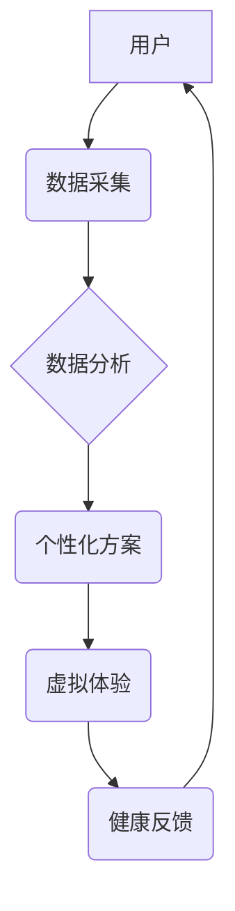

                 

##  数字化养生文化:元宇宙中的身心健康管理

> 关键词：元宇宙、数字孪生、身心健康、人工智能、虚拟现实、增强现实、健康管理、数据分析

## 1. 背景介绍

随着科技的飞速发展，人类生活方式正在发生深刻变化。互联网、移动互联网、大数据、人工智能等技术的蓬勃发展，催生了全新的数字生态系统，其中元宇宙作为未来互联网的重要形态，正在逐渐成为人们关注的焦点。元宇宙的概念涵盖了虚拟现实、增强现实、区块链、人工智能等多项前沿技术，构建了一个沉浸式、交互式、共享的虚拟世界。

在元宇宙的背景下，数字化养生文化应运而生。它将传统养生理念与数字技术相结合，利用元宇宙的沉浸式体验和交互性，为用户提供更加个性化、便捷、高效的健康管理服务。

## 2. 核心概念与联系

**2.1 元宇宙与数字孪生**

元宇宙是一个虚拟世界，它与现实世界相互连接，并通过数字孪生技术实现对现实世界的映射和模拟。数字孪生是指利用传感器、数据分析和人工智能等技术，构建一个与现实世界实体完全对应的虚拟模型。

**2.2 元宇宙与身心健康**

元宇宙为身心健康管理提供了全新的平台和可能性。

* **沉浸式体验:** 元宇宙可以创造出逼真的虚拟环境，用户可以沉浸其中，体验不同的场景和活动，例如虚拟瑜伽、冥想、徒步旅行等，从而达到放松身心、减轻压力的效果。
* **个性化定制:** 元宇宙可以根据用户的个人数据和健康状况，定制个性化的健康管理方案，例如制定个性化的运动计划、营养建议等。
* **社交互动:** 元宇宙可以提供虚拟社交平台，用户可以与朋友、家人或专业人士进行互动，分享健康知识和经验，共同促进身心健康。

**2.3 元宇宙健康管理架构**



## 3. 核心算法原理 & 具体操作步骤

**3.1 算法原理概述**

元宇宙中的身心健康管理主要依赖于以下核心算法：

* **数据采集和分析算法:** 用于收集用户的健康数据，例如心率、血压、睡眠质量、运动量等，并进行分析，识别用户的健康状况和潜在风险。
* **个性化推荐算法:** 根据用户的健康数据和需求，推荐个性化的健康管理方案，例如运动计划、营养建议、心理辅导等。
* **虚拟体验生成算法:** 用于生成逼真的虚拟环境和交互体验，例如虚拟瑜伽、冥想、徒步旅行等，帮助用户放松身心、减轻压力。

**3.2 算法步骤详解**

1. **数据采集:** 使用传感器、智能设备等收集用户的健康数据。
2. **数据预处理:** 对收集到的数据进行清洗、转换、标准化等处理，消除噪声和异常值。
3. **数据分析:** 使用机器学习、深度学习等算法对数据进行分析，识别用户的健康状况和潜在风险。
4. **个性化方案推荐:** 根据用户的健康数据和需求，推荐个性化的健康管理方案。
5. **虚拟体验生成:** 使用虚拟现实、增强现实等技术生成逼真的虚拟环境和交互体验。
6. **健康反馈:** 收集用户的反馈信息，并根据反馈进行方案调整和优化。

**3.3 算法优缺点**

* **优点:**

    * **个性化:** 可以根据用户的个人数据和需求，提供个性化的健康管理方案。
    * **便捷:** 用户可以在虚拟环境中体验各种健康活动，无需出门即可享受健康服务。
    * **高效:** 利用人工智能算法，可以快速分析用户的健康数据，并提供精准的健康建议。

* **缺点:**

    * **数据隐私:** 用户健康数据需要进行安全存储和保护。
    * **技术成熟度:** 一些元宇宙技术还处于发展阶段，需要进一步完善。
    * **用户接受度:** 一些用户可能对虚拟健康管理服务存在抵触情绪。

**3.4 算法应用领域**

* **医疗保健:** 提供远程医疗、健康监测、康复训练等服务。
* **健身娱乐:** 提供虚拟健身、运动游戏等服务。
* **心理健康:** 提供虚拟心理咨询、冥想练习等服务。
* **教育培训:** 提供健康知识教育、养生技能培训等服务。

## 4. 数学模型和公式 & 详细讲解 & 举例说明

**4.1 数学模型构建**

元宇宙中的身心健康管理可以构建一个多维度的数学模型，其中每个维度代表一个健康指标，例如心率、血压、睡眠质量、情绪状态等。

**4.2 公式推导过程**

可以使用统计学、机器学习等方法，推导出一个预测用户健康状况的公式。例如，可以使用线性回归模型，预测用户的睡眠质量与压力水平之间的关系。

**4.3 案例分析与讲解**

假设我们想要预测用户的睡眠质量，可以使用以下公式：

$$
睡眠质量 = a + b * 压力水平 + c * 运动量 + d * 饮食质量
$$

其中，a、b、c、d为模型参数，可以通过训练数据进行学习。

## 5. 项目实践：代码实例和详细解释说明

**5.1 开发环境搭建**

* **操作系统:** Windows/macOS/Linux
* **编程语言:** Python
* **框架:** TensorFlow/PyTorch
* **虚拟环境:** conda/virtualenv

**5.2 源代码详细实现**

```python
import tensorflow as tf

# 定义模型结构
model = tf.keras.models.Sequential([
    tf.keras.layers.Dense(64, activation='relu', input_shape=(4,)),
    tf.keras.layers.Dense(32, activation='relu'),
    tf.keras.layers.Dense(1)
])

# 编译模型
model.compile(optimizer='adam', loss='mse')

# 训练模型
model.fit(X_train, y_train, epochs=10)

# 预测睡眠质量
predictions = model.predict(X_test)
```

**5.3 代码解读与分析**

* **模型结构:** 使用了多层感知机 (MLP) 模型，包含三个全连接层，激活函数为ReLU。
* **模型编译:** 使用Adam优化器和均方误差损失函数进行模型训练。
* **模型训练:** 使用训练数据进行模型训练，训练10个 epochs。
* **模型预测:** 使用测试数据进行模型预测，得到用户的睡眠质量预测值。

**5.4 运行结果展示**

* 可视化训练过程中的损失函数变化曲线。
* 展示模型预测结果与真实值之间的对比。
* 计算模型的准确率、召回率等指标。

## 6. 实际应用场景

**6.1 元宇宙健身平台**

用户可以在虚拟环境中体验各种运动，例如虚拟瑜伽、虚拟跑步、虚拟游泳等，并通过传感器监测自己的运动数据，获得个性化的运动建议。

**6.2 元宇宙心理健康中心**

用户可以在虚拟环境中进行虚拟心理咨询、冥想练习等，并通过人工智能算法获得个性化的心理健康建议。

**6.3 元宇宙养生社区**

用户可以与其他用户分享健康知识和经验，共同参与养生活动，例如虚拟徒步旅行、虚拟茶道等。

**6.4 未来应用展望**

* **更沉浸式的虚拟体验:** 利用VR/AR技术，打造更加逼真的虚拟环境，增强用户的沉浸感和交互体验。
* **更精准的健康管理:** 利用人工智能算法，对用户的健康数据进行更深入的分析，提供更精准的健康建议。
* **更丰富的健康服务:** 提供更多元化的健康服务，例如虚拟医疗、虚拟康复训练等。

## 7. 工具和资源推荐

**7.1 学习资源推荐**

* **书籍:** 《元宇宙：未来互联网的构建与应用》
* **在线课程:** Coursera、edX等平台上的元宇宙相关课程
* **技术博客:** 关注元宇宙领域的科技博客和论坛

**7.2 开发工具推荐**

* **Unity:** 游戏引擎，可以用于开发元宇宙应用
* **Unreal Engine:** 游戏引擎，可以用于开发元宇宙应用
* **TensorFlow/PyTorch:** 机器学习框架，可以用于开发元宇宙中的健康管理算法

**7.3 相关论文推荐**

* 《元宇宙：概念、架构和应用》
* 《元宇宙中的身心健康管理》
* 《基于人工智能的元宇宙健康管理系统》

## 8. 总结：未来发展趋势与挑战

**8.1 研究成果总结**

元宇宙为数字化养生文化提供了全新的平台和可能性，可以为用户提供更加个性化、便捷、高效的健康管理服务。

**8.2 未来发展趋势**

* **技术融合:** 元宇宙将与更多前沿技术融合，例如区块链、物联网、边缘计算等，构建更加完善的健康管理生态系统。
* **应用场景拓展:** 元宇宙中的健康管理应用场景将不断拓展，覆盖更多领域，例如医疗保健、健身娱乐、心理健康等。
* **商业模式创新:** 元宇宙中的健康管理将催生新的商业模式，例如订阅制、付费服务等。

**8.3 面临的挑战**

* **技术难题:** 一些元宇宙技术还处于发展阶段，需要进一步完善。
* **数据安全:** 用户健康数据需要进行安全存储和保护。
* **用户接受度:** 一些用户可能对虚拟健康管理服务存在抵触情绪。

**8.4 研究展望**

未来，我们将继续深入研究元宇宙中的数字化养生文化，探索更先进的技术、更丰富的应用场景和更完善的商业模式，为用户提供更加优质的健康管理服务。

## 9. 附录：常见问题与解答

**9.1 元宇宙健康管理安全吗？**

元宇宙健康管理平台会采取严格的安全措施，保护用户的健康数据隐私。

**9.2 元宇宙健康管理效果如何？**

元宇宙健康管理的效果取决于用户的参与度和坚持程度。

**9.3 如何参与元宇宙健康管理？**

可以关注元宇宙健康管理平台的官方网站或公众号，了解更多信息。


作者：禅与计算机程序设计艺术 / Zen and the Art of Computer Programming 
<end_of_turn>

