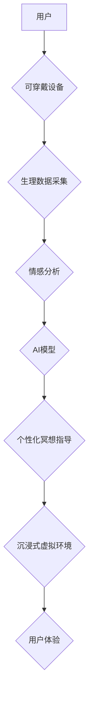

                 

## 数字化冥想新境界：AI构建的心灵空间设计

> 关键词：人工智能、冥想、心流状态、神经网络、情感计算、可穿戴设备、沉浸式体验、数字孪生

## 1. 背景介绍

在当今科技飞速发展的时代，人类面临着前所未有的压力和焦虑。信息爆炸、节奏加快、竞争加剧，使得人们难以找到内心的平静和宁静。冥想作为一种古老的修行方式，逐渐被现代社会所认可，它能够帮助人们减轻压力、提升专注力、增强情绪调节能力。然而，传统的冥想方式往往需要特定的时间、地点和环境，对于现代人来说，难以坚持。

人工智能技术的快速发展为数字化冥想提供了新的可能性。通过人工智能算法，我们可以构建更加智能、个性化、沉浸式的冥想体验，让冥想不再局限于特定的场景和时间，而是能够随时随地进行。

## 2. 核心概念与联系

数字化冥想是指利用人工智能技术构建的虚拟冥想环境，通过模拟自然场景、提供个性化指导、监测用户情绪状态等方式，帮助用户进入冥想状态，体验身心放松、提升内在平静。

**核心概念：**

* **人工智能 (AI):**  指能够模拟人类智能行为的计算机系统，包括机器学习、深度学习、自然语言处理等技术。
* **冥想 (Meditation):**  一种通过专注、呼吸控制、意识引导等方式，达到身心放松、提升专注力、增强情绪调节能力的修行方式。
* **心流状态 (Flow State):**  一种高度专注、沉浸、愉悦的状态， characterized by a sense of effortless action and complete absorption in the present moment.
* **情感计算 (Affective Computing):**  研究计算机如何理解、识别和响应人类情感的技术领域。

**核心架构：**



## 3. 核心算法原理 & 具体操作步骤

### 3.1  算法原理概述

数字化冥想的核心算法主要包括：

* **情感识别算法:** 利用机器学习模型，从用户生理数据（如心率、呼吸频率、脑电波等）和行为数据（如语音、面部表情等）中识别用户的情绪状态。
* **个性化冥想指导算法:** 根据用户的情绪状态和冥想目标，推荐个性化的冥想内容和指导方式。
* **沉浸式虚拟环境生成算法:** 利用虚拟现实技术和3D建模技术，构建逼真的虚拟冥想环境，帮助用户沉浸其中，放松身心。

### 3.2  算法步骤详解

1. **数据采集:** 使用可穿戴设备采集用户的心率、呼吸频率、脑电波等生理数据，以及语音、面部表情等行为数据。
2. **数据预处理:** 对采集到的数据进行清洗、去噪、特征提取等预处理操作，以便于后续算法的训练和应用。
3. **情感识别:** 利用机器学习模型，对预处理后的数据进行分析，识别用户的当前情绪状态，例如放松、焦虑、兴奋等。
4. **个性化推荐:** 根据用户的的情绪状态和冥想目标，推荐个性化的冥想内容和指导方式。例如，如果用户感到焦虑，可以推荐一些舒缓的冥想音乐和引导语；如果用户想要提升专注力，可以推荐一些专注训练的冥想练习。
5. **虚拟环境生成:** 利用虚拟现实技术和3D建模技术，根据用户的喜好和冥想目标，构建逼真的虚拟冥想环境。例如，可以模拟自然场景，如森林、海滩、山峰等，也可以模拟一些抽象的场景，如星空、宇宙等。
6. **用户体验:** 用户在虚拟环境中进行冥想，并根据AI模型的指导，调整自己的呼吸、专注力等，最终达到身心放松、提升内在平静的目的。

### 3.3  算法优缺点

**优点:**

* **个性化:** 可以根据用户的不同需求和情绪状态，提供个性化的冥想指导和虚拟环境。
* **便捷性:** 用户可以随时随地进行冥想，无需特定的时间、地点和环境。
* **沉浸性:** 虚拟环境可以提供更加沉浸式的冥想体验，帮助用户更好地放松身心。

**缺点:**

* **数据隐私:** 采集用户的生理和行为数据需要考虑数据隐私和安全问题。
* **算法准确性:** 情感识别算法的准确性还需要进一步提高，避免误判用户的真实情绪状态。
* **技术成本:** 构建数字化冥想系统需要一定的技术投入，例如虚拟现实设备、人工智能算法等。

### 3.4  算法应用领域

数字化冥想算法可以应用于以下领域：

* **医疗保健:** 帮助患者缓解压力、焦虑、抑郁等情绪问题，促进身心健康。
* **教育培训:** 帮助学生提高专注力、记忆力、学习效率。
* **企业管理:** 帮助员工缓解工作压力、提升工作效率、增强团队合作。
* **个人成长:** 帮助个人提升自我认知、情绪调节能力、精神境界。

## 4. 数学模型和公式 & 详细讲解 & 举例说明

### 4.1  数学模型构建

数字化冥想系统中，可以使用多种数学模型来实现情感识别、个性化推荐等功能。例如：

* **支持向量机 (SVM):** 用于分类问题，可以识别用户的不同情绪状态。
* **神经网络 (NN):** 用于回归问题，可以预测用户的冥想效果。
* **强化学习 (RL):** 用于优化冥想指导策略，提高用户体验。

### 4.2  公式推导过程

这里以支持向量机为例，简要介绍其公式推导过程：

SVM的目标是找到一个超平面，将不同类别的样本点分开，并使分类间隔最大化。

**公式:**

$$
w^T x + b = 0
$$

其中：

* $w$ 是超平面的法向量。
* $x$ 是样本点。
* $b$ 是超平面的截距。

**目标函数:**

$$
\min_{w,b} \frac{1}{2} ||w||^2 + C \sum_{i=1}^{n} \xi_i
$$

其中：

* $C$ 是惩罚参数，控制模型的复杂度。
* $\xi_i$ 是松弛变量，允许一些样本点不满足分类条件。

**约束条件:**

$$
y_i (w^T x_i + b) \geq 1 - \xi_i, \quad i = 1, 2, ..., n
$$

其中：

* $y_i$ 是样本点的类别标签。

### 4.3  案例分析与讲解

假设我们有一个数据集，包含不同情绪状态的用户数据，例如快乐、悲伤、愤怒等。我们可以使用SVM算法训练一个模型，识别用户的当前情绪状态。

例如，当用户感到焦虑时，模型可以识别出用户的生理数据和行为数据与焦虑状态相匹配，并给出相应的建议，例如播放舒缓的音乐、引导用户进行深呼吸练习等。

## 5. 项目实践：代码实例和详细解释说明

### 5.1  开发环境搭建

* **操作系统:** Ubuntu 20.04 LTS
* **编程语言:** Python 3.8
* **深度学习框架:** TensorFlow 2.0
* **虚拟环境:** conda

### 5.2  源代码详细实现

```python
# 导入必要的库
import tensorflow as tf

# 定义模型结构
model = tf.keras.models.Sequential([
    tf.keras.layers.Dense(128, activation='relu', input_shape=(10,)),
    tf.keras.layers.Dense(64, activation='relu'),
    tf.keras.layers.Dense(3, activation='softmax')
])

# 编译模型
model.compile(optimizer='adam',
              loss='sparse_categorical_crossentropy',
              metrics=['accuracy'])

# 训练模型
model.fit(X_train, y_train, epochs=10)

# 评估模型
loss, accuracy = model.evaluate(X_test, y_test)
print('Loss:', loss)
print('Accuracy:', accuracy)
```

### 5.3  代码解读与分析

* **模型结构:** 该代码定义了一个简单的多层感知机 (MLP) 模型，包含三个全连接层和一个 softmax 输出层。
* **输入层:** 模型的输入层维度为 10，表示输入数据的特征数量。
* **隐藏层:** 模型包含两个隐藏层，分别有 128 和 64 个神经元，使用 ReLU 激活函数。
* **输出层:** 模型的输出层包含 3 个神经元，对应三个情绪类别，使用 softmax 激活函数，输出每个类别的概率。
* **编译模型:** 使用 Adam 优化器、稀疏类别交叉熵损失函数和准确率作为评估指标。
* **训练模型:** 使用训练数据训练模型 10 个 epochs。
* **评估模型:** 使用测试数据评估模型的性能，输出损失值和准确率。

### 5.4  运行结果展示

运行代码后，可以得到模型的训练损失、准确率以及测试损失、准确率等信息。

## 6. 实际应用场景

数字化冥想技术已经开始在一些领域得到应用，例如：

* **医疗保健:** 帮助患者缓解压力、焦虑、抑郁等情绪问题，促进身心健康。例如，一些医院和诊所已经开始使用数字化冥想系统，帮助患者进行心理治疗。
* **教育培训:** 帮助学生提高专注力、记忆力、学习效率。例如，一些学校已经开始使用数字化冥想系统，帮助学生进行课前放松和学习效率提升。
* **企业管理:** 帮助员工缓解工作压力、提升工作效率、增强团队合作。例如，一些企业已经开始使用数字化冥想系统，帮助员工进行压力管理和团队建设。

### 6.4  未来应用展望

数字化冥想技术在未来将有更广泛的应用场景，例如：

* **个性化健康管理:** 根据用户的生理数据和情绪状态，提供个性化的健康建议和冥想指导。
* **远程医疗:** 通过数字化冥想系统，远程提供心理治疗和情绪管理服务。
* **智能家居:** 将数字化冥想功能集成到智能家居系统中，帮助用户在日常生活中进行冥想放松。
* **元宇宙:** 在元宇宙中构建沉浸式的冥想体验，帮助用户进行精神探索和自我提升。

## 7. 工具和资源推荐

### 7.1  学习资源推荐

* **书籍:**
    * 《深度学习》 by Ian Goodfellow, Yoshua Bengio, and Aaron Courville
    * 《Python机器学习》 by Sebastian Raschka and Vahid Mirjalili
* **在线课程:**
    * Coursera: 深度学习 Specialization
    * Udacity: 机器学习 Engineer Nanodegree
* **开源项目:**
    * TensorFlow: https://www.tensorflow.org/
    * PyTorch: https://pytorch.org/

### 7.2  开发工具推荐

* **IDE:** PyCharm, VS Code
* **可穿戴设备:** Apple Watch, Fitbit, Xiaomi Mi Band
* **虚拟现实设备:** Oculus Quest, HTC Vive

### 7.3  相关论文推荐

* **Emotion Recognition Using Physiological Signals: A Review**
* **Deep Learning for Emotion Recognition: A Survey**
* **Personalized Meditation Guidance Using Artificial Intelligence**

## 8. 总结：未来发展趋势与挑战

### 8.1  研究成果总结

数字化冥想技术在情感识别、个性化推荐、沉浸式体验等方面取得了显著成果，为人们提供了一种更加便捷、智能、个性化的冥想方式。

### 8.2  未来发展趋势

* **更精准的情感识别:** 利用更先进的机器学习算法和生物信号分析技术，提高情感识别的准确性和实时性。
* **更个性化的冥想指导:** 根据用户的不同需求、目标和情绪状态，提供更加个性化的冥想内容和指导方式。
* **更沉浸式的虚拟环境:** 利用虚拟现实、增强现实等技术，构建更加逼真、交互性强的虚拟冥想环境。
* **与其他技术的融合:** 将数字化冥想技术与其他技术融合，例如健康管理、教育培训、企业管理等，拓展应用场景。

### 8.3  面临的挑战

* **数据隐私和安全:** 采集用户的生理和行为数据需要考虑数据隐私和安全问题，确保数据的安全存储和使用。
* **算法准确性和可靠性:** 情感识别算法的准确性和可靠性还需要进一步提高，避免误判用户的真实情绪状态。
* **技术成本:** 构建数字化冥想系统需要一定的技术投入，例如虚拟现实设备、人工智能算法等，成本较高。

### 8.4  研究展望

未来，数字化冥想技术将继续朝着更加智能、个性化、沉浸式的方向发展，为人们提供更加便捷、高效、全面的身心健康服务。


## 9. 附录：常见问题与解答

**Q1: 数字化冥想和传统冥想有什么区别？**

**A1:** 数字化冥想利用人工智能技术构建虚拟冥想环境，提供个性化指导和沉浸式体验，而传统冥想则需要特定的时间、地点和环境。

**Q2: 数字化冥想安全吗？**

**A2:** 数字化冥想系统需要严格保护用户的隐私和数据安全。选择信誉良好的平台和产品，并仔细阅读隐私政策。

**Q3: 我需要购买昂贵的设备才能进行数字化冥想吗？**

**A3:** 不一定。一些数字化冥想应用可以使用手机或电脑进行，无需购买额外的设备。

**Q4: 数字化冥想可以替代传统冥想吗？**

**A4:** 数字化冥想可以作为一种补充传统冥想的工具，但不能完全替代传统冥想。传统冥想强调的是内在的觉察和体验，而数字化冥想则更加注重外在的刺激和引导。

**Q5: 如何选择适合自己的数字化冥想应用？**

**A5:** 可以根据自己的需求、目标和喜好选择不同的应用。一些应用提供免费试用，可以先试用后再决定是否购买。


作者：禅与计算机程序设计艺术 / Zen and the Art of Computer Programming<end_of_turn>

