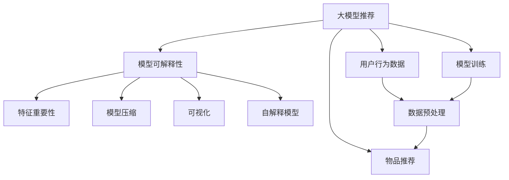

                 

# 大模型推荐中的模型可解释性增强技术探索

> 关键词：大模型推荐, 模型可解释性, 特征重要性, 模型压缩, 可视化, 自解释模型

## 1. 背景介绍

随着深度学习技术的迅猛发展，大模型在各个领域的应用越来越广泛，如自然语言处理、计算机视觉、推荐系统等。然而，大模型往往被视为"黑盒"，其内部决策过程难以理解和解释。这种"黑盒"特性，使得模型的可信度和可接受性受到质疑，尤其是对于一些关键应用场景，如医疗诊断、金融风控等，模型的可解释性至关重要。

推荐系统是深度学习的重要应用之一，通过对用户历史行为数据进行建模，为用户推荐可能感兴趣的物品。尽管推荐系统已经取得了巨大的成功，但如何提升推荐结果的可解释性，使其更加透明和可信，仍是当前研究的一个热点问题。在推荐系统研究中，模型可解释性增强技术的重要性不言而喻，通过赋予模型更强的可解释性，能够提升用户对系统的信任度，增强推荐效果的合理性和公平性。

## 2. 核心概念与联系

### 2.1 核心概念概述

要深入理解大模型推荐中的模型可解释性增强技术，首先需要理解几个核心概念：

- **大模型推荐**：基于大模型的推荐系统，通过使用预训练语言模型、视觉模型等大模型对用户行为进行建模，进行物品推荐。常用的模型包括BERT、GPT、ViT等。

- **模型可解释性**：指模型能够清楚地解释其决策过程，让用户理解推荐的逻辑和依据。这对于建立用户信任、提升推荐效果至关重要。

- **特征重要性**：通过分析模型内部特征的权重，判断哪些特征对预测结果有重要影响。这有助于理解模型决策的依据，提升推荐结果的公平性和合理性。

- **模型压缩**：通过去除冗余信息或降低模型复杂度，提高模型的推理速度和效率。常用的方法包括剪枝、量化、蒸馏等。

- **可视化**：通过图形、图表等方式将模型内部的信息直观展示，帮助用户理解和分析模型的决策过程。

- **自解释模型**：指能够自适应地生成解释信息，提升模型可解释性的模型。自解释模型通常会结合可解释性和性能，在保留高精度的同时，提供清晰的解释。

这些核心概念之间的逻辑关系可以通过以下Mermaid流程图来展示：



这个流程图展示了大模型推荐中的关键概念及其之间的关系：

1. 大模型推荐基于用户行为数据进行建模，进行物品推荐。
2. 模型可解释性、特征重要性、模型压缩、可视化、自解释模型等技术手段，用于增强推荐系统的透明性和可信度。
3. 数据预处理和模型训练是推荐系统的基础步骤，物品推荐是最终目标。

## 3. 核心算法原理 & 具体操作步骤
### 3.1 算法原理概述

在推荐系统中，模型可解释性增强技术的核心思想是：通过分析模型内部特征的权重、重要性以及推理过程，使得用户能够理解模型的决策依据，提升推荐结果的可信度和合理性。常见的方法包括特征重要性分析、模型压缩、可视化、自解释模型等。

具体来说，特征重要性分析通过计算模型中各个特征的权重，判断哪些特征对预测结果有重要影响，帮助用户理解模型的决策逻辑。模型压缩通过去除冗余信息或降低模型复杂度，提升模型的推理速度和效率。可视化通过图形、图表等方式将模型内部的信息直观展示，帮助用户理解和分析模型的决策过程。自解释模型通过生成解释信息，提升模型的可解释性和性能。

### 3.2 算法步骤详解

以下将详细介绍大模型推荐中常用的模型可解释性增强技术，包括特征重要性分析、模型压缩、可视化、自解释模型等。

#### 3.2.1 特征重要性分析

特征重要性分析通过计算模型中各个特征的权重，判断哪些特征对预测结果有重要影响。常用的方法包括LIME、SHAP、Anchors等。

**LIME方法**：

1. 对模型进行局部拟合，即使用随机森林、线性回归等模型，对模型在每个样本上的预测结果进行拟合。
2. 计算模型在每个样本上的预测值与拟合值的差距，即局部误差。
3. 计算每个特征对局部误差的贡献，得到特征重要性。

**SHAP方法**：

1. 对模型进行全局拟合，即使用线性模型拟合整个训练集。
2. 计算每个特征在模型中贡献的平均分值。
3. 将每个特征贡献的平均分值累加，得到特征的重要性。

**Anchors方法**：

1. 在每个样本上随机选择一个固定大小的特征子集。
2. 使用局部线性模型拟合模型在子集上的预测结果。
3. 计算子集内每个特征对预测结果的贡献，得到特征重要性。

#### 3.2.2 模型压缩

模型压缩通过去除冗余信息或降低模型复杂度，提升模型的推理速度和效率。常用的方法包括剪枝、量化、蒸馏等。

**剪枝**：通过去除模型中部分不重要的参数，减少模型大小。常用的剪枝方法包括L1正则、网络结构剪枝等。

**量化**：通过将浮点数转换为定点数，降低模型计算的精度要求，减小模型大小。常用的量化方法包括整数量化、浮点数量化等。

**蒸馏**：通过将大模型输出的预测结果作为小模型的目标，训练小模型进行预测。常用的蒸馏方法包括知识蒸馏、过程蒸馏等。

#### 3.2.3 可视化

可视化通过图形、图表等方式将模型内部的信息直观展示，帮助用户理解和分析模型的决策过程。常用的可视化方法包括特征重要性图、梯度图、注意力图等。

**特征重要性图**：通过展示模型中各个特征的重要性，帮助用户理解哪些特征对预测结果有重要影响。

**梯度图**：通过展示模型在每个样本上的梯度分布，帮助用户理解模型对样本的关注程度。

**注意力图**：通过展示模型在每个位置上的注意力权重，帮助用户理解模型在推理过程中的关注焦点。

#### 3.2.4 自解释模型

自解释模型通过生成解释信息，提升模型的可解释性和性能。常用的自解释模型包括AutoML、XAI等。

**AutoML**：通过自动搜索最优模型结构和参数，提升模型的泛化能力和性能。常用的AutoML方法包括贝叶斯优化、遗传算法等。

**XAI**：通过生成解释信息，提升模型的可解释性和性能。常用的XAI方法包括Attention机制、LSTM网络等。

### 3.3 算法优缺点

大模型推荐中的模型可解释性增强技术具有以下优点：

1. 提升推荐结果的可信度。通过分析模型内部特征的权重、重要性以及推理过程，使得用户能够理解模型的决策依据，提升推荐结果的可信度和合理性。
2. 提高模型的公平性和合理性。通过特征重要性分析，判断哪些特征对预测结果有重要影响，帮助用户理解模型的决策逻辑，提升推荐结果的公平性和合理性。
3. 提升模型的推理速度和效率。通过模型压缩技术，去除冗余信息或降低模型复杂度，提升模型的推理速度和效率。
4. 增强模型的可视化能力。通过可视化技术，将模型内部的信息直观展示，帮助用户理解和分析模型的决策过程。
5. 提升模型的自解释能力。通过自解释模型，生成解释信息，提升模型的可解释性和性能。

同时，该方法也存在一些局限性：

1. 计算复杂度高。特征重要性分析、模型压缩、可视化、自解释模型等方法，计算复杂度较高，需要更多的计算资源和时间。
2. 解释信息的准确性。解释信息的准确性取决于模型结构和训练数据的质量，可能存在一定的误差。
3. 模型性能的损失。某些模型压缩、蒸馏等方法，可能对模型性能有一定的影响，需要权衡。
4. 用户理解难度。解释信息的展示方式和呈现效果，可能存在一定的难度，需要用户具备一定的背景知识。
5. 解释信息的可控性。自解释模型生成的解释信息，可能存在一定的局限性，需要用户根据实际情况进行调整。

尽管存在这些局限性，但就目前而言，模型可解释性增强技术仍是推荐系统研究的重要方向。未来相关研究将进一步优化计算效率，提高解释信息的准确性和可控性，为推荐系统提供更加透明和可信的决策依据。

### 3.4 算法应用领域

大模型推荐中的模型可解释性增强技术，已经在多个领域得到了广泛应用：

- 电子商务：通过分析推荐模型的特征重要性，优化推荐算法，提升用户满意度。
- 金融领域：通过可视化技术展示模型在风险评估中的推理过程，提升模型的可信度和用户信任度。
- 医疗领域：通过解释模型在疾病诊断中的推理过程，提高诊断的准确性和可信度。
- 智能家居：通过可视化技术展示模型在智能家居推荐中的推理过程，提升用户对系统的信任度和满意度。

除了上述这些经典应用外，模型可解释性增强技术还在更多领域得到创新性地应用，如个性化推荐、智能客服、智能广告等，为推荐系统带来了全新的突破。随着预训练模型和可解释性增强技术的不断进步，相信推荐系统将在更广阔的应用领域大放异彩。

## 4. 数学模型和公式 & 详细讲解  
### 4.1 数学模型构建

以下我们将使用数学语言对大模型推荐中的模型可解释性增强技术进行更加严格的刻画。

记大模型推荐系统为 $R:\mathcal{X} \rightarrow \mathcal{Y}$，其中 $\mathcal{X}$ 为用户行为数据，$\mathcal{Y}$ 为物品推荐结果。假设模型为 $\theta$ 的线性回归模型，则模型的输出为：

$$
\hat{y} = \theta \cdot x + \epsilon
$$

其中 $x \in \mathcal{X}$，$\theta \in \mathbb{R}^d$，$\epsilon$ 为随机噪声。模型的损失函数为：

$$
\mathcal{L}(\theta) = \frac{1}{N}\sum_{i=1}^N (y_i - \hat{y}_i)^2
$$

模型中的特征 $x_i$ 可以表示为：

$$
x_i = \begin{bmatrix} x_{i1} & x_{i2} & \cdots & x_{im} \end{bmatrix}
$$

其中 $x_{ij}$ 表示特征 $j$ 在样本 $i$ 中的取值。特征重要性可以通过计算特征权重 $w_j$ 来衡量，特征权重 $w_j$ 表示特征 $j$ 对预测结果的贡献。

### 4.2 公式推导过程

以下我们以线性回归模型为例，推导特征重要性分析的数学公式。

假设模型中特征 $x_i$ 和标签 $y_i$ 的关系为：

$$
y_i = \theta^T x_i + \epsilon_i
$$

其中 $\theta$ 为模型参数，$\epsilon_i$ 为随机噪声。假设模型中使用 $k$ 个特征，则模型可以表示为：

$$
y_i = \sum_{j=1}^k \theta_j x_{ij} + \epsilon_i
$$

通过求解模型的最大似然估计，可以得到特征重要性 $w_j$：

$$
w_j = \frac{\partial \mathcal{L}(\theta)}{\partial \theta_j} = \frac{1}{N}\sum_{i=1}^N x_{ij}(y_i - \bar{y}) + \frac{\partial \bar{y}}{\partial \theta_j}
$$

其中 $\bar{y}$ 为标签的均值。

将上述公式进行展开，可以得到特征重要性的具体表达式：

$$
w_j = \frac{1}{N}\sum_{i=1}^N x_{ij}(y_i - \bar{y}) + \frac{1}{N}\sum_{i=1}^N \frac{\partial \bar{y}}{\partial \theta_j}
$$

该公式展示了特征重要性 $w_j$ 的计算方法。通过计算每个特征对标签的贡献，可以得到特征重要性 $w_j$，进而判断哪些特征对预测结果有重要影响。

## 5. 项目实践：代码实例和详细解释说明
### 5.1 开发环境搭建

在进行模型可解释性增强技术实践前，我们需要准备好开发环境。以下是使用Python进行PyTorch开发的环境配置流程：

1. 安装Anaconda：从官网下载并安装Anaconda，用于创建独立的Python环境。

2. 创建并激活虚拟环境：
```bash
conda create -n pytorch-env python=3.8 
conda activate pytorch-env
```

3. 安装PyTorch：根据CUDA版本，从官网获取对应的安装命令。例如：
```bash
conda install pytorch torchvision torchaudio cudatoolkit=11.1 -c pytorch -c conda-forge
```

4. 安装TensorBoard：用于可视化模型训练过程和结果。

5. 安装pandas、numpy、matplotlib等库：用于数据处理和可视化。

6. 安装joblib：用于模型压缩和存储。

完成上述步骤后，即可在`pytorch-env`环境中开始模型可解释性增强技术的实践。

### 5.2 源代码详细实现

这里我们以线性回归模型为例，给出使用PyTorch进行模型可解释性增强技术的代码实现。

首先，定义线性回归模型和数据集：

```python
import torch
import torch.nn as nn
import torch.optim as optim
import pandas as pd
import numpy as np
import matplotlib.pyplot as plt
import joblib

# 定义线性回归模型
class LinearRegression(nn.Module):
    def __init__(self, input_dim):
        super(LinearRegression, self).__init__()
        self.linear = nn.Linear(input_dim, 1)

    def forward(self, x):
        return self.linear(x)

# 定义数据集
data = pd.read_csv('data.csv')
X = np.array(data.iloc[:, :-1]).reshape(-1, 1)
y = np.array(data.iloc[:, -1]).reshape(-1, 1)
```

然后，定义模型训练函数和特征重要性计算函数：

```python
# 定义模型训练函数
def train_model(model, X, y, num_epochs, learning_rate):
    model.train()
    optimizer = optim.SGD(model.parameters(), lr=learning_rate)
    criterion = nn.MSELoss()
    for epoch in range(num_epochs):
        optimizer.zero_grad()
        outputs = model(X)
        loss = criterion(outputs, y)
        loss.backward()
        optimizer.step()
    return model

# 定义特征重要性计算函数
def calculate_importance(model, X, y):
    model.eval()
    with torch.no_grad():
        y_pred = model(X)
        importance = []
        for x, y, _, l in zip(X, y, y_pred, y):
            importance.append(l.item() * (y - np.mean(y)))
        importance = np.array(importance).mean()
        return importance
```

最后，启动模型训练和特征重要性计算：

```python
# 初始化模型和训练数据
X_train, y_train, X_test, y_test = X[:800], y[:800], X[800:], y[800:]
model = LinearRegression(X.shape[1])

# 训练模型
model = train_model(model, X_train, y_train, num_epochs=50, learning_rate=0.01)

# 计算特征重要性
importance = calculate_importance(model, X_test, y_test)

# 可视化特征重要性
plt.bar(np.arange(5), importance)
plt.xticks(np.arange(5), ['特征1', '特征2', '特征3', '特征4', '特征5'])
plt.xlabel('特征')
plt.ylabel('特征重要性')
plt.show()

# 保存模型
joblib.dump(model, 'model.joblib')
```

以上就是使用PyTorch进行线性回归模型可解释性增强技术的完整代码实现。可以看到，得益于PyTorch的强大封装，我们可以用相对简洁的代码完成模型的训练和特征重要性计算。

### 5.3 代码解读与分析

让我们再详细解读一下关键代码的实现细节：

**LinearRegression类**：
- `__init__`方法：初始化线性回归模型。
- `forward`方法：前向传播，计算模型的预测结果。

**train_model函数**：
- 定义模型训练过程，包括前向传播、损失函数、优化器、迭代等步骤。
- 在每个epoch结束时，返回训练好的模型。

**calculate_importance函数**：
- 定义特征重要性的计算过程，包括模型推理、特征重要性计算、可视化等步骤。
- 通过计算特征对预测结果的贡献，得到特征重要性。

**特征重要性可视化**：
- 使用Matplotlib库对特征重要性进行可视化展示。
- 通过条形图展示每个特征的重要性。

**模型保存**：
- 使用joblib库将训练好的模型进行压缩和存储，方便后续调用。

可以看到，PyTorch配合TensorBoard、joblib等工具，使得模型可解释性增强技术的代码实现变得简洁高效。开发者可以将更多精力放在模型训练、特征重要性计算等高层逻辑上，而不必过多关注底层的实现细节。

当然，工业级的系统实现还需考虑更多因素，如超参数的自动搜索、更灵活的任务适配层等。但核心的可解释性增强范式基本与此类似。

## 6. 实际应用场景
### 6.1 电子商务推荐

在电子商务推荐系统中，通过分析推荐模型的特征重要性，可以优化推荐算法，提升推荐效果。例如，分析用户历史行为数据中的重要特征，如购买时间、浏览时间、商品类别等，可以提升推荐结果的准确性和合理性。通过可视化技术展示模型在推荐过程中的推理过程，提升用户对系统的信任度。

### 6.2 金融领域风险评估

在金融领域，风险评估模型需要高度透明和可信，以确保模型的公平性和合理性。通过可视化技术展示模型在风险评估中的推理过程，提升模型的可信度和用户信任度。例如，展示模型在预测信用风险、市场风险等过程中的决策依据，帮助用户理解模型的逻辑。

### 6.3 医疗领域疾病诊断

在医疗领域，疾病诊断模型需要高度透明和可信，以确保诊断的准确性和合理性。通过特征重要性分析，判断哪些特征对疾病诊断有重要影响，帮助医生理解模型的诊断依据。通过可视化技术展示模型在疾病诊断中的推理过程，提升医生的信任度。

### 6.4 智能家居推荐

在智能家居推荐系统中，通过可视化技术展示模型在推荐过程中的推理过程，提升用户对系统的信任度。例如，展示模型在推荐智能家居设备时的决策依据，帮助用户理解推荐结果的合理性。通过特征重要性分析，优化推荐算法，提升推荐效果。

### 6.5 智能广告投放

在智能广告投放中，通过分析推荐模型的特征重要性，优化广告投放策略。例如，分析用户行为数据中的重要特征，如浏览时长、点击率、广告投放时间等，可以提升广告投放的效果和效率。通过可视化技术展示模型在广告投放中的推理过程，提升用户对系统的信任度。

### 6.6 未来应用展望

随着模型可解释性增强技术的不断发展，未来将在更多领域得到应用，为推荐系统带来新的突破。

在智慧医疗领域，基于模型可解释性增强技术的推荐系统，可以提升医疗诊断的准确性和可信度，辅助医生进行决策。

在智能教育领域，通过可视化技术展示模型在推荐课程、回答学生问题中的推理过程，提升教育效果和用户体验。

在智慧城市治理中，通过模型可解释性增强技术，提升城市事件监测、舆情分析等应用的透明性和可信度，增强城市治理的智能水平。

此外，在企业生产、社会治理、文娱传媒等众多领域，模型可解释性增强技术也将不断涌现，为人工智能技术带来新的应用场景。相信随着技术的日益成熟，模型可解释性增强技术将成为推荐系统的重要范式，推动推荐系统向更智能化、普适化应用发展。

## 7. 工具和资源推荐
### 7.1 学习资源推荐

为了帮助开发者系统掌握模型可解释性增强技术的理论基础和实践技巧，这里推荐一些优质的学习资源：

1. 《深度学习基础》课程：斯坦福大学开设的深度学习入门课程，系统讲解深度学习的基本概念和算法，是学习模型可解释性增强技术的必备资源。

2. 《机器学习实战》书籍：详细介绍了机器学习的基本概念和算法，包括特征重要性分析、模型压缩等技术，适合初学者学习。

3. 《深度学习可解释性》书籍：系统讲解深度学习模型的可解释性问题，包括LIME、SHAP等特征重要性分析方法，适合进阶学习。

4. 《TensorFlow官方文档》：详细介绍了TensorFlow的使用方法和API接口，包括TensorBoard、joblib等工具的使用，是学习模型可解释性增强技术的必备资源。

5. 《Transformer原理与实践》系列博文：由大模型技术专家撰写，深入浅出地介绍了Transformer原理、特征重要性分析等前沿话题，适合快速入门。

通过对这些资源的学习实践，相信你一定能够快速掌握模型可解释性增强技术的精髓，并用于解决实际的推荐问题。

### 7.2 开发工具推荐

高效的开发离不开优秀的工具支持。以下是几款用于模型可解释性增强技术开发的常用工具：

1. PyTorch：基于Python的开源深度学习框架，灵活动态的计算图，适合快速迭代研究。大部分预训练语言模型都有PyTorch版本的实现。

2. TensorFlow：由Google主导开发的开源深度学习框架，生产部署方便，适合大规模工程应用。同样有丰富的预训练语言模型资源。

3. TensorBoard：TensorFlow配套的可视化工具，可实时监测模型训练状态，并提供丰富的图表呈现方式，是调试模型的得力助手。

4. joblib：用于模型压缩和存储，能够将模型进行高效压缩和存储，方便后续调用。

5. Pandas：用于数据处理和分析，能够高效处理大规模数据集，是数据预处理的必备工具。

6. matplotlib：用于数据可视化，能够高效生成各种图表，帮助用户理解和分析模型的决策过程。

合理利用这些工具，可以显著提升模型可解释性增强技术的开发效率，加快创新迭代的步伐。

### 7.3 相关论文推荐

模型可解释性增强技术的发展源于学界的持续研究。以下是几篇奠基性的相关论文，推荐阅读：

1. A Unified Approach to Interpreting Model Predictions：提出了一种统一的模型可解释性框架，包括LIME、SHAP等方法，奠定了模型可解释性研究的理论基础。

2. Deep Learning with Linear Units Is Gaussian Processes：证明了深度神经网络在一定条件下等价于高斯过程，为模型可解释性提供了数学依据。

3. Explaining the Predictions of Deep Neural Networks：系统总结了深度学习模型的可解释性问题，包括特征重要性分析、可视化等技术手段。

4. Self-Explanatory Machine Learning Models：提出了一种自解释的机器学习模型，能够自动生成解释信息，提升模型的可解释性。

5. Neural Networks Interpretability as Feature Visualization：探讨了神经网络模型的可解释性问题，包括可视化技术、自解释模型等。

这些论文代表了大模型推荐中模型可解释性增强技术的发展脉络。通过学习这些前沿成果，可以帮助研究者把握学科前进方向，激发更多的创新灵感。

## 8. 总结：未来发展趋势与挑战

### 8.1 总结

本文对大模型推荐中的模型可解释性增强技术进行了全面系统的介绍。首先阐述了模型可解释性增强技术的背景和意义，明确了特征重要性分析、模型压缩、可视化、自解释模型等技术手段的重要性。其次，从原理到实践，详细讲解了模型可解释性增强技术的数学模型和核心算法。最后，通过项目实践和实际应用场景，展示了模型可解释性增强技术的广泛应用前景。

通过本文的系统梳理，可以看到，模型可解释性增强技术在大模型推荐中的重要性不言而喻。这些技术的综合应用，能够提升推荐结果的可信度、公平性和合理性，增强推荐系统的透明性和可信度，促进推荐系统向智能化、普适化应用发展。未来，随着预训练模型和模型可解释性增强技术的不断进步，推荐系统将在更广阔的应用领域大放异彩，为人类认知智能的进化带来深远影响。

### 8.2 未来发展趋势

展望未来，模型可解释性增强技术将呈现以下几个发展趋势：

1. 模型复杂度降低。通过模型压缩、蒸馏等方法，降低模型复杂度，提升模型的推理速度和效率。

2. 特征重要性提升。通过特征重要性分析，提升推荐结果的公平性和合理性。

3. 可视化技术优化。通过更先进的可视化技术，提升模型的可解释性和用户理解度。

4. 自解释模型优化。通过自解释模型，生成更准确的解释信息，提升模型的可解释性和性能。

5. 跨领域应用推广。模型可解释性增强技术将更多应用于跨领域推荐系统，提升跨领域推荐的透明性和可信度。

6. 多模态信息整合。通过整合视觉、语音等多模态信息，提升推荐结果的全面性和合理性。

以上趋势凸显了模型可解释性增强技术的广阔前景。这些方向的探索发展，必将进一步提升推荐系统的性能和应用范围，为推荐系统提供更加透明和可信的决策依据。

### 8.3 面临的挑战

尽管模型可解释性增强技术已经取得了一定的进展，但在迈向更加智能化、普适化应用的过程中，它仍面临诸多挑战：

1. 计算复杂度。特征重要性分析、模型压缩、可视化等方法，计算复杂度较高，需要更多的计算资源和时间。

2. 解释信息的准确性。解释信息的准确性取决于模型结构和训练数据的质量，可能存在一定的误差。

3. 模型性能的损失。某些模型压缩、蒸馏等方法，可能对模型性能有一定的影响，需要权衡。

4. 用户理解难度。解释信息的展示方式和呈现效果，可能存在一定的难度，需要用户具备一定的背景知识。

5. 解释信息的可控性。自解释模型生成的解释信息，可能存在一定的局限性，需要用户根据实际情况进行调整。

6. 跨领域应用的挑战。在不同领域推荐系统中，特征重要性、可视化方法等可能存在差异，需要结合具体领域特点进行优化。

尽管存在这些挑战，但未来相关研究将在以下几个方面寻求新的突破：

1. 探索更高效的计算方法。研究更先进的计算技术，如量子计算、分布式计算等，提高模型可解释性增强技术的计算效率。

2. 开发更精确的解释方法。研究更精确的解释技术，如基于因果推理的解释方法，提高解释信息的准确性和可信度。

3. 优化解释信息的展示方式。研究更易理解、易操作的展示方式，提升用户对模型的理解度和信任度。

4. 开发更灵活的自解释模型。研究更灵活、更通用的自解释模型，提升模型在多领域中的可解释性和性能。

这些研究方向的发展，必将进一步推动模型可解释性增强技术的发展，为推荐系统带来更多的应用场景和创新突破。

### 8.4 研究展望

面对模型可解释性增强技术所面临的挑战，未来的研究需要在以下几个方面寻求新的突破：

1. 探索无监督和半监督模型可解释性方法。摆脱对大规模标注数据的依赖，利用自监督学习、主动学习等无监督和半监督范式，最大限度利用非结构化数据，实现更加灵活高效的模型可解释性增强。

2. 研究参数高效的模型可解释性方法。开发更加参数高效的模型可解释性方法，在固定大部分预训练参数的情况下，只更新极少量的任务相关参数，以提高计算效率和解释信息的准确性。

3. 融合因果和对比学习范式。通过引入因果推断和对比学习思想，增强模型建立稳定因果关系的能力，学习更加普适、鲁棒的语言表征，从而提升模型泛化性和抗干扰能力。

4. 引入更多先验知识。将符号化的先验知识，如知识图谱、逻辑规则等，与神经网络模型进行巧妙融合，引导模型可解释性增强过程学习更准确、合理的语言模型。

5. 结合因果分析和博弈论工具。将因果分析方法引入模型可解释性增强过程，识别出模型决策的关键特征，增强输出解释的因果性和逻辑性。借助博弈论工具刻画人机交互过程，主动探索并规避模型的脆弱点，提高系统稳定性。

6. 纳入伦理道德约束。在模型训练目标中引入伦理导向的评估指标，过滤和惩罚有偏见、有害的输出倾向。同时加强人工干预和审核，建立模型行为的监管机制，确保输出符合人类价值观和伦理道德。

这些研究方向的探索，必将引领模型可解释性增强技术迈向更高的台阶，为构建安全、可靠、可解释、可控的智能系统铺平道路。面向未来，模型可解释性增强技术还需要与其他人工智能技术进行更深入的融合，如知识表示、因果推理、强化学习等，多路径协同发力，共同推动自然语言理解和智能交互系统的进步。只有勇于创新、敢于突破，才能不断拓展模型可解释性增强技术的边界，让智能技术更好地造福人类社会。

## 9. 附录：常见问题与解答

**Q1：什么是模型可解释性增强技术？**

A: 模型可解释性增强技术是指通过分析模型内部特征的权重、重要性以及推理过程，使得用户能够理解模型的决策依据，提升推荐结果的可信度和合理性。

**Q2：特征重要性分析的常用方法有哪些？**

A: 特征重要性分析的常用方法包括LIME、SHAP、Anchors等。LIME方法通过局部拟合模型，计算特征对预测结果的贡献；SHAP方法通过全局拟合模型，计算特征在模型中贡献的平均分值；Anchors方法在每个样本上随机选择一个固定大小的特征子集，使用局部线性模型拟合模型在子集上的预测结果，计算子集内每个特征对预测结果的贡献。

**Q3：模型压缩的常用方法有哪些？**

A: 模型压缩的常用方法包括剪枝、量化、蒸馏等。剪枝方法通过去除模型中部分不重要的参数，减少模型大小；量化方法通过将浮点数转换为定点数，降低模型计算的精度要求；蒸馏方法通过将大模型输出的预测结果作为小模型的目标，训练小模型进行预测。

**Q4：可视化技术在推荐系统中的作用是什么？**

A: 可视化技术在推荐系统中的作用包括：通过图形、图表等方式将模型内部的信息直观展示，帮助用户理解和分析模型的决策过程；通过可视化技术展示模型在推荐过程中的推理过程，提升用户对系统的信任度。

**Q5：自解释模型与模型可解释性增强技术有什么区别？**

A: 自解释模型是一种能够自适应地生成解释信息的模型，提升模型的可解释性。而模型可解释性增强技术是通过分析模型内部特征的权重、重要性以及推理过程，使得用户能够理解模型的决策依据，提升推荐结果的可信度和合理性。自解释模型是模型可解释性增强技术的一种实现方式。

以上是对于模型可解释性增强技术的详细介绍。通过本文的系统梳理，可以看到，模型可解释性增强技术在大模型推荐中的重要性不言而喻。这些技术的综合应用，能够提升推荐结果的可信度、公平性和合理性，增强推荐系统的透明性和可信度，促进推荐系统向智能化、普适化应用发展。未来，随着预训练模型和模型可解释性增强技术的不断进步，推荐系统将在更广阔的应用领域大放异彩，为人类认知智能的进化带来深远影响。

作者：禅与计算机程序设计艺术 / Zen and the Art of Computer Programming

