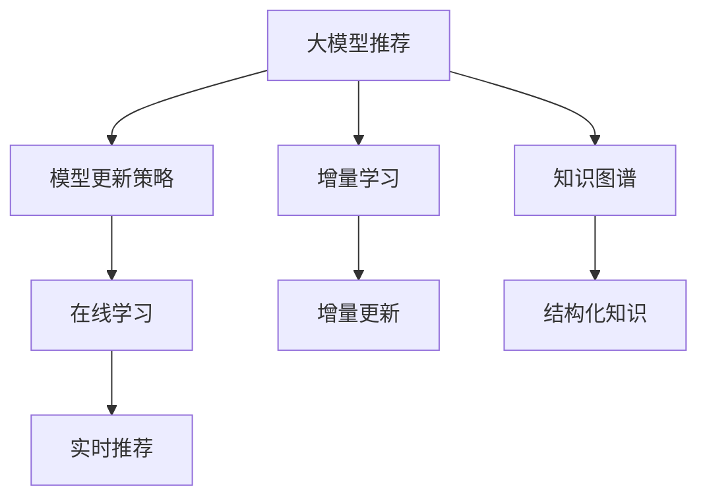

                 

# 大模型推荐中的模型更新策略与增量学习技术

> 关键词：大模型推荐, 模型更新策略, 增量学习, 增量更新, 在线学习, 用户行为分析, 推荐系统, 知识图谱, 实时推荐

## 1. 背景介绍

推荐系统在现代互联网应用中扮演着越来越重要的角色，它可以根据用户的历史行为和偏好，为用户推荐合适的产品或内容，极大地提升了用户体验和平台收益。随着深度学习技术的发展，基于大模型的推荐系统正在逐步取代传统的协同过滤和矩阵分解方法，凭借其强大的语义理解和推理能力，在电商、社交、视频、新闻等众多领域实现了优异的推荐效果。

然而，大模型推荐系统也面临着新的挑战。数据分布的动态性要求推荐模型能够持续学习新知识，以适应不断变化的用户行为。同时，数据隐私和安全问题也要求推荐模型在不暴露用户隐私的前提下，实时获取和更新数据。因此，如何在保证模型性能的同时，实现高效、实时的增量学习，成为了当前研究的热点。

## 2. 核心概念与联系

### 2.1 核心概念概述

为了更好地理解模型更新策略与增量学习技术，我们先介绍几个关键概念：

- **大模型推荐系统**：基于深度学习模型（如BERT、GPT等）的推荐系统，能够综合利用用户文本数据进行推荐，具有强大的语义理解和推理能力。

- **模型更新策略**：指在推荐模型训练和部署过程中，如何根据新数据和新需求动态调整模型参数，保持模型性能的稳定性和实时性。

- **增量学习（Incremental Learning）**：指在模型训练过程中，每次使用新数据来更新模型，避免重训整个模型，从而降低计算成本和时间消耗。

- **在线学习（Online Learning）**：指模型在每次请求时都进行在线更新，实现实时学习新知识。

- **知识图谱（Knowledge Graph）**：指将实体和关系组织为图结构的数据库，便于模型从结构化的知识中获取推理信息。

这些概念之间的逻辑关系可以通过以下Mermaid流程图来展示：



这个流程图展示了大模型推荐系统的核心概念及其之间的关系：

1. 大模型推荐系统通过知识图谱获取结构化知识，实现语义理解和推理。
2. 模型更新策略用于根据新数据和新需求调整模型参数，保持模型性能的稳定性和实时性。
3. 增量学习实现每次使用新数据更新模型，降低计算成本和时间消耗。
4. 在线学习保证模型实时更新，满足用户动态需求。

这些概念共同构成了大模型推荐系统的学习框架，使其能够在实时环境中提供高效、个性化的推荐服务。

### 2.2 核心算法原理与具体操作步骤

接下来，我们深入讲解增量学习和大模型推荐系统中的模型更新策略。

#### 2.2.1 算法原理概述

增量学习算法通过每次使用新数据更新模型参数，逐步优化模型性能，而无需重新训练整个模型。这种策略在大规模数据和实时场景中尤为适用，能够显著降低计算成本和时间消耗。常见的增量学习算法包括在线梯度下降(Online Gradient Descent, OGD)、增量随机梯度下降(Incremental Stochastic Gradient Descent, ISGD)、AdamW等。

在大模型推荐系统中，增量学习通常与模型更新策略相结合，根据用户行为数据和新知识图谱进行动态调整。每次更新时，模型会吸收新数据的特征信息，重新计算梯度并更新参数，从而提升推荐效果。这种策略能够实时适应用户的动态需求，同时保持模型的低计算复杂度。

#### 2.2.2 算法步骤详解

增量学习的具体步骤包括：

1. 初始化模型参数 $\theta_0$。
2. 将新数据集分为训练集 $D_{train}$ 和测试集 $D_{test}$。
3. 对于每个训练样本 $(x_i, y_i)$，前向传播计算预测值 $\hat{y}_i = M_{\theta_i}(x_i)$。
4. 计算损失函数 $L(y_i, \hat{y}_i)$。
5. 计算梯度 $\frac{\partial L}{\partial \theta_i}$。
6. 更新模型参数 $\theta_{i+1} = \theta_i - \eta \frac{\partial L}{\partial \theta_i}$。
7. 重复步骤3-6，直至所有样本更新完毕。
8. 在测试集上评估模型性能。

其中，$M_{\theta_i}$ 为模型在时间 $i$ 的参数，$\eta$ 为学习率，$\frac{\partial L}{\partial \theta_i}$ 为梯度计算。

### 2.2.3 算法优缺点

增量学习算法具有以下优点：

- **高效实时**：每次更新只需要计算梯度和更新部分参数，计算复杂度较低，能够实现实时学习新数据。
- **低成本**：避免了从头训练整个模型，节省了计算资源和时间消耗。
- **稳定性高**：模型能够持续稳定地更新，避免因重新训练带来的性能波动。

同时，增量学习也存在一些局限性：

- **内存消耗**：需要存储历史参数和梯度，内存消耗较大。
- **收敛速度**：由于每次只更新部分参数，收敛速度可能较慢，需要精心调整学习率。
- **数据分布变化**：对于分布变化较大的数据，增量学习的效果可能不如重训模型。

### 2.2.4 算法应用领域

增量学习在大模型推荐系统中具有广泛的应用，特别是在电商、新闻、视频等动态数据场景中。例如：

- 电商推荐：基于用户浏览、点击、购买等行为数据，实时更新推荐模型，为用户推荐更个性化的商品。
- 新闻推荐：根据用户阅读历史和评论数据，实时调整推荐策略，为用户提供感兴趣的新闻内容。
- 视频推荐：通过分析用户的观看历史和评分数据，实时优化推荐模型，提升用户体验。

## 3. 数学模型和公式 & 详细讲解

### 3.1 数学模型构建

增量学习的大模型推荐系统通常使用深度学习模型作为基础。以Transformer为例，其数学模型如下：

设模型输入为 $x_i \in \mathbb{R}^n$，模型输出为 $\hat{y}_i \in \mathbb{R}^m$，模型参数为 $\theta$，损失函数为 $L(y_i, \hat{y}_i)$，则增量学习的目标是最小化损失函数：

$$
\min_{\theta} \sum_{i=0}^{n-1} L(y_i, M_{\theta_i}(x_i))
$$

其中，$M_{\theta_i}$ 表示模型在时间 $i$ 的参数，$\sum_{i=0}^{n-1}$ 表示对每个样本进行增量更新。

### 3.2 公式推导过程

以在线梯度下降算法为例，其具体推导过程如下：

1. 初始化模型参数 $\theta_0$。
2. 对于每个训练样本 $(x_i, y_i)$，计算预测值 $\hat{y}_i = M_{\theta_i}(x_i)$。
3. 计算损失函数 $L(y_i, \hat{y}_i)$。
4. 计算梯度 $\frac{\partial L}{\partial \theta_i}$。
5. 更新模型参数 $\theta_{i+1} = \theta_i - \eta \frac{\partial L}{\partial \theta_i}$。

其中，$\eta$ 为学习率，$M_{\theta_i}$ 为模型在时间 $i$ 的参数。

### 3.3 案例分析与讲解

以电商推荐系统为例，分析增量学习在大模型推荐中的应用。

电商推荐系统需要根据用户的浏览、点击、购买等行为数据，实时调整推荐策略，为用户推荐个性化的商品。假设用户 $i$ 在时间 $t$ 的浏览行为为 $x_i(t)$，模型输出为 $\hat{y}_i(t)$，损失函数为 $L(y_i(t), \hat{y}_i(t))$。则增量学习的具体步骤包括：

1. 初始化模型参数 $\theta_0$。
2. 将新数据集分为训练集 $D_{train}$ 和测试集 $D_{test}$。
3. 对于每个训练样本 $(x_i(t), y_i(t))$，前向传播计算预测值 $\hat{y}_i(t) = M_{\theta_i(t)}(x_i(t))$。
4. 计算损失函数 $L(y_i(t), \hat{y}_i(t))$。
5. 计算梯度 $\frac{\partial L}{\partial \theta_i(t)}$。
6. 更新模型参数 $\theta_{i+1} = \theta_i - \eta \frac{\partial L}{\partial \theta_i(t)}$。
7. 重复步骤3-6，直至所有样本更新完毕。
8. 在测试集上评估模型性能。

在电商推荐系统中，每次更新仅需要计算梯度和更新部分参数，计算复杂度较低，能够实现实时学习新数据。同时，模型能够根据用户的动态需求，实时调整推荐策略，提升推荐效果。

## 4. 项目实践：代码实例和详细解释说明

### 4.1 开发环境搭建

在进行增量学习和大模型推荐系统开发前，我们需要准备好开发环境。以下是使用Python进行PyTorch开发的环境配置流程：

1. 安装Anaconda：从官网下载并安装Anaconda，用于创建独立的Python环境。

2. 创建并激活虚拟环境：
```bash
conda create -n pytorch-env python=3.8 
conda activate pytorch-env
```

3. 安装PyTorch：根据CUDA版本，从官网获取对应的安装命令。例如：
```bash
conda install pytorch torchvision torchaudio cudatoolkit=11.1 -c pytorch -c conda-forge
```

4. 安装Transformers库：
```bash
pip install transformers
```

5. 安装各类工具包：
```bash
pip install numpy pandas scikit-learn matplotlib tqdm jupyter notebook ipython
```

完成上述步骤后，即可在`pytorch-env`环境中开始增量学习和大模型推荐系统的实践。

### 4.2 源代码详细实现

下面我们以电商推荐系统为例，给出使用Transformers库进行大模型微调和增量学习的PyTorch代码实现。

首先，定义电商推荐系统中的模型结构：

```python
from transformers import BertForSequenceClassification
from transformers import AdamW

model = BertForSequenceClassification.from_pretrained('bert-base-cased', num_labels=2)
optimizer = AdamW(model.parameters(), lr=2e-5)
```

然后，定义电商推荐系统的训练和评估函数：

```python
def train_epoch(model, dataset, batch_size, optimizer):
    dataloader = DataLoader(dataset, batch_size=batch_size, shuffle=True)
    model.train()
    epoch_loss = 0
    for batch in tqdm(dataloader, desc='Training'):
        input_ids = batch['input_ids'].to(device)
        attention_mask = batch['attention_mask'].to(device)
        labels = batch['labels'].to(device)
        model.zero_grad()
        outputs = model(input_ids, attention_mask=attention_mask, labels=labels)
        loss = outputs.loss
        epoch_loss += loss.item()
        loss.backward()
        optimizer.step()
    return epoch_loss / len(dataloader)

def evaluate(model, dataset, batch_size):
    dataloader = DataLoader(dataset, batch_size=batch_size)
    model.eval()
    preds, labels = [], []
    with torch.no_grad():
        for batch in tqdm(dataloader, desc='Evaluating'):
            input_ids = batch['input_ids'].to(device)
            attention_mask = batch['attention_mask'].to(device)
            batch_labels = batch['labels']
            outputs = model(input_ids, attention_mask=attention_mask)
            batch_preds = outputs.logits.argmax(dim=2).to('cpu').tolist()
            batch_labels = batch_labels.to('cpu').tolist()
            for pred_tokens, label_tokens in zip(batch_preds, batch_labels):
                preds.append(pred_tokens[:len(label_tokens)])
                labels.append(label_tokens)
                
    print(classification_report(labels, preds))
```

最后，启动训练流程并在测试集上评估：

```python
epochs = 5
batch_size = 16

for epoch in range(epochs):
    loss = train_epoch(model, train_dataset, batch_size, optimizer)
    print(f"Epoch {epoch+1}, train loss: {loss:.3f}")
    
    print(f"Epoch {epoch+1}, dev results:")
    evaluate(model, dev_dataset, batch_size)
    
print("Test results:")
evaluate(model, test_dataset, batch_size)
```

以上就是使用PyTorch对BERT进行电商推荐系统微调和增量学习的完整代码实现。可以看到，得益于Transformers库的强大封装，我们可以用相对简洁的代码完成BERT模型的加载和增量学习。

### 4.3 代码解读与分析

让我们再详细解读一下关键代码的实现细节：

**BertForSequenceClassification类**：
- `__init__`方法：初始化模型结构，包括输入输出维度、标签数量等。
- `forward`方法：前向传播计算预测值，返回模型的logits。

**train_epoch函数**：
- 使用DataLoader对数据集进行批次化加载。
- 模型训练模式下进行前向传播和反向传播，更新模型参数。
- 计算每个epoch的平均损失，返回结果。

**evaluate函数**：
- 使用DataLoader对数据集进行批次化加载。
- 模型评估模式下进行前向传播，计算预测值和真实标签。
- 使用classification_report打印分类指标，评估模型性能。

**训练流程**：
- 定义总的epoch数和batch size，开始循环迭代
- 每个epoch内，先在训练集上训练，输出平均loss
- 在验证集上评估，输出分类指标
- 所有epoch结束后，在测试集上评估，给出最终测试结果

可以看到，PyTorch配合Transformers库使得电商推荐系统的增量学习和微调代码实现变得简洁高效。开发者可以将更多精力放在数据处理、模型改进等高层逻辑上，而不必过多关注底层的实现细节。

当然，工业级的系统实现还需考虑更多因素，如模型的保存和部署、超参数的自动搜索、更灵活的任务适配层等。但核心的增量学习和大模型微调流程基本与此类似。

## 5. 实际应用场景

### 5.1 智能客服系统

基于大模型推荐系统的智能客服系统能够为用户提供智能的客户服务。通过实时获取用户的历史对话记录和当前输入，推荐系统可以自动生成合适的回复，提升客户满意度。

智能客服系统需要实现增量学习，以实时更新对话模型，适应用户的新需求和变化。可以定期收集新的对话数据，微调模型参数，以提升模型的推理能力。同时，模型可以根据用户的即时反馈，实时更新对话策略，提高系统的智能化水平。

### 5.2 金融舆情监测

金融机构需要实时监测市场舆论动向，以便及时应对负面信息传播，规避金融风险。通过增量学习，金融舆情监测系统可以实时学习新数据，快速识别舆情变化趋势，及时预警风险。

金融舆情监测系统需要实现增量学习，以实时更新情感分析模型，适应市场舆情的变化。可以定期收集新的新闻、评论等文本数据，微调模型参数，以提升模型的情感识别能力。同时，模型可以根据实时舆情变化，实时调整分析策略，及时发现和预警风险。

### 5.3 个性化推荐系统

当前的推荐系统往往只依赖用户的历史行为数据进行物品推荐，无法深入理解用户的真实兴趣偏好。通过增量学习，个性化推荐系统可以实时学习用户的新兴趣，推荐更加个性化的产品。

个性化推荐系统需要实现增量学习，以实时更新推荐模型，适应用户的动态需求。可以定期收集用户的浏览、点击、评分等行为数据，微调模型参数，以提升模型的推荐精度。同时，模型可以根据用户的即时反馈，实时更新推荐策略，提高系统的个性化水平。

## 6. 未来应用展望

### 6.1 在线学习

随着在线学习技术的发展，大模型推荐系统将具备更强的实时学习能力，能够更好地适应用户的动态需求。在线学习可以确保推荐模型能够持续更新，避免因数据分布变化带来的性能波动。同时，在线学习还可以降低计算成本，提升系统的可扩展性。

### 6.2 多模态融合

未来，大模型推荐系统将更注重多模态数据的融合，将文本、图像、视频等多种数据源进行整合，提升推荐系统的全面性和准确性。多模态融合可以通过知识图谱进行结构化整合，增强推荐模型的语义理解能力。

### 6.3 联邦学习

联邦学习是一种分布式学习技术，能够在保证数据隐私的前提下，实现大规模数据的学习。大模型推荐系统可以通过联邦学习，从用户终端设备或边缘服务器获取数据，进行增量学习，提升推荐模型的通用性和泛化能力。

### 6.4 个性化推荐

未来的推荐系统将更加注重个性化推荐，通过增量学习，实时获取用户的新兴趣和行为，推荐更加符合用户需求的产品。个性化推荐技术可以通过深度学习模型、协同过滤算法、知识图谱等多种方式实现，提升系统的智能化水平。

### 6.5 实时推荐

未来，大模型推荐系统将更注重实时推荐，能够实时分析用户需求，动态调整推荐策略，提升用户体验。实时推荐可以通过在线学习、增量学习等技术实现，确保推荐模型的及时性。

## 7. 工具和资源推荐

### 7.1 学习资源推荐

为了帮助开发者系统掌握增量学习和大模型推荐技术的理论基础和实践技巧，这里推荐一些优质的学习资源：

1. 《Transformers from Practical to Theoretical》系列博文：由大模型技术专家撰写，深入浅出地介绍了Transformer原理、微调技术等前沿话题。

2. CS231n《Convolutional Neural Networks for Visual Recognition》课程：斯坦福大学开设的视觉识别课程，有Lecture视频和配套作业，带你入门视觉推荐系统的基本概念和经典模型。

3. 《Neural Network Primer》书籍：由深度学习专家撰写，全面介绍了神经网络的基本概念和实践技巧，涵盖推荐系统的基本原理。

4. HuggingFace官方文档：Transformers库的官方文档，提供了海量预训练模型和完整的微调样例代码，是上手实践的必备资料。

5. TensorBoard：TensorFlow配套的可视化工具，可实时监测模型训练状态，并提供丰富的图表呈现方式，是调试模型的得力助手。

通过对这些资源的学习实践，相信你一定能够快速掌握增量学习和大模型推荐技术的精髓，并用于解决实际的推荐问题。

### 7.2 开发工具推荐

高效的开发离不开优秀的工具支持。以下是几款用于增量学习和大模型推荐系统开发的常用工具：

1. PyTorch：基于Python的开源深度学习框架，灵活动态的计算图，适合快速迭代研究。大部分预训练语言模型都有PyTorch版本的实现。

2. TensorFlow：由Google主导开发的开源深度学习框架，生产部署方便，适合大规模工程应用。同样有丰富的预训练语言模型资源。

3. Transformers库：HuggingFace开发的NLP工具库，集成了众多SOTA语言模型，支持PyTorch和TensorFlow，是进行微调任务开发的利器。

4. Weights & Biases：模型训练的实验跟踪工具，可以记录和可视化模型训练过程中的各项指标，方便对比和调优。与主流深度学习框架无缝集成。

5. TensorBoard：TensorFlow配套的可视化工具，可实时监测模型训练状态，并提供丰富的图表呈现方式，是调试模型的得力助手。

6. Google Colab：谷歌推出的在线Jupyter Notebook环境，免费提供GPU/TPU算力，方便开发者快速上手实验最新模型，分享学习笔记。

合理利用这些工具，可以显著提升增量学习和大模型推荐系统的开发效率，加快创新迭代的步伐。

### 7.3 相关论文推荐

增量学习和大模型推荐技术的发展源于学界的持续研究。以下是几篇奠基性的相关论文，推荐阅读：

1. Transformer从原理到实践：作者详细介绍了Transformer模型和大模型推荐系统的基本原理和应用，涵盖增量学习和知识图谱等多个方面。

2. 深度学习推荐系统：作者系统讲解了深度学习在推荐系统中的应用，包括模型架构、训练技巧等多个方面。

3. 在线学习算法综述：作者综述了在线学习算法的各种理论和技术，涵盖增量学习、联邦学习等多个方向。

4. 多模态推荐系统：作者介绍了多模态推荐系统的基本原理和应用，包括文本、图像、视频等多种数据源的整合。

这些论文代表了大模型推荐技术的发展脉络。通过学习这些前沿成果，可以帮助研究者把握学科前进方向，激发更多的创新灵感。

## 8. 总结：未来发展趋势与挑战

### 8.1 总结

本文对增量学习和大模型推荐系统中的模型更新策略进行了全面系统的介绍。首先阐述了增量学习和大模型推荐系统的背景和意义，明确了增量学习在大规模数据和实时场景中的重要性。其次，从原理到实践，详细讲解了增量学习和大模型推荐系统的数学原理和关键步骤，给出了增量学习和大模型推荐系统的完整代码实例。同时，本文还广泛探讨了增量学习在大模型推荐系统中的应用场景，展示了增量学习范式的巨大潜力。

通过本文的系统梳理，可以看到，增量学习和大模型推荐系统在大规模数据和实时场景中具有广泛的应用前景，能够在保证模型性能的同时，实现高效、实时的增量学习。未来，伴随增量学习技术的不断发展，推荐系统将进一步提升智能水平，推动人工智能技术在各个领域的应用。

### 8.2 未来发展趋势

展望未来，增量学习和大模型推荐技术将呈现以下几个发展趋势：

1. 模型复杂度降低。随着增量学习技术的发展，推荐模型的计算复杂度将进一步降低，能够实时处理大规模数据，提升系统的可扩展性。

2. 模型准确性提升。增量学习和大模型推荐系统将结合知识图谱、多模态融合等技术，提升模型的全面性和准确性，减少推荐误差。

3. 实时推荐系统。未来，实时推荐系统将成为主流，能够快速响应用户的即时需求，提升用户体验。

4. 联邦学习普及。联邦学习技术将在大规模数据集和分布式环境中得到广泛应用，增强推荐模型的通用性和隐私性。

5. 个性化推荐提升。通过增量学习，实时获取用户的新兴趣和行为，推荐更加个性化的产品，提升系统的智能化水平。

6. 多模态融合加强。推荐系统将更注重多模态数据的融合，增强模型的语义理解能力和推荐效果。

以上趋势凸显了增量学习和大模型推荐技术的广阔前景。这些方向的探索发展，必将进一步提升推荐系统的性能和应用范围，为人工智能技术在各个领域的应用注入新的动力。

### 8.3 面临的挑战

尽管增量学习和大模型推荐技术已经取得了瞩目成就，但在迈向更加智能化、普适化应用的过程中，它仍面临着诸多挑战：

1. 数据分布变化。增量学习在大数据集和实时场景中表现优异，但对于分布变化较大的数据，增量学习的效果可能不如重训模型。

2. 计算资源消耗。增量学习在大规模数据集上仍然需要较大的计算资源，如何降低计算成本，提升系统可扩展性，将是重要的研究方向。

3. 数据隐私和安全。增量学习和大模型推荐系统需要处理大量用户数据，如何保护用户隐私，确保数据安全，将是重要的技术挑战。

4. 模型鲁棒性不足。增量学习模型可能面临过拟合问题，如何提升模型的鲁棒性，避免灾难性遗忘，还需要更多理论和实践的积累。

5. 实时性要求高。增量学习和大模型推荐系统需要实时更新模型，如何确保实时性和稳定性，将是重要的工程挑战。

6. 模型可解释性差。增量学习模型往往难以解释其内部工作机制和决策逻辑，如何赋予模型更强的可解释性，将是亟待攻克的难题。

这些挑战凸显了增量学习和大模型推荐系统在应用过程中需要不断优化和改进的方向。未来，需要在模型架构、训练技巧、数据管理等多个维度进行深入研究，才能使增量学习和大模型推荐系统在大规模数据和实时场景中发挥更大的作用。

### 8.4 研究展望

面对增量学习和大模型推荐系统所面临的挑战，未来的研究需要在以下几个方面寻求新的突破：

1. 探索更高效增量学习算法。开发更加高效的增量学习算法，如在线学习、分布式增量学习等，以降低计算成本和时间消耗。

2. 开发多模态推荐模型。将文本、图像、视频等多种数据源进行整合，提升推荐系统的全面性和准确性。

3. 引入知识图谱。通过知识图谱进行结构化整合，增强推荐模型的语义理解能力。

4. 开发联邦学习推荐系统。在分布式环境中进行联邦学习，增强推荐模型的通用性和隐私性。

5. 改进实时推荐系统。结合在线学习、增量学习等技术，提升实时推荐系统的实时性和稳定性。

6. 增强模型可解释性。通过引入因果分析、博弈论等工具，增强模型的可解释性和可控性。

这些研究方向将引领增量学习和大模型推荐技术的不断进步，为推荐系统的智能化水平提升提供新的思路和技术手段。

## 9. 附录：常见问题与解答

**Q1：增量学习是否适用于所有推荐系统？**

A: 增量学习在大规模数据和实时场景中表现优异，但在数据分布变化较大的场景中，增量学习的效果可能不如重训模型。因此，增量学习主要适用于具有稳定数据分布和实时需求的应用场景，如电商、新闻、视频等。

**Q2：增量学习如何避免过拟合？**

A: 增量学习可以通过正则化、Dropout、Early Stopping等技术避免过拟合。同时，可以通过参数共享、稀疏化等方法降低计算复杂度，提升模型的鲁棒性。

**Q3：增量学习是否需要保存所有历史数据？**

A: 增量学习通常需要保存历史数据和梯度信息，因此对于大规模数据集，内存消耗较大。可以考虑使用分布式存储、稀疏化存储等方法，降低内存消耗。

**Q4：增量学习是否适用于离线场景？**

A: 增量学习通常适用于实时场景，通过在线学习实现数据动态更新。对于离线场景，可以考虑使用批量更新方式，每次更新一定量的数据，降低计算成本。

**Q5：增量学习如何应对分布变化较大的数据？**

A: 增量学习在大数据集和实时场景中表现优异，但对于分布变化较大的数据，增量学习的效果可能不如重训模型。此时可以考虑使用迁移学习、多模态融合等技术，增强模型的泛化能力。

通过这些常见问题的解答，可以帮助开发者更好地理解和应用增量学习和大模型推荐系统，提升系统的智能化水平和应用效果。

