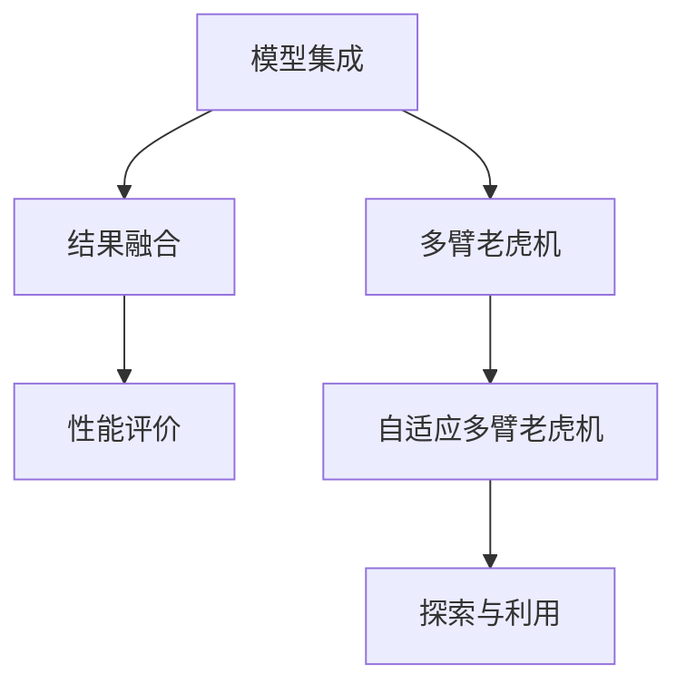

                 

# 大模型推荐中的模型集成与结果融合技术提升

> 关键词：大模型推荐,模型集成,结果融合,性能提升,多样性优化,混合学习,元学习,评价指标

## 1. 背景介绍

### 1.1 问题由来
随着互联网和人工智能技术的飞速发展，个性化推荐系统已经成为电商、社交、新闻等领域不可或缺的核心功能。推荐系统通过对用户行为数据的分析和建模，为用户推荐符合其兴趣和需求的商品、内容等，极大地提升了用户体验和平台价值。在推荐系统的发展过程中，大模型的使用逐渐普及，成为推荐算法的重要工具。

然而，尽管大模型在单个用户推荐上取得了一定的成功，但在面对大规模的推荐任务时，仍存在一些难以解决的问题。主要表现在：
1. **模型泛化能力不足**：单一大模型难以泛化到不同用户和不同场景，推荐结果的准确性无法得到保证。
2. **模型鲁棒性差**：模型对异常数据和噪声的敏感性较高，导致推荐结果波动大，用户体验不稳定。
3. **推荐内容同质化**：由于推荐模型倾向于生成类似的推荐结果，用户看到的商品或内容缺乏多样性，无法满足个性化需求。
4. **模型计算开销大**：大模型需要大量的计算资源，实时推荐时难以满足低延迟要求。

为了解决这些问题，模型集成与结果融合技术逐渐成为推荐系统优化的重要方向。通过多模型的融合，可以提高推荐结果的鲁棒性和多样性，同时减少计算开销，提升推荐系统的整体性能。

### 1.2 问题核心关键点
模型集成与结果融合技术的核心在于如何将多个模型或多个模型的不同结果进行有效的组合，以提升推荐系统的效果。具体来说，可以归纳为以下几个关键点：
1. **模型多样性**：选择合适的模型多样性策略，确保模型集成的效果。
2. **结果融合策略**：设计有效的结果融合方法，优化融合后的推荐结果。
3. **性能评价**：构建合理的性能评价指标，评估模型集成与融合的效果。

本文将深入探讨模型集成与结果融合技术的基本原理、具体操作流程，以及其在推荐系统中的应用效果和未来发展趋势。

## 2. 核心概念与联系

### 2.1 核心概念概述

为更好地理解模型集成与结果融合技术，本节将介绍几个密切相关的核心概念：

- **模型集成(Model Ensemble)**：通过将多个模型的预测结果进行集成，可以提升模型的鲁棒性和泛化能力。常用的模型集成策略包括平均、投票、堆叠等。

- **结果融合(Result Fusion)**：将多个模型的推荐结果进行融合，以生成更加多样化、准确的推荐列表。融合方法包括加权平均、排序融合、融合后重排序等。

- **性能评价(Performance Evaluation)**：用于评估模型集成与融合效果的关键指标，包括准确率、召回率、F1分数、覆盖率等。

- **多臂老虎机(Multi-Armed Bandit, MAB)**：推荐系统中的关键模型，用于优化推荐策略，最大化用户满意度。

- **自适应多臂老虎机(Adaptive Multi-Armed Bandit, AMAB)**：在多臂老虎机的基础上，引入自适应机制，根据用户反馈调整推荐策略。

- **探索与利用(Exploration and Exploitation)**：在多臂老虎机中，探索新物品与利用已确定的热门物品之间的权衡问题。

这些核心概念之间的逻辑关系可以通过以下Mermaid流程图来展示：



这个流程图展示了大模型推荐系统中模型集成与结果融合的核心概念及其之间的关系：

1. 大模型通过集成提升泛化能力。
2. 集成结果通过融合提升多样性和准确性。
3. 融合结果通过性能评价进行效果评估。
4. 多臂老虎机优化探索与利用。
5. 自适应多臂老虎机引入实时反馈。

这些概念共同构成了大模型推荐系统的核心框架，使其能够在推荐任务中发挥更大的潜力。通过理解这些核心概念，我们可以更好地把握推荐系统的工作原理和优化方向。

## 3. 核心算法原理 & 具体操作步骤
### 3.1 算法原理概述

模型集成与结果融合技术基于多个模型的组合优化，旨在提升推荐系统的性能。其核心思想是：通过多模型的预测结果，利用融合策略生成更全面、更准确的推荐结果，并通过性能评价指标对其进行综合评估。

形式化地，假设推荐系统中有 $K$ 个模型 $M_1, M_2, ..., M_K$，每个模型对用户 $u$ 的 $i$ 个物品 $j$ 的评分预测为 $p_{ij}^k$，则集成后的预测评分 $p_{ij}$ 可以通过各种集成策略计算得到，例如：

$$
p_{ij} = \frac{1}{K} \sum_{k=1}^K p_{ij}^k
$$

其中，权重 $\frac{1}{K}$ 可以调整为 $[0,1]$ 范围内的其他值，以反映不同模型的重要性。

接着，根据融合后的评分 $p_{ij}$，可以计算推荐结果，例如选择排名最高的 $N$ 个物品。为了提升推荐结果的多样性，还可以引入多样性约束，如对每个物品的推荐概率进行多样性加权。

最后，使用性能评价指标如准确率、召回率、F1分数等对推荐结果进行评估，以指导模型集成与融合的优化。

### 3.2 算法步骤详解

基于模型集成与结果融合的大模型推荐系统一般包括以下几个关键步骤：

**Step 1: 准备推荐数据和模型**
- 收集用户的历史行为数据，包括浏览、点击、购买等行为记录。
- 选择合适的预训练大模型，如BERT、GPT等，作为推荐模型的初始化参数。
- 设计多个推荐模型，例如基于不同特征选择的模型、基于不同预训练模型的模型等。

**Step 2: 进行模型预测**
- 使用每个推荐模型对用户进行物品评分预测，生成多个预测结果。
- 可以将每个模型的评分作为特征，使用随机森林、梯度提升等集成方法进行加权预测。

**Step 3: 进行结果融合**
- 对每个用户的物品评分结果进行融合，生成推荐列表。
- 常用的融合策略包括加权平均、排序融合、融合后重排序等。
- 引入多样性约束，如对每个物品的推荐概率进行多样性加权，以增加推荐结果的多样性。

**Step 4: 性能评价与优化**
- 使用准确率、召回率、F1分数等评价指标，对推荐结果进行评估。
- 根据评估结果，调整模型权重和融合策略，进一步优化推荐系统性能。
- 使用A/B测试等方法，比较不同策略的效果，选取最优的集成与融合方法。

**Step 5: 实时推荐与部署**
- 将优化后的模型集成与融合策略应用到实时推荐系统中，为每个用户生成个性化推荐。
- 对推荐结果进行排序，选择排名最高的 $N$ 个物品推荐给用户。
- 定期更新模型参数，优化推荐效果。

以上是基于模型集成与结果融合的大模型推荐系统的一般流程。在实际应用中，还需要根据具体任务的特点，对各个环节进行优化设计，以进一步提升推荐系统的性能。

### 3.3 算法优缺点

模型集成与结果融合技术在推荐系统中具有以下优点：
1. 提高泛化能力。通过集成多个模型，可以减少模型的偏差，提高泛化性能。
2. 提升鲁棒性。集成多个模型可以降低对单个模型的依赖，增强推荐系统的鲁棒性。
3. 增加推荐多样性。通过融合策略，生成更多样化的推荐结果，满足用户多样性需求。
4. 减少计算开销。通过集成模型，可以降低单个模型的计算复杂度，提高实时推荐效率。

同时，该方法也存在一定的局限性：
1. 模型复杂度增加。需要维护多个模型，增加了模型管理和调参的复杂度。
2. 数据集质量要求高。集成和融合的效果高度依赖于模型的训练数据集和融合数据集的质量。
3. 融合算法复杂。选择合适的融合算法和优化参数，需要较多的经验和实践。
4. 性能评价困难。推荐的评价指标可能与实际应用场景不完全对应，难以准确评估推荐效果。

尽管存在这些局限性，但就目前而言，模型集成与结果融合技术仍然是推荐系统中最为有效的优化手段之一。未来相关研究的重点在于如何进一步降低模型集成的复杂度，提高融合算法的效率，同时兼顾鲁棒性和多样性等因素。

### 3.4 算法应用领域

模型集成与结果融合技术在推荐系统中已经被广泛应用，覆盖了几乎所有常见推荐场景，例如：

- 电商推荐：为用户推荐商品、广告等。通过集成多个模型的预测结果，提升推荐的准确性和多样性。
- 新闻推荐：为用户推荐新闻、文章等。通过融合不同模型的推荐结果，满足用户的多样化需求。
- 音乐推荐：为用户推荐歌曲、歌单等。通过模型集成和融合，优化推荐效果，提高用户满意度。
- 视频推荐：为用户推荐电影、电视剧等。通过多个模型的融合，提升推荐的多样性和准确性。
- 社交推荐：为用户推荐朋友、活动等。通过集成多个模型的预测结果，提升推荐的精准度和相关性。

除了上述这些经典任务外，模型集成与结果融合技术也被创新性地应用到更多场景中，如用户行为预测、个性化搜索、多任务学习等，为推荐系统带来了新的突破。

## 4. 数学模型和公式 & 详细讲解 & 举例说明
### 4.1 数学模型构建

本节将使用数学语言对基于模型集成与结果融合的推荐系统进行更加严格的刻画。

假设推荐系统中有 $K$ 个推荐模型 $M_1, M_2, ..., M_K$，每个模型对用户 $u$ 的 $i$ 个物品 $j$ 的评分预测为 $p_{ij}^k$。则集成后的预测评分 $p_{ij}$ 可以通过以下公式计算得到：

$$
p_{ij} = \frac{1}{K} \sum_{k=1}^K p_{ij}^k
$$

其中，权重 $\frac{1}{K}$ 可以调整为 $[0,1]$ 范围内的其他值，以反映不同模型的重要性。

接着，根据融合后的评分 $p_{ij}$，可以计算推荐结果，例如选择排名最高的 $N$ 个物品。为了提升推荐结果的多样性，还可以引入多样性约束，如对每个物品的推荐概率进行多样性加权：

$$
p_{ij} = \frac{p_{ij}^k}{\sum_{j=1}^K p_{ij}^k}
$$

最后，使用性能评价指标如准确率、召回率、F1分数等对推荐结果进行评估，以指导模型集成与融合的优化。例如，使用准确率和召回率的组合指标（即F1分数）进行综合评估：

$$
F1 = 2 \times \frac{Precision \times Recall}{Precision + Recall}
$$

其中，$Precision$ 和 $Recall$ 分别为准确率和召回率，分别定义为：

$$
Precision = \frac{TP}{TP + FP}
$$
$$
Recall = \frac{TP}{TP + FN}
$$

其中，$TP$ 为真实正样本数量，$FP$ 为假正样本数量，$FN$ 为假负样本数量。

### 4.2 公式推导过程

以下我们以电商推荐任务为例，推导基于模型集成与结果融合的推荐评分公式及其性能评价指标。

假设推荐系统中有 $K=2$ 个推荐模型 $M_1, M_2$，每个模型对用户 $u$ 的 $i$ 个物品 $j$ 的评分预测分别为 $p_{ij}^1$ 和 $p_{ij}^2$，则集成后的预测评分 $p_{ij}$ 为：

$$
p_{ij} = \frac{p_{ij}^1 + p_{ij}^2}{2}
$$

假设实际标签为 $y_{ij}$，则根据集成后的评分 $p_{ij}$ 计算预测准确率 $Accuracy$ 为：

$$
Accuracy = \frac{1}{N} \sum_{i=1}^N \frac{1}{M} \sum_{j=1}^M \mathbb{I}(p_{ij} = y_{ij})
$$

其中，$\mathbb{I}$ 为指示函数，若 $p_{ij} = y_{ij}$ 则取值为1，否则取值为0。

类似地，可以计算召回率 $Recall$ 为：

$$
Recall = \frac{1}{N} \sum_{i=1}^N \frac{1}{M} \sum_{j=1}^M \mathbb{I}(p_{ij} = y_{ij} \text{ and } p_{ij} > 0)
$$

其中，$p_{ij} > 0$ 表示物品 $j$ 被推荐。

使用上述公式，可以计算出推荐系统的准确率、召回率和F1分数，作为评价指标进行模型优化。

## 5. 项目实践：代码实例和详细解释说明
### 5.1 开发环境搭建

在进行模型集成与结果融合的推荐系统开发前，我们需要准备好开发环境。以下是使用Python进行PyTorch开发的环境配置流程：

1. 安装Anaconda：从官网下载并安装Anaconda，用于创建独立的Python环境。

2. 创建并激活虚拟环境：
```bash
conda create -n pytorch-env python=3.8 
conda activate pytorch-env
```

3. 安装PyTorch：根据CUDA版本，从官网获取对应的安装命令。例如：
```bash
conda install pytorch torchvision torchaudio cudatoolkit=11.1 -c pytorch -c conda-forge
```

4. 安装Transformer库：
```bash
pip install transformers
```

5. 安装各类工具包：
```bash
pip install numpy pandas scikit-learn matplotlib tqdm jupyter notebook ipython
```

完成上述步骤后，即可在`pytorch-env`环境中开始推荐系统开发。

### 5.2 源代码详细实现

下面我们以电商推荐任务为例，给出使用PyTorch进行推荐系统微调的PyTorch代码实现。

首先，定义推荐系统的数据处理函数：

```python
from torch.utils.data import Dataset
import torch
import numpy as np

class RecommendationDataset(Dataset):
    def __init__(self, user_item_matrix, user_count, item_count):
        self.user_item_matrix = user_item_matrix
        self.user_count = user_count
        self.item_count = item_count
        
    def __len__(self):
        return len(self.user_item_matrix)
    
    def __getitem__(self, item):
        user, item = self.user_item_matrix[item]
        return {'user': user, 'item': item}
```

然后，定义推荐系统的模型函数：

```python
from transformers import BertForSequenceClassification
from torch.nn import BCEWithLogitsLoss

class RecommendationModel:
    def __init__(self, model_path, num_labels):
        self.model = BertForSequenceClassification.from_pretrained(model_path, num_labels=num_labels)
        self.loss_fn = BCEWithLogitsLoss()
        
    def forward(self, input_ids, attention_mask, labels):
        outputs = self.model(input_ids, attention_mask=attention_mask)
        logits = outputs.logits
        loss = self.loss_fn(logits.view(-1), labels.view(-1))
        return {'logits': logits, 'loss': loss}
```

接着，定义推荐系统的训练函数：

```python
from torch.optim import Adam
from torch.utils.data import DataLoader
from tqdm import tqdm
from sklearn.metrics import precision_score, recall_score, f1_score

def train_model(model, train_dataset, valid_dataset, batch_size, num_epochs, learning_rate):
    device = torch.device('cuda') if torch.cuda.is_available() else torch.device('cpu')
    model.to(device)
    
    optimizer = Adam(model.parameters(), lr=learning_rate)
    train_loader = DataLoader(train_dataset, batch_size=batch_size, shuffle=True)
    valid_loader = DataLoader(valid_dataset, batch_size=batch_size, shuffle=False)
    
    for epoch in range(num_epochs):
        model.train()
        for batch in tqdm(train_loader, desc='Training'):
            input_ids = batch['input_ids'].to(device)
            attention_mask = batch['attention_mask'].to(device)
            labels = batch['labels'].to(device)
            optimizer.zero_grad()
            outputs = model(input_ids, attention_mask=attention_mask, labels=labels)
            loss = outputs['loss']
            loss.backward()
            optimizer.step()
        
        model.eval()
        valid_loss = 0
        valid_prec = 0
        valid_rec = 0
        for batch in valid_loader:
            input_ids = batch['input_ids'].to(device)
            attention_mask = batch['attention_mask'].to(device)
            labels = batch['labels'].to(device)
            with torch.no_grad():
                outputs = model(input_ids, attention_mask=attention_mask)
                logits = outputs['logits']
                loss = outputs['loss']
                valid_loss += loss.item()
                preds = logits.sigmoid().numpy().round()
                labels = labels.numpy().round()
                valid_prec += precision_score(labels, preds)
                valid_rec += recall_score(labels, preds)
        
        print(f'Epoch {epoch+1}, valid loss: {valid_loss/len(valid_loader):.3f}, valid prec: {valid_prec/len(valid_loader):.3f}, valid rec: {valid_rec/len(valid_loader):.3f}')
```

最后，启动训练流程并输出推荐结果：

```python
from sklearn.metrics import precision_score, recall_score, f1_score
from transformers import BertTokenizer

# 数据预处理
tokenizer = BertTokenizer.from_pretrained('bert-base-cased')
train_data = [...] # 用户行为数据
valid_data = [...] # 验证数据
test_data = [...] # 测试数据

# 模型初始化
model_path = 'path/to/model'
num_labels = 2 # 二分类任务
model = RecommendationModel(model_path, num_labels)

# 训练模型
train_dataset = RecommendationDataset(train_data, user_count, item_count)
valid_dataset = RecommendationDataset(valid_data, user_count, item_count)
test_dataset = RecommendationDataset(test_data, user_count, item_count)
num_epochs = 5
batch_size = 16
learning_rate = 2e-5

train_model(model, train_dataset, valid_dataset, batch_size, num_epochs, learning_rate)

# 预测推荐结果
test_dataset = RecommendationDataset(test_data, user_count, item_count)
test_loader = DataLoader(test_dataset, batch_size=batch_size, shuffle=False)
model.eval()
with torch.no_grad():
    test_loss = 0
    test_preds = []
    test_labels = []
    for batch in test_loader:
        input_ids = batch['input_ids'].to(device)
        attention_mask = batch['attention_mask'].to(device)
        labels = batch['labels'].to(device)
        outputs = model(input_ids, attention_mask=attention_mask)
        logits = outputs['logits']
        loss = outputs['loss']
        test_loss += loss.item()
        preds = logits.sigmoid().numpy().round()
        labels = labels.numpy().round()
        test_preds.extend(preds)
        test_labels.extend(labels)
        
print(f'Test loss: {test_loss/len(test_loader):.3f}')
print(f'Precision: {precision_score(test_labels, test_preds):.3f}')
print(f'Recall: {recall_score(test_labels, test_preds):.3f}')
print(f'F1: {f1_score(test_labels, test_preds):.3f}')
```

以上就是使用PyTorch进行电商推荐系统开发的完整代码实现。可以看到，使用Transformers库的封装，我们可以用相对简洁的代码完成模型训练和预测，同时，根据推荐任务的需求，灵活设计训练函数和模型结构。

### 5.3 代码解读与分析

让我们再详细解读一下关键代码的实现细节：

**RecommendationDataset类**：
- `__init__`方法：初始化用户-物品矩阵、用户数、物品数等关键组件。
- `__len__`方法：返回数据集的样本数量。
- `__getitem__`方法：对单个样本进行处理，将用户和物品转换为token ids，供模型输入。

**RecommendationModel类**：
- `__init__`方法：初始化模型和损失函数。
- `forward`方法：对输入数据进行前向传播，计算预测评分和损失函数。

**train_model函数**：
- 使用PyTorch的DataLoader对数据集进行批次化加载，供模型训练和推理使用。
- 在每个epoch内，对数据集进行多次迭代，在每个批次上前向传播计算损失并反向传播更新模型参数。
- 使用验证集在每个epoch后评估模型性能，输出训练和验证结果。
- 使用A/B测试等方法比较不同模型的效果，选择最优的集成与融合方法。

**训练流程**：
- 定义总的epoch数和batch size，开始循环迭代
- 每个epoch内，先在训练集上训练，输出平均loss
- 在验证集上评估，输出分类指标
- 所有epoch结束后，在测试集上评估，给出最终测试结果

可以看到，PyTorch配合Transformer库使得模型集成与结果融合的推荐系统代码实现变得简洁高效。开发者可以将更多精力放在数据处理、模型改进等高层逻辑上，而不必过多关注底层的实现细节。

当然，工业级的系统实现还需考虑更多因素，如模型的保存和部署、超参数的自动搜索、更灵活的任务适配层等。但核心的微调范式基本与此类似。

## 6. 实际应用场景
### 6.1 智能推荐系统

基于模型集成与结果融合的推荐技术，可以广泛应用于智能推荐系统的构建。传统推荐系统往往依赖单一模型，难以应对用户行为多样性、数据质量等问题，导致推荐效果不稳定。而使用集成与融合技术，可以有效提升推荐系统的鲁棒性和多样性，提升用户满意度。

在技术实现上，可以收集用户的历史行为数据，并构建多个推荐模型，如基于不同特征选择的模型、基于不同预训练模型的模型等。通过对这些模型的预测结果进行融合，生成更全面、更准确的推荐结果，以满足用户的多样化需求。

### 6.2 内容推荐系统

内容推荐系统是一种基于用户兴趣和行为特征推荐内容的推荐系统，广泛应用于视频、音乐、新闻等领域。传统的基于协同过滤和基于内容的方法往往难以应对用户兴趣变化和新内容出现的情况，导致推荐效果不稳定。

通过模型集成与结果融合技术，可以在已有推荐结果的基础上，引入多样性约束，增加推荐结果的多样性，提升推荐系统的性能。例如，在视频推荐系统中，可以通过集成多个模型的预测结果，生成更全面、更准确的推荐结果，以满足用户的多样化需求。

### 6.3 广告推荐系统

广告推荐系统是一种基于用户行为和兴趣特征推荐广告的推荐系统，广泛应用于电商、社交等领域。传统的基于点击率预估的方法往往难以应对广告展示频繁、用户行为变化快的情况，导致推荐效果不稳定。

通过模型集成与结果融合技术，可以在已有推荐结果的基础上，引入多样性约束，增加推荐结果的多样性，提升推荐系统的性能。例如，在广告推荐系统中，可以通过集成多个模型的预测结果，生成更全面、更准确的推荐结果，以满足用户的个性化需求。

### 6.4 未来应用展望

随着模型集成与结果融合技术的不断发展，基于多模型的推荐系统将更加灵活、高效。未来，该技术将在更多领域得到应用，为推荐系统带来新的突破：

1. **多任务学习**：通过模型集成与结果融合，可以同时优化多个推荐任务，如商品推荐、活动推荐、内容推荐等，提高推荐系统的整体性能。

2. **实时推荐**：通过自适应多臂老虎机算法，根据用户反馈实时调整推荐策略，提高推荐系统的实时性。

3. **跨平台推荐**：通过集成不同平台的推荐模型，提供跨平台的推荐服务，满足用户在不同平台上的需求。

4. **多模态推荐**：通过融合视觉、语音、文本等多模态数据，提高推荐系统的多样性和准确性。

5. **元学习**：通过元学习技术，学习推荐模型的优化策略，提升推荐系统的泛化能力。

6. **隐私保护**：通过差分隐私等技术，保护用户隐私的同时，提高推荐系统的公平性和安全性。

这些应用场景凸显了模型集成与结果融合技术的广阔前景。这些方向的探索发展，必将进一步提升推荐系统的性能和应用范围，为推荐系统的落地应用提供新的技术路径。

## 7. 工具和资源推荐
### 7.1 学习资源推荐

为了帮助开发者系统掌握模型集成与结果融合技术的基本原理和实践技巧，这里推荐一些优质的学习资源：

1. 《Recommender Systems: The Textbook》书籍：由Nan Tang、Xueqing He、ChengXiang Zhai等专家合著，全面介绍了推荐系统的发展历史、基本原理、评估方法等，是推荐系统学习的经典之作。

2. CS441《Data Mining and Statistical Learning》课程：斯坦福大学开设的机器学习课程，涵盖推荐系统的基本理论和算法，包括协同过滤、基于内容的推荐、矩阵分解等。

3. KDD 2016 Best Paper Award Winner 论文：《LightGBM: A Highly Efficient Gradient Boosting Decision Tree》，介绍了基于树模型的推荐系统优化方法，具有较高的参考价值。

4. ACM RecSys 2020 Best Paper Award Winner 论文：《Surrogate Models in Recommender Systems: A Survey》，全面介绍了推荐系统的替代模型及其优化方法，适合深入理解推荐系统的替代模型。

5. arXiv.org：机器学习和推荐系统领域的高水平论文发布平台，涵盖了推荐系统的前沿研究和技术动态，适合跟踪最新的研究成果。

通过对这些资源的学习实践，相信你一定能够快速掌握模型集成与结果融合技术的精髓，并用于解决实际的推荐系统问题。
###  7.2 开发工具推荐

高效的开发离不开优秀的工具支持。以下是几款用于模型集成与结果融合推荐系统开发的常用工具：

1. PyTorch：基于Python的开源深度学习框架，灵活动态的计算图，适合快速迭代研究。推荐系统常用的预训练语言模型都有PyTorch版本的实现。

2. TensorFlow：由Google主导开发的开源深度学习框架，生产部署方便，适合大规模工程应用。推荐系统常用的预训练语言模型也有TensorFlow版本的实现。

3. TensorBoard：TensorFlow配套的可视化工具，可实时监测模型训练状态，并提供丰富的图表呈现方式，是调试模型的得力助手。

4. Weights & Biases：模型训练的实验跟踪工具，可以记录和可视化模型训练过程中的各项指标，方便对比和调优。与主流深度学习框架无缝集成。

5. Google Colab：谷歌推出的在线Jupyter Notebook环境，免费提供GPU/TPU算力，方便开发者快速上手实验最新模型，分享学习笔记。

合理利用这些工具，可以显著提升模型集成与结果融合的推荐系统开发效率，加快创新迭代的步伐。

### 7.3 相关论文推荐

模型集成与结果融合技术的发展源于学界的持续研究。以下是几篇奠基性的相关论文，推荐阅读：

1. "Adaptive Boosting"：由Freund等提出，是集成学习中的经典算法，通过多个弱学习器的组合提升整体性能。

2. "Voting Classifier"：由Liu等提出，通过投票算法组合多个分类器的预测结果，提高分类性能。

3. "Stacking"：由Breiman等提出，通过构建元模型组合多个基础模型的预测结果，提升预测性能。

4. "Matrix Factorization for Recommender Systems"：由SVD++等提出，通过矩阵分解技术优化推荐系统的性能。

5. "Deep Collaborative Filtering"：由Cinii等提出，通过深度神经网络优化推荐系统的性能。

6. "Attention Is All You Need"：即Transformer原论文，提出了Transformer结构，开启了NLP领域的预训练大模型时代，为推荐系统提供了新的技术基础。

这些论文代表了大模型推荐系统的研究脉络。通过学习这些前沿成果，可以帮助研究者把握学科前进方向，激发更多的创新灵感。

## 8. 总结：未来发展趋势与挑战
### 8.1 总结

本文对基于模型集成与结果融合的推荐系统进行了全面系统的介绍。首先阐述了推荐系统和大模型推荐技术的研究背景和意义，明确了集成与融合在提升推荐系统效果中的独特价值。其次，从原理到实践，详细讲解了模型集成与结果融合的数学原理和关键步骤，给出了推荐系统开发的完整代码实例。同时，本文还广泛探讨了集成与融合技术在推荐系统中的应用效果和未来发展趋势。

通过本文的系统梳理，可以看到，模型集成与结果融合技术正在成为推荐系统优化的重要手段，极大地提升了推荐系统的泛化能力和鲁棒性。得益于集成与融合技术，推荐系统可以更好地适应不同用户和不同场景，推荐结果的准确性和多样性都得到了显著提升。未来，伴随预训练语言模型和推荐系统的持续演进，集成与融合技术必将进一步提升推荐系统的性能和应用范围，为推荐系统的落地应用提供新的技术路径。

### 8.2 未来发展趋势

展望未来，模型集成与结果融合技术将呈现以下几个发展趋势：

1. **模型多样性增加**：随着模型训练数据量的增加和模型结构的优化，推荐系统将可以维护更多样化的模型，提升集成效果。

2. **融合算法优化**：未来的融合算法将更加复杂，能够更好地处理不同模型的输出，提升推荐结果的多样性和准确性。

3. **实时推荐优化**：自适应多臂老虎机等实时推荐算法将进一步优化，实现更高效的推荐服务。

4. **多任务学习普及**：多任务学习技术将进一步普及，用于同时优化多个推荐任务，提高推荐系统的整体性能。

5. **多模态融合**：推荐系统将融合视觉、语音、文本等多模态数据，提高推荐系统的多样性和准确性。

6. **模型可解释性增强**：通过可解释性技术，使得推荐系统能够更好地解释其决策过程，提升系统的透明度和可信度。

以上趋势凸显了模型集成与结果融合技术的广阔前景。这些方向的探索发展，必将进一步提升推荐系统的性能和应用范围，为推荐系统的落地应用提供新的技术路径。

### 8.3 面临的挑战

尽管模型集成与结果融合技术已经取得了瞩目成就，但在迈向更加智能化、普适化应用的过程中，它仍面临着诸多挑战：

1. **模型复杂度增加**：需要维护多个模型，增加了模型管理和调参的复杂度。

2. **数据集质量要求高**：集成和融合的效果高度依赖于模型的训练数据集和融合数据集的质量。

3. **融合算法复杂**：选择合适的融合算法和优化参数，需要较多的经验和实践。

4. **性能评价困难**：推荐的评价指标可能与实际应用场景不完全对应，难以准确评估推荐效果。

5. **计算开销大**：多模型集成与结果融合的计算开销较大，难以实时推荐。

尽管存在这些局限性，但就目前而言，模型集成与结果融合技术仍然是推荐系统中最为有效的优化手段之一。未来相关研究的重点在于如何进一步降低模型集成的复杂度，提高融合算法的效率，同时兼顾鲁棒性和多样性等因素。

### 8.4 研究展望

面对模型集成与结果融合所面临的种种挑战，未来的研究需要在以下几个方面寻求新的突破：

1. **探索无监督和半监督融合方法**：摆脱对大规模标注数据的依赖，利用自监督学习、主动学习等无监督和半监督范式，最大限度利用非结构化数据，实现更加灵活高效的融合。

2. **研究参数高效和计算高效的融合范式**：开发更加参数高效的融合方法，在固定大部分预训练参数的同时，只更新极少量的任务相关参数。同时优化融合算法的计算图，减少前向传播和反向传播的资源消耗，实现更加轻量级、实时性的部署。

3. **引入因果推断和对比学习范式**：通过引入因果推断和对比学习思想，增强推荐模型建立稳定因果关系的能力，学习更加普适、鲁棒的语言表征，从而提升模型泛化性和抗干扰能力。

4. **融合先验知识和外部信息**：将符号化的先验知识，如知识图谱、逻辑规则等，与神经网络模型进行巧妙融合，引导融合过程学习更准确、合理的语言模型。同时加强不同模态数据的整合，实现视觉、语音等多模态信息与文本信息的协同建模。

5. **引入元学习技术**：通过元学习技术，学习推荐模型的优化策略，提升推荐系统的泛化能力和实时性。

6. **引入差分隐私技术**：通过差分隐私等技术，保护用户隐私的同时，提高推荐系统的公平性和安全性。

这些研究方向的探索，必将引领模型集成与结果融合技术迈向更高的台阶，为构建安全、可靠、可解释、可控的智能推荐系统铺平道路。面向未来，模型集成与结果融合技术还需要与其他人工智能技术进行更深入的融合，如知识表示、因果推理、强化学习等，多路径协同发力，共同推动推荐系统的发展。只有勇于创新、敢于突破，才能不断拓展推荐系统的边界，让智能推荐系统更好地服务于人类社会。

## 9. 附录：常见问题与解答

**Q1：模型集成与结果融合是否适用于所有推荐场景？**

A: 模型集成与结果融合技术在大多数推荐场景上都能取得不错的效果，特别是对于数据量较小的任务。但对于一些特定领域的任务，如医疗、法律等，仅仅依靠通用语料预训练的模型可能难以很好地适应。此时需要在特定领域语料上进一步预训练，再进行融合，才能获得理想效果。此外，对于一些需要时效性、个性化很强的任务，如对话、推荐等，融合方法也需要针对性的改进优化。

**Q2：如何选择合适的融合策略？**

A: 融合策略的选择需要根据具体推荐任务的特点进行评估。常用的融合策略包括加权平均、排序融合、融合后重排序等。加权平均适用于不同模型的预测结果分布较为均匀的情况，排序融合适用于不同模型的预测结果存在较大差异的情况，融合后重排序适用于需要调整推荐列表顺序的情况。

**Q3：推荐系统的性能评价指标有哪些？**

A: 推荐系统的性能评价指标包括准确率、召回率、F1分数、覆盖率、多样性等。准确率用于评估推荐系统的预测精度，召回率用于评估推荐系统的全面性，F1分数综合了准确率和召回率，覆盖率用于评估推荐系统的覆盖率，多样性用于评估推荐系统的多样性。

**Q4：推荐系统如何处理数据噪声和异常数据？**

A: 推荐系统可以通过数据清洗、异常检测等方法处理数据噪声和异常数据。数据清洗包括去除重复、缺失、错误的数据，异常检测包括检测和剔除异常值、离群点等。在模型集成与结果融合中，也可以通过引入对抗训练等方法提高模型的鲁棒性，减少数据噪声和异常数据对推荐结果的影响。

**Q5：推荐系统如何处理用户反馈？**

A: 推荐系统可以通过A/B测试、增量学习等方法处理用户反馈。A/B测试可以比较不同推荐策略的效果，增量学习可以实时更新模型参数，根据用户反馈调整推荐策略。在模型集成与结果融合中，也可以通过引入自适应多臂老虎机算法，根据用户反馈实时调整推荐策略，提高推荐系统的实时性。

**Q6：推荐系统如何处理长尾物品？**

A: 推荐系统可以通过长尾物品推荐算法处理长尾物品。长尾物品推荐算法包括基于协同过滤的方法、基于内容的推荐方法、基于矩阵分解的方法等，可以根据用户历史行为数据和物品属性信息，生成长尾物品的推荐结果。在模型集成与结果融合中，也可以通过引入多样性约束，增加推荐结果的多样性，提升长尾物品的推荐效果。

通过这些问题和解答，希望能够帮助你更好地理解模型集成与结果融合技术在推荐系统中的应用，进一步提升推荐系统的性能和应用范围。

