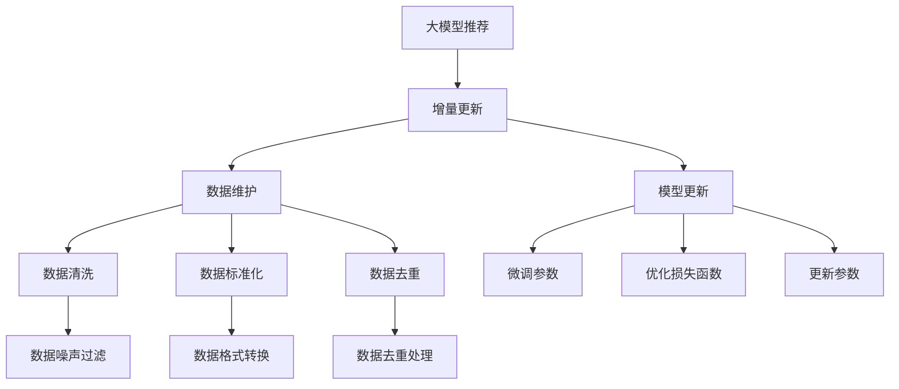

                 

# 大模型推荐场景中的数据增量更新与维护策略

> 关键词：大模型推荐,增量更新,数据维护,模型更新,高效算法,数据增量,推荐系统

## 1. 背景介绍

### 1.1 问题由来
随着互联网和数字技术的飞速发展，推荐系统在电子商务、新闻媒体、社交网络等多个领域中扮演着越来越重要的角色。它们通过分析用户的历史行为和偏好，为用户推荐个性化的内容和服务，提升用户体验和满意度。然而，传统推荐系统往往只能使用静态数据，随着数据量的快速增长，需要频繁地进行数据同步、清理和重建，导致维护成本高、响应速度慢等问题。

大语言模型（如BERT、GPT-3等）的应用为推荐系统带来了新的变革。这些模型在大规模无标签文本数据上进行预训练，学习到丰富的语言知识和模式，可以通过微调（Fine-tuning）来适应特定推荐场景，提升推荐效果。相比传统推荐系统，大语言模型推荐系统具有动态更新、实时响应的优势，能够快速响应用户需求的变更。

### 1.2 问题核心关键点
数据增量更新与维护是推荐系统的一项重要任务。在大模型推荐场景中，数据更新成为模型微调和推荐结果更新的核心问题。高效的数据增量更新策略不仅能提升推荐系统的实时性，还能降低系统维护成本，确保推荐结果的质量。

在大模型推荐中，数据更新主要面临以下挑战：
- 数据规模大、更新频率高。推荐系统需要不断收集用户行为数据，并更新推荐模型。大规模数据更新带来了巨大的计算和存储压力。
- 数据类型多样，格式复杂。推荐系统涉及多种数据源，包括文本、图片、音频等，数据格式和结构各异。
- 数据质量不稳定。推荐系统对数据质量有高要求，但数据来源复杂，存在噪声和错误。

## 2. 核心概念与联系

### 2.1 核心概念概述

为更好地理解大模型推荐场景中的数据增量更新与维护策略，本节将介绍几个密切相关的核心概念：

- 大模型推荐系统（Large Model Recommendation System）：使用大规模预训练语言模型（如BERT、GPT-3）进行微调，针对特定推荐场景优化推荐模型。
- 增量更新（Incremental Update）：在模型已经存在的情况下，仅对新增数据进行微调，而不是重新训练整个模型。
- 数据维护（Data Maintenance）：对推荐系统使用的数据进行清洗、格式化、去重等操作，确保数据质量和一致性。
- 模型更新（Model Update）：通过微调模型参数，使推荐模型适应新的数据分布和用户需求。
- 高效算法（Efficient Algorithm）：在大模型推荐场景中，为了应对大规模数据和高频率更新需求，需要开发高效的数据更新算法。

这些概念之间的逻辑关系可以通过以下Mermaid流程图来展示：



这个流程图展示了大模型推荐系统中各个组件的相互关系：

1. 大模型推荐系统通过增量更新和模型更新不断适应新的数据和用户需求。
2. 数据维护通过清洗、标准化和去重等操作确保数据质量。
3. 高效算法通过优化算法和参数更新策略，确保微调过程高效可靠。

## 3. 核心算法原理 & 具体操作步骤
### 3.1 算法原理概述

在大模型推荐场景中，增量更新与数据维护策略的根本目的是保持推荐模型的及时性和准确性。具体而言，增量更新策略要求推荐系统能够快速响应用户需求的变化，而数据维护策略则确保输入数据的一致性和质量。

增量更新过程分为三个阶段：数据同步、增量微调和模型更新。数据同步指将新增数据从各个数据源同步到推荐系统中。增量微调指在已有模型的基础上，仅对新增数据进行微调，避免全量微调带来的计算和存储开销。模型更新则是指将微调后的模型参数应用于推荐系统，更新推荐结果。

数据维护主要关注数据的清洗、标准化和去重等操作。数据清洗旨在去除数据中的噪声和错误，提升数据质量。数据标准化将不同格式和类型的数据转换为统一的格式，便于模型处理。数据去重则消除重复数据，避免对推荐结果的影响。

### 3.2 算法步骤详解

#### 3.2.1 数据同步

数据同步是增量更新的第一步，目的是将新增数据从各个数据源同步到推荐系统中。数据同步通常包括以下步骤：

1. **数据源收集**：从不同数据源（如电商平台、社交网络、新闻网站等）收集用户行为数据，存储在统一的数据仓库中。
2. **数据导入**：将收集到的数据导入推荐系统，通常是批量导入或增量导入，以保证实时性。
3. **数据合并**：将不同数据源的数据合并，形成统一的数据集。合并过程中需要处理数据格式、时间戳等差异。

#### 3.2.2 增量微调

增量微调是大模型推荐系统的重要组成部分，其目的是在已有模型的基础上，仅对新增数据进行微调。增量微调通常包括以下步骤：

1. **选择微调数据**：根据业务需求和推荐模型特征，选择新增数据中的一部分作为微调数据。
2. **微调模型**：使用微调数据对预训练模型进行微调，更新模型参数。
3. **计算损失函数**：计算微调数据在模型上的损失函数，评估微调效果。
4. **更新模型参数**：根据损失函数梯度更新模型参数，进行参数优化。

#### 3.2.3 模型更新

模型更新是将微调后的模型参数应用于推荐系统，更新推荐结果。模型更新通常包括以下步骤：

1. **参数加载**：将微调后的模型参数加载到推荐系统中，替换原有的模型参数。
2. **重新计算推荐结果**：根据新的模型参数，重新计算推荐结果，更新推荐系统。
3. **评估推荐效果**：评估推荐效果，确保推荐结果的准确性和实时性。

### 3.3 算法优缺点

增量更新与数据维护策略在大模型推荐系统中具有以下优点：

1. **快速响应需求**：增量微调和模型更新能够快速响应用户需求的变化，提升推荐系统的实时性。
2. **降低维护成本**：通过增量更新，避免频繁的全量微调和模型重建，降低系统维护成本。
3. **高效利用资源**：增量微调策略能够充分利用已有模型的知识，避免重复计算，提升计算效率。

同时，该策略也存在一些局限性：

1. **数据复杂性**：不同数据源的数据格式和类型各异，需要进行复杂的数据预处理和清洗操作。
2. **模型维护难度**：增量微调和模型更新需要精确控制参数更新策略，避免过拟合和模型退化。
3. **数据同步延迟**：数据同步过程中可能存在延迟，影响推荐系统的实时性。

### 3.4 算法应用领域

基于增量更新和数据维护策略的大模型推荐系统，已经在多个领域得到了广泛应用，例如：

- 电子商务推荐：亚马逊、京东等电商平台使用大模型推荐系统，为用户推荐商品。通过增量微调和模型更新，能够快速响应用户的浏览和购买行为。
- 新闻媒体推荐：今日头条、网易新闻等媒体平台使用大模型推荐系统，为用户推荐新闻内容。通过增量微调和数据维护，提升推荐内容的个性化和多样性。
- 社交网络推荐：微博、微信等社交平台使用大模型推荐系统，为用户推荐朋友和内容。通过增量微调和数据同步，能够快速适应用户的兴趣变化。

除了上述这些经典应用外，大模型推荐系统还在旅游、金融、医疗等多个领域得到广泛应用，为各行各业带来了全新的推荐体验。

## 4. 数学模型和公式 & 详细讲解 & 举例说明

### 4.1 数学模型构建

在大模型推荐场景中，增量更新和数据维护策略主要依赖于数学模型的构建。以下以二分类推荐任务为例，构建数学模型并进行详细讲解。

记推荐系统为用户和商品生成二元序列 $(x,y)$，其中 $x$ 为用户特征向量，$y$ 为商品特征向量，$y \in \{0,1\}$ 表示推荐结果。假设大语言模型为 $M_{\theta}$，其中 $\theta$ 为模型参数。推荐系统的目标是最小化用户和商品间的距离，即：

$$
\min_{\theta} \sum_{(x,y) \in D} ||M_{\theta}(x) - y||^2
$$

其中 $D$ 为推荐系统的训练数据集。

### 4.2 公式推导过程

二分类推荐任务的增量微调过程包括以下几个关键步骤：

1. **微调数据的选择**：从训练集 $D$ 中选择一部分数据作为微调数据 $D_s$。
2. **微调损失函数**：计算微调数据在模型 $M_{\theta}$ 上的损失函数 $L_s$，例如交叉熵损失函数。
3. **参数更新**：根据微调损失函数的梯度更新模型参数 $\theta_s$，例如使用梯度下降算法。
4. **重新计算推荐结果**：使用更新后的模型参数 $\theta_s$ 重新计算推荐结果。

以交叉熵损失函数为例，微调过程的数学模型为：

$$
L_s = -\frac{1}{|D_s|} \sum_{(x,y) \in D_s} y \log M_{\theta}(x) + (1-y) \log (1-M_{\theta}(x))
$$

其中 $|D_s|$ 为微调数据集的大小。

### 4.3 案例分析与讲解

以电子商务推荐系统为例，分析增量微调和数据维护策略的实现过程。

假设电商平台收集到新的用户浏览记录 $D_s$，需要进行增量微调。具体步骤如下：

1. **数据同步**：将新的用户浏览记录 $D_s$ 导入推荐系统中，与现有的用户浏览记录合并。
2. **选择微调数据**：从合并后的数据集中选择一部分数据作为微调数据，例如选择最近一周的浏览记录。
3. **微调模型**：使用微调数据对预训练模型进行微调，更新模型参数 $\theta_s$。
4. **计算损失函数**：计算微调数据在模型 $\theta_s$ 上的损失函数 $L_s$，例如交叉熵损失函数。
5. **更新模型参数**：根据微调损失函数的梯度更新模型参数 $\theta_s$，例如使用梯度下降算法。
6. **模型更新**：将微调后的模型参数 $\theta_s$ 加载到推荐系统中，替换原有的模型参数 $\theta$。
7. **重新计算推荐结果**：使用更新后的模型参数 $\theta_s$ 重新计算推荐结果，更新推荐系统。

通过上述步骤，电商平台能够在用户行为变化后快速响应，提升推荐效果。

## 5. 项目实践：代码实例和详细解释说明
### 5.1 开发环境搭建

在进行推荐系统开发前，我们需要准备好开发环境。以下是使用Python进行PyTorch开发的环境配置流程：

1. 安装Anaconda：从官网下载并安装Anaconda，用于创建独立的Python环境。

2. 创建并激活虚拟环境：
```bash
conda create -n pytorch-env python=3.8 
conda activate pytorch-env
```

3. 安装PyTorch：根据CUDA版本，从官网获取对应的安装命令。例如：
```bash
conda install pytorch torchvision torchaudio cudatoolkit=11.1 -c pytorch -c conda-forge
```

4. 安装Transformers库：
```bash
pip install transformers
```

5. 安装各类工具包：
```bash
pip install numpy pandas scikit-learn matplotlib tqdm jupyter notebook ipython
```

完成上述步骤后，即可在`pytorch-env`环境中开始推荐系统开发。

### 5.2 源代码详细实现

下面我们以基于BERT的推荐系统为例，给出使用Transformers库进行增量微调的PyTorch代码实现。

首先，定义推荐系统的数据处理函数：

```python
from transformers import BertTokenizer
from torch.utils.data import Dataset
import torch

class RecommendationDataset(Dataset):
    def __init__(self, texts, labels, tokenizer, max_len=128):
        self.texts = texts
        self.labels = labels
        self.tokenizer = tokenizer
        self.max_len = max_len
        
    def __len__(self):
        return len(self.texts)
    
    def __getitem__(self, item):
        text = self.texts[item]
        label = self.labels[item]
        
        encoding = self.tokenizer(text, return_tensors='pt', max_length=self.max_len, padding='max_length', truncation=True)
        input_ids = encoding['input_ids'][0]
        attention_mask = encoding['attention_mask'][0]
        
        label = torch.tensor(label, dtype=torch.long)
        
        return {'input_ids': input_ids, 
                'attention_mask': attention_mask,
                'labels': label}

# 初始化数据处理
tokenizer = BertTokenizer.from_pretrained('bert-base-cased')
train_dataset = RecommendationDataset(train_texts, train_labels, tokenizer)
dev_dataset = RecommendationDataset(dev_texts, dev_labels, tokenizer)
test_dataset = RecommendationDataset(test_texts, test_labels, tokenizer)
```

然后，定义模型和优化器：

```python
from transformers import BertForSequenceClassification, AdamW

model = BertForSequenceClassification.from_pretrained('bert-base-cased', num_labels=2)

optimizer = AdamW(model.parameters(), lr=2e-5)
```

接着，定义训练和评估函数：

```python
from torch.utils.data import DataLoader
from tqdm import tqdm
from sklearn.metrics import classification_report

device = torch.device('cuda') if torch.cuda.is_available() else torch.device('cpu')
model.to(device)

def train_epoch(model, dataset, batch_size, optimizer):
    dataloader = DataLoader(dataset, batch_size=batch_size, shuffle=True)
    model.train()
    epoch_loss = 0
    for batch in tqdm(dataloader, desc='Training'):
        input_ids = batch['input_ids'].to(device)
        attention_mask = batch['attention_mask'].to(device)
        labels = batch['labels'].to(device)
        model.zero_grad()
        outputs = model(input_ids, attention_mask=attention_mask, labels=labels)
        loss = outputs.loss
        epoch_loss += loss.item()
        loss.backward()
        optimizer.step()
    return epoch_loss / len(dataloader)

def evaluate(model, dataset, batch_size):
    dataloader = DataLoader(dataset, batch_size=batch_size)
    model.eval()
    preds, labels = [], []
    with torch.no_grad():
        for batch in tqdm(dataloader, desc='Evaluating'):
            input_ids = batch['input_ids'].to(device)
            attention_mask = batch['attention_mask'].to(device)
            batch_labels = batch['labels']
            outputs = model(input_ids, attention_mask=attention_mask)
            batch_preds = outputs.logits.argmax(dim=2).to('cpu').tolist()
            batch_labels = batch_labels.to('cpu').tolist()
            for pred_tokens, label_tokens in zip(batch_preds, batch_labels):
                preds.append(pred_tokens[:len(label_tokens)])
                labels.append(label_tokens)
                
    print(classification_report(labels, preds))
```

最后，启动训练流程并在测试集上评估：

```python
epochs = 5
batch_size = 16

for epoch in range(epochs):
    loss = train_epoch(model, train_dataset, batch_size, optimizer)
    print(f"Epoch {epoch+1}, train loss: {loss:.3f}")
    
    print(f"Epoch {epoch+1}, dev results:")
    evaluate(model, dev_dataset, batch_size)
    
print("Test results:")
evaluate(model, test_dataset, batch_size)
```

以上就是使用PyTorch对BERT进行推荐系统微调的完整代码实现。可以看到，得益于Transformers库的强大封装，我们可以用相对简洁的代码完成BERT模型的加载和微调。

### 5.3 代码解读与分析

让我们再详细解读一下关键代码的实现细节：

**RecommendationDataset类**：
- `__init__`方法：初始化文本、标签、分词器等关键组件。
- `__len__`方法：返回数据集的样本数量。
- `__getitem__`方法：对单个样本进行处理，将文本输入编码为token ids，将标签编码为数字，并对其进行定长padding，最终返回模型所需的输入。

**训练和评估函数**：
- 使用PyTorch的DataLoader对数据集进行批次化加载，供模型训练和推理使用。
- 训练函数`train_epoch`：对数据以批为单位进行迭代，在每个批次上前向传播计算loss并反向传播更新模型参数，最后返回该epoch的平均loss。
- 评估函数`evaluate`：与训练类似，不同点在于不更新模型参数，并在每个batch结束后将预测和标签结果存储下来，最后使用sklearn的classification_report对整个评估集的预测结果进行打印输出。

**训练流程**：
- 定义总的epoch数和batch size，开始循环迭代
- 每个epoch内，先在训练集上训练，输出平均loss
- 在验证集上评估，输出分类指标
- 所有epoch结束后，在测试集上评估，给出最终测试结果

可以看到，PyTorch配合Transformers库使得BERT微调的代码实现变得简洁高效。开发者可以将更多精力放在数据处理、模型改进等高层逻辑上，而不必过多关注底层的实现细节。

当然，工业级的系统实现还需考虑更多因素，如模型的保存和部署、超参数的自动搜索、更灵活的任务适配层等。但核心的微调范式基本与此类似。

## 6. 实际应用场景
### 6.1 智能推荐系统

基于大语言模型增量更新与数据维护策略的推荐系统，可以广泛应用于智能推荐系统。传统推荐系统往往只依赖历史行为数据进行推荐，难以适应用户兴趣的变化。而使用增量微调和数据维护策略，可以实时响应用户需求的变化，提供更加个性化和动态的推荐结果。

例如，电商平台可以根据用户最近的浏览和购买行为，实时调整推荐商品列表，提升用户满意度和转化率。新闻媒体可以根据用户的阅读偏好，实时推荐新闻内容，提升用户粘性和阅读量。社交平台可以根据用户的互动行为，实时推荐好友和内容，提升用户体验和社交互动。

### 6.2 金融风险预警

金融行业需要实时监控市场风险，及时预警潜在的金融风险。传统风险预警系统往往只能依赖静态数据进行建模，难以适应市场快速变化。而使用增量更新和大语言模型，可以实时监控市场动态，及时预警风险。

例如，金融机构可以根据实时市场数据和用户行为，实时调整风险预警模型，提升风险预警的及时性和准确性。证券公司可以根据实时行情和用户交易行为，实时推荐投资策略，提升投资收益。

### 6.3 医疗健康咨询

医疗行业需要实时提供健康咨询和诊疗建议，及时响应患者的健康需求。传统医疗咨询系统往往只能依赖历史数据进行建模，难以适应用户健康状况的变化。而使用增量微调和数据维护策略，可以实时响应用户健康变化，提供个性化的健康咨询和诊疗建议。

例如，医疗平台可以根据用户的健康数据和行为，实时调整推荐诊断和治疗方案，提升诊疗效果和用户满意度。健康咨询平台可以根据用户的健康咨询记录，实时推荐健康知识和生活建议，提升用户健康意识。

### 6.4 未来应用展望

随着增量更新和大语言模型的不断发展，推荐系统将在更多领域得到应用，为各行各业带来全新的体验。

在智慧医疗领域，基于增量更新和大模型的健康咨询和诊疗系统，可以为患者提供实时健康监测和建议，提升医疗服务的智能化水平。

在智能教育领域，增量微调和大语言模型可以用于推荐个性化的学习资源和教学策略，因材施教，促进教育公平，提高教学质量。

在智慧城市治理中，增量更新和大模型可以用于实时监控城市事件和舆情，提高城市管理的自动化和智能化水平，构建更安全、高效的未来城市。

此外，在企业生产、社会治理、文娱传媒等众多领域，基于增量更新的大语言模型推荐系统也将不断涌现，为各行各业带来全新的推荐体验。相信随着技术的日益成熟，增量更新和大模型推荐系统必将在构建人机协同的智能时代中扮演越来越重要的角色。

## 7. 工具和资源推荐
### 7.1 学习资源推荐

为了帮助开发者系统掌握增量更新和大语言模型的理论基础和实践技巧，这里推荐一些优质的学习资源：

1. 《Transformer从原理到实践》系列博文：由大模型技术专家撰写，深入浅出地介绍了Transformer原理、BERT模型、增量微调技术等前沿话题。

2. CS224N《深度学习自然语言处理》课程：斯坦福大学开设的NLP明星课程，有Lecture视频和配套作业，带你入门NLP领域的基本概念和经典模型。

3. 《Natural Language Processing with Transformers》书籍：Transformers库的作者所著，全面介绍了如何使用Transformers库进行NLP任务开发，包括增量微调在内的诸多范式。

4. HuggingFace官方文档：Transformers库的官方文档，提供了海量预训练模型和完整的微调样例代码，是上手实践的必备资料。

5. CLUE开源项目：中文语言理解测评基准，涵盖大量不同类型的中文NLP数据集，并提供了基于增量微调的baseline模型，助力中文NLP技术发展。

通过对这些资源的学习实践，相信你一定能够快速掌握增量更新和大语言模型的精髓，并用于解决实际的NLP问题。
###  7.2 开发工具推荐

高效的开发离不开优秀的工具支持。以下是几款用于大语言模型增量更新开发的常用工具：

1. PyTorch：基于Python的开源深度学习框架，灵活动态的计算图，适合快速迭代研究。大部分预训练语言模型都有PyTorch版本的实现。

2. TensorFlow：由Google主导开发的开源深度学习框架，生产部署方便，适合大规模工程应用。同样有丰富的预训练语言模型资源。

3. Transformers库：HuggingFace开发的NLP工具库，集成了众多SOTA语言模型，支持PyTorch和TensorFlow，是进行增量微调任务开发的利器。

4. Weights & Biases：模型训练的实验跟踪工具，可以记录和可视化模型训练过程中的各项指标，方便对比和调优。与主流深度学习框架无缝集成。

5. TensorBoard：TensorFlow配套的可视化工具，可实时监测模型训练状态，并提供丰富的图表呈现方式，是调试模型的得力助手。

6. Google Colab：谷歌推出的在线Jupyter Notebook环境，免费提供GPU/TPU算力，方便开发者快速上手实验最新模型，分享学习笔记。

合理利用这些工具，可以显著提升增量更新和大语言模型的开发效率，加快创新迭代的步伐。

### 7.3 相关论文推荐

增量更新和大语言模型的发展源于学界的持续研究。以下是几篇奠基性的相关论文，推荐阅读：

1. Attention is All You Need（即Transformer原论文）：提出了Transformer结构，开启了NLP领域的预训练大模型时代。

2. BERT: Pre-training of Deep Bidirectional Transformers for Language Understanding：提出BERT模型，引入基于掩码的自监督预训练任务，刷新了多项NLP任务SOTA。

3. Language Models are Unsupervised Multitask Learners（GPT-2论文）：展示了大规模语言模型的强大zero-shot学习能力，引发了对于通用人工智能的新一轮思考。

4. Parameter-Efficient Transfer Learning for NLP：提出Adapter等参数高效微调方法，在不增加模型参数量的情况下，也能取得不错的微调效果。

5. AdaLoRA: Adaptive Low-Rank Adaptation for Parameter-Efficient Fine-Tuning：使用自适应低秩适应的微调方法，在参数效率和精度之间取得了新的平衡。

这些论文代表了大语言模型增量微调技术的发展脉络。通过学习这些前沿成果，可以帮助研究者把握学科前进方向，激发更多的创新灵感。

## 8. 总结：未来发展趋势与挑战

### 8.1 总结

本文对基于增量更新和大语言模型的推荐系统进行了全面系统的介绍。首先阐述了增量更新和大语言模型推荐系统的研究背景和意义，明确了增量更新在大模型推荐中的核心作用。其次，从原理到实践，详细讲解了增量更新和数据维护的数学原理和关键步骤，给出了增量微调的完整代码实例。同时，本文还广泛探讨了增量更新在大推荐系统中的应用前景，展示了增量微调范式的巨大潜力。最后，本文精选了增量更新和大语言模型的学习资源，力求为读者提供全方位的技术指引。

通过本文的系统梳理，可以看到，基于增量更新和大语言模型的推荐系统正在成为NLP推荐任务的重要范式，极大地拓展了推荐系统的应用边界，催生了更多的落地场景。得益于大规模语料的预训练和增量微调技术，推荐系统能够在用户行为变化后快速响应，提供更加个性化和动态的推荐结果。未来，伴随增量更新和大语言模型的持续演进，推荐系统必将在更广阔的应用领域大放异彩，深刻影响用户的生产生活方式。

### 8.2 未来发展趋势

展望未来，增量更新和大语言模型推荐系统将呈现以下几个发展趋势：

1. 模型规模持续增大。随着算力成本的下降和数据规模的扩张，预训练语言模型的参数量还将持续增长。超大批次的增量微调和模型更新，带来计算和存储压力。

2. 增量微调方法日趋多样。除了传统的增量微调外，未来会涌现更多参数高效的微调方法，如Prefix-Tuning、LoRA等，在固定大部分预训练参数的同时，只更新极少量的任务相关参数。

3. 持续学习成为常态。随着数据分布的不断变化，增量更新模型需要持续学习新知识以保持性能。如何在不遗忘原有知识的同时，高效吸收新样本信息，将是重要的研究课题。

4. 标注样本需求降低。受启发于提示学习(Prompt-based Learning)的思路，未来的增量微调方法将更好地利用大模型的语言理解能力，通过更加巧妙的任务描述，在更少的标注样本上也能实现理想的增量微调效果。

5. 数据类型多样性增强。增量更新系统将逐渐处理更多的非文本数据，如图像、音频、视频等，实现多模态数据融合。

6. 跨平台应用拓展。增量更新模型将支持跨平台应用，实现多设备、多终端的一致推荐体验。

以上趋势凸显了增量更新和大语言模型推荐系统的广阔前景。这些方向的探索发展，必将进一步提升推荐系统的实时性、准确性和多样性，为推荐系统带来革命性的变化。

### 8.3 面临的挑战

尽管增量更新和大语言模型推荐系统已经取得了瞩目成就，但在迈向更加智能化、普适化应用的过程中，它仍面临着诸多挑战：

1. 数据质量不稳定。推荐系统对数据质量有高要求，但数据来源复杂，存在噪声和错误，需要进一步提高数据清洗和预处理能力。

2. 模型复杂度增加。随着模型规模的增大和更新频率的提高，推荐系统变得越来越复杂，容易发生模型退化。如何优化模型结构，提升模型的鲁棒性和稳定性，是需要解决的重要问题。

3. 计算和存储成本高。大规模增量微调和模型更新带来了巨大的计算和存储压力，需要开发更高效的算法和更强大的硬件支持。

4. 实时性要求高。推荐系统需要实时响应用户需求的变化，如何在保持实时性的同时，提高计算效率，是需要不断优化的技术难点。

5. 可解释性不足。当前推荐系统往往缺乏可解释性，难以解释推荐结果的来源和生成过程。如何提升推荐系统的可解释性，确保用户信任，是推荐系统面临的重要挑战。

6. 安全性有待保障。推荐系统可能遭受恶意攻击和数据泄露，需要加强数据安全和隐私保护，确保用户隐私和数据安全。

这些挑战凸显了增量更新和大语言模型推荐系统的复杂性，需要从技术、管理和伦理等多个维度进行全面优化。唯有不断创新和完善，才能充分发挥增量更新和大语言模型的潜力，构建安全、可靠、高效的推荐系统。

### 8.4 研究展望

面对增量更新和大语言模型推荐系统所面临的种种挑战，未来的研究需要在以下几个方面寻求新的突破：

1. 探索无监督和半监督增量微调方法。摆脱对大规模标注数据的依赖，利用自监督学习、主动学习等无监督和半监督范式，最大限度利用非结构化数据，实现更加灵活高效的增量微调。

2. 研究参数高效和计算高效的增量微调范式。开发更加参数高效的增量微调方法，在固定大部分预训练参数的同时，只更新极少量的任务相关参数。同时优化增量微调的计算图，减少前向传播和反向传播的资源消耗，实现更加轻量级、实时性的部署。

3. 融合因果和对比学习范式。通过引入因果推断和对比学习思想，增强增量微调模型建立稳定因果关系的能力，学习更加普适、鲁棒的语言表征，从而提升模型泛化性和抗干扰能力。

4. 引入更多先验知识。将符号化的先验知识，如知识图谱、逻辑规则等，与神经网络模型进行巧妙融合，引导增量微调过程学习更准确、合理的语言模型。同时加强不同模态数据的整合，实现视觉、语音等多模态信息与文本信息的协同建模。

5. 结合因果分析和博弈论工具。将因果分析方法引入增量微调模型，识别出模型决策的关键特征，增强输出解释的因果性和逻辑性。借助博弈论工具刻画人机交互过程，主动探索并规避模型的脆弱点，提高系统稳定性。

6. 纳入伦理道德约束。在增量微调的目标中引入伦理导向的评估指标，过滤和惩罚有偏见、有害的输出倾向。同时加强人工干预和审核，建立模型行为的监管机制，确保输出符合人类价值观和伦理道德。

这些研究方向的探索，必将引领增量更新和大语言模型推荐系统迈向更高的台阶，为构建安全、可靠、可解释、可控的智能推荐系统铺平道路。面向未来，增量更新和大语言模型推荐系统还需要与其他人工智能技术进行更深入的融合，如知识表示、因果推理、强化学习等，多路径协同发力，共同推动推荐系统的进步。只有勇于创新、敢于突破，才能不断拓展推荐系统的边界，让智能技术更好地造福人类社会。

## 9. 附录：常见问题与解答

**Q1：增量更新在大模型推荐系统中的重要性是什么？**

A: 增量更新在大模型推荐系统中的重要性主要体现在以下几个方面：

1. 快速响应需求：增量微调能够快速响应用户需求的变化，提升推荐系统的实时性。
2. 降低维护成本：通过增量微调，避免频繁的全量微调和模型重建，降低系统维护成本。
3. 高效利用资源：增量微调策略能够充分利用已有模型的知识，避免重复计算，提升计算效率。

**Q2：增量更新过程中如何选择微调数据？**

A: 在选择增量微调数据时，通常需要考虑以下几个因素：

1. 数据相关性：选择与当前推荐任务相关的数据进行微调，避免无关数据的干扰。
2. 数据规模：选择足够规模的数据进行微调，以确保微调效果。
3. 数据多样性：选择不同特征的数据进行微调，确保模型能够适应多种数据分布。
4. 数据质量：选择高质量的数据进行微调，避免噪声和错误对模型性能的影响。

**Q3：增量更新过程中如何处理数据同步延迟？**

A: 处理数据同步延迟的方法通常包括以下几种：

1. 异步更新：通过异步更新模型参数，避免数据同步的延迟影响推荐结果。
2. 增量更新：仅对新增数据进行微调，避免全量微调和模型重建带来的延迟。
3. 数据缓存：将最新数据缓存到本地，避免频繁的远程数据访问。
4. 分布式更新：采用分布式微调架构，多台机器同时进行数据同步和微调，提高系统响应速度。

**Q4：增量更新过程中如何处理数据噪声和错误？**

A: 处理数据噪声和错误的方法通常包括以下几种：

1. 数据清洗：使用数据清洗算法去除数据中的噪声和错误，提升数据质量。
2. 数据标准化：将不同格式和类型的数据转换为统一的格式，便于模型处理。
3. 数据去重：消除重复数据，避免对推荐结果的影响。
4. 数据验证：引入数据验证算法，检测并过滤异常数据。

**Q5：增量更新过程中如何优化模型结构？**

A: 优化模型结构的方法通常包括以下几种：

1. 参数剪枝：通过剪枝算法减少模型的冗余参数，提高计算效率。
2. 模型压缩：使用模型压缩算法，减少模型的大小和计算开销。
3. 分层微调：仅对模型的一层或几层进行微调，减少模型更新开销。
4. 模型融合：将多个微调后的模型进行融合，提升模型的综合性能。

这些方法可以结合使用，以最大化地提升模型的性能和效率。

**Q6：增量更新过程中如何进行模型监控和调优？**

A: 进行模型监控和调优的方法通常包括以下几种：

1. 模型评估：通过评估指标（如准确率、召回率、F1值等）评估模型的性能。
2. 参数调优：通过调整学习率、正则化参数等超参数，优化模型的性能。
3. 模型对比：比较不同微调策略和模型架构的性能，选择最优方案。
4. 模型监控：实时监控模型的训练和推理过程，及时发现并解决性能问题。

通过这些方法，可以确保增量更新模型在实际应用中的稳定性和可靠性。

