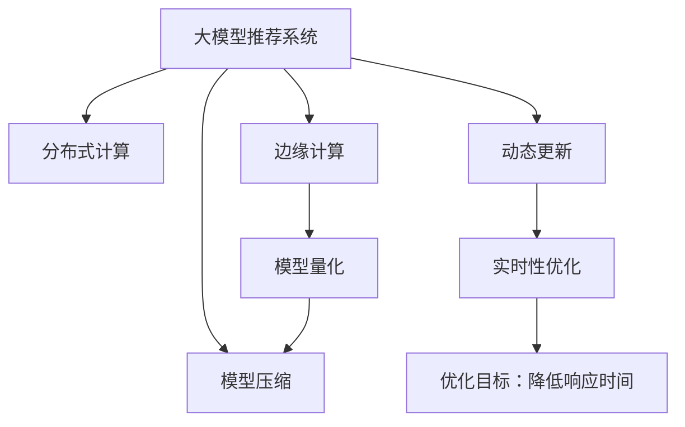

                 

# 大模型推荐系统的实时性优化

> 关键词：大模型推荐系统,实时性优化,嵌入式计算,边缘计算,高性能计算,算法优化

## 1. 背景介绍

### 1.1 问题由来
推荐系统是互联网、电商、娱乐等领域广泛应用的关键技术，通过学习用户行为数据，为用户推荐个性化内容，提升用户体验和平台收益。随着移动互联网和物联网设备的普及，推荐系统的应用场景日益丰富，对实时性、准确性等指标提出了更高的要求。

然而，当前推荐系统面临着一系列实时性挑战。一方面，用户数据实时流变，需要即时处理用户行为以生成推荐；另一方面，高精度的推荐模型往往需要消耗大量计算资源，难以在短时间内完成计算。针对这些问题，学术界和工业界提出了多种实时性优化策略，其中以大模型推荐系统为中心的高性能计算技术尤为引人注目。

本文将系统梳理基于大模型推荐系统的实时性优化方法，从数据处理、模型训练、推理加速等多个层面探讨实时性优化的思路与技术，为构建高效、准确的推荐系统提供参考。

### 1.2 问题核心关键点
基于大模型的推荐系统，其核心在于利用大语言模型、大视觉模型等预训练模型，通过有监督的微调任务，获得高质量的个性化推荐结果。实时性优化则侧重于如何在保持模型性能的前提下，大幅提升推荐系统的响应速度。

具体优化方向包括：

1. 分布式并行计算：通过分布式训练和推理，将计算任务分散到多台设备上，实现并行计算加速。

2. 边缘计算：将推荐模型部署在用户设备、边缘服务器上，减小计算延迟，提高推荐实时性。

3. 模型量化与压缩：通过量化和模型压缩技术，减小模型存储空间和计算资源消耗，实现轻量化推理。

4. 缓存与预取：利用缓存机制和预取算法，提升数据读取速度，降低计算延迟。

5. 动态模型更新：采用动态模型更新策略，定期在用户行为数据上更新模型，保持推荐相关性。

本文将详细介绍这些优化策略，并通过具体案例和实践，探讨其在推荐系统中的应用效果。

## 2. 核心概念与联系

### 2.1 核心概念概述

为更好地理解大模型推荐系统的实时性优化，本节将介绍几个密切相关的核心概念：

- 大模型推荐系统：基于深度学习模型，如BERT、GPT等，通过微调训练获得个性化推荐模型。

- 实时性优化：提升推荐系统的响应速度，以确保推荐内容的时效性和相关性。

- 分布式计算：利用多台计算机或服务器协同工作，实现并行计算，加速任务处理。

- 边缘计算：将计算任务在接近数据源的设备上完成，减小数据传输延迟。

- 模型量化：将大模型中的浮点数参数转为定点数，减小计算资源消耗。

- 模型压缩：减小模型体积，提升推理速度。

- 动态更新：根据新数据，动态调整模型参数，确保推荐内容始终与用户行为一致。

这些概念之间的逻辑关系可以通过以下Mermaid流程图来展示：



这个流程图展示了大模型推荐系统的核心概念及其之间的关系：

1. 大模型推荐系统通过微调获得推荐模型。
2. 分布式计算和边缘计算优化计算资源，提高实时性。
3. 模型量化和压缩减小模型体积，提升推理速度。
4. 动态更新保持推荐内容的相关性。
5. 实时性优化整体提升推荐系统的响应时间。

这些核心概念共同构成了大模型推荐系统的实时性优化框架，为其提供了解决方案和优化手段。

## 3. 核心算法原理 & 具体操作步骤
### 3.1 算法原理概述

基于大模型的推荐系统实时性优化，本质上是一个多维度、多层次的计算优化过程。其核心思想是：通过分布式计算、边缘计算、模型量化、模型压缩、动态更新等技术手段，在不牺牲模型性能的前提下，显著提升推荐系统的计算效率和实时性。

具体而言，主要包括以下几个关键步骤：

1. 数据预处理：将原始用户行为数据进行清洗、标注、特征工程等处理，转换为适合模型训练的输入格式。

2. 分布式训练：通过分布式并行计算，加速模型在大量数据上的训练过程。

3. 边缘部署：将训练好的模型部署到用户设备、边缘服务器等靠近数据源的计算节点上，减小数据传输延迟。

4. 模型量化与压缩：通过量化和压缩技术，减小模型存储空间和计算资源消耗，实现轻量化推理。

5. 动态更新：定期在用户行为数据上更新模型参数，保持推荐内容的时效性。

6. 实时性优化：对各环节进行优化，包括缓存机制、预取算法、异步计算等，综合提升推荐系统的响应时间。

### 3.2 算法步骤详解

基于大模型的推荐系统实时性优化，可以按照以下步骤进行：

**Step 1: 数据预处理**

- 数据清洗：去除无关字段，处理缺失值和异常值。
- 数据标注：将原始行为数据标注为隐式和显式反馈。
- 特征工程：提取、选择、构建特征，进行归一化处理。

**Step 2: 分布式训练**

- 选择合适的计算框架，如TensorFlow、PyTorch等。
- 将数据切分为多个分片，并行分布在多个计算节点上进行训练。
- 选择合适的分布式训练算法，如SGD、Adam等，实现并行优化。

**Step 3: 边缘部署**

- 将训练好的模型导出为轻量级格式，如ONNX、TensorFlow Lite等。
- 将模型部署到用户设备、边缘服务器上，实现本地推理。

**Step 4: 模型量化与压缩**

- 选择合适的量化方法，如权重量化、激活量化等。
- 采用模型压缩技术，如剪枝、蒸馏、编码等。

**Step 5: 动态更新**

- 周期性在用户行为数据上训练微调模型。
- 根据新数据，动态更新推荐模型。

**Step 6: 实时性优化**

- 利用缓存机制，减少重复数据读取。
- 采用预取算法，预加载即将使用的数据。
- 使用异步计算，提高并发计算效率。

### 3.3 算法优缺点

基于大模型的推荐系统实时性优化方法，具有以下优点：

1. 提升推荐实时性。通过分布式计算和边缘部署，显著降低计算延迟，提升推荐系统响应速度。
2. 保持推荐精度。模型量化与压缩、动态更新等技术手段，在减小计算资源消耗的同时，不降低推荐性能。
3. 降低存储成本。模型量化与压缩后，模型体积显著减小，存储空间需求大幅降低。
4. 减少带宽消耗。通过缓存与预取等技术，减少数据传输量，降低网络带宽压力。

同时，该方法也存在以下局限性：

1. 对计算资源需求高。分布式计算、边缘计算、异步计算等优化手段，需要充足的计算资源支持。
2. 模型更新频率要求高。动态更新机制要求实时处理用户行为数据，对数据处理和计算资源要求较高。
3. 部署复杂度高。边缘计算和模型部署需要考虑设备兼容性、数据同步等问题，部署难度较大。
4. 需要持续维护。模型量化、压缩等技术手段，需要定期优化和维护，以确保模型性能。

尽管存在这些局限性，但就目前而言，基于大模型的推荐系统实时性优化方法仍是大规模推荐系统实现的重要手段。未来相关研究的重点在于如何进一步降低优化对计算资源的需求，提高实时性优化的可操作性和部署便捷性。

### 3.4 算法应用领域

基于大模型的推荐系统实时性优化方法，在多个推荐领域中都得到了广泛应用，例如：

- 电商推荐：实时根据用户浏览、点击、购买行为，为用户推荐商品。
- 视频推荐：实时根据用户观看历史和偏好，推荐视频内容。
- 新闻推荐：实时根据用户阅读习惯和反馈，推荐新闻文章。
- 广告推荐：实时根据用户互动数据，推荐广告内容。
- 音乐推荐：实时根据用户听歌历史和反馈，推荐音乐。

除了这些常见的推荐场景，大模型的实时性优化方法也被创新性地应用到更多领域中，如个性化健康建议、智能家居控制、智能客服对话等，为推荐技术带来了全新的突破。随着大模型和实时性优化方法的不断进步，相信推荐系统将在更广阔的应用领域大放异彩。

## 4. 数学模型和公式 & 详细讲解 & 举例说明（备注：数学公式请使用latex格式，latex嵌入文中独立段落使用 $$，段落内使用 $)
### 4.1 数学模型构建

基于大模型的推荐系统实时性优化，其数学模型构建可以分解为以下几个子模型：

1. 数据预处理模型：用于将原始数据转换为模型输入格式，确保数据质量。

2. 分布式训练模型：用于描述多个计算节点并行计算的优化过程。

3. 边缘部署模型：用于描述模型在用户设备、边缘服务器等计算节点的推理过程。

4. 模型量化与压缩模型：用于描述模型参数的量化与压缩方法。

5. 动态更新模型：用于描述模型参数的动态更新机制。

6. 实时性优化模型：用于描述缓存、预取、异步计算等优化手段。

每个子模型都有其特定的数学公式和算法，下面以模型量化与压缩为例，给出详细讲解。

### 4.2 公式推导过程

以模型量化为例，假设模型参数的原始值为 $\theta$，量化后的参数值为 $\theta_q$，量化级数为 $b$。量化过程可以使用截断量化方法，公式为：

$$
\theta_q = \text{Quantize}(\theta) = \frac{\theta - \min_{x \in D} \theta}{\Delta} \times 2^{b-1} + \frac{\min_{x \in D} \theta}{2^b}
$$

其中，$\Delta$ 为量化步长，$D$ 为参数取值范围。具体步骤如下：

1. 计算每个参数的取值范围，记为 $[lo, hi]$。
2. 计算量化步长 $\Delta = \frac{hi - lo}{2^b}$。
3. 对每个参数进行量化，将其映射到 $[0, 2^b-1]$ 的整数范围内。

在实际应用中，可以采用不同的量化方法，如浮点量化、整数量化等，以适应不同模型和场景的需求。

### 4.3 案例分析与讲解

**案例：电商推荐系统的实时性优化**

电商推荐系统需要实时响应用户的浏览、点击、购买行为，为用户提供个性化的商品推荐。传统推荐系统往往需要在大规模数据集上训练模型，并使用缓慢的批处理方式进行推理，难以满足实时性要求。

为了实现实时性优化，电商推荐系统采用了以下策略：

1. 数据预处理：对用户行为数据进行清洗、标注、特征工程等处理，转换为适合模型训练的输入格式。

2. 分布式训练：使用Hadoop、Spark等分布式计算框架，在多个计算节点上并行训练推荐模型。

3. 边缘部署：将训练好的模型导出为TensorFlow Lite格式，并部署到用户的移动设备上，实现本地推理。

4. 模型量化与压缩：对导出模型进行量化与压缩，减小模型体积，提升推理速度。

5. 动态更新：定期在用户行为数据上训练微调模型，根据新数据动态更新推荐内容。

6. 实时性优化：采用缓存机制和预取算法，减少重复数据读取，提升数据读取速度；使用异步计算，提高并发计算效率。

通过以上优化策略，电商推荐系统实现了对用户行为数据的实时处理，提高了推荐系统响应速度，为用户提供了更精准、及时的个性化推荐。

## 5. 项目实践：代码实例和详细解释说明
### 5.1 开发环境搭建

在进行实时性优化实践前，我们需要准备好开发环境。以下是使用Python进行TensorFlow开发的环境配置流程：

1. 安装Anaconda：从官网下载并安装Anaconda，用于创建独立的Python环境。

2. 创建并激活虚拟环境：
```bash
conda create -n tensorflow-env python=3.8 
conda activate tensorflow-env
```

3. 安装TensorFlow：
```bash
pip install tensorflow==2.6
```

4. 安装各类工具包：
```bash
pip install numpy pandas scikit-learn matplotlib tqdm jupyter notebook ipython
```

完成上述步骤后，即可在`tensorflow-env`环境中开始实时性优化实践。

### 5.2 源代码详细实现

这里以TensorFlow Lite模型量化与压缩为例，给出具体的代码实现。

```python
import tensorflow as tf

# 加载模型
model = tf.keras.models.load_model('model.h5')

# 量化模型
quant_model = tf.quantization.quantize_static(model, known_tracking=True)

# 压缩模型
compressed_model = tf.quantization.compress_weights(quant_model)

# 导出模型
tf.saved_model.save(compressed_model, 'compressed_model')
```

这段代码展示了模型量化与压缩的基本流程：

1. 使用`tf.keras`加载预训练模型。
2. 使用`tf.quantization`进行静态量化，生成量化后的模型。
3. 使用`tf.quantization.compress_weights`进行压缩，生成压缩后的模型。
4. 使用`tf.saved_model.save`将模型导出为TensorFlow Lite格式。

### 5.3 代码解读与分析

下面我们详细解读代码中的关键部分：

**模型加载**：
- 通过`tf.keras.models.load_model`加载预训练的模型文件。

**模型量化**：
- 使用`tf.quantization.quantize_static`对模型进行静态量化，生成量化后的模型。该方法可以量化模型的权重和激活函数，减小模型参数量，提升推理速度。

**模型压缩**：
- 使用`tf.quantization.compress_weights`对量化后的模型进行压缩，进一步减小模型体积，降低计算资源消耗。

**模型导出**：
- 使用`tf.saved_model.save`将压缩后的模型导出为TensorFlow Lite格式，方便在移动设备上进行推理。

### 5.4 运行结果展示

在上述代码执行后，可以得到一个优化后的TensorFlow Lite模型文件`compressed_model`，可以在移动设备上使用，实现快速推理。

## 6. 实际应用场景
### 6.1 智能客服系统

智能客服系统需要实时响应用户的咨询请求，为用户提供个性化的服务。传统客服系统往往依赖人工客服，响应速度慢，且存在客服疲劳、信息不对称等问题。

为了提升客服系统的响应速度和准确性，智能客服系统采用了基于大模型的推荐系统。具体实现步骤如下：

1. 数据预处理：对客服对话记录进行清洗、标注、特征工程等处理。

2. 分布式训练：使用分布式计算框架，在多个计算节点上并行训练推荐模型。

3. 边缘部署：将训练好的模型导出为TensorFlow Lite格式，并部署到客服系统边缘服务器上。

4. 模型量化与压缩：对导出模型进行量化与压缩，减小模型体积，提升推理速度。

5. 动态更新：定期在客服对话数据上训练微调模型，根据新数据动态更新推荐内容。

6. 实时性优化：采用缓存机制和预取算法，减少重复数据读取，提升数据读取速度；使用异步计算，提高并发计算效率。

通过以上优化策略，智能客服系统实现了对客服对话数据的实时处理，提高了客服系统的响应速度，提升了客户满意度。

### 6.2 视频推荐系统

视频推荐系统需要实时响应用户的观看历史和偏好，推荐相关视频内容。传统推荐系统往往依赖缓慢的批处理方式进行推理，难以满足实时性要求。

为了实现实时性优化，视频推荐系统采用了基于大模型的推荐系统。具体实现步骤如下：

1. 数据预处理：对用户观看历史和偏好进行清洗、标注、特征工程等处理。

2. 分布式训练：使用分布式计算框架，在多个计算节点上并行训练推荐模型。

3. 边缘部署：将训练好的模型导出为TensorFlow Lite格式，并部署到用户设备上。

4. 模型量化与压缩：对导出模型进行量化与压缩，减小模型体积，提升推理速度。

5. 动态更新：定期在用户观看历史和偏好数据上训练微调模型，根据新数据动态更新推荐内容。

6. 实时性优化：采用缓存机制和预取算法，减少重复数据读取，提升数据读取速度；使用异步计算，提高并发计算效率。

通过以上优化策略，视频推荐系统实现了对用户观看历史和偏好的实时处理，提高了推荐系统响应速度，提升了用户满意度。

### 6.3 新闻推荐系统

新闻推荐系统需要实时响应用户的阅读历史和反馈，推荐相关新闻文章。传统推荐系统往往依赖缓慢的批处理方式进行推理，难以满足实时性要求。

为了实现实时性优化，新闻推荐系统采用了基于大模型的推荐系统。具体实现步骤如下：

1. 数据预处理：对用户阅读历史和反馈进行清洗、标注、特征工程等处理。

2. 分布式训练：使用分布式计算框架，在多个计算节点上并行训练推荐模型。

3. 边缘部署：将训练好的模型导出为TensorFlow Lite格式，并部署到用户设备上。

4. 模型量化与压缩：对导出模型进行量化与压缩，减小模型体积，提升推理速度。

5. 动态更新：定期在用户阅读历史和反馈数据上训练微调模型，根据新数据动态更新推荐内容。

6. 实时性优化：采用缓存机制和预取算法，减少重复数据读取，提升数据读取速度；使用异步计算，提高并发计算效率。

通过以上优化策略，新闻推荐系统实现了对用户阅读历史和反馈的实时处理，提高了推荐系统响应速度，提升了用户满意度。

### 6.4 未来应用展望

随着大模型和实时性优化方法的不断进步，基于大模型的推荐系统将在更多领域得到应用，为各行各业带来变革性影响。

在智慧医疗领域，基于大模型的推荐系统可以为用户推荐个性化的医疗建议，提升医疗服务质量和用户满意度。

在智能教育领域，基于大模型的推荐系统可以为用户推荐个性化的学习资源和课程，提升学习效率和效果。

在智慧城市治理中，基于大模型的推荐系统可以为用户推荐个性化的城市服务，提升城市管理的智能化水平。

此外，在金融、体育、娱乐等领域，基于大模型的推荐系统也将得到广泛应用，为各行业的数字化转型升级提供新的技术路径。

## 7. 工具和资源推荐
### 7.1 学习资源推荐

为了帮助开发者系统掌握大模型推荐系统的实时性优化理论基础和实践技巧，这里推荐一些优质的学习资源：

1. TensorFlow官方文档：提供了丰富的TensorFlow资源，包括教程、API文档、案例等，是入门TensorFlow的最佳选择。

2. TensorFlow Lite官方文档：介绍了TensorFlow Lite的使用方法、API接口和优化策略，是优化推荐模型性能的重要工具。

3. 《深度学习实战：TensorFlow和PyTorch》书籍：详细介绍了TensorFlow和PyTorch的实现原理和应用实践，涵盖了大模型推荐系统的实时性优化方法。

4. 《TensorFlow性能优化实战》书籍：专注于TensorFlow的性能优化技术，包括分布式计算、量化与压缩、动态更新等优化策略。

5. Kaggle平台：提供了丰富的推荐系统竞赛和数据集，是实践和验证实时性优化效果的好地方。

通过对这些资源的学习实践，相信你一定能够快速掌握大模型推荐系统的实时性优化精髓，并用于解决实际的推荐问题。

### 7.2 开发工具推荐

高效的开发离不开优秀的工具支持。以下是几款用于大模型推荐系统实时性优化的常用工具：

1. TensorFlow：基于谷歌的深度学习框架，支持分布式计算和边缘部署，是构建大模型推荐系统的理想选择。

2. TensorFlow Lite：谷歌推出的轻量级模型框架，支持模型量化与压缩，适合在移动设备上进行高效推理。

3. Apache Spark：Apache基金会开源的大数据计算框架，支持分布式训练，适合处理大规模推荐数据。

4. NVIDIA CUDA：NVIDIA推出的高性能计算平台，支持GPU加速，适合深度学习模型的训练和推理。

5. NVIDIA Docker：NVIDIA提供的Docker镜像，支持在容器中运行深度学习模型，便于管理和部署。

6. TensorBoard：TensorFlow的可视化工具，可以实时监测模型训练状态，提供丰富的图表和数据。

合理利用这些工具，可以显著提升大模型推荐系统的开发效率，加快创新迭代的步伐。

### 7.3 相关论文推荐

大模型推荐系统的实时性优化是一个前沿的研究方向，以下是几篇奠基性的相关论文，推荐阅读：

1. "Efficient Estimation of Word Representations in Vector Space"：介绍Word2Vec模型的分布式训练方法，为大规模语言模型的分布式计算奠定了基础。

2. "Distributed Training with Parameter Synchronization"：介绍分布式深度学习框架的实现方法，包括数据分片、异步更新等技术。

3. "Large-Scale Distributed Deep Learning"：介绍大规模深度学习模型的分布式训练策略，涵盖数据分片、梯度累积等优化方法。

4. "Training Deep Neural Networks on Distributed GPUs"：介绍在多GPU设备上进行深度学习训练的方法，包括数据并行、模型并行等技术。

5. "Adaptive Parameterization for Efficient Deep Neural Network Compression"：介绍深度学习模型的量化和压缩技术，涵盖权重量化、剪枝、蒸馏等方法。

这些论文代表了大模型推荐系统实时性优化的发展脉络。通过学习这些前沿成果，可以帮助研究者把握学科前进方向，激发更多的创新灵感。

## 8. 总结：未来发展趋势与挑战
### 8.1 总结

本文对基于大模型的推荐系统实时性优化方法进行了全面系统的介绍。首先阐述了大模型推荐系统实时性优化的背景和意义，明确了实时性优化在推荐系统中的重要性和价值。其次，从数据预处理、分布式计算、边缘部署、模型量化、动态更新、实时性优化等多个维度，详细讲解了实时性优化的数学原理和具体步骤，并通过实际案例和代码实例，展示了实时性优化在推荐系统中的应用效果。

通过本文的系统梳理，可以看到，基于大模型的推荐系统实时性优化方法，通过分布式计算、边缘计算、模型量化、模型压缩、动态更新等技术手段，显著提升了推荐系统的响应速度和性能。未来，随着深度学习技术的不断发展，推荐系统必将在更多领域得到应用，为各行各业带来变革性影响。

### 8.2 未来发展趋势

展望未来，大模型推荐系统的实时性优化技术将呈现以下几个发展趋势：

1. 分布式计算的演进：未来将出现更加高效、灵活的分布式计算框架，如Flink、Apache Beam等，进一步提升推荐系统的并行计算能力。

2. 边缘计算的普及：随着物联网设备的普及，边缘计算技术将得到广泛应用，推荐系统可以在更接近数据源的设备上进行推理，进一步降低计算延迟。

3. 模型量化与压缩的进步：未来将出现更加高效的量化和压缩方法，如模型蒸馏、知识蒸馏等，减小模型体积，提升推理速度。

4. 动态更新的灵活性：未来将出现更加灵活的动态更新机制，如在线学习、增量学习等，使得推荐系统能够快速适应新数据，保持推荐相关性。

5. 实时性优化的普适性：未来将出现更加普适的实时性优化策略，涵盖分布式计算、边缘计算、模型量化、动态更新等各个方面，适用于更多场景和行业。

6. 多模态融合的兴起：未来将出现更多多模态融合技术，如视觉、语音等多模态信息与文本信息的协同建模，提升推荐系统的全面性和准确性。

以上趋势凸显了大模型推荐系统实时性优化的广阔前景。这些方向的探索发展，必将进一步提升推荐系统的性能和应用范围，为人工智能技术的发展带来新的动力。

### 8.3 面临的挑战

尽管大模型推荐系统的实时性优化技术已经取得了瞩目成就，但在迈向更加智能化、普适化应用的过程中，它仍面临着诸多挑战：

1. 对计算资源的需求高。分布式计算、边缘计算、异步计算等优化手段，需要充足的计算资源支持。

2. 部署复杂度高。边缘计算和模型部署需要考虑设备兼容性、数据同步等问题，部署难度较大。

3. 动态更新频率要求高。动态更新机制要求实时处理用户行为数据，对数据处理和计算资源要求较高。

4. 模型压缩和量化效果有限。现有的量化和压缩方法往往难以兼顾模型性能和推理速度。

5. 数据分布不均。分布式计算和边缘计算中，数据分布不均可能导致计算资源不均衡，影响系统性能。

6. 实时性优化策略的普适性不足。现有的实时性优化方法在特定场景下效果显著，但在复杂环境中难以全面适用。

尽管存在这些挑战，但随着技术的不断进步和改进，这些问题将逐步得到解决，实时性优化技术必将在推荐系统中发挥更大的作用。

### 8.4 研究展望

面对实时性优化所面临的挑战，未来的研究需要在以下几个方面寻求新的突破：

1. 探索无监督和半监督实时性优化方法。摆脱对大规模标注数据的依赖，利用自监督学习、主动学习等无监督和半监督范式，最大限度利用非结构化数据，实现更加灵活高效的实时性优化。

2. 研究普适性的实时性优化策略。开发更加普适的实时性优化方法，涵盖分布式计算、边缘计算、模型量化、动态更新等各个方面，适用于更多场景和行业。

3. 引入更多先验知识。将符号化的先验知识，如知识图谱、逻辑规则等，与神经网络模型进行巧妙融合，引导实时性优化过程学习更准确、合理的推荐模型。

4. 结合因果分析和博弈论工具。将因果分析方法引入实时性优化模型，识别出模型决策的关键特征，增强输出解释的因果性和逻辑性。

5. 纳入伦理道德约束。在实时性优化目标中引入伦理导向的评估指标，过滤和惩罚有害的推荐内容，确保推荐内容的合法性和道德性。

这些研究方向的探索，必将引领实时性优化技术迈向更高的台阶，为构建安全、可靠、可解释、可控的推荐系统铺平道路。面向未来，实时性优化技术还需要与其他人工智能技术进行更深入的融合，如知识表示、因果推理、强化学习等，多路径协同发力，共同推动推荐系统的进步。

## 9. 附录：常见问题与解答

**Q1：分布式计算和边缘计算在实时性优化中有什么区别？**

A: 分布式计算和边缘计算都是实时性优化的重要手段，但它们的实现方式和适用场景有所不同。

分布式计算将计算任务分散到多台计算机或服务器上，实现并行计算，加速任务处理。它适用于大规模、高性能的推荐任务，如电商推荐、视频推荐等。

边缘计算将计算任务在接近数据源的设备上完成，减小数据传输延迟。它适用于对计算延迟要求极高的推荐任务，如智能客服、个性化推荐等。

**Q2：什么是模型量化？模型量化对推荐系统有什么好处？**

A: 模型量化是将大模型中的浮点数参数转为定点数的过程，以减小计算资源消耗和存储成本。

模型量化对推荐系统的好处包括：

1. 减小计算资源消耗。量化后的模型参数体积减小，推理速度加快。

2. 降低存储成本。量化后的模型体积减小，存储空间需求降低。

3. 提升模型部署灵活性。量化后的模型体积更小，部署到不同设备上更方便。

4. 提高模型鲁棒性。量化后的模型对设备性能变化更加稳定，不容易受到计算资源不足的影响。

**Q3：动态更新和在线学习的区别是什么？**

A: 动态更新和在线学习都是实时性优化中的重要策略，但它们的实现方式和适用场景有所不同。

动态更新是指在用户行为数据上定期训练微调模型，根据新数据动态更新推荐内容。它适用于对推荐内容相关性要求高的推荐任务，如新闻推荐、广告推荐等。

在线学习是指在用户行为数据上实时训练微调模型，根据新数据即时更新推荐内容。它适用于对推荐实时性要求极高的推荐任务，如智能客服、个性化推荐等。

通过本文的系统梳理，可以看到，基于大模型的推荐系统实时性优化方法，通过分布式计算、边缘计算、模型量化、模型压缩、动态更新等技术手段，显著提升了推荐系统的响应速度和性能。未来，随着深度学习技术的不断发展，推荐系统必将在更多领域得到应用，为各行各业带来变革性影响。

