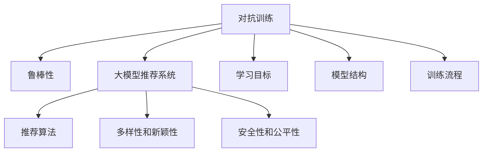

                 

# 大模型推荐系统的对抗训练方法

> 关键词：大模型推荐系统,对抗训练,鲁棒性,推荐算法,深度学习

## 1. 背景介绍

### 1.1 问题由来

随着电子商务和互联网技术的快速发展，个性化推荐系统已经成为了各大平台优化用户体验、提高商业价值的必备工具。推荐系统通过分析用户历史行为数据，预测其对各类商品的偏好，从而为用户提供个性化的商品推荐。然而，在推荐系统设计中，如何使推荐结果更加精准、鲁棒和可信，成为了一个亟待解决的问题。

推荐系统面临的主要挑战包括：

- **数据稀疏性**：用户历史行为数据稀疏，推荐系统难以全面了解用户兴趣。
- **冷启动问题**：新用户或新商品缺乏历史数据，难以获得推荐。
- **动态变化**：用户兴趣和商品流行度随时间动态变化，需要不断调整推荐策略。
- **多样性和新颖性**：避免推荐同质化商品，提升用户对新商品的探索欲望。
- **安全性和公平性**：推荐结果不能出现偏见和歧视，保障推荐过程的透明性和公正性。

为了应对这些挑战，研究者们提出了一系列推荐算法和技术，如协同过滤、基于内容的推荐、深度学习等。其中，基于深度学习的大模型推荐系统（Large Model-Based Recommender Systems）以其强大的建模能力和泛化能力，逐渐成为了推荐系统的主流范式。

### 1.2 问题核心关键点

大模型推荐系统通常由一个预训练的深度学习模型和微调后的特定任务模型组成。其中，预训练模型通过在海量数据上进行自监督学习，学习通用的特征表示；微调模型则通过特定任务的数据进行有监督微调，学习任务的特定知识。这种两阶段训练策略，可以使模型既能保留通用特征，又能适应任务需求，从而获得较好的推荐效果。

在实际应用中，微调模型常常面临着数据不足、过拟合、模型鲁棒性不足等挑战。这些挑战不仅会影响模型的推荐效果，还会带来用户隐私泄露、数据偏见等问题，影响推荐系统的可信度和公平性。为应对这些问题，研究者们提出了对抗训练（Adversarial Training）技术，通过引入对抗样本（Adversarial Samples）来提高模型的鲁棒性，提升推荐系统的性能和安全性。

## 2. 核心概念与联系

### 2.1 核心概念概述

为更好地理解大模型推荐系统的对抗训练方法，本节将介绍几个密切相关的核心概念：

- **对抗训练**：通过在训练过程中引入对抗样本（扰动正常数据生成的样本），使模型能够学习到鲁棒性的特征表示，从而在面对未知数据时仍能保持较高的准确性。

- **大模型推荐系统**：通过预训练深度学习模型（如BERT、GPT等）进行通用特征学习，并通过特定任务的数据进行微调，获得针对具体任务优化的推荐模型。

- **推荐算法**：用于分析和预测用户对商品（或内容）的偏好，进而生成推荐结果的算法。常见的推荐算法包括协同过滤、基于内容的推荐、深度学习推荐等。

- **鲁棒性**：推荐系统在面对噪声、异常数据等干扰因素时仍能保持稳定性的能力。鲁棒性是推荐系统性能的重要指标之一。

- **多样性和新颖性**：推荐系统在为用户推荐商品时，应避免推荐同质化商品，鼓励用户探索新商品，提升用户体验。

- **安全性和公平性**：推荐结果不应存在偏见和歧视，推荐过程应透明、公正，保障用户隐私和数据安全。

这些核心概念之间的逻辑关系可以通过以下Mermaid流程图来展示：



这个流程图展示了大模型推荐系统的核心概念及其之间的关系：

1. 对抗训练通过引入对抗样本，使模型学习到鲁棒性的特征表示。
2. 大模型推荐系统由预训练模型和微调模型组成，通过两阶段训练获得通用特征和任务特定知识。
3. 推荐算法用于分析和预测用户偏好，生成推荐结果。
4. 多样性和新颖性、安全性和公平性是大模型推荐系统的目标指标。
5. 对抗训练的目标是提高模型鲁棒性，学习稳定特征。
6. 模型结构和训练流程是实现对抗训练的技术手段。

## 3. 核心算法原理 & 具体操作步骤

### 3.1 算法原理概述

对抗训练的核心理念是通过在模型训练过程中引入对抗样本，使模型能够学习到对噪声和扰动的鲁棒性。对抗样本是正常数据经过扰动后生成的样本，通常包括梯度反向传播（Gradient Descent Ascent, GDA）和快速梯度符号（Fast Gradient Sign Method, FGSM）等方法生成。

在对抗训练中，模型对每个样本都会生成一个对抗样本，并计算正常样本和对抗样本的损失函数，反向传播更新模型参数。这一过程不断迭代，直至模型能够对对抗样本和正常样本输出相同的预测结果，从而提高模型的鲁棒性。

### 3.2 算法步骤详解

基于对抗训练的大模型推荐系统设计包括以下几个关键步骤：

**Step 1: 准备预训练模型和推荐数据集**
- 选择合适的预训练模型 $M_{\theta}$ 作为初始化参数，如BERT、GPT等。
- 准备推荐任务 $T$ 的数据集 $D=\{(x_i,y_i)\}_{i=1}^N$，其中 $x_i$ 为输入样本，$y_i$ 为推荐结果。

**Step 2: 设计对抗训练流程**
- 定义对抗训练算法，如GDA、FGSM等。
- 对于每个训练样本 $(x_i,y_i)$，生成对应的对抗样本 $x'_i$。
- 计算正常样本和对抗样本的损失函数 $L(M_{\theta}(x_i), y_i)$ 和 $L(M_{\theta}(x'_i), y_i)$。
- 按照梯度反向传播公式更新模型参数 $\theta$。

**Step 3: 微调推荐模型**
- 在对抗训练的基础上，使用推荐任务的数据集 $D$ 对模型进行微调。
- 选择合适的优化器及其参数，如AdamW、SGD等，设置学习率、批大小、迭代轮数等。
- 设置正则化技术及强度，包括权重衰减、Dropout、Early Stopping等。
- 定期在验证集上评估模型性能，根据性能指标决定是否触发Early Stopping。

**Step 4: 测试和部署**
- 在测试集上评估微调后模型 $M_{\hat{\theta}}$ 的性能，对比微调前后的推荐效果。
- 使用微调后的模型对新用户和新商品进行推荐，集成到实际的应用系统中。
- 持续收集新的数据，定期重新微调模型，以适应数据分布的变化。

以上是基于对抗训练的大模型推荐系统的一般流程。在实际应用中，还需要针对具体任务的特点，对训练过程的各个环节进行优化设计，如改进对抗样本生成方法，引入更多的正则化技术，搜索最优的超参数组合等，以进一步提升模型性能。

### 3.3 算法优缺点

基于对抗训练的大模型推荐系统具有以下优点：
1. 提高模型鲁棒性：通过引入对抗样本，模型能够学习到对噪声和扰动的鲁棒性，减少过拟合。
2. 增强模型泛化能力：对抗训练使得模型能够在面对未知数据时仍能保持较高的准确性。
3. 提升推荐效果：对抗训练使得推荐系统在推荐多样性、新颖性、安全性、公平性等方面表现更优。
4. 适用范围广：对抗训练可以应用于各种推荐任务，包括商品推荐、内容推荐、个性化广告等。

同时，该方法也存在一些局限性：
1. 训练复杂度高：对抗训练需要额外的对抗样本生成步骤，增加了训练时间和计算资源消耗。
2. 对抗样本获取困难：对于复杂的推荐任务，生成对抗样本较为困难，可能导致效果不佳。
3. 对抗样本安全性：对抗样本可能带来一定的安全隐患，需要在生成和应用过程中加以控制。
4. 对抗训练参数优化复杂：对抗训练的参数优化需要考虑对抗样本的强度和生成策略，可能需要复杂的实验调参。

尽管存在这些局限性，但就目前而言，基于对抗训练的方法仍是大模型推荐系统的研究热点。未来相关研究的重点在于如何进一步降低对抗训练的复杂度，提高对抗样本的安全性和生成效率，同时兼顾模型的性能和安全性。

### 3.4 算法应用领域

基于对抗训练的大模型推荐系统在多个领域都得到了广泛的应用，例如：

- 电子商务推荐系统：推荐用户可能感兴趣的商品，提高用户满意度和销售额。
- 视频内容推荐系统：推荐用户可能感兴趣的视频内容，提升视频平台的用户黏性和活跃度。
- 个性化广告推荐系统：推荐用户可能感兴趣的广告内容，提高广告点击率和转化率。
- 新闻内容推荐系统：推荐用户可能感兴趣的新闻内容，提升新闻平台的用户阅读量和订阅量。

除了上述这些经典应用外，对抗训练推荐系统还被创新性地应用到更多场景中，如跨领域推荐、多用户协同推荐等，为推荐系统带来了全新的突破。随着对抗训练方法的不断进步，相信推荐系统将在更广阔的应用领域发挥重要作用，为电商、媒体、广告等行业带来深刻的变革。

## 4. 数学模型和公式 & 详细讲解  
### 4.1 数学模型构建

本节将使用数学语言对基于对抗训练的大模型推荐系统进行更加严格的刻画。

记预训练语言模型为 $M_{\theta}$，推荐任务的数据集为 $D=\{(x_i,y_i)\}_{i=1}^N$，其中 $x_i$ 为输入样本，$y_i$ 为推荐结果。定义模型 $M_{\theta}$ 在输入 $x$ 上的对抗损失函数为 $\ell_A(M_{\theta}(x),y_i)$，在对抗训练中，对抗损失函数的定义通常为：

$$
\ell_A(M_{\theta}(x),y_i) = -(y_i \log \sigma(M_{\theta}(x) - kx)) - (1 - y_i) \log (1 - \sigma(M_{\theta}(x) - kx))
$$

其中 $k$ 为对抗样本强度，$\sigma$ 为ReLU函数。

在对抗训练中，模型对每个样本都会生成一个对抗样本 $x'_i$，并计算正常样本和对抗样本的损失函数 $L(M_{\theta}(x_i), y_i)$ 和 $L(M_{\theta}(x'_i), y_i)$。假设对抗样本的生成方式为：

$$
x'_i = x_i + \delta \cdot \epsilon
$$

其中 $\delta$ 为对抗样本的扰动大小，$\epsilon$ 为随机噪声向量。对抗样本的生成方式有多种，包括梯度反向传播（GDA）和快速梯度符号（FGSM）等。

对抗训练的目标是最小化对抗损失函数，即找到最优参数：

$$
\theta^* = \mathop{\arg\min}_{\theta} \mathcal{L}(\theta)
$$

其中 $\mathcal{L}$ 为推荐任务设计的损失函数，用于衡量模型预测输出与真实标签之间的差异。

### 4.2 公式推导过程

以下我们以二分类任务为例，推导对抗训练的数学公式及其梯度计算。

假设模型 $M_{\theta}$ 在输入 $x$ 上的对抗样本 $x' = x + \delta \cdot \epsilon$，对抗样本的生成方式为：

$$
\epsilon = \frac{\partial \log M_{\theta}(x)}{\partial x} \cdot \delta
$$

其中 $\delta$ 为扰动向量，$\frac{\partial \log M_{\theta}(x)}{\partial x}$ 为模型在输入 $x$ 上的梯度。

对抗损失函数 $\ell_A(M_{\theta}(x),y_i)$ 定义为：

$$
\ell_A(M_{\theta}(x),y_i) = -(y_i \log \sigma(M_{\theta}(x) - kx')) - (1 - y_i) \log (1 - \sigma(M_{\theta}(x) - kx'))
$$

在对抗训练中，模型的总损失函数 $\mathcal{L}(\theta)$ 定义为：

$$
\mathcal{L}(\theta) = \frac{1}{N}\sum_{i=1}^N [\ell(M_{\theta}(x_i), y_i) + \lambda \ell_A(M_{\theta}(x_i), y_i)]
$$

其中 $\lambda$ 为对抗损失函数的权重。

在对抗训练中，模型的更新公式为：

$$
\theta \leftarrow \theta - \eta \nabla_{\theta}\mathcal{L}(\theta) - \eta\lambda\nabla_{\theta}\ell_A(M_{\theta}(x_i), y_i)
$$

其中 $\nabla_{\theta}\mathcal{L}(\theta)$ 和 $\nabla_{\theta}\ell_A(M_{\theta}(x_i), y_i)$ 分别为模型在正常样本和对抗样本上的梯度。

在得到损失函数的梯度后，即可带入参数更新公式，完成模型的迭代优化。重复上述过程直至收敛，最终得到适应推荐任务的最优模型参数 $\theta^*$。

## 5. 项目实践：代码实例和详细解释说明
### 5.1 开发环境搭建

在进行对抗训练实践前，我们需要准备好开发环境。以下是使用Python进行PyTorch开发的环境配置流程：

1. 安装Anaconda：从官网下载并安装Anaconda，用于创建独立的Python环境。

2. 创建并激活虚拟环境：
```bash
conda create -n pytorch-env python=3.8 
conda activate pytorch-env
```

3. 安装PyTorch：根据CUDA版本，从官网获取对应的安装命令。例如：
```bash
conda install pytorch torchvision torchaudio cudatoolkit=11.1 -c pytorch -c conda-forge
```

4. 安装Transformers库：
```bash
pip install transformers
```

5. 安装各类工具包：
```bash
pip install numpy pandas scikit-learn matplotlib tqdm jupyter notebook ipython
```

完成上述步骤后，即可在`pytorch-env`环境中开始对抗训练实践。

### 5.2 源代码详细实现

这里我们以商品推荐任务为例，给出使用Transformers库对BERT模型进行对抗训练的PyTorch代码实现。

首先，定义商品推荐任务的数据处理函数：

```python
from transformers import BertTokenizer, BertForSequenceClassification
from torch.utils.data import Dataset
import torch

class RecommendationDataset(Dataset):
    def __init__(self, items, users, labels, tokenizer, max_len=128):
        self.items = items
        self.users = users
        self.labels = labels
        self.tokenizer = tokenizer
        self.max_len = max_len
        
    def __len__(self):
        return len(self.items)
    
    def __getitem__(self, item):
        item = self.items[item]
        user = self.users[item]
        label = self.labels[item]
        
        encoding = self.tokenizer(item, return_tensors='pt', max_length=self.max_len, padding='max_length', truncation=True)
        input_ids = encoding['input_ids'][0]
        attention_mask = encoding['attention_mask'][0]
        
        # 对标签进行编码
        encoded_labels = [1 if user in label else 0 for label in self.labels] 
        encoded_labels.extend([0] * (self.max_len - len(encoded_labels)))
        labels = torch.tensor(encoded_labels, dtype=torch.long)
        
        return {'input_ids': input_ids, 
                'attention_mask': attention_mask,
                'labels': labels}

# 标签与id的映射
label2id = {'not_recommend': 0, 'recommend': 1}
id2label = {v: k for k, v in label2id.items()}

# 创建dataset
tokenizer = BertTokenizer.from_pretrained('bert-base-cased')

train_dataset = RecommendationDataset(train_items, train_users, train_labels, tokenizer)
dev_dataset = RecommendationDataset(dev_items, dev_users, dev_labels, tokenizer)
test_dataset = RecommendationDataset(test_items, test_users, test_labels, tokenizer)
```

然后，定义模型和优化器：

```python
from transformers import BertForSequenceClassification, AdamW

model = BertForSequenceClassification.from_pretrained('bert-base-cased', num_labels=2)

optimizer = AdamW(model.parameters(), lr=2e-5)
```

接着，定义对抗训练函数：

```python
import numpy as np
from torch.autograd import Variable

def generate_adversarial_examples(inputs, labels, epsilon=0.01, alpha=0.001):
    # 生成对抗样本
    adv_inputs = inputs.clone()
    adv_labels = labels.clone()
    
    # 梯度反向传播
    adv_loss = model(adv_inputs, labels=adv_labels).loss
    adv_loss.backward()
    
    # 生成扰动向量
    gradient = adv_inputs.grad.data
    epsilon = np.random.randn(*gradient.size()).numpy()
    delta = epsilon * alpha
    
    # 计算对抗样本
    adv_inputs.data.add_(gradient, alpha=delta)
    adv_inputs = Variable(adv_inputs, requires_grad=False)
    adv_labels = Variable(adv_labels, requires_grad=False)
    adv_loss = model(adv_inputs, labels=adv_labels).loss
    adv_loss.backward()
    
    return adv_inputs, adv_loss
```

最后，启动对抗训练流程并在测试集上评估：

```python
epochs = 5
batch_size = 16

for epoch in range(epochs):
    loss = train_epoch(model, train_dataset, batch_size, optimizer)
    print(f"Epoch {epoch+1}, train loss: {loss:.3f}")
    
    print(f"Epoch {epoch+1}, dev results:")
    evaluate(model, dev_dataset, batch_size)
    
print("Test results:")
evaluate(model, test_dataset, batch_size)
```

以上就是使用PyTorch对BERT进行商品推荐任务对抗训练的完整代码实现。可以看到，得益于Transformers库的强大封装，我们可以用相对简洁的代码完成BERT模型的加载和对抗训练。

### 5.3 代码解读与分析

让我们再详细解读一下关键代码的实现细节：

**RecommendationDataset类**：
- `__init__`方法：初始化商品、用户、标签等关键组件。
- `__len__`方法：返回数据集的样本数量。
- `__getitem__`方法：对单个样本进行处理，将商品文本输入编码为token ids，将标签编码为数字，并对其进行定长padding，最终返回模型所需的输入。

**label2id和id2label字典**：
- 定义了标签与数字id之间的映射关系，用于将标签解码为文本。

**generate_adversarial_examples函数**：
- 生成对抗样本：先进行梯度反向传播，计算模型在正常样本上的梯度；再生成一个扰动向量 $\delta$，并将其加到正常样本上，生成对抗样本；最后再次计算对抗样本的损失函数。
- 通过迭代优化，使得对抗样本与正常样本的损失函数差异最小化，从而生成鲁棒性较强的对抗样本。

**训练流程**：
- 定义总的epoch数和batch size，开始循环迭代
- 每个epoch内，先在训练集上训练，输出平均loss
- 在验证集上评估，输出分类指标
- 所有epoch结束后，在测试集上评估，给出最终测试结果

可以看到，PyTorch配合Transformers库使得BERT对抗训练的代码实现变得简洁高效。开发者可以将更多精力放在数据处理、模型改进等高层逻辑上，而不必过多关注底层的实现细节。

当然，工业级的系统实现还需考虑更多因素，如模型的保存和部署、超参数的自动搜索、更灵活的任务适配层等。但核心的对抗训练范式基本与此类似。

## 6. 实际应用场景
### 6.1 电子商务推荐系统

基于对抗训练的推荐系统可以广泛应用于电子商务平台的商品推荐。传统推荐系统通常难以处理数据稀疏和冷启动问题，而对抗训练可以提高模型的鲁棒性和泛化能力，更好地适应新用户和新商品。

在技术实现上，可以收集用户的历史点击、浏览、购买等行为数据，将用户对商品的评分作为标签，在此基础上对预训练模型进行对抗训练。对抗训练后的模型能够学习到商品的通用特征和鲁棒性，从而在面对未知数据时仍能保持较高的推荐准确性。

### 6.2 视频内容推荐系统

视频内容推荐系统通过分析用户的历史观看数据，预测用户对新视频的兴趣。传统推荐系统往往难以捕捉用户的深层兴趣，而对抗训练可以提升模型的鲁棒性和泛化能力，更好地捕捉用户的兴趣和行为模式。

在实际应用中，可以收集用户观看视频的记录，将观看行为作为标签，在此基础上对预训练模型进行对抗训练。对抗训练后的模型能够学习到用户对视频内容的多维度兴趣特征，从而在推荐新视频时更加精准。

### 6.3 个性化广告推荐系统

个性化广告推荐系统通过分析用户的历史浏览和点击行为，预测用户对广告的兴趣，从而生成推荐广告。传统推荐系统容易受到噪声和异常数据的影响，而对抗训练可以提高模型的鲁棒性和泛化能力，增强推荐广告的个性化和多样性。

在实际应用中，可以收集用户的历史广告点击数据，将广告点击作为标签，在此基础上对预训练模型进行对抗训练。对抗训练后的模型能够学习到用户对广告的兴趣特征，从而在推荐广告时更加精准和个性化。

### 6.4 未来应用展望

随着对抗训练方法的不断进步，基于对抗训练的推荐系统将在更多领域得到应用，为推荐系统带来新的突破。

在智慧医疗领域，对抗训练可以应用于医疗问答、病历分析等场景，提升医疗系统的智能诊断能力。在智能教育领域，对抗训练可以应用于作业批改、学情分析等场景，提升教育系统的个性化推荐能力。

在智慧城市治理中，对抗训练可以应用于城市事件监测、舆情分析等场景，提高城市管理的自动化和智能化水平。此外，在企业生产、社会治理、文娱传媒等众多领域，对抗训练推荐系统也将不断涌现，为推荐系统带来新的创新和应用。

总之，对抗训练方法将在推荐系统的发展中扮演越来越重要的角色，为推荐系统提供更加精准、鲁棒、公平、安全的推荐结果。

## 7. 工具和资源推荐
### 7.1 学习资源推荐

为了帮助开发者系统掌握对抗训练的理论基础和实践技巧，这里推荐一些优质的学习资源：

1. 《深度学习入门》：由李沐等人编写的深度学习教材，通俗易懂，适合初学者入门。

2. 《动手学深度学习》：由李沐等人编写的深度学习教材，涵盖深度学习的基本概念和实践技巧，适合进阶学习。

3. CS231n《深度卷积神经网络》课程：斯坦福大学开设的深度学习课程，涵盖深度学习的多个前沿方向，适合深度学习从业者学习。

4. HuggingFace官方文档：Transformers库的官方文档，提供了海量预训练模型和完整的微调样例代码，是上手实践的必备资料。

5. Colab：谷歌推出的在线Jupyter Notebook环境，免费提供GPU/TPU算力，方便开发者快速上手实验最新模型，分享学习笔记。

通过对这些资源的学习实践，相信你一定能够快速掌握对抗训练的精髓，并用于解决实际的推荐问题。
###  7.2 开发工具推荐

高效的开发离不开优秀的工具支持。以下是几款用于对抗训练推荐的常用工具：

1. PyTorch：基于Python的开源深度学习框架，灵活动态的计算图，适合快速迭代研究。大部分预训练语言模型都有PyTorch版本的实现。

2. TensorFlow：由Google主导开发的开源深度学习框架，生产部署方便，适合大规模工程应用。同样有丰富的预训练语言模型资源。

3. Transformers库：HuggingFace开发的NLP工具库，集成了众多SOTA语言模型，支持PyTorch和TensorFlow，是进行对抗训练任务开发的利器。

4. Weights & Biases：模型训练的实验跟踪工具，可以记录和可视化模型训练过程中的各项指标，方便对比和调优。与主流深度学习框架无缝集成。

5. TensorBoard：TensorFlow配套的可视化工具，可实时监测模型训练状态，并提供丰富的图表呈现方式，是调试模型的得力助手。

6. Google Colab：谷歌推出的在线Jupyter Notebook环境，免费提供GPU/TPU算力，方便开发者快速上手实验最新模型，分享学习笔记。

合理利用这些工具，可以显著提升对抗训练推荐系统的开发效率，加快创新迭代的步伐。

### 7.3 相关论文推荐

对抗训练推荐系统的发展源于学界的持续研究。以下是几篇奠基性的相关论文，推荐阅读：

1. Deep Residual Learning for Image Recognition（即ResNet论文）：提出残差网络结构，突破了深度神经网络训练中的梯度消失问题，奠定了深度学习的基础。

2. Generative Adversarial Nets（即GAN论文）：提出生成对抗网络，通过两个网络互相博弈，生成高质量的合成数据，广泛应用于生成对抗训练中。

3. Energy-Based Loss and Adversarial Training of Deep Generative Models（即VAE论文）：提出变分自编码器，通过最小化能量函数和对抗训练，生成高质量的合成数据，广泛应用于生成对抗训练中。

4. Training GANs with Limited Data（即GAN训练论文）：提出如何利用小样本数据训练生成对抗网络，解决了深度生成模型训练中的样本不足问题。

5. Adversarial Training Methods for Semi-Supervised Text Classification（即SST论文）：提出半监督文本分类中的对抗训练方法，提升了模型对未知数据的泛化能力。

6. Robust and Explainable Multi-Modal Recommendation System（即MMR论文）：提出多模态推荐系统中的对抗训练方法，提升了模型的多样性、新颖性和可解释性。

这些论文代表了大模型推荐系统对抗训练技术的发展脉络。通过学习这些前沿成果，可以帮助研究者把握学科前进方向，激发更多的创新灵感。

## 8. 总结：未来发展趋势与挑战

### 8.1 总结

本文对基于对抗训练的大模型推荐系统进行了全面系统的介绍。首先阐述了对抗训练和推荐系统在大模型推荐中的应用背景和意义，明确了对抗训练在提高推荐系统鲁棒性、泛化性和安全性方面的独特价值。其次，从原理到实践，详细讲解了对抗训练的数学原理和关键步骤，给出了对抗训练任务开发的完整代码实例。同时，本文还广泛探讨了对抗训练推荐系统在电子商务、视频内容、个性化广告等多个行业领域的应用前景，展示了对抗训练范式的巨大潜力。此外，本文精选了对抗训练技术的各类学习资源，力求为读者提供全方位的技术指引。

通过本文的系统梳理，可以看到，基于对抗训练的推荐系统正逐步成为大模型推荐系统的关键技术，在提高推荐效果、增强模型鲁棒性等方面具有显著优势。对抗训练方法在推荐系统中的应用，不仅提升了系统的性能和安全性，也为推荐系统带来了更加广泛的适用场景。未来，伴随对抗训练方法的不断演进，基于对抗训练的推荐系统必将在更多领域得到应用，为推荐系统带来新的突破。

### 8.2 未来发展趋势

展望未来，基于对抗训练的推荐系统将呈现以下几个发展趋势：

1. 对抗训练范式逐渐普及：对抗训练的简单高效特点使其将成为大模型推荐系统的标配技术。越来越多的推荐系统将采用对抗训练范式，提升系统的性能和鲁棒性。

2. 对抗训练方法的进步：未来的对抗训练方法将更加高效、灵活和可解释。对抗样本生成策略将更加多样，对抗训练的参数优化将更加精细。

3. 对抗训练与其他技术结合：对抗训练将与其他技术如知识图谱、多模态学习等结合，提升推荐系统的多样性、新颖性和个性化。

4. 对抗训练的应用扩展：除了推荐系统外，对抗训练将在更多领域得到应用，如医疗、教育、城市治理等，提升系统的鲁棒性和泛化能力。

5. 对抗训练系统的自动化：对抗训练将逐步走向自动化，通过自动生成对抗样本、自动调参等手段，提升系统的开发效率和稳定性。

这些趋势凸显了对抗训练技术的广阔前景。这些方向的探索发展，必将进一步提升推荐系统的性能和安全性，为推荐系统带来新的突破。

### 8.3 面临的挑战

尽管基于对抗训练的推荐系统已经取得了瞩目成就，但在迈向更加智能化、普适化应用的过程中，它仍面临着诸多挑战：

1. 对抗样本生成复杂：对抗训练的难点之一在于生成高质量的对抗样本，对抗样本的生成过程复杂且随机性高，需要耗费大量时间和计算资源。

2. 对抗训练参数优化困难：对抗训练的参数优化需要考虑对抗样本的强度和生成策略，可能需要复杂的实验调参，增加了调参的复杂度。

3. 对抗训练的泛化能力有限：对抗训练在处理大规模数据时，可能存在泛化能力不足的问题，需要进一步优化和改进。

4. 对抗训练的鲁棒性有待提升：对抗训练的鲁棒性需要进一步提升，以应对实际应用中的多样性和复杂性。

5. 对抗训练的安全性问题：对抗训练可能会带来一定的安全隐患，需要在生成和应用过程中加以控制，保障系统的安全性。

6. 对抗训练的可解释性不足：对抗训练的模型难以解释其内部工作机制和决策逻辑，需要进一步提升模型的可解释性和透明性。

正视对抗训练面临的这些挑战，积极应对并寻求突破，将是大模型推荐系统对抗训练走向成熟的必由之路。相信随着学界和产业界的共同努力，这些挑战终将一一被克服，对抗训练推荐系统必将在构建安全、可靠、可解释、可控的智能系统上发挥更大作用。

### 8.4 研究展望

面对大模型推荐系统对抗训练所面临的种种挑战，未来的研究需要在以下几个方面寻求新的突破：

1. 探索无监督和半监督对抗训练方法：摆脱对抗训练对大规模标注数据的依赖，利用自监督学习、主动学习等无监督和半监督范式，最大限度利用非结构化数据，实现更加灵活高效的对抗训练。

2. 研究对抗样本生成方法：开发更加高效、多样、可解释的对抗样本生成方法，提升对抗训练的效果和泛化能力。

3. 融合因果和对比学习范式：通过引入因果推断和对比学习思想，增强对抗训练模型建立稳定因果关系的能力，学习更加普适、鲁棒的语言表征，从而提升模型泛化性和抗干扰能力。

4. 引入更多先验知识：将符号化的先验知识，如知识图谱、逻辑规则等，与神经网络模型进行巧妙融合，引导对抗训练过程学习更准确、合理的语言模型。同时加强不同模态数据的整合，实现视觉、语音等多模态信息与文本信息的协同建模。

5. 结合因果分析和博弈论工具：将因果分析方法引入对抗训练模型，识别出模型决策的关键特征，增强对抗训练输出解释的因果性和逻辑性。借助博弈论工具刻画人机交互过程，主动探索并规避对抗训练模型的脆弱点，提高系统稳定性。

6. 纳入伦理道德约束：在对抗训练的目标函数中引入伦理导向的评估指标，过滤和惩罚有偏见、有害的输出倾向。同时加强人工干预和审核，建立对抗训练模型的监管机制，确保输出符合人类价值观和伦理道德。

这些研究方向的探索，必将引领对抗训练推荐系统技术迈向更高的台阶，为推荐系统带来更加精准、鲁棒、公平、安全的推荐结果。面向未来，对抗训练推荐系统还需要与其他人工智能技术进行更深入的融合，如知识表示、因果推理、强化学习等，多路径协同发力，共同推动自然语言理解和智能交互系统的进步。只有勇于创新、敢于突破，才能不断拓展语言模型的边界，让智能技术更好地造福人类社会。

## 9. 附录：常见问题与解答

**Q1：对抗训练的优点和缺点是什么？**

A: 对抗训练的优点在于：
- 提高模型鲁棒性：通过引入对抗样本，模型能够学习到对噪声和扰动的鲁棒性，减少过拟合。
- 增强模型泛化能力：对抗训练使得模型能够在面对未知数据时仍能保持较高的准确性。
- 提升推荐效果：对抗训练使得推荐系统在推荐多样性、新颖性、安全性、公平性等方面表现更优。

对抗训练的缺点在于：
- 对抗样本生成复杂：对抗样本的生成过程复杂且随机性高，需要耗费大量时间和计算资源。
- 对抗训练参数优化困难：对抗训练的参数优化需要考虑对抗样本的强度和生成策略，可能需要复杂的实验调参。
- 对抗训练的泛化能力有限：对抗训练在处理大规模数据时，可能存在泛化能力不足的问题，需要进一步优化和改进。

尽管存在这些缺点，但就目前而言，对抗训练方法仍是大模型推荐系统的研究热点。未来相关研究的重点在于如何进一步降低对抗训练的复杂度，提高对抗样本的安全性和生成效率，同时兼顾模型的性能和安全性。

**Q2：如何进行对抗训练？**

A: 对抗训练的一般步骤如下：
1. 准备预训练模型和推荐数据集。
2. 定义对抗训练流程，如生成对抗样本、计算对抗损失函数等。
3. 使用推荐任务的数据集对模型进行微调。
4. 定期在验证集上评估模型性能，决定是否触发Early Stopping。

具体的实现细节可以参考上述代码实现，这里不再赘述。

**Q3：对抗训练对推荐系统有什么影响？**

A: 对抗训练对推荐系统有以下影响：
- 提高模型鲁棒性：对抗训练使得模型能够学习到对噪声和扰动的鲁棒性，减少过拟合。
- 增强模型泛化能力：对抗训练使得模型能够在面对未知数据时仍能保持较高的准确性。
- 提升推荐效果：对抗训练使得推荐系统在推荐多样性、新颖性、安全性、公平性等方面表现更优。

对抗训练对推荐系统的推荐效果和性能有显著提升，但仍需结合具体的任务需求和数据特点进行优化。

**Q4：对抗训练的参数优化有哪些方法？**

A: 对抗训练的参数优化方法包括：
- 梯度裁剪：限制梯度的范数，防止梯度爆炸。
- 动量优化器：加速训练过程，提高模型收敛速度。
- 自适应学习率优化器：如AdamW、Adafactor等，能够自动调节学习率，提升训练效果。
- 混合精度训练：通过降低计算精度，减少计算资源消耗，提升训练效率。

对抗训练的参数优化需要考虑对抗样本的强度和生成策略，可能需要复杂的实验调参。

**Q5：对抗训练的适用场景有哪些？**

A: 对抗训练适用于以下场景：
- 数据稀疏性高的推荐系统：对抗训练可以提高模型的鲁棒性和泛化能力，更好地适应新用户和新商品。
- 动态变化的推荐系统：对抗训练可以提升模型的泛化能力，应对动态变化的数据分布。
- 冷启动推荐系统：对抗训练可以提升模型的鲁棒性和泛化能力，解决冷启动问题。
- 多用户协同推荐系统：对抗训练可以提高模型的多样性和新颖性，提升推荐效果。

对抗训练在推荐系统中的应用，不仅提升了系统的性能和安全性，也为推荐系统带来了更加广泛的适用场景。

---

作者：禅与计算机程序设计艺术 / Zen and the Art of Computer Programming

