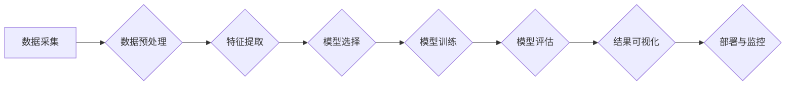

                 

## 时间序列分析：预测与异常检测技术

> 关键词：时间序列分析、预测模型、异常检测、ARIMA、LSTM、Prophet、机器学习、数据挖掘

## 1. 背景介绍

时间序列数据是现实世界中的一种常见数据类型，它记录了某个变量随时间推移的变化趋势。例如，股票价格、网站流量、气温、销售额等都是时间序列数据。随着数据量的爆炸式增长，如何有效地分析和利用时间序列数据变得越来越重要。时间序列分析主要涉及两个关键任务：**预测**和**异常检测**。

**1.1 预测**

时间序列预测是指根据历史数据预测未来某个时间点的数值。预测可以帮助我们做出更明智的决策，例如：

* **金融市场预测:** 预测股票价格、汇率等，帮助投资者做出投资决策。
* **销售预测:** 预测未来一段时间内的销售额，帮助企业优化库存管理和生产计划。
* **天气预报:** 预测未来几天内的气温、降雨量等，帮助人们做好防灾准备。

**1.2 异常检测**

异常检测是指识别时间序列数据中与正常模式相悖的异常值。异常值可能代表着一些重要的事件或问题，例如：

* **欺诈检测:** 识别信用卡交易中的异常行为，防止欺诈行为发生。
* **设备故障预测:** 识别设备运行数据中的异常值，预警设备故障。
* **网络安全监控:** 识别网络流量中的异常活动，防止网络攻击。

## 2. 核心概念与联系

时间序列分析的核心概念包括：趋势、季节性、周期性、随机波动等。

* **趋势:** 时间序列数据随时间推移的长期变化趋势。
* **季节性:** 时间序列数据在特定时间周期内重复出现的周期性变化。
* **周期性:** 时间序列数据在较长的时间周期内重复出现的周期性变化，周期长度通常大于季节性。
* **随机波动:** 时间序列数据中不可预测的随机变化。

这些概念相互关联，共同影响着时间序列数据的整体变化模式。

**2.1 时间序列分析流程图**



## 3. 核心算法原理 & 具体操作步骤

### 3.1 算法原理概述

时间序列分析算法可以分为两大类：**传统统计方法**和**机器学习方法**。

* **传统统计方法:** 包括ARIMA、SARIMA等模型，基于时间序列数据的统计特性进行建模和预测。
* **机器学习方法:** 包括LSTM、GRU、Prophet等模型，利用机器学习算法从时间序列数据中学习复杂的模式，进行预测和异常检测。

### 3.2 算法步骤详解

**3.2.1 ARIMA模型**

ARIMA模型是一种经典的时间序列预测模型，全称为Autoregressive Integrated Moving Average模型。它包含三个参数：p、d、q。

* p: 自回归阶数，表示模型中自回归项的个数。
* d: 差分阶数，表示对时间序列数据进行差分操作的次数。
* q: 移动平均阶数，表示模型中移动平均项的个数。

ARIMA模型的具体步骤如下：

1. 对时间序列数据进行平稳化处理，即去除趋势和季节性。
2. 根据数据特征选择合适的p、d、q参数。
3. 使用ARIMA模型进行时间序列预测。

**3.2.2 LSTM模型**

LSTM模型是一种长短期记忆网络，是一种专门用于处理时间序列数据的深度学习模型。它具有记忆单元，可以记住长期的依赖关系，从而更有效地学习时间序列数据的复杂模式。

LSTM模型的具体步骤如下：

1. 将时间序列数据转换为输入序列。
2. 将输入序列输入到LSTM网络中进行训练。
3. 使用训练好的LSTM模型进行时间序列预测。

### 3.3 算法优缺点

**3.3.1 ARIMA模型**

* **优点:** 
    * 模型简单易懂，易于实现。
    * 对于一些具有明确统计特性的时间序列数据，预测效果较好。
* **缺点:** 
    * 对数据平稳化要求较高。
    * 难以处理复杂的时间序列数据，例如存在非线性趋势和季节性变化的数据。

**3.3.2 LSTM模型**

* **优点:** 
    * 可以学习复杂的时间序列数据中的长期依赖关系。
    * 预测效果通常优于ARIMA模型。
* **缺点:** 
    * 模型复杂度高，训练时间长。
    * 需要大量的训练数据。

### 3.4 算法应用领域

ARIMA模型和LSTM模型广泛应用于以下领域：

* **金融市场预测:** 股票价格、汇率等预测。
* **销售预测:** 未来一段时间内的销售额预测。
* **天气预报:** 气温、降雨量等预测。
* **设备故障预测:** 设备运行数据中的异常值识别。
* **网络安全监控:** 网络流量中的异常活动识别。

## 4. 数学模型和公式 & 详细讲解 & 举例说明

### 4.1 数学模型构建

**4.1.1 ARIMA模型**

ARIMA模型的数学表达式如下：

$$
y_t = c + \phi_1 y_{t-1} + \phi_2 y_{t-2} + ... + \phi_p y_{t-p} + \theta_1 \epsilon_{t-1} + \theta_2 \epsilon_{t-2} + ... + \theta_q \epsilon_{t-q} + \epsilon_t
$$

其中：

* $y_t$ 是时间序列数据在时间t的观测值。
* $c$ 是截距项。
* $\phi_i$ 是自回归系数。
* $\theta_i$ 是移动平均系数。
* $\epsilon_t$ 是白噪声项。

**4.1.2 LSTM模型**

LSTM模型的数学表达式较为复杂，涉及到矩阵运算和激活函数等。

### 4.2 公式推导过程

ARIMA模型的公式推导过程涉及到时间序列数据的自回归和移动平均的数学原理。LSTM模型的公式推导过程涉及到神经网络的激活函数、权重更新等。

### 4.3 案例分析与讲解

**4.3.1 ARIMA模型案例分析**

可以使用ARIMA模型预测股票价格。例如，我们可以使用历史股票价格数据训练一个ARIMA模型，然后使用模型预测未来一周的股票价格。

**4.3.2 LSTM模型案例分析**

可以使用LSTM模型预测天气预报。例如，我们可以使用历史气温、降雨量等数据训练一个LSTM模型，然后使用模型预测未来一周的天气情况。

## 5. 项目实践：代码实例和详细解释说明

### 5.1 开发环境搭建

* Python 3.x
* NumPy
* Pandas
* Scikit-learn
* TensorFlow/PyTorch

### 5.2 源代码详细实现

**5.2.1 ARIMA模型代码示例**

```python
from statsmodels.tsa.arima.model import ARIMA
import pandas as pd

# 加载数据
data = pd.read_csv('stock_price.csv', index_col='Date')

# 训练ARIMA模型
model = ARIMA(data['Close'], order=(5, 1, 0))
model_fit = model.fit()

# 预测未来一周的股票价格
forecast = model_fit.predict(start=len(data), end=len(data) + 6)

# 打印预测结果
print(forecast)
```

**5.2.2 LSTM模型代码示例**

```python
import tensorflow as tf
from tensorflow.keras.models import Sequential
from tensorflow.keras.layers import LSTM, Dense

# 加载数据
data = pd.read_csv('weather_data.csv', index_col='Date')

# 训练LSTM模型
model = Sequential()
model.add(LSTM(units=50, return_sequences=True, input_shape=(data.shape[1], 1)))
model.add(LSTM(units=50))
model.add(Dense(units=1))
model.compile(loss='mean_squared_error', optimizer='adam')
model.fit(data, data, epochs=100)

# 预测未来一周的天气情况
forecast = model.predict(data[-7:])

# 打印预测结果
print(forecast)
```

### 5.3 代码解读与分析

**5.3.1 ARIMA模型代码解读**

* 使用`statsmodels`库中的`ARIMA`类训练ARIMA模型。
* `order=(5, 1, 0)`参数指定了模型的p、d、q值。
* `fit()`方法训练模型。
* `predict()`方法预测未来一周的股票价格。

**5.3.2 LSTM模型代码解读**

* 使用`tensorflow`库构建LSTM模型。
* `LSTM`层用于处理时间序列数据。
* `Dense`层用于输出预测结果。
* `compile()`方法配置模型的损失函数和优化器。
* `fit()`方法训练模型。
* `predict()`方法预测未来一周的天气情况。

### 5.4 运行结果展示

运行代码后，可以得到预测结果。例如，ARIMA模型的预测结果是一个股票价格的数值序列，LSTM模型的预测结果是一个天气情况的数值序列。

## 6. 实际应用场景

### 6.1 金融市场预测

时间序列分析在金融市场预测中应用广泛，例如：

* **股票价格预测:** 利用历史股票价格数据预测未来股票价格走势，帮助投资者做出投资决策。
* **汇率预测:** 利用历史汇率数据预测未来汇率走势，帮助企业进行外汇交易。
* **风险管理:** 利用时间序列分析识别金融市场中的风险因素，帮助金融机构进行风险管理。

### 6.2 销售预测

时间序列分析可以帮助企业预测未来一段时间内的销售额，从而优化库存管理和生产计划。例如：

* **产品销售预测:** 利用历史产品销售数据预测未来产品销售量，帮助企业调整生产计划。
* **市场需求预测:** 利用历史市场需求数据预测未来市场需求，帮助企业制定营销策略。

### 6.3 天气预报

时间序列分析是天气预报的重要工具，可以帮助预测未来天气情况。例如：

* **气温预测:** 利用历史气温数据预测未来气温变化趋势。
* **降雨量预测:** 利用历史降雨量数据预测未来降雨量。
* **风速预测:** 利用历史风速数据预测未来风速变化趋势。

### 6.4 未来应用展望

随着数据量的不断增长和人工智能技术的不断发展，时间序列分析将在更多领域得到应用，例如：

* **医疗保健:** 利用患者健康数据预测疾病风险，帮助医生进行早期诊断和治疗。
* **制造业:** 利用设备运行数据预测设备故障，帮助企业进行预防性维护。
* **交通运输:** 利用交通流量数据预测交通拥堵情况，帮助政府制定交通管理策略。

## 7. 工具和资源推荐

### 7.1 学习资源推荐

* **书籍:**
    * 《时间序列分析：预测与控制》
    * 《机器学习实战》
    * 《深度学习》
* **在线课程:**
    * Coursera: Time Series Analysis
    * edX: Machine Learning
    * Udacity: Deep Learning

### 7.2 开发工具推荐

* **Python:** 
    * NumPy
    * Pandas
    * Scikit-learn
    * TensorFlow/PyTorch
* **R:** 
    * forecast
    * tseries

### 7.3 相关论文推荐

* **ARIMA模型:**
    * Box, G. E. P., & Jenkins, G. M. (1976). Time series analysis: Forecasting and control. Holden-Day.
* **LSTM模型:**
    * Hochreiter, S., & Schmidhuber, J. (1997). Long short-term memory. Neural computation, 9(8), 1735-1780.

## 8. 总结：未来发展趋势与挑战

### 8.1 研究成果总结

时间序列分析已经取得了显著的成果，在预测和异常检测领域取得了广泛应用。

### 8.2 未来发展趋势

* **深度学习方法的应用:** 深度学习方法在时间序列分析领域越来越受欢迎，例如Transformer模型在自然语言处理领域的成功应用也为时间序列分析带来了新的思路。
* **结合其他技术:** 将时间序列分析与其他技术结合，例如计算机视觉、自然语言处理等，可以实现更智能的分析和预测。
* **数据可视化:** 更好的数据可视化方法可以帮助人们更直观地理解时间序列数据中的模式和趋势。

### 8.3 面临的挑战

* **数据质量:** 时间序列数据的质量直接影响着分析结果的准确性，如何处理缺失值、异常值等问题仍然是一个挑战。
* **模型复杂度:** 一些深度学习模型的复杂度较高，训练和部署需要大量的计算资源。
* **解释性:** 一些深度学习模型的预测结果难以解释，这限制了其在一些领域中的应用。

### 8.4 研究展望

未来时间序列分析的研究方向包括：

* **开发更鲁棒的模型:** 能够处理更复杂和不确定性更大的时间序列数据的模型。
* **提高模型的解释性:** 使得模型的预测结果更容易被理解和解释。
* **探索新的应用场景:** 将时间序列分析应用到更多新的领域。

## 9. 附录：常见问题与解答

**9.1 如何选择合适的ARIMA模型参数？**

可以使用AIC、BIC等信息准则来选择合适的ARIMA模型参数。

**9.2 LSTM模型的训练时间较长，如何加速训练？**

可以使用GPU加速训练，或者采用模型压缩等技术来减少模型参数量。

**9.3 如何处理时间序列数据中的缺失值？**

可以使用插值法、平均法等方法来处理缺失值。


作者：禅与计算机程序设计艺术 / Zen and the Art of Computer Programming 


<end_of_turn>

