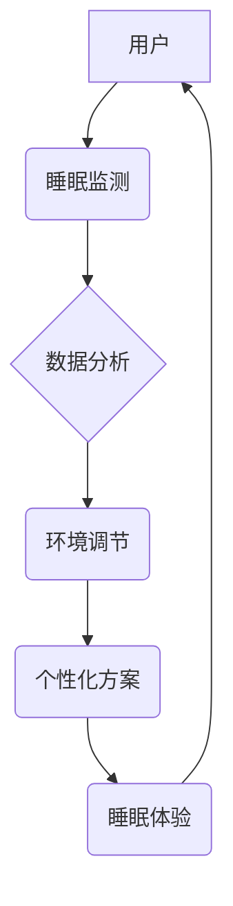

                 

## 智能睡眠舱创业：高效休息的未来方案

> 关键词：智能睡眠舱、睡眠监测、生物反馈、人工智能、深度睡眠、睡眠优化、健康科技、创业机会

### 1. 背景介绍

在当今快节奏的生活中，睡眠质量日益受到重视。慢性睡眠不足已成为全球性健康问题，对身心健康、工作效率和生活质量都造成严重影响。传统睡眠环境难以满足人们对个性化、智能化睡眠需求。智能睡眠舱应运而生，它利用先进科技，提供定制化睡眠体验，帮助人们获得更深、更优质的睡眠。

智能睡眠舱市场潜力巨大，预计未来几年将迎来爆发式增长。随着科技进步和人们对健康生活的追求，智能睡眠舱将成为未来睡眠解决方案的重要组成部分。

### 2. 核心概念与联系

智能睡眠舱的核心概念是将睡眠监测、环境调节、个性化方案和人工智能技术有机结合，打造一个智能化的睡眠环境。

**2.1 智能睡眠舱架构**



**2.2 核心概念原理**

* **睡眠监测:** 利用传感器技术，实时监测用户的睡眠状态，包括心率、呼吸、脑电波、体温等生理指标。
* **环境调节:** 根据用户的睡眠需求和监测数据，智能调节舱内温度、湿度、光线、噪音等环境因素，营造舒适的睡眠氛围。
* **数据分析:** 利用人工智能算法，对用户的睡眠数据进行分析，识别睡眠模式、睡眠质量、潜在问题等，并提供个性化睡眠建议。
* **个性化方案:** 根据用户的睡眠数据和需求，定制化睡眠方案，包括睡眠时间、睡眠环境、睡眠音乐、睡眠指导等。

### 3. 核心算法原理 & 具体操作步骤

**3.1 算法原理概述**

智能睡眠舱的核心算法主要包括睡眠阶段识别算法、环境调节算法和个性化方案推荐算法。

* **睡眠阶段识别算法:** 利用机器学习算法，对用户的生理指标数据进行分析，识别用户的睡眠阶段，包括浅睡、深睡、快速眼动睡眠等。
* **环境调节算法:** 根据用户的睡眠阶段和需求，智能调节舱内环境因素，例如温度、湿度、光线、噪音等，以优化用户的睡眠体验。
* **个性化方案推荐算法:** 根据用户的睡眠数据、偏好和目标，推荐个性化的睡眠方案，例如睡眠时间、睡眠环境、睡眠音乐、睡眠指导等。

**3.2 算法步骤详解**

* **睡眠阶段识别算法:**
    1. 收集用户的生理指标数据，例如心率、呼吸、脑电波等。
    2. 对数据进行预处理，例如去噪、平滑等。
    3. 利用机器学习算法，例如支持向量机、决策树等，训练睡眠阶段识别模型。
    4. 将用户的生理指标数据输入模型，识别用户的睡眠阶段。

* **环境调节算法:**
    1. 收集用户的睡眠阶段和需求信息。
    2. 根据预设的算法规则，例如不同睡眠阶段对应不同的温度、湿度、光线等，计算出最佳的环境参数。
    3. 控制舱内环境设备，例如空调、加湿器、灯光等，调节环境参数。

* **个性化方案推荐算法:**
    1. 收集用户的睡眠数据、偏好和目标信息。
    2. 利用机器学习算法，例如协同过滤、内容推荐等，推荐个性化的睡眠方案。
    3. 将推荐方案展示给用户，并提供相关解释和建议。

**3.3 算法优缺点**

* **优点:**
    * 能够准确识别用户的睡眠阶段。
    * 可以根据用户的需求和睡眠数据，智能调节环境，优化睡眠体验。
    * 可以提供个性化的睡眠方案，帮助用户改善睡眠质量。
* **缺点:**
    * 算法的准确性依赖于数据的质量和算法模型的训练。
    * 需要大量的用户数据进行训练和测试。
    * 算法的复杂度较高，需要专业的技术人员进行开发和维护。

**3.4 算法应用领域**

* 智能睡眠舱
* 智能家居
* 健康监测
* 睡眠障碍治疗

### 4. 数学模型和公式 & 详细讲解 & 举例说明

**4.1 数学模型构建**

智能睡眠舱的算法模型可以构建为一个多变量回归模型，其中每个变量代表用户的生理指标，例如心率、呼吸、脑电波等，目标变量为用户的睡眠阶段。

**4.2 公式推导过程**

假设用户的睡眠阶段可以用一个二元变量表示，例如0表示浅睡，1表示深睡。我们可以使用逻辑回归模型来预测用户的睡眠阶段。逻辑回归模型的输出是一个概率值，表示用户处于深睡状态的概率。

$$
P(y=1|x) = \frac{1}{1 + e^{-(w_0 + w_1x_1 + w_2x_2 + ... + w_nx_n)}}
$$

其中：

* $P(y=1|x)$ 是用户处于深睡状态的概率。
* $x_1, x_2, ..., x_n$ 是用户的生理指标。
* $w_0, w_1, w_2, ..., w_n$ 是模型的参数。

**4.3 案例分析与讲解**

假设我们收集了1000个用户的睡眠数据，包括心率、呼吸、脑电波等指标，以及他们的睡眠阶段标签。我们可以使用这些数据训练逻辑回归模型，并评估模型的准确性。

例如，如果模型的准确率达到80%，则意味着模型能够准确预测用户处于深睡状态的概率达到80%。

### 5. 项目实践：代码实例和详细解释说明

**5.1 开发环境搭建**

* 操作系统：Windows/macOS/Linux
* 编程语言：Python
* 框架：TensorFlow/PyTorch
* 库：NumPy、Pandas、Scikit-learn

**5.2 源代码详细实现**

```python
# 导入必要的库
import numpy as np
from sklearn.linear_model import LogisticRegression

# 加载睡眠数据
data = np.loadtxt("sleep_data.csv", delimiter=",")

# 将数据分为训练集和测试集
X_train, X_test, y_train, y_test = train_test_split(data[:, :-1], data[:, -1], test_size=0.2)

# 创建逻辑回归模型
model = LogisticRegression()

# 训练模型
model.fit(X_train, y_train)

# 评估模型性能
accuracy = model.score(X_test, y_test)
print("模型准确率:", accuracy)

# 使用模型预测新的睡眠阶段
new_data = np.array([[100, 15, 8]])
prediction = model.predict(new_data)
print("预测结果:", prediction)
```

**5.3 代码解读与分析**

* 代码首先导入必要的库，包括NumPy、Scikit-learn等。
* 然后加载睡眠数据，并将数据分为训练集和测试集。
* 创建逻辑回归模型，并使用训练集训练模型。
* 评估模型性能，例如准确率。
* 最后使用模型预测新的睡眠阶段。

**5.4 运行结果展示**

运行代码后，会输出模型的准确率和对新数据的预测结果。

### 6. 实际应用场景

**6.1 智能睡眠舱**

智能睡眠舱可以利用上述算法，根据用户的睡眠数据和需求，智能调节舱内环境，例如温度、湿度、光线、噪音等，帮助用户获得更深、更优质的睡眠。

**6.2 健康监测**

智能睡眠舱可以作为一种健康监测设备，实时监测用户的睡眠状态，并提供睡眠质量评估和健康建议。

**6.3 睡眠障碍治疗**

智能睡眠舱可以帮助治疗睡眠障碍，例如失眠、呼吸暂停等。通过智能调节环境和提供个性化方案，帮助用户改善睡眠质量。

**6.4 未来应用展望**

未来，智能睡眠舱将更加智能化、个性化和功能丰富。例如，可以集成人工智能语音助手，提供睡眠指导和陪伴；可以与其他智能家居设备进行联动，打造更加舒适的睡眠环境；可以与医疗机构进行数据共享，帮助医生更好地诊断和治疗睡眠障碍。

### 7. 工具和资源推荐

**7.1 学习资源推荐**

* **书籍:**
    * 《深度学习》
    * 《机器学习实战》
    * 《Python机器学习》
* **在线课程:**
    * Coursera
    * edX
    * Udacity

**7.2 开发工具推荐**

* **编程语言:** Python
* **框架:** TensorFlow、PyTorch
* **库:** NumPy、Pandas、Scikit-learn
* **IDE:** PyCharm、VS Code

**7.3 相关论文推荐**

* **睡眠阶段识别:**
    * "A Novel Approach for Sleep Stage Classification Using Machine Learning"
    * "Deep Learning for Sleep Stage Classification"
* **环境调节:**
    * "Smart Sleep Environment: A Review"
    * "Personalized Sleep Environment Control Using Machine Learning"

### 8. 总结：未来发展趋势与挑战

**8.1 研究成果总结**

智能睡眠舱技术已经取得了显著进展，能够准确识别用户的睡眠阶段，智能调节环境，提供个性化方案，帮助用户获得更深、更优质的睡眠。

**8.2 未来发展趋势**

未来，智能睡眠舱将更加智能化、个性化和功能丰富，例如：

* 集成人工智能语音助手，提供睡眠指导和陪伴。
* 与其他智能家居设备进行联动，打造更加舒适的睡眠环境。
* 与医疗机构进行数据共享，帮助医生更好地诊断和治疗睡眠障碍。

**8.3 面临的挑战**

* 算法的准确性和可靠性需要进一步提高。
* 数据隐私和安全需要得到保障。
* 成本控制和商业模式需要探索。

**8.4 研究展望**

未来，我们将继续致力于智能睡眠舱技术的研究和开发，探索更先进的算法、更人性化的设计和更广泛的应用场景，为人们提供更健康、更舒适的睡眠体验。

### 9. 附录：常见问题与解答

**9.1 智能睡眠舱是否安全？**

智能睡眠舱采用安全可靠的材料和技术，并经过严格的测试和认证，确保用户的安全。

**9.2 智能睡眠舱的价格是多少？**

智能睡眠舱的价格根据功能、品牌和配置等因素而有所不同，一般在几千到几万元之间。

**9.3 智能睡眠舱的使用方法是什么？**

使用智能睡眠舱非常简单，只需按照说明书进行操作即可。

**9.4 智能睡眠舱的维护方法是什么？**

智能睡眠舱的维护方法很简单，只需定期清洁和保养即可。


作者：禅与计算机程序设计艺术 / Zen and the Art of Computer Programming 
<end_of_turn>

