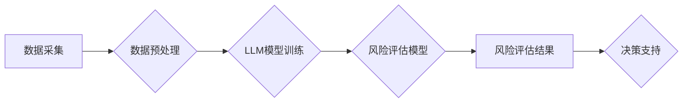

                 

## 智能风险评估：LLM在保险业务中的应用

> 关键词：大型语言模型（LLM）、风险评估、保险业务、自然语言处理（NLP）、机器学习（ML）、数据分析、人工智能（AI）

## 1. 背景介绍

保险业一直以来都依赖于传统的风险评估方法，例如收集客户历史数据、分析信用评分和进行人工调查。然而，这些方法往往存在着局限性，例如数据收集成本高、评估结果不够精准、难以处理复杂风险场景等。随着人工智能技术的快速发展，大型语言模型（LLM）的出现为保险业带来了新的机遇。LLM 拥有强大的文本理解和生成能力，能够从海量文本数据中提取关键信息，识别风险模式，并提供更精准、更全面的风险评估结果。

## 2. 核心概念与联系

**2.1  大型语言模型（LLM）**

LLM 是指能够理解和生成人类语言的深度学习模型。它们通过训练大量的文本数据，学习语言的语法、语义和上下文关系，从而具备强大的文本处理能力。例如，GPT-3、LaMDA 和 BERT 等都是著名的 LLM。

**2.2  风险评估**

风险评估是指识别、分析和量化潜在的风险，并制定相应的应对措施。在保险业中，风险评估是核心的业务环节，它直接影响着保险公司的盈利能力和风险控制水平。

**2.3  LLM在风险评估中的应用**

LLM 可以通过以下方式应用于保险业的风险评估：

* **文本数据分析：** LLM 可以从客户申请表、合同、新闻报道、社交媒体等文本数据中提取关键信息，例如客户的职业、收入、健康状况、信用记录等，为风险评估提供更全面的数据支持。
* **风险模式识别：** LLM 可以学习历史风险数据，识别潜在的风险模式，例如哪些客户更容易发生事故、哪些地区更容易发生自然灾害等，帮助保险公司更精准地预测风险。
* **自动化决策：** LLM 可以根据风险评估结果，自动生成保险报价、核保决定等，提高效率，降低人工成本。

**2.4  LLM风险评估架构**



## 3. 核心算法原理 & 具体操作步骤

**3.1  算法原理概述**

LLM 在风险评估中的应用主要基于自然语言处理（NLP）和机器学习（ML）算法。

* **NLP算法：** 用于处理和理解自然语言文本数据，例如词嵌入、文本分类、关系抽取等。
* **ML算法：** 用于从数据中学习模式，并进行预测，例如逻辑回归、支持向量机、决策树等。

**3.2  算法步骤详解**

1. **数据采集：** 收集相关文本数据，例如客户申请表、合同、新闻报道、社交媒体等。
2. **数据预处理：** 对文本数据进行清洗、格式化、标注等处理，使其适合模型训练。
3. **LLM模型训练：** 使用预训练的LLM模型，或训练新的LLM模型，使其能够理解和生成与风险评估相关的文本信息。
4. **风险评估模型构建：** 基于训练好的LLM模型，构建风险评估模型，例如使用逻辑回归模型预测客户发生事故的概率。
5. **风险评估：** 将新的客户数据输入风险评估模型，得到风险评估结果。
6. **决策支持：** 根据风险评估结果，为保险公司提供决策支持，例如确定保险报价、核保决定等。

**3.3  算法优缺点**

**优点：**

* **精准度高：** LLM 可以从海量文本数据中提取关键信息，识别复杂的风险模式，从而提供更精准的风险评估结果。
* **效率高：** LLM 可以自动化处理文本数据和风险评估，提高效率，降低人工成本。
* **可扩展性强：** LLM 可以根据需要扩展到新的数据源和风险类型。

**缺点：**

* **数据依赖性强：** LLM 的性能取决于训练数据的质量和数量。
* **解释性差：** LLM 的决策过程往往是黑箱，难以解释其背后的逻辑。
* **伦理风险：** LLM 可能存在偏见和歧视，需要谨慎使用。

**3.4  算法应用领域**

LLM 在风险评估领域的应用场景广泛，例如：

* **人身保险：** 评估客户的健康状况、生活习惯等风险因素，为客户提供个性化的保险报价。
* **财产保险：** 评估客户的财产价值、风险类型等因素，为客户提供合适的保险保障。
* **商业保险：** 评估企业的风险状况，为企业提供风险管理建议和保险方案。

## 4. 数学模型和公式 & 详细讲解 & 举例说明

**4.1  数学模型构建**

在风险评估中，可以使用逻辑回归模型来预测客户发生事故的概率。逻辑回归模型将输入特征映射到一个概率值，该概率值表示客户发生事故的可能性。

**4.2  公式推导过程**

逻辑回归模型的公式如下：

$$
P(Y=1|X) = \frac{1}{1 + e^{-(w^T X + b)}}
$$

其中：

* $P(Y=1|X)$ 是客户发生事故的概率，
* $X$ 是客户的特征向量，
* $w$ 是模型参数向量，
* $b$ 是模型偏置项，
* $e$ 是自然对数的底数。

**4.3  案例分析与讲解**

假设我们想要预测客户发生车祸的概率，客户的特征包括年龄、驾驶经验、驾驶记录等。我们可以使用逻辑回归模型训练一个风险评估模型。

训练完成后，我们可以将新的客户数据输入模型，得到其发生车祸的概率。例如，如果模型预测客户发生车祸的概率为 0.2，则表示该客户发生车祸的可能性为 20%。

## 5. 项目实践：代码实例和详细解释说明

**5.1  开发环境搭建**

* Python 3.7+
* TensorFlow 或 PyTorch
* Jupyter Notebook

**5.2  源代码详细实现**

```python
import tensorflow as tf

# 定义模型
model = tf.keras.models.Sequential([
    tf.keras.layers.Dense(64, activation='relu', input_shape=(num_features,)),
    tf.keras.layers.Dense(1, activation='sigmoid')
])

# 编译模型
model.compile(optimizer='adam',
              loss='binary_crossentropy',
              metrics=['accuracy'])

# 训练模型
model.fit(X_train, y_train, epochs=10)

# 评估模型
loss, accuracy = model.evaluate(X_test, y_test)
print('Loss:', loss)
print('Accuracy:', accuracy)

# 预测
predictions = model.predict(new_data)
```

**5.3  代码解读与分析**

* 代码首先定义了一个简单的逻辑回归模型，包含两层神经网络。
* 然后，模型被编译，使用 Adam 优化器、二元交叉熵损失函数和精度作为评估指标。
* 接着，模型使用训练数据进行训练，训练 10 个 epochs。
* 最后，模型使用测试数据进行评估，并预测新的数据。

**5.4  运行结果展示**

运行结果将显示模型的损失值和精度，以及对新数据的预测结果。

## 6. 实际应用场景

LLM 在保险业的风险评估应用场景广泛，例如：

* **智能定价：** 根据客户的个人信息、驾驶记录、车辆信息等数据，使用 LLM 模型预测客户的风险等级，并动态调整保险价格。
* **自动化核保：** 使用 LLM 模型自动分析客户申请资料，识别潜在风险，并自动做出核保决策。
* **欺诈检测：** 使用 LLM 模型分析客户的理赔申请，识别欺诈行为，降低保险公司的损失。
* **风险管理：** 使用 LLM 模型分析市场趋势、自然灾害风险等，帮助保险公司制定更有效的风险管理策略。

**6.4  未来应用展望**

随着 LLM 技术的不断发展，其在保险业的应用场景将更加广泛，例如：

* **个性化保险产品：** 使用 LLM 模型根据客户的个性化需求，定制更适合他们的保险产品。
* **主动风险控制：** 使用 LLM 模型分析客户的行为数据，识别潜在的风险，并主动提供风险控制建议。
* **智能理赔服务：** 使用 LLM 模型自动处理理赔申请，提高理赔效率，降低客户的等待时间。

## 7. 工具和资源推荐

**7.1  学习资源推荐**

* **书籍：**
    * 《深度学习》 by Ian Goodfellow, Yoshua Bengio, and Aaron Courville
    * 《自然语言处理入门》 by Jacob Eisenstein
* **在线课程：**
    * Coursera: Natural Language Processing Specialization
    * edX: Deep Learning

**7.2  开发工具推荐**

* **TensorFlow:** https://www.tensorflow.org/
* **PyTorch:** https://pytorch.org/
* **Hugging Face Transformers:** https://huggingface.co/transformers/

**7.3  相关论文推荐**

* BERT: Pre-training of Deep Bidirectional Transformers for Language Understanding
* GPT-3: Language Models are Few-Shot Learners
* LaMDA: Language Models for Dialogue Applications

## 8. 总结：未来发展趋势与挑战

**8.1  研究成果总结**

LLM 在保险业的风险评估领域取得了显著的成果，例如提高了风险评估的精准度、效率和可扩展性。

**8.2  未来发展趋势**

* **模型规模和能力的提升：** 未来 LLM 模型的规模和能力将进一步提升，能够处理更复杂的数据和任务。
* **多模态融合：** LLM 将与其他模态数据，例如图像、音频、视频等融合，提供更全面的风险评估。
* **解释性增强：** 研究人员将致力于提高 LLM 模型的解释性，使其决策过程更加透明。

**8.3  面临的挑战**

* **数据安全和隐私保护：** LLM 模型的训练需要大量数据，如何保证数据安全和隐私保护是一个重要的挑战。
* **模型偏见和歧视：** LLM 模型可能存在偏见和歧视，需要采取措施避免其在风险评估中产生不公平的结果。
* **监管和伦理问题：** LLM 在保险业的应用涉及到监管和伦理问题，需要制定相应的规范和政策。

**8.4  研究展望**

未来，LLM 在保险业的应用将更加广泛和深入，为保险公司提供更智能、更精准、更有效的风险评估和管理解决方案。


## 9. 附录：常见问题与解答

**9.1  LLM 模型的训练数据来源？**

LLM 模型的训练数据通常来自公开的文本数据集，例如维基百科、书籍、新闻报道等。

**9.2  LLM 模型的解释性如何？**

LLM 模型的解释性相对较差，其决策过程是一个复杂的非线性映射，难以直接解释。

**9.3  LLM 模型存在偏见和歧视的风险？**

是的，LLM 模型可能存在偏见和歧视，这是因为其训练数据可能包含社会偏见。

**9.4  LLM 模型在保险业的应用需要考虑哪些伦理问题？**

LLM 模型在保险业的应用需要考虑公平性、透明度、责任等伦理问题。


作者：禅与计算机程序设计艺术 / Zen and the Art of Computer Programming 
<end_of_turn>

