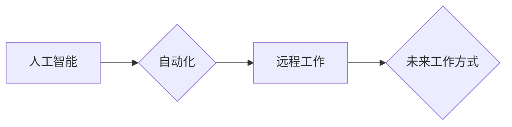

                 

## 关键词：人工智能、自动化、远程工作、新兴职业、职业转型、未来趋势、就业市场

## 1. 背景介绍

21世纪初，互联网的普及和移动技术的飞速发展已经深刻地改变了我们的生活方式和工作方式。如今，人工智能（AI）、大数据、云计算等新兴技术正在以惊人的速度发展，它们将对未来工作方式产生更加深远的影响。

2050年，世界将进入一个完全由智能技术主导的时代。自动化将取代大量重复性劳动，人工智能将成为各行各业不可或缺的一部分，远程工作将成为主流，新的职业将不断涌现。面对如此巨大的变革，我们需要认真思考未来工作方式的演变趋势，并做好相应的职业规划和转型准备。

## 2. 核心概念与联系

### 2.1 人工智能 (AI)

人工智能是指模拟人类智能行为的计算机系统。它涵盖了广泛的领域，包括机器学习、深度学习、自然语言处理、计算机视觉等。

### 2.2 自动化

自动化是指利用技术手段代替人工完成重复性、规则性任务的过程。它可以提高效率、降低成本，并释放人力用于更具创造性和战略性的工作。

### 2.3 远程工作

远程工作是指在非传统工作场所，例如在家、咖啡馆或其他远程地点，通过网络连接完成工作。它提供了更大的工作灵活性，并打破了地理限制。

**核心概念与联系流程图**



## 3. 核心算法原理 & 具体操作步骤

### 3.1 算法原理概述

机器学习算法是人工智能的核心，它允许计算机从数据中学习并改进其性能。常见的机器学习算法包括：

* **监督学习:** 利用标记数据训练模型，预测未来结果。例如，图像分类、文本识别等。
* **无监督学习:** 从未标记数据中发现模式和结构。例如，聚类分析、异常检测等。
* **强化学习:** 通过试错学习，在环境中获得最大奖励。例如，游戏AI、机器人控制等。

### 3.2 算法步骤详解

以监督学习为例，其基本步骤如下：

1. **数据收集和预处理:** 收集相关数据并进行清洗、转换、特征工程等预处理操作。
2. **模型选择:** 根据任务需求选择合适的机器学习算法模型。
3. **模型训练:** 利用标记数据训练模型，调整模型参数以最小化预测误差。
4. **模型评估:** 使用测试数据评估模型的性能，例如准确率、召回率、F1-score等。
5. **模型部署:** 将训练好的模型部署到实际应用场景中，用于预测或决策。

### 3.3 算法优缺点

**优点:**

* 自动化学习，无需人工编程。
* 能够从海量数据中发现隐藏的模式。
* 性能不断提升，可实现更精准的预测。

**缺点:**

* 需要大量的数据进行训练。
* 模型解释性较差，难以理解模型的决策过程。
* 容易受到数据偏差的影响。

### 3.4 算法应用领域

机器学习算法广泛应用于各个领域，例如：

* **医疗保健:** 疾病诊断、药物研发、个性化治疗等。
* **金融:** 欺诈检测、风险评估、投资决策等。
* **电商:** 商品推荐、用户画像、精准营销等。
* **交通:** 自动驾驶、交通流量预测、智能导航等。

## 4. 数学模型和公式 & 详细讲解 & 举例说明

### 4.1 数学模型构建

机器学习算法通常基于数学模型，例如线性回归、逻辑回归、支持向量机等。这些模型通过数学公式来描述数据之间的关系，并预测未来结果。

### 4.2 公式推导过程

以线性回归为例，其目标是找到一条直线，使得预测值与真实值之间的误差最小。

**公式:**

$$y = mx + c$$

其中：

* $y$ 是预测值
* $x$ 是输入特征
* $m$ 是斜率
* $c$ 是截距

**推导过程:**

通过最小化误差函数，可以求解出最佳的 $m$ 和 $c$ 值。

### 4.3 案例分析与讲解

假设我们想要预测房屋价格，输入特征包括房屋面积、房间数量等。我们可以使用线性回归模型，通过训练数据学习房屋价格与特征之间的关系，并预测新房子的价格。

## 5. 项目实践：代码实例和详细解释说明

### 5.1 开发环境搭建

可以使用 Python 语言和 scikit-learn 库进行机器学习项目实践。

### 5.2 源代码详细实现

```python
from sklearn.linear_model import LinearRegression
from sklearn.model_selection import train_test_split
import pandas as pd

# 加载数据
data = pd.read_csv('house_price.csv')

# 分割数据
X = data[['area', 'rooms']]
y = data['price']
X_train, X_test, y_train, y_test = train_test_split(X, y, test_size=0.2)

# 创建线性回归模型
model = LinearRegression()

# 训练模型
model.fit(X_train, y_train)

# 预测测试数据
y_pred = model.predict(X_test)

# 评估模型性能
print('模型准确率:', model.score(X_test, y_test))
```

### 5.3 代码解读与分析

这段代码首先加载数据，然后将数据分割成训练集和测试集。接着，创建线性回归模型并训练模型。最后，使用训练好的模型预测测试数据，并评估模型的性能。

### 5.4 运行结果展示

运行结果会显示模型的准确率，例如 0.85，表示模型在预测房屋价格方面准确率为 85%。

## 6. 实际应用场景

### 6.1 医疗保健

AI 辅助诊断、个性化治疗方案、药物研发加速等。

### 6.2 金融

欺诈检测、风险评估、智能投资建议等。

### 6.3 电商

商品推荐、用户画像分析、精准营销等。

### 6.4 未来应用展望

AI 将在更多领域发挥作用，例如自动驾驶、教育、娱乐等，为人类社会带来更多便利和福祉。

## 7. 工具和资源推荐

### 7.1 学习资源推荐

* **在线课程:** Coursera、edX、Udacity 等平台提供丰富的 AI 课程。
* **书籍:** 《深度学习》、《人工智能简史》等经典书籍。
* **开源项目:** TensorFlow、PyTorch 等开源框架。

### 7.2 开发工具推荐

* **Python:** 广泛应用于 AI 开发的编程语言。
* **Jupyter Notebook:** 用于编写和运行 Python 代码的交互式环境。
* **scikit-learn:** Python 机器学习库。

### 7.3 相关论文推荐

* **《ImageNet Classification with Deep Convolutional Neural Networks》**
* **《Attention Is All You Need》**
* **《BERT: Pre-training of Deep Bidirectional Transformers for Language Understanding》**

## 8. 总结：未来发展趋势与挑战

### 8.1 研究成果总结

近年来，AI 技术取得了长足进步，在各个领域都展现出巨大的潜力。

### 8.2 未来发展趋势

* **模型更加强大:** 随着算法和计算能力的提升，AI 模型将更加强大，能够解决更复杂的问题。
* **应用更加广泛:** AI 将应用于更多领域，例如医疗保健、教育、娱乐等。
* **伦理问题更加突出:** AI 的发展也带来了伦理问题，例如算法偏见、数据隐私等，需要引起重视。

### 8.3 面临的挑战

* **数据获取和处理:** AI 模型需要大量的数据进行训练，数据获取和处理是一个挑战。
* **算法解释性:** 许多 AI 模型的决策过程难以解释，这限制了其在一些领域应用。
* **安全性和可靠性:** AI 系统的安全性和可靠性需要得到保证，避免造成负面影响。

### 8.4 研究展望

未来，AI 研究将继续朝着更强大、更安全、更可解释的方向发展。

## 9. 附录：常见问题与解答

### 9.1 什么是机器学习？

机器学习是一种人工智能技术，它允许计算机从数据中学习并改进其性能。

### 9.2 如何选择合适的机器学习算法？

选择合适的机器学习算法取决于具体的任务需求和数据特点。

### 9.3 如何评估机器学习模型的性能？

可以使用准确率、召回率、F1-score 等指标来评估机器学习模型的性能。


作者：禅与计算机程序设计艺术 / Zen and the Art of Computer Programming 
<end_of_turn>

