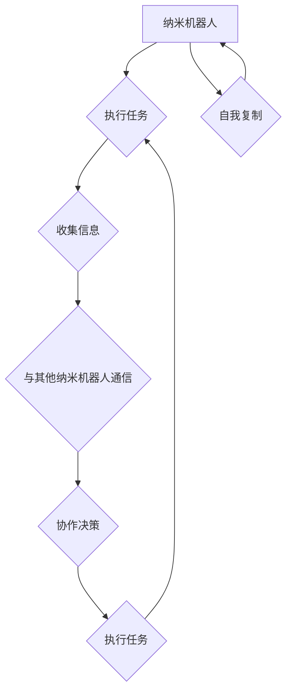

                 

## 未来的纳米技术：2050年的纳米机器人集群与自我复制

> 关键词：纳米机器人、集群智能、自我复制、纳米技术、未来科技、人工智能、生物仿生

## 1. 背景介绍

纳米技术，以其操控物质在原子和分子尺度上的能力，一直被视为未来科技的基石。从医疗诊断到材料科学，纳米技术已在多个领域展现出巨大的潜力。然而，真正将纳米技术推向颠覆性的应用，或许在于纳米机器人的出现。

2050年，我们或许将目睹纳米机器人集群的兴起。这些微型机器，如同微型工匠，将以惊人的效率和精准度，构建、修复和改造我们的世界。而自我复制能力，将成为纳米机器人集群发展的重要驱动力，赋予它们无限的可能性。

## 2. 核心概念与联系

### 2.1 纳米机器人

纳米机器人是指尺寸在纳米尺度（1纳米=10^-9米）范围内的微型机器，能够执行特定任务。它们可以由各种材料制成，例如碳纳米管、金属纳米线、DNA等，并配备各种传感器、执行器和微型处理器。

### 2.2 集群智能

集群智能是指由多个个体组成的群体，通过相互协作和信息共享，实现比单个个体更复杂和高效的智能行为。纳米机器人集群通过类似于蜂群或蚁群的协作机制，可以完成比单个纳米机器人更复杂的任务，例如构建大型结构、修复组织损伤、清除污染物等。

### 2.3 自我复制

自我复制是指一个系统能够利用自身资源和环境信息，生成与自身结构和功能相似的副本。纳米机器人集群的自我复制能力，将使其能够在不需要外部干预的情况下，不断扩大规模，并适应不断变化的环境。

**Mermaid 流程图**



## 3. 核心算法原理 & 具体操作步骤

### 3.1 算法原理概述

纳米机器人集群的自我复制算法，需要解决以下关键问题：

* **信息传递和协作:** 纳米机器人需要能够有效地传递信息和协作工作，以确保复制过程的准确性和效率。
* **资源获取和利用:** 纳米机器人需要能够识别和获取所需的资源，并将其有效地利用到复制过程中。
* **结构组装和功能实现:** 纳米机器人需要能够准确地组装复制后的结构，并确保复制后的纳米机器人能够正常工作。

### 3.2 算法步骤详解

1. **信息收集和分析:** 纳米机器人通过传感器收集环境信息，并分析自身结构和功能信息。
2. **复制计划制定:** 基于收集到的信息，纳米机器人制定复制计划，包括所需资源、组装步骤和功能实现方案。
3. **资源获取和分配:** 纳米机器人根据复制计划，获取所需的资源，并将其分配给不同的复制子任务。
4. **结构组装:** 纳米机器人按照复制计划，利用自身或其他纳米机器人的工具，组装复制后的结构。
5. **功能实现:** 纳米机器人通过编程或生物仿生机制，实现复制后的纳米机器人的功能。
6. **自我检验和优化:** 复制完成后的纳米机器人进行自我检验，并根据检验结果优化复制算法，提高复制效率和准确性。

### 3.3 算法优缺点

**优点:**

* **自主复制:** 无需外部干预，可以无限扩大规模。
* **适应性强:** 可以根据环境变化调整复制计划和功能实现方案。
* **效率高:** 可以并行执行多个复制任务，提高复制效率。

**缺点:**

* **复杂性高:** 复制算法需要考虑多个因素，设计难度较大。
* **安全风险:** 自我复制的纳米机器人可能难以控制，存在潜在的安全风险。
* **伦理问题:** 自我复制的纳米机器人可能引发伦理争议，例如对生物多样性的影响。

### 3.4 算法应用领域

* **医疗领域:** 用于精准药物递送、组织修复、疾病诊断和治疗。
* **环境领域:** 用于污染物清除、环境监测和资源回收。
* **制造领域:** 用于微型制造、材料合成和产品修复。
* **能源领域:** 用于能源生产、存储和传输。

## 4. 数学模型和公式 & 详细讲解 & 举例说明

### 4.1 数学模型构建

纳米机器人集群的自我复制过程可以抽象为一个动态系统模型，其中纳米机器人数量、资源分配、复制效率等因素相互影响。

**状态变量:**

* $N(t)$:  纳米机器人数量在时间 $t$ 时刻
* $R(t)$:  可用资源量在时间 $t$ 时刻
* $P(t)$:  复制效率在时间 $t$ 时刻

**状态转移方程:**

* $\frac{dN(t)}{dt} = P(t) \cdot N(t) - \alpha \cdot N(t)$
* $\frac{dR(t)}{dt} = \beta \cdot R_0 - \gamma \cdot N(t) \cdot R(t)$
* $\frac{dP(t)}{dt} = \delta \cdot N(t) \cdot P(t)$

其中:

* $\alpha$:  纳米机器人衰减率
* $\beta$:  资源补充率
* $\gamma$:  纳米机器人消耗资源的速率
* $\delta$:  复制效率提升率
* $R_0$:  初始资源量

### 4.2 公式推导过程

上述状态转移方程的推导过程基于以下假设:

* 纳米机器人数量的增长取决于复制效率和现有纳米机器人数量。
* 资源量的变化取决于补充率和纳米机器人消耗的速率。
* 复制效率取决于纳米机器人数量和环境条件。

### 4.3 案例分析与讲解

假设初始资源量为 $R_0 = 100$，初始纳米机器人数量为 $N(0) = 10$，其他参数设定为 $\alpha = 0.1$, $\beta = 5$, $\gamma = 0.05$, $\delta = 0.01$.

通过数值模拟，我们可以观察到纳米机器人数量随着时间的推移呈现指数增长趋势，资源量则随着纳米机器人数量的增加而逐渐减少。

**举例说明:**

在模拟过程中，我们可以观察到以下现象:

* 当纳米机器人数量较少时，复制效率较低，资源消耗相对较少，纳米机器人数量增长缓慢。
* 当纳米机器人数量达到一定规模后，复制效率显著提高，资源消耗也随之增加，纳米机器人数量增长迅速。
* 当资源量不足时，纳米机器人数量增长会受到抑制，甚至可能出现衰减。

## 5. 项目实践：代码实例和详细解释说明

### 5.1 开发环境搭建

本项目使用 Python 语言进行开发，并结合以下工具和库:

* Python 3.x
* NumPy
* Matplotlib
* SciPy

### 5.2 源代码详细实现

```python
import numpy as np
import matplotlib.pyplot as plt
from scipy.integrate import odeint

# 参数设定
alpha = 0.1
beta = 5
gamma = 0.05
delta = 0.01
R0 = 100
N0 = 10

# 状态变量
def model(y, t):
    N, R, P = y
    dNdt = P * N - alpha * N
    dRdt = beta * R0 - gamma * N * R
    dPdt = delta * N * P
    return [dNdt, dRdt, dPdt]

# 时间范围
t = np.linspace(0, 100, 1000)

# 初始条件
y0 = [N0, R0, 1]

# 求解微分方程
sol = odeint(model, y0, t)

# 绘制结果
plt.plot(t, sol[:, 0], label='纳米机器人数量')
plt.plot(t, sol[:, 1], label='资源量')
plt.plot(t, sol[:, 2], label='复制效率')
plt.xlabel('时间')
plt.ylabel('值')
plt.legend()
plt.show()
```

### 5.3 代码解读与分析

上述代码实现了一个简单的纳米机器人集群自我复制模型。

* `model()` 函数定义了状态转移方程，描述了纳米机器人数量、资源量和复制效率随时间的变化。
* `odeint()` 函数用于求解微分方程，根据状态转移方程和初始条件，计算出纳米机器人数量、资源量和复制效率随时间的变化曲线。
* `matplotlib.pyplot` 库用于绘制结果曲线，直观地展示纳米机器人集群的自我复制过程。

### 5.4 运行结果展示

运行上述代码后，将生成三条曲线，分别表示纳米机器人数量、资源量和复制效率随时间的变化趋势。

## 6. 实际应用场景

### 6.1 医疗领域

* **精准药物递送:** 纳米机器人可以携带药物，精确地靶向病灶，减少对健康组织的损害。
* **组织修复:** 纳米机器人可以修复组织损伤，促进伤口愈合，甚至可以再生受损的器官。
* **疾病诊断:** 纳米机器人可以进入人体内部，检测疾病的早期信号，实现更精准的疾病诊断。

### 6.2 环境领域

* **污染物清除:** 纳米机器人可以清除水体中的污染物，净化空气，修复土壤环境。
* **环境监测:** 纳米机器人可以监测环境中的各种污染物，及时预警环境风险。
* **资源回收:** 纳米机器人可以回收废弃资源，实现资源的循环利用。

### 6.3 制造领域

* **微型制造:** 纳米机器人可以用于制造微型电子元件、传感器和医疗器械等。
* **材料合成:** 纳米机器人可以控制材料的原子和分子结构，合成具有特殊性能的新型材料。
* **产品修复:** 纳米机器人可以修复微小的产品缺陷，延长产品的使用寿命。

### 6.4 未来应用展望

随着纳米技术和人工智能的不断发展，纳米机器人集群将拥有更强大的功能和更广泛的应用场景。

* **智能医疗:** 纳米机器人将成为医疗诊断和治疗的不可或缺的一部分，实现个性化医疗和精准医疗。
* **可持续发展:** 纳米机器人将帮助我们解决环境污染、资源短缺等问题，实现可持续发展。
* **人类增强:** 纳米机器人将帮助我们增强身体功能，延长寿命，实现人类的全面升级。

## 7. 工具和资源推荐

### 7.1 学习资源推荐

* **书籍:**
    * 《纳米技术》 -  Richard Feynman
    * 《纳米机器人》 -  Robert Freitas
* **在线课程:**
    * Coursera: Nanotechnology
    * edX: Introduction to Nanotechnology
* **学术期刊:**
    * Nano Letters
    * Nature Nanotechnology
    * ACS Nano

### 7.2 开发工具推荐

* **编程语言:** Python, C++, Java
* **仿真软件:**  Molecular Dynamics (MD) simulators,  COMSOL Multiphysics
* **纳米材料设计软件:**  Materials Studio,  Quantum ESPRESSO

### 7.3 相关论文推荐

* **自我复制纳米机器人的研究:**
    * "Self-Replicating Nanosystems: A Review" -  Robert Freitas
    * "Design and Simulation of a Self-Replicating Nanobot" -  Mark A. Bedzyk
* **纳米机器人集群智能的研究:**
    * "Swarm Robotics: A Review" -  Marco Dorigo
    * "Collective Behavior in Nanorobots" -  David J. Smith

## 8. 总结：未来发展趋势与挑战

### 8.1 研究成果总结

纳米机器人集群的自我复制技术，是纳米技术发展的重要方向，具有巨大的应用潜力。近年来，在纳米材料、微纳制造、人工智能等领域的突破，为纳米机器人集群的实现提供了技术基础。

### 8.2 未来发展趋势

* **纳米机器人功能的增强:** 未来纳米机器人将拥有更强大的功能，例如更精准的操控能力、更复杂的感知能力和更智能的决策能力。
* **纳米机器人集群规模的扩大:** 未来纳米机器人集群将拥有更大的规模，能够完成更复杂的任务，例如构建大型结构、修复大型组织损伤等。
* **纳米机器人集群的安全性与可靠性:** 未来纳米机器人集群的安全性和可靠性将得到进一步提高，确保其在实际应用中的安全性和有效性。

### 8.3 面临的挑战

* **纳米机器人材料的开发:** 需要开发出更安全、更稳定、更功能化的纳米材料，以满足纳米机器人的需求。
* **纳米机器人制造技术的突破:** 需要开发出更高效、更精确的纳米机器人制造技术，以实现大规模生产。
* **纳米机器人伦理与法律问题:** 需要制定相应的伦理规范和法律法规，规范纳米机器人的研发和应用。

### 8.4 研究展望

纳米机器人集群的自我复制技术，将深刻地改变我们的生活方式，带来前所未有的机遇和挑战。未来，我们将继续探索纳米机器人集群的潜力，为人类社会创造更美好的未来。

## 9. 附录：常见问题与解答

**Q1: 纳米机器人集群的自我复制是否会带来安全风险？**

**A1:** 纳米机器人集群的自我复制确实存在潜在的安全风险，例如失控的复制、对环境的污染等。因此，需要制定相应的安全措施，例如限制纳米机器人的复制能力、设置安全开关等，以确保其安全运行。

**Q2: 纳米机器人集群的自我复制是否会违背伦理道德？**

**A2:** 纳米机器人集群的自我复制引发了一些伦理道德问题，例如对生物多样性的影响、对人类社会秩序的挑战等。需要进行深入的伦理探讨，制定相应的伦理规范，引导纳米机器人技术的发展方向。

**Q3: 纳米机器人集群的自我复制技术何时能够实现？**

**A3:** 纳米机器人集群的自我复制技术目前还处于研究阶段，距离实际应用还有很长的路要走。预计在未来几十年内，随着纳米技术和人工智能的不断发展，纳米机器人集群的自我复制技术可能会逐渐实现。


作者：禅与计算机程序设计艺术 / Zen and the Art of Computer Programming<end_of_turn>

