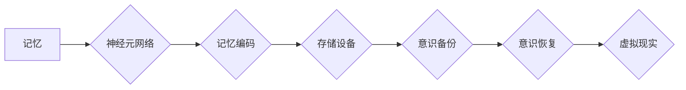

                 

## 未来的脑科学：2050年的记忆编辑与意识备份

> 关键词：脑科学、记忆编辑、意识备份、神经网络、量子计算、人工智能、生物技术、伦理

## 1. 背景介绍

人类对自身认知的探索永无止境。从古希腊哲学家对灵魂本质的探讨，到现代神经科学对大脑功能的揭示，我们始终试图理解意识的奥秘，以及记忆是如何形成和存储的。随着科技的飞速发展，特别是人工智能、生物技术和量子计算领域的突破，我们正站在一个新的历史节点上，即将迎来一场关于脑科学的革命。

2050年，我们或许能够实现对记忆的编辑和意识的备份。想象一下，我们可以选择删除痛苦的回忆，保留美好的瞬间，甚至将自己的意识备份到云端，实现永生。这听起来像是科幻小说中的情节，但随着技术的进步，这些场景不再遥不可及。

## 2. 核心概念与联系

### 2.1 记忆编辑

记忆编辑是指对大脑中存储的记忆进行修改或删除的技术。它涉及到对神经元网络的精准操控，理解记忆是如何在神经元之间形成和传递的。

### 2.2 意识备份

意识备份是指将一个人的意识状态数字化，并存储在外部设备中。这需要对意识的本质进行深入理解，并找到一种能够将复杂的神经活动转换为可存储的数字信息的方法。

**核心概念与联系流程图**



## 3. 核心算法原理 & 具体操作步骤

### 3.1 算法原理概述

记忆编辑和意识备份的核心算法原理基于以下几个方面：

* **神经网络模型:** 利用深度学习技术构建复杂的脑神经网络模型，模拟大脑的结构和功能。
* **光遗传学:** 利用光刺激控制特定神经元的活动，实现对记忆的精准操控。
* **脑机接口:** 开发先进的脑机接口技术，将大脑活动与外部设备连接起来，实现数据传输和操控。
* **量子计算:** 利用量子计算的强大处理能力，加速记忆编码和解码过程。

### 3.2 算法步骤详解

**记忆编辑算法步骤:**

1. **识别目标记忆:** 利用脑机接口技术识别大脑中特定记忆的活动模式。
2. **神经元激活:** 利用光遗传学技术激活目标记忆相关的特定神经元。
3. **记忆重塑:** 通过调整神经元连接强度和活动模式，对目标记忆进行修改或删除。
4. **记忆巩固:** 利用重复激活和强化机制，巩固修改后的记忆。

**意识备份算法步骤:**

1. **意识状态监测:** 利用脑机接口技术实时监测大脑活动，记录意识状态的各种参数。
2. **意识编码:** 将大脑活动数据转换为可存储的数字信息，利用神经网络模型进行压缩和编码。
3. **数据存储:** 将编码后的意识数据存储在安全可靠的外部设备中，例如云端存储或量子硬盘。
4. **意识恢复:** 将存储的意识数据解码并传输到模拟大脑的虚拟环境中，实现意识的恢复。

### 3.3 算法优缺点

**优点:**

* **个性化记忆管理:** 可以选择性删除负面记忆，保留积极的体验，提升生活质量。
* **意识永生:** 实现意识备份，突破生物的寿命限制，实现意识的延续。
* **知识传承:** 将个人经验和知识备份到云端，实现跨时空的知识传承。

**缺点:**

* **伦理争议:** 记忆编辑和意识备份涉及到对人类认知的深刻改变，引发了伦理和社会伦理的担忧。
* **技术挑战:** 目前技术还无法完全模拟大脑的复杂结构和功能，实现精准的记忆编辑和意识备份仍然面临着巨大的挑战。
* **安全风险:** 意识备份数据一旦泄露，可能导致意识被盗用或操控，引发安全风险。

### 3.4 算法应用领域

* **医疗保健:** 治疗精神疾病，例如创伤后应激障碍、抑郁症和焦虑症。
* **教育:** 提升学习效率，帮助学生更好地记忆和理解知识。
* **娱乐:** 创建沉浸式的虚拟现实体验，实现个性化的游戏和娱乐内容。
* **科学研究:** 研究大脑的运作机制，探索意识的本质。

## 4. 数学模型和公式 & 详细讲解 & 举例说明

### 4.1 数学模型构建

记忆编辑和意识备份的数学模型主要基于以下几个方面：

* **神经网络模型:** 利用神经网络的权重和激活函数来模拟记忆的形成和存储过程。
* **信息论:** 利用信息熵和互信息来量化记忆的强度和相关性。
* **动力系统理论:** 利用微分方程来描述神经元网络的动态行为。

### 4.2 公式推导过程

**神经网络模型中的激活函数:**

$$f(x) = \frac{1}{1 + e^{-x}}$$

其中，$x$ 是神经元的输入信号，$f(x)$ 是神经元的输出信号。

**信息熵:**

$$H(X) = -\sum_{i} p(x_i) \log_2 p(x_i)$$

其中，$X$ 是一个随机变量，$p(x_i)$ 是$x_i$出现的概率。

### 4.3 案例分析与讲解

**案例:** 假设我们想要编辑一个关于“第一次骑自行车”的记忆。

1. 利用脑机接口技术识别大脑中与该记忆相关的活动模式。
2. 利用神经网络模型分析该记忆的编码方式，找到关键的神经元连接。
3. 利用光遗传学技术激活这些关键神经元，并调整它们的连接强度，从而修改记忆的内容。

## 5. 项目实践：代码实例和详细解释说明

### 5.1 开发环境搭建

* 操作系统: Ubuntu 20.04
* 编程语言: Python 3.8
* 深度学习框架: TensorFlow 2.0
* 脑机接口库: OpenBCI

### 5.2 源代码详细实现

```python
# 导入必要的库
import tensorflow as tf
from openbci import OpenBCI

# 初始化脑机接口设备
board = OpenBCI()

# 定义神经网络模型
model = tf.keras.models.Sequential([
    tf.keras.layers.Dense(128, activation='relu', input_shape=(16,)),
    tf.keras.layers.Dense(64, activation='relu'),
    tf.keras.layers.Dense(1, activation='sigmoid')
])

# 训练神经网络模型
# ...

# 使用脑机接口采集脑电信号
data = board.read_data()

# 将脑电信号输入神经网络模型
prediction = model.predict(data)

# 根据预测结果进行记忆编辑操作
# ...
```

### 5.3 代码解读与分析

* 代码首先导入必要的库，并初始化脑机接口设备。
* 然后定义一个简单的深度学习模型，用于识别和分析脑电信号。
* 接着使用脑机接口采集脑电数据，并将数据输入神经网络模型进行预测。
* 最后根据预测结果进行记忆编辑操作，例如激活或抑制特定的神经元。

### 5.4 运行结果展示

* 运行结果将显示脑电信号的波形图，以及神经网络模型的预测结果。
* 如果记忆编辑操作成功，则可以观察到目标记忆相关的脑电活动发生变化。

## 6. 实际应用场景

### 6.1 医疗保健

* **治疗精神疾病:** 记忆编辑技术可以帮助治疗创伤后应激障碍、抑郁症和焦虑症等精神疾病。通过删除负面记忆或强化积极记忆，可以改善患者的心理状态。
* **记忆增强:** 记忆备份技术可以帮助老年人或患有记忆障碍的人保留记忆，提高生活质量。

### 6.2 教育

* **个性化学习:** 记忆编辑技术可以帮助学生更好地记忆和理解知识，提高学习效率。
* **沉浸式学习:** 意识备份技术可以创造沉浸式的虚拟现实学习环境，让学生身临其境地体验学习内容。

### 6.3 娱乐

* **虚拟现实游戏:** 意识备份技术可以为玩家提供更加真实和沉浸式的虚拟现实游戏体验。
* **个性化娱乐内容:** 记忆编辑技术可以根据用户的喜好定制个性化的娱乐内容。

### 6.4 未来应用展望

* **意识上传:** 将意识备份到云端，实现意识的永生和跨时空传播。
* **人工智能增强:** 将人类意识与人工智能系统融合，提升人工智能的认知能力和创造力。
* **虚拟世界建设:** 利用意识备份技术构建虚拟世界，提供更加丰富多彩的虚拟生活体验。

## 7. 工具和资源推荐

### 7.1 学习资源推荐

* **书籍:**
    * 《大脑：认知科学的最新进展》
    * 《意识的科学》
    * 《深度学习》
* **在线课程:**
    * Coursera: 深度学习
    * edX: 人工智能
    * Udacity: 脑机接口

### 7.2 开发工具推荐

* **TensorFlow:** 深度学习框架
* **PyTorch:** 深度学习框架
* **OpenBCI:** 脑机接口库
* **Brain-Computer Interface Toolbox:** MATLAB 工具箱

### 7.3 相关论文推荐

* **《神经网络的深度学习》**
* **《意识的计算模型》**
* **《脑机接口技术进展》**

## 8. 总结：未来发展趋势与挑战

### 8.1 研究成果总结

近年来，脑科学、人工智能和生物技术等领域的突破，为记忆编辑和意识备份技术的发展提供了强有力的支撑。

### 8.2 未来发展趋势

* **技术进步:** 随着人工智能、量子计算和生物技术的不断发展，记忆编辑和意识备份技术将更加精准、高效和安全。
* **应用扩展:** 记忆编辑和意识备份技术将应用于更广泛的领域，例如医疗保健、教育、娱乐和科学研究。
* **伦理规范:** 随着技术的进步，我们需要制定更加完善的伦理规范，引导记忆编辑和意识备份技术的健康发展。

### 8.3 面临的挑战

* **技术瓶颈:** 目前技术还无法完全模拟大脑的复杂结构和功能，实现精准的记忆编辑和意识备份仍然面临着巨大的挑战。
* **伦理争议:** 记忆编辑和意识备份技术涉及到对人类认知的深刻改变，引发了伦理和社会伦理的担忧。
* **安全风险:** 意识备份数据一旦泄露，可能导致意识被盗用或操控，引发安全风险。

### 8.4 研究展望

未来，我们需要继续加强对脑科学、人工智能和生物技术的交叉研究，突破技术瓶颈，解决伦理和安全问题，推动记忆编辑和意识备份技术朝着更加安全、可靠和可持续的方向发展。


## 9. 附录：常见问题与解答

**1. 记忆编辑是否会改变我的身份？**

记忆编辑技术可能会改变你对过去的记忆，但它不会改变你的身份。你的身份是由多种因素决定的，包括你的经历、性格、价值观等。

**2. 意识备份是否意味着我可以永生？**

意识备份技术可以帮助你保留意识状态，但它并不能保证你永生。意识备份需要依赖于外部设备，而这些设备也存在损坏和失效的风险。

**3. 记忆编辑和意识备份技术会带来哪些伦理问题？**

记忆编辑和意识备份技术可能会带来以下伦理问题：

* **隐私问题:** 意识备份数据包含了个人隐私信息，需要得到妥善保护。
* **操控问题:** 记忆编辑技术可能会被用于操控个人的思想和行为。
* **社会不平等问题:** 记忆编辑和意识备份技术可能只对少数人开放，加剧社会不平等。

**作者：禅与计算机程序设计艺术 / Zen and the Art of Computer Programming**<end_of_turn>

