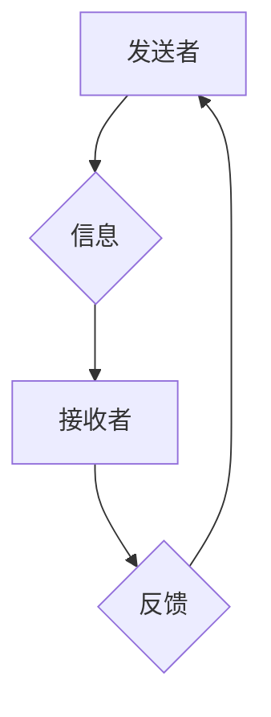

                 

## 沟通管理：改善内部和外部沟通

> 关键词：沟通管理、内部沟通、外部沟通、团队协作、信息传递、冲突管理、沟通策略、沟通技巧、跨文化沟通

### 1. 背景介绍

在当今快速发展的科技时代，信息爆炸和全球化趋势日益明显，有效的沟通管理已成为企业生存和发展的关键要素。良好的沟通不仅能促进团队协作，提高工作效率，还能增强客户关系，提升企业形象。然而，在实际工作中，沟通障碍和信息失真问题却屡见不鲜，导致企业效率低下、团队冲突频发、客户关系破裂等问题。

### 2. 核心概念与联系

#### 2.1 沟通管理定义

沟通管理是指企业在内部和外部环境中，通过各种渠道和方式，进行信息的传递、接收、理解和反馈，以达到预期目标的管理活动。它涵盖了沟通策略的制定、沟通渠道的选择、沟通技巧的运用、沟通效果的评估等多个方面。

#### 2.2 沟通管理的要素

* **发送者:** 沟通信息的来源，需要清晰地表达自己的想法和意图。
* **接收者:** 接收沟通信息的對象，需要积极倾听和理解发送者的信息。
* **信息:** 沟通的内容，需要准确、完整、简洁、易懂。
* **渠道:** 沟通信息的传递途径，需要选择合适的渠道，确保信息能够有效地传达。
* **反馈:** 接收者对发送者的信息进行回应，帮助发送者了解信息是否被正确理解。

#### 2.3 沟通管理的流程



### 3. 核心算法原理 & 具体操作步骤

#### 3.1 算法原理概述

有效的沟通管理需要遵循一定的算法原理，例如信息编码、信息传递、信息解码等。

* **信息编码:** 发送者需要将自己的想法和意图转化为接收者能够理解的信息，可以使用语言、文字、图像、视频等多种形式。
* **信息传递:** 信息通过各种渠道传递到接收者手中，例如电子邮件、电话、会议、社交媒体等。
* **信息解码:** 接收者需要对接收到的信息进行解读和理解，并根据信息内容做出相应的反应。

#### 3.2 算法步骤详解

1. **明确沟通目标:** 发送者需要明确自己想要传达的信息和期望达成的目标。
2. **选择合适的沟通渠道:** 根据沟通内容、目标受众和沟通目的，选择合适的沟通渠道。
3. **准备沟通内容:** 发送者需要准备清晰、简洁、准确的信息内容，并使用合适的语言和表达方式。
4. **发送信息:** 发送者通过选择的沟通渠道将信息发送给接收者。
5. **接收信息:** 接收者需要积极倾听和理解发送者的信息，并及时反馈自己的理解。
6. **确认理解:** 发送者需要确认接收者是否理解了信息内容，并及时澄清任何误解。

#### 3.3 算法优缺点

* **优点:** 遵循一定的算法原理，可以提高沟通效率和准确性，减少沟通误差。
* **缺点:** 算法过于僵化，可能无法适应复杂的沟通场景，需要根据具体情况进行调整。

#### 3.4 算法应用领域

* **团队协作:** 提高团队成员之间的沟通效率，促进项目顺利进行。
* **客户关系管理:** 建立良好的客户关系，提升客户满意度。
* **企业内部管理:** 传递企业信息，提高员工的沟通能力。

### 4. 数学模型和公式 & 详细讲解 & 举例说明

#### 4.1 数学模型构建

我们可以使用信息论中的概念来构建沟通管理的数学模型。信息熵可以用来衡量信息的模糊程度，信息增益可以用来衡量信息传递带来的效益。

#### 4.2 公式推导过程

* **信息熵:**  $$H(X) = - \sum_{i=1}^{n} p(x_i) \log_2 p(x_i)$$
    *  其中，$X$ 是随机变量，$x_i$ 是 $X$ 的取值，$p(x_i)$ 是 $x_i$ 的概率。
* **信息增益:** $$Gain(S,A) = H(S) - \sum_{v \in V} \frac{|S_v|}{|S|} H(S_v)$$
    * 其中，$S$ 是样本集，$A$ 是特征，$V$ 是 $A$ 的取值集合，$S_v$ 是 $A=v$ 的样本子集。

#### 4.3 案例分析与讲解

假设我们有一个团队，需要进行一个项目讨论。我们可以使用信息熵来衡量团队成员对项目的理解程度。如果团队成员对项目目标和任务都了解清楚，那么信息熵就会较低。反之，如果团队成员对项目目标和任务存在模糊不清的地方，那么信息熵就会较高。

我们可以使用信息增益来衡量沟通带来的效益。如果沟通能够有效地消除团队成员之间的信息差异，那么信息增益就会较高。反之，如果沟通没有起到预期效果，那么信息增益就会较低。

### 5. 项目实践：代码实例和详细解释说明

#### 5.1 开发环境搭建

* 操作系统: Linux/macOS/Windows
* 编程语言: Python
* 开发工具: VS Code/PyCharm

#### 5.2 源代码详细实现

```python
# 聊天机器人示例代码

import random

# 定义聊天机器人可能的回复
responses = [
    "你好！",
    "有什么可以帮到您吗？",
    "请告诉我您的需求。",
    "我正在学习如何更好地理解您的需求。",
]

# 定义聊天机器人对话函数
def chat_bot():
    user_input = input("您:")
    # 根据用户输入选择合适的回复
    response = random.choice(responses)
    print("机器人:", response)

# 启动聊天机器人
chat_bot()
```

#### 5.3 代码解读与分析

* 该代码实现了一个简单的聊天机器人，用户可以输入文本，机器人会随机选择一个回复。
* `responses` 列表存储了聊天机器人可能的回复，可以根据需要添加或修改。
* `chat_bot()` 函数接收用户输入，并根据输入选择合适的回复。
* `random.choice()` 函数用于随机选择列表中的元素。

#### 5.4 运行结果展示

```
您: 你好
机器人: 你好！
```

### 6. 实际应用场景

#### 6.1 内部沟通

* **团队协作:** 使用协作工具，例如 Slack、Microsoft Teams 等，提高团队成员之间的沟通效率。
* **信息传递:** 使用邮件、内部公告等渠道，及时传递企业信息和重要通知。
* **反馈机制:** 建立有效的反馈机制，收集员工意见和建议，促进企业改进。

#### 6.2 外部沟通

* **客户服务:** 使用电话、邮件、在线聊天等渠道，及时响应客户需求，解决客户问题。
* **市场推广:** 使用社交媒体、网站、广告等渠道，宣传企业产品和服务，吸引潜在客户。
* **品牌建设:** 通过有效的沟通，塑造企业品牌形象，提升企业知名度和美誉度。

#### 6.4 未来应用展望

* **人工智能驱动的沟通管理:** 利用人工智能技术，实现智能客服、自动回复、个性化沟通等功能。
* **虚拟现实和增强现实技术:** 利用虚拟现实和增强现实技术，创造沉浸式的沟通体验，提高沟通效率和效果。
* **跨文化沟通:** 利用机器翻译和跨文化沟通工具，促进不同文化背景之间的沟通和理解。

### 7. 工具和资源推荐

#### 7.1 学习资源推荐

* 书籍: 《沟通的艺术》、《非暴力沟通》、《高效能人士的七个习惯》
* 网址: TED Talks, Coursera, Udemy

#### 7.2 开发工具推荐

* 协作工具: Slack, Microsoft Teams, Google Workspace
* 沟通平台: Zoom, Webex, Skype
* 客户关系管理系统: Salesforce, HubSpot, Zoho CRM

#### 7.3 相关论文推荐

* "The Impact of Communication Management on Organizational Performance"
* "Effective Communication Strategies for Cross-Cultural Teams"
* "The Role of Artificial Intelligence in Communication Management"

### 8. 总结：未来发展趋势与挑战

#### 8.1 研究成果总结

沟通管理的研究成果表明，有效的沟通管理可以显著提高企业效率、团队协作能力、客户满意度等。

#### 8.2 未来发展趋势

* 人工智能驱动的沟通管理将成为未来发展趋势，能够实现智能化、个性化、高效化的沟通体验。
* 虚拟现实和增强现实技术将应用于沟通管理领域，创造沉浸式的沟通体验。
* 跨文化沟通将更加重要，需要开发更有效的跨文化沟通工具和策略。

#### 8.3 面临的挑战

* 如何应对信息爆炸和沟通碎片化的挑战，提高沟通效率和准确性。
* 如何利用人工智能技术，构建更加智能化、个性化的沟通管理系统。
* 如何解决跨文化沟通中的障碍，促进不同文化背景之间的理解和合作。

#### 8.4 研究展望

未来研究将重点关注以下几个方面:

* 人工智能驱动的沟通管理算法和模型的开发。
* 虚拟现实和增强现实技术在沟通管理中的应用研究。
* 跨文化沟通策略和工具的研发。


### 9. 附录：常见问题与解答

* **问题:** 如何提高团队成员之间的沟通效率？
* **解答:** 建立有效的沟通机制，例如定期团队会议、在线协作工具等。
* **问题:** 如何避免沟通误解？
* **解答:** 使用清晰、简洁、准确的语言表达，并及时确认对方理解。
* **问题:** 如何处理跨文化沟通中的障碍？
* **解答:** 学习对方的文化背景和沟通习惯，使用合适的沟通方式和语言。


作者：禅与计算机程序设计艺术 / Zen and the Art of Computer Programming 
<end_of_turn>

