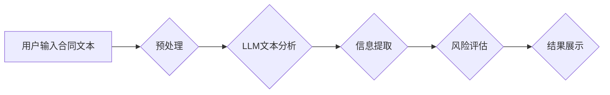

                 

## 法律AI：LLM在合同分析和案例研究中的应用

> 关键词：法律AI、LLM、合同分析、案例研究、自然语言处理、机器学习、深度学习、法律科技

## 1. 背景介绍

随着人工智能技术的飞速发展，法律领域也迎来了前所未有的变革。传统法律工作往往耗时费力，需要律师花费大量时间阅读和分析大量的法律文件，例如合同、判决书等。而大型语言模型（LLM）的出现为法律工作带来了新的可能性。LLM 拥有强大的自然语言理解和生成能力，能够自动分析法律文本，提取关键信息，并进行法律推理，从而提高法律工作效率，降低成本。

合同分析是法律AI应用的一个重要领域。合同是商业交易的基础，其条款复杂多变，需要仔细阅读和理解。传统的合同分析方法依赖于人工阅读和判断，效率低下，容易出错。而LLM可以自动识别合同中的关键条款，例如付款条款、违约条款等，并进行法律风险评估，为律师和企业提供更准确、更快速的分析结果。

## 2. 核心概念与联系

**2.1 核心概念**

* **大型语言模型 (LLM):** 训练于海量文本数据上的深度学习模型，能够理解和生成人类语言。代表模型包括 GPT-3、BERT、LaMDA 等。
* **自然语言处理 (NLP):** 使计算机能够理解、解释和生成人类语言的技术领域。
* **合同分析:**  自动分析合同文本，提取关键信息、识别风险和进行法律推理的技术。

**2.2 架构图**



**2.3 联系**

LLM通过NLP技术，能够对合同文本进行理解和分析，从而实现合同分析的功能。

## 3. 核心算法原理 & 具体操作步骤

**3.1 算法原理概述**

LLM在合同分析中的核心算法原理是基于深度学习的自然语言理解和生成技术。

* **词嵌入:** 将文本中的每个词映射到一个向量空间中，使得语义相似的词拥有相似的向量表示。
* **Transformer网络:**  一种新型的深度神经网络架构，能够捕捉文本中的长距离依赖关系，提高文本理解能力。
* **注意力机制:**  允许模型关注文本中最重要的部分，提高分析效率和准确性。

**3.2 算法步骤详解**

1. **预处理:** 对合同文本进行清洗和格式化，例如去除停用词、标点符号等，并将文本转换为数字格式。
2. **词嵌入:** 使用词嵌入模型将文本中的每个词映射到向量空间中。
3. **Transformer网络编码:** 将文本序列编码为一个固定长度的向量表示，捕捉文本中的语义信息和上下文关系。
4. **信息提取:** 使用特定规则或模型从编码后的文本向量中提取关键信息，例如合同条款、当事人信息、生效日期等。
5. **风险评估:**  根据提取的信息，使用预先训练好的法律知识库或规则引擎进行风险评估，识别潜在的法律风险。
6. **结果展示:** 将分析结果以可读的形式展示给用户，例如文本摘要、表格、图表等。

**3.3 算法优缺点**

* **优点:** 
    * 自动化合同分析，提高效率和准确性。
    * 能够处理大量文本数据，节省人力成本。
    * 识别潜在的法律风险，帮助企业规避法律风险。
* **缺点:** 
    * 依赖于高质量的训练数据，数据质量直接影响模型性能。
    * 难以处理复杂、模糊的法律问题。
    * 需要专业的法律知识进行模型训练和结果解释。

**3.4 算法应用领域**

* 合同审查和尽职调查
* 合同自动化和生成
* 法律风险评估和管理
* 法律研究和决策支持

## 4. 数学模型和公式 & 详细讲解 & 举例说明

**4.1 数学模型构建**

LLM的训练过程本质上是一个优化问题，目标是找到一个模型参数，使得模型在训练数据上表现最佳。常用的数学模型包括：

* **交叉熵损失函数:** 用于衡量模型预测结果与真实标签之间的差异。

$$
Loss = - \sum_{i=1}^{N} y_i \log(p_i)
$$

其中：

* $N$ 是样本数量
* $y_i$ 是真实标签
* $p_i$ 是模型预测概率

* **梯度下降算法:** 用于更新模型参数，使得损失函数最小化。

**4.2 公式推导过程**

梯度下降算法的核心思想是迭代更新模型参数，沿着损失函数梯度的反方向移动，直到找到损失函数的最小值。

具体公式如下：

$$
\theta_{t+1} = \theta_t - \alpha \nabla Loss(\theta_t)
$$

其中：

* $\theta$ 是模型参数
* $t$ 是迭代次数
* $\alpha$ 是学习率

**4.3 案例分析与讲解**

假设我们训练一个LLM模型用于识别合同中的付款条款。训练数据包含大量合同文本和对应的付款条款标签。模型通过学习训练数据中的模式，能够识别出付款条款的特征，并将其与新的合同文本进行匹配。

## 5. 项目实践：代码实例和详细解释说明

**5.1 开发环境搭建**

* Python 3.7+
* TensorFlow/PyTorch
* NLTK/SpaCy

**5.2 源代码详细实现**

```python
import nltk
from transformers import AutoTokenizer, AutoModelForSequenceClassification

# 下载预训练模型和词典
tokenizer = AutoTokenizer.from_pretrained("bert-base-uncased")
model = AutoModelForSequenceClassification.from_pretrained("bert-base-uncased")

# 预处理文本
def preprocess_text(text):
    text = nltk.word_tokenize(text)
    text = [tokenizer.convert_tokens_to_ids(token) for token in text]
    return text

# 预测文本类别
def predict_contract_clause(text):
    input_ids = preprocess_text(text)
    outputs = model(input_ids=input_ids)
    predicted_class = outputs.logits.argmax().item()
    return predicted_class

# 测试代码
contract_text = "The buyer shall pay the seller the sum of $10,000 upon delivery of the goods."
predicted_class = predict_contract_clause(contract_text)
print(f"Predicted class: {predicted_class}")
```

**5.3 代码解读与分析**

* 该代码使用HuggingFace Transformers库加载预训练的BERT模型和词典。
* `preprocess_text`函数对输入文本进行预处理，包括分词和转换为模型识别的数字格式。
* `predict_contract_clause`函数使用模型对预处理后的文本进行预测，并返回预测的类别。
* 测试代码演示了如何使用模型预测合同文本中的付款条款。

**5.4 运行结果展示**

运行结果将显示预测的类别，例如 "付款条款"、"违约条款" 等。

## 6. 实际应用场景

**6.1 合同审查和尽职调查**

LLM可以自动分析合同文本，提取关键信息，例如当事人信息、合同期限、付款条款等，帮助律师快速完成合同审查和尽职调查工作。

**6.2 合同自动化和生成**

LLM可以根据用户提供的需求，自动生成符合法律要求的合同文本，提高合同制作效率。

**6.3 法律风险评估和管理**

LLM可以识别合同中的潜在法律风险，例如违约条款、责任划分等，帮助企业规避法律风险。

**6.4 未来应用展望**

* 更精准的法律推理和决策支持
* 更智能的法律服务机器人
* 更便捷的法律知识获取和普及

## 7. 工具和资源推荐

**7.1 学习资源推荐**

* **书籍:**
    * "Deep Learning" by Ian Goodfellow, Yoshua Bengio, and Aaron Courville
    * "Natural Language Processing with Python" by Steven Bird, Ewan Klein, and Edward Loper
* **在线课程:**
    * Coursera: Natural Language Processing Specialization
    * edX: Artificial Intelligence

**7.2 开发工具推荐**

* **HuggingFace Transformers:** 提供预训练的LLM模型和工具
* **TensorFlow/PyTorch:** 深度学习框架
* **NLTK/SpaCy:** 自然语言处理库

**7.3 相关论文推荐**

* "BERT: Pre-training of Deep Bidirectional Transformers for Language Understanding"
* "GPT-3: Language Models are Few-Shot Learners"
* "LaMDA: Language Models for Dialogue Applications"

## 8. 总结：未来发展趋势与挑战

**8.1 研究成果总结**

LLM在法律AI领域取得了显著进展，能够自动分析合同文本，提取关键信息，识别法律风险，提高法律工作效率。

**8.2 未来发展趋势**

* 更强大的LLM模型，能够处理更复杂、更模糊的法律问题。
* 更精准的法律推理和决策支持，帮助律师和法官做出更明智的法律判断。
* 更智能的法律服务机器人，能够提供更便捷、更个性化的法律服务。

**8.3 面临的挑战**

* 数据质量问题，LLM模型的性能依赖于高质量的训练数据。
* 法律知识的表达和理解，LLM模型需要能够理解复杂的法律概念和逻辑关系。
* 伦理和法律问题，LLM的应用需要考虑伦理和法律风险，确保其合法合规。

**8.4 研究展望**

未来研究将重点关注以下几个方面：

* 开发更强大的LLM模型，提高其法律推理和决策能力。
* 构建更完善的法律知识库，帮助LLM更好地理解法律概念和逻辑关系。
* 研究LLM在法律领域的伦理和法律问题，确保其安全、可靠、可信赖地应用于法律实践。

## 9. 附录：常见问题与解答

**9.1 如何选择合适的LLM模型？**

选择合适的LLM模型取决于具体的应用场景和需求。例如，对于合同分析任务，可以选择预训练在法律文本数据上的模型，例如LegalBERT。

**9.2 如何评估LLM模型的性能？**

常用的评估指标包括准确率、召回率、F1-score等。

**9.3 如何解决LLM模型的偏见问题？**

可以通过数据预处理、模型训练和评估等环节来减轻LLM模型的偏见问题。


作者：禅与计算机程序设计艺术 / Zen and the Art of Computer Programming 
<end_of_turn>

