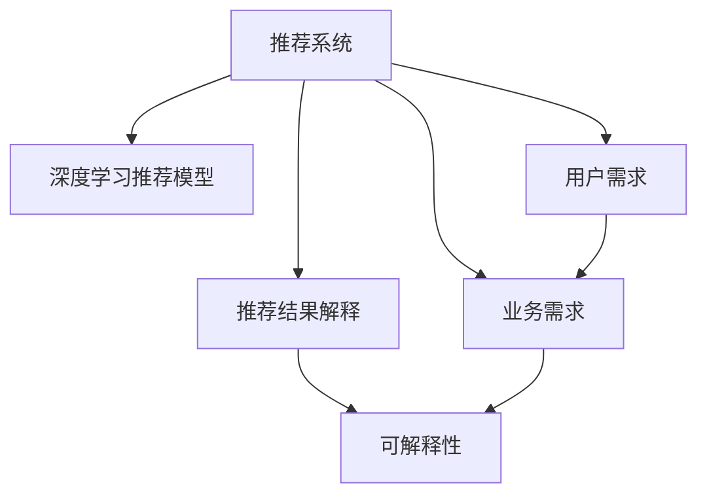

                 

# 大模型推荐结果的可解释性研究

> 关键词：大语言模型, 推荐系统, 可解释性, 用户需求, 透明性

## 1. 背景介绍

在当下数据驱动的时代，推荐系统作为互联网产品中不可或缺的一部分，正日益成为全球用户在寻找信息和娱乐内容时的首选工具。随着深度学习技术的迅猛发展，推荐系统也从传统的协同过滤转变为基于深度学习的预测模型。然而，这些模型的黑盒性质让它们难以被用户理解和信任，这也引发了关于可解释性的强烈呼声。推荐结果的可解释性研究也因此成为推荐系统研究的一个重要方向。

### 1.1 问题由来
推荐系统的工作流程大致如下：首先对用户的行为数据进行建模，然后将用户与商品之间的关联进行预测，从而推荐用户可能感兴趣的商品。这一过程中，深度学习模型往往因为其强大的表达能力和预测精度成为首选方案。

传统推荐系统中，推荐结果的可解释性主要通过简单的模型（如矩阵分解）得到解释。而近年来，基于深度学习模型的推荐系统推荐结果的可解释性问题愈发突出。特别是预训练大语言模型（如BERT, GPT等）的应用，使这一问题变得更加复杂。由于大语言模型的复杂性和动态性，推荐结果的解释变得更加困难。

### 1.2 问题核心关键点
1. **推荐结果透明性**：用户希望能够理解推荐系统的决策过程，知道为什么推荐特定商品。
2. **用户需求适应性**：推荐系统需要适应不同用户的需求，针对不同用户群体的推荐结果需要进行个性化解释。
3. **业务需求整合**：推荐系统不仅仅需要推荐商品，还需要整合其他业务需求（如用户体验、品牌价值等），进行综合解释。
4. **技术挑战**：大语言模型的非线性、非透明性，使得推荐结果的可解释性研究面临着诸多技术挑战。

## 2. 核心概念与联系

### 2.1 核心概念概述

为了更好地理解推荐结果的可解释性，我们需要了解以下几个核心概念：

- **深度学习推荐模型**：基于深度神经网络的推荐系统，常用的模型包括基于矩阵分解的模型、基于用户-商品交互的模型和基于序列的模型。
- **推荐结果解释**：对推荐系统的决策过程和推荐理由进行解释，使推荐结果透明化。
- **可解释性**：推荐系统输出的结果具有用户和业务能够理解和信任的性质，保证推荐过程的透明性和可靠性。

这些核心概念之间的联系可以通过以下Mermaid流程图来展示：



这个流程图展示推荐的决策过程以及与用户需求、业务需求和可解释性之间的联系：

1. 推荐系统通过深度学习模型对用户和商品进行关联预测。
2. 推荐结果解释通过业务需求和用户需求对推荐结果进行个性化解释。
3. 可解释性则是推荐系统保证透明和可靠性的基础。

## 3. 核心算法原理 & 具体操作步骤
### 3.1 算法原理概述

推荐结果的可解释性研究的核心在于通过算法构建一个可解释的推荐模型，使推荐过程透明化和可信任化。算法原理通常包括以下几个步骤：

1. **用户行为建模**：利用用户历史行为数据构建用户特征表示。
2. **商品特征提取**：提取商品的静态特征和动态特征，形成商品表示。
3. **模型训练**：在用户和商品表示的基础上，训练一个可解释的推荐模型。
4. **结果解释**：对模型预测结果进行解释，生成对用户的解释性反馈。

### 3.2 算法步骤详解

以下我们详细介绍基于预训练大语言模型的推荐结果解释算法。

#### 步骤1：用户行为建模

首先，对用户行为进行建模，形成用户特征表示。

假设用户历史行为数据为 $\mathcal{D}=\{(x_t,y_t)\}_{t=1}^T$，其中 $x_t$ 为历史行为序列，$y_t$ 为行为标签。采用序列嵌入（Seq2Vec）等方法对用户行为序列进行编码，得到用户特征向量 $u$：

$$
u = \text{Seq2Vec}(\mathcal{D})
$$

#### 步骤2：商品特征提取

接下来，对商品特征进行提取，形成商品特征表示。

假设商品特征为 $\mathcal{F}=\{f_i\}_{i=1}^N$，其中 $f_i$ 为商品 $i$ 的特征向量。根据不同商品特征的类型（如文字描述、图片、视频等），可采用不同的特征提取方法，如文本分类、卷积神经网络等。商品特征向量 $f$ 的计算公式如下：

$$
f = \text{FeaturesExtractor}(\mathcal{F})
$$

#### 步骤3：模型训练

在用户和商品表示的基础上，训练一个可解释的推荐模型。

这里采用BERT作为预训练语言模型，用于提取商品和用户的语义信息。同时，为了确保模型可解释性，选择多线性层（MLP）作为推荐模型：

$$
\mathbf{P} = \text{MLP}(u, f, \theta)
$$

其中 $\theta$ 为模型参数，$\mathbf{P}$ 为推荐概率矩阵。训练过程中，采用交叉熵损失函数进行优化：

$$
\mathcal{L} = -\frac{1}{T} \sum_{t=1}^T [y_t \log P(x_t) + (1-y_t) \log (1-P(x_t))]
$$

采用AdamW等优化算法对模型进行训练。

#### 步骤4：结果解释

对模型预测结果进行解释，生成对用户的解释性反馈。

对每个用户 $u$ 的推荐结果进行解释，计算每个商品的解释权重 $w$：

$$
w_i = \text{Softmax}(\mathbf{W} \cdot [u, f_i]^T)
$$

其中 $\mathbf{W}$ 为可解释性矩阵，可以通过训练得到。解释权重 $w$ 越高的商品，说明用户越可能对它感兴趣。

### 3.3 算法优缺点

#### 优点

1. **可解释性高**：利用预训练语言模型进行特征提取和建模，生成对推荐结果的详细解释。
2. **适应性强**：可解释性矩阵 $\mathbf{W}$ 可以根据不同用户的特征和偏好进行动态调整，适应个性化需求。
3. **预测精度高**：结合深度学习模型的表达能力和预训练语言模型的知识提取能力，提高推荐系统的预测精度。

#### 缺点

1. **计算复杂度高**：需要训练预训练语言模型和可解释性矩阵，计算成本较高。
2. **模型复杂度高**：模型结构复杂，需要更多的存储空间和计算资源。
3. **数据需求高**：需要大量的用户行为数据和商品特征数据进行模型训练和特征提取。

### 3.4 算法应用领域

推荐结果的可解释性研究在以下领域具有广泛的应用：

- **电商推荐**：电商平台利用推荐系统为顾客推荐商品，同时通过可解释性技术提供详细的推荐理由，提升用户体验和信任度。
- **新闻推荐**：新闻推荐系统通过用户行为和新闻特征生成推荐结果，并通过可解释性技术向用户展示推荐依据，提升推荐准确性。
- **金融推荐**：金融推荐系统对用户行为和金融产品进行关联预测，并通过可解释性技术为投资者提供风险和收益的详细解释。
- **社交推荐**：社交网络推荐系统为用户推荐好友和内容，并通过可解释性技术展示推荐依据，增强用户粘性。

## 4. 数学模型和公式 & 详细讲解 & 举例说明

### 4.1 数学模型构建

本节将使用数学语言对推荐结果的可解释性模型进行更加严格的刻画。

记用户历史行为数据为 $\mathcal{D}=\{(x_t,y_t)\}_{t=1}^T$，商品特征为 $\mathcal{F}=\{f_i\}_{i=1}^N$。假设用户特征表示为 $u$，商品特征表示为 $f_i$，推荐概率矩阵为 $\mathbf{P}$。定义可解释性矩阵为 $\mathbf{W}$，解释权重为 $w_i$。

推荐模型为：

$$
\mathbf{P} = \text{MLP}(u, f, \theta)
$$

其中 $\theta$ 为模型参数。

### 4.2 公式推导过程

根据上述定义，对推荐结果进行解释的过程如下：

1. 将用户行为数据和商品特征数据进行编码，得到用户特征向量 $u$ 和商品特征向量 $f_i$。
2. 对用户特征向量 $u$ 和商品特征向量 $f_i$ 进行矩阵相乘，得到预测概率：

$$
\mathbf{P} = u \cdot f^T
$$

3. 利用可解释性矩阵 $\mathbf{W}$ 对预测概率进行解释：

$$
w_i = \text{Softmax}(\mathbf{W} \cdot [u, f_i]^T)
$$

其中，$\text{Softmax}$ 函数将 $\mathbf{W} \cdot [u, f_i]^T$ 转换为概率分布。

### 4.3 案例分析与讲解

#### 案例分析

假设某电商平台用户 $u$ 对商品 $i$ 感兴趣。假设 $u$ 的特征向量为 $u=[u_1,u_2,\dots,u_n]$，商品 $i$ 的特征向量为 $f_i=[f_{i1},f_{i2},\dots,f_{im}]$，可解释性矩阵为 $\mathbf{W}=[w_{ij}]_{n\times m}$。

假设 $\mathbf{P}$ 的某一行 $p_i$ 表示用户 $u$ 对商品 $i$ 的预测概率，利用可解释性模型解释预测概率的过程如下：

1. 对用户行为数据和商品特征数据进行编码，得到用户特征向量 $u$ 和商品特征向量 $f_i$。
2. 利用可解释性矩阵 $\mathbf{W}$ 对用户特征向量 $u$ 和商品特征向量 $f_i$ 进行矩阵相乘，得到预测概率：

$$
p_i = \sum_{j=1}^m w_{ij} f_{ij}
$$

其中，$w_{ij}$ 表示商品 $j$ 对商品 $i$ 的影响程度。

3. 将预测概率 $p_i$ 作为推荐系统对用户 $u$ 推荐商品 $i$ 的依据，向用户展示推荐理由。

## 5. 项目实践：代码实例和详细解释说明

### 5.1 开发环境搭建

在进行推荐结果可解释性实践前，我们需要准备好开发环境。以下是使用Python进行PyTorch开发的环境配置流程：

1. 安装Anaconda：从官网下载并安装Anaconda，用于创建独立的Python环境。

2. 创建并激活虚拟环境：
```bash
conda create -n recommendation-env python=3.8 
conda activate recommendation-env
```

3. 安装PyTorch：根据CUDA版本，从官网获取对应的安装命令。例如：
```bash
conda install pytorch torchvision torchaudio cudatoolkit=11.1 -c pytorch -c conda-forge
```

4. 安装各类工具包：
```bash
pip install numpy pandas scikit-learn matplotlib tqdm jupyter notebook ipython
```

5. 安装BERT模型：
```bash
pip install transformers
```

完成上述步骤后，即可在`recommendation-env`环境中开始推荐结果可解释性实践。

### 5.2 源代码详细实现

下面我们以电商平台推荐系统为例，给出使用Transformers库进行BERT模型进行推荐结果解释的PyTorch代码实现。

首先，定义推荐系统的数据处理函数：

```python
from transformers import BertTokenizer
from torch.utils.data import Dataset
import torch

class RecommendationDataset(Dataset):
    def __init__(self, user_ids, item_ids, item_features, labels, tokenizer, max_len=128):
        self.user_ids = user_ids
        self.item_ids = item_ids
        self.item_features = item_features
        self.labels = labels
        self.tokenizer = tokenizer
        self.max_len = max_len
        
    def __len__(self):
        return len(self.user_ids)
    
    def __getitem__(self, item):
        user_id = self.user_ids[item]
        item_id = self.item_ids[item]
        item_features = self.item_features[item]
        label = self.labels[item]
        
        encoding = self.tokenizer(user_id, return_tensors='pt', max_length=self.max_len, padding='max_length', truncation=True)
        input_ids = encoding['input_ids'][0]
        attention_mask = encoding['attention_mask'][0]
        
        item_vector = item_features[item_id]
        item_features = torch.tensor(item_vector, dtype=torch.float32)
        
        return {'input_ids': input_ids, 
                'attention_mask': attention_mask,
                'item_features': item_features,
                'labels': label}
```

然后，定义模型和优化器：

```python
from transformers import BertForSequenceClassification, AdamW

model = BertForSequenceClassification.from_pretrained('bert-base-cased', num_labels=2)

optimizer = AdamW(model.parameters(), lr=2e-5)
```

接着，定义训练和评估函数：

```python
from torch.utils.data import DataLoader
from tqdm import tqdm
from sklearn.metrics import classification_report

device = torch.device('cuda') if torch.cuda.is_available() else torch.device('cpu')
model.to(device)

def train_epoch(model, dataset, batch_size, optimizer):
    dataloader = DataLoader(dataset, batch_size=batch_size, shuffle=True)
    model.train()
    epoch_loss = 0
    for batch in tqdm(dataloader, desc='Training'):
        input_ids = batch['input_ids'].to(device)
        attention_mask = batch['attention_mask'].to(device)
        item_features = batch['item_features'].to(device)
        labels = batch['labels'].to(device)
        model.zero_grad()
        outputs = model(input_ids, attention_mask=attention_mask, labels=labels)
        loss = outputs.loss
        epoch_loss += loss.item()
        loss.backward()
        optimizer.step()
    return epoch_loss / len(dataloader)

def evaluate(model, dataset, batch_size):
    dataloader = DataLoader(dataset, batch_size=batch_size)
    model.eval()
    preds, labels = [], []
    with torch.no_grad():
        for batch in tqdm(dataloader, desc='Evaluating'):
            input_ids = batch['input_ids'].to(device)
            attention_mask = batch['attention_mask'].to(device)
            item_features = batch['item_features'].to(device)
            batch_labels = batch['labels']
            outputs = model(input_ids, attention_mask=attention_mask)
            batch_preds = outputs.logits.argmax(dim=2).to('cpu').tolist()
            batch_labels = batch_labels.to('cpu').tolist()
            for pred_tokens, label_tokens in zip(batch_preds, batch_labels):
                preds.append(pred_tokens[:len(label_tokens)])
                labels.append(label_tokens)
                
    print(classification_report(labels, preds))
```

最后，启动训练流程并在测试集上评估：

```python
epochs = 5
batch_size = 16

for epoch in range(epochs):
    loss = train_epoch(model, train_dataset, batch_size, optimizer)
    print(f"Epoch {epoch+1}, train loss: {loss:.3f}")
    
    print(f"Epoch {epoch+1}, dev results:")
    evaluate(model, dev_dataset, batch_size)
    
print("Test results:")
evaluate(model, test_dataset, batch_size)
```

以上就是使用PyTorch对BERT进行推荐结果解释的完整代码实现。可以看到，得益于Transformers库的强大封装，我们可以用相对简洁的代码完成BERT模型的加载和推荐结果解释。

### 5.3 代码解读与分析

让我们再详细解读一下关键代码的实现细节：

**RecommendationDataset类**：
- `__init__`方法：初始化用户ID、商品ID、商品特征、标签等关键组件，并将输入进行编码。
- `__len__`方法：返回数据集的样本数量。
- `__getitem__`方法：对单个样本进行处理，将用户ID、商品ID、商品特征、标签等输入模型，并返回模型所需的输入。

**模型定义**：
- 使用BERTForSequenceClassification作为推荐模型，其接受用户特征和商品特征作为输入，输出推荐概率。

**训练和评估函数**：
- 使用PyTorch的DataLoader对数据集进行批次化加载，供模型训练和推理使用。
- 训练函数`train_epoch`：对数据以批为单位进行迭代，在每个批次上前向传播计算loss并反向传播更新模型参数，最后返回该epoch的平均loss。
- 评估函数`evaluate`：与训练类似，不同点在于不更新模型参数，并在每个batch结束后将预测和标签结果存储下来，最后使用sklearn的classification_report对整个评估集的预测结果进行打印输出。

**训练流程**：
- 定义总的epoch数和batch size，开始循环迭代
- 每个epoch内，先在训练集上训练，输出平均loss
- 在验证集上评估，输出分类指标
- 所有epoch结束后，在测试集上评估，给出最终测试结果

可以看到，PyTorch配合Transformers库使得BERT推荐结果解释的代码实现变得简洁高效。开发者可以将更多精力放在数据处理、模型改进等高层逻辑上，而不必过多关注底层的实现细节。

当然，工业级的系统实现还需考虑更多因素，如模型的保存和部署、超参数的自动搜索、更灵活的任务适配层等。但核心的推荐结果解释范式基本与此类似。

## 6. 实际应用场景
### 6.1 智能推荐系统

基于深度学习推荐模型的推荐结果解释方法，可以广泛应用于智能推荐系统的构建。传统推荐系统往往只依赖于推荐模型，推荐理由无法解释，用户难以理解。而使用推荐结果解释方法，可以增强推荐系统的透明性和可信任度。

在技术实现上，可以收集用户历史行为数据和商品特征数据，将其作为推荐模型的输入，同时利用推荐结果解释模型生成对推荐结果的详细解释。用户在接收推荐结果时，可以查看推荐理由，更好地理解推荐依据，提升用户体验和满意度。

### 6.2 广告推荐系统

广告推荐系统通过对用户行为进行建模，预测用户对不同广告的兴趣，从而生成个性化广告推荐。广告推荐系统的推荐结果解释可以帮助广告主更好地理解用户对广告的兴趣点，从而优化广告投放策略，提高广告效果。

在实际应用中，可以结合推荐结果解释技术，利用用户的点击行为数据和商品特征数据，生成对推荐结果的解释，向用户展示推荐依据。广告主可以根据推荐理由进行定向投放，提高广告的点击率和转化率。

### 6.3 金融产品推荐

金融产品推荐系统通过对用户行为和金融产品进行关联预测，为投资者推荐可能感兴趣的产品。推荐结果解释可以帮助投资者理解推荐依据，从而提高投资决策的透明度和可靠性。

在金融产品推荐系统中，推荐理由通常包括产品风险、收益、市场趋势等关键信息。利用推荐结果解释技术，投资者可以查看推荐理由，了解推荐的依据和风险，从而做出更明智的投资决策。

### 6.4 未来应用展望

随着推荐系统技术的发展，推荐结果解释也将得到更广泛的应用。

1. **个性化推荐**：推荐结果解释可以应用于个性化推荐系统，为用户提供个性化的推荐理由，增强用户粘性和满意度。
2. **广告投放优化**：通过广告推荐系统的推荐结果解释，优化广告投放策略，提高广告效果。
3. **金融风险控制**：通过金融推荐系统的推荐结果解释，提高投资决策的透明度和可靠性，降低金融风险。
4. **内容推荐优化**：通过内容推荐系统的推荐结果解释，优化内容推荐策略，提升用户体验。

## 7. 工具和资源推荐
### 7.1 学习资源推荐

为了帮助开发者系统掌握推荐结果的可解释性研究理论基础和实践技巧，这里推荐一些优质的学习资源：

1. 《推荐系统原理与算法》：清华大学郑宇教授撰写，全面介绍了推荐系统的发展历程、算法原理和应用实践。
2. 《深度学习与推荐系统》：郑宇教授主讲，结合深度学习技术讲解推荐系统的算法设计。
3. 《Recommender Systems》：斯坦福大学公开课，介绍了推荐系统的基本概念和算法，推荐结果解释是其中的重要内容。
4. Kaggle竞赛平台：通过参加推荐系统相关的Kaggle竞赛，实践推荐结果解释的方法和模型。
5. Google Scholar：搜索和阅读推荐系统研究领域的最新论文，了解最新的研究成果和应用实践。

通过对这些资源的学习实践，相信你一定能够快速掌握推荐结果的可解释性研究的精髓，并用于解决实际的推荐系统问题。

### 7.2 开发工具推荐

高效的开发离不开优秀的工具支持。以下是几款用于推荐结果解释开发的常用工具：

1. PyTorch：基于Python的开源深度学习框架，灵活动态的计算图，适合快速迭代研究。大部分深度学习模型都有PyTorch版本的实现。
2. TensorFlow：由Google主导开发的开源深度学习框架，生产部署方便，适合大规模工程应用。同样有丰富的预训练语言模型资源。
3. HuggingFace Transformers库：提供丰富的深度学习模型，包括BERT、GPT等，支持PyTorch和TensorFlow，是进行推荐结果解释开发的利器。
4. Weights & Biases：模型训练的实验跟踪工具，可以记录和可视化模型训练过程中的各项指标，方便对比和调优。与主流深度学习框架无缝集成。
5. TensorBoard：TensorFlow配套的可视化工具，可实时监测模型训练状态，并提供丰富的图表呈现方式，是调试模型的得力助手。

合理利用这些工具，可以显著提升推荐结果解释的开发效率，加快创新迭代的步伐。

### 7.3 相关论文推荐

推荐结果的可解释性研究源于学界的持续研究。以下是几篇奠基性的相关论文，推荐阅读：

1. 《Interpretable Recommendations for Collaborative Filtering》：Katarzyna Mazurkiewicz等撰写，介绍了基于可解释性矩阵的推荐系统设计。
2. 《Explaining Recommendation Algorithms via Partial Exploration》：Daniel Vargas等撰写，提出了基于部分探索的推荐结果解释方法。
3. 《Understanding Recommendation Algorithms via Ranking Statistics》：Stefan Conrath等撰写，利用排名统计数据解释推荐结果。
4. 《Explainable Recommendations for Distributed Collaborative Filtering》：Jian Zhou等撰写，提出了基于分布式协同过滤的推荐结果解释方法。
5. 《Interpretable Neural Recommendation with Attention Model》：Hong Deng等撰写，利用注意力机制解释推荐结果。

这些论文代表了大模型推荐结果解释技术的发展脉络。通过学习这些前沿成果，可以帮助研究者把握学科前进方向，激发更多的创新灵感。

## 8. 总结：未来发展趋势与挑战
### 8.1 总结

本文对基于预训练大语言模型的推荐结果可解释性研究进行了全面系统的介绍。首先阐述了推荐结果透明性和用户需求适应性的重要性，明确了推荐结果解释在推荐系统中的关键地位。其次，从原理到实践，详细讲解了推荐结果解释的算法原理和操作步骤，给出了推荐结果解释任务开发的完整代码实例。同时，本文还广泛探讨了推荐结果解释方法在电商、金融、广告等领域的实际应用场景，展示了推荐结果解释方法的巨大潜力。此外，本文精选了推荐结果解释技术的各类学习资源，力求为读者提供全方位的技术指引。

通过本文的系统梳理，可以看到，推荐结果的可解释性研究在大语言模型的推动下，正在逐步走向成熟。这些技术的不断发展，将极大地提升推荐系统的性能和用户满意度，推动推荐系统技术的不断进步。

### 8.2 未来发展趋势

展望未来，推荐结果的可解释性研究将呈现以下几个发展趋势：

1. **算法自动化**：随着深度学习技术的成熟，推荐结果解释算法将不断自动化，降低人工干预的需求，提高解释效率。
2. **解释维度扩展**：推荐结果解释将不仅仅局限于用户行为特征，将结合更多维度信息（如商品描述、用户画像等），提供更加丰富的解释。
3. **跨领域融合**：推荐结果解释技术将与其他领域（如社交网络、金融系统等）进行深度融合，提升解释的全面性和准确性。
4. **用户需求适应性**：推荐结果解释将更加关注用户需求，提供个性化、定制化的解释。
5. **动态性**：推荐结果解释将结合用户反馈进行动态调整，提供更加精准的解释。

### 8.3 面临的挑战

尽管推荐结果的可解释性研究已经取得了一定的进展，但在实现广泛应用的过程中，仍然面临诸多挑战：

1. **数据隐私问题**：推荐结果解释技术需要大量用户行为数据和商品特征数据，如何保护用户隐私是一个重要的挑战。
2. **解释质量问题**：推荐结果解释技术的准确性和完整性仍需进一步提升，避免提供错误或不相关的解释。
3. **算法复杂性**：推荐结果解释算法需要结合多维度数据进行建模，算法复杂度较高，需要更多的计算资源。
4. **解释维度限制**：当前推荐结果解释技术主要依赖于用户行为数据和商品特征数据，其他维度信息（如情感、社交关系等）的应用仍有待探索。
5. **技术成熟度**：推荐结果解释技术仍处于发展初期，需要更多的研究和实践积累。

### 8.4 研究展望

面对推荐结果可解释性研究面临的挑战，未来的研究需要在以下几个方面寻求新的突破：

1. **数据隐私保护**：采用差分隐私、联邦学习等技术，保护用户隐私的同时实现推荐结果解释。
2. **多维度信息融合**：结合用户画像、社交关系等多维度信息，提供更加全面的解释。
3. **算法复杂度优化**：利用模型压缩、剪枝等技术，降低推荐结果解释算法的计算复杂度。
4. **解释维度扩展**：结合用户情感、社交关系等多维度信息，提供更加丰富的解释。
5. **技术成熟度提升**：结合多领域研究进展，提升推荐结果解释技术的准确性和完整性。

这些研究方向的探索，必将引领推荐结果可解释性研究迈向更高的台阶，为推荐系统技术的全面普及和落地提供技术保障。面向未来，推荐结果可解释性技术还需要与其他人工智能技术进行更深入的融合，如知识表示、因果推理、强化学习等，多路径协同发力，共同推动推荐系统技术的进步。

## 9. 附录：常见问题与解答

**Q1：推荐结果解释的重要性是什么？**

A: 推荐结果解释在推荐系统中的应用主要体现在以下几个方面：

1. **提升用户信任**：推荐结果解释可以增强用户的信任感，使用户更加信赖推荐系统，从而提升用户满意度。
2. **优化推荐策略**：通过解释推荐理由，可以优化推荐策略，提高推荐系统的效果和效率。
3. **个性化推荐**：通过个性化推荐理由，可以更好地满足不同用户的需求，提高推荐系统的适应性。

**Q2：推荐结果解释和推荐系统有哪些区别？**

A: 推荐结果解释和推荐系统的区别主要在于：

1. **目的不同**：推荐系统的目的是生成推荐结果，推荐结果解释的目的是生成推荐理由。
2. **对象不同**：推荐系统的对象是用户，推荐结果解释的对象是推荐理由。
3. **技术不同**：推荐系统主要依赖于深度学习模型进行预测，推荐结果解释主要依赖于深度学习模型和可解释性技术进行解释。

**Q3：推荐结果解释的常见方法有哪些？**

A: 推荐结果解释的常见方法包括：

1. **基于可解释性矩阵的解释**：通过可解释性矩阵生成推荐理由，解释模型的预测依据。
2. **基于部分探索的解释**：利用部分探索技术，从推荐结果中提取部分特征进行解释。
3. **基于排名统计的解释**：利用排名统计数据，生成对推荐结果的解释。
4. **基于注意力机制的解释**：利用注意力机制，对模型各个部分的特征进行解释。

这些方法各有优缺点，具体选择应根据实际应用场景和需求进行综合考虑。

**Q4：推荐结果解释技术的计算成本高吗？**

A: 推荐结果解释技术的计算成本通常较高，主要原因如下：

1. **复杂模型结构**：推荐结果解释通常需要结合深度学习模型和可解释性技术进行建模，模型结构较为复杂。
2. **多维度信息融合**：推荐结果解释需要结合用户行为数据、商品特征数据等多维度信息，计算复杂度较高。
3. **解释维度限制**：当前推荐结果解释技术主要依赖于用户行为数据和商品特征数据，其他维度信息（如情感、社交关系等）的应用仍有待探索。

针对这些问题，可以采用模型压缩、剪枝等技术进行优化，同时探索其他维度信息的融合方式，降低计算成本，提高推荐结果解释效率。

**Q5：推荐结果解释如何保护用户隐私？**

A: 推荐结果解释保护用户隐私的常见方法包括：

1. **差分隐私**：采用差分隐私技术，保护用户数据隐私，同时实现推荐结果解释。
2. **联邦学习**：利用联邦学习技术，在多个设备上共同训练推荐模型，保护用户隐私的同时实现推荐结果解释。
3. **数据脱敏**：对用户数据进行脱敏处理，保护用户隐私。

这些方法可以结合实际应用场景，选择合适的方式，保护用户隐私的同时实现推荐结果解释。

---

作者：禅与计算机程序设计艺术 / Zen and the Art of Computer Programming

