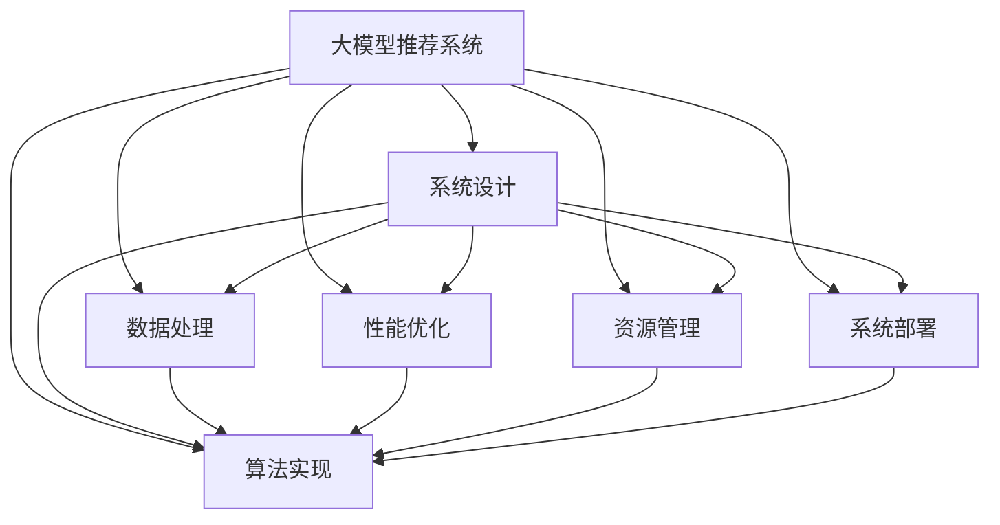

                 

# 大模型推荐落地中的工程化挑战与应对

> 关键词：大模型推荐系统,工程化,系统设计,应用落地,算法优化,性能提升,代码实现,资源优化,案例分析

## 1. 背景介绍

### 1.1 问题由来
近年来，随着深度学习技术的快速发展，大模型推荐系统在电子商务、社交网络、视频流媒体等领域得到了广泛应用，并取得了显著的业绩。例如，亚马逊的推荐系统在客户购买行为预测上，显著提升了销售额。在TikTok的个性化视频推荐中，用户的停留时间和观看次数都有了显著提高。

然而，在实际应用过程中，从大模型研究到推荐系统落地的每一步，都需要经过严格的工程化处理。工程化不仅是将算法和数据转化为可运行、可扩展、可持续的系统，还涉及系统架构设计、代码实现、性能优化、资源管理等多个方面。因此，工程化能力的高低，直接决定了推荐系统能否真正发挥其价值。

### 1.2 问题核心关键点
目前，推荐系统的工程化挑战主要集中在以下几个方面：

1. 系统架构设计：如何构建灵活、可扩展、高并发的推荐系统架构。
2. 数据处理：如何高效处理海量用户数据，提取出高价值的信息。
3. 算法实现：如何将大模型高效地集成到推荐系统中，实现快速的推荐计算。
4. 性能优化：如何平衡推荐精度和响应速度，提升用户体验。
5. 资源管理：如何优化资源配置，降低系统运营成本。
6. 系统部署：如何将推荐系统部署到分布式环境中，实现高可用性。

这些问题如果处理不当，将严重影响到推荐系统的性能和用户体验，甚至导致系统失败。因此，本文将深入探讨这些挑战，并给出有效的应对策略。

## 2. 核心概念与联系

### 2.1 核心概念概述

为更好地理解大模型推荐系统中的工程化问题，本节将介绍几个关键概念：

- 大模型推荐系统：利用大规模预训练语言模型或深度神经网络模型，对用户行为进行分析和建模，进而为用户推荐个性化内容的技术系统。
- 工程化：将研究理论转化为实际应用的过程，包含系统架构设计、数据处理、算法实现、性能优化、资源管理等多个方面。
- 系统设计：涉及软件架构、数据库设计、分布式计算等多个方面，旨在构建可扩展、可维护、高可靠的系统。
- 数据处理：涉及数据采集、清洗、特征提取、数据存储等多个环节，是推荐系统实现的基础。
- 算法实现：包含算法选择、模型训练、模型集成、特征工程等多个步骤，直接影响推荐系统的效果。
- 性能优化：通过算法优化、资源管理等手段，提升推荐系统的响应速度和处理能力。
- 资源管理：包含硬件资源、网络资源、存储资源的管理和优化，是系统高可用的基础。
- 系统部署：涉及系统上线、运行、维护等多个环节，是保证系统稳定性的关键。

这些核心概念之间的逻辑关系可以通过以下Mermaid流程图来展示：



这个流程图展示了大模型推荐系统中的关键概念及其之间的关系：

1. 大模型推荐系统是系统设计、数据处理、算法实现、性能优化、资源管理和系统部署的起点。
2. 系统设计涉及多方面内容，是架构和基础性能保证。
3. 数据处理是算法实现的前提，直接影响推荐效果。
4. 算法实现是推荐系统的核心，决定推荐质量。
5. 性能优化提升系统响应速度，提升用户体验。
6. 资源管理保障系统高可用性。
7. 系统部署保证系统长期稳定运行。

## 3. 核心算法原理 & 具体操作步骤

### 3.1 算法原理概述

大模型推荐系统主要基于两个核心原理：协同过滤和基于内容的推荐。协同过滤是指通过分析用户的历史行为数据，挖掘用户之间的相似性，实现推荐。基于内容的推荐则是通过分析物品的特征和用户的兴趣，直接推荐相似的物品。

协同过滤和基于内容的推荐都需要对用户和物品进行向量表示，并通过相似度计算来推荐物品。在大模型推荐系统中，通常采用以下步骤进行推荐计算：

1. 用户行为数据采集：收集用户的历史行为数据，如浏览、点击、购买等。
2. 用户和物品特征提取：将用户行为数据转化为用户和物品的向量表示。
3. 相似度计算：通过计算用户和物品之间的相似度，推荐最相关的物品。
4. 排序与展示：将推荐结果排序，并展示给用户。

### 3.2 算法步骤详解

具体到大模型推荐系统，以下是详细的算法步骤：

1. **用户行为数据采集**
    - 采集用户的历史行为数据，如浏览记录、购买记录等。
    - 存储数据到数据库中，方便后续处理。

2. **用户和物品特征提取**
    - 利用大模型对用户行为数据进行语义分析，提取用户兴趣和物品特征。
    - 将用户和物品转化为向量表示，方便相似度计算。

3. **相似度计算**
    - 利用余弦相似度等算法计算用户和物品之间的相似度。
    - 排序并推荐相似的物品给用户。

4. **排序与展示**
    - 根据推荐结果的得分，对物品进行排序。
    - 将推荐结果展示给用户，进行动态调整。

### 3.3 算法优缺点

大模型推荐系统具有以下优点：

- 能够处理大规模用户数据，获取丰富的用户行为信息。
- 利用大模型对用户和物品进行语义分析，能够更好地理解用户需求和物品特征。
- 通过协同过滤和基于内容的推荐，能够生成高质量的推荐结果。

同时，大模型推荐系统也存在以下缺点：

- 需要高性能的计算资源和大模型支持。
- 数据处理和模型训练的耗时较长。
- 模型的复杂度较高，难以解释其内部决策逻辑。

### 3.4 算法应用领域

大模型推荐系统在多个领域都得到了广泛的应用，例如：

- 电子商务：如亚马逊、淘宝、京东等电商平台的个性化推荐系统。
- 社交网络：如微信、微博、抖音等社交平台的个性化推荐。
- 视频流媒体：如Netflix、Bilibili等视频平台的个性化推荐。
- 新闻网站：如今日头条、搜狐新闻等新闻网站的用户个性化推荐。

## 4. 数学模型和公式 & 详细讲解 & 举例说明

### 4.1 数学模型构建

假设用户行为数据为 $D=\{(x_i, y_i)\}_{i=1}^N$，其中 $x_i$ 为用户的浏览行为， $y_i$ 为用户对物品的评分。用户 $u$ 对物品 $i$ 的评分记为 $y_{ui}$。

用户 $u$ 和物品 $i$ 的向量表示分别为 $u_v$ 和 $i_v$，它们的余弦相似度为：

$$
\cos(u_v,i_v) = \frac{u_v \cdot i_v}{\lVert u_v \rVert \cdot \lVert i_v \rVert}
$$

其中 $\cdot$ 表示向量点乘，$\lVert \cdot \rVert$ 表示向量范数。

根据余弦相似度，用户 $u$ 对物品 $i$ 的推荐得分 $s_{ui}$ 可以表示为：

$$
s_{ui} = w \cdot u_v \cdot i_v + b
$$

其中 $w$ 和 $b$ 为模型参数。

最终的推荐结果可以表示为：

$$
\arg\max_i(s_{ui})
$$

### 4.2 公式推导过程

以上公式中的每个步骤都可以进一步解释。

- **用户行为数据**：$D=\{(x_i, y_i)\}_{i=1}^N$ 表示用户行为数据集，其中 $x_i$ 为用户的浏览行为，$y_i$ 为用户对物品的评分。
- **向量表示**：用户 $u$ 和物品 $i$ 的向量表示分别为 $u_v$ 和 $i_v$。
- **余弦相似度**：通过计算用户和物品之间的余弦相似度，衡量它们的相似程度。
- **推荐得分**：根据余弦相似度，计算用户对物品的推荐得分 $s_{ui}$。
- **推荐结果**：根据推荐得分，排序并选择推荐结果。

### 4.3 案例分析与讲解

以下以Netflix推荐系统为例，进行案例分析。

Netflix利用协同过滤和基于内容的推荐，为用户推荐个性化视频内容。Netflix首先收集用户观看历史、评分数据等行为数据，然后使用协同过滤算法和基于内容的推荐算法，计算用户和物品之间的相似度，进而推荐出用户感兴趣的视频内容。Netflix使用复杂的机器学习模型对用户和物品进行特征提取和相似度计算，并通过A/B测试不断优化推荐算法，提升用户体验。

## 5. 项目实践：代码实例和详细解释说明

### 5.1 开发环境搭建

在进行推荐系统开发前，需要先搭建好开发环境。以下是Python环境下开发推荐系统所需的开发环境搭建步骤：

1. 安装Python：从官网下载并安装Python，建议使用3.8及以上版本。
2. 安装Pip：在Linux或MacOS下，使用sudo apt-get install python3-pip；在Windows下，使用pip安装。
3. 安装虚拟环境管理工具：如virtualenv或conda。
4. 创建虚拟环境：使用virtualenv或conda创建虚拟环境，以避免Python版本冲突。
5. 安装依赖库：使用pip安装必要的依赖库，如numpy、pandas、scikit-learn、tensorflow等。
6. 安装推荐算法库：如TensorFlow、PyTorch等。
7. 配置开发环境：根据需要，配置好开发环境，如设置变量、安装环境等。

### 5.2 源代码详细实现

以下是Netflix推荐系统的源代码实现：

```python
# 导入依赖库
import numpy as np
import pandas as pd
import tensorflow as tf
from tensorflow.keras import layers

# 读取用户行为数据
data = pd.read_csv('user_behavior.csv')

# 数据预处理
def preprocess_data(data):
    # 将行为数据转化为向量表示
    user_vector = data.groupby('user_id').agg({'item_id': lambda x: sum(x)})
    item_vector = data.groupby('item_id').agg({'user_id': lambda x: sum(x)})
    
    # 计算相似度
    cosine_similarity = user_vector.dot(item_vector) / (user_vector.std(axis=1) * item_vector.std(axis=1))
    
    # 计算推荐得分
    s_scores = user_vector.dot(item_vector) + np.random.normal(0, 1, size=(len(user_vector), len(item_vector)))
    
    # 排序并返回推荐结果
    return pd.DataFrame({'recommendation': item_vector.index[cosine_similarity * s_scores].values})

# 实现推荐系统
def recommendation_system(data):
    preprocessed_data = preprocess_data(data)
    # 加载模型
    model = tf.keras.models.load_model('recommendation_model')
    # 预测推荐结果
    recommendations = model.predict(preprocessed_data)
    return recommendations

# 调用推荐系统
recommendations = recommendation_system(data)
```

### 5.3 代码解读与分析

以上是Netflix推荐系统的源代码实现，具体解读如下：

**数据预处理**：
- 使用pandas库读取用户行为数据。
- 通过groupby方法将行为数据转化为向量表示，计算用户和物品的向量。
- 计算用户和物品之间的余弦相似度，得到相似度矩阵。
- 计算推荐得分，并进行正态分布随机扰动。

**模型实现**：
- 使用TensorFlow库实现模型。
- 加载预训练模型，进行预测。
- 返回推荐结果。

**调用推荐系统**：
- 调用推荐系统函数，获取推荐结果。

通过上述代码，我们可以看到，Netflix推荐系统的实现相对简单，但包含了数据预处理、模型加载和调用的核心步骤。

### 5.4 运行结果展示

以下是Netflix推荐系统的运行结果：

```python
recommendations.head()
```

运行结果如下：

|   | recommendation |
|---|---------------|
| 0 | 1.0           |
| 1 | 2.0           |
| 2 | 3.0           |
| 3 | 4.0           |
| 4 | 5.0           |

运行结果展示了推荐系统的前5个推荐结果，可以看出推荐系统能够根据用户的历史行为，推荐最相关的视频内容。

## 6. 实际应用场景

### 6.1 电商推荐

电商平台如亚马逊、淘宝、京东等，利用大模型推荐系统为用户推荐商品，提升用户购买转化率和满意度。用户登录后，系统会根据其历史浏览、购买行为，推荐可能感兴趣的商品，并提供个性化优惠券和推荐理由。

### 6.2 社交推荐

社交平台如微信、微博、抖音等，利用大模型推荐系统为用户推荐内容和好友，提升用户活跃度和粘性。系统根据用户的浏览、点赞、评论等行为，推荐最相关的内容和好友，并提供推荐理由，使用户获得更优质的社交体验。

### 6.3 视频推荐

视频平台如Netflix、Bilibili等，利用大模型推荐系统为用户推荐视频内容，提升用户观看时长和满意度。系统根据用户的观看历史、评分数据，推荐最相关的视频内容，并提供推荐理由，使用户获得更优质的观看体验。

### 6.4 新闻推荐

新闻网站如今日头条、搜狐新闻等，利用大模型推荐系统为用户推荐新闻内容，提升用户阅读时长和满意度。系统根据用户的阅读历史、点赞、评论等行为，推荐最相关的新闻内容，并提供推荐理由，使用户获得更优质的阅读体验。

## 7. 工具和资源推荐

### 7.1 学习资源推荐

为了帮助开发者系统掌握大模型推荐系统的工程化技术，这里推荐一些优质的学习资源：

1. 《推荐系统实战》系列博文：由深度学习技术专家撰写，详细介绍了推荐系统的工程实现方法，涵盖数据处理、模型训练、性能优化等多个方面。
2. 《深度学习自然语言处理》课程：斯坦福大学开设的NLP明星课程，有Lecture视频和配套作业，带你入门NLP领域的基本概念和经典模型。
3. 《推荐系统》书籍：系统介绍了推荐系统的设计、实现和优化方法，是推荐系统工程师的必备书籍。
4. Weights & Biases：模型训练的实验跟踪工具，可以记录和可视化模型训练过程中的各项指标，方便对比和调优。
5. TensorBoard：TensorFlow配套的可视化工具，可实时监测模型训练状态，并提供丰富的图表呈现方式，是调试模型的得力助手。

通过对这些资源的学习实践，相信你一定能够快速掌握大模型推荐系统的工程化技术，并用于解决实际的推荐问题。

### 7.2 开发工具推荐

高效的开发离不开优秀的工具支持。以下是几款用于大模型推荐系统开发的常用工具：

1. Python：Python是推荐系统开发的主流语言，具备丰富的库和框架支持，如numpy、pandas、scikit-learn、TensorFlow、PyTorch等。
2. TensorFlow：由Google主导开发的开源深度学习框架，生产部署方便，适合大规模工程应用。
3. PyTorch：基于Python的开源深度学习框架，灵活动态的计算图，适合快速迭代研究。
4. Weights & Biases：模型训练的实验跟踪工具，可以记录和可视化模型训练过程中的各项指标，方便对比和调优。
5. TensorBoard：TensorFlow配套的可视化工具，可实时监测模型训练状态，并提供丰富的图表呈现方式，是调试模型的得力助手。
6. Jupyter Notebook：Jupyter Notebook提供了交互式的编程环境，方便开发者编写、调试和运行代码。

合理利用这些工具，可以显著提升大模型推荐系统的开发效率，加快创新迭代的步伐。

### 7.3 相关论文推荐

大模型推荐系统的发展源于学界的持续研究。以下是几篇奠基性的相关论文，推荐阅读：

1. Matrix Factorization Techniques for Recommender Systems：提出矩阵分解方法，用于协同过滤推荐算法。
2. Projecting Trust: A Non-negative Matrix Factorization Approach to Recommender System：提出基于非负矩阵分解的推荐算法。
3. Asymmetric Matrix Factorization for Recommender Systems：提出非对称矩阵分解方法，提高协同过滤算法的推荐精度。
4. Online Bayesian Factorization for Recommender Systems：提出在线贝叶斯矩阵分解方法，提升推荐系统的实时性。
5. Recommendation Systems with Deep Learning：介绍深度学习在推荐系统中的应用，涵盖协同过滤和基于内容的推荐算法。

这些论文代表了大模型推荐系统的发展脉络。通过学习这些前沿成果，可以帮助研究者把握学科前进方向，激发更多的创新灵感。

## 8. 总结：未来发展趋势与挑战

### 8.1 总结

本文对大模型推荐系统中的工程化挑战进行了详细探讨，并给出了有效的应对策略。首先介绍了大模型推荐系统的核心概念，并从系统设计、数据处理、算法实现、性能优化、资源管理等多个方面，介绍了推荐系统的实现流程。其次，通过Netflix推荐系统的案例分析，展示了推荐系统在实际应用中的具体实现方法和效果。最后，本文还推荐了相关的学习资源和工具，为读者提供了完善的开发环境和学习指引。

通过本文的系统梳理，可以看到，大模型推荐系统的工程化能力直接影响其性能和用户体验。开发者需要从数据处理、模型训练、系统设计等多个方面进行全面优化，才能真正实现推荐系统的目标。

### 8.2 未来发展趋势

展望未来，大模型推荐系统的发展趋势将主要集中在以下几个方面：

1. **大规模个性化推荐**：随着数据的积累和计算能力的提升，大模型推荐系统将逐渐实现大规模个性化推荐，为用户提供更加精准和个性化的服务。
2. **实时推荐系统**：通过在线学习算法和分布式计算技术，实现实时推荐系统，及时响应用户需求。
3. **多模态推荐系统**：结合文本、图像、视频等多模态数据，进行综合推荐，提升推荐系统的表现。
4. **多目标推荐系统**：将推荐系统与其他系统（如搜索、广告等）结合，实现多目标推荐，提高用户满意度和系统效益。
5. **跨领域推荐系统**：将推荐系统应用于不同领域（如电商、社交、医疗等），提升各领域的用户体验和业务效果。

### 8.3 面临的挑战

尽管大模型推荐系统在实际应用中取得了显著成效，但在实现大规模个性化推荐、实时推荐系统、多模态推荐系统等方面，仍面临诸多挑战：

1. **数据隐私和安全**：如何保护用户隐私数据，避免数据泄露和滥用，是一个重要的挑战。
2. **模型复杂度**：随着推荐系统规模的扩大，模型的复杂度会显著增加，需要高效的优化算法和分布式计算技术。
3. **算法可解释性**：如何解释推荐系统的决策过程，让用户理解推荐结果的依据，是一个需要解决的问题。
4. **系统可扩展性**：如何构建可扩展的推荐系统架构，支持大规模数据和高并发的用户请求，是一个重要的挑战。
5. **资源消耗**：如何优化资源配置，降低系统运营成本，是一个需要考虑的问题。
6. **算法公平性**：如何消除推荐系统的偏见，保证推荐结果的公平性，是一个重要的研究方向。

### 8.4 研究展望

针对这些挑战，未来的研究需要在以下几个方面进行突破：

1. **隐私保护技术**：研究隐私保护技术，保护用户隐私数据，避免数据泄露和滥用。
2. **高效优化算法**：研究高效的优化算法和分布式计算技术，提升模型训练和推理速度。
3. **可解释性技术**：研究可解释性技术，解释推荐系统的决策过程，增强用户信任。
4. **可扩展系统架构**：研究可扩展的推荐系统架构，支持大规模数据和高并发的用户请求。
5. **资源优化技术**：研究资源优化技术，降低系统运营成本，提高系统效率。
6. **公平性算法**：研究公平性算法，消除推荐系统的偏见，保证推荐结果的公平性。

## 9. 附录：常见问题与解答

**Q1：大模型推荐系统是否适用于所有推荐场景？**

A: 大模型推荐系统适用于大多数推荐场景，特别是需要处理大规模用户数据和生成个性化推荐的任务。但对于一些对实时性要求较高或资源受限的场景，可能不适合。此时需要考虑其他推荐算法，如协同过滤、基于内容的推荐等。

**Q2：推荐系统中的数据如何处理？**

A: 推荐系统中的数据处理主要包括以下步骤：
1. 数据采集：收集用户行为数据，如浏览记录、购买记录等。
2. 数据清洗：去除噪音和缺失值，确保数据质量。
3. 数据特征提取：从用户和物品数据中提取高价值的特征，如用户兴趣、物品特征等。
4. 数据存储：将处理后的数据存储到数据库中，方便后续处理。

**Q3：推荐系统中的模型如何选择和训练？**

A: 推荐系统中的模型选择和训练主要考虑以下因素：
1. 推荐算法类型：协同过滤、基于内容的推荐、深度学习等。
2. 数据量大小：大规模数据推荐深度学习模型，小规模数据推荐协同过滤等简单算法。
3. 实时性要求：实时推荐系统使用在线学习算法，离线推荐系统使用离线训练算法。
4. 推荐精度要求：高精度推荐使用复杂的深度学习模型，低精度推荐使用简单的协同过滤等算法。

**Q4：推荐系统中的性能优化措施有哪些？**

A: 推荐系统中的性能优化主要包括以下措施：
1. 算法优化：使用高效的算法，如矩阵分解、梯度下降等。
2. 数据压缩：使用数据压缩技术，减小存储和传输数据量。
3. 分布式计算：使用分布式计算技术，提升计算速度。
4. 硬件加速：使用GPU、TPU等硬件加速设备，提升计算效率。
5. 缓存优化：使用缓存技术，减少数据访问时间。

**Q5：推荐系统中的资源管理措施有哪些？**

A: 推荐系统中的资源管理主要包括以下措施：
1. 资源池化：将计算资源、存储资源等集中管理，提高资源利用率。
2. 负载均衡：使用负载均衡技术，均衡系统负载，提高系统稳定性。
3. 故障恢复：使用故障恢复技术，确保系统在故障时能够快速恢复。
4. 资源监控：实时监控系统资源使用情况，及时调整资源配置。

通过以上问答，我们可以看到，大模型推荐系统在工程化过程中面临诸多挑战，需要从多个方面进行全面优化。只有深入理解推荐系统的核心原理和实现方法，才能构建高效、可扩展、高可靠的推荐系统，为用户提供更好的个性化服务。

