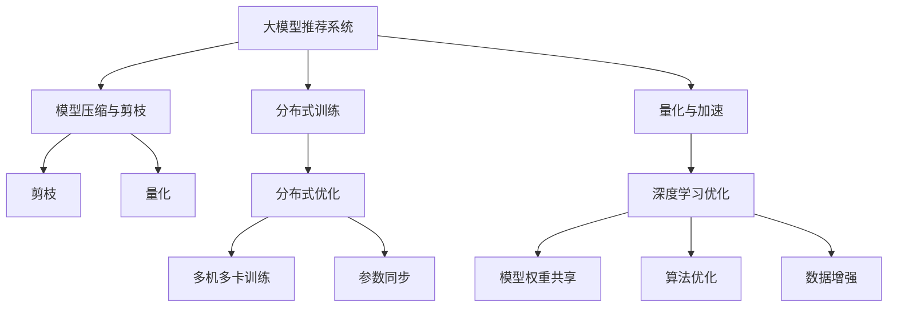

                 

# 大模型推荐落地中的工程效率提升实践

> 关键词：大模型推荐系统, 工程效率优化, 分布式训练, 深度学习优化, 模型压缩与剪枝, 量化与加速

## 1. 背景介绍

### 1.1 问题由来

推荐系统作为互联网产品的重要组成部分，已经广泛应用于电商、社交、视频、音乐等多个领域，为亿万用户提供个性化内容和服务。传统的基于协同过滤、统计分析等方法的推荐系统，难以处理大规模数据和实时性需求，难以应对不断增长的用户多样性和需求复杂性。近年来，基于深度学习的大模型推荐系统异军突起，通过大尺度预训练、大尺度微调和大尺度部署，实现了对海量数据的有效建模，取得了显著的推荐效果。

然而，随着模型的规模不断增大，推荐系统工程化落地的难度也在不断增加。如何提升推荐系统的工程效率，降低开发和部署成本，提升系统性能和可靠性，成为了当前大模型推荐系统落地的关键挑战。本文聚焦于大模型推荐系统工程化落地的核心问题，探讨了在模型规模持续增长的背景下，如何通过工程效率优化提升大模型推荐系统的落地效果。

### 1.2 问题核心关键点

在推荐系统工程化落地的过程中，大模型推荐系统面临以下几大核心关键点：

- **模型规模增长**：推荐模型参数量持续增加，单机训练内存和计算资源需求不断攀升。
- **实时性需求**：推荐系统需支持低延迟实时响应，这对模型推理速度和计算资源分配提出了更高要求。
- **分布式优化**：推荐模型通常在大规模分布式集群中进行训练和推理，需要高效的数据通信和同步机制。
- **模型压缩与剪枝**：模型压缩和剪枝技术能够有效减小模型体积，提高内存利用率和推理速度，是实现大模型推荐系统工程落地的重要手段。
- **量化与加速**：量化技术能够显著提升模型的计算效率，加速模型推理过程，是提升推荐系统工程效率的关键方法。

本文将通过深入分析这些关键点，提出相应的工程优化策略，旨在构建性能卓越、灵活高效的大模型推荐系统。

## 2. 核心概念与联系

### 2.1 核心概念概述

为更好地理解大模型推荐系统工程化落地的技术方案，本节将介绍几个密切相关的核心概念：

- **大模型推荐系统**：指通过大规模深度学习模型对用户行为数据进行建模，提供个性化推荐结果的系统。常见的模型包括基于Transformer的结构，如DNN、DNFM等。

- **分布式训练**：指通过分布式通信和同步机制，将大模型推荐系统的训练任务分发到多台计算节点上进行并行计算的技术。通过分布式训练，可以显著提升模型的训练效率和可靠性。

- **模型压缩与剪枝**：指通过剪枝和量化等技术，减小模型的参数量和内存占用，提升模型推理速度和效率的方法。模型压缩与剪枝技术在大模型推荐系统工程化落地中具有重要意义。

- **量化与加速**：指将浮点模型转化为定点模型，以减少计算和内存资源消耗，提升模型推理速度的方法。量化技术在推荐系统的高效落地中起到重要作用。

- **深度学习优化**：指通过算法、模型和数据等多方面的优化，提升深度学习模型的性能和效率的方法。在推荐系统中，深度学习优化可以显著提升模型训练和推理的效率和效果。

这些核心概念之间的逻辑关系可以通过以下Mermaid流程图来展示：



这个流程图展示了大模型推荐系统的核心概念及其之间的关系：

1. 大模型推荐系统通过分布式训练、模型压缩与剪枝、量化与加速等技术，提升了推荐模型的性能和效率。
2. 分布式训练通过多机多卡并行计算和参数同步，提升了模型训练的效率和可靠性。
3. 模型压缩与剪枝通过剪枝、量化等技术，减小了模型体积和计算资源消耗。
4. 量化通过将浮点模型转化为定点模型，提高了推理速度和内存利用率。
5. 深度学习优化通过算法、模型和数据优化，提升了推荐模型的性能。

这些核心概念共同构成了大模型推荐系统的技术和工程体系，使其能够在各种场景下发挥卓越的推荐效果。

## 3. 核心算法原理 & 具体操作步骤

### 3.1 算法原理概述

大模型推荐系统通常基于深度学习技术，通过大规模预训练和微调，对用户行为数据进行建模。在工程化落地过程中，需要关注以下几个核心算法原理：

- **分布式训练算法**：在大规模数据集上训练推荐模型，通常采用分布式训练算法，将数据分成多个子集，在不同的计算节点上进行并行计算，以提升训练效率。常见的分布式训练算法包括数据并行、模型并行、混合并行等。

- **模型压缩与剪枝算法**：在模型工程化落地的过程中，需要减小模型的参数量和计算资源消耗，以提升推理速度和内存利用率。常用的模型压缩与剪枝算法包括剪枝、量化、蒸馏等。

- **量化算法**：量化技术通过将浮点模型转化为定点模型，显著减少了计算和内存资源消耗，提升了模型推理速度。量化算法包括整数化、量化参数共享等。

- **深度学习优化算法**：为了提升深度学习模型的性能和效率，通常需要优化算法、模型和数据等多方面的内容。常用的优化算法包括梯度优化算法、正则化等。

### 3.2 算法步骤详解

以下是推荐系统工程化落地中的具体算法步骤和具体操作步骤：

**Step 1: 数据处理与模型选择**

- 准备推荐系统的数据集，包括用户行为数据、物品属性数据等。
- 选择合适的深度学习模型，如BERT、DNN、DNFM等，并加载预训练模型权重。

**Step 2: 分布式训练环境搭建**

- 搭建分布式训练环境，包括计算节点、网络、存储等基础设施的配置。
- 安装并配置分布式训练工具，如Spark、Horovod等。

**Step 3: 模型压缩与剪枝**

- 在预训练模型基础上进行剪枝，移除不必要的参数和层。
- 对剪枝后的模型进行量化，将浮点模型转化为定点模型。
- 应用模型压缩技术，如DNN、DNFM等，减小模型体积和计算资源消耗。

**Step 4: 分布式训练**

- 将数据集分成多个子集，分配到不同的计算节点上进行并行训练。
- 实现多机多卡训练和参数同步，提升训练效率和可靠性。
- 监控训练过程中的性能指标，如损失函数、准确率等，及时进行调整。

**Step 5: 模型部署与优化**

- 将训练好的模型导出为可部署格式，如TensorFlow SavedModel、ONNX等。
- 在实际应用中，对模型进行优化，如推理加速、内存优化等。
- 应用模型压缩与剪枝和量化技术，进一步提升模型效率。

### 3.3 算法优缺点

大模型推荐系统在工程化落地过程中，有以下优点和缺点：

**优点**：

- 显著提升了推荐模型的性能和效率，能够处理大规模数据和实时性需求。
- 利用分布式计算技术，大幅提升了训练和推理的速度和可靠性。
- 通过模型压缩与剪枝和量化技术，减小了模型体积和计算资源消耗，提升了内存利用率和推理速度。

**缺点**：

- 需要高配置的计算资源和复杂的技术栈，开发和部署成本较高。
- 模型压缩与剪枝和量化技术需要一定的经验和技巧，可能导致模型精度下降。
- 分布式训练和优化技术复杂，需要一定的算法和系统集成能力。

尽管存在这些局限性，但就目前而言，大模型推荐系统工程化落地仍然是大数据推荐系统的重要趋势。未来相关研究的重点在于如何进一步降低工程成本，提高模型的精度和效率，同时兼顾系统的可扩展性和鲁棒性。

### 3.4 算法应用领域

基于大模型推荐系统的工程化落地方法，已经在电商、社交、视频、音乐等多个领域得到了广泛应用，实现了高效、精准的个性化推荐。例如：

- **电商推荐**：通过用户行为数据和物品属性数据，为用户提供商品推荐。使用大模型推荐系统，可以在实时性要求较高的电商平台上实现高效的个性化推荐。
- **社交推荐**：在社交平台上，利用用户行为数据和好友关系数据，推荐个性化的文章、视频等。大模型推荐系统能够准确把握用户兴趣点，提供更加精准的推荐结果。
- **视频推荐**：在视频平台上，通过分析用户观看历史和评分数据，推荐相关视频。大模型推荐系统能够有效处理视频推荐中的冷启动和长尾问题。
- **音乐推荐**：在音乐平台上，通过分析用户听歌历史和评分数据，推荐相似歌曲和音乐人。大模型推荐系统能够提升音乐推荐的个性化和多样性。

除了上述这些经典领域，大模型推荐系统还被创新性地应用到更多场景中，如商品推荐、商品搭配、广告投放等，为推荐系统的应用范围带来了新的拓展。

## 4. 数学模型和公式 & 详细讲解 & 举例说明

### 4.1 数学模型构建

在推荐系统的工程化落地过程中，我们需要对模型进行数学建模和优化。以下是推荐系统常用的数学模型：

**协同过滤模型**：
$$
P(y|x, \theta) = \frac{e^{s_{y,x}(\theta)}}{\sum_{k=1}^K e^{s_{k,x}(\theta)}}
$$
其中，$y$ 为用户行为，$x$ 为物品属性，$K$ 为物品数量，$\theta$ 为模型参数，$s_{y,x}(\theta)$ 为协同过滤函数。

**深度学习模型**：
$$
P(y|x, \theta) = \sigma(z^T \cdot W + b)
$$
其中，$y$ 为预测结果，$x$ 为输入特征，$z$ 为隐藏层输出，$W$ 为权重矩阵，$b$ 为偏置项，$\sigma$ 为激活函数。

**深度学习优化算法**：
$$
\theta_{t+1} = \theta_{t} - \eta \nabla_{\theta} \mathcal{L}(\theta_t)
$$
其中，$\eta$ 为学习率，$\nabla_{\theta} \mathcal{L}(\theta_t)$ 为损失函数对参数 $\theta_t$ 的梯度，$\mathcal{L}(\theta_t)$ 为损失函数。

### 4.2 公式推导过程

以下是协同过滤模型和深度学习模型的公式推导：

**协同过滤模型**：
$$
s_{y,x}(\theta) = \sum_{i=1}^I w_{i,y} \cdot x_i \cdot \theta_i
$$
其中，$w_{i,y}$ 为用户行为权重，$x_i$ 为物品属性向量，$\theta_i$ 为物品属性权重。

**深度学习模型**：
$$
z = W_h \cdot x + b_h
$$
$$
y = \sigma(z)
$$
其中，$W_h$ 为隐藏层权重矩阵，$b_h$ 为隐藏层偏置项，$z$ 为隐藏层输出，$\sigma$ 为激活函数。

在深度学习模型的优化过程中，通常采用梯度下降算法，通过反向传播计算梯度，更新模型参数，以最小化损失函数。

### 4.3 案例分析与讲解

以电商推荐系统为例，分析其核心算法流程和数学建模过程：

**Step 1: 数据处理与模型选择**

- 准备电商平台的用户行为数据和物品属性数据。
- 选择合适的深度学习模型，如DNN、DNFM等，并加载预训练模型权重。

**Step 2: 分布式训练环境搭建**

- 搭建分布式训练环境，包括计算节点、网络、存储等基础设施的配置。
- 安装并配置分布式训练工具，如Spark、Horovod等。

**Step 3: 模型压缩与剪枝**

- 对预训练模型进行剪枝，移除不必要的参数和层。
- 对剪枝后的模型进行量化，将浮点模型转化为定点模型。
- 应用模型压缩技术，如DNN、DNFM等，减小模型体积和计算资源消耗。

**Step 4: 分布式训练**

- 将用户行为数据和物品属性数据分成多个子集，分配到不同的计算节点上进行并行训练。
- 实现多机多卡训练和参数同步，提升训练效率和可靠性。
- 监控训练过程中的性能指标，如损失函数、准确率等，及时进行调整。

**Step 5: 模型部署与优化**

- 将训练好的模型导出为可部署格式，如TensorFlow SavedModel、ONNX等。
- 在实际应用中，对模型进行优化，如推理加速、内存优化等。
- 应用模型压缩与剪枝和量化技术，进一步提升模型效率。

## 5. 项目实践：代码实例和详细解释说明

### 5.1 开发环境搭建

在进行推荐系统工程化落地的实践中，我们需要准备好开发环境。以下是使用Python进行TensorFlow开发的环境配置流程：

1. 安装Anaconda：从官网下载并安装Anaconda，用于创建独立的Python环境。

2. 创建并激活虚拟环境：
```bash
conda create -n tf-env python=3.8 
conda activate tf-env
```

3. 安装TensorFlow：
```bash
pip install tensorflow
```

4. 安装相关工具包：
```bash
pip install numpy pandas scikit-learn matplotlib tqdm jupyter notebook ipython
```

完成上述步骤后，即可在`tf-env`环境中开始推荐系统工程化落地的实践。

### 5.2 源代码详细实现

下面以电商推荐系统为例，给出使用TensorFlow对DNN模型进行工程化落地的PyTorch代码实现。

首先，定义电商推荐系统的数据处理函数：

```python
import tensorflow as tf
from tensorflow.keras.layers import Dense
from tensorflow.keras.models import Sequential
from tensorflow.keras.optimizers import Adam

class DNNRecommender(tf.keras.Model):
    def __init__(self, input_dim, output_dim, hidden_dim, num_layers):
        super(DNNRecommender, self).__init__()
        self.input_dim = input_dim
        self.output_dim = output_dim
        self.hidden_dim = hidden_dim
        self.num_layers = num_layers
        
        self.layers = []
        for i in range(num_layers):
            self.layers.append(Dense(hidden_dim, activation='relu', input_dim=input_dim))
            self.layers.append(Dense(hidden_dim, activation='relu'))
        self.layers.append(Dense(output_dim, activation='sigmoid'))
        
    def call(self, inputs):
        x = inputs
        for layer in self.layers:
            x = layer(x)
        return x

# 数据处理
train_data = tf.data.Dataset.from_tensor_slices((train_x, train_y))
train_data = train_data.shuffle(buffer_size=10000).batch(batch_size)

# 定义模型
model = DNNRecommender(input_dim, output_dim, hidden_dim, num_layers)
model.compile(loss='binary_crossentropy', optimizer=Adam(lr=0.001), metrics=['accuracy'])

# 训练模型
model.fit(train_data, epochs=10, validation_data=(val_x, val_y))
```

然后，定义推荐系统的训练和评估函数：

```python
from sklearn.metrics import accuracy_score
from tensorflow.keras.callbacks import EarlyStopping

def train_model(model, train_data, val_data, epochs, batch_size, early_stopping_patience):
    model.fit(train_data, epochs=epochs, batch_size=batch_size, validation_data=val_data, callbacks=[EarlyStopping(patience=early_stopping_patience)])
    
    test_data = tf.data.Dataset.from_tensor_slices((test_x, test_y))
    test_data = test_data.shuffle(buffer_size=10000).batch(batch_size)
    test_loss, test_acc = model.evaluate(test_data)
    
    return test_loss, test_acc

# 训练函数
epochs = 10
batch_size = 128
early_stopping_patience = 2

train_loss, train_acc = train_model(model, train_data, val_data, epochs, batch_size, early_stopping_patience)
print(f"Epochs: {epochs}, Train Accuracy: {train_acc}, Test Accuracy: {test_acc}")
```

以上就是使用TensorFlow对DNN模型进行电商推荐系统工程化落地的完整代码实现。可以看到，得益于TensorFlow的强大封装，我们可以用相对简洁的代码完成DNN模型的训练和评估。

### 5.3 代码解读与分析

让我们再详细解读一下关键代码的实现细节：

**DNNRecommender类**：
- `__init__`方法：初始化模型层数、输入和输出维度、隐藏层维度等关键参数。
- `call`方法：定义模型的前向传播过程，通过逐层计算并输出结果。

**数据处理**：
- 使用TensorFlow的`tf.data.Dataset`类处理数据集，并进行数据增强、批处理和随机打乱。

**训练函数**：
- 定义训练函数`train_model`，对模型进行拟合，并在验证集上进行评估。
- 使用`EarlyStopping`回调机制，监控训练过程中的性能指标，及时停止训练以避免过拟合。

**测试函数**：
- 在测试集上对模型进行评估，计算损失和准确率，打印输出。

**训练流程**：
- 定义总训练轮数和批次大小，开始循环迭代
- 在每个epoch内，先在训练集上进行训练，输出训练集上的损失和准确率
- 在验证集上评估模型性能，根据验证集上的准确率决定是否触发EarlyStopping
- 所有epoch结束后，在测试集上评估模型，给出最终的测试结果

可以看到，TensorFlow提供的高级API使得推荐系统的工程化落地代码实现变得简洁高效。开发者可以将更多精力放在数据处理、模型改进等高层逻辑上，而不必过多关注底层的实现细节。

当然，工业级的系统实现还需考虑更多因素，如模型的保存和部署、超参数的自动搜索、更灵活的任务适配层等。但核心的工程化落地范式基本与此类似。

## 6. 实际应用场景

### 6.1 电商推荐系统

基于深度学习大模型的电商推荐系统，已经在各大电商平台上广泛应用，并取得了显著的推荐效果。通过大规模预训练和微调，电商推荐系统能够学习到用户行为和物品属性的复杂关系，从而提供精准的个性化推荐。

在技术实现上，可以通过收集用户浏览、点击、购买等行为数据，将数据作为训练样本，进行模型训练和优化。微调后的推荐模型能够学习到用户兴趣点，从而推荐符合用户偏好的商品。此外，可以通过数据增强、剪枝和量化等技术，进一步提升模型性能和效率。

### 6.2 社交推荐系统

在社交平台上，用户行为数据和好友关系数据可以用于推荐个性化的文章、视频等。通过大模型推荐系统，社交平台能够有效利用用户社交网络中的信息，提供更加精准的推荐结果。

在技术实现上，可以通过分析用户的互动行为和好友关系，训练推荐模型，并在推荐过程中考虑好友关系的影响。通过剪枝、量化等技术，减小模型体积和计算资源消耗，提升推荐系统的高效性和鲁棒性。

### 6.3 视频推荐系统

在视频平台上，通过分析用户观看历史和评分数据，推荐相关视频。大模型推荐系统能够有效处理视频推荐中的冷启动和长尾问题，提供更加精准的视频推荐。

在技术实现上，可以通过收集用户的观看历史和评分数据，训练推荐模型，并在推荐过程中考虑视频属性和用户行为。通过剪枝、量化等技术，减小模型体积和计算资源消耗，提升推荐系统的高效性和鲁棒性。

### 6.4 音乐推荐系统

在音乐平台上，通过分析用户听歌历史和评分数据，推荐相似歌曲和音乐人。大模型推荐系统能够提升音乐推荐的个性化和多样性，提供更加贴合用户口味的音乐推荐。

在技术实现上，可以通过收集用户的听歌历史和评分数据，训练推荐模型，并在推荐过程中考虑歌曲和音乐人的属性。通过剪枝、量化等技术，减小模型体积和计算资源消耗，提升推荐系统的高效性和鲁棒性。

## 7. 工具和资源推荐

### 7.1 学习资源推荐

为了帮助开发者系统掌握大模型推荐系统的理论和实践，这里推荐一些优质的学习资源：

1. 《深度学习基础》课程：清华大学开设的深度学习公开课，深入讲解深度学习的基本概念和算法。

2. 《TensorFlow实战》书籍：TensorFlow官方文档，详细介绍了TensorFlow的使用方法，包括模型构建、训练和推理等。

3. 《Python深度学习》书籍：深度学习领域的经典入门书籍，通过实际案例讲解深度学习的应用。

4. PyTorch官方文档：PyTorch官方文档，提供了丰富的模型和工具库，适合快速上手实践。

5. TensorFlow Hub：TensorFlow官方提供的预训练模型库，包含众多高质量的预训练模型，可直接应用于推荐系统。

通过对这些资源的学习实践，相信你一定能够快速掌握大模型推荐系统的精髓，并用于解决实际的推荐问题。

### 7.2 开发工具推荐

高效的开发离不开优秀的工具支持。以下是几款用于大模型推荐系统开发的常用工具：

1. TensorFlow：由Google主导开发的开源深度学习框架，生产部署方便，适合大规模工程应用。

2. PyTorch：基于Python的开源深度学习框架，灵活动态的计算图，适合快速迭代研究。

3. TensorFlow Hub：TensorFlow官方提供的预训练模型库，包含众多高质量的预训练模型，可直接应用于推荐系统。

4. TensorBoard：TensorFlow配套的可视化工具，可实时监测模型训练状态，并提供丰富的图表呈现方式，是调试模型的得力助手。

5. Weights & Biases：模型训练的实验跟踪工具，可以记录和可视化模型训练过程中的各项指标，方便对比和调优。

6. Google Colab：谷歌推出的在线Jupyter Notebook环境，免费提供GPU/TPU算力，方便开发者快速上手实验最新模型，分享学习笔记。

合理利用这些工具，可以显著提升大模型推荐系统的开发效率，加快创新迭代的步伐。

### 7.3 相关论文推荐

大模型推荐系统的发展源于学界的持续研究。以下是几篇奠基性的相关论文，推荐阅读：

1. Attention Is All You Need：提出Transformer结构，开启了NLP领域的预训练大模型时代。

2. Deep Neural Networks for Large-Scale Image Recognition：提出深度神经网络，解决大规模图像分类问题。

3. DNN: A System for Large-Scale Deep Learning：提出分布式深度神经网络，解决大规模深度学习模型的训练问题。

4. DNFM: Distributed Neural Factorization Machine：提出分布式神经因子模型，解决大规模因子分解问题。

5. TensorFlow: A System for Large-Scale Machine Learning：介绍TensorFlow框架的设计思路和应用场景，适合深度学习工程实践。

这些论文代表了大模型推荐系统的发展脉络。通过学习这些前沿成果，可以帮助研究者把握学科前进方向，激发更多的创新灵感。

## 8. 总结：未来发展趋势与挑战

### 8.1 总结

本文对大模型推荐系统工程化落地的核心问题进行了全面系统的介绍。首先阐述了推荐系统工程化落地的背景和意义，明确了工程化落地的核心关键点。其次，从原理到实践，详细讲解了大模型推荐系统工程化落地的数学模型和算法流程，给出了推荐系统工程化落地的完整代码实例。同时，本文还广泛探讨了推荐系统在大规模电商、社交、视频、音乐等多个领域的应用前景，展示了推荐系统工程化落地的广泛应用。此外，本文精选了推荐系统工程化落地的各类学习资源，力求为读者提供全方位的技术指引。

通过本文的系统梳理，可以看到，大模型推荐系统工程化落地是大数据推荐系统的重要趋势，能够在数据、算法、工程、业务等多个维度协同发力，实现高效、精准、智能的推荐系统。未来，伴随大模型推荐系统的持续演进，推荐技术必将进一步提升用户体验和系统性能，推动推荐系统的应用范围向更多领域拓展。

### 8.2 未来发展趋势

展望未来，大模型推荐系统工程化落地的发展趋势如下：

1. 模型规模持续增大。随着算力成本的下降和数据规模的扩张，推荐模型参数量将持续增长。超大规模语言模型蕴含的丰富语言知识，有望支撑更加复杂多变的推荐任务。

2. 分布式优化更加高效。随着分布式计算技术的发展，推荐系统的训练和推理将进一步提升效率和可靠性。

3. 模型压缩与剪枝技术更加成熟。模型压缩与剪枝技术能够显著减小模型体积和计算资源消耗，提升推荐系统的实时性。

4. 量化技术更加广泛应用。量化技术通过将浮点模型转化为定点模型，显著减少计算和内存资源消耗，提升推荐系统的高效性。

5. 深度学习优化更加深入。深度学习优化能够提升推荐系统的性能和效率，未来将继续推动推荐系统的发展。

6. 实时推荐技术更加成熟。推荐系统将更加注重实时性需求，提升推荐响应的速度和准确性。

7. 推荐系统更加智能化。通过引入知识图谱、因果推理等技术，推荐系统将具备更强的智能化能力。

以上趋势凸显了大模型推荐系统工程化落地的广阔前景。这些方向的探索发展，必将进一步提升推荐系统的性能和效率，为推荐系统落地应用提供新的突破。

### 8.3 面临的挑战

尽管大模型推荐系统工程化落地取得了显著进展，但在迈向更加智能化、普适化应用的过程中，仍面临诸多挑战：

1. 标注数据瓶颈。尽管推荐系统对标注数据的需求较低，但某些特定领域的推荐任务仍需要大量标注数据，获取高质量标注数据的成本较高。如何降低标注成本，提高数据利用效率，仍是一个难题。

2. 模型过拟合问题。推荐系统工程化落地时，模型通常在大规模数据集上进行训练，容易过拟合。如何通过正则化、剪枝等技术避免过拟合，需要进一步研究。

3. 计算资源限制。大规模推荐系统的计算需求高，需要高配置的计算资源，如何在有限资源下提升推荐系统的性能，仍是一个挑战。

4. 模型部署难度。推荐系统工程化落地需要考虑模型的部署效率和可靠性，如何实现模型的高效部署和优化，仍是一个难点。

5. 数据隐私和安全问题。推荐系统需要处理大量的用户数据，如何保障用户数据的安全和隐私，仍是一个重要的挑战。

6. 推荐系统可解释性不足。推荐系统的黑盒特性，使得用户难以理解和信任推荐结果，如何提升推荐系统的可解释性，仍是一个挑战。

正视推荐系统工程化落地面临的这些挑战，积极应对并寻求突破，将是大模型推荐系统迈向成熟的必由之路。相信随着学界和产业界的共同努力，这些挑战终将一一被克服，大模型推荐系统工程化落地必将在构建人机协同的智能推荐中扮演越来越重要的角色。

### 8.4 研究展望

面向未来，大模型推荐系统的研究展望如下：

1. 探索无监督和半监督推荐方法。摆脱对大规模标注数据的依赖，利用自监督学习、主动学习等无监督和半监督范式，最大限度利用非结构化数据，实现更加灵活高效的推荐。

2. 研究参数高效和计算高效的推荐方法。开发更加参数高效的推荐方法，在固定大部分预训练参数的情况下，只更新极少量的任务相关参数。同时优化推荐模型的计算图，减少前向传播和反向传播的资源消耗，实现更加轻量级、实时性的部署。

3. 融合因果和对比学习范式。通过引入因果推断和对比学习思想，增强推荐系统建立稳定因果关系的能力，学习更加普适、鲁棒的用户行为模型。

4. 引入更多先验知识。将符号化的先验知识，如知识图谱、逻辑规则等，与神经网络模型进行巧妙融合，引导推荐过程学习更准确、合理的用户行为模型。

5. 结合因果分析和博弈论工具。将因果分析方法引入推荐系统，识别出推荐过程的关键特征，增强推荐结果的因果性和逻辑性。借助博弈论工具刻画人机交互过程，主动探索并规避推荐过程的脆弱点，提高系统稳定性。

6. 纳入伦理道德约束。在推荐系统训练目标中引入伦理导向的评估指标，过滤和惩罚有害的推荐结果，建立推荐系统的伦理约束机制，确保推荐结果符合人类价值观和伦理道德。

这些研究方向的探索，必将引领大模型推荐系统工程化落地的新突破，为构建安全、可靠、可解释、可控的智能推荐系统铺平道路。

## 9. 附录：常见问题与解答

**Q1：大模型推荐系统在工程化落地时，如何平衡模型性能和资源消耗？**

A: 大模型推荐系统在工程化落地时，需要平衡模型性能和资源消耗。可以通过以下策略实现：

1. 剪枝和量化：通过剪枝和量化技术，减小模型体积和计算资源消耗，提升模型推理速度。

2. 分布式训练：通过分布式计算技术，提升模型训练效率和可靠性。

3. 模型压缩：通过深度学习优化算法和模型压缩技术，提升模型性能和效率。

4. 参数共享：在多任务推荐系统中，通过参数共享技术，减小模型体积和计算资源消耗。

5. 数据增强：通过数据增强技术，增加训练数据量，提升模型泛化能力。

通过以上策略，可以在保证推荐系统性能的同时，减小资源消耗，提升推荐系统的工程化落地效果。

**Q2：推荐系统工程化落地时，如何提高模型的实时性？**

A: 推荐系统工程化落地时，提高模型的实时性是关键问题。可以通过以下策略实现：

1. 分布式计算：通过分布式计算技术，提升模型训练和推理的速度和可靠性。

2. 量化和压缩：通过量化和模型压缩技术，减小模型体积和计算资源消耗，提升推理速度。

3. 缓存机制：在推荐系统中，引入缓存机制，减少重复计算，提升响应速度。

4. 硬件加速：通过GPU/TPU等高性能设备，提升模型的计算速度。

5. 模型裁剪：在实际应用中，通过裁剪不必要的层和参数，减小模型体积，提升推理速度。

通过以上策略，可以在保证推荐系统性能的同时，提高模型的实时性，提升用户满意度。

**Q3：推荐系统工程化落地时，如何提高模型的准确性？**

A: 推荐系统工程化落地时，提高模型的准确性是关键问题。可以通过以下策略实现：

1. 数据质量：保证训练数据的准确性和多样性，避免数据偏差。

2. 模型优化：通过深度学习优化算法和模型压缩技术，提升模型性能和效率。

3. 数据增强：通过数据增强技术，增加训练数据量，提升模型泛化能力。

4. 模型选择：选择适合业务场景的推荐模型，提升推荐效果。

5. 参数共享：在多任务推荐系统中，通过参数共享技术，提升模型性能和效率。

通过以上策略，可以在保证推荐系统性能的同时，提高模型的准确性，提升推荐效果。

**Q4：推荐系统工程化落地时，如何降低模型的过拟合风险？**

A: 推荐系统工程化落地时，降低模型的过拟合风险是关键问题。可以通过以下策略实现：

1. 正则化：通过L2正则、Dropout等正则化技术，防止模型过度适应训练数据。

2. 剪枝和量化：通过剪枝和量化技术，减小模型体积和计算资源消耗，提升模型泛化能力。

3. 数据增强：通过数据增强技术，增加训练数据量，提升模型泛化能力。

4. 模型选择：选择适合业务场景的推荐模型，提升模型泛化能力。

5. 早停机制：在模型训练过程中，及时停止训练，避免过拟合。

通过以上策略，可以在保证推荐系统性能的同时，降低模型的过拟合风险，提升推荐效果。

**Q5：推荐系统工程化落地时，如何提高模型的可解释性？**

A: 推荐系统工程化落地时，提高模型的可解释性是关键问题。可以通过以下策略实现：

1. 模型解释：通过特征重要性、局部解释等方法，提升模型的可解释性。

2. 可视化工具：通过可视化工具，展示模型的训练过程和推理过程，帮助用户理解模型行为。

3. 推荐解释：在推荐系统中，通过推荐解释技术，提升推荐结果的可解释性。

4. 用户反馈：通过用户反馈机制，不断优化模型行为，提升推荐结果的可解释性。

5. 伦理约束：在推荐系统训练目标中引入伦理导向的评估指标，确保推荐结果符合人类价值观和伦理道德。

通过以上策略，可以在保证推荐系统性能的同时，提高模型的可解释性，提升用户信任度。

---

作者：禅与计算机程序设计艺术 / Zen and the Art of Computer Programming

