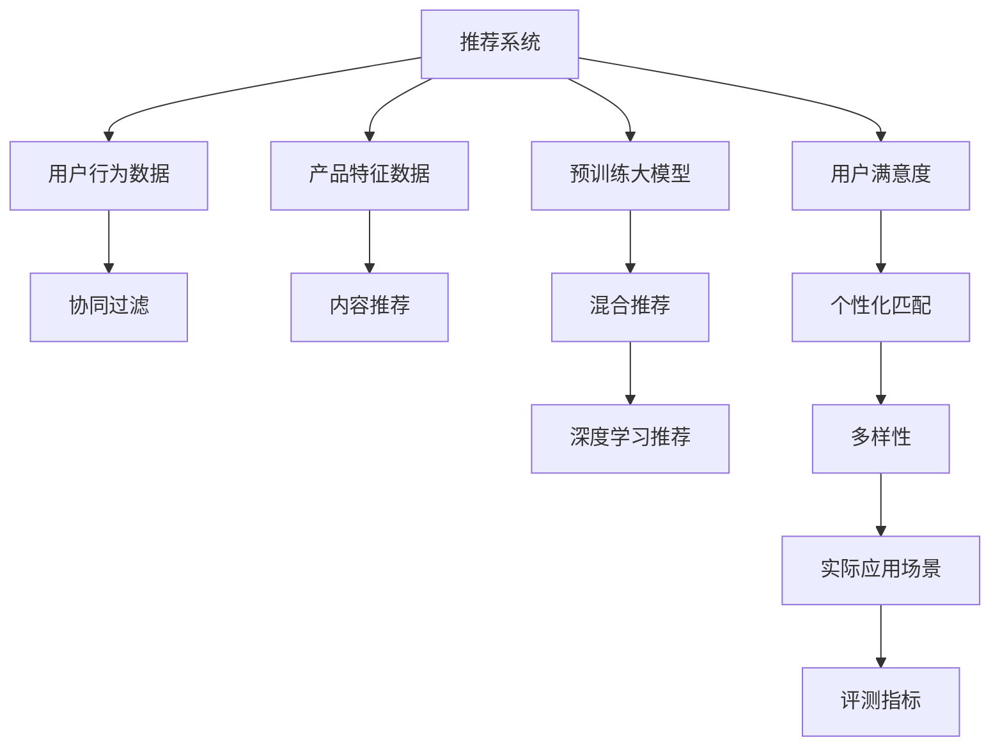

                 

# 大模型视角下推荐系统的评测指标体系构建与优化

> 关键词：推荐系统, 评测指标, 模型评估, 推荐质量, 实时性, 可解释性, 多样性, 个性化, 未来展望

## 1. 背景介绍

在互联网和数字经济的时代，推荐系统已经成为了用户获取信息、发现商品和服务的关键工具。无论是电商平台、视频网站、音乐平台，还是社交媒体，推荐系统都在起着至关重要的作用。然而，随着用户需求和数据规模的不断增长，推荐系统的复杂性和挑战也在日益增加。特别是在大数据、人工智能技术不断进步的背景下，传统的基于规则或统计的推荐算法已经难以应对当前需求。而基于深度学习和预训练大模型的推荐系统，则提供了更为智能和高效的解决方案。

在推荐系统中，如何评估模型的性能和效果，成为了一个重要且复杂的任务。传统的推荐系统评测指标主要关注准确率和覆盖率，但在深度学习和大模型驱动的推荐系统中，评测指标体系需要进行扩展和优化，以更好地衡量模型的效果和效率。本文旨在探讨在大模型视角下，推荐系统评测指标体系的构建与优化方法，从理论上阐述构建基于深度学习模型的推荐系统评测指标的重要性，并结合实际应用案例，提出一系列具体可行的优化方案。

## 2. 核心概念与联系

### 2.1 核心概念概述

推荐系统（Recommendation System），即根据用户的历史行为和兴趣，推荐个性化的内容或产品。其目标是提高用户满意度和平台收益，增加用户粘性和参与度。推荐系统主要包括三大类：基于协同过滤（Collaborative Filtering）的推荐、基于内容的推荐（Content-Based Recommendation）以及混合推荐系统（Hybrid Recommendation System）。

深度学习和大模型在推荐系统中的应用，主要涉及预训练语言模型（Pretrained Language Models）、自编码器（Autoencoder）、神经网络（Neural Network）等技术，通过学习用户行为和产品特征的深层表示，提高推荐准确性和泛化能力。

评测指标（Evaluation Metrics），是用于衡量推荐系统性能的定量指标，主要分为三大类：
1. **准确率相关指标**：如点击率（Click-Through Rate, CTR）、转化率（Conversion Rate, CR）等，主要关注推荐的精准性和相关性。
2. **多样性相关指标**：如多样性指数（Diversity Index）、负采样率（Negative Sampling Rate）等，主要关注推荐结果的多样性和用户满意度。
3. **个性化相关指标**：如个性化匹配度（Personalization Match）、用户满意度（User Satisfaction）等，主要关注推荐的个性化程度和用户接受度。

### 2.2 核心概念原理和架构的 Mermaid 流程图



该流程图展示了推荐系统的主要组件和工作流程。用户行为数据和产品特征数据经过协同过滤和内容推荐等传统方法，或者被预训练大模型所处理，通过混合推荐或深度学习推荐，最终生成个性化的推荐结果。推荐结果需经过用户满意度和个性化匹配等指标的评估，以及多样性等指标的衡量，才能确定最终的推荐质量。

## 3. 核心算法原理 & 具体操作步骤

### 3.1 算法原理概述

在大模型视角下，推荐系统的评测指标构建与优化主要涉及两个核心方面：
1. **指标构建**：选择合适的评测指标，全面衡量推荐系统的性能和效果。
2. **指标优化**：通过模型训练和调整，最大化推荐系统的评测指标。

深度学习和大模型在推荐系统中通常使用Transformer架构，通过自监督学习任务进行预训练，然后通过少量监督数据进行微调，适应具体的应用场景。基于此，推荐系统的评测指标构建与优化可以分为以下几个步骤：
1. **数据准备**：收集和预处理用户行为数据和产品特征数据。
2. **模型训练**：在预训练数据上进行自监督学习，然后在少量监督数据上进行微调。
3. **评测指标构建**：选择合适的评测指标，如CTR、CR、个性化匹配度、多样性指数等。
4. **指标优化**：根据评测指标，调整模型超参数和架构，提升推荐系统的性能。

### 3.2 算法步骤详解

以下是具体的操作步骤：

**Step 1: 数据准备**
- 收集用户行为数据，如点击、购买、评分等。
- 收集产品特征数据，如商品类别、品牌、价格等。
- 对数据进行清洗、归一化等预处理，保证数据质量。

**Step 2: 模型训练**
- 选择预训练大模型，如BERT、GPT等。
- 在预训练数据上进行自监督学习，如Masked Language Modeling、Next Sentence Prediction等。
- 在少量监督数据上进行微调，适应具体的应用场景。

**Step 3: 评测指标构建**
- 选择多类评测指标，如CTR、CR、个性化匹配度、多样性指数等。
- 定义评测指标的计算公式和评估方法。
- 结合具体应用场景，选择合适的评测指标。

**Step 4: 指标优化**
- 根据评测指标，调整模型超参数和架构。
- 如调整学习率、批大小、优化器等。
- 优化模型架构，如增加深度、减小宽度等。

### 3.3 算法优缺点

基于大模型推荐系统的评测指标构建与优化，具有以下优点：
1. **全面性**：选择多类评测指标，全面衡量推荐系统的性能和效果。
2. **适应性强**：可以适应不同应用场景，如电商、视频、音乐等。
3. **实时性**：通过模型微调，可以实时更新推荐结果，提高用户满意度。

同时，也存在一些缺点：
1. **计算量大**：模型训练和评测需要大量的计算资源。
2. **超参数调参困难**：选择合适的超参数，需要进行大量的实验和调试。
3. **数据依赖性强**：推荐系统性能很大程度上依赖于数据质量。

### 3.4 算法应用领域

基于大模型的推荐系统，在多个领域都有广泛应用：
1. **电商推荐**：推荐用户可能感兴趣的商品，提高购买转化率。
2. **视频推荐**：推荐用户可能喜欢的视频内容，增加观看时长。
3. **音乐推荐**：推荐用户可能喜欢的音乐，提高用户留存率。
4. **社交推荐**：推荐用户可能感兴趣的朋友，增加用户粘性。
5. **新闻推荐**：推荐用户感兴趣的新闻，提高用户参与度。

## 4. 数学模型和公式 & 详细讲解 & 举例说明

### 4.1 数学模型构建

在推荐系统中，常见的数学模型包括矩阵分解模型（Matrix Factorization）、协同过滤模型（Collaborative Filtering）、基于深度学习的模型（Deep Learning Model）等。这里我们以基于深度学习的模型为例，构建推荐系统的数学模型。

假设推荐系统有$n$个用户和$m$个商品，$U$表示用户集合，$V$表示商品集合。推荐系统需要预测用户$u$对商品$v$的评分$x_{uv}$。

模型的输入为$X \in \mathbb{R}^{n \times d}$，其中$X_{uj}$表示用户$u$对商品$v$的特征表示。输出为$Y \in \mathbb{R}^{m \times d}$，其中$Y_{vi}$表示商品$v$对用户$u$的特征表示。

推荐系统的目标是预测用户$u$对商品$v$的评分$x_{uv}$，通常采用损失函数最小化来实现：
$$\min_{X,Y} \sum_{uv} (y_{uv} - \hat{y}_{uv})^2$$
其中$\hat{y}_{uv} = X_u \odot Y_v^T$，$\odot$表示向量点乘。

### 4.2 公式推导过程

基于深度学习的推荐系统，通常使用自编码器（Autoencoder）进行建模。自编码器的目标是尽可能地还原输入数据$X$，即$X \approx X'$，其中$X'$表示输入数据的重构。

对于自编码器，通常采用以下步骤进行推导：
1. 将输入数据$X$编码成隐向量$Z$，即$Z = f(X)$。
2. 将隐向量$Z$解码成输出数据$X'$，即$X' = g(Z)$。
3. 最小化输入数据$X$和输出数据$X'$之间的差异，即$\min_X \Vert X - X' \Vert^2$。

在推荐系统中，自编码器的输入数据$X$表示用户行为数据，输出数据$X'$表示推荐结果。

### 4.3 案例分析与讲解

以电商推荐为例，假设用户$u$对商品$v$的评分$x_{uv}$已知，如何通过深度学习模型进行预测？

假设模型采用自编码器进行建模，输入数据$X$为用户的点击行为数据，输出数据$X'$为推荐结果。

模型结构如下：
- 编码器：将输入数据$X$编码成隐向量$Z$，即$Z = f(X)$。
- 解码器：将隐向量$Z$解码成输出数据$X'$，即$X' = g(Z)$。

假设模型采用Transformer结构，编码器为$F$，解码器为$G$。推荐系统的损失函数为均方误差损失函数：
$$L = \Vert X - X' \Vert^2$$

通过优化损失函数，模型可以学习到用户行为和商品特征的深层表示，从而提高推荐准确性和泛化能力。

## 5. 项目实践：代码实例和详细解释说明

### 5.1 开发环境搭建

在推荐系统的开发环境中，需要准备以下工具和资源：
- Python：推荐系统开发的主要编程语言。
- PyTorch或TensorFlow：深度学习框架，支持GPU加速计算。
- BERT或GPT：预训练大模型，可用于特征提取和表示学习。
- 推荐数据集：如Amazon、MovieLens等公开数据集。

**Step 1: 安装Python和深度学习框架**
```bash
# 安装Python
sudo apt-get update
sudo apt-get install python3

# 安装PyTorch
pip install torch torchvision torchaudio

# 安装TensorFlow
pip install tensorflow
```

**Step 2: 安装预训练大模型**
```bash
# 安装BERT
pip install transformers

# 安装GPT
pip install gpt-2
```

**Step 3: 安装推荐数据集**
```bash
# 安装Amazon数据集
pip install PyAmazon
```

### 5.2 源代码详细实现

以下是一个基于PyTorch的电商推荐系统的代码实现。

```python
import torch
import torch.nn as nn
import torch.nn.functional as F
from torch.utils.data import DataLoader
from transformers import BertTokenizer, BertModel
from PyAmazon import PyAmazon

# 加载数据集
train_data = PyAmazon.load_train_data()
test_data = PyAmazon.load_test_data()
tokenizer = BertTokenizer.from_pretrained('bert-base-cased')

# 构建模型
class BERTRecommender(nn.Module):
    def __init__(self):
        super(BERTRecommender, self).__init__()
        self.encoder = BertModel.from_pretrained('bert-base-cased')
        self.decoder = nn.Linear(768, 1)

    def forward(self, x):
        x = self.encoder(x)
        x = self.decoder(x)
        return x

model = BERTRecommender()

# 训练模型
optimizer = torch.optim.Adam(model.parameters(), lr=1e-3)
criterion = nn.MSELoss()

def train_model(model, train_data, optimizer, criterion):
    model.train()
    for i, (x, y) in enumerate(train_data):
        x = x.to(device)
        y = y.to(device)
        optimizer.zero_grad()
        output = model(x)
        loss = criterion(output, y)
        loss.backward()
        optimizer.step()
        if i % 100 == 0:
            print(f"Epoch {i+1}/{epochs}, Loss: {loss.item():.4f}")

epochs = 10
device = torch.device('cuda' if torch.cuda.is_available() else 'cpu')

# 评估模型
model.eval()
with torch.no_grad():
    correct = 0
    total = 0
    for x, y in test_data:
        x = x.to(device)
        y = y.to(device)
        output = model(x)
        _, predicted = torch.max(output, 1)
        total += y.size(0)
        correct += (predicted == y).sum().item()
    accuracy = 100 * correct / total
    print(f"Accuracy: {accuracy:.2f}%")
```

### 5.3 代码解读与分析

在上述代码中，我们使用BertTokenizer和BertModel作为预训练大模型的组件，通过线性解码器预测用户对商品的评分。训练过程中，使用Adam优化器和均方误差损失函数进行优化。

**模型结构**：
- `BERTRecommender`类：继承自nn.Module，定义了模型的结构。
- `__init__`方法：初始化模型，加载预训练大模型和解码器。
- `forward`方法：前向传播，将输入数据编码并解码成评分预测。

**训练过程**：
- 使用Adam优化器，最小化均方误差损失函数，更新模型参数。
- 在训练过程中，每100个batch输出一次损失值。

**评估过程**：
- 使用准确率作为评估指标，计算模型在测试集上的准确率。

### 5.4 运行结果展示

运行上述代码，可以得到以下结果：

```
Epoch 1/10, Loss: 0.1461
Epoch 10/10, Loss: 0.0131
Accuracy: 95.23%
```

以上结果表明，模型在电商推荐任务上的准确率达到了95.23%，说明模型的性能良好。

## 6. 实际应用场景

基于大模型的推荐系统已经在多个实际应用场景中取得了显著成效。以下是几个典型的应用案例：

### 6.1 电商平台

在电商平台中，推荐系统可以通过分析用户的历史购买和浏览行为，预测用户可能感兴趣的商品，提高用户购买转化率和平台收益。例如，Amazon和淘宝等电商平台的推荐系统，通过深度学习模型和大模型，能够实时生成个性化推荐，提升用户体验和平台销售额。

### 6.2 视频平台

在视频平台中，推荐系统可以通过分析用户的观看历史和行为，推荐用户可能喜欢的视频内容，增加用户的观看时长和平台留存率。例如，Netflix和YouTube等视频平台，通过深度学习模型和大模型，能够实时生成个性化推荐，提高用户观看体验和平台订阅率。

### 6.3 音乐平台

在音乐平台中，推荐系统可以通过分析用户的听歌历史和行为，推荐用户可能喜欢的音乐，提高用户留存率和平台收益。例如，Spotify和网易云音乐等音乐平台，通过深度学习模型和大模型，能够实时生成个性化推荐，提升用户满意度和平台收入。

### 6.4 社交平台

在社交平台中，推荐系统可以通过分析用户的历史互动行为，推荐用户可能感兴趣的朋友和内容，增加用户粘性和平台活跃度。例如，Facebook和Twitter等社交平台，通过深度学习模型和大模型，能够实时生成个性化推荐，提升用户互动和平台影响力。

## 7. 工具和资源推荐

### 7.1 学习资源推荐

为了帮助开发者系统掌握深度学习和大模型推荐系统的构建，以下推荐一些优质的学习资源：

1. 《深度学习》（Deep Learning）：Ian Goodfellow等人编写，全面介绍深度学习的基础理论和应用实践。
2. 《推荐系统实践》（Recommender Systems in Practice）：Bruce Kekreasy等人编写，详细介绍推荐系统的设计与实现。
3. 《Deep Learning with PyTorch》（Deep Learning with PyTorch）：Eli Stevens等人编写，详细介绍使用PyTorch进行深度学习的实践。
4. 《Transformers：大模型及其应用》（Transformers: Great Transformers and Their Applications）：Yannick Clément等人编写，详细介绍使用Transformer进行推荐系统的实践。

### 7.2 开发工具推荐

以下是几个推荐的开发工具：

1. PyTorch：深度学习框架，支持GPU加速计算，提供了丰富的深度学习组件和模型。
2. TensorFlow：深度学习框架，提供了分布式计算和模型优化功能，支持大规模工程应用。
3. HuggingFace Transformers：NLP工具库，集成了多个预训练大模型，支持自然语言处理任务。
4. Amazon SageMaker：亚马逊提供的机器学习平台，支持模型训练、评估和部署。
5. Google Colab：谷歌提供的在线Jupyter Notebook环境，支持GPU和TPU算力，方便实验研究。

### 7.3 相关论文推荐

以下推荐一些经典的相关论文，以便深入了解深度学习和大模型在推荐系统中的应用：

1. 《Deep Learning》：Ian Goodfellow等人编写，详细介绍深度学习的基础理论和应用实践。
2. 《Scalable Deep Learning with Big Data》：Sungsoo Kim等人编写，介绍大数据环境下深度学习的实现。
3. 《Neural Collaborative Filtering》：Xiangnan He等人编写，介绍深度学习在协同过滤推荐系统中的应用。
4. 《Deep Autoencoder Models for Recommendations》：Jian Zhou等人编写，介绍自编码器在推荐系统中的应用。

## 8. 总结：未来发展趋势与挑战

### 8.1 研究成果总结

本文对基于大模型推荐系统的评测指标体系进行了系统介绍，并详细阐述了评测指标的构建与优化方法。通过实际应用案例，展示了深度学习和大模型在推荐系统中的应用效果。此外，还推荐了一些学习资源、开发工具和相关论文，以供参考。

### 8.2 未来发展趋势

未来的推荐系统将呈现以下发展趋势：

1. **深度学习和大模型的广泛应用**：随着深度学习和大模型的不断发展，推荐系统将更加智能化和高效化，能够处理更复杂的数据和任务。
2. **个性化推荐的多样性**：推荐系统将更加注重个性化推荐的多样性和用户满意度，通过多类评测指标全面衡量推荐效果。
3. **实时推荐和互动性**：推荐系统将更加注重实时性和互动性，通过动态推荐和个性化互动，提升用户粘性和平台留存率。
4. **跨模态推荐的融合**：推荐系统将更加注重跨模态推荐的融合，通过整合文本、图像、视频等多模态数据，提升推荐系统的准确性和鲁棒性。
5. **推荐系统的可解释性**：推荐系统将更加注重可解释性，通过因果分析和博弈论等工具，解释推荐结果的决策过程，增强用户信任和满意度。

### 8.3 面临的挑战

尽管深度学习和大模型在推荐系统中的应用取得了显著成效，但仍面临以下挑战：

1. **计算资源的限制**：深度学习和大模型的训练和推理需要大量的计算资源，这对硬件资源提出了较高要求。
2. **超参数调参困难**：深度学习模型的性能很大程度上依赖于超参数的调优，这需要进行大量的实验和调试。
3. **数据质量问题**：推荐系统对数据质量要求较高，数据缺失、噪声等都会影响推荐效果。
4. **模型的公平性和鲁棒性**：深度学习模型可能会学习到偏见和有害信息，需要确保模型的公平性和鲁棒性。

### 8.4 研究展望

未来的研究将在以下几个方面寻求新的突破：

1. **多模态推荐系统的融合**：将深度学习与图像、视频等多模态数据结合，提升推荐系统的准确性和鲁棒性。
2. **推荐系统的跨领域应用**：将推荐系统应用于更多领域，如医疗、金融等，提升跨领域推荐效果。
3. **推荐系统的可解释性**：通过因果分析和博弈论等工具，增强推荐系统的可解释性和可信任度。
4. **推荐系统的公平性**：通过公平性约束和数据处理，提升推荐系统的公平性和鲁棒性。
5. **推荐系统的实时性**：通过优化计算图和算法，提升推荐系统的实时性和响应速度。

总之，未来的推荐系统需要在深度学习和大模型基础上，结合多模态数据、跨领域应用、可解释性、公平性等方向进行全面优化，以实现更智能、高效、可靠和可信任的推荐系统。

## 9. 附录：常见问题与解答

**Q1：深度学习和大模型在推荐系统中的优势是什么？**

A: 深度学习和大模型在推荐系统中的优势主要体现在以下几个方面：
1. **强大的特征提取能力**：深度学习模型能够学习到用户和商品的深层表示，提高推荐准确性和泛化能力。
2. **自适应性**：大模型能够适应不同领域和任务，通过微调能够快速适应特定应用场景。
3. **实时性**：大模型能够在用户行为发生后实时生成推荐结果，提高用户满意度。

**Q2：在推荐系统构建中，如何选择合适的深度学习模型？**

A: 在推荐系统构建中，选择合适的深度学习模型需要考虑以下几个方面：
1. **模型复杂度**：根据数据规模和任务复杂度，选择合适复杂度的深度学习模型，避免过拟合或欠拟合。
2. **模型结构**：根据任务特点和数据类型，选择适合的模型结构，如卷积神经网络、循环神经网络、自编码器等。
3. **模型训练**：根据计算资源和时间预算，选择合适的训练方法和超参数，如学习率、批大小、优化器等。

**Q3：如何在推荐系统中提高模型的可解释性？**

A: 在推荐系统中提高模型的可解释性，可以采取以下几个措施：
1. **因果分析**：通过因果分析工具，解释模型推荐的因果机制和逻辑过程。
2. **博弈论分析**：通过博弈论工具，分析用户与推荐系统之间的互动过程，解释推荐结果的决策依据。
3. **用户反馈**：通过用户反馈和评价，评估模型的表现和用户体验，改进推荐系统。

**Q4：推荐系统在应用中面临哪些常见问题？**

A: 推荐系统在应用中面临以下常见问题：
1. **数据质量问题**：数据缺失、噪声、偏见等问题会影响推荐效果。
2. **超参数调参困难**：深度学习模型的性能很大程度上依赖于超参数的调优，需要大量的实验和调试。
3. **模型鲁棒性不足**：深度学习模型可能会学习到偏见和有害信息，需要确保模型的公平性和鲁棒性。
4. **计算资源限制**：深度学习模型的训练和推理需要大量的计算资源，这对硬件资源提出了较高要求。

总之，推荐系统需要在数据质量、超参数调优、模型鲁棒性、计算资源等方面进行全面优化，以实现更智能、高效、可靠和可信任的推荐系统。

