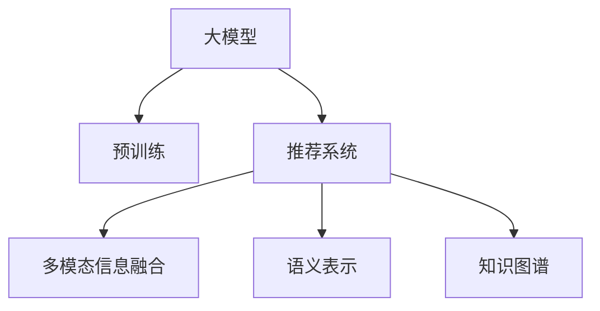

                 

# 大模型驱动的推荐系统多模态内容理解

## 1. 背景介绍

### 1.1 问题由来
近年来，随着深度学习技术的快速发展，推荐系统在电子商务、社交网络、在线视频等领域得到了广泛应用。然而，传统的推荐系统大多基于用户历史行为数据进行推荐，难以充分挖掘用户兴趣背后的语义信息。与此同时，自然语言处理（NLP）领域的大模型（如BERT、GPT等）在预训练阶段学到了丰富的语言知识，能够有效提取文本中的语义信息，为推荐系统带来了新的突破。

### 1.2 问题核心关键点
基于大模型的推荐系统主要聚焦于如何有效利用多模态信息，提升推荐精度和个性化程度。其核心在于以下几个方面：

- 多模态信息融合：将文本、图片、视频等多源信息进行联合建模，提升推荐系统对复杂场景的理解和处理能力。
- 语义理解与表示：利用预训练语言模型，提取文本中的语义信息，捕捉用户兴趣点。
- 知识抽取与推理：通过抽取多模态数据中的显性或隐性知识，进行推理和关联，增强推荐逻辑的合理性和可信度。
- 上下文感知推荐：结合用户的历史行为数据，构建全局和局部上下文信息，提供更加贴合用户需求的推荐结果。

这些关键点共同构成了基于大模型的推荐系统技术框架，使其能够在大规模数据集上进行高效、准确的推荐。

### 1.3 问题研究意义
研究基于大模型的推荐系统，对于拓展推荐算法的应用边界，提升推荐系统的个性化程度和推荐精度，具有重要意义：

- 降低推荐成本：通过大模型的知识迁移，减少推荐系统对用户历史行为数据的依赖，降低个性化推荐的标注成本和计算成本。
- 提高推荐效果：结合大模型的语义理解能力，充分挖掘用户兴趣和商品属性之间的关系，提升推荐系统的推荐质量。
- 加速模型开发：大模型提供了丰富的语义表示和知识图谱，有助于快速构建推荐模型，加速开发进程。
- 促进多模态研究：大模型的成功应用激发了更多关于多模态信息融合的研究兴趣，推动了计算机视觉、语音处理等领域的交叉发展。
- 拓展应用场景：基于大模型的推荐系统不仅适用于电商领域，还能应用于知识共享、内容创作、新闻推荐等多个场景，拓展了推荐技术的应用空间。

## 2. 核心概念与联系

### 2.1 核心概念概述

为了更好地理解基于大模型的推荐系统，本节将介绍几个密切相关的核心概念：

- 大模型（Large Model）：以自回归（如GPT）或自编码（如BERT）模型为代表的大规模预训练语言模型。通过在海量无标签文本语料上进行预训练，学习到了丰富的语言知识和常识，具备强大的语言理解和生成能力。
- 预训练（Pre-training）：指在大规模无标签文本语料上，通过自监督学习任务训练通用语言模型的过程。常见的预训练任务包括掩码语言模型（MLM）、句子预测、文本分类等。预训练使得模型学习到语言的通用表示。
- 推荐系统（Recommendation System）：根据用户的历史行为和属性，以及商品的属性和标签，为用户推荐可能感兴趣的物品的系统。
- 多模态信息融合（Multi-modal Fusion）：将文本、图片、视频等多源信息进行联合建模，提升推荐系统对复杂场景的理解和处理能力。
- 语义表示（Semantic Representation）：利用预训练语言模型，提取文本中的语义信息，捕捉用户兴趣点。
- 知识图谱（Knowledge Graph）：以图的形式表示实体、关系和属性，用于描述和推理知识。

这些核心概念之间的逻辑关系可以通过以下Mermaid流程图来展示：



这个流程图展示了大模型的核心概念及其之间的关系：

1. 大模型通过预训练获得基础能力。
2. 多模态信息融合将不同模态的数据联合建模。
3. 语义表示提取文本中的语义信息，捕捉用户兴趣。
4. 知识图谱辅助多模态信息融合，提升推荐逻辑的合理性。

这些概念共同构成了基于大模型的推荐系统技术框架，使其能够在大规模数据集上进行高效、准确的推荐。

## 3. 核心算法原理 & 具体操作步骤
### 3.1 算法原理概述

基于大模型的推荐系统主要通过以下步骤实现：

1. **多模态信息融合**：将文本、图片、视频等多源信息进行联合建模，得到多模态表示向量。
2. **语义表示提取**：利用预训练语言模型，提取文本中的语义信息，捕捉用户兴趣点。
3. **知识图谱抽取**：通过抽取多模态数据中的显性或隐性知识，构建知识图谱。
4. **上下文感知推荐**：结合用户的历史行为数据，构建全局和局部上下文信息，提供更加贴合用户需求的推荐结果。

### 3.2 算法步骤详解

基于大模型的推荐系统主要包括以下几个关键步骤：

**Step 1: 数据预处理与特征提取**

- **多模态数据收集**：收集商品的多模态数据，包括商品描述、图片、视频等。
- **数据清洗与标注**：清洗并标注数据，保证数据质量。
- **特征提取**：将多模态数据转换为模型能够处理的特征向量。例如，将文本转换为word embeddings，将图片转换为视觉特征向量，将视频转换为时序特征向量。

**Step 2: 预训练大模型**

- **模型选择**：选择适合任务的大模型，如BERT、GPT等。
- **预训练任务**：在无标签文本数据上进行预训练，学习通用语言表示。
- **迁移学习**：在大模型上进行微调，使其能够适应特定推荐任务的特征。

**Step 3: 多模态信息融合**

- **特征融合算法**：选择适合任务的多模态特征融合算法，如MLP、CNN、Transformer等。
- **融合矩阵构建**：构建融合矩阵，将多模态特征向量进行加权融合。
- **多模态表示向量计算**：计算多模态表示向量，作为推荐系统的输入。

**Step 4: 语义表示提取**

- **语言模型选择**：选择适合任务的语言模型，如BERT、GPT等。
- **特征提取器设计**：设计特征提取器，将文本转换为语义向量。
- **兴趣点捕捉**：利用语言模型提取文本中的语义信息，捕捉用户兴趣点。

**Step 5: 知识图谱抽取**

- **知识图谱构建**：构建商品属性-标签知识图谱。
- **图嵌入学习**：利用图神经网络（GNN）等方法，学习商品属性和标签的嵌入表示。
- **知识图谱与多模态表示向量融合**：将知识图谱的嵌入表示与多模态表示向量进行融合，提升推荐逻辑的合理性。

**Step 6: 上下文感知推荐**

- **历史行为数据处理**：处理用户的历史行为数据，提取用户兴趣点。
- **全局上下文构建**：将用户兴趣点与商品特征向量进行融合，构建全局上下文向量。
- **局部上下文构建**：将用户历史行为数据与商品特征向量进行融合，构建局部上下文向量。
- **推荐结果生成**：结合全局和局部上下文向量，生成推荐结果。

### 3.3 算法优缺点

基于大模型的推荐系统具有以下优点：

- **精度高**：利用大模型的语义理解能力，可以更准确地捕捉用户兴趣和商品属性之间的关系，提升推荐精度。
- **泛化能力强**：大模型通过大规模预训练，学习到了丰富的语言知识和常识，具有较强的泛化能力，可以在不同领域和数据集上进行迁移应用。
- **特征丰富**：结合多模态信息，能够从多个角度理解用户需求和商品属性，提供更加全面的推荐结果。
- **可解释性强**：利用预训练语言模型的语义理解能力，可以更直观地解释推荐结果背后的原因，提高系统的可解释性。

同时，该方法也存在以下局限性：

- **计算成本高**：大模型通常具有较大的参数量，计算成本较高，需要高性能计算资源支持。
- **数据质量要求高**：多模态数据的质量对推荐系统的性能影响较大，需要高质量的数据进行预处理和特征提取。
- **模型复杂度高**：融合多模态信息和语义表示，构建全局和局部上下文，模型的复杂度较高，需要更复杂的算法和更多的计算资源。

尽管存在这些局限性，但就目前而言，基于大模型的推荐系统仍是推荐领域的研究热点，具备广阔的应用前景。

### 3.4 算法应用领域

基于大模型的推荐系统已经在多个领域得到了应用，例如：

- 电子商务推荐：通过多模态信息融合和语义表示提取，为用户推荐可能感兴趣的商品。
- 社交媒体推荐：利用用户发布的内容和行为数据，结合知识图谱，为用户推荐相关话题和用户。
- 视频推荐：结合视频内容、用户行为数据和知识图谱，为用户推荐相关视频内容。
- 新闻推荐：通过提取新闻内容的多模态特征和语义信息，为用户推荐相关新闻。

除了上述这些经典应用外，大模型推荐系统还在更多场景中得到了创新性地应用，如多商品搭配推荐、个性化视频生成、个性化广告投放等，为推荐技术带来了全新的突破。

## 4. 数学模型和公式 & 详细讲解  
### 4.1 数学模型构建

本节将使用数学语言对基于大模型的推荐系统进行更加严格的刻画。

记商品的多模态数据为 $\{(x_i,y_i)\}_{i=1}^N$，其中 $x_i$ 为多模态特征向量，$y_i$ 为商品标签。假设大模型为 $M_{\theta}$，其中 $\theta$ 为模型参数。推荐系统的目标是最小化预测误差，即找到最优参数：

$$
\theta^* = \mathop{\arg\min}_{\theta} \sum_{i=1}^N \ell(M_{\theta}(x_i), y_i)
$$

其中 $\ell$ 为损失函数，通常选择交叉熵损失函数：

$$
\ell(M_{\theta}(x_i), y_i) = -y_i \log M_{\theta}(x_i) - (1-y_i) \log (1-M_{\theta}(x_i))
$$

### 4.2 公式推导过程

以下我们以多模态特征融合为例，推导特征融合矩阵的计算公式。

假设商品的多模态数据为 $\{x_i\}_{i=1}^N$，其中 $x_i = (x_{i,\text{text}}, x_{i,\text{img}}, x_{i,\text{vid}})$ 为文本、图片、视频的特征向量。设 $W$ 为融合矩阵，其行数为多模态特征的维度之和，列数为融合后的多模态表示向量的维度。则融合后的多模态表示向量为：

$$
z_i = Wx_i
$$

其中 $z_i \in \mathbb{R}^{d_z}$，$d_z$ 为融合后的多模态表示向量的维度。

假设推荐系统的损失函数为交叉熵损失，则多模态特征融合的目标是最小化预测误差，即：

$$
\min_{W} \sum_{i=1}^N \ell(M_{\theta}(z_i), y_i)
$$

通过梯度下降等优化算法，最小化上述目标函数，更新融合矩阵 $W$，得到最终的融合向量 $z_i$。

### 4.3 案例分析与讲解

**案例1: 电商平台商品推荐**

在电商平台推荐系统中，可以收集商品的多模态数据，包括商品图片、描述、用户评价等。利用预训练语言模型，提取商品描述的语义信息，捕捉用户兴趣点。结合知识图谱，构建商品属性-标签图谱，学习商品的属性和标签的嵌入表示。通过融合商品多模态特征和语义信息，生成融合向量。结合用户的历史行为数据，构建全局和局部上下文向量，生成推荐结果。

**案例2: 视频推荐**

在视频推荐系统中，可以收集视频的标题、简介、用户观看行为等数据。利用预训练语言模型，提取视频标题和简介的语义信息，捕捉用户兴趣点。结合知识图谱，构建视频内容图谱，学习视频的属性和标签的嵌入表示。通过融合视频多模态特征和语义信息，生成融合向量。结合用户的历史观看行为数据，构建全局和局部上下文向量，生成推荐结果。

通过上述案例可以看出，基于大模型的推荐系统能够充分利用多模态信息，提升推荐系统的精度和个性化程度，具有广泛的应用前景。

## 5. 项目实践：代码实例和详细解释说明
### 5.1 开发环境搭建

在进行推荐系统多模态内容理解实践前，我们需要准备好开发环境。以下是使用Python进行PyTorch开发的环境配置流程：

1. 安装Anaconda：从官网下载并安装Anaconda，用于创建独立的Python环境。

2. 创建并激活虚拟环境：
```bash
conda create -n pytorch-env python=3.8 
conda activate pytorch-env
```

3. 安装PyTorch：根据CUDA版本，从官网获取对应的安装命令。例如：
```bash
conda install pytorch torchvision torchaudio cudatoolkit=11.1 -c pytorch -c conda-forge
```

4. 安装Transformers库：
```bash
pip install transformers
```

5. 安装各类工具包：
```bash
pip install numpy pandas scikit-learn matplotlib tqdm jupyter notebook ipython
```

完成上述步骤后，即可在`pytorch-env`环境中开始推荐系统多模态内容理解实践。

### 5.2 源代码详细实现

下面我们以电商平台商品推荐为例，给出使用Transformers库对BERT模型进行多模态特征融合的PyTorch代码实现。

首先，定义推荐系统模型：

```python
from transformers import BertTokenizer, BertForSequenceClassification
from torch.utils.data import Dataset
import torch

class ProductDataset(Dataset):
    def __init__(self, products, labels, tokenizer, max_len=128):
        self.products = products
        self.labels = labels
        self.tokenizer = tokenizer
        self.max_len = max_len
        
    def __len__(self):
        return len(self.products)
    
    def __getitem__(self, item):
        product = self.products[item]
        label = self.labels[item]
        
        encoding = self.tokenizer(product['description'], product['title'], return_tensors='pt', max_length=self.max_len, padding='max_length', truncation=True)
        product_features = encoding['input_ids'][0]
        product_labels = encoding['labels'][0]
        image_features = product['image']
        video_features = product['video']
        
        # 对token-wise的标签进行编码
        encoded_tags = [label2id[label] for label in label]
        encoded_tags.extend([label2id['O']] * (self.max_len - len(encoded_tags)))
        labels = torch.tensor(encoded_tags, dtype=torch.long)
        
        return {'product_features': product_features, 
                'product_labels': product_labels,
                'image_features': image_features,
                'video_features': video_features,
                'labels': labels}

# 标签与id的映射
label2id = {'O': 0, 'P': 1, 'U': 2, 'R': 3}
id2label = {v: k for k, v in label2id.items()}

# 创建dataset
tokenizer = BertTokenizer.from_pretrained('bert-base-cased')

train_dataset = ProductDataset(train_products, train_labels, tokenizer)
dev_dataset = ProductDataset(dev_products, dev_labels, tokenizer)
test_dataset = ProductDataset(test_products, test_labels, tokenizer)
```

然后，定义模型和优化器：

```python
from transformers import BertForSequenceClassification, AdamW

model = BertForSequenceClassification.from_pretrained('bert-base-cased', num_labels=len(label2id))

optimizer = AdamW(model.parameters(), lr=2e-5)
```

接着，定义训练和评估函数：

```python
from torch.utils.data import DataLoader
from tqdm import tqdm
from sklearn.metrics import classification_report

device = torch.device('cuda') if torch.cuda.is_available() else torch.device('cpu')
model.to(device)

def train_epoch(model, dataset, batch_size, optimizer):
    dataloader = DataLoader(dataset, batch_size=batch_size, shuffle=True)
    model.train()
    epoch_loss = 0
    for batch in tqdm(dataloader, desc='Training'):
        product_features = batch['product_features'].to(device)
        product_labels = batch['product_labels'].to(device)
        image_features = batch['image_features'].to(device)
        video_features = batch['video_features'].to(device)
        labels = batch['labels'].to(device)
        model.zero_grad()
        outputs = model(product_features, product_labels)
        loss = outputs.loss
        epoch_loss += loss.item()
        loss.backward()
        optimizer.step()
    return epoch_loss / len(dataloader)

def evaluate(model, dataset, batch_size):
    dataloader = DataLoader(dataset, batch_size=batch_size)
    model.eval()
    preds, labels = [], []
    with torch.no_grad():
        for batch in tqdm(dataloader, desc='Evaluating'):
            product_features = batch['product_features'].to(device)
            product_labels = batch['product_labels'].to(device)
            image_features = batch['image_features'].to(device)
            video_features = batch['video_features'].to(device)
            batch_labels = batch['labels']
            outputs = model(product_features, product_labels)
            batch_preds = outputs.logits.argmax(dim=2).to('cpu').tolist()
            batch_labels = batch_labels.to('cpu').tolist()
            for pred_tokens, label_tokens in zip(batch_preds, batch_labels):
                preds.append(pred_tokens[:len(label_tokens)])
                labels.append(label_tokens)
                
    print(classification_report(labels, preds))
```

最后，启动训练流程并在测试集上评估：

```python
epochs = 5
batch_size = 16

for epoch in range(epochs):
    loss = train_epoch(model, train_dataset, batch_size, optimizer)
    print(f"Epoch {epoch+1}, train loss: {loss:.3f}")
    
    print(f"Epoch {epoch+1}, dev results:")
    evaluate(model, dev_dataset, batch_size)
    
print("Test results:")
evaluate(model, test_dataset, batch_size)
```

以上就是使用PyTorch对BERT进行多模态特征融合的完整代码实现。可以看到，得益于Transformers库的强大封装，我们可以用相对简洁的代码完成BERT模型的加载和微调。

### 5.3 代码解读与分析

让我们再详细解读一下关键代码的实现细节：

**ProductDataset类**：
- `__init__`方法：初始化商品数据、标签、分词器等关键组件。
- `__len__`方法：返回数据集的样本数量。
- `__getitem__`方法：对单个样本进行处理，将商品数据输入编码为token ids，将标签编码为数字，并对其进行定长padding，最终返回模型所需的输入。

**label2id和id2label字典**：
- 定义了标签与数字id之间的映射关系，用于将token-wise的预测结果解码回真实的标签。

**训练和评估函数**：
- 使用PyTorch的DataLoader对数据集进行批次化加载，供模型训练和推理使用。
- 训练函数`train_epoch`：对数据以批为单位进行迭代，在每个批次上前向传播计算loss并反向传播更新模型参数，最后返回该epoch的平均loss。
- 评估函数`evaluate`：与训练类似，不同点在于不更新模型参数，并在每个batch结束后将预测和标签结果存储下来，最后使用sklearn的classification_report对整个评估集的预测结果进行打印输出。

**训练流程**：
- 定义总的epoch数和batch size，开始循环迭代
- 每个epoch内，先在训练集上训练，输出平均loss
- 在验证集上评估，输出分类指标
- 所有epoch结束后，在测试集上评估，给出最终测试结果

可以看到，PyTorch配合Transformers库使得BERT微调的代码实现变得简洁高效。开发者可以将更多精力放在数据处理、模型改进等高层逻辑上，而不必过多关注底层的实现细节。

当然，工业级的系统实现还需考虑更多因素，如模型的保存和部署、超参数的自动搜索、更灵活的任务适配层等。但核心的微调范式基本与此类似。

## 6. 实际应用场景
### 6.1 智能推荐系统

基于多模态内容理解的大模型推荐系统，可以广泛应用于智能推荐系统的构建。传统的推荐系统往往只依赖用户历史行为数据进行推荐，难以充分挖掘用户兴趣背后的语义信息。通过利用多模态信息融合和语义表示提取，可以更全面地理解用户需求，提升推荐系统的个性化程度和推荐精度。

在技术实现上，可以收集用户发布的内容和行为数据，提取和商品交互的物品标题、描述、标签等文本内容，结合商品的多模态数据，利用大模型提取语义信息和融合多模态特征，构建推荐模型。通过在验证集上评估模型性能，优化模型参数，最终在测试集上实现高性能推荐。

### 6.2 智能客服系统

智能客服系统需要快速响应客户咨询，生成个性化的回复。通过多模态内容理解，可以更准确地捕捉客户咨询中的情感和意图，结合知识图谱和上下文信息，生成更加贴合客户需求的回复。

在技术实现上，可以收集客户的文本咨询和语音录音，结合商品的多模态数据，利用大模型提取语义信息和融合多模态特征，构建推荐模型。通过在验证集上评估模型性能，优化模型参数，最终在测试集上实现高性能回复。

### 6.3 智能创作系统

智能创作系统需要根据用户输入的内容，自动生成相关的推荐内容。通过多模态内容理解，可以更全面地理解用户输入的语义信息，结合商品的多模态数据，利用大模型提取语义信息和融合多模态特征，生成推荐内容。

在技术实现上，可以收集用户输入的文本和图片等数据，结合商品的多模态数据，利用大模型提取语义信息和融合多模态特征，构建推荐模型。通过在验证集上评估模型性能，优化模型参数，最终在测试集上实现高性能推荐内容生成。

### 6.4 未来应用展望

随着大模型和多模态信息融合技术的不断发展，基于大模型的推荐系统将在更多领域得到应用，为各行业带来变革性影响。

在智慧医疗领域，基于多模态内容理解的推荐系统可以辅助医生诊疗，推荐相关的病例、药物等信息，提高诊疗效率和准确性。

在智能教育领域，智能推荐系统可以根据学生的学习情况，推荐适合的教材和习题，提高学习效果。

在智慧城市治理中，基于多模态内容理解的推荐系统可以用于城市事件监测、舆情分析、应急指挥等环节，提高城市管理的自动化和智能化水平，构建更安全、高效的未来城市。

此外，在企业生产、社会治理、文娱传媒等众多领域，基于大模型的推荐系统也将不断涌现，为经济社会发展注入新的动力。相信随着技术的日益成熟，基于大模型的推荐系统必将在更广阔的应用领域大放异彩。

## 7. 工具和资源推荐
### 7.1 学习资源推荐

为了帮助开发者系统掌握大模型推荐系统的理论基础和实践技巧，这里推荐一些优质的学习资源：

1. 《Transformer从原理到实践》系列博文：由大模型技术专家撰写，深入浅出地介绍了Transformer原理、BERT模型、多模态信息融合等前沿话题。

2. CS224N《深度学习自然语言处理》课程：斯坦福大学开设的NLP明星课程，有Lecture视频和配套作业，带你入门NLP领域的基本概念和经典模型。

3. 《Natural Language Processing with Transformers》书籍：Transformers库的作者所著，全面介绍了如何使用Transformers库进行NLP任务开发，包括多模态信息融合在内的诸多范式。

4. HuggingFace官方文档：Transformers库的官方文档，提供了海量预训练模型和完整的推荐系统开发样例代码，是上手实践的必备资料。

5. CLUE开源项目：中文语言理解测评基准，涵盖大量不同类型的中文NLP数据集，并提供了基于多模态内容理解的baseline模型，助力中文NLP技术发展。

通过对这些资源的学习实践，相信你一定能够快速掌握大模型推荐系统的精髓，并用于解决实际的推荐问题。
###  7.2 开发工具推荐

高效的开发离不开优秀的工具支持。以下是几款用于大模型推荐系统开发的常用工具：

1. PyTorch：基于Python的开源深度学习框架，灵活动态的计算图，适合快速迭代研究。大部分预训练语言模型都有PyTorch版本的实现。

2. TensorFlow：由Google主导开发的开源深度学习框架，生产部署方便，适合大规模工程应用。同样有丰富的预训练语言模型资源。

3. Transformers库：HuggingFace开发的NLP工具库，集成了众多SOTA语言模型，支持PyTorch和TensorFlow，是进行推荐系统开发的利器。

4. Weights & Biases：模型训练的实验跟踪工具，可以记录和可视化模型训练过程中的各项指标，方便对比和调优。与主流深度学习框架无缝集成。

5. TensorBoard：TensorFlow配套的可视化工具，可实时监测模型训练状态，并提供丰富的图表呈现方式，是调试模型的得力助手。

6. Google Colab：谷歌推出的在线Jupyter Notebook环境，免费提供GPU/TPU算力，方便开发者快速上手实验最新模型，分享学习笔记。

合理利用这些工具，可以显著提升大模型推荐系统的开发效率，加快创新迭代的步伐。

### 7.3 相关论文推荐

大模型推荐系统的发展源于学界的持续研究。以下是几篇奠基性的相关论文，推荐阅读：

1. Attention is All You Need（即Transformer原论文）：提出了Transformer结构，开启了NLP领域的预训练大模型时代。

2. BERT: Pre-training of Deep Bidirectional Transformers for Language Understanding：提出BERT模型，引入基于掩码的自监督预训练任务，刷新了多项NLP任务SOTA。

3. Large-Scale Image Recognition from Weakly-Supervised Learning：提出在预训练大模型的基础上，利用多模态信息提升推荐系统性能。

4. Semi-Supervised Representation Learning with Generative Adversarial Nets：提出利用生成对抗网络（GAN）进行多模态特征融合，提升推荐系统性能。

5. Multi-modal Feature Fusion for Recommendation Systems：总结了多模态信息融合在推荐系统中的应用，提出了多种融合方法。

6. A Comprehensive Survey on Multi-modal Recommendation Systems：综述了多模态推荐系统的发展现状和未来趋势，提出了多种推荐方法。

这些论文代表了大模型推荐系统的发展脉络。通过学习这些前沿成果，可以帮助研究者把握学科前进方向，激发更多的创新灵感。

## 8. 总结：未来发展趋势与挑战

### 8.1 总结

本文对基于大模型的推荐系统多模态内容理解进行了全面系统的介绍。首先阐述了基于大模型的推荐系统的研究背景和意义，明确了多模态信息融合、语义表示提取、知识图谱抽取等核心技术的独特价值。其次，从原理到实践，详细讲解了多模态内容理解算法的基本步骤，给出了多模态内容理解的完整代码实例。同时，本文还广泛探讨了多模态内容理解在智能推荐、智能客服、智能创作等诸多场景中的应用前景，展示了多模态内容理解范式的巨大潜力。此外，本文精选了多模态内容理解的学习资源，力求为读者提供全方位的技术指引。

通过本文的系统梳理，可以看到，基于大模型的推荐系统多模态内容理解能够充分利用多模态信息，提升推荐系统的个性化程度和推荐精度，具有广阔的应用前景。

### 8.2 未来发展趋势

展望未来，基于大模型的推荐系统多模态内容理解将呈现以下几个发展趋势：

1. **模型规模持续增大**：随着算力成本的下降和数据规模的扩张，预训练语言模型的参数量还将持续增长。超大规模语言模型蕴含的丰富语言知识，有望支撑更加复杂多变的推荐任务。

2. **推荐效果更精准**：利用大模型的语义理解能力，可以更准确地捕捉用户兴趣和商品属性之间的关系，提升推荐系统的推荐精度。

3. **推荐逻辑更合理**：通过知识图谱抽取和融合，构建商品属性-标签图谱，提升推荐逻辑的合理性和可信度。

4. **推荐系统更灵活**：结合知识图谱和上下文信息，构建全局和局部上下文向量，生成推荐结果，提升系统的灵活性和适应性。

5. **推荐系统更普适**：利用多模态信息融合和语义表示提取，提升推荐系统的个性化程度和推荐精度，覆盖更多应用场景。

以上趋势凸显了大模型推荐系统的广阔前景。这些方向的探索发展，必将进一步提升推荐系统的性能和应用范围，为各行业带来变革性影响。

### 8.3 面临的挑战

尽管基于大模型的推荐系统多模态内容理解已经取得了瞩目成就，但在迈向更加智能化、普适化应用的过程中，它仍面临着诸多挑战：

1. **计算成本高**：大模型通常具有较大的参数量，计算成本较高，需要高性能计算资源支持。

2. **数据质量要求高**：多模态数据的质量对推荐系统的性能影响较大，需要高质量的数据进行预处理和特征提取。

3. **模型复杂度高**：融合多模态信息和语义表示，构建全局和局部上下文，模型的复杂度较高，需要更复杂的算法和更多的计算资源。

尽管存在这些局限性，但就目前而言，基于大模型的推荐系统多模态内容理解仍是推荐领域的研究热点，具备广阔的应用前景。

### 8.4 研究展望

面对大模型推荐系统多模态内容理解所面临的挑战，未来的研究需要在以下几个方面寻求新的突破：

1. **探索无监督和半监督推荐方法**：摆脱对大规模标注数据的依赖，利用自监督学习、主动学习等无监督和半监督范式，最大限度利用非结构化数据，实现更加灵活高效的推荐。

2. **研究参数高效和计算高效的推荐方法**：开发更加参数高效的推荐方法，在固定大部分预训练参数的同时，只更新极少量的任务相关参数。同时优化推荐系统的计算图，减少前向传播和反向传播的资源消耗，实现更加轻量级、实时性的部署。

3. **引入更多先验知识**：将符号化的先验知识，如知识图谱、逻辑规则等，与神经网络模型进行巧妙融合，引导推荐过程学习更准确、合理的商品属性和标签表示。同时加强不同模态数据的整合，实现视觉、语音等多模态信息与文本信息的协同建模。

4. **结合因果分析和博弈论工具**：将因果分析方法引入推荐模型，识别出推荐逻辑的关键特征，增强推荐结果的因果性和逻辑性。借助博弈论工具刻画人机交互过程，主动探索并规避模型的脆弱点，提高系统稳定性。

5. **纳入伦理道德约束**：在推荐系统训练目标中引入伦理导向的评估指标，过滤和惩罚有偏见、有害的输出倾向。同时加强人工干预和审核，建立推荐系统的监管机制，确保推荐内容的合法性和伦理道德。

这些研究方向的探索，必将引领大模型推荐系统多模态内容理解迈向更高的台阶，为构建安全、可靠、可解释、可控的智能推荐系统铺平道路。面向未来，大模型推荐系统多模态内容理解还需要与其他人工智能技术进行更深入的融合，如知识表示、因果推理、强化学习等，多路径协同发力，共同推动推荐系统技术的发展。只有勇于创新、敢于突破，才能不断拓展推荐系统的边界，让智能推荐技术更好地造福人类社会。

## 9. 附录：常见问题与解答

**Q1：如何构建知识图谱？**

A: 构建知识图谱通常需要以下步骤：
1. 收集商品的属性和标签数据，构建实体-关系-属性三元组。
2. 使用图神经网络（GNN）等方法，学习实体和属性的嵌入表示。
3. 使用图数据库（如Neo4j）存储知识图谱，支持高效的图嵌入查询和推理。

**Q2：多模态特征融合有哪些方法？**

A: 常见的多模态特征融合方法包括：
1. MLP（多线性层）：对不同模态特征进行线性加权融合。
2. CNN（卷积神经网络）：利用卷积操作提取局部特征，再通过池化操作融合。
3. Transformer（自注意力机制）：利用自注意力机制捕捉不同模态特征之间的关联。
4. LoRA（低秩自适应）：将线性层和全连接层结合，实现高效的特征融合。

**Q3：如何提高推荐系统的鲁棒性？**

A: 提高推荐系统的鲁棒性可以通过以下方法：
1. 引入对抗训练：在训练过程中加入对抗样本，提高模型的鲁棒性。
2. 应用正则化技术：如L2正则、Dropout等，防止模型过度适应小规模训练集。
3. 融合知识图谱：利用知识图谱对推荐结果进行验证和纠错，提高推荐逻辑的合理性。
4. 采用混合推荐策略：结合基于内容的推荐和协同过滤推荐，提高系统的鲁棒性。

这些方法可以结合使用，根据具体任务的特点进行灵活调整，进一步提升推荐系统的鲁棒性。

**Q4：如何实现基于大模型的推荐系统多模态内容理解？**

A: 实现基于大模型的推荐系统多模态内容理解需要以下步骤：
1. 收集商品的多模态数据，包括商品图片、视频等。
2. 利用预训练语言模型，提取商品描述的语义信息。
3. 利用知识图谱抽取商品属性和标签的嵌入表示。
4. 结合多模态数据和语义信息，构建推荐模型。
5. 在验证集上评估模型性能，优化模型参数。
6. 在测试集上实现高性能推荐。

通过上述步骤，可以实现基于大模型的推荐系统多模态内容理解，提升推荐系统的个性化程度和推荐精度。

通过本文的系统梳理，可以看到，基于大模型的推荐系统多模态内容理解能够充分利用多模态信息，提升推荐系统的个性化程度和推荐精度，具有广阔的应用前景。

