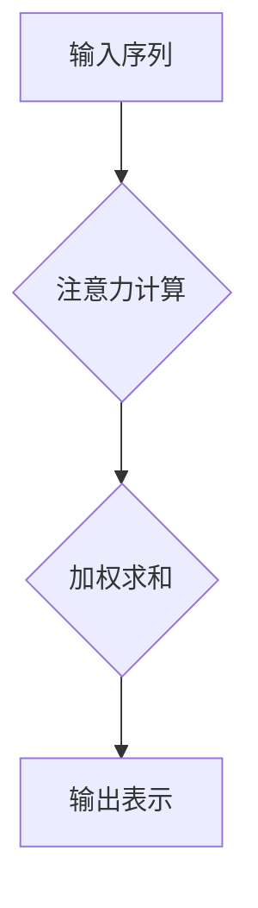

                 

## 注意力污染：元宇宙时代的新型环境问题

> 关键词：元宇宙、注意力、污染、深度学习、神经网络、认知科学、环境问题

## 1. 背景介绍

元宇宙概念近年来备受关注，其沉浸式、交互式的体验模式被认为将深刻改变人类生活方式。然而，元宇宙的构建也面临着诸多挑战，其中之一便是“注意力污染”。

注意力，是认知能力的核心，它指我们对特定信息或刺激的集中和选择性关注。在现实世界中，我们面临着来自各种来源的注意力竞争，例如社交媒体、广告、噪音等。这些竞争会分散我们的注意力，降低我们的工作效率和生活质量。

元宇宙作为虚拟现实和增强现实技术的融合，将进一步加剧注意力竞争。其高度沉浸式的体验模式和丰富的交互内容，可能会让人们沉迷其中，难以抽离。同时，元宇宙平台上也会涌现出各种商业化内容，例如广告、游戏等，这些内容会通过各种方式吸引用户的注意力，导致注意力污染问题更加严重。

## 2. 核心概念与联系

### 2.1 注意力机制

注意力机制是深度学习领域的重要发展方向，它能够帮助模型更好地理解和处理复杂的信息。注意力机制的核心思想是，在处理信息时，模型应该关注那些与当前任务最相关的部分，而忽略那些无关的部分。

**注意力机制的原理:**

1. **计算注意力权重:** 模型会对输入序列中的每个元素计算一个注意力权重，权重代表了该元素对当前任务的 relevance。
2. **加权求和:** 模型会根据注意力权重对输入序列进行加权求和，得到一个新的表示，该表示包含了输入序列中与当前任务最相关的部分。

**注意力机制的架构:**



### 2.2 元宇宙环境与注意力污染

元宇宙环境的特点，例如沉浸式体验、交互式内容、信息丰富等，会加剧注意力污染问题。

* **沉浸式体验:** 元宇宙的沉浸式体验会让人们更容易地沉迷其中，难以抽离。
* **交互式内容:** 元宇宙平台上的交互式内容会不断吸引用户的注意力，导致注意力分散。
* **信息丰富:** 元宇宙平台上信息丰富多样，用户需要不断地筛选和选择信息，这会增加注意力负担。

## 3. 核心算法原理 & 具体操作步骤

### 3.1 算法原理概述

注意力机制的算法原理是通过计算注意力权重，将输入序列中的相关信息加权求和，得到一个新的表示。

### 3.2 算法步骤详解

1. **输入序列编码:** 将输入序列中的每个元素编码成向量表示。
2. **计算注意力权重:** 使用注意力函数计算每个元素的注意力权重。
3. **加权求和:** 根据注意力权重对编码后的输入序列进行加权求和，得到一个新的表示。
4. **输出:** 将新的表示作为模型的输出。

### 3.3 算法优缺点

**优点:**

* 可以有效地提高模型的性能，尤其是在处理长序列数据时。
* 可以帮助模型更好地理解和处理复杂的信息。

**缺点:**

* 计算复杂度较高。
* 需要大量的训练数据。

### 3.4 算法应用领域

注意力机制在自然语言处理、计算机视觉、语音识别等领域都有广泛的应用。

## 4. 数学模型和公式 & 详细讲解 & 举例说明

### 4.1 数学模型构建

注意力机制的数学模型可以表示为以下公式：

$$
\text{Attention}(Q, K, V) = \text{softmax}\left(\frac{Q K^T}{\sqrt{d_k}}\right) V
$$

其中：

* $Q$：查询矩阵
* $K$：键矩阵
* $V$：值矩阵
* $d_k$：键向量的维度
* $\text{softmax}$：softmax函数

### 4.2 公式推导过程

注意力机制的公式推导过程可以分为以下几个步骤：

1. 计算查询向量 $Q$ 和键向量 $K$ 的点积。
2. 对点积结果进行归一化，得到注意力权重。
3. 使用注意力权重对值向量 $V$ 进行加权求和，得到最终的输出。

### 4.3 案例分析与讲解

假设我们有一个句子 "The cat sat on the mat"，我们想要计算每个词语对句子整体的注意力权重。

1. 将每个词语编码成向量表示，得到 $Q$、$K$ 和 $V$ 三个矩阵。
2. 计算 $Q$ 和 $K$ 的点积，得到一个注意力权重矩阵。
3. 对注意力权重矩阵进行 softmax 操作，得到每个词语的注意力权重。
4. 使用注意力权重对 $V$ 进行加权求和，得到句子整体的表示。

## 5. 项目实践：代码实例和详细解释说明

### 5.1 开发环境搭建

* Python 3.7+
* TensorFlow 2.0+
* PyTorch 1.0+

### 5.2 源代码详细实现

```python
import tensorflow as tf

# 定义注意力机制
def attention_mechanism(query, key, value, mask=None):
    # 计算注意力权重
    scores = tf.matmul(query, key, transpose_b=True) / tf.math.sqrt(tf.cast(key.shape[-1], tf.float32))
    if mask is not None:
        scores += (1 - mask) * -1e9
    attention_weights = tf.nn.softmax(scores, axis=-1)
    # 加权求和
    context_vector = tf.matmul(attention_weights, value)
    return context_vector, attention_weights

# 示例代码
query = tf.random.normal([32, 10, 64])
key = tf.random.normal([32, 10, 64])
value = tf.random.normal([32, 10, 128])

context_vector, attention_weights = attention_mechanism(query, key, value)
print(context_vector.shape)
print(attention_weights.shape)
```

### 5.3 代码解读与分析

* `attention_mechanism` 函数实现了注意力机制的核心逻辑。
* `scores` 计算了查询向量和键向量的点积，并进行归一化。
* `attention_weights` 使用 softmax 函数将点积结果转换为注意力权重。
* `context_vector` 使用注意力权重对值向量进行加权求和，得到最终的输出。

### 5.4 运行结果展示

运行上述代码，会输出 `context_vector` 和 `attention_weights` 的形状。

## 6. 实际应用场景

### 6.1 元宇宙环境中的注意力污染

* **虚拟社交平台:** 元宇宙中的虚拟社交平台会通过各种方式吸引用户的注意力，例如推送消息、游戏化设计等。
* **虚拟购物平台:** 元宇宙中的虚拟购物平台会通过广告、促销活动等方式吸引用户的注意力。
* **虚拟教育平台:** 元宇宙中的虚拟教育平台会通过互动游戏、虚拟现实体验等方式吸引用户的注意力。

### 6.2 缓解注意力污染的解决方案

* **个性化注意力控制:** 开发个性化注意力控制机制，允许用户根据自己的需求调整注意力分配。
* **注意力提醒机制:** 开发注意力提醒机制，提醒用户过度使用元宇宙平台，并引导用户进行休息和放松。
* **内容质量监管:** 加强元宇宙平台内容质量监管，减少低质量、吸引注意力的内容。

### 6.4 未来应用展望

注意力机制在元宇宙领域具有广阔的应用前景，例如：

* **沉浸式体验增强:** 利用注意力机制，可以更好地理解用户的注意力模式，从而提供更沉浸式的体验。
* **个性化内容推荐:** 利用注意力机制，可以根据用户的注意力偏好，推荐更个性化的内容。
* **虚拟现实辅助学习:** 利用注意力机制，可以帮助用户更好地集中注意力，提高学习效率。

## 7. 工具和资源推荐

### 7.1 学习资源推荐

* **书籍:**
    * 《深度学习》
    * 《Attention Is All You Need》
* **在线课程:**
    * Coursera: Deep Learning Specialization
    * Udacity: Deep Learning Nanodegree

### 7.2 开发工具推荐

* **TensorFlow:** 开源深度学习框架
* **PyTorch:** 开源深度学习框架
* **Hugging Face Transformers:** 预训练模型库

### 7.3 相关论文推荐

* 《Attention Is All You Need》
* 《BERT: Pre-training of Deep Bidirectional Transformers for Language Understanding》
* 《GPT-3: Language Models are Few-Shot Learners》

## 8. 总结：未来发展趋势与挑战

### 8.1 研究成果总结

注意力机制在元宇宙领域具有重要的应用价值，可以帮助缓解注意力污染问题，提升用户体验。

### 8.2 未来发展趋势

* **更有效的注意力机制:** 研究更有效的注意力机制，例如自注意力机制、多头注意力机制等。
* **注意力机制的个性化定制:** 研究个性化注意力控制机制，允许用户根据自己的需求调整注意力分配。
* **注意力机制与其他技术的融合:** 将注意力机制与其他技术融合，例如强化学习、生成对抗网络等，开发更智能的元宇宙应用。

### 8.3 面临的挑战

* **计算复杂度:** 现有的注意力机制计算复杂度较高，需要更高效的算法和硬件支持。
* **数据需求:** 训练有效的注意力机制需要大量的训练数据。
* **伦理问题:** 注意力机制的应用可能会引发一些伦理问题，例如数据隐私、信息操控等。

### 8.4 研究展望

未来，注意力机制将在元宇宙领域继续发挥重要作用，并推动元宇宙技术的进一步发展。


## 9. 附录：常见问题与解答

### 9.1 什么是注意力机制？

注意力机制是一种机器学习技术，它能够帮助模型更好地理解和处理复杂的信息。注意力机制的核心思想是，在处理信息时，模型应该关注那些与当前任务最相关的部分，而忽略那些无关的部分。

### 9.2 注意力机制的应用场景有哪些？

注意力机制在自然语言处理、计算机视觉、语音识别等领域都有广泛的应用。

### 9.3 如何缓解元宇宙环境中的注意力污染？

可以通过以下方式缓解元宇宙环境中的注意力污染：

* 开发个性化注意力控制机制
* 开发注意力提醒机制
* 加强元宇宙平台内容质量监管

作者：禅与计算机程序设计艺术 / Zen and the Art of Computer Programming 


<end_of_turn>

