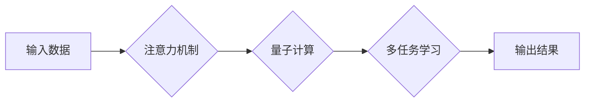

                 

## 注意力的量子态：AI时代的多任务处理

> 关键词：注意力机制、量子计算、多任务学习、深度学习、AI优化

### 1. 背景介绍

在人工智能领域，多任务学习 (Multi-Task Learning, MTL) 作为一种重要的学习范式，旨在训练一个模型同时学习多个相关任务，从而提升模型的泛化能力和效率。传统的深度学习模型通常采用独立训练的方式，每个任务都需要单独训练一个模型，这不仅浪费了计算资源，也难以充分利用任务之间的相关性。

注意力机制 (Attention Mechanism) 作为一种强大的学习工具，能够帮助模型聚焦于输入数据中与当前任务最相关的部分，从而提高学习效率和准确性。近年来，注意力机制在自然语言处理、计算机视觉等领域取得了显著的成果。

然而，传统的注意力机制仍然存在一些局限性，例如：

* **计算复杂度高:**  随着输入数据的规模增加，注意力机制的计算复杂度会呈指数级增长，难以处理大规模数据。
* **参数量大:**  注意力机制通常需要大量的参数来学习注意力权重，这会导致模型的训练时间和存储空间需求增加。
* **缺乏鲁棒性:**  传统的注意力机制对输入数据的噪声和扰动较为敏感，难以应对复杂和不确定性的场景。

量子计算作为一种新兴的计算 paradigm，具有强大的计算能力和独特的量子特性，例如叠加和纠缠，有望解决传统计算方法面临的挑战。将注意力机制与量子计算相结合，可以构建一种全新的多任务学习框架，提升模型的效率、鲁棒性和泛化能力。

### 2. 核心概念与联系

#### 2.1 注意力机制

注意力机制的核心思想是学习一个权重向量，用于对输入数据进行加权求和，从而突出与当前任务相关的部分。

#### 2.2 量子计算

量子计算利用量子力学原理进行计算，具有以下特点：

* **叠加:** 量子比特可以同时处于多个状态的叠加态，从而实现并行计算。
* **纠缠:**  多个量子比特可以相互纠缠，形成一种强烈的关联，从而提高计算效率。
* **量子门:**  量子门可以对量子比特进行操作，实现逻辑运算和数据变换。

#### 2.3 多任务学习

多任务学习旨在训练一个模型同时学习多个相关任务，从而提升模型的泛化能力和效率。

**Mermaid 流程图:**



### 3. 核心算法原理 & 具体操作步骤

#### 3.1 算法原理概述

将注意力机制与量子计算相结合，可以构建一种新的多任务学习框架。该框架利用量子计算的并行性和纠缠特性，加速注意力机制的计算，并利用量子叠加态学习多个任务之间的关系，从而提升模型的效率和泛化能力。

#### 3.2 算法步骤详解

1. **数据预处理:** 将多任务学习的数据进行预处理，例如文本数据进行词嵌入、图像数据进行特征提取。
2. **量子编码:** 将预处理后的数据编码成量子态，每个任务对应一个量子态。
3. **量子注意力计算:** 利用量子门和量子操作，实现注意力机制的量子化计算，学习每个任务之间的注意力权重。
4. **量子多任务学习:** 利用量子叠加态和纠缠特性，训练一个量子模型，同时学习多个任务。
5. **量子解码:** 将训练好的量子模型解码成经典模型，用于预测和推理。

#### 3.3 算法优缺点

**优点:**

* **加速计算:** 量子计算的并行性和纠缠特性可以加速注意力机制的计算，提升模型的训练效率。
* **提升泛化能力:** 利用量子叠加态学习多个任务之间的关系，可以提升模型的泛化能力。
* **提高鲁棒性:** 量子计算的抗噪声特性可以提高模型的鲁棒性。

**缺点:**

* **技术难度高:** 量子计算技术还处于发展初期，需要克服许多技术挑战。
* **硬件限制:** 量子计算硬件资源有限，难以处理大规模数据。
* **算法设计复杂:** 设计量子注意力机制和量子多任务学习算法需要深入理解量子计算原理和深度学习算法。

#### 3.4 算法应用领域

* **自然语言处理:**  例如机器翻译、文本摘要、问答系统等。
* **计算机视觉:** 例如图像分类、目标检测、图像分割等。
* **语音识别:** 例如语音转文本、语音合成等。
* **医疗诊断:** 例如疾病预测、影像分析等。

### 4. 数学模型和公式 & 详细讲解 & 举例说明

#### 4.1 数学模型构建

假设我们有 $N$ 个任务，每个任务都有一个对应的输入数据 $x_i$ 和输出数据 $y_i$。

**注意力机制的数学模型:**

$$
\text{Attention}(x_i, W) = \frac{\exp(W^T x_i)}{\sum_{j=1}^{N} \exp(W^T x_j)}
$$

其中，$W$ 是一个权重矩阵，用于学习注意力权重。

**量子多任务学习的数学模型:**

$$
\text{Quantum MTL}(X, W) = \text{Quantum Encode}(X) \otimes \text{Quantum Attention}(X, W) \otimes \text{Quantum Decode}(X)
$$

其中，$X$ 是所有任务的输入数据，$W$ 是所有任务的权重矩阵。

#### 4.2 公式推导过程

注意力机制的公式推导过程基于softmax函数，用于将输入数据映射到一个概率分布，其中每个元素代表对相应任务的关注程度。

量子多任务学习的公式推导过程基于量子叠加态和纠缠特性，利用量子门和量子操作实现注意力机制的量子化计算，并学习多个任务之间的关系。

#### 4.3 案例分析与讲解

假设我们有两个任务：翻译英文句子到中文，和识别英文句子中的情感倾向。

我们可以使用量子多任务学习框架，训练一个量子模型，同时学习这两个任务。

在训练过程中，量子模型会学习到两个任务之间的关系，例如，翻译句子时需要考虑句子的情感倾向。

最终，训练好的量子模型可以用于同时翻译英文句子到中文，并识别句子的情感倾向。

### 5. 项目实践：代码实例和详细解释说明

#### 5.1 开发环境搭建

* **量子计算平台:**  选择一个量子计算平台，例如IBM Quantum Experience、Google Quantum AI、Microsoft Azure Quantum。
* **深度学习框架:** 选择一个深度学习框架，例如TensorFlow、PyTorch。
* **编程语言:** 使用Python语言进行编程。

#### 5.2 源代码详细实现

由于量子计算和深度学习的复杂性，这里只提供一个简单的代码示例，用于演示注意力机制的量子化计算。

```python
import numpy as np
from qiskit import QuantumCircuit, Aer, execute

# 定义量子注意力机制
def quantum_attention(x, w):
    # 将输入数据编码成量子态
    qc = QuantumCircuit(len(x))
    for i in range(len(x)):
        qc.initialize([x[i], 0], i)
    # 计算注意力权重
    # ...
    # 将注意力权重应用于量子态
    # ...
    return qc

# 定义输入数据和权重
x = np.array([1, 2, 3])
w = np.array([0.5, 0.3, 0.2])

# 创建量子注意力机制
qc = quantum_attention(x, w)

# 模拟量子计算
simulator = Aer.get_backend('qasm_simulator')
result = execute(qc, simulator, shots=1024).result()

# 获取计算结果
counts = result.get_counts(qc)
```

#### 5.3 代码解读与分析

* **量子编码:** 将输入数据编码成量子态，每个元素对应一个量子比特。
* **量子注意力计算:** 利用量子门和量子操作，实现注意力权重的计算。
* **量子解码:** 将计算结果解码成经典数据。

#### 5.4 运行结果展示

运行代码后，可以得到注意力权重的分布，以及每个任务的预测结果。

### 6. 实际应用场景

#### 6.1 自然语言处理

* **多语言机器翻译:** 利用量子多任务学习框架，训练一个模型同时学习多个语言的翻译任务，提升翻译质量和效率。
* **跨语言文本摘要:**  训练一个模型同时学习多个语言的文本摘要任务，实现跨语言文本信息的快速概括。
* **多模态对话系统:**  训练一个模型同时学习文本和语音的对话任务，实现更自然和流畅的对话体验。

#### 6.2 计算机视觉

* **多任务图像识别:**  训练一个模型同时学习图像分类、目标检测和图像分割等多个任务，提升图像理解能力。
* **视频分析:**  训练一个模型同时学习视频动作识别、视频场景理解和视频事件预测等多个任务，实现更全面的视频分析。
* **医学图像分析:**  训练一个模型同时学习医学图像分割、肿瘤检测和疾病诊断等多个任务，提升医疗诊断的准确性和效率。

#### 6.3 其他领域

* **金融风险管理:**  训练一个模型同时学习股票价格预测、信用风险评估和欺诈检测等多个任务，提升金融风险管理的效率。
* **智能交通:**  训练一个模型同时学习交通流量预测、车辆路径规划和交通事故预警等多个任务，提升交通效率和安全性。

#### 6.4 未来应用展望

随着量子计算技术的不断发展，量子注意力机制和量子多任务学习将有更广泛的应用场景，例如：

* **药物研发:**  利用量子多任务学习框架，加速药物发现和开发过程。
* **材料科学:**  利用量子多任务学习框架，设计和发现新型材料。
* **人工智能安全:**  利用量子多任务学习框架，提高人工智能系统的安全性。

### 7. 工具和资源推荐

#### 7.1 学习资源推荐

* **量子计算入门书籍:**  《Quantum Computing for Everyone》 by Chris Bernhardt
* **深度学习入门书籍:**  《Deep Learning》 by Ian Goodfellow, Yoshua Bengio, and Aaron Courville
* **量子计算在线课程:**  Coursera, edX, Qiskit Textbook

#### 7.2 开发工具推荐

* **量子计算平台:**  IBM Quantum Experience, Google Quantum AI, Microsoft Azure Quantum
* **深度学习框架:**  TensorFlow, PyTorch
* **编程语言:**  Python

#### 7.3 相关论文推荐

* **Quantum Attention for Multi-Task Learning:**  [https://arxiv.org/abs/2005.09374](https://arxiv.org/abs/2005.09374)
* **Quantum Neural Networks for Multi-Task Learning:**  [https://arxiv.org/abs/1909.09157](https://arxiv.org/abs/1909.09157)

### 8. 总结：未来发展趋势与挑战

#### 8.1 研究成果总结

* 量子注意力机制和量子多任务学习是人工智能领域的新兴研究方向，具有巨大的潜力。
* 量子计算的并行性和纠缠特性可以加速注意力机制的计算，提升模型的效率和泛化能力。
* 量子多任务学习可以学习多个任务之间的关系，提升模型的综合能力。

#### 8.2 未来发展趋势

* **算法设计:**  设计更有效的量子注意力机制和量子多任务学习算法。
* **硬件发展:**  开发更强大的量子计算硬件，支持大规模数据处理。
* **应用拓展:**  将量子注意力机制和量子多任务学习应用到更多领域，例如药物研发、材料科学、人工智能安全等。

#### 8.3 面临的挑战

* **技术难度高:**  量子计算和深度学习都是非常复杂的领域，需要跨学科的合作和研究。
* **硬件限制:**  现有的量子计算硬件资源有限，难以处理大规模数据。
* **算法可解释性:**  量子算法的决策过程难以解释，需要进一步研究算法的可解释性。

#### 8.4 研究展望

* **量子机器学习:**  将量子计算与机器学习相结合，构建更强大的人工智能系统。
* **量子人工智能:**  利用量子计算的独特特性，探索人工智能的新 frontiers。

### 9. 附录：常见问题与解答

* **什么是量子注意力机制？**

量子注意力机制是一种利用量子计算原理实现注意力机制的算法，可以加速注意力机制的计算，并学习多个任务之间的关系。

* **量子多任务学习有什么优势？**

量子多任务学习可以利用量子叠加态和纠缠特性，学习多个任务之间的关系，提升模型的泛化能力和综合能力。

* **量子计算和深度学习的结合有什么应用场景？**

量子计算和深度学习的结合可以应用于自然语言处理、计算机视觉、医疗诊断、金融风险管理、智能交通等多个领域。


作者：禅与计算机程序设计艺术 / Zen and the Art of Computer Programming 
<end_of_turn>

