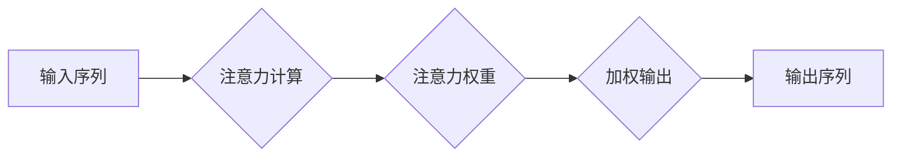

                 

## 1. 背景介绍

在当今信息爆炸的时代，我们面临着前所未有的信息量和认知压力。如何有效地管理注意力，提高专注力，成为了提升个人效率和应对挑战的关键。注意力，作为人类认知的核心能力之一，直接影响着我们的学习、工作、生活和创造力。然而，现代社会的多样化刺激和碎片化信息流，不断侵蚀着我们的注意力，导致专注力下降、思绪混乱、效率低下等问题。

## 2. 核心概念与联系

### 2.1 注意力机制

注意力机制是人工智能领域近年来发展迅速的热点方向，其核心思想是模拟人类大脑对重要信息进行筛选和聚焦的过程。在深度学习模型中，注意力机制被广泛应用于自然语言处理、计算机视觉、机器翻译等领域，显著提升了模型的性能。

**注意力机制的原理：**

注意力机制的核心是学习一个“注意力权重”，用于衡量模型对不同输入元素的关注程度。这些权重通过复杂的计算过程得到，并用于调整模型对不同元素的处理方式。

**注意力机制的架构：**



### 2.2 大脑训练与注意力

大脑训练是指通过特定的练习和训练方法，增强大脑的认知功能，包括注意力、记忆、执行功能等。

**大脑训练与注意力机制的联系：**

大脑训练的目标是增强大脑的注意力能力，而注意力机制正是模拟人类大脑注意力机制的算法。通过学习和理解注意力机制，我们可以更好地了解大脑的注意力机制，并设计更有效的注意力训练方法。

## 3. 核心算法原理 & 具体操作步骤

### 3.1 算法原理概述

**自注意力机制 (Self-Attention)**

自注意力机制是一种强大的注意力机制，它允许模型关注输入序列中的任意元素，并计算它们之间的相关性。

**核心思想：**

* 将输入序列中的每个元素视为一个“查询”（query），并将其与所有其他元素进行比较。
* 计算每个元素之间的“键值对”（key-value pair），用于表示元素之间的相关性。
* 通过“注意力权重”（attention weight）来衡量每个元素对其他元素的关注程度。
* 将加权后的键值对进行聚合，得到最终的输出。

### 3.2 算法步骤详解

1. **嵌入输入序列：** 将输入序列中的每个元素转换为向量表示，称为嵌入向量。
2. **计算查询、键值对：** 对每个嵌入向量进行线性变换，得到查询向量、键向量和值向量。
3. **计算注意力权重：** 计算查询向量与所有键向量的点积，并通过softmax函数将其归一化，得到注意力权重。
4. **加权求和：** 将注意力权重与值向量进行加权求和，得到最终的输出向量。

### 3.3 算法优缺点

**优点：**

* 可以捕捉长距离依赖关系。
* 可以处理任意长度的输入序列。
* 在许多自然语言处理任务中取得了优异的性能。

**缺点：**

* 计算复杂度较高。
* 训练时间较长。

### 3.4 算法应用领域

* 自然语言处理：机器翻译、文本摘要、问答系统等。
* 计算机视觉：图像识别、目标检测、图像 Captioning 等。
* 其他领域：语音识别、时间序列分析等。

## 4. 数学模型和公式 & 详细讲解 & 举例说明

### 4.1 数学模型构建

**自注意力机制的数学模型：**

给定一个输入序列 $X = \{x_1, x_2, ..., x_n\}$，其中 $x_i$ 是第 $i$ 个元素。

* **嵌入向量：** 将每个元素 $x_i$ 嵌入为向量 $e_i$。
* **查询、键值对：** 对每个嵌入向量 $e_i$ 进行线性变换，得到查询向量 $q_i$、键向量 $k_i$ 和值向量 $v_i$。

$$
q_i = W_q e_i
$$

$$
k_i = W_k e_i
$$

$$
v_i = W_v e_i
$$

其中 $W_q$、$W_k$ 和 $W_v$ 是可训练的权重矩阵。

* **注意力权重：** 计算查询向量 $q_i$ 与所有键向量 $k_j$ 的点积，并通过softmax函数将其归一化，得到注意力权重 $a_{ij}$。

$$
a_{ij} = \frac{\exp(q_i \cdot k_j)}{\sum_{l=1}^{n} \exp(q_i \cdot k_l)}
$$

* **加权求和：** 将注意力权重 $a_{ij}$ 与值向量 $v_j$ 进行加权求和，得到最终的输出向量 $o_i$。

$$
o_i = \sum_{j=1}^{n} a_{ij} v_j
$$

### 4.2 公式推导过程

注意力权重 $a_{ij}$ 的计算过程可以理解为计算查询向量 $q_i$ 与所有键向量 $k_j$ 的相似度，并将其归一化。

点积操作 $q_i \cdot k_j$ 表示两个向量的内积，可以衡量它们之间的相似度。

softmax函数将点积结果转换为概率分布，使得注意力权重 $a_{ij}$ 的值介于 0 和 1 之间，且所有权重之和为 1。

### 4.3 案例分析与讲解

**机器翻译：**

在机器翻译任务中，自注意力机制可以帮助模型捕捉源语言和目标语言之间的语义关系。例如，在翻译句子 "The cat sat on the mat" 时，自注意力机制可以帮助模型理解 "cat" 和 "sat" 之间的动宾关系，以及 "mat" 和 "on" 之间的方位关系。

## 5. 项目实践：代码实例和详细解释说明

### 5.1 开发环境搭建

* Python 3.6+
* TensorFlow 或 PyTorch

### 5.2 源代码详细实现

```python
import tensorflow as tf

# 定义自注意力机制
def self_attention(query, key, value, mask=None):
    # 计算注意力权重
    attention_weights = tf.matmul(query, key, transpose_b=True)
    if mask is not None:
        attention_weights += (mask * -1e9)
    attention_weights = tf.nn.softmax(attention_weights, axis=-1)
    # 加权求和
    output = tf.matmul(attention_weights, value)
    return output

# 示例代码
# 输入序列
input_sequence = tf.constant([[1, 2, 3], [4, 5, 6], [7, 8, 9]])
# 查询、键值对
query = tf.Variable(input_sequence)
key = tf.Variable(input_sequence)
value = tf.Variable(input_sequence)
# 计算自注意力输出
output = self_attention(query, key, value)
# 打印输出
print(output)
```

### 5.3 代码解读与分析

* `self_attention` 函数实现了一个基本的自注意力机制。
* `attention_weights` 计算了查询向量与所有键向量的相似度。
* `mask` 用于屏蔽不需要关注的元素，例如在机器翻译中，可以屏蔽源语言中已经翻译过的部分。
* `softmax` 函数将相似度转换为概率分布。
* `output` 是加权求和后的最终输出向量。

### 5.4 运行结果展示

运行上述代码，会输出一个与输入序列形状相同的张量，表示自注意力机制的输出。

## 6. 实际应用场景

### 6.1 自然语言处理

* **机器翻译:** 自注意力机制可以帮助模型捕捉源语言和目标语言之间的语义关系，提高翻译质量。
* **文本摘要:** 自注意力机制可以帮助模型识别文本中最关键的信息，生成简洁准确的摘要。
* **问答系统:** 自注意力机制可以帮助模型理解问题和上下文，给出更准确的答案。

### 6.2 计算机视觉

* **图像识别:** 自注意力机制可以帮助模型关注图像中最重要的区域，提高识别准确率。
* **目标检测:** 自注意力机制可以帮助模型定位图像中的目标，并识别目标类别。
* **图像 Captioning:** 自注意力机制可以帮助模型生成图像的描述性文字。

### 6.3 其他领域

* **语音识别:** 自注意力机制可以帮助模型捕捉语音信号中的关键信息，提高识别准确率。
* **时间序列分析:** 自注意力机制可以帮助模型捕捉时间序列中的长期依赖关系，预测未来趋势。

### 6.4 未来应用展望

随着人工智能技术的不断发展，自注意力机制将在更多领域得到应用，例如：

* **医疗诊断:** 自注意力机制可以帮助模型分析医学图像和患者病历，辅助医生进行诊断。
* **金融风险管理:** 自注意力机制可以帮助模型识别金融市场中的风险因素，降低投资风险。
* **个性化推荐:** 自注意力机制可以帮助模型理解用户的偏好，提供更精准的个性化推荐。

## 7. 工具和资源推荐

### 7.1 学习资源推荐

* **书籍:**
    * "Attention Is All You Need" (论文)
    * "Deep Learning" (Goodfellow, Bengio, Courville)
* **在线课程:**
    * Coursera: "Deep Learning Specialization"
    * Udacity: "Deep Learning Nanodegree"

### 7.2 开发工具推荐

* **TensorFlow:** https://www.tensorflow.org/
* **PyTorch:** https://pytorch.org/

### 7.3 相关论文推荐

* "Attention Is All You Need" (Vaswani et al., 2017)
* "BERT: Pre-training of Deep Bidirectional Transformers for Language Understanding" (Devlin et al., 2018)
* "Transformer-XL: Attentive Language Models Beyond a Fixed-Length Context" (Dai et al., 2019)

## 8. 总结：未来发展趋势与挑战

### 8.1 研究成果总结

自注意力机制在人工智能领域取得了显著的成果，并在自然语言处理、计算机视觉等领域取得了突破性进展。

### 8.2 未来发展趋势

* **效率提升:** 研究更高效的自注意力机制，降低计算复杂度和训练时间。
* **跨模态应用:** 将自注意力机制应用于跨模态任务，例如图像-文本对齐、视频理解等。
* **可解释性增强:** 研究更可解释的自注意力机制，帮助人类更好地理解模型的决策过程。

### 8.3 面临的挑战

* **数据依赖:** 自注意力机制依赖于大量的数据进行训练，数据不足会影响模型性能。
* **计算资源:** 训练大型自注意力模型需要大量的计算资源，成本较高。
* **泛化能力:** 自注意力模型在某些情况下可能存在过拟合问题，泛化能力不足。

### 8.4 研究展望

未来，自注意力机制将继续发展，并在更多领域得到应用。研究者将致力于解决现有挑战，开发更强大、更高效、更可解释的自注意力模型，推动人工智能技术的进步。

## 9. 附录：常见问题与解答

**Q1: 自注意力机制与传统RNN有什么区别？**

**A1:** 自注意力机制可以捕捉长距离依赖关系，而传统RNN在处理长序列数据时容易出现梯度消失或爆炸问题。

**Q2: 自注意力机制的计算复杂度较高，如何进行优化？**

**A2:** 可以使用一些优化技巧，例如局部注意力、稀疏注意力等，降低计算复杂度。

**Q3: 自注意力机制的训练数据量要求很高吗？**

**A3:** 训练大型自注意力模型确实需要大量的训练数据，但也有研究表明，在特定任务上，可以使用较少的数据进行训练。


作者：禅与计算机程序设计艺术 / Zen and the Art of Computer Programming 
<end_of_turn>

